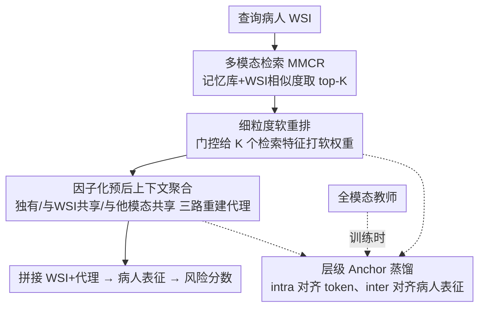

# Factorized Context Aggregation for Robust Cancer Risk Estimation via Soft Re-Ranked Retrieval and Hierarchical Anchors

**会议**: CVPR 2026  
**论文**: [CVF Open Access](https://openaccess.thecvf.com/content/CVPR2026/html/Moghadam_Factorized_Context_Aggregation_for_Robust_Cancer_Risk_Estimation_via_Soft_CVPR_2026_paper.html)  
**代码**: https://github.com/pazadimo/fca-robust-risk-estimation  
**领域**: 医学图像  
**关键词**: 癌症风险预测, 缺失模态, 软重排检索, 因子化上下文聚合, 师生蒸馏  

## 一句话总结
这篇论文针对"训练时有基因/病理报告等多模态、但推理时只有病理切片(WSI)"的真实临床场景，提出以 WSI 为锚、从记忆库检索相似病人的多模态特征并做软重排，再用因子化交叉注意力把缺失模态的代理表征拆成"模态独有 + 与 WSI 共享 + 与其他模态共享"三路重建，最后用全模态教师做层级 anchor 蒸馏；在 8 种癌症 24 个缺失场景上把生存预测 C-index 推到 0.617，比纯组织学基线相对提升约 8.5%，离全模态上界仅差约 1.4%。

## 研究背景与动机
**领域现状**：癌症生存/风险预测是个性化治疗的基础。近年的主流是多模态做法——把病理切片(WSI)与基因表达、病理报告、临床变量等互补模态融合，比单模态组织学模型有更强的预后能力。

**现有痛点**：多模态模型几乎都默认"所有模态都在"，但现实临床里基因测序昂贵、需专门设备、还会破坏组织，常常缺失；唯独 WSI 是常规、普遍可得、信息密集的。于是出现"训练时多模态、推理时缺模态"的鸿沟。已有处理缺失模态的方法分两类：数据中心法(对缺失模态做填补/生成重建)容易引入噪声、把显著特征过平滑；策略法(注意力融合、知识迁移、prompt)只盯模态共享知识，却丢掉了缺失模态里独有的关键预后信号。

**核心矛盾**：癌症风险预测里，每个模态都携带细粒度且互补的预后线索(报告给分期与专家判断、组织学给微环境形态、基因给分子驱动)，因此"既要补回缺失模态的独有信息、又要利用跨模态共享信息"。但数据中心法只顾填信息、策略法只顾共享，二者各执一端；而且 WSI 高达 10 万×10 万像素、基因高达 6 万维，跨模态整合的可扩展性也是难题。现有少数针对性方法还常做简化假设——只支持一个辅助模态、把基因粗暴裁到 1500 维、或把任务退化成离散风险分类——进一步丢信息。

**本文目标**：在推理时只有 WSI、训练时可用任意数量/类型辅助模态的前提下，估计一个对缺失模态鲁棒的病人级风险分数。

**切入角度**：作者假设要真正解决缺失模态，必须把"数据中心(补回独有信号)"和"策略中心(利用共享信号)"两条路**混合**起来；并且不靠生成像素级重建，而靠"从相似病人那里检索代理特征"——因为 WSI 形态相似的病人，其基因/报告往往也有预后相关性。

**核心 idea**：以 WSI 为唯一锚点，从全模态记忆库检索 top-K 相似病人的多模态特征，用门控软重排给它们打细粒度重要性权重，再用因子化交叉注意力把每个缺失模态的代理表征拆成"独有/与 WSI 共享/与其他模态共享"三部分重建，并用全模态教师做层级 anchor 蒸馏约束整个检索-聚合流程。

## 方法详解

### 整体框架
对查询病人 $P_q$，模型只拿到其 WSI $S_q$，目标是估计风险分数 $\hat r_q$。流程是：先把训练集里全模态病人编码进一个**向量化记忆库** $B$；查询时用 WSI 嵌入检索 top-K 相似病人，**取回他们各模态的特征**；对每个缺失模态，先用**软重排**给 K 个检索特征打权重，再用**因子化上下文聚合**把它们重建成该模态的代理表征 $\hat C^j_q$；把 WSI 与所有代理拼起来过多模态头得到病人表征 $R_q$，送入风险估计器。训练时额外引入一个见过全模态的**教师**，用 intra/inter 两级 anchor 蒸馏对齐学生的 token 级和病人级表征。推理时教师和真实辅助模态都不需要，只有 WSI 一路前向。

### 关键设计

**1. 多模态检索与向量化记忆：以 WSI 形态相似度取回缺失模态的"现成"特征**

针对"缺失模态没法凭空生成、生成又会引噪"的痛点，作者不重建像素而是**检索**。先用各模态专用基础模型(FM)把训练集全模态病人编码进记忆库 $B=\{F^{(WSI)}(S_n),\{F^{(m)}(C^{(m)}_n)\}_{m=1}^M\}_{n=1}^N$。查询时只用 WSI FM 取查询切片嵌入 $z^{WSI}_q=F^{(WSI)}(S_q)$，再按相似度取最相似的 K 个病人 $N_q=\mathrm{TopK}\big(\mathrm{sim}(z^{WSI}_q,z^{WSI}_n)\big)$，把这些病人**所有其他模态**的特征 $\{\hat z^{(1)}_k,\dots,\hat z^{(M)}_k\}_{k\in N_q}$ 一并取回。关键在于：作者刻意**不用联合隐空间检索**——那种做法只抓模态共享语义、会把模态独有特征过平滑掉；而单凭 WSI 检索能在"形态相似(共享)"的同时保留各模态"独有"信息，检索集更丰富多样。而且检索只在全模态病人上做一次，计算成本低、可迁移性好。

**2. 细粒度软重排：给检索回来的 K 个邻居打模态相关的软权重，避免均值过平滑**

初始 top-K 检索只是粗近似，对每个邻居一视同仁地平均会过平滑、丢掉细微的风险相关差异。作者加一个**门控软重排**：对模态 $m$ 把 K 个检索特征堆成 $\hat Z^{(m)}_q\in\mathbb R^{K\times d}$，过可学习门控 $h^{(m)}_q=\hat Z^{(m)}_q W_{gate}+B_{gate}$，再得软分数

$$SR_{(q,m)}=\alpha+\sigma\big(h^{(m)}_q\big)$$

其中 $\sigma$ 是逐元素 sigmoid，标量偏置 $\alpha$ 保证每个邻居有一个最小贡献(不被完全压成 0)。这样得到每个邻居的软重要性 $SR_{(q,m)}\in\mathbb R^{K\times 1}$。重点是排序**逐模态独立**计算——不同模态的特征空间该被赋的权重不同，软权重(相对硬排序/均匀聚合)能自适应捕捉"检索内容"与"缺失模态风险特性"之间的细微依赖。

**3. 因子化预后上下文聚合：把每个缺失模态的代理拆成"独有 + 与 WSI 共享 + 与他模态共享"三路重建**

直接把所有检索信息混在一起聚合，会让独有信号和共享信号纠缠不清。作者对每个缺失模态 $j$ 的代理 $\hat C^j_q$ 做**因子化**重建。先构造模态级 token：WSI token 用观测到的 $z^{WSI}_q$ 投影，其余模态 token 用软权重加权的检索特征

$$T^{(m)}_q=\begin{cases}W^{(WSI)}\!\cdot z^{WSI}_q,& m=WSI\\[2pt] W^{(m)}\!\cdot\sum_{i=1}^{K}SR^{(q,m)}_i\cdot \hat Z^{(m)}_i,& \text{otherwise}\end{cases}$$

然后做**因子化交叉注意力**：以模态 $j$ 的 token 为 query，对每个模态 $m\in\{WSI,1,\dots,M\}$ 算注意力 $\alpha^{j,m}_q=\mathrm{softmax}\big(f^j_Q(T^j_q)\cdot f^j_K(T^m_q)/\sqrt{d_h}\big)$，最终

$$\hat C^j_q=\alpha^{j,j}_q f^j_V(T^j_q)+\alpha^{j,WSI}_q f^j_V(T^{WSI}_q)+\sum_{\ell\neq j}\alpha^{j,\ell}_q f^j_V(T^\ell_q)$$

三项分别对应：模态 $j$ 自身检索来的**独有信息**、模态 $j$ 与 **WSI 共享**的信息、模态 $j$ 与**其他辅助模态共享**的信息。这正是把"数据中心(补独有)"与"策略中心(用共享)"合二为一的落点——既做模态特定推理又做共享上下文对齐。最后把 WSI 和所有代理拼接过多模态头 $R_q=\mathrm{MMhead}(\mathrm{Concat}(S_q,\hat C^1_q,\dots,\hat C^M_q))$ 得到病人表征，用于风险预测。

**4. 层级模态 Anchor：用全模态教师同时约束 token 级检索和病人级聚合**

只靠生存损失监督，重建出的代理可能偏向低层保真/记忆训练模式、缺乏语义约束。作者引入一个用相同骨干 FM、能看到全模态训练的**教师**做蒸馏锚点，分两级。**Intra-Modality Anchor** 对齐细粒度：让每个生成 token $T^{(m)}_n$ 逼近教师对应模态表征，$L_{intra}=\frac1N\sum_n\sum_m D_{KL}\big(T^{(m)}_n\,\|\,R^{(m)}_{Teacher,n}\big)$，逼软重排去检索/排序真正预后相关的特征。**Inter-Modality Anchor** 对齐粗粒度：让学生病人级表征逼近教师的，$L_{inter}=\frac1N\sum_n D_{KL}(R_n\|R_{Teacher,n})$，保证聚合后的整体多模态结构正确。两者像"知识锚"贯穿从软重排到因子化聚合的整条信息流，让代理表征反映真实多模态分布，而非死记训练样本。

### 损失函数 / 训练策略
总目标是生存损失加两个 anchor 项：$L_{total}=L_{surv}+\lambda_{intra}L_{intra}+\lambda_{inter}L_{inter}$。其中 $L_{surv}$ 是负偏对数似然(Cox partial likelihood)，对更早发生事件的病人赋更高风险分；$\lambda_{intra},\lambda_{inter}$ 平衡两级蒸馏。教师和真实辅助模态只在训练时用，推理时仅 WSI 一路。三个模态专用 FM 中，WSI FM(类 AB-MIL 的大 MIL 架构)和基因 FM(仿 BulkRNABert 的掩码自监督)均自训练以杜绝数据泄漏，报告用 OpenBioLLaMA-7B 编码。

## 实验关键数据

### 主实验
在 8 个 TCGA 数据集(CESC/COAD/HNSC/LGG/LIHC/LUAD/LUSC/SARC)上做 3 折交叉验证，评估生存排序 C-index；每个数据集下设 H+G†、H+R†、H+G†+R† 三种缺失场景(† 表示该模态仅训练可见、推理缺失)，共 24 个场景。对比纯组织学基线、全模态上界，以及 6 个缺失模态 SOTA。

| 配置(平均 C-index↑) | 组织学基线 | 最佳 SOTA | 全模态上界 | 本文 |
|------|------|------|------|------|
| H + G† | 0.569 | ~0.594 | 0.615 | **0.617** |
| H + R† | 0.569 | ~0.601 | 0.613 | **0.613** |
| H + G† + R† | 0.569 | ~0.604 | 0.649 | **0.621** |
| Overall | 0.569 | 0.597 | 0.626 | **0.617** |

本文在 24 个场景里 16 个拿到最高 C-index(最佳基线仅 4 个)，相对组织学基线提升约 8.5%，离全模态上界仅约 1.4% 相对差距；对最强两个 SOTA 的 Wilcoxon 符号秩检验 $p<0.05$。有意思的是在最难的 H+G†+R† 设置下多数基线掉点，本文反而最好——作者解释为弱相关/带噪辅助模态被软重排去噪后，模型更聚焦主导的组织学线索。

### 病人分层与语义对齐
分层用 Kaplan–Meier + Log-Rank 检验(显著性 0.05)与 hazard ratio(HR)衡量临床可用性。

| 模型 | 显著分层场景(/24) | 平均 HR↑ |
|------|------|------|
| 组织学基线 | 3 (13%) | 1.35 |
| 最佳 SOTA | 12 (50%) | ≤1.56 |
| 全模态上界 | 15 (63%) | 1.70 |
| 本文 | **16 (67%)** | **1.67** |

仅用 WSI + 记忆库，本文在分层能力上超过所有 SOTA、逼近全模态上界(相对 SOTA 多分出约 17% 的场景)。语义对齐上(H+R† 设置)用 Boltzmann Semantic Score 衡量视觉特征与报告语言嵌入的一致性，本文 0.3549，相对 CycleR(0.3378)/CrossKD(0.3342)/EgoKD(0.3316) 等基线提升约 5–25%。

### 消融实验
逐模块累加(Overall 平均 C-index)：

| 配置 | Overall C-index | 说明 |
|------|------|------|
| 组织学基线 | 0.569 | 仅 WSI，不补缺失 |
| + 软重排(MMCR) | 0.593 | 检索+软权重，已明显超基线 |
| + 因子化上下文聚合 | 0.607 | 此配置即已超过此前 SOTA |
| + Intra Anchor | 0.609 | 细粒度蒸馏 |
| + Inter Anchor(单加) | 0.609 | 粗粒度蒸馏 |
| Full(两级 Anchor) | **0.617** | 完整模型 |

### 关键发现
- 贡献最大的单一模块是**因子化上下文聚合**(0.593→0.607)，且只加它就已超过所有此前 SOTA；说明"把代理拆成独有/共享多路"是核心增益来源，而非单纯检索。
- 两级 anchor 单独加都只到 0.609，**一起加才到 0.617**——粗细两级蒸馏互补，缺一不可。
- 检索深度 K 有 trade-off：K 太小上下文不足掉点；对报告检索(H+R†)K 太大会过平滑、稀释语义；基因检索(H+G†)则中高 K 更稳；整体中等 K 最佳。
- 鲁棒性强：即便训练集里 40% 辅助模态缺失，本文仍优于用完整模态训练的最强 SOTA。

## 亮点与洞察
- **"检索代理"替"生成重建"**：不去像素级生成缺失模态，而是借相似病人的现成特征当代理，绕开了生成模型引噪/过平滑的老问题——这个思路可迁移到任何"训练多模态、推理缺模态"的医学任务。
- **因子化三路注意力**是把"数据中心 vs 策略中心"两派合一的关键落点：用一个注意力分解式就同时表达了模态独有信息和两类共享信息，机制干净且可解释。
- **单凭 WSI 相似度检索而非联合隐空间**这个看似保守的选择，恰恰是保住模态独有信号的关键，作者把"为什么不用联合隐空间"讲得很到位。
- 在最难的双缺失场景反而最好，提示软重排有去噪正则效果——弱相关辅助模态不一定有益，过滤冲突输入能稳住小样本多模态学习。

## 局限与展望
- 检索依赖一个"全模态参考池"，参考池的代表性/规模若不足(或与目标人群分布偏移)，代理质量会受限；论文称池不需很大，但跨机构泛化未充分验证。⚠️ 具体参考池规模与外部验证以原文/附录为准。
- 整套训练需要一个全模态教师，对真正"训练时也大面积缺模态"的机构而言，教师本身就难训(虽实验显示 40% 缺失仍可用)。
- 评测集中在 TCGA 8 个癌种，且 C-index 绝对值多在 0.55–0.68 区间，临床落地仍偏弱；3D 影像等更大模态未纳入。
- 改进方向：按模态做多次 per-modality 检索(作者提到能进一步提升精度但增成本)、为不同模态自适应选 K、以及引入比 KL 更强的分布对齐目标。

## 相关工作与启发
- **vs 数据中心法(CycleR / Shaspec 等重建/生成)**：它们在输入层重建缺失模态，异质场景下易受噪声与伪影、过平滑细粒度特征；本文不重建而检索代理 + 软重排去噪，鲁棒性更好。
- **vs 策略法(EgoKD / CrossKD 等知识蒸馏、AcMAE 掩码 transformer)**：它们靠模态共享知识降损失，但丢掉缺失模态的独有信息；本文用因子化聚合显式保留"独有"那一路。
- **vs LDVAE(CVPR'25，最近的鲁棒癌症风险估计器)**：基于变分自编码、受限于只用 WSI+基因且基因子集稀疏、风险离散化；本文不限模态数量/类型、连续风险建模、表达力更强，在多数场景超过它。

## 评分
- 新颖性: ⭐⭐⭐⭐⭐ "检索软重排 + 因子化三路代理 + 层级 anchor 蒸馏"首次把数据中心与策略中心两派系统融合，机制清晰。
- 实验充分度: ⭐⭐⭐⭐⭐ 8 癌种 24 场景 + 分层 + 语义对齐 + 模块/K/缺失率多维消融，且有显著性检验。
- 写作质量: ⭐⭐⭐⭐ 方法因子化公式讲得清楚，但模块命名(MMCR/FGCA)较多、首读需要回查图。
- 价值: ⭐⭐⭐⭐⭐ 直击"临床推理只有 WSI"的真实痛点，逼近全模态上界，落地价值高。

<!-- RELATED:START -->

## 相关论文

- [\[ICML 2026\] Auditing Sybil: Explaining Deep Lung Cancer Risk Prediction Through Generative Interventional Attributions](../../ICML2026/medical_imaging/auditing_sybil_explaining_deep_lung_cancer_risk_prediction_through_generative_in.md)
- [\[NeurIPS 2025\] Mamba Goes HoME: Hierarchical Soft Mixture-of-Experts for 3D Medical Image Segmentation](../../NeurIPS2025/medical_imaging/mamba_goes_home_hierarchical_soft_mixture-of-experts_for_3d_medical_image_segmen.md)
- [\[CVPR 2026\] Better than Average: Spatially-Aware Aggregation of Segmentation Uncertainty Improves Downstream Performance](better_than_average_spatially-aware_aggregation_of_segmentation_uncertainty_impr.md)
- [\[CVPR 2026\] Real2Sim2Real: RetinalDepth-64K for Depth Estimation in Posterior Segment Ophthalmic Surgery](real2sim2real_retinaldepth-64k_for_depth_estimation_in_posterior_segment_ophthal.md)
- [\[CVPR 2026\] FedVG: Gradient-Guided Aggregation for Enhanced Federated Learning](fedvg_gradient-guided_aggregation_for_enhanced_federated_learning.md)

<!-- RELATED:END -->
