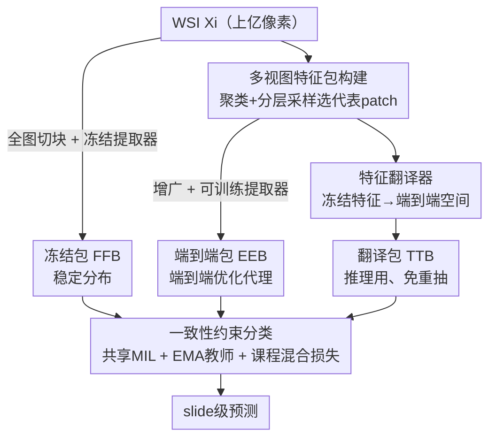

# FBTA: Enabling Single-GPU End-to-End Gigapixel WSI Classification with Feature Bridging and Translation Alignment

**会议**: CVPR 2026  
**论文**: [CVF Open Access](https://openaccess.thecvf.com/content/CVPR2026/html/Dong_FBTA_Enabling_Single-GPU_End-to-End_Gigapixel_WSI_Classification_with_Feature_Bridging_CVPR_2026_paper.html)  
**代码**: 待开源（原文称 "The code will be available"）  
**领域**: 医学图像  
**关键词**: 计算病理, 全切片图像(WSI), 多示例学习(MIL), 端到端训练, 特征翻译  

## 一句话总结
FBTA 用「伪包代理 + 特征翻译 + 三视图一致性约束」三招，把动辄上亿像素的全切片图像（WSI）的多示例学习（MIL）压进单张 24GB GPU 做真正的端到端训练，相比直接全图端到端提速 100× 以上，并能即插即用地给三种 MIL 架构、两种特征提取器一致涨点（ABMIL 在 STAD 上准确率 +15.8%）。

## 研究背景与动机
**领域现状**：计算病理里，一张 20× 放大的 WSI 可达 10 万 × 10 万像素，没法整张塞进 GPU。主流做法是两阶段「patch-to-bag」：先把 WSI 切成 patch（示例），用一个**冻结**的特征提取器 $f_\text{FFE}$ 把每个 patch 编码成特征并缓存，再用一个可训练的 MIL 网络 $f_\text{MIL}$ 把这些特征聚合成 slide 级预测。

**现有痛点**：因为 $f_\text{FFE}$ 全程冻结、不随下游任务更新，缓存特征和分类目标之间存在一道**语义鸿沟（semantic gap）**——无论提取器是在自然图像上预训练、还是在病理图上做自监督，这道鸿沟都在，直接卡住分类天花板。

**核心矛盾**：鸿沟的根源其实是**显存约束逼着提取器只能冻结**。想消除鸿沟就得让提取器参与训练（端到端），但一张 WSI 几万个 patch 一起反传，单张 24GB 卡（如 RTX 3090）最多只放得下约 400 个示例，根本不可能。

**已有方案为何不够**：工程派靠多 GPU 模型并行或梯度检查点扩容，但硬件成本高、系统复杂、训练慢，医院/研究环境难落地；算法派如 Local Learning 用局部监督替代端到端，但只适用低倍率 WSI、仍很吃算力，没真正打通端到端。作者强调：在此之前，**没有任何方法能在单张 24GB GPU 上对 20× WSI 做真正的端到端 MIL**。

**核心 idea**：不必把整张 WSI 都端到端跑——用一个**有代表性的 patch 子集（伪包）**当代理来训练提取器，再用一个**冻结视图**稳住训练分布，最后用一个**特征翻译器**把缓存的冻结特征「翻译」成端到端特征，从而推理时既享受端到端的收益、又不必重新抽全图特征。

## 方法详解

### 整体框架
FBTA 分两步。**第一步 Multi-View Bag Formation（多视图特征包构建）**：对每张 WSI $X_i$ 同时构造三种互补的特征包——① **冻结包** $F^{FB}_i$（用冻结提取器对全部 patch 抽特征）；② **端到端包** $F^{EB}_i$（先 KMeans 聚类 + 分层采样选一小撮代表性 patch 成子集 $X^{SB}_i$，随机增广后送进**可训练**提取器 $f_\text{TFE}$）；③ **翻译包** $F^{TB}_i$（一个可训练翻译器 $f_T$ 把子集的冻结特征 $F^{SB}_i$ 映射进端到端特征空间）。三个包的示例严格一一对应。**第二步 Consistency-Constrained Bag Classification（一致性约束的包分类）**：三种包共享同一个 MIL 网络 $f_\text{MIL}$ 出预测，再叠加一个 EMA 教师提供时序平滑的一致性监督，三网络 $f_\text{TFE}, f_\text{MIL}, f_T$ 联合更新。

三个视图各司其职是理解全文的钥匙：$F^{EB}_i$ 只含极少示例（$CM \ll N_i$），是**端到端优化的代理**；$F^{FB}_i$ 分布稳定，**稳住 MIL 训练**、给频繁变化的端到端特征减负；$F^{TB}_i$ 让**推理时免去昂贵的重抽特征**。

### 关键设计

**1. 多视图特征包构建：用伪包代理全图、绕开显存墙**

痛点很直接：整张 WSI 几万 patch 一起端到端反传放不下单卡。FBTA 借鉴 DBPAug 的发现——「无放回示例采样（ISR）构造的伪包足以代表整张 WSI、且对伪包标签噪声鲁棒」，进一步把 ISR 和 **KMeans 聚类 + 分层采样**结合：先把冻结特征集 $F^{FB}_i$ 聚成 $C$ 个簇，给每个 patch 打簇标签，再从每个簇随机采 $M$ 个示例，凑成 patch 子集 $X^{SB}_i$ 与对应特征子集 $F^{SB}_i$（一一对应）。分层采样保证每种组织模式都被采到，比纯随机采样更能保住 WSI 的整体语义分布。子集 patch 经随机增广 $X^{AB}_i$ 后，送进与 $f_\text{FFE}$ 同架构的**可训练**提取器 $f_\text{TFE}$，得到端到端伪包 $F^{EB}_i$。因为只有 $CM \ll N_i$ 个示例参与，端到端训练的开销被砍到能在单卡上跑——实测 $M{=}1$ 时单次迭代能吃下 5 万+ 示例、ABMIL 只需约 8GB 显存（全图端到端最多 400 个示例就 OOM）。

**2. 特征翻译器：把冻结特征「翻译」成端到端特征、推理免重抽**

新痛点出现在推理：要享受端到端收益就得对全部 patch 用 $f_\text{TFE}$ 重抽一遍特征，慢得离谱（验证集上重抽要 120 分钟）。FBTA 引入一个实例级翻译器 $f_T$，把缓存好的冻结特征 $F^{SB}_i$ 映射进端到端特征空间，且保持示例顺序、与 $F^{SB}_i$、$F^{EB}_i$ 一一对应。$f_T$ 由 $K$ 个**带残差连接的并行 MLP 头**组成，输出取平均：$F^{TB}_i = \frac{1}{K}\sum_{k=1}^{K} f_{T[k]}(F^{SB}_i)$。这种多头集成让翻译器在追踪「训练中快速变化的目标 $F^{EB}_i$」时更鲁棒——多个投影平均能更稳地逼近移动靶；实验里 $K$ 越大（直到 10）效果越好。翻译比重抽快 200× 以上（120 min → 27 s），既能快速推理、又能在验证时调超参，还不丢端到端的收益。

**3. 一致性约束的包分类：EMA 教师 + 课程式混合损失**

三个视图共享同一个 $f_\text{MIL}$ 并分别出预测 $\tilde{Y}^{FB}_i, \tilde{Y}^{EB}_i, \tilde{Y}^{TB}_i$，先算交叉熵分类损失（$C(\cdot)$ 为交叉熵）：

$$L_{i,\text{cls}} = C(\tilde{Y}^{FB}_i, Y_i) + C(\tilde{Y}^{EB}_i, Y_i) + C(\tilde{Y}^{TB}_i, Y_i)$$

由于 $f_\text{TFE}$ 每步都在变，端到端特征分布不稳，瞬时训练噪声容易把决策边界抖乱。于是引入一个 EMA 教师 $f^{*}_\text{MIL}$ 给出时序平滑的监督，对三视图各做一致性约束（$\phi(\cdot)$ 为余弦相似度一致性损失）：

$$L_{i,\text{cls}*} = \phi(\tilde{Y}^{FB}_i, \hat{Y}^{FB}_i) + \phi(\tilde{Y}^{EB}_i, \hat{Y}^{EB}_i) + \phi(\tilde{Y}^{TB}_i, \hat{Y}^{TB}_i)$$

同理，可训练提取器的 EMA 版 $f^{*}_\text{TFE}$ 为翻译器提供平滑目标，每个 MLP 头都去回归 $X^{SB}_i$ 抽出的特征（$L_2$ 距离）：$L^{TB}_{i,\text{dist}} = \frac{1}{K}\sum_{k=1}^{K} L_2\big(f_{T[k]}(F^{SB}_i),\, f^{*}_\text{TFE}(X^{SB}_i)\big)$。最终混合损失对 EMA 分类项加**课程系数** $t/T$（$t,T$ 为当前/总 epoch 数），避免早期教师不稳时一致性约束过强：

$$L_i = L^{TB}_{i,\text{dist}} + L_{i,\text{cls}} + (t/T)\cdot L_{i,\text{cls}*}$$

翻译器损失因为是对伪包内多个示例求平均、本身就平滑，所以无需课程加权。$f_\text{TFE}, f_\text{MIL}, f_T$ 每步联合更新，$f^{*}_\text{TFE}, f^{*}_\text{MIL}$ 每个 epoch 末用 EMA 更新。

### 损失函数 / 训练策略
推理时：翻译器 $f_T$ 把缓存的、含**全部**示例的冻结包 $F^{FB}_i$ 映射进端到端空间，再用 EMA 教师 $f^{*}_\text{MIL}$ 出最终预测 $\tilde{Y}^{EB}_i = f^{*}_\text{MIL}(f_T(F^{FB}_i))$。原文用 Lipschitz 连续性分析论证「推理时用 $F^{TB}_i$ 代理 $F^{EB}_i$」的合理性（细节在补充材料，⚠️ 以原文为准）。超参：簇数 $C{=}100$，每簇采样 $M{\in}\{1,2\}$（$M$ 越大训练越慢），MLP 头数 $K{=}10$（$K{=}10\to20$ 时 AUC 几乎不变但显存翻倍）。

## 实验关键数据

数据集为基于 TCGA-NSCLC（肺腺癌 vs 肺鳞癌，few-shot：每类 20/50/100 张 WSI）与 TCGA-STAD（肠型/弥漫型/管状腺癌三分类，刻意把管状型从肠型拆出做细粒度难题）。每张 patch 为 256×256、20× 放大，单张 24GB RTX 3090，8 个种子重复。

### 主实验（即插即用涨点，ImageNet 预训练提取器）
FBTA 作为即插即用框架，对 ABMIL / TransMIL / MambaMIL 三种 MIL、ResNet-50 / ViT-B/32 两种提取器一致涨点。下表摘 ResNet-50 的代表性结果（AUC / ACC / F1，%）：

| 数据集 | MIL | Vanilla (AUC/ACC/F1) | +FBTA (AUC/ACC/F1) | ACC 提升 |
|--------|-----|----------------------|--------------------|----------|
| STAD | ABMIL | 67.9 / 42.5 / 34.0 | 70.6 / 58.3 / 57.1 | **+15.8%**（F1 +23.1%） |
| STAD | MambaMIL | 75.9 / 55.0 / 53.1 | 78.3 / 64.2 / 63.6 | +9.2% |
| NSCLC-Shot50 | ABMIL | 75.7 / 68.4 / 69.5 | 90.2 / 81.5 / 80.8 | **+13.1%**（AUC +14.5%） |
| NSCLC-Shot100 | ABMIL | 84.7 / 70.5 / 71.5 | 91.2 / 82.9 / 82.6 | +12.4% |

关键现象：加了 FBTA 后，经典的 ABMIL 性能逼近更强的 MambaMIL，把传统 MIL 和 SOTA MIL 的差距基本抹平。FBTA 对自监督预训练提取器（SimSiam-ResNet50 / DINO-ViT）和数据增广方法（DTFD-AFS）也能再叠加涨点，无需改动其预训练流程。

### 效率对比（vs 全图端到端 / Local Learning）
| 方法 | NSCLC-S20 AUC | NSCLC-S20 ACC | 每 epoch 时间 | 显存 |
|------|--------------|--------------|--------------|------|
| Direct/Adapter/LoRA 微调 | — | — | — | **OOM** |
| Local Learning | 72.1 | 68.6 | 306 s | 24 GB |
| ABMIL+FBTA | **82.1** | **73.3** | **27 s** | **4 GB** |

全图端到端在 24GB 上最多放 400 个示例就 OOM，而 FBTA（$M{=}1$）单次迭代能处理 5 万+ 示例、约 8GB 显存，提速达数百倍；特征提取阶段翻译比重抽快 200×+（120 min → 27 s，见下「翻译 vs 重抽」）。

### 消融实验（三视图贡献，NSCLC-Shot20，平均）
| 用到的视图 | 平均 AUC | 平均 ACC | 说明 |
|------------|---------|---------|------|
| Vanilla MIL | 74.3 | 67.1 | 基线 |
| 仅 $F^{EB}_i$ | 73.2 | 66.2 | 只端到端，域偏移掩盖收益 |
| $F^{EB}_i + F^{FB}_i$ | 76.8 (+3.6) | 69.3 (+3.1) | 加冻结包稳训练、显著涨 |
| $F^{EB}_i + F^{FB}_i + F^{TB}_i$ | 77.6 (+0.8) | 71.0 (+1.7) | 加翻译包再涨、且免域偏移 |

其它消融：可训练 $f_\text{TFE}$ vs 冻结，冻结会大幅掉点（ABMIL ACC 70.1→52.9），印证联合端到端训练的必要性；伪包构造 KMeans 分层采样 vs 纯随机表现相近（FBTA 对此鲁棒，最终选 KMeans 防小肿瘤区的标签噪声）。

### 关键发现
- **冻结视图是「稳定剂」**：只用端到端特征几乎等于 vanilla（域偏移掩盖了端到端收益），加进冻结包后才把域偏置压下去、稳住 MIL 训练——三视图缺一不可。
- **翻译器是落地关键**：120 min → 27 s 的 200× 提速让「验证时调超参 + 快速推理」变得可行，否则端到端推理在临床根本跑不动。
- **数据越稀缺、任务越难，涨点越猛**：STAD 细粒度三分类 ABMIL 准确率直接 +15.8%，说明 FBTA 对消除冻结特征域偏移在 few-shot 场景尤其有效。

## 亮点与洞察
- **「三视图分工」的解耦思路很巧**：把「端到端优化」「训练稳定性」「推理效率」三个相互拉扯的目标，分别交给端到端包、冻结包、翻译包三个视图，再用共享 MIL + 一致性损失把它们黏起来——一个框架同时解决三个矛盾，思路可迁移到任何「训练吃显存、推理要快」的大输入任务。
- **特征翻译器把「移动靶」问题工程化解决**：端到端特征随提取器每步在变，作者不去追求让翻译器一次到位，而用 $K$ 头 MLP 集成平均来稳健逼近移动目标，并用 EMA 教师给平滑监督——这套「集成 + EMA 平滑」组合可复用到任何蒸馏不稳的场景。
- **课程式一致性权重 $t/T$ 是个低成本好 trick**：早期教师不靠谱就少信它，随训练线性加权，避免一致性约束在早期把模型带偏。

## 局限与展望
- 评测集中在 TCGA-NSCLC/STAD 的 few-shot 子型分类，分类类别少（2~3 类）、规模偏小；在大规模、多中心、更多癌种上的泛化性还需验证（⚠️ 论文未覆盖）。
- 推理用 $F^{TB}_i$ 代理 $F^{EB}_i$ 的合理性靠 Lipschitz 分析背书，但翻译器毕竟是近似，极端组织模式下翻译误差是否会放大、影响诊断安全，文中未深入讨论。
- 伪包靠采代表性子集，若肿瘤区极小、被采样漏掉，可能损失关键信息——作者也是出于这点才选 KMeans 分层采样防标签噪声，但极端小肿瘤的稳健性仍是开放问题。
- 仍依赖一个预训练的冻结提取器来产出 $F^{FB}_i$ 和聚类，提取器质量会影响伪包与翻译的上限。

## 相关工作与启发
- **vs 两阶段冻结 MIL（ABMIL / TransMIL / MambaMIL）**：它们冻结提取器、只训 MIL，留着语义鸿沟；FBTA 即插即用地让提取器参与端到端训练来填鸿沟，因此能在这些方法之上一致涨点，而非替换它们。
- **vs 工程派（多 GPU 并行 / 梯度检查点）**：它们靠堆硬件/复杂系统扩显存，门槛高、训练慢；FBTA 从算法层用伪包代理把问题压进单卡，4GB 显存即可，更易在医院/研究环境落地。
- **vs Local Learning（局部监督近似端到端）**：它只适用低倍率 WSI、受局部监督限制、性能次优、还慢（306 s/epoch、24GB）；FBTA 在 20× WSI 上做真端到端，AUC +10%、ACC +4.7%，且 27 s/epoch、4GB。

## 评分
- 新颖性: ⭐⭐⭐⭐⭐ 首个单张 24GB GPU 上对 20× 千兆像素 WSI 做真端到端 MIL，三视图 + 特征翻译的解耦设计有原创性
- 实验充分度: ⭐⭐⭐⭐ 覆盖三 MIL × 两提取器 × 多数据集 + 充分消融与效率分析，但数据集规模/癌种偏少
- 写作质量: ⭐⭐⭐⭐ 动机—三视图角色—损失推导链条清晰，图表自洽
- 价值: ⭐⭐⭐⭐⭐ 把端到端 MIL 的显存门槛从多卡/OOM 拉到单张消费级卡，对计算病理落地意义大

<!-- RELATED:START -->

## 相关论文

- [\[CVPR 2026\] Turning Pre-Trained Vision Transformers into End-to-End Histopathology Whole Slide Image Models for Survival Prediction](turning_pre-trained_vision_transformers_into_end-to-end_histopathology_whole_sli.md)
- [\[NeurIPS 2025\] Revisiting End-to-End Learning with Slide-level Supervision in Computational Pathology](../../NeurIPS2025/medical_imaging/revisiting_end-to-end_learning_with_slide-level_supervision_in_computational_pat.md)
- [\[CVPR 2026\] Post-training Feature Pruning for Fundus Images Classification](post-training_feature_pruning_for_fundus_images_classification.md)
- [\[CVPR 2026\] Dual-Level Hypergraph Generation for Addressing Feature Scarcity in Whole-Slide Image Classification](dual-level_hypergraph_generation_for_addressing_feature_scarcity_in_whole-slide_.md)
- [\[CVPR 2026\] SAR2Net: Learning Spatially Anchored Representations for Retrieval-Guided Cross-Stain Alignment](sar2net_learning_spatially_anchored_representations_for_retrieval-guided_cross-s.md)

<!-- RELATED:END -->
