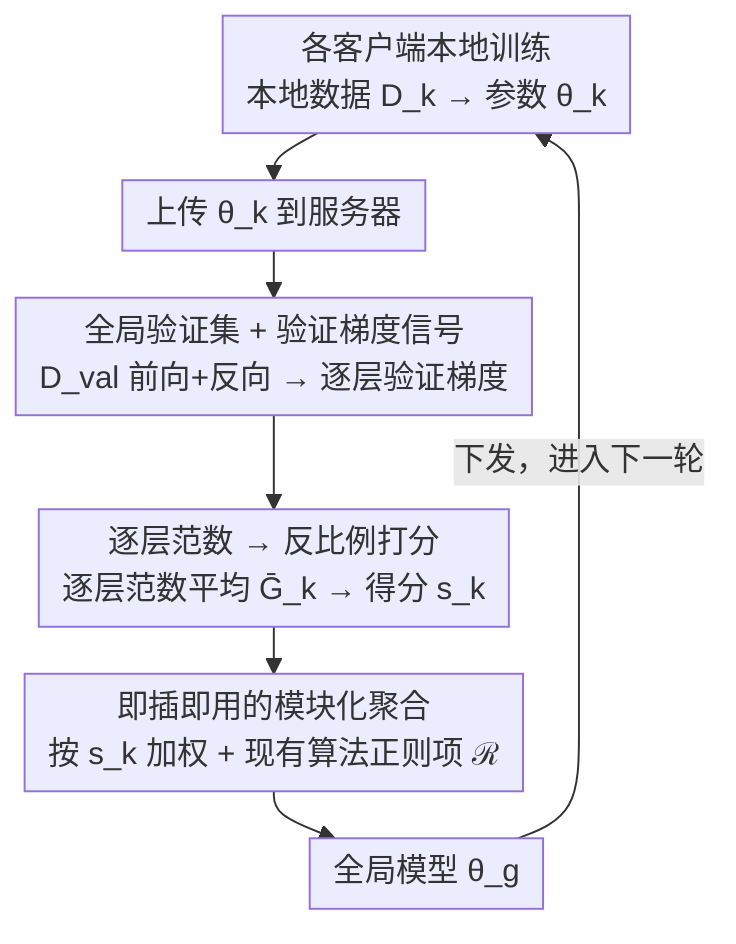

<!-- 由 src/gen_stubs.py 自动生成 -->
# FedVG: Gradient-Guided Aggregation for Enhanced Federated Learning

**会议**: CVPR 2026 Findings  
**arXiv**: [2602.21399](https://arxiv.org/abs/2602.21399)  
**代码**: [Project Page](https://machine-intelligence-lab-wvu.github.io/fedvg/)  
**领域**: 医学图像 / 联邦学习  
**关键词**: 联邦学习, 梯度聚合, 数据异质性, 验证梯度, Fisher信息矩阵, 医学图像分类

## 一句话总结

FedVG 提出利用全局验证集上的逐层梯度范数为各客户端打分，梯度越平坦（范数越小）的客户端获得越高聚合权重，从而在高度数据异质性场景下显著提升联邦学习的泛化性能。

## 背景与动机

1. **联邦学习中的客户端漂移问题**：标准 FedAvg 按数据量加权聚合，忽略了客户端数据分布差异导致的模型漂移（client drift），在 non-IID 场景下全局模型性能严重下降。
2. **数据量 ≠ 模型质量**：现有方法假设数据量越大的客户端模型越可靠，但在异质分布下，拥有大量偏斜数据的客户端反而可能拖累全局模型。
3. **过度强调表现差的客户端**：部分方法对表现不佳的客户端赋予过高权重进行"补偿"，反而加剧了聚合偏差。
4. **局部梯度的偏差性**：仅依赖客户端本地数据计算的梯度天然偏向局部分布，无法客观反映客户端模型的泛化能力。
5. **层间行为差异被忽视**：不同层在 non-IID 场景下的收敛行为和漂移程度各不相同，尤其深层更容易受局部偏差影响，但现有方法很少进行逐层分析。
6. **医疗领域的迫切需求**：医疗影像数据天然分布在不同机构，受隐私法规限制无法集中共享，需要鲁棒的联邦学习方案来训练高质量诊断模型。

## 方法详解

### 整体框架

FedVG 想解决联邦学习里"按数据量聚合"的老毛病：在 non-IID 场景下，数据多但分布偏斜的客户端反而会把全局模型带偏。它的思路是在服务器端额外放一个**全局验证集** $D_{\text{val}}$（可由公开数据集构建），当成衡量泛化能力的"中立试金石"。一轮通信里：各客户端照常在本地数据上训练，把参数 $\theta_k$ 传到服务器；服务器拿 $D_{\text{val}}$ 对每个客户端模型跑一遍前向+反向，得到**逐层验证梯度**（取什么信号）；再把逐层梯度范数平均、做反比例打分得到客户端得分 $s_k$（怎么打分）；最后按 $s_k$ 加权聚合出全局模型并下发，进入下一轮（怎么聚合）。客户端本地训练完全不变，所有判别逻辑都挪到了服务器端。下面三个关键设计正好对应"取什么信号、怎么打分、怎么挂到现有算法"这三步。

### 关键设计

**1. 全局验证集 + 验证梯度信号：用中立参考集替代局部数据来判断客户端**

第一步要解决的是"拿什么当判据"。客户端本地数据天生偏斜，单看本地训练的梯度，信号本身就被自己的分布带偏，反映不了真实泛化。FedVG 在服务器端引入一个**与任何客户端无关的固定验证集** $D_{\text{val}}$——用与目标任务同模态、同类别的公开数据构建，不偏向任何一方，也不碰任何隐私数据。更关键的是：在这个验证集上**用梯度而非验证损失**当信号。论文指出，分类头往往吸收了大部分局部数据偏差，验证损失会过度反映最后一层的表现，掩盖深层表征的失配；而验证梯度不仅反映"模型现在表现如何"，还揭示"参数还需往哪个方向、多大幅度调整才能更好泛化"，信息量更丰富。于是每个客户端模型上传后，服务器都在 $D_{\text{val}}$ 上跑一遍前向+反向，得到逐层验证梯度作为后续打分的原料。

**2. 逐层范数 → 反比例打分：用损失面平坦度替代数据量来衡量客户端质量**

拿到验证梯度后，要把它压成一个可比较的标量分数。FedVG 的判据是：在验证集上谁的损失面更平坦，谁的泛化能力就更强。具体把客户端模型 $\theta_k$ 拆成 $L$ 层，逐层算验证梯度范数再取均值

$$\bar{G}_k = \frac{1}{L} \sum_{\ell=1}^{L} \left\| \nabla_{\theta_k^{(\ell)}} \mathcal{L}_{\text{val}} \right\|$$

之所以逐层而非把整模型当一团，是因为深层在 non-IID 下漂移更严重，分层能更细地捕捉这种层间差异。随后做反比例归一化——范数越小、说明模型已落在平坦区、几乎不用再调，就给越高的权重：

$$s_k = \frac{1/(\bar{G}_k + \epsilon)}{\sum_{j=1}^{K} 1/(\bar{G}_j + \epsilon)}$$

这个判据不是拍脑袋来的：交叉熵梯度就是负对数似然的 score function，它的范数正比于 Fisher 信息矩阵对角近似（Joint Fisher）的平方根，而小 Fisher 信息对应平坦最小值、对应更好的泛化。于是"验证梯度范数小 → 权重高"就有了信息论层面的依据，而非纯经验启发。

**3. 即插即用的模块化集成：只换聚合权重，不碰客户端**

最后是怎么把这套打分挂到现有 FL 框架上。FedVG 把通用聚合规则写成 $\theta_g^{t+1} = \left(\theta_g^t - \sum_{k} s_k \cdot \Delta\theta_k^{t+1}\right) + \mathcal{R}^{t+1}$，其中 $\mathcal{R}^{t+1}$ 是各方法特有的正则/修正项（FedAvg 为 0，FedDyn 是动态正则，FedAvgM/Scaffold 含动量或控制变量）。FedVG 的唯一改动就是把这里的客户端权重 $s_k$ 换成自己的梯度得分（或与原权重取均值），其余原样保留。正因为只动这一处，它可以和 FedAvg、FedProx、Scaffold、FedDyn、FedAvgM、Elastic 等算法无缝叠加，当作即插即用模块挂上去。客户端侧零额外开销，所有梯度计算都在服务器端完成，也不需要上传任何隐私敏感信息。

### 损失函数 / 训练策略

客户端本地训练仍用原始任务损失（如交叉熵），FedVG 本身**不引入额外损失项**，只通过验证梯度范数调整聚合权重，因此客户端计算开销保持不变。

## 实验关键数据

### 主实验：不同异质性程度下的性能

在 CIFAR-10（ResNet-18）、OrganAMNIST、COVID19（ResNet-50）上，以 Dirichlet $\alpha \in \{100, 10, 1, 0.1, 0.05\}$ 控制异质性：

| 方法 | CIFAR-10 (α=0.05) | OrganAMNIST (全部α) | COVID19 (α=0.05) |
|------|-------------------|---------------------|-------------------|
| FedAvg | 显著低于 FedVG | 全面低于 FedVG | 低于 FedVG |
| FedProx | 低于 FedVG | 低于 FedVG | 低于 FedVG |
| Scaffold | 中等 | 低于 FedVG | 接近但低于 FedVG |
| FedDyn | 显著低于 FedVG (p<0.05) | 低于 FedVG | 低于 FedVG |
| **FedVG** | **最高/近最高** | **全部α最优** | **α=0.05最优** |

- Wilcoxon 检验：FedVG 在所有 α 水平上显著优于 FedDyn (p<0.05)，无任何 baseline 在任何 α 上显著优于 FedVG
- ViT 实验（ViT-S/16, ViT-B/16）：FedVG 同样在高异质性下表现最优，验证了对非 CNN 架构的泛化能力

### 外部验证集实验

用 STL-10 和 CIFAR-100 作为外部验证集（与训练数据分布不同），在 α=0.1/0.05 下：

| 验证集 | α=0.1 | α=0.05 |
|--------|-------|--------|
| 原始 (CIFAR-10 子集) | 61.06% | 53.58% |
| STL-10 | 59.32% | 53.85% |
| CIFAR-100 | 58.83% | 52.62% |

即使验证集存在分布偏移，FedVG 仍保持优于 baseline 的性能。

### 消融实验

- **验证集类别不平衡**：随着不平衡率 ρ→0，FedVG 始终优于 FedAvg，验证了对不平衡验证集的鲁棒性
- **范数类型**：L1 和 L2 范数均能正确识别高质量客户端并赋予高权重，谱范数和 delta 范数效果较差；L1 (70.36%) 与 L2 (70.43%) 接近，均优于谱范数 (68.50%)
- **聚合粒度**：模型级（默认）在 CIFAR-10/OrganAMNIST 上最优；层级/块级在 COVID19/DermaMNIST (ResNet-50) 上略有优势，最优粒度取决于架构和数据特性

## 亮点

- **简洁有效**：核心思想清晰——用验证梯度平坦度衡量泛化能力，无需复杂的正则化或控制变量
- **理论基础扎实**：与 Fisher 信息矩阵建立了明确联系，为梯度范数作为泛化指标提供了信息论解释
- **即插即用**：仅修改服务器端聚合权重，不改变客户端训练流程，可与 6 种主流 FL 算法无缝集成
- **全面评估**：5 个数据集 × 3 种架构（ResNet-18/50, ViT）× 5 级异质性 × 多种消融，实验设计严谨
- **隐私友好**：验证集为公开数据，所有梯度计算在服务器端完成，不增加客户端计算负担

## 局限与展望

- **验证集构建假设**：需要一个与目标任务相关的公开数据集作为验证集，在某些医疗等专业领域中不一定容易获取
- **验证集与客户端数据重叠风险**：若验证集与某些客户端数据存在领域相似性或共享样本，可能引入不公平偏差
- **服务器端额外开销**：每轮需对所有参与客户端的模型做完整前向+反向传播，当客户端数量多或模型大时计算成本可观
- **聚合粒度选择**：模型级/层级/块级聚合效果因场景而异，缺乏自适应选择机制
- **未覆盖更复杂的 FL 场景**：如异构模型架构、不同本地训练轮次、客户端动态加入/退出等

## 与相关工作的对比

| 方法 | 核心思路 | 与 FedVG 的区别 |
|------|---------|----------------|
| FedAvg | 按数据量加权 | 忽略模型质量，高异质性下效果差 |
| FedProx | 近端正则化约束本地漂移 | 客户端侧修改，FedVG 仅修改服务器端 |
| Scaffold | 控制变量修正梯度 | 需额外通信控制变量，FedVG 无需 |
| FedDyn | 动态正则化对齐稳定点 | 统计显著低于 FedVG |
| Elastic | 基于参数敏感度插值聚合 | 强 baseline 但 FedVG+Elastic 可进一步提升 |
| FedMD/FedDF | 用公开数据做知识蒸馏 | 公开数据用于训练/蒸馏，FedVG 仅用于计算验证梯度 |
| FedNCL/FedMA | 逐层聚合 | 关注层间对齐但未利用验证梯度打分 |

## 评分

- 新颖性: ⭐⭐⭐⭐ — 验证梯度范数作为客户端泛化指标的思路新颖，Fisher 信息的理论联系有深度
- 实验充分度: ⭐⭐⭐⭐⭐ — 5数据集、多架构、多异质性级别、外部验证集、4类消融，覆盖全面
- 写作质量: ⭐⭐⭐⭐ — 结构清晰，理论推导完整，图示直观
- 价值: ⭐⭐⭐⭐ — 方法简洁实用、即插即用，对医疗等隐私敏感领域的联邦学习有直接应用价值

<!-- RELATED:START -->

## 相关论文

- [\[CVPR 2026\] OmniFM: Toward Modality-Robust and Task-Agnostic Federated Learning for Heterogeneous Medical Imaging](omnifm_toward_modality-robust_and_task-agnostic_federated_learning_for_heterogen.md)
- [\[CVPR 2025\] DFLMoE: Decentralized Federated Learning via Mixture of Experts for Medical Data](../../CVPR2025/medical_imaging/dflmoe_decentralized_federated_learning_via_mixture_of_experts_for_medical_data_.md)
- [\[CVPR 2026\] Personalized Longitudinal Medical Report Generation via Temporally-Aware Federated Adaptation](personalized_longitudinal_medical_report_generation_via_temporally-aware_federat.md)
- [\[CVPR 2026\] IEBGL:An Interpretability-Enhanced Brain Graph Learning Framework with LLM-Instructed Topology and Literature-Augmented Semantics](iebglan_interpretability-enhanced_brain_graph_learning_framework_with_llm-instru.md)
- [\[CVPR 2026\] Better than Average: Spatially-Aware Aggregation of Segmentation Uncertainty Improves Downstream Performance](better_than_average_spatially-aware_aggregation_of_segmentation_uncertainty_impr.md)

<!-- RELATED:END -->
