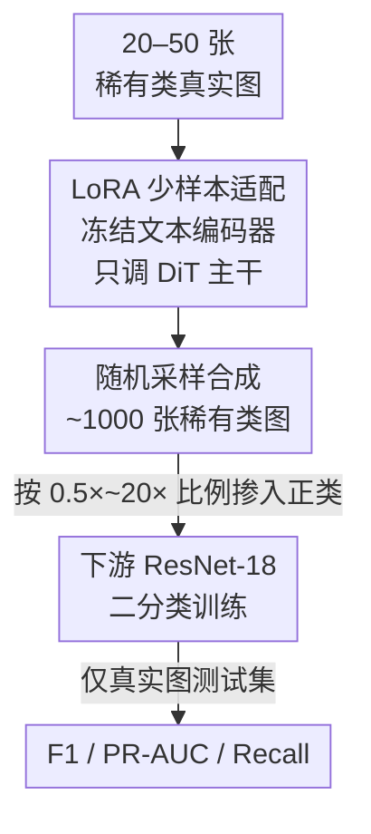

# Few-Shot Synthetic Data Generation with Diffusion Models for Downstream Vision Tasks

**会议**: CVPR 2026  
**arXiv**: [2605.11898](https://arxiv.org/abs/2605.11898)  
**代码**: 无  
**领域**: 医学图像 / 扩散模型 / 数据增强  
**关键词**: 少样本、LoRA 微调、合成数据增强、类别不平衡、稀有类检测

## 一句话总结
只用 20–50 张稀有类真实图给预训练扩散模型（FLUX.2-dev）做 LoRA 微调，生成约 1000 张合成样本来补充正类，在胸片病理分类和工业磁瓦裂纹检测两个差异极大的域上，把稀有类的 F1 / Recall 显著拉高（胸片 F1 0.193→0.686，磁瓦 0.051→0.296）。

## 研究背景与动机
**领域现状**：在安全攸关与工业场景里，稀有事件（罕见病理、偶发缺陷）天然样本极少，分类器对正类的 recall 往往很差。常规对策是数据增强，但传统增强只能做几何/光度变换，无法引入"全新"的视觉变化。

**现有痛点**：扩散模型能合成有语义意义的新样本，理论上是更强的增强手段，但训练/适配生成模型通常需要大数据集和大算力，在**只有几十张正样本**的少样本场景里几乎用不起来。

**核心矛盾**：稀有类的本质就是"正样本极少"——而能生成稀有类的生成模型恰恰又需要大量该类样本来训练，这是一个鸡生蛋的死循环。

**本文目标**：验证一个很务实的问题——能不能用参数高效微调（LoRA），从极小的真实集（20–50 张）适配一个**预训练**扩散模型，让它批量产出可用于下游训练的稀有类合成样本？并量化"合成/真实比例"对下游性能的影响。

**切入角度**：不从头训生成模型，而是借助大规模文生图扩散模型已有的先验，只用 LoRA 学"这个稀有类长什么样"；多样性完全靠采样时的随机种子获得，不做 prompt 工程。

**核心 idea**：用 LoRA 适配的扩散模型做稀有类合成 + 系统性扫描合成/真实比例，把"少样本稀有类增强"做成一条轻量、可跨域复用的流水线。

## 方法详解

### 整体框架
整条流水线就三步、单向串行：① 用约 50 张稀有类真实图对预训练扩散模型做 LoRA 微调；② 用微调后的适配器批量采样约 1000 张该类合成图；③ 把这些合成图按不同比例掺进下游分类器的正类训练集，并在**只含真实图的 held-out 测试集**上评估。整套方案刻意做得极简——不做生成图的人工筛选、不做 prompt 增强、不引入额外标注，目的就是验证"最朴素的少样本扩散增强"本身有没有用。

### 关键设计

**1. LoRA 少样本适配：用几十张图把大扩散模型"特化"到稀有类**

痛点是稀有类样本太少，常规生成模型训不动。本文对预训练文生图模型 FLUX.2-dev 做 DreamBooth 式 LoRA 微调，只在 DiT transformer 主干上插低秩更新、两个文本编码器全程冻结，从而仅更新极少量参数就能"记住"目标类的外观。配置为秩 $r=64$、$\alpha=8$、dropout $0.08$，用 8-bit AdamW 在 bf16 混合精度下训 200 步，学习率 $5\times10^{-3}$；为了塞进单张 A100 80GB，transformer 训练时被 NF4 量化。每张训练图共用一个固定 caption "a photo of <class name>"，不做任何后处理筛选。这样设计的关键在于：稀有类只需提供"这是什么样子"的少量锚点，绝大部分生成能力来自预训练先验，于是 20–50 张图就够用，把生成模型的数据门槛压到了少样本量级

**2. 纯随机种子驱动的合成采样：多样性不靠 prompt 工程而靠采样噪声**

把"怎么造出多样且不塌缩的样本"这个问题，本文用最克制的方式解决：每个适配器采样约 1000 张 512×512 图，去噪步数 20–24、无分类器引导（CFG）尺度 1.5–2.5，**多样性完全来自不同随机种子下的随机采样**，不用 prompt 增强、不用多模板 caption。由于 LoRA 只在稀有类上训过，模型几乎只会生成该类，于是产出的图天然全部归到下游正类、无需再打标签。作者用 LPIPS 与 PSNR 分布验证其有效性：PSNR 分布与真实图接近，说明像素级低层结构被保留；LPIPS 相对真实图有小幅偏移但整体形状相似，说明在深度特征空间里引入了语义层面的多样性——两者合起来表明生成样本既多样又没有 mode collapse

**3. 合成/真实比例扫描 + 仅真实图评估协议：把"合成数据有没有用"量化成一条曲线**

要回答"加多少合成数据合适"，本文系统扫描六档合成/真实比例——$0.5\times$、$1\times$、$2\times$、$4\times$、$10\times$、$20\times$（外加一个只用约 50 张真实正样本的 no-synth 基线，以及一个完全不用真实正样本的 synth-only 设置）。下游用 ImageNet 预训练的 ResNet-18、单输出二分类头，损失为 BCEWithLogitsLoss，正类权重按类别比例的倒数自动设置以应对不平衡。所有设置共享同一个**只含真实图**的 held-out 测试集，并做 5 折交叉验证、报告正类 F1、PR-AUC、Recall。这个协议的价值在于：合成图绝不进测试集，保证评估反映的是真实世界泛化；而比例扫描直接揭示出"适度增强收益最大、过量增强边际递减甚至轻微掉点"的规律

### 损失函数 / 训练策略
下游分类器用 BCEWithLogitsLoss，正类权重设为类别比例的倒数；扩散适配阶段沿用标准 DreamBooth-LoRA 目标。两阶段相互独立，生成端与判别端不联合训练。

## 实验关键数据

### 主实验
两个域均为严重不平衡的二分类（磁瓦裂纹 vs 非裂纹；胸片某稀有病理 vs 正常）。下表为不同合成比例下的下游性能（测试集仅真实图，5 折平均）：

| 数据集 | 合成比例 | F1 | PR-AUC | Recall |
|--------|---------|------|--------|--------|
| Magnetic Tiles | 0× (基线) | 0.051 | 0.141 | 0.063 |
| Magnetic Tiles | 4× (最佳 F1) | **0.296** | 0.313 | 0.423 |
| Magnetic Tiles | 20× | 0.235 | 0.311 | **0.658** |
| Magnetic Tiles | synth-only 20× | 0.310 | 0.375 | 0.614 |
| Chest X-ray | 0× (基线) | 0.193 | 0.846 | 0.130 |
| Chest X-ray | 4× (最佳 F1) | **0.686** | 0.677 | 0.744 |
| Chest X-ray | 20× | 0.537 | 0.741 | 0.540 |
| Chest X-ray | synth-only 20× | 0.439 | 0.738 | 0.465 |

磁瓦上 F1 从 0.051 提到 4× 时的 0.296，接近六倍提升；胸片上 F1 从 0.193 提到 4× 时的 0.686。Recall 随合成量单调上升，磁瓦 20× 时达 0.658，说明对稀有缺陷的检出能力明显增强。

### 消融实验
本文核心"消融"就是合成比例扫描本身，以及 synth-only 对照：

| 配置 | 关键发现 | 说明 |
|------|---------|------|
| no-synth 基线 | F1 极低（磁瓦 0.051 / 胸片 0.193） | 仅约 50 张真实正样本，几乎学不到稀有类 |
| 适度增强（4×） | 两域 F1 均最高 | 增益最大的甜点区 |
| 过量增强（10×–20×） | F1 回落、Recall 仍升 | 边际递减，合成过多会扭曲训练分布 |
| synth-only（20×） | Recall 尚可但整体不如混合 | 合成数据更适合做"增强"而非"替代"真实数据 |

### 关键发现
- **适度即最优**：两个域 F1 峰值都出现在 4×，再往上加合成数据 F1 反而下降——过量合成样本会扭曲训练分布，是边际递减甚至轻微负收益。
- **Recall 与 F1 解耦**：合成量越大 Recall 越高（磁瓦 20× 达 0.658），但精度被拉低导致 F1 回落，说明大量合成样本让模型"更敢报正类"但也更容易误报。
- **合成≠替代真实**：synth-only 设置下性能整体低于真实+合成混合，确认合成数据的正确用法是增强而非完全替代。
- **跨域稳健**：在模态、视觉结构、分布都迥异的医学影像与工业缺陷两域上趋势一致，说明该流水线的可迁移性来自预训练扩散先验而非某个域的特例。
- **生成质量诊断**：LPIPS/PSNR 分布显示生成样本保留低层结构（PSNR 接近真实）同时引入语义多样性（LPIPS 小幅偏移），无 mode collapse。

## 亮点与洞察
- **把"少样本"门槛压到 20–50 张**：靠 LoRA + 预训练先验，让原本需要大数据的扩散增强在几十张图的极端少样本场景可用，这是最实用的点。
- **极简到近乎"对照实验"的设计**：不做生成图筛选、不做 prompt 增强、多样性纯靠随机种子——这反而干净地证明了"朴素少样本扩散增强本身就有效"，把贡献和复杂 trick 解耦。
- **比例扫描给出可操作的工程结论**：4× 左右是甜点、过量递减，这条曲线对实际部署比单点 SOTA 更有指导意义。
- **跨域验证选得聪明**：医学影像（连续灰度纹理）与工业裂纹（局部结构缺陷）结构差异极大，同一套方法都涨点，迁移性论证有说服力。

## 局限与展望
- **绝对指标仍偏低**：磁瓦最佳 F1 仅 0.296，离实用还远；论文证明的是"相对提升"而非"达到可部署精度"。
- **未与传统/其他生成增强严格对比**：缺少与几何增强、GAN、其他扩散增强方法的横向 baseline，无法判断 LoRA-diffusion 是否优于更便宜的方案。
- **PR-AUC 不一致**：胸片基线 PR-AUC 高达 0.846，加合成后部分配置反而下降（如 4× 降到 0.677），说明增强主要改善的是阈值附近的 recall/F1，对整体排序能力未必正向，这一点论文未深究。⚠️ 该现象以原文表格为准。
- **每个域只测一个稀有类**：泛化结论建立在两个单类任务上，类别数、任务类型（检测/分割）扩展性未验证。
- **改进思路**：引入轻量生成样本质量过滤、与传统增强组合、自适应选择合成比例（而非固定扫描），有望进一步把绝对精度推高。

## 相关工作与启发
- **vs Azizi et al. (合成数据改进 ImageNet 分类)**：他们在大规模数据上用扩散合成提升通用分类，本文聚焦**极端少样本+稀有类**场景，把适配数据量压到 20–50 张，是同一思路在数据稀缺端的延伸。
- **vs DreamBooth / Custom Diffusion**：这些方法解决"用几张图特化新概念"的生成质量问题，本文直接复用其 LoRA 适配范式，但目标不是生成本身，而是**下游判别任务的增强效用**。
- **vs RoentGen 等医学扩散生成**：以往医学/工业合成多依赖大数据或专用模型，本文强调**少样本+跨域通用流水线**，并以下游 F1/Recall（而非感知质量）作为评判标准。

## 评分
- 新颖性: ⭐⭐⭐ 组合已有技术（LoRA+DreamBooth+扩散增强），创新在少样本极简化与跨域系统验证，非方法突破
- 实验充分度: ⭐⭐⭐ 两域+六档比例+5 折交叉验证扎实，但缺横向 baseline、每域仅一个类
- 写作质量: ⭐⭐⭐⭐ 动机清晰、流程简洁、结论可操作
- 价值: ⭐⭐⭐⭐ 给数据稀缺场景提供了一条低成本、可复制的稀有类增强实践方案

<!-- RELATED:START -->

## 相关论文

- [\[CVPR 2026\] SD-FSMIS: Adapting Stable Diffusion for Few-Shot Medical Image Segmentation](sd_fsmis_adapting_stable_diffusion_for_few_shot_medical_image_segmentation.md)
- [\[CVPR 2026\] RDFace: A Benchmark Dataset for Rare Disease Facial Image Analysis under Extreme Data Scarcity and Phenotype-Aware Synthetic Generation](rdface_a_benchmark_dataset_for_rare_disease_facial_image_analysis_under_extreme_.md)
- [\[CVPR 2026\] Interpretable Cross-Domain Few-Shot Learning with Rectified Target-Domain Local Alignment](interpretable_cross-domain_few-shot_learning_with_rectified_target-domain_local_.md)
- [\[CVPR 2026\] Focus on Background: Exploring SAM's Potential in Few-shot Medical Image Segmentation with Background-centric Prompting](focus_on_background_exploring_sams_potential_in_few-shot_medical_image_segmentat.md)
- [\[CVPR 2026\] Universal-to-Specific: Dynamic Knowledge-Guided Multiple Instance Learning for Few-Shot Whole Slide Image Classification](universal-to-specific_dynamic_knowledge-guided_multiple_instance_learning_for_fe.md)

<!-- RELATED:END -->
