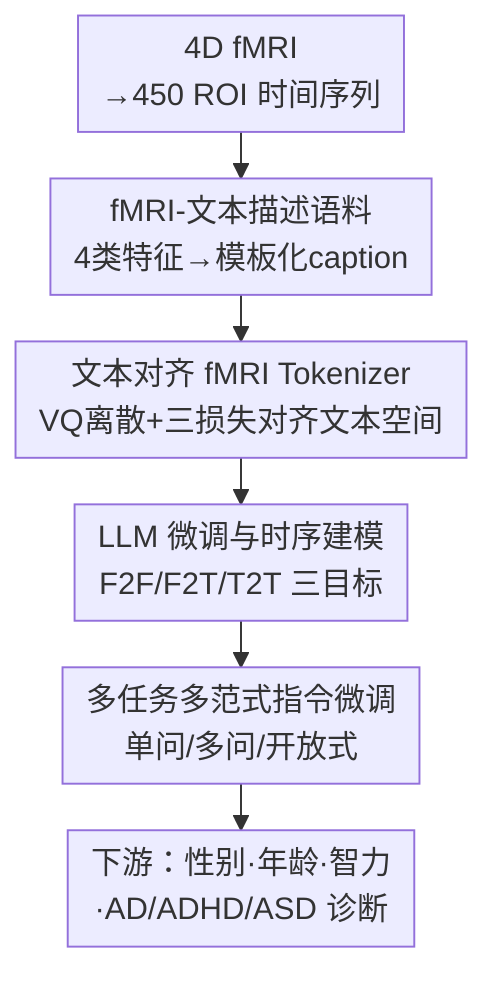

# fMRI-LM: Towards a Universal Foundation Model for Language-Aligned fMRI Understanding

**会议**: CVPR 2026  
**论文**: [CVF Open Access](https://openaccess.thecvf.com/content/CVPR2026/html/Wei_fMRI-LM_Towards_a_Universal_Foundation_Model_for_Language-Aligned_fMRI_Understanding_CVPR_2026_paper.html)  
**代码**: 无  
**领域**: 医学图像  
**关键词**: fMRI基础模型, 脑-语言对齐, 神经tokenizer, 指令微调, 多任务泛化  

## 一句话总结
fMRI-LM 用一套"先把脑信号离散成与文本嵌入空间对齐的 token、再让预训练 LLM 把脑活动当作可预测可描述的'语言'来建模"的三阶段框架，配上一套人工合成的 fMRI→文本描述语料补齐天然配对的缺失，在 7 个数据集上实现了用单一模型零样本/少样本完成性别、年龄、流体智力、AD/ADHD/ASD 诊断等多种任务，且 LoRA 微调即可达到甚至超过全量微调的效果。

## 研究背景与动机
**领域现状**：fMRI（功能磁共振）记录大脑 BOLD 信号，是无创观测脑活动的主流手段。早期深度学习（CNN/GNN）在性别预测、疾病诊断这类监督任务上表现不错，近两年又出现了 BrainLM、Brain-JEPA 这类"fMRI 基础模型"，靠掩码重建/对比学习在大规模脑影像上预训练，再迁移到下游。

**现有痛点**：这些 fMRI 基础模型仍被困在"纯神经信号目标"里——预训练只优化掩码预测或对比损失，下游每换一个任务就得重新做任务特定微调，而且完全没有"语言"接口，不能像多模态 LLM 那样用自然语言提问、生成解释。另一边，EEG 领域已经有人把神经信号量化成符号、对齐到 LLM，但他们用的是固定的"单问单答"模板，既没发挥 LLM 的生成与推理能力，做的也是 EEG 不是 fMRI。还有一些 fMRI-to-text 工作只服务于"任务态 fMRI + 明确刺激-文本配对"的解码场景，本质是把神经活动映射回呈现过的文字。

**核心矛盾**：要把 fMRI 接进 LLM，最大的障碍是**根本不存在天然的 fMRI–文本配对**。视觉-语言模型靠"图像+caption"做对齐，但 fMRI 是高维、抽象、没有现成文字描述的信号，缺了这座桥，LLM 就无从学习"描述脑功能"的语言语义。

**本文目标**：做一个能理解**静息态、任务无关**脑活动的通用 fMRI 基础模型，不依赖任务诱发的配对文本，并提供统一的语言接口同时支持建模与指令式问答。

**切入角度**：作者借鉴 MLLM 的"冻结 LLM + 模态编码器对齐文本空间"范式，并提出一个关键观察——既然影像派生特征（功能连接、图论指标、功能梯度、ICA 成分）本身就刻画了脑的"低层组织结构"，那就可以**把这些数值特征模板化成结构化文字描述**，人工造出 caption，充当连接低层神经组织与高层认知语义的桥梁。

**核心 idea**：用一套合成的"fMRI 影像特征→文本描述"语料把脑信号对齐进 LLM 的文本嵌入空间，然后把脑活动当成"一门语言"——可被时序预测、可被语言描述——交给预训练 LLM 统一建模和指令微调。

## 方法详解

### 整体框架
fMRI-LM 把"让 LLM 理解 fMRI"拆成三个串行阶段，外加一步离线的语料构造。输入是 4D fMRI $X_{raw}\in\mathbb{R}^{T\times X\times Y\times Z}$，先按 Schaefer-400（皮层）+ Tian-Scale III（皮层下）图谱分割成 $N=450$ 个 ROI 的时间序列 $X\in\mathbb{R}^{T\times N}$；输出是一个能用自然语言回答性别/年龄/疾病等多种问题、并能生成自由文本描述的统一模型。

整条管线是：**(0)** 先把每个 scan 的影像特征模板化成文本描述，造出合成的 fMRI–文本配对；**(Stage 1)** 训练一个把 fMRI 离散成 token、且这些 token 与冻结文本嵌入空间几何一致的 tokenizer；**(Stage 2)** 冻结 tokenizer，微调预训练 LLM，让它既能对脑 token 做时序"下一步预测"、又能据 fMRI 生成文本；**(Stage 3)** 在对齐好的 LLM 上做多任务、多范式指令微调，赋予高层语义理解能力。

### 关键设计

**1. fMRI-文本描述语料构建：用模板化 caption 补上不存在的天然配对**

这是整篇论文的地基，针对的正是"fMRI 没有天然文本"这个根本痛点。作者把每个 scan 用四个互补的特征域刻画：功能连接 FC、功能梯度 FG、图论指标 Graph、独立成分分析 ICA，每个域都同时给出 ROI 级与全局级的描述（如网络对连接强度、梯度方差、模块度/全局效率/平均聚类系数、网络 fALFF 等，共 23 个描述符）。所有脑测量都相对 UK Biobank 队列分布做 z-score 标准化，使跨被试可比，再把数值套进固定模板生成文字，最后用 DeepSeek-V3 把零散语句润色成连贯段落。此外还从人口学/认知/临床属性合成"高层被试描述"（仅在 Stage 3 的疾病/认知任务里作为可选输入）。为验证这些描述符确实携带有效信息，作者用 4 类描述符训练一个 BERT 分类器做 UKB 性别预测，"全部描述符"能达到约 70% 准确率，证明文本里真的编码了可判别的脑组织信息，而不是空话。这一步把"低层神经组织"翻译成"语言"，正是后续所有对齐的监督来源。

**2. 文本对齐 fMRI Tokenizer：把脑信号离散成与文本同几何的 token**

要让冻结 LLM 看懂非文本模态，必须先把输入编码到与文本嵌入"同一个几何空间"的离散表示。作者用一个 Transformer 编码器 $E_\theta$ 把 $X\in\mathbb{R}^{T\times N}$ 编成隐序列 $z=E_\theta(X)\in\mathbb{R}^{M\times C}$，其中 patch 只沿时间维切（$M=\lceil T/P\rceil\times N$），从而保留全部 ROI；再用向量量化 $Q$ 把每个 $z_m$ 映射到离散码 $\tilde z_m$。对齐靠三个损失合力完成：(i) 自编码重建，轻量解码器 $D_\phi$ 还原输入，$L_{quant}=\lVert X-D_\phi(\tilde z)\rVert_2^2 + L_{commitment}$，保证信息保真；(ii) **域对抗对齐**——从冻结 LLM（如 GPT-2）用 OpenWebText 的 token 采样文本嵌入，训练一个域分类器判别 token 来自 fMRI 还是文本，并在编码器与分类器之间插一个梯度反转层（GRL）逼迫"混淆"，$L_{domain}=-\frac{1}{M}\sum_m\big[t_m\log C(z_m)+(1-t_m)\log(1-C(z_m))\big]$（$t_m=1$ 表 fMRI），让 fMRI 嵌入在 LLM 空间里"伪装"成文本；(iii) **对比跨模态对齐**——用设计 1 的合成描述构成 fMRI–文本正负对，采用 SigLIP 式对比损失 $L_{contrast}=-\frac{1}{B}\sum_i\log\frac{\exp(\sigma\cdot\mathrm{sim}(z_i,z_i^+))}{\sum_j\exp(\sigma\cdot\mathrm{sim}(z_i,z_j^+))}$ 拉近配对、推远非配对。总目标为

$$L_{tokenizer}=L_{quant}+L_{contrast}+\lambda L_{domain},\quad \lambda=0.5$$

三个损失分工明确：重建保结构、域对抗保"看起来像文本"、对比保"语义配得上对应文字"，三者合起来才让离散神经 token 既不丢 fMRI 信息又贴合文本嵌入几何。

**3. LLM 微调与时序建模：把脑活动当成可自回归预测的"语言"**

拿到离散 fMRI token 后，作者冻结 tokenizer、微调预训练 LLM，让它同时具备神经与语言能力。记 token 序列 $z=\{z_{(w,n)}\}$，$w=1,\dots,T'$ 是时间、$n=1,\dots,N$ 是 ROI。与标准 LM"预测下一个词"不同，fMRI 有时空结构，作者改成**时间维的下一步预测**：给定时刻 $w$ 全部 $N$ 个 ROI 的 token，预测 $w+1$ 时刻的 $N$ 个 token。训练用三个互补范式：**F2F**（fMRI→fMRI 时序预测）$L_{F2F}=-\sum_{w=1}^{T'-1}\sum_{n=1}^{N}\log P_\theta\big(I_{(w+1,n)}\mid z_{(w,1)},\dots,z_{(w,N)}\big)$，捕捉神经活动的时序依赖；**F2T**（fMRI→文本）据脑 token 生成描述文本；**T2T**（文本→文本）拿随机文本做标准语言建模，保住 LLM 原有语言能力不被"灾难性遗忘"。合并目标为

$$L_{LLM}=L_{F2T}+\alpha L_{F2F}+\beta L_{T2T},\quad \alpha=0.1,\ \beta=0.5$$

这一步的巧处在于：把脑信号纳入 LLM 的扩展词表后，"时序建模"和"文本生成"被统一成同一种自回归预测，而 T2T 项确保模型在学神经语义时不把语言能力丢掉——后者正是论文反复强调的、强性能所依赖的"语言先验"。本阶段可全量微调，也可用 LoRA。

**4. 多任务多范式指令微调：用三种难度递增的交互形式逼出泛化**

最后在对齐好的 LLM 上做指令微调，把下游任务统一表述成"自然语言问句 + 目标回答"，覆盖表型预测、认知状态分类、疾病诊断。三种范式难度递增：(i) 单问单答（"该被试性别？"→"Male"）；(ii) 多问多答（一次同时回答多个问题，如性别+是否 AD）；(iii) 开放式描述（生成自由文本，如综合解读被试特征）。值得注意的是，作者明确指出三种范式**主要当作难度递增的评测协议**，而非借此扩充训练语料——它们复用同一套监督（标签与属性），只是换成不同交互形式，用来探查模型在基础预测、多目标推理、自由生成上的能力。对回归目标（年龄、流体智力），由于 LLM 输出空间天然离散，作者用两种策略：线性探针（在隐表示上加轻量预测头）或把连续量离散成有序 bin 当分类做。指令微调时每个范式还用 LLM 改写出最多 200 个 paraphrase prompt 变体、训练中随机采样，避免过拟合到特定措辞。

### 损失函数 / 训练策略
三个阶段各训练 50 epoch，AdamW、学习率 $10^{-4}$、cosine 退火、batch size 32。Stage 1 冻结文本编码器、只训 fMRI tokenizer（temporal patch size 32，普通 VQ，可换 FSQ）；Stage 2/3 冻结 tokenizer、用全量或 LoRA 微调 LLM。数据统一重采样到 TR=2.0s、裁/插值到 160 个时间点、450 ROI，并做逐 ROI 时间维 robust z-score + site-wise 方差归一化以抑制扫描仪偏差。模型有 S/B/L 三档（可训参数 46M/174M/610M，不含底座 LLM），默认报告 fMRI-LM-B + GPT-2(124M)。

## 实验关键数据

数据涵盖 7 个数据集：UKB、ABCD 用于 Stage 1/2 预训练（各 80%/20% 划分），另有 HCP、HCP-A、ADNI4、ADHD200、ABIDE2 用于下游与零/少样本评测，年龄跨度 5–100 岁，涵盖性别、年龄、流体智力、AD、ADHD、ASD 等任务。

### 主实验（分类任务，Acc/AUC，括号为标准差）
fMRI-LM-B(G)=GPT-2 底座，fMRI-LM-B(Q)=Qwen3-0.6B 底座；与监督方法和 fMRI 基础模型对比，多数任务取得最优或次优。

| 数据集-任务 | 指标 | BrainLM | Brain-JEPA | BrainMass | fMRI-LM-B(Q) |
|--------|------|---------|-----------|-----------|--------------|
| UKB-Sex | Acc | 88.72 | 88.77 | 92.31 | **94.45** |
| HCP-Sex | Acc | 81.09 | 77.82 | 75.32 | **83.04** |
| ADNI-AD | Acc | 78.82 | 82.26 | 80.05 | **85.27** |
| ADHD200 | Acc | 71.22 | 72.04 | 66.19 | **78.57** |
| ABIDE2-ASD | Acc | 65.22 | 57.49 | 58.79 | **76.56** |

回归任务上（年龄 MAE↓、流体智力相关 $p$↑）同样领先，例如 UKB-Age MAE 从 Brain-JEPA 的 1.69 类水平到 1.80、相关性 $p$ 提到 0.85；HCP-A Fluid Comp MAE 4.60、$p$ 0.76，整体取得最佳或次佳。

### 消融实验
| 配置 | 现象 | 说明 |
|------|------|------|
| Full model | 基准 | 完整三阶段 + 配对描述符 |
| w/o 影像描述符（去 $L_{contrast}$+F2T） | 显著掉点，性别分类尤甚 | 证明合成 fMRI–文本配对是性能关键；ADNI-AD 略升，疑因预训练(UKB/ABCD)与 ADNI 疾病人群分布差异 |
| LoRA 替代全量微调 | 持平、HCP-Sex/ADHD 上甚至更好 | 仅调极少参数即可适配 fMRI，并保住 LLM 语言知识 |
| 预训练数据量 0%→100% | 单调上升；去 UKB 比去 ABCD 影响更大 | ABCD 偏儿童、存在域偏移；即便 0% 预训练仍有 ~70%(性别)/~50%(AD) |

### 关键发现
- **合成描述符是命门**：去掉影像描述符（即去掉预训练里的 fMRI–文本配对）会显著掉点，验证了"用语言监督桥接低层神经组织"这一核心假设。
- **LoRA 不输全量微调**：只调一小撮参数反而在部分任务更优，说明保住 LLM 语言先验、只学神经-语义映射是更稳的路径，也让模型在数据/算力受限时仍可用。
- **少样本快速适配**：严格零样本下表现一般，但仅 2 个标注样本性能就大幅回升；4-shot 在流体智力、ASD 上即可逼近用全量下游训练集的水平，说明学到的是通用脑表示。
- **多任务/多数据联合训练有益**：多问多答相对单问单答仅轻微退化（最大降幅在 ADNI 的 AD 预测），部分目标（性别、流体综合、flanker）反而更高；跨数据集联合训练通常进一步提升（ADNI 例外，疑因其生物标志驱动的疾病特异分布）。

## 亮点与洞察
- **"造 caption"补配对**：用模板化影像特征 + LLM 润色合成 fMRI–文本语料，绕开了"无天然配对"这一死结，思路可迁移到任何缺成对文本的科学信号（EEG、基因表达谱等）。
- **三损失对齐 tokenizer**：重建（保信息）+ 域对抗 GRL（伪装成文本）+ SigLIP 对比（语义配对）三者分工清晰，是把异模态塞进冻结 LLM 嵌入空间的一个干净配方。
- **"脑活动即语言"的时序自回归**：把"下一时刻 ROI token 预测"和"据脑生成文本"统一成同一种自回归，T2T 项防遗忘，体现了对"语言先验为何有用"的清醒认识。
- **范式即评测而非扩数据**：作者特意澄清三种问答范式是难度递增的评测协议、不偷偷扩充语料，这种实验诚实度值得称道。

## 局限与展望
- 主要聚焦**静息态** fMRI（因其可得性与标准化好），对任务态/刺激诱发场景的覆盖有限。
- 严格零样本表现偏弱，真正可用需要至少少量标注样本来"点火"。⚠️ 论文未充分讨论合成描述符模板化是否引入了系统性偏差（如所有 caption 共享模板结构，可能让对齐学到的是模板而非脑语义），这点值得警惕。
- ADNI-AD 上去掉描述符反而略升，暴露出"预训练人群（健康成人为主）与疾病特异队列分布失配"会削弱描述符对齐的收益，跨人群泛化仍是开放问题。
- 回归靠离散化/线性探针绕过 LLM 离散输出，本质是 workaround，连续量预测的"语言原生"方案仍待探索。

## 相关工作与启发
- **vs BrainLM / Brain-JEPA（fMRI 基础模型）**：它们靠掩码重建/对比做纯神经目标的预训练，仍需任务特定微调且无语言接口；本文把 fMRI 对齐进 LLM、用统一指令接口一网打尽多任务，且零/少样本迁移更强。
- **vs EEG-LLM 工作**：同样把神经信号量化对齐 LLM，但 EEG 那条线用固定单问单答模板、做的是 EEG；本文针对 fMRI，引入多范式问答与合成描述语料，发挥了 LLM 的生成与推理能力。
- **vs fMRI-to-text 解码**：那类工作依赖任务态刺激-文本配对、把神经活动映回呈现文字；本文目标是理解静息态、任务无关的脑模式，不依赖任务诱发配对，定位为通用基础模型。

## 评分
- 新颖性: ⭐⭐⭐⭐⭐ 首个把静息态 fMRI 对齐进 LLM 的语言对齐基础模型，"合成 caption 补配对 + 脑活动即语言"两点都新。
- 实验充分度: ⭐⭐⭐⭐ 7 数据集、分类+回归+零/少样本+多消融覆盖全面；但部分结果以图呈现、缺更细的数值表与显著性检验。
- 写作质量: ⭐⭐⭐⭐ 动机—方法—实验逻辑清晰，三阶段叙述明白；个别图文（如 zero-shot 段落）略仓促。
- 价值: ⭐⭐⭐⭐⭐ 为神经影像提供了可用语言统一交互、可 LoRA/少样本适配的范式，工程与科学价值都高。

<!-- RELATED:START -->

## 相关论文

- [\[CVPR 2026\] MedMO: Grounding and Understanding Multimodal Large Language Model for Medical Images](medmo_grounding_and_understanding_multimodal_large_language_model_for_medical_im.md)
- [\[CVPR 2026\] MLLM-HWSI: A Multimodal Large Language Model for Hierarchical Whole Slide Image Understanding](mllm-hwsi_a_multimodal_large_language_model_for_hierarchical_whole_slide_image_u.md)
- [\[CVPR 2026\] Bridging Brain and Semantics: A Hierarchical Framework for Semantically Enhanced fMRI-to-Video Reconstruction](bridging_brain_and_semantics_a_hierarchical_framework_for_semantically_enhanced_.md)
- [\[CVPR 2026\] Modeling the Brain's Grammar: ROI-Guided fMRI Pretraining for Transferable and Interpretable Vision Decoding](modeling_the_brains_grammar_roi-guided_fmri_pretraining_for_transferable_and_int.md)
- [\[CVPR 2026\] Continual Learning for fMRI-Based Brain Disorder Diagnosis via Functional Connectivity Matrices Generative Replay](forge_continual_learning_for_fmri_based_brain_disorder_diagnosis.md)

<!-- RELATED:END -->
