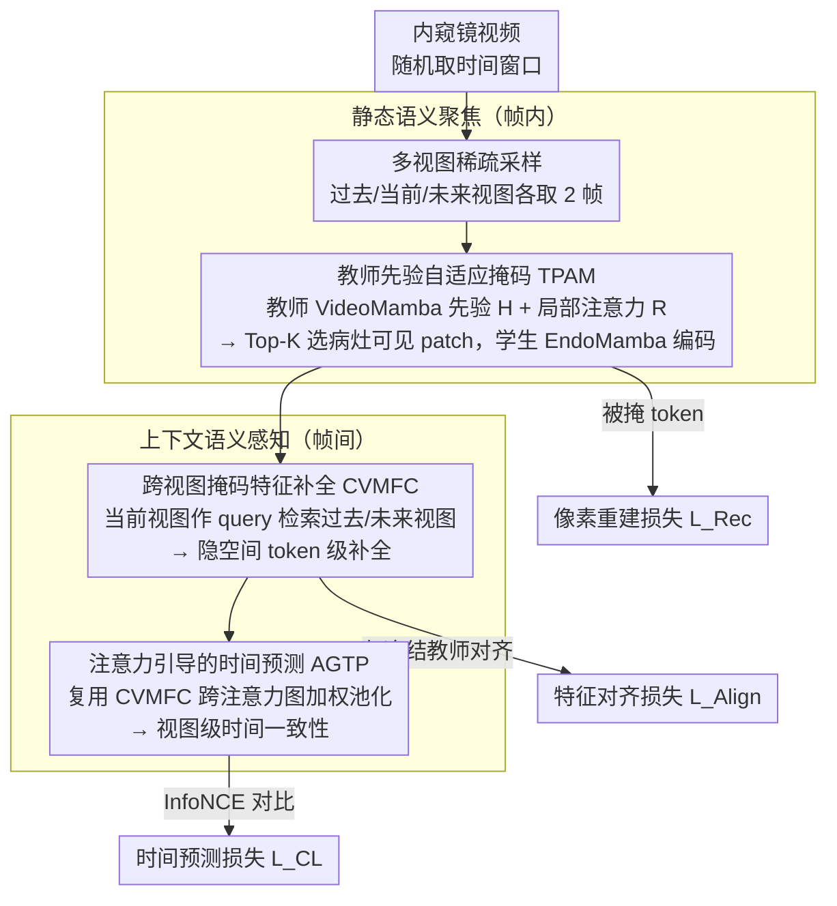

# Focus-to-Perceive Representation Learning: A Cognition-Inspired Hierarchical Framework for Endoscopic Video Analysis

**会议**: CVPR 2026  
**arXiv**: [2603.25778](https://arxiv.org/abs/2603.25778)  
**代码**: [有](https://github.com/MLMIP/FPRL)  
**领域**: Medical Imaging / 内窥镜视频分析  
**关键词**: 自监督学习, 内窥镜视频, 层次化语义建模, 掩码重建, Mamba

## 一句话总结

提出 FPRL，一个受临床认知启发的层次化自监督框架，通过先"聚焦"帧内病灶关键静态语义、再"感知"帧间上下文演化来缓解运动偏差，在 11 个内窥镜数据集上取得 SOTA。

## 研究背景与动机

内窥镜视频分析对胃肠道疾病的早期筛查至关重要，但高质量标注稀缺严重限制了算法性能。自监督视频预训练是应对标注不足的有力方向，然而现有方法（如 VideoMAE、VideoMAE V2 等）主要面向自然视频设计，强调密集时空建模和运动语义——这对动作识别等任务有效，但与内窥镜视频的核心特征相矛盾。

内窥镜视频的关键语义依赖于**静态、局部的视觉线索**（如病灶的形态、颜色和纹理），而非显著的时间动态。当密集时空建模直接迁移到内窥镜视频时，模型倾向于过度关注相机抖动、组织位移等无关运动（作者称之为"运动偏差"），忽略了对诊断至关重要的静态语义。

作者观察到，有经验的内镜专家在阅片时遵循"先聚焦、后感知"的认知模式：先仔细检查单帧中的语义显著区域（颜色、纹理异常），再追踪这些候选区域的时间演化。这一临床认知过程启发了 FPRL 框架的设计。

## 方法详解

### 整体框架

FPRL 把内镜专家"先聚焦、后感知"的阅片习惯拆成两个层次化组件来学：**静态语义聚焦**只在单帧内抓住以病灶为中心的局部线索（形态、颜色、纹理），**上下文语义感知**再去追踪这些线索在相邻帧之间怎么演化。两者叠在一起，既不丢诊断关键的静态语义，也不被相机抖动这类无关运动带偏。

整篇的载体是一个教师-学生的掩码重建框架。给定一个时间窗口，先稀疏采出过去、当前、未来三个视图；冻结的教师编码器（预训练 VideoMamba-S）只看当前视图、产出稳定的语义先验，从头训练的学生编码器（EndoMamba-S）处理被掩码后的视图。学生要做的事是：在教师先验的引导下挑出该看的病灶 patch，再从过去/未来视图里把当前视图被掩掉的特征补回来，从而把"聚焦"和"感知"两步都压进同一套自监督目标里。下图把这条 pipeline 画出来：上半部分（静态语义聚焦）对应关键设计 1-2、下半部分（上下文语义感知）对应关键设计 3-4，三路监督信号挂在对应模块之后。

### 关键设计

**1. 多视图稀疏采样：用稀疏视图压掉内窥镜视频的动态冗余**

直接套用自然视频那套密集时空建模，会让模型把注意力分到大量高度相似的相邻帧上，进而过拟合相机抖动、组织位移这类"运动偏差"。FPRL 反其道而行，在一个时间窗口里独立采样过去、当前、未来三个稀疏视图，每个视图只取 2 帧。视图内部帧少、动态冗余被压下去，迫使模型去看静态语义；视图之间又保留了足够的时间跨度，给后面的上下文感知留出可对齐的语义差异。

**2. 教师先验自适应掩码（TPAM）：让掩码优先落在病灶相关区域，而非均匀随机**

随机掩码不区分病灶和背景，学生很可能把宝贵的重建容量花在大片无意义的肠壁纹理上。TPAM 用两路信号决定哪些 patch 该保留可见：一路是教师的全局先验——对教师特征做 $\ell_2$ 归一化得到显著性图 $H$，天然偏向病灶相关 token；另一路是图像特定的局部信号——对当前视图嵌入施加一个轻量多头自注意力加线性投影，产出互补的显著性逻辑值 $R$。两路按

$$S = \alpha H + (1-\alpha) R$$

融合后，再用 Top-K 选出可见 patch、得到可学习的二值掩码 $M$，学生只对这批可见 patch 编码。这样表征能力被集中到病灶语义上，而不是被背景稀释。

**3. 跨视图掩码特征补全（CVMFC）：在隐空间里靠相邻视图把被掩掉的特征找回来**

光做帧内像素重建，学生学不到跨帧的语义对应——而内镜诊断恰恰要看病灶在相邻帧间的连续性。CVMFC 把当前视图被掩码的特征当成 query，去过去/未来视图里检索语义来补全：一个 Transformer 风格的块串起 cross-attention → self-attention → FFN，过去视图和未来视图分别作 key/value，输出两路补全特征 $z_c^p$ 和 $z_c^f$，再各自与冻结教师特征 $z_t$ 对齐。检索发生在隐空间而非像素空间，建立的是精细的、token 级的跨视图对应关系。

**4. 注意力引导的时间预测（AGTP）：在视图级别再加一层时间一致性约束**

CVMFC 给的是 token 级对应，但缺一个整体视图层面的时间一致性，容易出现局部对齐、全局漂移。AGTP 复用 CVMFC 已经算好的跨注意力图，对相邻视图的 token 做加权池化得到一个预测目标，目标头用 EMA 更新以提供稳定、非退化的监督，再与当前视图的全局平均池化特征做对比学习。它和 CVMFC 形成 token 级 + 视图级的双层对应，把"感知时间演化"这件事约束得更紧。

### 损失函数 / 训练策略

总损失由三部分加权组合：

$$\mathcal{L}_{total} = \lambda_1 \mathcal{L}_{Rec} + \lambda_2 \mathcal{L}_{Align} + \lambda_3 \mathcal{L}_{CL}$$

| 损失项 | 作用 | 权重 |
|--------|------|------|
| 像素重建损失 $\mathcal{L}_{Rec}$ | 恢复被掩码 token 的病灶纹理/边界细节 | $\lambda_1 = 1.0$ |
| 跨视图特征对齐损失 $\mathcal{L}_{Align}$ | 建立 token 级的时间对应（余弦相似度 + $\ell_2$ 一致性） | $\lambda_2 = 0.8$ |
| 时间预测对比损失 $\mathcal{L}_{CL}$ | InfoNCE 对比学习，保持视图级时间一致性 | $\lambda_3 = 1.0$ |

训练使用 AdamW 优化器，学习率 1.5e-4，余弦调度，400 个 epoch，batch size 64，前 40 个 epoch 线性 warmup。在 4 块 NVIDIA A800 上训练。

## 实验关键数据

### 主实验

| 方法 | 会议/年份 | 预训练时间(h) | PolypDiag F1(%) | CVC-12k Dice(%) | KUMC F1(%) |
|------|-----------|---------------|-----------------|-----------------|------------|
| Scratch | - | N/A | 83.5 | 53.2 | 73.5 |
| VideoMAE | NeurIPS'22 | 25.3 | 91.4 | 80.9 | 82.8 |
| Endo-FM | MICCAI'23 | 20.4 | 90.7 | 73.9 | 84.1 |
| M2CRL | NeurIPS'24 | 24.3 | 94.2 | 81.4 | 86.3 |
| EndoMamba | MICCAI'25 | 38.2 | 94.5 | 84.5 | 88.8 |
| **FPRL (Ours)** | - | **18.2** | **95.2** | **86.1** | **89.8** |

在相同模型架构下，FPRL 比 EndoMamba 分别提升了 0.7%/1.6%/1.0%，同时预训练时间减少了 52%。

### 消融实验

| $\mathcal{L}_{Rec}$ | $\mathcal{L}_{CL}$ | $\mathcal{L}_{pt}$ | $\mathcal{L}_{ft}$ | $\mathcal{L}_{pf}$ | 分类 | 分割 | 检测 |
|:---:|:---:|:---:|:---:|:---:|------|------|------|
| ✓ | | | | | 92.3 | 83.8 | 84.0 |
| ✓ | ✓ | ✓ | ✓ | | 94.2 | 84.0 | 86.1 |
| ✓ | ✓ | ✓ | ✓ | ✓ | **95.2** | **86.1** | **89.8** |

掩码策略消融：

| 掩码策略 | 分类(%) | 分割(%) | 检测(%) |
|---------|---------|---------|---------|
| Random | 93.8 | 85.6 | 87.8 |
| Adaptive | 94.5 | 85.6 | 83.9 |
| Teacher-Prior + Adaptive (Ours) | **95.2** | **86.1** | **89.8** |

最优掩码比例为 90%，过高（95%）或过低（70%）都会降低性能。

### 关键发现

- 层次化语义建模（分离静态 + 上下文语义）是性能提升的核心
- 双路径掩码补全（past + future）比单路径分别提升约 1.9%/2.0%/3.6%
- 教师先验与自适应掩码的组合效果最佳，仅用其一不能充分捕获病灶特征
- 4 层 decoder + 1 个 CVMFC block 就够了，更深的设计导致特征过度平滑

## 亮点与洞察

1. **认知启发的设计范式**：将临床医生"先聚焦、后感知"的诊断流程系统地转化为技术方案，具有很强的可解释性
2. **运动偏差的显式建模**：明确提出内窥镜视频的"运动偏差"概念，并通过层次化框架系统地应对
3. **效率优势**：预训练时间仅 18.2h，比 EndoMamba（38.2h）少 52%，比 VideoMamba（55.4h）少 67%
4. **TPAM 设计精巧**：将教师网络的全局先验与轻量注意力头的局部信息融合，使掩码学习具有自适应性

## 局限与展望

- 单帧预训练变体因内窥镜常见伪影（运动模糊、光照闪烁、镜面反射）效果不佳
- 未来可探索质量感知采样策略，避免低质量帧对训练的干扰
- 框架目前仅在内窥镜领域验证，向其他医学影像领域的泛化尚待探索
- Mamba 架构对超长序列的扩展性值得进一步研究

## 相关工作与启发

- EndoMamba 的双向/单向 Mamba 混合拓扑为 FPRL 提供了空间-时间解耦的基础
- 教师-学生范式借鉴了 BYOL 等自监督方法的 EMA 更新思想
- M2CRL 在多视图掩码对比学习方面的探索启发了 CVMFC 的设计
- 对于内窥镜视频分析这一特定领域，领域知识（如临床诊断流程）可以显著指导框架设计

## 评分

- **新颖性**: ⭐⭐⭐⭐ — "聚焦-感知"层次化范式原创性强，TPAM 融合教师先验与自适应注意力的设计有新意
- **实验充分度**: ⭐⭐⭐⭐⭐ — 11 个数据集、4 个下游任务、丰富的消融实验覆盖了掩码策略/比例/架构/损失等多个维度
- **写作质量**: ⭐⭐⭐⭐ — 动机清晰，方法描述系统，但数学符号较多可能增加阅读负担
- **价值**: ⭐⭐⭐⭐ — 对内窥镜视频领域的自监督学习有实质性推进，认知启发的设计思路可推广到其他医学影像分析任务

<!-- RELATED:START -->

## 相关论文

- [\[CVPR 2026\] Bridging Brain and Semantics: A Hierarchical Framework for Semantically Enhanced fMRI-to-Video Reconstruction](bridging_brain_and_semantics_a_hierarchical_framework_for_semantically_enhanced_.md)
- [\[CVPR 2026\] H2-Surv: Hierarchical Hyperbolic Multimodal Representation Learning for Survival Prediction](h2-surv_hierarchical_hyperbolic_multimodal_representation_learning_for_survival_.md)
- [\[CVPR 2026\] Unlocking Positive Transfer in Incrementally Learning Surgical Instruments: A Self-reflection Hierarchical Prompt Framework](unlocking_positive_transfer_in_incrementally_learning_surgical_instruments_a_sel.md)
- [\[CVPR 2026\] Masked-Diffusion Autoencoders for 3D Medical Vision Representation Learning](masked-diffusion_autoencoders_for_3d_medical_vision_representation_learning.md)
- [\[CVPR 2026\] KAMP: Knowledge-Anchored Multimodal Pretraining Framework for Medical Image Representation](kamp_knowledge-anchored_multimodal_pretraining_framework_for_medical_image_repre.md)

<!-- RELATED:END -->
