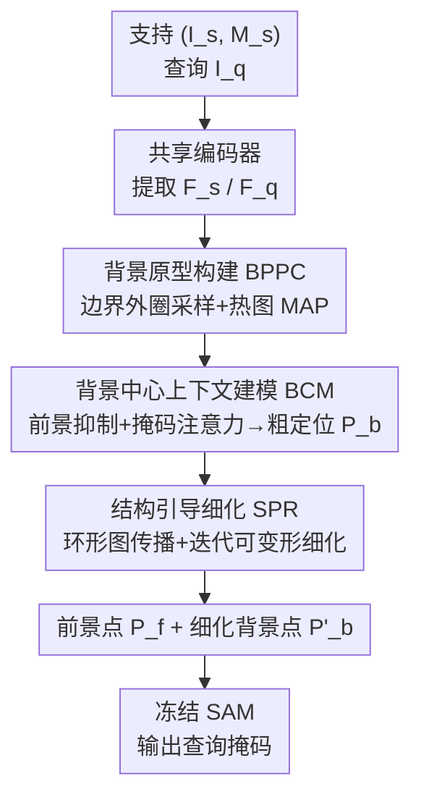

# Focus on Background: Exploring SAM's Potential in Few-shot Medical Image Segmentation with Background-centric Prompting

**会议**: CVPR 2026  
**论文**: [CVF Open Access](https://openaccess.thecvf.com/content/CVPR2026/html/Bo_Focus_on_Background_Exploring_SAMs_Potential_in_Few-shot_Medical_Image_CVPR_2026_paper.html)  
**代码**: https://github.com/primebo1/FoB_SAM  
**领域**: 医学图像  
**关键词**: SAM, 少样本医学分割, 背景提示, 提示定位, 结构先验

## 一句话总结
把"用 SAM 做少样本医学分割"重新定义为**背景点提示的定位问题**，提出即插即用的提示生成器 FoB——通过背景原型构建、背景中心的上下文建模和结构引导的迭代细化，在前景边界外圈生成准确的背景提示点来约束 SAM 的过分割，在三个医学数据集上大幅刷新 FSMIS 的 SOTA。

## 研究背景与动机
**领域现状**：少样本医学图像分割（FSMIS）主流是原型网络范式——把支持图像中目标类的像素特征做掩码平均池化（MAP）得到原型，再和查询特征比对来定位目标。近期工作开始把分割大模型 SAM 接进来：代表性的 ProtoSAM 先用一个 FSMIS 模型做粗分割，从概率图里挑高置信点当 SAM 的提示，从而让 FSMIS 模块和 SAM 解耦、独立训练。

**现有痛点**：SAM 在自然图像上很强，但直接用到医学图像会**严重过分割**。作者分析发现根因是 SAM 训练于自然图像，难以分辨医学图像中相邻器官/组织交界处那种低对比度、模糊的解剖边界，于是把边界外的区域也一并圈了进去。

**核心矛盾**：现有所有 SAM-based 方法（ProtoSAM、AM-SAM 等）都只生成**前景提示**，而作者的关键观察是——**准确的背景提示才是抑制过分割的关键**。光给前景点告诉 SAM "这里要分"，没有背景点告诉它"到这里为止"，SAM 自然会越界。

**本文目标**：在不微调 SAM、保持独立训练的前提下，造一个专门产出**高精度背景提示点**的生成器。这要解决两个难题：(1) 如何把"支持集的分割掩码"转成能引导查询图像点定位的描述子；(2) 新类别的背景点大多没有语义含义，怎么对它们做可靠定位——而且有效的背景点还得贴着类别边界，才能提供精准约束。

**核心 idea**：放弃"从分割图里抠提示"的思路，把提示生成**重定义为以背景为中心的点定位问题**，借鉴少样本关键点检测，直接学习把背景点定位到目标边界附近，并利用医学图像背景点天然呈"环形"分布的结构先验来逐步校正预测。

## 方法详解

### 整体框架
FoB 是一个**独立训练、推理时即插即用**的提示生成器：输入是支持图像-掩码对 $(I^s, M^s)$ 和查询图像 $I^q$，输出是查询图像上的一组前景提示点 $P_f$ 和细化后的背景提示点 $P'_b$，二者一起喂给冻结的 SAM 得到最终分割掩码。整条管线由三个协同模块串联：先用 **BPPC** 从支持掩码采样背景点并构建原型，再用 **BCM** 建模背景-前景的空间上下文、产出粗定位，最后用 **SPR** 施加环形结构约束、迭代细化背景点坐标。训练完全脱离 SAM 进行。

### 关键设计

**1. BPPC：把支持掩码"翻译"成贴边界的背景提示原型**

提示定位的第一个难题是怎么把一张二值分割掩码转成能引导点定位的描述子。BPPC 的做法是只在**前景边界外的窄环带**采样背景点：对支持掩码 $M^s$ 做两次不同半径的膨胀（核大小 $r=15$，$\epsilon=2$），取两者之差形成一个"差分环带"，再从环带里均匀采 $N_p$ 个点：$P = U\big(\rho(M^s, r) - \rho(M^s, r-\epsilon),\, N_p\big)$。这样采到的点天然贴着目标边界、且围绕前景一圈，正好符合"有效背景提示应靠近边界"的要求。

对每个采样点 $\mu_i$，以它为中心生成一张 2D 高斯热图 $G_i = N(\mu_i, \sigma)$，再用这些热图作为加权图对支持特征做掩码平均池化，得到背景提示原型：$p_b^i = \mathrm{MAP}(F_s, G_i) = \frac{\sum_{u,v} F_s(u,v) G_i(u,v)}{\sum_{u,v} G_i(u,v)}$。用高斯热图加权（而非单像素取值）能做局部加权平均、抑制混叠，得到更稳的点向量原型，作为后续在查询图像里匹配定位的"模板"。

**2. BCM：靠前景-背景的空间上下文给新类别定位背景点**

新类别的背景区域是非语义、无固定模式的，没法靠"认识这是什么"来定位。BCM 的思路是把"背景点相对前景的空间布局与相对关系"当作学习目标——这种上下文在新类别上依然成立。它分两步走。

第一步**前景抑制**：算查询特征与支持前景原型 $p_{fg}^s$ 的余弦相似度得到相关图 $C$，再用 $F_{sup} = (1 - C) \odot F_q$ 把前景区域数值上压低，让前景/背景在特征上先拉开。接着用原型生成一组粗提示提案 $\Phi = \xi^{-1}\big((A \odot PW_s)(W_q\,\xi(F_{sup}))\big)$，每个通道指示一个背景点的候选位置，其中 $A$ 是依条件于原型 $P$ 的通道注意力、用来区分不同的 $p_b^i$。

第二步**掩码注意力建模**：把 $F_{sup}$ 送入一个带掩码偏置的 Transformer，用提案 $\Phi$ 经 $B = \mathrm{ReLU}(C(\Phi))$ 转成软掩码偏置加进注意力 logits，让模型把注意力集中到被粗激活的背景点区域，通过像素级两两交互建模背景点与前景、背景点彼此之间的相对关系。最后一个轻量检测头输出背景点热图 $\hat{H}$，每个通道取最大响应位置得到一组**粗背景点坐标** $P_b = \{\mu_b^1, \dots, \mu_b^{N_p}\}$。消融显示 BCM 单独就带来 +4.11% Dice，是上下文推理对定位贡献最大的一环。

**3. SPR：用"环形结构先验"修掉离群的背景点**

BCM 把每个背景点当独立个体预测，常出现离群点——点塌缩成一团、或裂成几簇，破坏了医学图像背景点本该呈"环绕目标的环形"的规律。SPR 用结构先验来校正几何分布，含两个子步。

**图结构传播（SPG）**：构造一张图把支持端的结构编码并通过跨实例图卷积传给查询端。结构矩阵由两部分加权融合：自适应结构 $A_{ada} = \mathrm{softmax}\big(\frac{1}{\sqrt{C}} PW_\theta (PW_\phi)^\top\big)$ 捕捉不同类别背景点分布的差异；静态环形结构 $A_{ring}$ 让每个点只与环上相邻两点交换信息（$(A_{ring})_{ij}=1$ 当 $j=(i\pm 1)\bmod N_p$），平滑特征、抑制离群表征。最终 $A = \alpha A_{ada} + (1-\alpha) A_{ring}$（$\alpha$ 可学习），再用 GCN $Q' = \mathrm{ReLU}(D^{-1/2} A D^{-1/2} Q W_g)$ 把支持结构先验注入查询提示原型。

**迭代可变形细化（IDR）**：SPG 只校正了特征空间分布，坐标还没动。借鉴可变形注意力，对每个粗点 $\mu_b^i$ 和它的原型，用方向向量 $v=(q_b^i, f)$ 预测 $k=8$ 个候选偏移 $\phi(v)$，再用依条件特征算的权重 $w = \mathrm{softmax}(q_b^i W_{att})$ 把候选加权聚合：$\mu_b^i = \sum_m w_m (\mu_b^i + \Delta\mu_m)$，同时双线性采样更新特征 $f$ 进入下一轮。迭代 $\kappa=3$ 轮，让坐标逐步逼近与更新后特征分布一致的位置，得到细化背景点 $P'_b$，最终预测出平滑、贴合目标形状的环形背景点。

### 损失函数 / 训练策略
总损失 $L_{total} = L_{rac} + \lambda_1 L_{heat} + \lambda_2 L_{coor} + L_{fore}$（$\lambda_1=10^3$，$\lambda_2=10^{-4}$）。其中四项各司其职：

- **$L_{rac}$ 区域感知对比损失**：背景点最致命的错误是"误入前景"。基于 InfoNCE 把支持前景原型 $p_{fg}^s$ 与前景最外圈特征（正样本 $p_p^s$）拉近、与各背景原型 $p_b^i$（负样本）推开：$L_{rac} = -\log\frac{e^{\mathrm{sim}(p_{fg}^s, p_p^s)/\tau}}{\sum_i e^{\mathrm{sim}(p_{fg}^s, p_b^i)/\tau}}$（$\tau=0.1$），让模型学会区分边界内外、防止匹配落进前景。消融显示它带来 +2.28% Dice。
- **$L_{heat}$ 提示回归**：对粗/细热图与 GT 热图算 MSE。
- **$L_{coor}$ 坐标回归**：监督 SPR 的坐标细化，是 SPR 唯一的监督信号，去掉则 SPR 失效。
- **$L_{fore}$ 前景理解**：像素级交叉熵监督相关图 $C$，增强 BCM 里的前景-背景判别。

推理时 FoB 从相关图 $C$ 中相似度超过阈值 $T=0.9$ 的位置均匀采 $N_f=10$ 个前景点，连同 $N_p=10$ 个背景点一起喂给 ViT-H 的 SAM。

## 实验关键数据

### 主实验
在 Abd-MRI、Abd-CT、Skin-DS 三个不同模态/部位的数据集、1-way 1-shot 设定下评测（Dice %），Setting I 测试类可能在训练背景中无标注出现、Setting II 测试类完全未见。

| 数据集 / 设定 | 指标 | FoB+SAM | 之前最佳 | 提升 |
|--------|------|------|----------|------|
| Abd-CT / Setting I | Avg Dice | **86.21** | 78.52 (GMRD) | +7.69 |
| Abd-CT / Setting II | Avg Dice | **84.80** | 77.32 (GMRD) | +7.48 |
| Abd-MRI / Setting I | Avg Dice | **84.46** | 83.47 (PGRNet) | +0.99 |
| Skin-DS / Setting I | Avg Dice | 76.62 | 74.50 (RPT) | +2.12 |

跨域 CD-FSMIS 设定（abdominal）下 FoB+SAM 也显著领先专门做域适应的方法：CT→MRI 达 73.30（vs FAMNet 65.79），MRI→CT 达 67.02（vs FAMNet 64.75），作者归因于点级匹配关注的上下文与几何定位本身是域不变的。⚠️ 注：FoB+S-2D（换用医学 SAM 变体 SAM-Med2D）在 Skin-DS 上更高（Setting I 84.80），但作者指出用医学 SAM 可能违反 FSMIS 协议，仅作泛化性验证而非性能对比。

### 消融实验
模块消融（Abd-CT，Avg Dice %）：

| 配置 | Avg Dice | 说明 |
|------|---------|------|
| 仅 BPPC | 81.01 | 提供定位基础，不可或缺 |
| BPPC + BCM | 83.49 | 上下文建模 +4.11（相对仅 BCM 基线） |
| BPPC + SPR | 85.12 | 结构细化也很强 |
| BPPC + BCM + SPR（完整） | **86.21** | SPR 在 BCM 之上再 +1.09 |

损失消融（Abd-CT，Avg Dice %）：去掉 $L_{heat}$ 仅靠坐标回归 $L_{coor}$ 训练时崩到 35.26（学习难度骤增）；去掉 $L_{rac}$ 为 83.93，加上它 +2.28 到 86.21；$L_{fore}$ 对前景提示准确性至关重要。

### 关键发现
- **背景提示是过分割的解药**：Figure 5 显示无论前景点数量多少，只要加入背景点（图右半），性能一致优于无背景点（图左半），$N_f=N_p=10$ 时最佳——直接验证了"准确背景提示阻止 SAM 过分割"的核心论点。
- **BCM 贡献最大**（+4.11%），说明上下文推理是背景点定位的主力；SPR 再补 +1.09%，主要靠把离群点拉回环形结构。
- **MRI 上对 SAM-based 同期工作优势明显**：同期 AM-SAM 在 Abd-CT 与 FoB 相当，但在 Abd-MRI 因边界模糊大幅落后，且 AM-SAM 需联合微调 SAM、算力开销大；FoB 不动 SAM。

## 亮点与洞察
- **视角反转**：所有 SAM-based FSMIS 都在抠前景提示，FoB 反过来证明"背景提示才是约束过分割的关键"——一个被整个领域忽略的简单但有效的观察，是这篇论文最"啊哈"的地方。
- **差分膨胀环带采样**很巧妙：用两次不同半径膨胀之差，零成本地把背景点限制在"贴边界又不进前景"的窄带，正好满足"背景点要靠近边界才有效约束"的需求。
- **环形结构先验 + 图卷积**把医学图像背景点的几何规律显式编码进 $A_{ring}$，再用可变形迭代把坐标拉回环上，这套"先验当约束、迭代当执行"的思路可迁移到任何有规则空间布局的关键点/提示定位任务。
- **完全解耦 SAM**：FoB 独立训练、即插即用，不微调 SAM 就能提性能，工程上很友好，也避免了 AM-SAM 那种联合微调的高算力。

## 局限与展望
- **依赖背景点呈环形**这一结构假设：对非闭合、被遮挡或拓扑复杂（如多连通、空洞）的目标，$A_{ring}$ 的先验可能反而误导，论文未讨论这类失败情形。
- **超参偏经验**：膨胀核 $r=15$、$N_p=N_f=10$、阈值 $T=0.9$、$\lambda_1=10^3$ 等都是经验设定，跨模态是否需要重调没有充分分析。
- **仍受限于 SAM 本身**：FoB 只优化提示质量，SAM 编码器对低对比度边界的固有弱点没有改变；用医学 SAM（S-2D）能更好但又触碰 FSMIS 协议红线，二者之间的取舍值得更系统的讨论。
- 仅在 1-shot、四类腹部器官 + 皮肤病变上验证，更多解剖结构、多 shot、3D 体数据上的表现待考察。

## 相关工作与启发
- **vs ProtoSAM**：同样把 FSMIS 模块与 SAM 解耦、独立训练，但 ProtoSAM 从粗分割概率图挑高置信**前景点**当提示，只解决"分什么"；FoB 把问题重定义为**背景点定位**、专攻"分到哪为止"，从根上治过分割，Abd-CT Setting I 从 75.50 提到 86.21。
- **vs AM-SAM（同期）**：AM-SAM 引入 adapter 并**联合微调 SAM** + 训练提示生成器，算力高、在 MRI 模糊边界上明显掉点；FoB 冻结 SAM、只训轻量提示器，MRI 上反超且更省。
- **vs 传统原型 FSMIS（ALPNet/RPT/GMRD/PGRNet）**：它们做密集分割掩码的原型匹配；FoB 做的是**稀疏像素点的匹配**用于提示生成，难度更高但借 SAM 的强分割能力实现质变，Dice 大幅领先。
- **借鉴少样本关键点检测**：把"定位边界附近的点"这一关键点检测思路引入分割提示生成，是连接两个子领域的有效启发。

## 评分
- 新颖性: ⭐⭐⭐⭐⭐ 把 SAM-based FSMIS 重构为背景中心的提示定位，视角反转且有据可循
- 实验充分度: ⭐⭐⭐⭐ 三数据集 + 跨域 + 模块/损失/超参多重消融，但限于 1-shot 与少数类别
- 写作质量: ⭐⭐⭐⭐ 动机推导清晰、图示到位，公式略密但逻辑自洽
- 价值: ⭐⭐⭐⭐⭐ 即插即用、不微调 SAM 即大幅提升 FSMIS，临床落地友好

<!-- RELATED:START -->

## 相关论文

- [\[CVPR 2026\] BackSplit: The Importance of Sub-dividing the Background in Biomedical Lesion Segmentation](backsplit_the_importance_of_sub-dividing_the_background_in_biomedical_lesion_seg.md)
- [\[CVPR 2026\] SD-FSMIS: Adapting Stable Diffusion for Few-Shot Medical Image Segmentation](sd_fsmis_adapting_stable_diffusion_for_few_shot_medical_image_segmentation.md)
- [\[CVPR 2025\] Enhancing SAM with Efficient Prompting and Preference Optimization for Semi-Supervised Medical Image Segmentation](../../CVPR2025/medical_imaging/enhancing_sam_with_efficient_prompting_and_preference_optimization_for_semi-supe.md)
- [\[CVPR 2026\] From Infusion to Assimilation Distillation for Medical Image Segmentation](from_infusion_to_assimilation_distillation_for_medical_image_segmentation.md)
- [\[CVPR 2026\] Universal-to-Specific: Dynamic Knowledge-Guided Multiple Instance Learning for Few-Shot Whole Slide Image Classification](universal-to-specific_dynamic_knowledge-guided_multiple_instance_learning_for_fe.md)

<!-- RELATED:END -->
