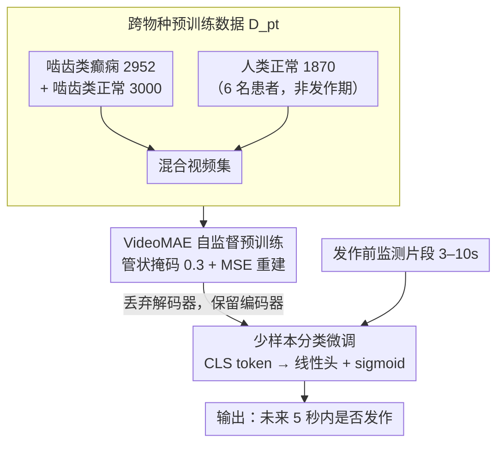

# Forecasting Epileptic Seizures from Contactless Camera via Cross-Species Transfer Learning

**会议**: CVPR 2026  
**arXiv**: [2603.12887](https://arxiv.org/abs/2603.12887)  
**代码**: 待确认  
**领域**: 医学图像  
**关键词**: 癫痫发作预测, 视频分析, 跨物种迁移学习, 非接触式监测, VideoMAE

## 一句话总结

首次系统定义基于纯视频的癫痫发作预测（forecasting）任务（用 3-10 秒发作前片段预测未来 5 秒内是否发作），提出两阶段跨物种迁移学习框架——在啮齿类+人类混合视频上自监督预训练 VideoMAE，再在极少人类癫痫视频上做少样本微调——在 2/3/4-shot 设定下平均 bacc 达 72.30%、roc_auc 达 75.58%，超越所有视频理解 baseline。

## 研究背景与动机

**领域现状**：癫痫发作预测（seizure forecasting）是临床上极具价值的问题。现有方法主要依赖 EEG 等神经信号，需要专业设备和复杂佩戴流程，严重限制了日常场景中的长期部署。视频数据具有非侵入性、易获取、支持持续录制等优势，但现有视频分析研究主要做发作后检测（post-onset detection），发作"预测"（forecasting，即在发作前预警）几乎未被探索。

**现有痛点**：(1) 视频级癫痫预测作为任务本身未被定义过——只有检测没有预测；(2) 大规模标注的人类癫痫视频因隐私和采集困难极度稀缺（本文仅收集到 40 个短视频）；(3) Kinetics-400 等通用视频预训练模型缺乏癫痫相关行为动力学知识，直接用于微调效果差。

**核心矛盾**：视频预测需要模型理解发作前的微妙行为前兆（pre-ictal behavioral dynamics），但人类标注数据极度稀缺，通用视频模型又没有这种领域知识。

**本文目标** (1) 定义视频级癫痫预测任务；(2) 在极少人类数据条件下训练有效的预测模型。

**切入角度**：啮齿类癫痫模型数据充足且发作特征与人类存在跨物种一致性（cross-species consistency）。利用跨物种视频数据预训练可以让模型学到癫痫相关的时空行为模式，弥补人类数据的不足。

**核心 idea**：用啮齿类癫痫视频 + 人类正常视频做自监督预训练建立癫痫行为动力学先验，再在极少人类癫痫视频上少样本微调实现发作预测。

## 方法详解

### 整体框架

整篇要解决的是一个很拧巴的局面：想用纯视频提前预警癫痫发作，但带标注的人类癫痫视频只有 40 条，而通用视频模型（Kinetics-400 预训练）压根不懂癫痫前兆那种微妙的行为动力学。作者的破解办法是把知识来源换成啮齿类——动物癫痫数据管够，且发作行为与人类存在跨物种一致性。

于是整个流程拆成两段。Stage 1 是领域特定持续预训练：拿 VideoMAE-base（已在 Kinetics-400 上预训练）当起点，在「啮齿类癫痫 + 人类正常」的混合视频上做管状掩码自监督重建，逼模型把癫痫相关的时空模式学进编码器。Stage 2 是少样本微调：丢掉解码器、只留编码器，外接一个轻量分类头，在仅有 2/3/4 个正样本的设定下做二分类，输出「未来 5 秒内是否发作」。

### 关键设计

**1. 跨物种预训练数据：用动物数据补人类数据的缺口**

人类癫痫视频稀缺到只有 40 条，根本不够撑起自监督预训练，这是全文最硬的约束。作者的解法是把数据来源主体换成啮齿类：从 RodEpil 数据集（13000+ 条 10 秒啮齿类视频）里平衡采样 2952 个癫痫样本 + 3000 个正常样本，再掺进 1870 条 5 秒的人类非发作期视频（6 名患者），简单合并成预训练集 $D_{pt}$。这种搭配不是随意的——啮齿类癫痫片段贡献的是「发作前微妙运动动态」的知识，而人类正常视频则把人体姿态、视角这些表示能力锚住，避免模型完全偏向啮齿类形态。消融实验也佐证了这一点：完整的 +R(Y/N)+H 组合在所有 shot 设定下都最好，而单喂啮齿类癫痫（+R(Y)）反而不如直接微调，说明正常行为数据起了关键的正则作用。

**2. VideoMAE 自监督预训练：低掩码比例是医学视频的反直觉发现**

有了混合数据，这一步用视频掩码自编码器把癫痫时空表示学出来。机制沿用 VideoMAE 的管状掩码（tube masking）：对视频的 3D patch 施加掩码后让模型重建，用 MSE 重建损失

$$\mathcal{L}_{MSE} = \frac{1}{\Omega}\sum_{i\in\Omega}(I_i - \hat{I}_i)^2$$

驱动训练。真正值得记住的是掩码比例的取值：最优是 **0.3**，而不是通用视频里常用的 0.75–0.9。原因很直接——Kinetics 那类视频信息冗余高，遮掉 90% 也能脑补回来；但癫痫前兆动作本身就细微，掩太多会把关键行为线索一并抹掉，模型学不到有意义的表示。所以这里反其道而行，保留更多时空上下文。这个比例不是调参噪声，而是医学行为视频自监督的一条领域特异规律。

**3. 少样本分类微调：极端小数据下用线性探针防过拟合**

预训练完成后丢掉解码器，只把编码器权重接上一个最简单的线性分类头：取 CLS token $\mathbf{z}_{cls}$，过线性层加 sigmoid 得到发作概率 $\hat{y} = \sigma(\mathbf{W} \cdot \mathbf{z}_{cls} + b)$，用交叉熵训练 20 个 epoch。之所以分类头做得这么轻，是因为微调集只有 40 个视频、每类 2–4 个样本——任何稍复杂的时序头都会在这种规模上立刻过拟合，线性探针是把预训练表示的价值兑现出来又不翻车的最稳选择。工程上再配梯度检查点 + 16-bit 混合精度压低显存。

### 损失函数 / 训练策略

- Stage 1：MSE 重建损失；Adam lr=1e-4；16 帧采样率 2；224×224 分辨率；8× NVIDIA L40 DDP
- Stage 2：BCE 分类损失；20 epochs 微调；梯度检查点+FP16

## 实验关键数据

### 主实验——不同方法在 2/3/4-shot 下的表现

| 方法 | avg bacc | avg roc_auc | avg pr_auc |
|------|----------|-------------|------------|
| CSN | 0.5278 | 0.5722 | 0.5837 |
| X3D | 0.5540 | 0.7045 | 0.7105 |
| SlowFast | 0.6620 | 0.7065 | 0.6812 |
| Linear Probing | 0.4742 | 0.4994 | 0.5274 |
| Human-only | 0.7149 | 0.7491 | 0.6943 |
| Pretrained zeroshot | 0.5250 | 0.5500 | 0.4944 |
| **Ours** | **0.7230** | **0.7558** | **0.7091** |

### 消融实验——预训练数据组合

| 配置 | avg bacc | avg roc_auc | avg pr_auc |
|------|----------|-------------|------------|
| Base（Kinetics-400 直接微调） | 0.7149 | 0.7491 | 0.6943 |
| +H（仅人类正常） | 0.7163 | 0.7419 | 0.6995 |
| +R(Y)（仅啮齿类癫痫） | 0.6961 | 0.7327 | 0.6765 |
| +R(N)（仅啮齿类正常） | 0.7097 | 0.7422 | 0.6594 |
| +R(Y/N)（啮齿类癫痫+正常） | 0.6965 | 0.7500 | 0.7078 |
| **+R(Y/N)+H（完整框架）** | **0.7230** | **0.7558** | **0.7091** |

### 关键发现

- **跨物种预训练有效**：完整框架（+R(Y/N)+H）在所有 3 个平均指标上最优，比 Base 提升 bacc +0.81%、roc_auc +0.67%、pr_auc +1.48%
- **低掩码比例是关键**：最优 mask ratio=0.3，而非 VideoMAE 常用的 0.75-0.9。原因是癫痫前兆动作微妙，高掩码会丢失关键行为线索
- **传统视频模型在少样本下表现差**：CSN 2-shot bacc 仅 0.34，X3D 仅 0.53，说明通用视频模型不适合极端少样本医学场景
- **2-shot 最具挑战性**：模型在 2-shot 下 roc_auc 0.7682 和 pr_auc 0.7269 均最优（高于 Human-only），展现出跨物种预训练的价值在数据最稀缺时最突出
- 单独使用啮齿类癫痫数据（+R(Y)）反而不如 Base，说明混合正常行为数据对正则化很重要

## 亮点与洞察

1. **任务定义的开创性**：首次将癫痫视频分析从"检测"（事后判断是否发作）推进到"预测"（事前预警是否会发作），临床价值质变——给出 5 秒预警时间可实施干预
2. **跨物种迁移的验证**：证明啮齿类癫痫行为动力学确实能迁移到人类预测任务，为小数据医学 CV 问题开辟了"借助动物数据"的新路径
3. **掩码比例的领域特异性发现**：VideoMAE 在通用视频中高掩码（0.75-0.9）效果佳，但在医学行为视频中低掩码（0.3）最优——这个发现对医学视频自监督学习有指导意义

## 局限与展望

1. **数据规模极小**：仅 40 个评估视频（20 发作前 + 20 正常），统计可靠性受限，结论推广需更大规模验证
2. **固定 5 秒预测窗口**：未探索不同预测时间跨度（Seizure Prediction Horizon），临床需要知道最大有效预测距离
3. **纯视频设定**：实际部署可融合音频、心率变异性（HRV）等多模态信号以降低误报率
4. **跨物种"一致性"未量化**：论文依赖文献引用论证啮齿类-人类癫痫行为一致性，缺乏定量分析
5. **模型极简**：仅用 CLS token + 线性头分类，未探索更精细的时序建模（如 temporal attention）

## 相关工作与启发

- **vs EEG-based 方法**：EEG 需要专业设备和接触式传感器，视频方案完全非接触——是可部署性的质变（如家庭监护场景）
- **vs CNN-LSTM 检测方法（Pérez-García 等）**：这些方法做 post-onset detection，本文做 pre-onset forecasting——任务定义根本不同
- **vs SlowFast/X3D**：通用动作识别模型在极端少样本医学场景下（2-4 shot）表现远不如定制跨物种预训练方案
- **跨物种思路的通用性**：不限于癫痫——任何人类行为数据稀缺但动物模型丰富的医学视频任务（如帕金森步态分析）都可借鉴此框架

## 评分

⭐⭐⭐⭐

- **新颖性** ⭐⭐⭐⭐⭐：任务定义开创性，跨物种迁移学习切入角度独特
- **实验充分度** ⭐⭐⭐：多 baseline 对比 + 数据消融 + 掩码比例消融，但数据量极小（40 视频），统计可靠性存疑
- **写作质量** ⭐⭐⭐⭐：问题动机清晰，两阶段框架简洁
- **价值** ⭐⭐⭐⭐⭐：开辟了非接触式癫痫预警的新方向，跨物种学习思路对小数据医学 CV 有示范意义

<!-- RELATED:START -->

## 相关论文

- [\[CVPR 2026\] Unlocking Positive Transfer in Incrementally Learning Surgical Instruments: A Self-reflection Hierarchical Prompt Framework](unlocking_positive_transfer_in_incrementally_learning_surgical_instruments_a_sel.md)
- [\[CVPR 2026\] Meta-learning In-Context Enables Training-Free Cross Subject Brain Decoding](meta-learning_in-context_enables_training-free_cross_subject_brain_decoding.md)
- [\[CVPR 2026\] Interpretable Cross-Domain Few-Shot Learning with Rectified Target-Domain Local Alignment](interpretable_cross-domain_few-shot_learning_with_rectified_target-domain_local_.md)
- [\[NeurIPS 2025\] EEGReXferNet: A Lightweight Gen-AI Framework for EEG Subspace Reconstruction via Cross-Subject Transfer Learning and Channel-Aware Embedding](../../NeurIPS2025/medical_imaging/eegrexfernet_a_lightweight_gen-ai_framework_for_eeg_subspace_reconstruction_via_.md)
- [\[ICML 2025\] Do Multiple Instance Learning Models Transfer?](../../ICML2025/medical_imaging/do_multiple_instance_learning_models_transfer.md)

<!-- RELATED:END -->
