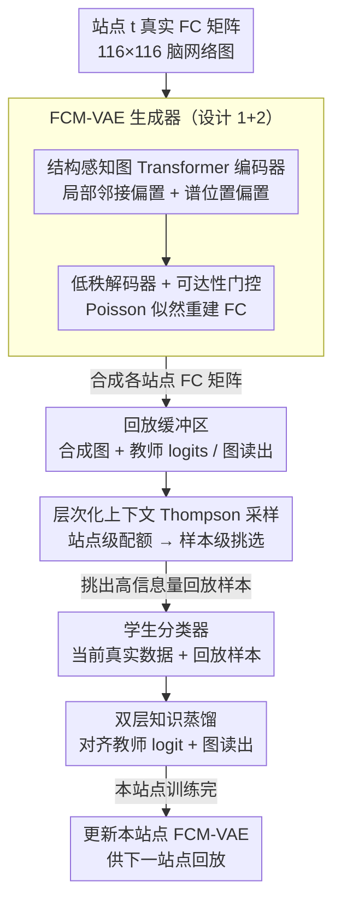

# Continual Learning for fMRI-Based Brain Disorder Diagnosis via Functional Connectivity Matrices Generative Replay

**会议**: CVPR 2026  
**arXiv**: [2604.14259](https://arxiv.org/abs/2604.14259)  
**代码**: [github.com/4me808/FORGE](https://github.com/4me808/FORGE)  
**领域**: 医学影像  
**关键词**: continual learning, fMRI, functional connectivity, generative replay, knowledge distillation

## 一句话总结

提出 FORGE，首个专为跨站点 fMRI 脑疾病诊断设计的持续学习框架，通过结构感知 VAE 生成逼真的功能连接矩阵进行隐私保护式生成回放，结合双层知识蒸馏和层次化上下文赌博机采样策略，有效缓解灾难性遗忘。

## 研究背景与动机

fMRI 功能连接 (FC) 矩阵是脑疾病诊断的强大表示，但临床数据通常从不同机构依次到达。现有诊断模型要么在单站点训练要么需要完整多站点数据访问，面临灾难性遗忘问题。传统持续学习方法主要针对图像数据设计，对图结构的医学数据（特别是 fMRI）研究不足。隐私法规进一步限制了跨机构的原始数据共享。

## 方法详解

### 整体框架

FORGE 要解决的是跨站点 fMRI 诊断的"边学边忘"：临床数据从不同机构依次到达，又因隐私法规不能把旧站点的原始数据留下来回放。它的思路是用**生成回放**替代真实数据回放，再套上**双层知识蒸馏**。核心是一个专为功能连接（FC）矩阵设计的生成器 FCM-VAE：结构感知编码器把脑网络的拓扑与谱几何编进隐空间，低秩解码器再据此重建出逼真的合成 FC 矩阵。每到一个新站点，这些合成的旧站点样本被存进回放缓冲区，由**层次化上下文 Thompson 采样**挑出最有信息量的一批；学生分类器同时学两份数据——当前站点的真实 FC 矩阵 + 挑出的旧站点合成样本，并通过 logit 级和图读出级蒸馏，与上一站点的冻结教师对齐。训练完后，FCM-VAE 在本站点再更新一次，为下一站点的回放做准备。

### 关键设计

**1. FCM-VAE 结构感知图 Transformer 编码器：让生成器真正"懂" FC 矩阵的拓扑**

传统持续学习的生成器多为自然图像设计，套到 FC 矩阵这种图结构数据上会丢掉脑网络的拓扑和谱属性，生成的样本不够真。FORGE 的编码器改用图 Transformer：每个 ROI 节点的特征由该节点的 FC 连接谱、谱嵌入（Laplacian 前 $k$ 个非平凡特征向量）和节点度拼接而成；注意力分数在标准 $QK^\top/\sqrt{d_h}$ 之外，**加性**叠加两个偏置——局部邻接偏置 $\tilde A = A^{adj}+I$（把注意力引向直接相连的邻居，保住局部拓扑约束）和谱位置偏置（让谱坐标相近的节点彼此多关注，捕获全局几何）。用加性偏置而非改写注意力，保留了全图注意力的表达力，因此在 fMRI 这种样本少、图结构复杂的场景下依旧稳健，回放样本的保真度自然更高。

**2. 低秩解码器（含可达性门控）：用功能连接的低秩特性约束生成**

大规模功能连接本身有很强的低秩结构，解码器若无视这一点，生成的连接强度容易偏离真实分布。FORGE 先把每条边的 Pearson 相关 $r_e$ 经 Fisher-z 变换、标准化后取指数转成非负强度，再用 **Poisson 似然**重建：每条边的速率 $\hat\lambda_e(z)=\exp(\nu_e+\omega_e(z))$ 由一个站点共享的基线 $\nu_e$ 加上个体偏差 $\omega_e(z)=\sum_{r=1}^{R}\alpha_r U_{ur}(z)U_{vr}(z)$ 构成——后者是**低秩双线性**形式，把边强度分解成两端节点在 $R$ 个隐因子上的交互，正是低秩先验的显式写入。最后再用一个由邻接矩阵投影出的软门控 $G=\sigma(A^{adj}+\mathrm{logit}(\varepsilon))$ 调制输出，避免生成虚假边。把低秩假设和稀疏性写进生成过程，既缩小了搜索空间，也让合成 FC 矩阵在生物学上更可信。

**3. 层次化上下文 Thompson 采样（HCTS）：把有限回放预算花在刀刃上**

回放缓冲区里的合成样本价值并不均等，均匀采样会把固定预算 $K$ 浪费在低信息量样本上。FORGE 把采样拆成两层的上下文赌博机：**站点级**为每个站点构造上下文 $\phi_i=[\text{Acc}_i,\text{Forget}_i]$（当前精度 + 遗忘程度），用 Thompson 采样估计回放收益、经 softmax 把总预算 $K$ 分成各站点配额 $k_i$，从而把名额优先给遗忘更严重、不确定性更高的站点；**样本级**在每个站点内用上下文 $\psi_u=[\text{margin}_u,\text{closeness}_u]$（不确定性 + 代表性）选出 $k_i$ 个最有价值的样本，并在图读出嵌入空间做贪心最远点遍历（farthest-first），保证覆盖度、减少冗余。这样"在哪个站点回放"和"回放哪些样本"都被自适应地优化，同样的回放次数下更高效地抵抗遗忘。

**4. 双层知识蒸馏 + 生成回放：从两个粒度把旧知识传给学生**

只对齐输出 logit 会漏掉中间表示上的偏移，是 FORGE 名字（Functional cOnnectivity Replay with Graph rEpresentation）和两大贡献之一的由来。每到新站点，学生分类器除了拟合当前真实数据，还要在 FCM-VAE 生成的旧站点回放样本上同时做两层对齐：**logit 级**用 L2 拉近学生与冻结教师（上一站点最优模型）的分类 logits，**图读出级**用 L2 对齐图级表示 $\rho(E_\theta(G))$。教师的 logits 与读出在样本入缓冲区时**算一次后固定**，提供稳定监督、也省去反复前向。低层（合成 FC 矩阵）+ 高层（logit 与图嵌入）的联合回放，正是 FORGE 抵抗灾难性遗忘的核心。

### 损失函数 / 训练策略

统一训练目标含四项：(1) 当前站点真实数据的分类损失；(2) 回放合成数据的分类损失；(3) logit 级蒸馏，用 L2 对齐学生与教师的 logits；(4) 图读出级蒸馏，用 L2 对齐图级表示。教师输出在样本加入缓冲区时计算一次后固定不变，避免反复前向。

## 实验关键数据

### 主实验

在 ABIDE（自闭症）、REST-meta-MDD（抑郁症）和 BSNIP（精神分裂症）大规模神经影像数据集上评估：

| 数据集 | 任务 | 方法 | 遗忘缓解 | 预测准确率 |
|--------|------|------|----------|-----------|
| ABIDE | ASD 诊断 | FORGE | **最优** | **最优** |
| REST-meta-MDD | MDD 诊断 | FORGE | **最优** | **最优** |
| BSNIP | SZ 诊断 | FORGE | **最优** | **最优** |

### 消融实验

- FCM-VAE 生成的 FC 矩阵质量显著优于现有图生成模型
- 图读出蒸馏相比仅 logit 蒸馏进一步提升性能
- 层次化采样策略优于均匀随机采样

### 关键发现

- 结构感知编码有效捕获了 FC 矩阵的拓扑特性
- 生成回放在隐私保护的前提下有效缓解灾难性遗忘
- 低秩解码器生成的 FC 矩阵具有更高的生物学保真度

## 亮点与洞察

- 首个将持续学习与 fMRI 功能连接分析结合的完整框架
- 隐私保护式生成回放解决了医疗数据共享的法规限制
- 结构感知设计充分利用了 FC 矩阵的领域特性

## 局限与展望

- 116 个 ROI 的固定脑图谱（AAL-116）限制了更精细的脑区分析
- 生成模型的保真度在极小样本站点上可能下降
- 未考虑站点间扫描仪差异的域适应

## 相关工作与启发

- 图级持续学习的设计可推广到其他图分类场景
- 谱位置编码在图 Transformer 中的应用值得关注
- 低秩解码器的思路适用于其他具有低秩结构的数据生成

## 评分

7/10 — 问题定义清晰、方法设计全面，是跨学科的有价值工作，但下游任务影响力受 fMRI 领域规模限制。

<!-- RELATED:START -->

## 相关论文

- [\[NeurIPS 2025\] Riemannian Flow Matching for Brain Connectivity Matrices via Pullback Geometry](../../NeurIPS2025/medical_imaging/riemannian_flow_matching_for_brain_connectivity_matrices_via_pullback_geometry.md)
- [\[CVPR 2026\] Residual SODAP: Residual Self-Organizing Domain-Adaptive Prompting with Structural Knowledge Preservation for Continual Learning](residual_sodap_residual_self-organizing_domain-adaptive_prompting_with_structura.md)
- [\[CVPR 2026\] Meta-learning In-Context Enables Training-Free Cross Subject Brain Decoding](meta-learning_in-context_enables_training-free_cross_subject_brain_decoding.md)
- [\[ICML 2026\] Learning Multi-Scale Hypergraph for High-Order Brain Connectivity Analysis](../../ICML2026/medical_imaging/learning_multi-scale_hypergraph_for_high-order_brain_connectivity_analysis.md)
- [\[NeurIPS 2025\] EWC-Guided Diffusion Replay for Exemplar-Free Continual Learning in Medical Imaging](../../NeurIPS2025/medical_imaging/ewc-guided_diffusion_replay_for_exemplar-free_continual_learning_in_medical_imag.md)

<!-- RELATED:END -->
