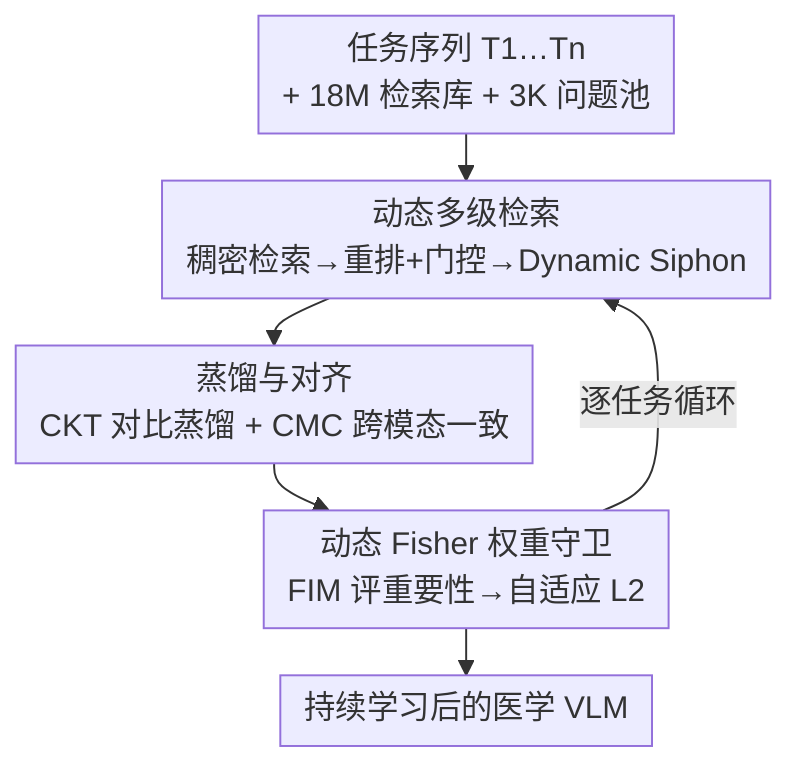

# Forging a Dynamic Memory: Retrieval-Guided Continual Learning for Generalist Medical Foundation Models

**会议**: CVPR 2026  
**论文**: [CVF Open Access](https://openaccess.thecvf.com/content/CVPR2026/html/Chen_Forging_a_Dynamic_Memory_Retrieval-Guided_Continual_Learning_for_Generalist_Medical_CVPR_2026_paper.html)  
**代码**: 有（论文标注 Code available，仓库地址以原文为准 ⚠️）  
**领域**: 医学图像 / 持续学习 / 多模态VLM  
**关键词**: 持续学习, 检索增强(RAG), 知识蒸馏, 医学VLM, 灾难性遗忘

## 一句话总结
PRIMED 把检索增强（RAG）引入医学 VLM 的持续学习，用一个 1800 万规模的多模态医学检索库 + 3000 条问题池作为"动态记忆"，按当前微调任务实时检索图文对当回放数据，再配合对比知识蒸馏与动态 Fisher 权重约束，在自建的 MGTIL 基准上全指标 SOTA。

## 研究背景与动机
**领域现状**：以 CLIP 为代表的多模态 VLM（医学侧如 PMC-CLIP、BiomedCLIP）已成为通用医学基础模型的主流，靠图文对比预训练在分类、预后等任务上表现强。要让一个模型不断适配新医学任务，持续学习（Continual Learning, CL）是必经之路——逐任务增量微调，避免每个病种都重训或单独存一个模型。

**现有痛点**：医学 CL 比自然图像 CL 更难，作者用一张分布图点明了核心差异（Fig.1）——自然图像是"域内差异大、跨域低层特征仍相似"，整体呈网状分布；而医学图像恰好相反，**域内高度相似（同一病理切片彼此长得很像）、跨域成像原理截然不同**（CT vs 病理 vs 眼底），整体呈簇状分布。这意味着医学 CL 必须同时做到"更细粒度的域内区分"和"跨越更大的跨域鸿沟"，二者对模型提出相互矛盾的要求。叠加灾难性遗忘：持续微调的 VLM 不仅忘掉旧下游任务，连预训练得来的 zero-shot 能力也会退化。

**核心矛盾**：缓解遗忘最直接的办法是回放历史样本，但 VLM 的预训练数据通常不可得，无法回放。现有做法只能基于 ImageNet 标签**采样或生成**伪回放数据来模拟——可医学 VLM 的监督信号是 caption/上下文式的，按标签构造参考集既不自然也抓不住医学数据的簇状结构。

**切入角度**：作者注意到 RAG 在 LLM 里早已是标配，能按需做细粒度、动态的检索。那能不能把回放数据"换成"按需检索出来的内容？相比固定采样/生成，RAG 检索能更贴合医学数据的簇状分布，并随域内漂移、跨域切换、难任务动态调整召回内容。

**核心 idea**：用"实时 RAG 检索出的医学图文对"替代"采样/生成的固定回放集"，把它喂进知识蒸馏框架，按所需细节程度动态调节参数空间重要性、蒸馏粒度和参考数据分布——这就是 **PRIMED（Precision Retrieval-Infused model for MEDical）**。

## 方法详解

### 整体框架
PRIMED 的输入是一串医学任务序列 $[T_1, \dots, T_n]$（每个任务是一组带标签的医学图像 + 类名），骨干是 BiomedCLIP（ViT-B/16）。它要解决的是：逐任务微调骨干时，既学好当前任务、又不忘旧任务、还保住 zero-shot。整个过程围绕一个"动态记忆"运转——离线建好的 1800 万图文检索库 + 3000 条问题池就是这块记忆，训练时按当前任务实时从中检索出参考数据，当作蒸馏的"复习材料"，再用三种损失把"学新"与"记旧"拧到一起。

流程分三段串行（对应论文 Fig.2 的 a/b/c）：(a) **实时细粒度检索**，从问题池出发到 18M 库里多级检索，经 Dynamic Siphon 分层采样出专门化的图文对；(b) **蒸馏与对齐**，用上一任务的模型当老师，在检索数据上做对比知识蒸馏（CKT）+ 跨模态一致性（CMC）；(c) **动态 Fisher 权重守卫**，用 Fisher 重要性动态评估每个参数该被锁多紧，生成自适应的 L2 正则。

### 关键设计

**1. 18M 多模态检索库 + 3K 问题池：把"回放记忆"换成可检索的外部知识**

这是整套方法的"记忆载体"，专治"VLM 预训练数据不可得、无法回放"这个痛点。作者沿用 BIOMEDICA 的思路从 PubMed 文献收集图像、caption、正文，但发现大量数据与医学影像无关或是多图排版，不利于 CL；于是做文本压缩、把多图条目拆解成单图条目，再用 Qwen3-Embedding-8B 编码，构建出 **1800 万规模**的图文检索库 $S$，每条是三元组 $(\hat{s}, c, i)$——嵌入向量、caption、图像。另外从文献/数据集/QA 改写/维基整理出 **3000 条问题池** $M^0$，按域、病灶位置、疾病类型分层精化，用来"提问"以解耦簇状的医学知识。训练任务 $T_i$ 前，问题池会动态并入此前任务的标签：$M^i = M^0 \cup \bigcup_{k=1}^{i-1} D_k$，让旧任务也持续被"复习"。

**2. 动态多级检索机制：稠密检索 → 视觉重排 + 词法门控 → Dynamic Siphon 分层采样**

光有库还不够，关键是"怎么检索得准且动态"——这是 Fig.2(a) 的核心，由三个子步串成。第一步**稠密检索**：把查询 $m$ 用嵌入模型 $\Phi_E$ 编码归一化，与库里所有向量算余弦相似度 $\langle m, \hat{s}\rangle = \frac{\Phi_E(m)}{\lVert\Phi_E(m)\rVert_2}\cdot \hat{s}$。医学库里相似分常常大量打平，简单 top-k 会切错，作者改用**动态阈值**：取第 $k'=\min(k,|U^i_m|)$ 大的"唯一"相似度作阈 $\tau_m$，凡 $\langle m,\hat{s}\rangle \ge \tau_m$ 的都进候选集 $C^i_m$。第二步**重排 + 门控**：先用 VLM 编码器 $\Phi_V$ 算跨模态分 $S_v$ 重排，按 caption 分组每组只留 top-$k_v$ 张图去冗余得到 $C^{i*}_m$；若它还超过目标 $k$，再用 BM25 词法门控筛到 $k$ 个，最后按 $S_v$ 排序。第三步 **Dynamic Siphon（动态虹吸）**：把问题池切成三个互斥子集——任务级 $M_{task}$（此前各任务的真实数据）、域级 $M_{domain}$（$M^0$ 里落在历史任务域的问题）、通用级 $M_{gen}$（剩余随机采样），三级各用不同的 top-k 参数 $a,b,c$ 采样，从而**按"任务专门 / 域相关 / 通用"三档比例动态配出参考集**。这就是论文说的"把参考数据分布从均匀切到实时多模态、形成个性化复习计划"。

**3. 对比知识蒸馏 CKT + 跨模态一致性 CMC：在检索数据上既记旧又防模态解耦**

参考集检索好后，用上一任务模型 $T_{i-1}$ 当老师做蒸馏（Fig.2b）。对一批 $B$ 个图文对，学生算 $B\times B$ 跨模态相似度矩阵 $M^i$，老师算 $M^{i-1}$，各除以温度 $\tau$ 得 logits，再把图→文、文→图两个方向的相似度分布做 softmax 后算 KL 散度，相加得 **CKT 损失** $L_{CKT}=L_{Distill\text{-}i2t}+L_{Distill\text{-}t2i}$，让学生在检索数据上贴住老师的跨模态结构、保住 zero-shot。但作者点出一个细节：老师本身（比学生落后一个任务）也在遗忘，跨模态知识会"解耦"，单靠蒸馏会把老师的退化也学过来；于是再让学生的相似度矩阵 $M^i$ 去对齐单位矩阵做对比学习，得 **CMC 损失** $L_{CMC}=L_{Align\text{-}i2t}+L_{Align\text{-}t2i}$，直接锚住当前模型的图文对齐。总训练损失 $L_{Train}=L_{CE}+\alpha L_{CKT}+\beta L_{CMC}$。

**4. 动态 Fisher 权重守卫 DFG：让正则强度随蒸馏/对齐的"知识漂移"逐步自适应**

传统 EWC 用 Fisher 信息矩阵对角线当参数重要性 $W^{\theta_{t-1}}_i$，对偏离预训练权重的改动加重要性加权 L2：$L_{EWC}=\sum_i W^{\theta_{t-1}}_i (\theta^t_i-\theta^{t-1}_i)^2$，但它的重要性是预训练时一次算定的、静态的。作者反问：既然微调干扰才导致遗忘，那 $L_{CE}$ 也该随蒸馏/对齐的偏移动态调整重要性。于是把 Fisher 重要性定义成**只对"分类损失之外那部分梯度"在每个优化步 $j$ 重新求**：$W^{(j)}_i = \big(\frac{\partial (L^{(j)}_{Train}-L^{(j)}_{CE})}{\partial \theta^t_i}\big)^2$，对应的守卫损失 $L^{(j)}_{DFG}=\sum_i W^{(j)}_i (\theta^{t(j)}_i-\theta^{t-1}_i)^2$。直观理解：哪些参数正被蒸馏/对齐推着改动，就动态判它"对保旧知识更重要"、锁得更紧——从而把"全局结构保留"和"细粒度个性化特征保留"这对矛盾调和到一起。

### 损失函数 / 训练策略
总损失 $L_{Train}=L_{CE}+\alpha L_{CKT}+\beta L_{CMC}$，外加动态正则 $L_{DFG}$ 替代普通 L2/EWC。骨干 BiomedCLIP，4×A6000，每个 MGTIL 任务训 1000 步、batch 64、学习率 $1\times10^{-5}$，随机种子 42。老师模型选"上一任务（Last）"模型而非初始或权重平均模型（消融显示 Last 最优）。

## 实验关键数据

作者自建 **MGTIL（Medical Generalist Task Incremental Learning）基准**评测，含两个子任务：**HieraMedTransfer**（X-ray/病理/眼底三域共 9 个数据集，Order I 按域顺序模拟预训练、Order II 字母随机模拟真实临床）评域内+跨域迁移；**MedXtreme**（X-ray/眼底/病理/内镜/皮肤镜/细胞六域、每域最多 33 类的高难任务）评难任务下的持续记忆。指标含 Transfer（zero-shot 保留）、Avg.、Last，以及难任务下的 ACC/AUC/BWT。PRIMED 有两版：`PRIMEDuni`（沿用 ZSCL 的均匀采样参考集）和 `PRIMEDdyn`（用本文动态多级检索）。

### 主实验

HieraMedTransfer（相对 l2 baseline 的 Δ，节选）：

| 方法 | Order I Avg. | Order I Last | Order II Avg. | Order II Last |
|------|------|------|------|------|
| l2 baseline | 68.5 | 74.1 | 63.9 | 66.8 |
| ZSCL (ICCV'23) | +2.0 | +3.5 | +1.1 | +10.1 |
| GIFT (CVPR'25) | +1.3 | +1.1 | +1.1 | +4.5 |
| **PRIMEDuni** | +4.2 | +7.6 | +3.8 | +10.2 |
| **PRIMEDdyn** | **+4.6** | **+8.0** | **+4.1** | **+14.4** |

MedXtreme（高难任务，相对 l2 baseline 的 Δ，节选）：

| 方法 | Order I ACC | Order I BWT | Order II ACC | Order II BWT |
|------|------|------|------|------|
| l2 baseline | 61.1 | -10.0 | 57.3 | -14.5 |
| GIFT (CVPR'25) | +4.9 | +6.3 | +8.4 | +10.4 |
| **PRIMEDuni** | +5.1 | +5.6 | +7.2 | +7.9 |
| **PRIMEDdyn** | **+7.5** | **+7.3** | **+10.8** | **+11.1** |

两点关键：① 即便不用动态检索、只换 ZSCL 的均匀参考集，`PRIMEDuni` 也已击败所有对比方法，说明 CKT+CMC+DFG 这套损失本身就更适配复杂医学任务；② 换上动态多级检索后 `PRIMEDdyn` 全指标 SOTA，HieraMedTransfer 最高提升约 5.6%，且无需任何原始训练数据（不像 rehearsal/生成法会有数据污染风险）。

### 消融实验

模块级消融（HieraMedTransfer Order I，Table 3）：

| 配置 | Transfer | Avg. | Last | 说明 |
|------|------|------|------|------|
| 仅 CKT | 56.2 | 71.8 | 82.6 | 基础组件 |
| 仅 CMC | 54.3 | 68.9 | 78.9 | 单用对齐不够 |
| CKT+CMC | 56.9 | 71.6 | 82.2 | |
| CKT+DFG | 57.2 | 72.8 | 82.5 | |
| CMC+DFG | 56.7 | 70.2 | 77.1 | 缺 CKT 掉 Last |
| **CKT+CMC+DFG** | **58.3** | **73.1** | 82.1 | 完整模型 |

### 关键发现
- **CKT 是地基**：去掉 CKT（如 CMC+DFG 行）Last 从 82 跌到 77.1，蒸馏是保住跨模态结构的核心；CMC 负责防 zero-shot 退化、防知识分布过度漂移；DFG 提供动态知识精炼，全面抬升。
- **动态检索带来的是难任务上的质变**：MedXtreme 上 `PRIMEDdyn` 相对 `PRIMEDuni` 再涨一截（Order II ACC +10.8 vs +7.2），印证"难任务更依赖细粒度检索来构建颗粒化记忆"。
- **老师模型选 Last 最好**：相比初始 CLIP 或 WISE 权重平均，用上一任务模型当老师最优，作者归因于知识分布差异更小。
- **动态正则 > 静态 L2/EWC**：DFG 在正则约束层面优于标准 l2 和 EWC，验证"按蒸馏/对齐梯度动态评重要性"的有效性。

## 亮点与洞察
- **把 RAG 从"推理增强"搬到"持续学习的回放源"**：以往 RAG 用于 LLM 推理期补知识，这里用它在训练期动态生成参考集替代采样/生成回放，既绕过"预训练数据不可得"，又天然贴合医学数据簇状分布——这个迁移视角是全文最"啊哈"的点。
- **Dynamic Siphon 的三级分桶很可复用**：把检索查询显式拆成任务/域/通用三档并各给采样预算，本质是给"复习计划"做配比，思路可迁移到任何需要平衡"专精当前"与"保留通用"的增量场景。
- **DFG 对 Fisher 重要性的重定义很巧**：只对 $L_{Train}-L_{CE}$ 的梯度求 Fisher，等于专门盯"蒸馏/对齐在推哪些参数动"，比预训练一次算定的静态重要性更贴合 CL 的实时漂移。

## 局限与展望
- **强依赖 18M 检索库的质量与覆盖**：检索回放的上限被库的构建管线（PubMed 清洗、多图拆解、伪标签）锁死，库里覆盖不到的罕见病/新模态可能检索不出有效参考集，论文未充分讨论这种 OOD 情形 ⚠️。
- **检索 + 重排 + 蒸馏的训练开销不小**：每任务前都要在 1800 万库上做稠密检索 + VLM 重排 + BM25 门控，论文未给出检索延迟/吞吐与端到端训练成本的量化，落地代价待评估。
- **评测主要在自建 MGTIL 上**：基准虽覆盖六域，但 Order/数据集划分由作者设计，与外部既有医学 CL 基准的可比性有限；跨机构、真实临床流式数据下的表现仍需验证。
- **可改进方向**：检索预算（$a,b,c$、$k$、检索总量）目前是固定超参，若能随任务难度自适应调度，或把 Dynamic Siphon 的三档配比也做成可学习，可能进一步省算力并提鲁棒性。

## 相关工作与启发
- **vs ZSCL / SND / GIFT（VLM 持续学习蒸馏派）**：ZSCL 靠外部数据集蒸馏保 zero-shot，SND 用多老师，GIFT 用生成模型替代数据集省存储；本文区别在于用**多级多模态 RAG 动态构建医学外部参考集**，回放内容更细粒度、更随任务漂移，且实验显示即便沿用 ZSCL 的均匀参考集，本文损失组合也更强。
- **vs EWC（正则派）**：EWC 用静态 Fisher 重要性约束权重；DFG 把重要性改成逐步、只针对非分类梯度的动态量，更契合 CL 中知识分布持续漂移的现实。
- **vs iCaRL / rehearsal（回放派）**：回放需存历史样本、对 VLM 不可行且有数据污染/隐私风险；本文用检索"借"外部知识，无需保存原始训练数据，更适合医学场景的伦理与数据约束。

## 评分
- 新颖性: ⭐⭐⭐⭐⭐ 首次把多级多模态 RAG 作为医学 CL 的动态回放源，配 Dynamic Siphon 与动态 Fisher 守卫，视角新颖
- 实验充分度: ⭐⭐⭐⭐ 自建 MGTIL 双子任务、双 Order，对比 9+ 方法且有模块/超参消融；但缺检索/训练开销量化与外部基准验证
- 写作质量: ⭐⭐⭐⭐ 用分布图把医学 CL 的"域内紧/跨域散"矛盾讲得很清，公式完整；命名（PRIMED/Siphon）稍多
- 价值: ⭐⭐⭐⭐⭐ 给"通用医学基础模型如何持续学新任务而不忘"提供了可落地的免回放方案，对临床增量部署意义大

<!-- RELATED:START -->

## 相关论文

- [\[CVPR 2026\] Attention Consistent Longitudinal Medical Visual Question Answering Guided by Vision Foundation Models](attention_consistent_longitudinal_medical_visual_question_answering_guided_by_vi.md)
- [\[CVPR 2026\] SAR2Net: Learning Spatially Anchored Representations for Retrieval-Guided Cross-Stain Alignment](sar2net_learning_spatially_anchored_representations_for_retrieval-guided_cross-s.md)
- [\[NeurIPS 2025\] EWC-Guided Diffusion Replay for Exemplar-Free Continual Learning in Medical Imaging](../../NeurIPS2025/medical_imaging/ewc-guided_diffusion_replay_for_exemplar-free_continual_learning_in_medical_imag.md)
- [\[CVPR 2026\] DK-DDIL: Adaptive Knowledge Retention for Dynamic Domain-Incremental Learning in Medical Imaging](dk-ddil_adaptive_knowledge_retention_for_dynamic_domain-incremental_learning_in_.md)
- [\[CVPR 2026\] InvCoSS: Inversion-driven Continual Self-supervised Learning in Medical Multi-modal Image Pre-training](invcoss_inversion-driven_continual_self-supervised_learning_in_medical_multi-mod.md)

<!-- RELATED:END -->
