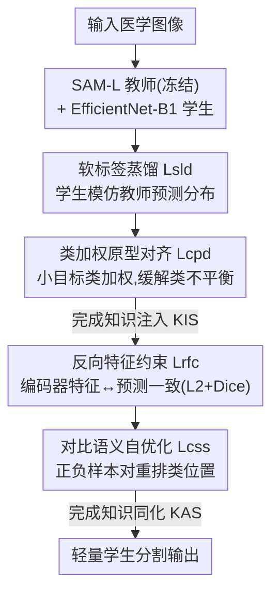

# From Infusion to Assimilation Distillation for Medical Image Segmentation

**会议**: CVPR 2026  
**论文**: [CVF Open Access](https://openaccess.thecvf.com/content/CVPR2026/html/Hong_From_Infusion_to_Assimilation_Distillation_for_Medical_Image_Segmentation_CVPR_2026_paper.html)  
**代码**: https://github.com/hjklearn/IAD  
**领域**: 医学图像  
**关键词**: 知识蒸馏, 医学图像分割, SAM, 原型对齐, 对比学习  

## 一句话总结
针对现有知识蒸馏（KD）"灌进去就完事、不让学生消化"导致泛化反而变差的问题，本文提出两阶段框架 IAD：先用软标签+类加权原型对齐把 SAM 教师的语义"注入"轻量学生，再用对比语义自优化+反向特征约束让学生"同化"知识、保住自己原有的优势，在 Synapse/ACDC/Polyp 上 DICE 分别涨 4.32%/1.85%/2.42%，跨数据集泛化平均涨 4.16%。

## 研究背景与动机
**领域现状**：医学图像分割（MIS）需要能在算力受限设备上实时跑的轻量模型。基础模型如 SAM 分割效果好但计算量大，于是大家用知识蒸馏（KD）把笨重教师的表征能力迁移给紧凑学生——通过最小化两者预测差异，提升学生在迁移数据集上的精度和泛化。主流 KD 分三类：response-based（KD、LSKD、CrossKD…）、feature-based（OFD、AT、CATKD…）、以及二者混合（DIST+、VL2Lite…）。

**现有痛点**：作者跑了一组打脸实验（Fig. 1）：用 SAM-L 当教师、EfficientNet-B1 当学生，在 Synapse 上做蒸馏，再到 ISIC2018/PH2/BUSI/STU 等迁移集上测——12 种主流 KD 方法里 58% 的学生模型性能**反而掉了**，剩下的提升也很有限。可视化（Fig. 2）进一步发现：教师整体强于学生，但在某些好分割的局部区域里学生其实分得**比教师更准**；可主流 KD 一味让学生模仿教师，反而把学生自己原本擅长的能力给"带歪"了，最终掉点。

**核心矛盾**：教师和学生模型尺度不同、特征学习优势也不同。现有 KD 只做"特征对齐"或"分布对齐"，把知识**灌**进学生就算完，却没让学生在迁移之后**自适应地内化、整合**这些知识——既没保住自己的有用能力，也没真正吸收教师的语义，所以增益和泛化都打折扣。

**本文目标**：(1) 把教师的类级语义有效注入学生、同时缓解医学图像的类别不平衡；(2) 在注入之后让学生消化吸收知识、保留自身优势。

**切入角度**：作者首次把"迁移集泛化差"归因于"知识内化不足"，于是把蒸馏拆成两步——先 infusion（注入）再 assimilation（同化），像吃饭先吃进去再消化，而不是塞满就走。

**核心 idea**：用"先注入软标签+类原型语义、再用对比自优化同化并反向约束特征"的两阶段蒸馏，替代一锤子的特征/分布对齐，让学生既学到教师又留住自己。

## 方法详解

### 整体框架
IAD 是一个串行两阶段蒸馏框架，教师固定为带 LoRA 的 SAM-L、学生为 EfficientNet-B1。第一阶段 **KIS（Knowledge Infusion Stage，知识注入）**：冻结教师，用软标签蒸馏让学生模仿教师预测分布，并叠加"类加权原型对齐"把类级语义和类别不平衡一起处理；同时学生输出还受真值监督。第二阶段 **KAS（Knowledge Assimilation Stage，知识同化）**：在 KIS 已注入知识的基础上，对学生编码器特征施加反向约束（让特征与预测一致），并用对比语义自优化把前景/背景拉开、重排类间相对位置，从而让学生"消化"知识、保住自身优势。两阶段顺序训练，每阶段都保留真值分割监督以保证任务保真度。

### 关键设计

**1. 软标签蒸馏 + 类加权原型对齐：在注入分布的同时补上类级语义并治类别不平衡**

软标签蒸馏 $\mathcal{L}_{\text{sld}}$ 直接用 L2 距离拉近教师预测 $\bm{O}_t$ 和学生预测 $\bm{O}_s$：$\mathcal{L}_{\text{sld}} = \frac{1}{B}\sum_{b=1}^{B}\|\bm{O}_t^{(b)}-\bm{O}_s^{(b)}\|_2^2$。但这种逐像素模仿只是"浅层分布拟合"，抓不到判别性的类级语义结构，还容易被类别不平衡带偏（医学图像里胆囊、胰腺这类小器官像素少，直接被大类淹没）。为此作者加了类加权原型对齐：按真值标签索引遍历每张图每个类别，把属于该类的所有像素特征求均值得到教师原型 $\bm{P}_t$ 和学生原型 $\bm{P}_s\in\mathbb{R}^{B\times N\times C}$（Algorithm 1，缺席的类别跳过），再用加权 L2 对齐：$\mathcal{L}_{\text{cpd}}=\frac{1}{N}\sum_{n=1}^{N} w_n\|\bm{P}_t^{n}-\bm{P}_s^{n}\|_2^2$。关键在权重 $w_n$ **给小目标类更大权重**（Synapse 上 $w_n=2$（胆囊）、$4$（胰腺）、其余为 1；ACDC/ETIS 全设 1），从而把蒸馏注意力强行拉回容易被忽视的小器官。KIS 总损失 $\mathcal{L}_{\text{kis}}=\mathcal{L}_{\text{sld}}+\mathcal{L}_{\text{cpd}}$。t-SNE（Fig. 4）显示，原始学生各类原型纠缠在一起，加了 KIS 后明显可分——说明类级语义被真正注入了。

**2. 反向特征约束：让编码器特征反过来对齐预测，强化语义判别结构**

KAS 第一步针对的痛点是：学生编码器输出的特征 $\bm{F}_l$ 和最终预测 $\bm{O}_s$ 之间语义未必一致，特征空间判别力不够。作者先把 $\bm{F}_l$ 经卷积+reshape 投影成 $X=\text{Re}(\text{Conv}(\bm{F}_l))$，对齐到预测的通道数和空间分辨率，再施加 L2 + Dice 的联合约束：$\mathcal{L}_{\text{rfc}}=\frac{1}{B}\sum_{b=1}^{B}\|X^{b}-\bm{O}_s^{b}\|_2^2 + 1-\frac{2\sum_{h,w}\text{S}(X)\text{S}(\bm{O}_s)+\epsilon}{\sum_{h,w}\text{S}(X)+\text{S}(\bm{O}_s)+\epsilon}$（$\text{S}$ 为 softmax，$\epsilon=1\text{e-}6$）。这里"反向"指的是用**预测去约束更底层的编码器特征**：L2 项保证全局特征一致，Dice 项强化目标区域内的像素级语义对齐，从而提升编码器语义特征表达的判别力。

**3. 对比语义自优化：用正负样本对让学生消化知识、拉开前景背景边界**

第二个同化机制要解决的是：学生在被教师"带"过之后，自身有用特征容易被抑制。作者构造对比对——正样本 $\bm{F}_+=\text{Re}(\text{Conv}(\bm{F}_l))$ 直接用学生编码器特征；负样本 $\bm{F}_-=\text{Conv}((1-\text{S}(\bm{F}_l))+(1-\text{S}(\bm{O}_s)))$ 由特征和预测分别 softmax 后**逐元素取反再求和**得到（即"反着的"语义）。然后用 InfoNCE 形式的对比损失把预测 $\bm{O}_s$ 拉近正样本、推远负样本：$\mathcal{L}_{\text{css}}=-\log\frac{\exp(\text{sim}(\bm{O}_s,\bm{F}_+)/t)}{\exp(\text{sim}(\bm{O}_s,\bm{F}_+)/t)+\exp(\text{sim}(\bm{O}_s,\bm{F}_-)/t)}$（$\text{sim}$ 为余弦相似度，$t$ 为温度）。这一机制把前景/背景边界拉清晰、并在特征空间重排类间相对位置（Fig. 5 显示加 $\mathcal{L}_{\text{rfc}}$ 后绿类移到粉橙之间、加 $\mathcal{L}_{\text{css}}$ 后红类移到粉紫之间，相似类被分开），从而促成学生语义的内化整合，缓解对其固有有用特征的压制。KAS 总损失 $\mathcal{L}_{\text{kas}}=\mathcal{L}_{\text{rfc}}+\mathcal{L}_{\text{css}}$。值得注意的是 **KAS 是即插即用的**，可单独接到现有 KD 方法上涨点（见消融）。

### 损失函数 / 训练策略
两阶段顺序训练，每阶段都叠加真值分割损失 $\mathcal{L}_{\text{sgs}}$（多标签用 CE+Dice，二值用 BCE-with-logits）：

- 第一阶段：$\mathcal{L}_{\text{st1}}=\alpha\mathcal{L}_{\text{kis}}+\beta\mathcal{L}_{\text{sgs}}(\bm{O}_s,\text{O}_{\text{gt}})$，教师加载后冻结，输出 $\bm{O}_t$ 作为蒸馏目标。
- 第二阶段：$\mathcal{L}_{\text{st2}}=\gamma\mathcal{L}_{\text{kas}}+\delta\mathcal{L}_{\text{sgs}}(\bm{O}_s,\text{O}_{\text{gt}})$，在学生表征上同时施加 $\mathcal{L}_{\text{rfc}}$ 与 $\mathcal{L}_{\text{css}}$。
- 权重 $(\alpha,\beta,\gamma,\delta)$：Synapse 取 $(0.2,0.8,0.1,1)$，ACDC 设为可学习，二值分割数据集取 $(0.1,1,0.01,1)$。教师 SAM-L+LoRA，学生 EfficientNet-B1，RTX 3090 训练，Synapse 用 512×512、batch 16、AdamW lr 0.0025。

## 实验关键数据

### 主实验
SAM-L 教师 vs EfficientNet-B1 学生，对比 12 种主流 KD（全部同设置重训）。提升列均相对学生基线。

| 数据集 | 指标 | 学生基线 | 次优 KD | IAD（本文） | 提升 |
|--------|------|----------|---------|-------------|------|
| Synapse | Avg. DICE↑ | 79.85 | ~81.75 (KD) | **84.17** | +4.32 |
| Synapse | Avg. HD95↓ | 19.16 | — | **12.94** | -6.22 |
| ACDC | Avg. DICE↑ | 87.44 | ~88.53 (CrossKD) | **89.29** | +1.85 |
| Polyp（4 集均值） | Avg. DICE↑ | 75.56 | ~77.17 (AT) | **77.98** | +2.42 |
| Polyp（4 集均值） | Avg. mIoU↑ | 67.32 | — | **69.70** | +2.38 |

跨数据集泛化（在 Synapse 蒸馏后冻结编码器、只微调解码器，再到 seen/unseen 集测）：

| 数据集 | 指标 | 学生基线 | 次优 KD | IAD | 提升 |
|--------|------|----------|---------|-----|------|
| 4 集平均 | DICE↑ | 72.40 | ~75.60 (VL2Lite) | **76.56** | +4.16 |
| 4 集平均 | mIoU↑ | 61.25 | — | **65.48** | +4.23 |
| STU（unseen） | DICE↑ | 54.12 | 64.76 (VL2Lite) | **66.30** | +12.18 |

注意 Tab. 4 里多数 KD（KD/AT/OFD/CrossKD/SinKD…）相对学生**反而掉点**（如 KD -3.62），印证了"灌而不化"伤泛化的核心论点，而 IAD 是唯一全面正向且最优。

### 消融实验

KIS 与 KAS 主消融（Synapse / ACDC，Tab. 5）：

| 配置 | Synapse DICE↑ | Synapse HD95↓ | ACDC DICE↑ | 说明 |
|------|---------------|---------------|------------|------|
| 学生（都不用） | 79.85 | 19.16 | 87.44 | 基线 |
| 仅 KIS | 83.13 | 14.35 | 88.72 | 去掉 KAS，DICE -1.04 |
| 仅 KAS | 82.63 | 19.86 | 88.62 | 去掉 KIS，DICE -1.54、HD95 暴涨 6.92 |
| KIS+KAS（IAD） | **84.17** | **12.94** | **89.29** | 完整模型 |

KIS/KAS 内部四个损失项消融（Synapse，Tab. 6）：单用 $\mathcal{L}_{\text{sld}}$（82.18）或单用 $\mathcal{L}_{\text{cpd}}$（82.42）都不如完整 KIS（83.13）；KAS 里只留 $\mathcal{L}_{\text{rfc}}$（83.90）或只留 $\mathcal{L}_{\text{css}}$（82.48）也都掉，四项全开才到 84.17。KAS 即插即用（Tab. 9，Synapse）：把 KAS 单独接到别的 KD 上，OFD +3.04 DICE、CrossKD +3.23、CILD +2.27——证明同化阶段是通用增益模块。

### 关键发现
- **KIS 是地基、KAS 是放大器**：只用 KAS（缺少 KIS 注入的丰富知识）时 Synapse HD95 从 12.94 暴涨到 19.86，说明没有先注入类级语义，单纯同化无米下锅；而只用 KIS 也比完整版掉 1+ 点，说明"注入完不消化"确实留了增益在桌上。
- **类加权直击类别不平衡**：给胰腺（+4 权重）这类小器官加权后，Synapse 上 Pancreas DICE 从学生的 61.46 提到 68.95，是涨幅最大的类别之一。
- **泛化才是真分水岭**：很多 KD 在 Synapse 同分布上能涨一点，但一到 unseen 集（PH2/STU）就崩（KD 在迁移集平均 -3.62），IAD 因为保住了学生自身优势特征，是唯一在 seen/unseen 上都稳定正向的。
- L2 距离在两阶段都优于 L1/KLD（Tab. 8），作者据此统一选用 L2。

## 亮点与洞察
- **"灌而不化"的问题诊断很有说服力**：用 12 种 KD 在迁移集上 58% 掉点的统计 + 学生局部优于教师的可视化，把"蒸馏伤泛化"这件反直觉的事讲清楚了，问题定义本身就是贡献。
- **反向特征约束的思路可迁移**：通常蒸馏让特征对齐教师，这里反过来用学生自己的预测去约束更底层特征，强化"特征↔预测"的内部一致性，是一种自蒸馏式正则，理论上可搬到其他分割/检测任务。
- **负样本构造很巧**：把特征和预测 softmax 后取反相加当负样本，等于用"语义的补集"做对比锚点，不需要额外采样或 memory bank，工程上很轻。
- **KAS 即插即用**这一点实用价值高：不想重做整个 pipeline 的人，可以只把 KAS 接到已有 KD 上白嫖 2-3 个 DICE。

## 局限与展望
- 教师/学生组合**固定**为 SAM-L + EfficientNet-B1，没验证换其他教师（如纯 CNN/Transformer 教师）或更小学生时结论是否成立，跨架构鲁棒性存疑。⚠️
- 类加权 $w_n$ 是**按数据集手工设定**的（Synapse 给胆囊/胰腺特定权重），需要先知道哪些类是小目标，自动化/自适应加权是明显的改进点。Fig. 9 做了权重比敏感性分析但仍是人工搜索。
- 两阶段顺序训练增加了训练流程复杂度，论文未报告训练时间/显存相对单阶段 KD 的额外开销。⚠️
- 评测集中在 2D 切片（Synapse/ACDC 取 2D slice），3D 体数据上的表现未验证。

## 相关工作与启发
- **vs 普通 response-based KD（KD/LSKD/CrossKD）**：它们只对齐预测分布，缺类级语义建模、也不管迁移后内化；本文在注入阶段补了类加权原型、又加了同化阶段，所以在迁移集上不掉反涨。
- **vs CSW-KD / IFVD（类级语义建模）**：这两者也建模类间关系/类内差异，但面向自然场景；IAD 明确在预测层处理类内语义并融合软标签，针对医学图像的类不平衡更对症。
- **vs feature/hybrid KD（OFD、DIST+、VL2Lite）**：它们做特征模仿或特征-响应混合，但在医学图像上次优且普遍忽视迁移后同化；IAD 的 KAS 恰好补上这一环，且能即插即用反哺它们涨点。
- **vs De-LightSAM 等 MIS 专用蒸馏**：同样面向医学分割，但本文首次把"泛化差"归因于"内化不足"并给出两阶段方案，问题视角不同。

## 评分
- 新颖性: ⭐⭐⭐⭐ 把蒸馏拆成"注入+同化"两阶段、并首次把迁移泛化差归因于内化不足，视角新颖；单个组件（原型对齐、对比、Dice 约束）有前作影子。
- 实验充分度: ⭐⭐⭐⭐⭐ 对比 12 种 KD、7 个数据集、seen/unseen 泛化、内部逐项消融、即插即用验证、p-value 显著性，非常扎实。
- 写作质量: ⭐⭐⭐⭐ 动机用打脸实验+可视化讲得清楚，公式齐全；缓存文本里公式 OCR 较乱、部分符号需对照原文确认。
- 价值: ⭐⭐⭐⭐ 轻量医学分割部署刚需，KAS 即插即用让方法可被复用，实用价值高。

<!-- RELATED:START -->

## 相关论文

- [\[CVPR 2026\] Momentum Memory for Knowledge Distillation in Computational Pathology](momentum_memory_for_knowledge_distillation_in_computational_pathology.md)
- [\[CVPR 2026\] PDD: Manifold-Prior Diverse Distillation for Medical Anomaly Detection](pdd_manifold-prior_diverse_distillation_for_medical_anomaly_detection.md)
- [\[CVPR 2026\] SegMoTE: Token-Level Mixture of Experts for Medical Image Segmentation](segmote_token-level_mixture_of_experts_for_medical_image_segmentation.md)
- [\[CVPR 2026\] PMRNet: Physics-informed Multi-scale Refinement Network for Medical Image Segmentation](pmrnet_physics-informed_multi-scale_refinement_network_for_medical_image_segment.md)
- [\[CVPR 2026\] GeoSemba: Reconstructing State Space Model for Cross Paradigm Representation in Medical Image Segmentation](geosemba_reconstructing_state_space_model_for_cross_paradigm_representation_in_m.md)

<!-- RELATED:END -->
