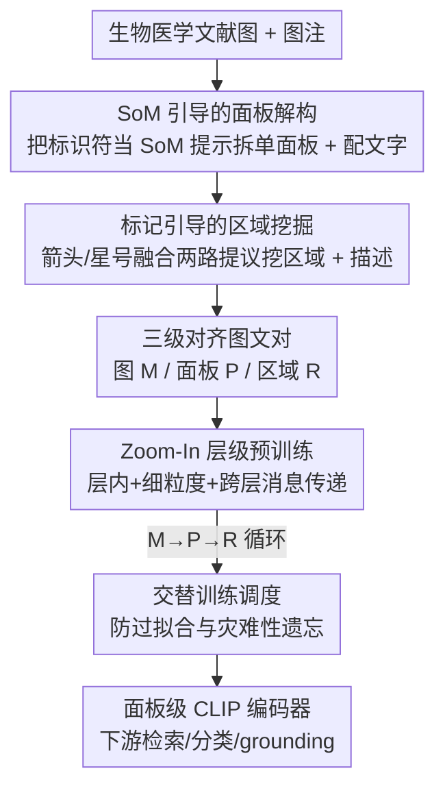

# From Panel to Pixel: Zoom-In Vision-Language Pretraining from Biomedical Scientific Literature

**会议**: CVPR 2026  
**论文**: [CVF Open Access](https://openaccess.thecvf.com/content/CVPR2026/html/Yuan_From_Panel_to_Pixel_Zoom-In_Vision-Language_Pretraining_from_Biomedical_Scientific_CVPR_2026_paper.html)  
**代码**: 未公开  
**领域**: 医学图像 / 多模态VLM  
**关键词**: 生物医学视觉语言预训练, 层级监督, 面板解构, 区域级对齐, 数据高效  

## 一句话总结
针对生物医学文献图通常是「多面板 + 标注箭头」的复合图、而现有 VLP 却把整张图压成一对粗粒度图文对的问题，本文提出 Panel2Patch 数据流水线，用现成 LVLM 把文献图自动拆成「整图—单面板—局部区域」三级对齐图文对，再配一个跨层消息传递的 zoom-in 预训练框架，仅用前作 1/6 的数据就在多个生物医学基准上取得 SOTA。

## 研究背景与动机
**领域现状**：生物医学视觉语言基础模型（PMC-CLIP、BiomedCLIP、BIOMEDICA/BMC-CLIP 等）几乎都走「从科学文献里扒图—文对、然后规模化扩量」这条路，数据量从 1.6M 一路堆到 24M，靠 web-scale 语料学通用表征。

**现有痛点**：科学文献里的图绝大多数是**多面板复合图**（一张图里 A/B/C/D 多个子图），而图注（caption）往往只给一个高层概括。现有流水线要么把整张多面板图当成**单个**图文实例（BiomedCLIP、BMC-CLIP），要么把它切成面板却仍复用整图级 caption（Open-PMC-18M）——结果面板裁剪图上挂着指向多个元素的纠缠文字，图文对齐既粗又错位。这跟临床医生真正读图的方式相反：医生会**放大到局部结构**去看某根血管、某块染色区。

**核心矛盾**：现有视觉语言数据生成存在「可扩展性 ↔ 细粒度监督」的根本权衡。自然图像那套细粒度方法（FineCLIP、FG-CLIP）靠人工标注/预训练检测器/专用 captioner 拿到区域级对齐，但标注成本高、且因领域 gap 迁移不到生物医学；而能规模化扒文献的方法又牺牲了粒度。**没有任何方法**能同时产出「多面板图 / 单面板 / 细粒度区域」三个粒度、且各自配有对应层级 caption 的层级监督。

**切入角度**：作者抓住一个关键观察——**科学图本身就已经编码了层级视觉结构和显式定位线索**。多面板布局、面板标识符（"A"、"B"…）、作者画上去的箭头/方框/放大插图，这些「教学性设计」天然就是可被自动抽取的弱监督信号，不需要额外人工标注或专用检测器。

**核心 idea**：用现成 LVLM 把文献图固有的「面板标识符 + 视觉标记」当作隐式的 Set-of-Marks 提示，自动挖出「图—面板—区域」三级对齐图文对（Panel2Patch），再用一个让面板级嵌入被全局图上下文和局部区域证据双向精炼的 zoom-in 预训练框架去学——即「挖更好的监督」而非「扒更多的数据」。

## 方法详解

### 整体框架
方法分两大块：**Panel2Patch 数据流水线**把生物医学图转成三级对齐图文对，**Zoom-In 层级预训练**把三级图文对映到同一嵌入空间、并让面板级表征被另外两级精炼。

数据侧给一张科学图 + 图注，Panel2Patch 先做 **SoM 引导的面板解构**（拆出单面板图 + 给每个面板配文字），再做 **标记引导的区域挖掘**（用箭头/星号等标记定位局部区域 + 配细粒度描述），最终产出三个粒度的图文对：整图级 $(x^M_i, y^M_i)$、面板级 $(x^P_{ij}, y^P_{ij})$、区域级 $(x^R_{ijk}, y^R_{ijk})$。注意三级数量天然不等——不是所有图都是多面板，也不是每个面板都有有效区域标注。

预训练侧用**共享**的图像编码器 $f_v$ 和文本编码器 $f_t$ 把所有粒度输入映到同一 $d$ 维空间，靠三类对齐（层内 / 细粒度 / 跨层消息传递）把面板级嵌入打磨成下游任务的主表征，最后用 M→P→R 交替训练调度防止某一级过拟合或灾难性遗忘。

### 关键设计

**1. SoM 引导的面板解构：把图上现成的「A/B/C」标识符当作免费的 Set-of-Marks 提示**

痛点是多面板图直接当一张图喂会丢掉面板间的细对应。作者的做法是把生物医学图上**作者本就画好的**面板标号（"A"、"I"…）视为隐式 Set-of-Mark 线索，分两步走：第一步**面板提议**，prompt 一个现成 LVLM 同时（i）框出视觉上连贯的面板矩形、（ii）读出附近的标号当面板标识符；为了鲁棒，在多个随机尺度和裁剪上重复查询，聚合预测后对**共享同一标识符**的框做 NMS，得到一组紧凑面板框，据此把原图裁成单面板图；还训了个图像分类器把柱状图等非照片类 plot 丢掉，只留有生物医学意义的监督。第二步**面板感知的文字关联**，以标识符为锚把复合 caption 拆成最小语义单元，让 LVLM 把每个片段分配给标号匹配的面板——这种「标识符驱动」的分配绕开了绝大部分生物医学视觉语言推理，使得不用领域微调的通用 LVLM 也能做对；最后再让 LVLM 结合面板裁剪图和分配到的片段，生成一段额外的简短描述以丰富面板文字。作者人工抽检 2000 张图，约 80% 的复合图被正确拆成单面板图。

**2. 标记引导的区域挖掘：用箭头/星号把「图注里的话」锚到「图上真实的位置」，互相过滤幻觉**

痛点是细粒度区域监督若靠检测器 + captioner，既依赖大规模标注又容易产生幻觉区域和虚假文字。作者利用生物医学图常用箭头、方括号、颜色叠加来高亮关键结构这一特点，做一个**标记锚定的双路 LVLM 提议融合**：一路检测紧贴视觉标记（箭头、星号）的 marker 框，另一路从面板 caption 生成 caption 框。融合规则是——caption 框只有当其中心落在某个 marker 中心的归一化距离 $\le \tau$ 之内才保留（保证文本提议锚在显式视觉线索上），而附近没有 caption 提议的 marker 框则围绕其中心做局部膨胀以近似被指代物体的范围；随后对「保留的 caption 框 ∪ 膨胀的 marker 框」做基于 IoU 的 NMS，得到一组与标记线索空间一致、又抑制了虚假框的区域。文字侧同样走两条互补通路：让 LVLM 把长句拆成从句、以"arrow"/"asterisk"等关键词为锚把片段 ground 到对应框；同时直接 query 每个裁剪区域生成强调局部细节（形态、染色强度、精细结构）的短描述，两种文字都保留用于预训练。这样一来，飘到无关区域的 caption 框被「marker 邻近性闸门」滤掉，marker 框只局部膨胀而不让模型凭空发明新区域，显著压低了 LVLM 幻觉，产出高精度的区域级图文对。

**3. 层级嵌入空间：让面板级表征被全局图上下文「自上而下」、局部区域证据「自下而上」双向精炼**

痛点是三级图文对若各学各的，面板表征拿不到全局语境也接不住局部证据。作者用共享 $f_v$、$f_t$ 把三级输入都映到同一空间，叠三类对齐：（i）**层内对齐**，在 M/P/R 各自粒度内做标准 CLIP 对比（$\mathcal{L}^M_{\text{intra}}$、$\mathcal{L}^P_{\text{intra}}$、$\mathcal{L}^R_{\text{intra}}$），尊重各级分布差异；（ii）**细粒度对齐**，把区域裁剪与其描述配对，并在面板特征图上做 ROI pooling 抽区域特征，强制像素级与特征级表征一致，既支撑框↔文检索/grounding，又靠自下而上把面板嵌入接到局部证据上；（iii）**跨层消息传递**，先用平均池化把细级嵌入聚合成粗级摘要 $\bar v^P_i = \mathrm{Agg}(\{v^P_{ij}\}_j)$、$\bar v^R_{ij} = \mathrm{Agg}(\{v^R_{ijk}\}_k)$，再用 CLIP 损失对齐相邻两级：

$$\mathcal{L}^{M\leftrightarrow P}_{\text{inter}} = \mathcal{L}_{\text{CLIP}}(\{v^M_i\}, \{\bar v^P_i\}) + \mathcal{L}_{\text{CLIP}}(\{t^M_i\}, \{\bar t^P_i\})$$

$$\mathcal{L}^{P\leftrightarrow R}_{\text{inter}} = \mathcal{L}_{\text{CLIP}}(\{v^P_{ij}\}, \{\bar v^R_{ij}\}) + \mathcal{L}_{\text{CLIP}}(\{t^P_{ij}\}, \{\bar t^R_{ij}\})$$

前者把整图全局语境注入面板（自上而下 context 传播），后者把面板下区域的细节聚回面板（自下而上 evidence 聚合），共同在 $M\leftrightarrow P\leftrightarrow R$ 上实现双向消息传递。最终面板级嵌入既被全局图上下文校准、又被局部区域证据充实，成为下游生物医学任务的主表征。

**4. 交替训练调度：M→P→R 循环激活，化解三级数据严重不均衡 + 防灾难性遗忘**

痛点是图/面板/区域三级样本数量差距很大，若混在一起训练容易过拟合某一级、并在切换粒度时遗忘已学语义。作者采用 coarse-to-fine 的**交替调度**：每一步只激活一个粒度，按 M→P→R 循环——先训几个 batch 细粒度区域，接着单面板，再接多面板，如此往复。循环监督保证刚更新过的参数在漂移之前会被其它粒度重新「回炉」，从而保留先前学到的语义，避免过拟合到单一级别数据，让模型在所有粒度上学到平衡表征。

### 损失函数 / 训练策略
总目标是层内 CLIP（M/P/R 三级）+ 细粒度区域对齐（含 ROI pooling 一致性）+ 跨层 $\mathcal{L}^{M\leftrightarrow P}_{\text{inter}}$、$\mathcal{L}^{P\leftrightarrow R}_{\text{inter}}$ 的组合，配合 M→P→R 交替调度。区域级每个区域有两份文字（LVLM 生成的 patch caption $y^R_{ijk,\text{LVLM}}$ 与标记 ground 的子 caption $y^R_{ijk,\text{sub}}$），预训练时每个区域随机采一份。实现上用从 BMC-CLIP 初始化的 ViT-L/14 视觉编码器，**冻结整个文本编码器和视觉塔早期层，只更新图像编码器最后 5 个 transformer block**；AdamW（weight decay 0.05，$\beta_1{=}0.9$，$\beta_2{=}0.95$），cosine 学习率 + 1000 步 warmup，base lr $1e{-}5$，训 20 epoch，8 卡每卡 batch 40。从 Biomedica 采约 350k 原始图，用开源 Qwen2.5-VL-72B + SoM prompting 生成约 1M 单面板图；面板解析约 960 GPU-小时、区域挖掘与描述生成约 1920 GPU-小时，合计约 2900 GPU-小时（8×H100）。

## 实验关键数据

### 主实验
检索（在 Biomedica 衍生测试集上，I2T/T2I）。单面板短上下文检索（Panel A）相对前作大幅领先，框↔文检索（Panel B）也略优：

| 任务 / 模型 | I2T R@1 | I2T R@10 | T2I R@1 | T2I R@10 |
|------|------|------|------|------|
| 单面板检索 · BioMedCLIP | 33.66 | 74.84 | 30.07 | 73.20 |
| 单面板检索 · BMC-CLIP | 34.15 | 73.53 | 32.03 | 73.86 |
| 单面板检索 · **本文** | **36.60** | **79.90** | **38.24** | **80.88** |
| 框↔文 · BMC-CLIP | 8.04 | 27.82 | 9.29 | 28.42 |
| 框↔文 · **本文** | **8.64** | 27.73 | **9.38** | **30.50** |

零样本分类（六个生物医学专科平均），用 400K 对就超过用 ≥10× 数据训练的前作：

| 模型 | 数据量 | Avg. |
|------|------|------|
| BiomedCLIP | 15M | 41.93 |
| BMC-CLIP | 24M | 47.85 |
| BMC-LongCLIP | 1M | 48.18 |
| **本文** | **400K** | **50.25** |

### 消融实验

**不同监督层级**（去掉某级数据，框↔文 / 短上下文检索，R@10）：

| 配置 | 单面板检索 I2T R@10 | 框↔文 I2T R@10 | 说明 |
|------|------|------|------|
| 仅单面板数据 | 77.61 | 23.66 | 缺区域监督，细粒度 grounding 明显掉 |
| 仅区域数据 | 73.37 | 25.65 | 缺面板数据，恢复不出面板级语义 |
| Panel2Patch（全） | **79.90** | **27.73** | 两级互补，均最高 |

**交替训练**（在 100K 采样图文对上，跨域检索 I2T R@10）：

| 训练→测试 | I2T R@10 | 说明 |
|------|------|------|
| Multi→Multi | 29.35 | 多面板很好 |
| Multi→Single | 8.14 | 但细尺度崩 |
| Single→Single | 15.36 | 单面板尚可 |
| Ours→Single | 14.79 | 单面板接近 single-only |
| Ours→Multi | **29.59** | 多面板几乎不掉 |

### 关键发现
- **监督质量能压过原始规模**：仅用 400K 对就在零样本分类平均分上超过用 24M（BMC-CLIP）、15M（BiomedCLIP）训练的模型，且**不改学习目标、不改架构**，只是把监督从粗图级升级成图—面板—区域层级。
- **区域监督对细粒度 grounding 不可或缺**：去掉区域级，框↔文检索明显下滑；反过来只用区域数据则恢复不出面板级语义——两级互补缺一不可。
- **交替训练真正化解了「学一级忘一级」**：单级模型很快过拟合（multi-only 擅长多面板却在细尺度崩、single-only 反之），而 M→P→R 交替既拿到强单面板结果、又把多面板性能几乎原样保住（Ours→Multi 29.59 ≈ Multi→Multi 29.35）。
- **跨域泛化无需任务微调**：区域级理解在放射、显微、细胞成像上都能定位小目标并检回对应短语。

## 亮点与洞察
- **「数据本就有结构，何必再标注」这一观察很巧**：科学图的面板标号、箭头、放大插图本是给人看的教学设计，作者反手把它们当成隐式 SoM/grounding 监督，等于把出版界几十年的排版规范变成免费弱标签——这套路可迁移到任何「视觉文档遵循教学惯例」的领域。
- **双路提议互相当 gate 压幻觉**：caption 框靠 marker 邻近性闸门过滤、marker 框只局部膨胀，两路互为约束既不漏检也不发明区域，是用 LVLM 挖区域监督时一个实用的去幻觉 trick。
- **跨层消息传递让「主表征」站在中间吃两头红利**：面板级嵌入被自上而下的全局语境和自下而上的局部证据同时精炼，而下游恰好主要用面板级——把优化资源精准压在最有用的那一级上。
- **数据高效的现实意义**：60% 更少数据反而更好，说明生物医学基础模型的瓶颈可能更多在监督粒度而非数据量，对算力有限的医学 AI 团队是个友好方向。

## 局限与展望
- **强依赖现成 LVLM 的解析质量**：复合图正确拆分率约 80%，意味着约 1/5 的图存在面板拆分错误，错误会顺着流水线传导进监督；论文未深入分析这部分噪声对下游的影响。
- **只适用于「带显式标记」的图**：方法吃的是面板标号、箭头、放大插图这类教学性线索，对没有这些标记的纯连续场景图（如某些病理大图）可能无从下手。⚠️ 部分阈值（如 marker 邻近距离 $\tau$）的取值与敏感性正文未给，以原文/附录为准。
- **流水线算力门槛不低**：面板解析 + 区域挖掘合计约 2900 GPU-小时（8×H100），虽然是一次性预处理且可并行，但对小团队仍是可观成本。
- **代码与挖好的语料未见公开**：复现需要自行搭 Qwen2.5-VL-72B + SoM 流水线，门槛较高。

## 相关工作与启发
- **vs BiomedCLIP / BMC-CLIP（BIOMEDICA）**: 它们把每张科学图当**单个**图级实例、靠扩大语料（15M/24M）提升表征；本文不扒更多数据，而是把**已有**语料里的多面板图挖成图—面板—区域三级监督，用 400K 对反超，区别在「升级监督粒度」而非「堆量」。
- **vs Open-PMC-18M**: 它也把图切成面板，但**复用整图级 caption**，导致面板裁剪图挂着指向多个元素的纠缠文字；本文用标识符驱动的文字关联把 caption 拆到对应面板、并额外挖区域级文字，对齐更细更准。
- **vs FineCLIP / FG-CLIP / MedTrinity-25M**: 它们靠预训练检测器、专用 captioner 或 GPT-4V 拿区域监督，标注/算力成本高且难迁移到生物医学；本文用通用 LVLM + 图固有标记零额外人工标注地拿到区域级 grounding，是面向生物医学的「drop-in」替代。

## 评分
- 新颖性: ⭐⭐⭐⭐⭐ 把科学图的教学性排版结构当作隐式层级监督来挖，视角独到且可推广。
- 实验充分度: ⭐⭐⭐⭐ 覆盖检索/分类/grounding 多任务 + 两组消融，但缺面板拆分错误传导与阈值敏感性分析。
- 写作质量: ⭐⭐⭐⭐ 动机清晰、三级层级讲得透，公式记号略密。
- 价值: ⭐⭐⭐⭐⭐ 用 1/6 数据 SOTA，为算力有限的生物医学基础模型指了条「挖监督而非堆数据」的实用路径。

<!-- RELATED:START -->

## 相关论文

- [\[CVPR 2026\] MedKCO: Medical Vision-Language Pretraining via Knowledge-Driven Cognitive Orchestration](medkco_medical_vision-language_pretraining_via_knowledge-driven_cognitive_orches.md)
- [\[CVPR 2026\] IBISAgent: Reinforcing Pixel-Level Visual Reasoning in MLLMs for Universal Biomedical Object Referring and Segmentation](ibisagent_reinforcing_pixel-level_visual_reasoning_in_mllms_for_universal_biomed.md)
- [\[ICCV 2025\] Vector Contrastive Learning for Pixel-wise Pretraining in Medical Vision](../../ICCV2025/medical_imaging/vector_contrastive_learning_for_pixel-wise_pretraining_in_medical_vision.md)
- [\[CVPR 2026\] LLaDA-MedV: Exploring Large Language Diffusion Models for Biomedical Image Understanding](llada-medv_exploring_large_language_diffusion_models_for_biomedical_image_unders.md)
- [\[CVPR 2026\] Modeling the Brain's Grammar: ROI-Guided fMRI Pretraining for Transferable and Interpretable Vision Decoding](modeling_the_brains_grammar_roi-guided_fmri_pretraining_for_transferable_and_int.md)

<!-- RELATED:END -->
