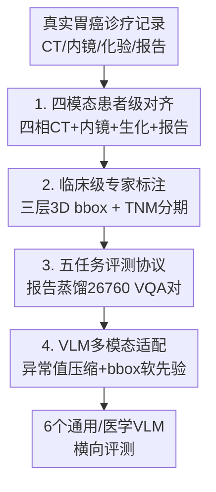

# Gastric-X: A Multimodal Multi-Phase Benchmark Dataset for Advancing Vision-Language Models in Gastric Cancer Analysis

**会议**: CVPR 2026  
**论文**: [CVF Open Access](https://openaccess.thecvf.com/content/CVPR2026/html/Li_Gastric-X_A_Multimodal_Multi-Phase_Benchmark_Dataset_for_Advancing_Vision-Language_Models_CVPR_2026_paper.html)  
**代码**: https://huggingface.co/datasets/HaoChen2/Gastric-X （数据集，论文称将随发表开放完整版）  
**领域**: 医学图像  
**关键词**: 胃癌诊断, 多模态benchmark, 多相CT, 医学VLM, 临床推理  

## 一句话总结
Gastric-X 构建了一个以真实胃癌诊疗流程为蓝本、把四相 3D CT + 内镜图 + 结构化生化指标 + 临床报告在患者级别对齐的 1.7K 例多模态 benchmark，并定义 VQA、报告生成、跨模态检索、分期分类、病灶检测五大任务，系统评测了 6 个通用/医学 VLM，揭示当前模型在「让多模态证据真正互相印证」上仍有明显差距。

## 研究背景与动机
**领域现状**：CLIP、BLIP、Flamingo 等视觉-语言模型（VLM）在自然图像上展现了强跨模态推理能力，医学界自然想把这套范式迁到临床诊断。已有的医学 VLM 多建立在 MIMIC-CXR、CheXpert、PadChest 这类「单模态 2D 影像 + 自由文本报告」的数据集上，近期才出现 MedVL-CT69K、3D-RAD 等少量体素级 CT 数据。

**现有痛点**：这些 benchmark 几乎都停留在「影像-报告匹配」，绝大多数缺三样真实诊断离不开的东西——**多相位/动态影像**（同一部位在不同造影时相下的变化）、**结构化生化检验**（血常规、肿瘤标志物等）、**精确病灶定位标注**。模型只能学到影像和文字之间表层的相关性，无法复现医生「多源证据交叉印证」的推理。

**核心矛盾**：肿瘤学诊断本质是多模态的——放射科看多相 CT、消化科看内镜、再结合化验值和病史综合判断；但现有数据集只给模型「半张拼图」，于是 VLM 在真实临床推理上泛化失败。

**本文目标**：造一个直接源自真实胃癌诊疗工作流、把异质证据在患者级别对齐的数据集，并配上能模拟临床各阶段的评测任务，从而既测模型性能、又探问「当前 VLM 能不能把生化信号、肿瘤空间特征和文本报告真正关联起来」。

**核心 idea**：用「四模态患者级对齐 + 临床级专家标注 + 五任务评测协议」三件套，把整条诊断信息流灌进一个统一 benchmark，逼 VLM 去做真正的多模态印证而非表层匹配。

## 方法详解

### 整体框架
Gastric-X 不是一个新模型，而是一个**数据集 + 评测协议**的工程。它从 1.74K 真实胃癌患者的诊疗记录出发，把四类异质证据——四相 3D CT（非造影/动脉/静脉/平衡期）、内镜图、结构化生化与 EHR、三类临床报告——在患者级别对齐，再叠上专家标注的三层 3D 边界框、TNM 分期和从报告蒸馏出的 VQA 对，最后定义五个对应临床各环节的任务，并给出一套把通用/医学 VLM 适配到多模态多相输入的统一方案来跑评测。

规模上：7.1K 个 CT 扫描（共 83.48K 张切片）、1.7K 张内镜图、21,408 个 3D 边界框、26,760 个 VQA 对、11 项血清生化 + 5 个肿瘤标志物 + 134 项结构化 EHR。下图按「原始诊疗数据 → 对齐 → 标注 → 任务 → 适配 → 评测」串起整条构造与评测管线：

### 关键设计

**1. 四模态患者级对齐：把整条诊断信息流灌进一条记录**

针对「现有数据集只给半张拼图」的痛点，Gastric-X 的核心不在于某一种模态做得多好，而在于把临床医生真实会同时翻阅的四类证据**对齐到同一个患者**：① 四相 3D CT（动脉、静脉、平衡、非造影），每一相反映造影剂经过胃壁时不同的血流灌注与组织强化，医生正是靠这些动态差异判断病程；② 内镜图，提供 CT 看不到的黏膜纹理、颜色和微血管细节，捕捉早期恶变信号；③ 结构化生化——11 项血清生化、5 个肿瘤标志物、外加 134 项 EHR；④ CT 报告 / 内镜报告 / 诊断报告三类文本。和 Table 1 里其他数据集对比，Gastric-X 是唯一同时勾满「多相位 + 生化数据 + 病灶标注 + 报告」四列的资源——这种「患者级多模态全配齐」正是逼模型做交叉印证的前提，而不是像 MIMIC-CXR 那样只能学影像-报告匹配。

**2. 临床级专家标注：三层 3D 边界框 + TNM 分期落地真实语义**

光有模态还不够，要让数据有「临床语义」就得有医生级的 ground truth。每个 CT 研究在四个相位上各给三个 3D 边界框，按诊断关注度分**三个层级**——肿瘤核心、区域淋巴结、整个胃区域，覆盖多尺度病灶分析；1.74K 患者 × 4 相 × 3 框累计得到 21,408 个 3D bbox。分期标注采用临床标准的 **TNM 体系**：分别评估原发肿瘤（T）、区域淋巴结（N）、远处转移（M），三者汇成 overall stage，这套标注直接对应治疗决策与预后判断。所有标注由一线临床医生在 IRB 伦理批准下完成并交叉复核，去标识化处理，保证可作为可靠的训练/评测信号。这一层是 Gastric-X 区别于「只有影像-报告」数据集的关键——它把医生的空间定位与分期判断显式写进了标签。

**3. 五任务评测协议：用报告蒸馏 VQA，把临床各环节映射成可测任务**

数据齐了还要有「怎么考」的标准。作者基于三类报告构造了 **26,760 个 VQA 对**，把叙述性的临床观察转成结构化推理题；并据此定义**五个对应临床工作流不同阶段的任务**：视觉问答（视觉理解与推理）、报告生成（语言表达）、跨模态检索（影像↔文本对齐）、疾病分期分类（决策）、病灶检测（定位）。评测指标各任务专用——VQA/分类用 Precision/Accuracy/F1/AUC，报告生成用 ROUGE-L/BLEU-4/METEOR/BERTScore-F1，检索用 Recall@K/MedR/MnR/mAP，检测用 COCO 风格 AP 与定位精度。这套协议的价值在于：它不是单测一个指标，而是把「看懂→推理→决策→定位」整条临床链路都纳入考核，从而能探问 VLM 的理解到底是表层匹配还是真有证据推理。

**4. VLM 多模态适配：异常值压缩 + bbox 软先验，最小改动喂进多相与表格**

要在这个 benchmark 上评测现成 VLM，得先解决「模型大多只吃 2D 单图，而数据是多相 3D + 表格 + 框」的错配。作者给出一套轻量适配：对 LLaVA-1.5、BLIP-2 这类原生支持多通道的，把多相 CT 切片拼成多通道输入；对 2D 架构的 X2-VLM、LLaVA-Med，则换上 3D Swin Transformer 视觉编码器（X2-VLM 还把文本编码器换成 Med-BERT），得到 X2-VLM-Med。两类辅助模态用「最小架构改动」注入：**边界框**直接以彩色叠加渲染到 CT 切片上，作为不改视觉编码器的**软空间先验**，把注意力轻推向临床相关区域；**生化表格**则不整张喂——模仿医生「先找异常值再推理」的习惯，只抽取**超出生理阈值的异常项**，转成「检验名 + 测量值 + 超标倍数」的简洁文本描述。后者很关键，因为整张表里大量指标落在正常范围、属于噪声，全塞进去反而稀释信号。雷达图显示「Image+Table+BBox」全模态配置在各任务上都最优，验证了这套适配确实让模型用上了多模态证据。

### 损失函数 / 训练策略
所有模型用 AdamW（学习率 $5\times10^{-5}$、weight decay 0.01、10% 线性 warm-up）微调，batch size 32，单张 RTX 3090；数据按**患者级别** 70/15/15 划分训练/验证/测试（避免同一患者跨集泄漏），各任务独立训练，统一从 X2-VLM checkpoint 初始化，文本编码器用 2× 于视觉编码器的学习率。

## 实验关键数据

### 数据集横向对比
Gastric-X 与主流医学 VLM 数据集的关键差异（节选 Table 1）：

| 数据集 | 年份 | 部位 | 影像模态 | 多相位 | 生化数据 | 病灶标注 | 文本形式 |
|--------|------|------|----------|--------|----------|----------|----------|
| PathVQA | 2020 | 多器官 | 病理 | ✗ | ✗ | ✗ | VQA |
| MIMIC-CXR v2 | 2024 | 胸部 | X 光 | ✗ | ✓ | ✗ | 报告 |
| Merlin | 2024 | 腹部 | CT | ✗ | ✓ | ✗ | 报告 |
| MedVL-CT69K | 2025 | 多器官 | CT | ✓ | ✗ | ✗ | 报告 |
| 3D-RAD | 2025 | 多器官 | CT | ✗ | ✗ | ✗ | VQA |
| **Gastric-X** | 2025 | **胃** | **CT+内镜** | **✓** | **✓** | **✓** | **报告** |

Gastric-X 是表中唯一同时满足「多相位 + 生化 + 病灶标注 + 报告」四项的数据集。

### 主任务结果（X2-VLM-Med 为最强基线）
VQA 与跨模态检索上各模型表现（节选 Table 2a / Table 4，全模态或最佳设置）：

| 任务 | 指标 | X2-VLM-Med | Med-Flamingo(次优) | LLaVA-1.5-7B(弱) |
|------|------|-----------|--------------------|------------------|
| VQA（Image+Table+BBox） | AUC | **91.5** | 86.5 | 77.8 |
| VQA（Image Only） | AUC | 85.3 | 80.5 | 67.8 |
| 报告生成（全模态） | BERTScore-F1 | **82.0** | 73.1 | 57.8 |
| 检索 Image→Text | R@1 | **48.9** | 42.8 | 24.3 |
| 检索 Text→Image | R@1 | **47.5** | 41.5 | 22.1 |

### 模态消融（VQA / 报告生成随模态递增单调上升）
以 X2-VLM-Med 为例，逐步加入辅助模态的增益：

| 输入配置 | VQA AUC | 报告生成 BERTScore-F1 |
|----------|---------|------------------------|
| Image Only | 85.3 | 68.7 |
| Image + Table | 88.7 | 76.2 |
| Image + BBox | 89.2 | 78.3 |
| Image + Table + BBox | **91.5** | **82.0** |

分类（Table 5）上 X2-VLM-Med 全模态 AUC 90.8，较 Swin Transformer 在同配置高约 +1.6（作者原文给的 AUC 差，⚠️ 表中 X2-VLM-Med 90.8 vs Swin 90.1 实差约 0.7，以原文为准）；检测（Table 6）上 MedVInT 拿到最高 AP@0.5=72.1、mAP=50.2，X2-VLM-Med 在 AP@0.75、mAP、定位精度上最佳。

### 关键发现
- **多模态单调增益是最强信号**：所有模型从 Image Only 到 Image+Table+BBox，VQA/报告生成/分类指标都单调上升——说明 benchmark 设计的辅助模态确实携带了影像之外的判别信息，也验证了「异常值表格 + bbox 软先验」适配有效。
- **生化表格 vs 边界框各有侧重**：单加 BBox 通常比单加 Table 增益略大（如报告生成 78.3 vs 76.2），但两者叠加才到峰值，提示空间定位与生化证据是互补而非冗余。
- **没有模型在所有任务上通吃**：X2-VLM-Med 在 VQA/报告/检索/分类领先，但病灶检测的 AP@0.5 反被 MedVInT（72.1）和 Swin（70.5）超过——纯定位任务上专门的检测/检索预训练仍占优，反映通用多模态对齐与精细空间定位之间存在张力。

## 亮点与洞察
- **「异常值抽取」这步很临床、很省**：不把整张化验表硬塞给模型，而是只留超阈值项并写成「名称+数值+超标倍数」，既去噪又自带可解释性，是个能直接迁到其他「结构化指标 + 影像」场景（如肝病、心血管）的轻量 trick。
- **bbox 作为渲染叠加的软先验**：把标注画到图上当颜色提示、而不改视觉编码器，几乎零成本地把空间先验注入任意 VLM——比起改架构做 region-text 对齐，这是个工程上极友好的「弱注入」思路。
- **患者级划分守住了泄漏底线**：很多医学数据集按图划分会让同一患者的多相切片散到训练/测试两边造成虚高，本文明确按患者 70/15/15 划分，benchmark 可信度更高。
- **最 "啊哈" 的是评测目标的转向**：作者不只问「谁分数高」，而是问「VLM 能不能把生化信号、肿瘤空间特征、文本报告真正关联起来」——把 benchmark 当探针去测「理解的本质」，而非单纯刷榜。

## 局限与展望
- **规模仍偏小**：1.74K 患者、单中心来源（瑞金等医院），相对自然图像 benchmark 量级有限，跨机构/跨设备泛化未验证；分期等类别可能长尾不均（Sankey/分布图暗示）。
- **适配方案是"喂法"而非新模型**：多通道拼接、Swin 换编码器、bbox 叠加都属于把现成 VLM 套进来的工程适配，没有提出针对多相对齐的原生架构，留给后续工作。⚠️ 文中分类 AUC 增益的表述（+1.6 over Swin）与表内数值（约 0.7）不完全一致，以原文表格为准。
- **检测任务上通用 VLM 不占优**：说明该 benchmark 对「精细空间定位」这一环的考核，现有多模态对齐方法尚未吃透，是明确的改进空间。
- **数据可得性**：完整集需签署知情同意、按机构政策发放，HuggingFace 仅放小样本子集，复现门槛较高（CC BY-NC-ND 4.0，禁衍生与商用）。

## 相关工作与启发
- **vs MIMIC-CXR / PadChest / CheXpert**：它们是单模态 2D X 光 + 报告，本文做四相 3D CT + 内镜 + 生化 + 报告 + 病灶框的患者级对齐，区别在于把「多源证据交叉印证」显式建成数据，优势是更贴真实诊疗、劣势是规模与覆盖部位有限。
- **vs MedVL-CT69K / 3D-RAD**：它们已转向体素级 CT，但仍以影像-报告/VQA 为主，缺生化与病灶标注；Gastric-X 把生化指标与三层 3D bbox 补齐，是目前唯一四项全配的医学 VLM 数据集。
- **vs Merlin（含生化的腹部 CT）**：Merlin 引入了 EHR，但无多相位、无内镜、无病灶框；本文在胃癌这一具体癌种上把模态配置补全，并给出对应的五任务评测协议。

## 评分
- 新颖性: ⭐⭐⭐⭐ 首个把多相 CT + 内镜 + 生化 + 病灶框 + 报告在患者级别全对齐的胃癌 VLM benchmark，配置确属空白，但属"数据集+评测"而非新方法。
- 实验充分度: ⭐⭐⭐⭐ 6 模型 × 5 任务 × 4 模态配置系统评测，消融清晰；规模与跨中心验证略欠。
- 写作质量: ⭐⭐⭐⭐ 临床动机叙述到位、表格规范；个别增益数值（分类 AUC）正文与表格表述不完全一致。
- 价值: ⭐⭐⭐⭐ 为医学多模态 VLM 提供了贴近真实诊疗的高质量评测平台，"异常值压缩 + bbox 软先验"两个 trick 可迁移性强。

<!-- RELATED:START -->

## 相关论文

- [\[CVPR 2026\] OmniBrainBench: A Comprehensive Multimodal Benchmark for Brain Imaging Analysis Across Multi-stage Clinical Tasks](omnibrainbench_a_comprehensive_multimodal_benchmark_for_brain_imaging_analysis_a.md)
- [\[CVPR 2026\] SurgCoT: Advancing Spatiotemporal Reasoning in Surgical Videos through a Chain-of-Thought Benchmark](surgcot_advancing_spatiotemporal_reasoning_in_surgical_videos_through_a_chain-of.md)
- [\[ICML 2026\] Seizure-Semiology-Suite (S³): A Clinically Multimodal Dataset, Benchmark, and Models for Seizure Semiology Understanding](../../ICML2026/medical_imaging/seizure-semiology-suite_s3_a_clinically_multimodal_dataset_benchmark_and_models_.md)
- [\[CVPR 2026\] RDFace: A Benchmark Dataset for Rare Disease Facial Image Analysis under Extreme Data Scarcity and Phenotype-Aware Synthetic Generation](rdface_a_benchmark_dataset_for_rare_disease_facial_image_analysis_under_extreme_.md)
- [\[CVPR 2026\] IVAAN: Instance-level Vision-Language Alignment via Attribute-Guided Text Prompts Generation for Nuclei Analysis](ivaan_instance-level_vision-language_alignment_via_attribute-guided_text_prompts.md)

<!-- RELATED:END -->
