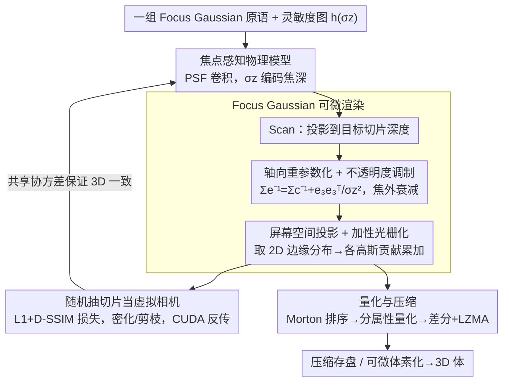

# GaussianPile: A Unified Sparse Gaussian Splatting Framework for Slice-based Volumetric Reconstruction

**会议**: CVPR 2026  
**arXiv**: [2603.20611](https://arxiv.org/abs/2603.20611)  
**代码**: 无  
**领域**: 医学图像 / 3D重建  
**关键词**: 3D高斯溅射, 体数据压缩, 切片成像, 焦点感知模型, 实时渲染

## 一句话总结
提出 GaussianPile，通过引入焦点感知的物理成像模型（Focus Gaussian），将 3D 高斯溅射从表面外观建模扩展到切片体数据重建，在超声和光片显微镜数据上实现了比 NeRF 方法快 11 倍、比体素网格储存缩小 16 倍的高质量体数据压缩与重建。

## 研究背景与动机
1. **领域现状**：现代生物医学成像（3D 显微镜、体超声等）产生的数据量呈指数增长，但存储、传输和分析这些数据的成本已成为瓶颈。隐式神经表示（INR）可以实现高压缩比，但训练和推理慢（小时级），且容易丢失高频细节。3DGS 具备高效拟合和实时渲染能力，但被设计用于从多视图图像建模表面外观。
2. **现有痛点**：标准 3DGS 丢弃了内部体信息，直接用于体数据时会产生"幽灵"伪影——2D 投影看起来合理但 3D 内部结构不一致。对于积分投影模态（如 X 光），已有研究调整了渲染方程；对于密集切片模态（如 MRI，理论零厚度），也有探索。但对于**有限厚度切片**模态（如超声、光片显微镜）——即成像系统具有有限的轴向焦深——还没有合适的渲染模型。
3. **核心矛盾**：标准 3DGS 的渲染完全基于"全焦"假设（所有高斯不论深度都贡献到成像），这与切片成像的物理过程不匹配——每个切片只应该看到焦平面附近有限深度范围内的信号。缺乏物理约束导致高斯原语在轴向方向上无约束地生长，在不同切片间产生幽灵伪影。
4. **本文目标** 如何为有限厚度切片成像系统设计合适的高斯溅射渲染模型，使单一 Gaussian 集合既能精确重建 2D 切片又能保持 3D 体一致性？
5. **切入角度**：将成像系统的点扩散函数（PSF）显式地融入高斯原语的渲染过程，通过协方差矩阵的轴向重参数化来建模有限焦深。
6. **核心 idea**：将成像系统的轴向灵敏度函数卷积入 3D 高斯原语，得到"Focus Gaussian"，其协方差自然编码了焦深信息，从而同时保证 2D 切片保真度和 3D 体一致性。

## 方法详解

### 整体框架
这篇论文要解决的是：怎么用 3D 高斯溅射去重建"有限厚度切片"成像（超声、光片显微镜）采到的体数据，而不像标准 3DGS 那样产生 2D 投影看着对、3D 内部却乱掉的幽灵伪影。它的做法是只优化**一组** Focus Gaussian 原语，让这组原语既能逐切片精确渲染出 2D 图像，又能直接体素化成一致的 3D 体。

整条 pipeline 串起来是这样：先把每个高斯投影到当前要渲染的切片深度上（Scan）；再用焦点模型对它做轴向重参数化和不透明度调制，把离焦平面太远的信号衰减掉；最后做屏幕空间投影并把所有高斯的贡献**累加**成 2D 图像。训练时随机抽切片当虚拟相机来回拟合，结束后这组原语既可渲染任意切片也可量化压缩存盘。

### 关键设计

**1. 焦点感知物理模型：把"有限焦深"写进渲染方程**

标准 3DGS 默认所有高斯不论深度都贡献到成像，这个"全焦"假设给了原语太大自由——它们可以在切片位置把 2D 图像拟合得很好，却在切片之间的内部空间长成完全不同的 3D 结构，因为没有任何物理量约束轴向行为。结果就是 2D 好看、3D 不一致的幽灵伪影。

GaussianPile 的切入点是把成像系统的点扩散函数（PSF）直接卷进渲染。它假设 PSF 是各向异性高斯 $\text{psf}(\mathbf{x}_c) \propto \exp(-\frac{1}{2}(\frac{x_c^2}{\sigma_x^2}+\frac{y_c^2}{\sigma_y^2}+\frac{z_c^2}{\sigma_z^2}))$，其中 $\sigma_z$ 就是轴向聚焦能力，再由此定义沿深度的灵敏度图 $h(-z_c) = \exp(-z_c^2 / (2\sigma_z^2))$；一张切片的渲染强度，就是高斯原语和这个灵敏度图的卷积。妙处在于一个标量 $\sigma_z$ 就把三种成像模态串成了连续谱：$\sigma_z \to \infty$ 退回全焦模型（X 光 / 标准 3DGS），$\sigma_z \to 0$ 退回零厚度模型（MRI），中间的有限 $\sigma_z$ 正对应超声和光片显微镜这类有限焦深的情形。实践中按 Nyquist 采样准则取 $\sigma_z \approx \delta_z$（扫描步长）作默认值。有了这层物理约束，原语在轴向不再能随意生长，2D 保真和 3D 一致才被同时锁住。

**2. Focus Gaussian 的可微渲染：让焦深既约束前向、又约束梯度**

有了焦点模型，问题变成怎么把「高斯 ⊛ 灵敏度图」这步卷积高效、可微地算出来。GaussianPile 把它分解成四步、全程保持高斯的封闭形式。第一步是**轴向重参数化**，把焦深当成对协方差的一项加法修正 $\Sigma_e^{-1} = \Sigma_c^{-1} + \mathbf{e}_3 \mathbf{e}_3^\top / \sigma_z^2$，并相应更新均值 $\mu_e = \Sigma_e \Sigma_c^{-1} \mu_c$——它只收缩轴向支持、横向结构原封不动，得到的就是 Focus Gaussian。第二步是**不透明度调制**

$$\text{opacity}_r = \exp\!\Big(-\tfrac{1}{2}\big(\mu_c^\top \Sigma_c^{-1} \mu_c - \mu_e^\top \Sigma_e^{-1} \mu_e\big)\Big)$$

直观上就是焦外越远的高斯被衰减得越狠、变得越透明，从源头掐掉跨切片的幽灵伪影。第三步是**屏幕空间投影**：取 Focus Gaussian 协方差对 $(x_c, y_c)$ 平面的边缘分布得到 2D 高斯，并按 $\tilde{\alpha} = \alpha \cdot \text{opacity}_r / \sqrt{\det(\Sigma_{2d})}$ 归一化——这个行列式项让亮度随足迹大小自适应、保证投影前后总能量守恒。第四步是**加性光栅化**：体成像里像素强度是各高斯贡献的线性叠加而非表面渲染的 alpha-blending 遮挡，所以写成 $I(p) = \sum_{i} \tilde{\alpha}_i \exp(-\frac{1}{2} \mathbf{d}_i^\top \Sigma_{2d,i}^{-1} \mathbf{d}_i)$，对应体积投影的物理本质。

这样设计的关键好处是：焦深被编码进协方差，而梯度也走这同一套表示——同一个高斯被多张切片观测时共享同一组协方差参数，3D 一致性是被结构天然保证的，而不是靠额外正则去拉。也正因为体数据不需要视角相关的颜色，作者干脆去掉球谐函数（SH），既省了约 40% 存储，又避免 SH 系数为了拟合 2D 投影而破坏 3D 几何。

**3. 量化与压缩方案：把高斯参数的空间相关性榨干**

最后一步是把训练好的 Focus Gaussian 压到 16× 以下存盘。核心观察是高斯原语的参数在空间上高度结构化、相邻原语高度相关，所以走"空间排序 → 差分 → 熵编码"这条路最划算：先把所有高斯按 Morton Z-order 排列以利用空间局部性，再分属性量化——位置归一化到场景包围盒后每轴 14 位、不透明度 12 位整数、尺度先取对数再 12 位（保乘法精度）、四元数限制到正半球后每分量 12 位；每条属性流再做差分编码加 LZMA 熵压缩。正是因为排序后相邻值差异小，差分 + 熵编码才能拿到远超 3DGS 的压缩率。

### 损失函数 / 训练策略
损失函数：$\mathcal{L} = \mathcal{L}_1 + \lambda \mathcal{L}_{\text{D-SSIM}}$，$\lambda = 0.2$。每次迭代随机选一个切片（虚拟相机），用 Adam 优化器训练 30K 步。初始化 1000K 个高斯，自适应密化和剪枝在 500-25000 步之间执行。完整反向传播通过 CUDA 实现。可选的可微分体素化器用于评估 3D 重建质量。

## 实验关键数据

### 主实验（2D 重建质量对比）

| 方法 | ABUS PSNR↑ | rDL-LSM PSNR↑ | TNNI1 PSNR↑ | Tribolium PSNR↑ | 典型训练时间 |
|------|-----------|--------------|------------|----------------|-------------|
| HEVC | 29.67 | 29.34 | 35.76 | 35.51 | ~instant |
| INIF (INR) | 24.84 | 17.54 | 30.89 | 31.55 | 27m-1h24m |
| NeurComp (INR) | 19.85 | 30.32 | 39.25 | 32.59 | 11m-2h41m |
| 3DGS (原始) | 27.41 | 28.63 | 38.17 | 27.81 | 10m-1h |
| **Ours (10K iter)** | **32.25** | **33.78** | **40.87** | **35.32** | **2-4m** |
| **Ours (30K iter)** | **33.07** | **34.57** | **42.08** | **36.14** | **5-13m** |

### 消融实验（焦深参数 $\sigma_z$ 的影响，Tribolium 数据）

| $\sigma_z$ 设置 | PSNR ↑ | SSIM ↑ | 训练时间 | 高斯数量 |
|-----------------|--------|--------|---------|---------|
| $\delta_z/10$ | 34.25 | 0.927 | 8m9s | 215k |
| $\delta_z/2$ | 36.44 | 0.942 | 8m18s | 214k |
| **$\delta_z$ (默认)** | **36.67** | **0.944** | **7m23s** | **211k** |
| $2\delta_z$ | 36.12 | 0.940 | 8m8s | 162k |
| $10\delta_z$ (趋近全焦) | 23.05 | 0.858 | 9m17s | 66k |

### 关键发现
- **3DGS 的"2D好3D差"现象**：标准 3DGS 在 ABUS 上 2D PSNR 27.41，但 3D PSNR 28.49；GaussianPile 对应 33.07 和 33.22——2D 和 3D 指标高度一致，证明了 Focus Gaussian 的物理模型确保了体积一致性。
- **$\sigma_z = \delta_z$ 是最优选择**：符合 Nyquist 采样准则的理论预期。$\sigma_z = 10\delta_z$（趋近全焦）时 PSNR 暴降 13.6 dB，直接验证了焦深建模的必要性。
- **速度优势显著**：30K 迭代平均 8 分钟完成，比 INR 方法快约 5-11 倍，而质量更高。
- **压缩效果突出**：量化后实现 16-26× 压缩比，远优于 3DGS 的 0.1-3×（3DGS 膨胀到比原始数据还大）；与 INR 方法压缩比相当（15-16×），但质量和速度都更好。
- 随机初始化反而比网格初始化更好——随机初始化的密化策略自动将高斯引导到有意义的区域。

## 亮点与洞察
- **物理模型的优雅融入**：将 PSF 卷积分解为协方差矩阵的加法修正，保持了整个流程的可微性和高斯函数的封闭形式——这是非常优雅的数学设计。$\sigma_z$ 这一个标量参数就统一了三种成像模态（全焦/零厚度/有限焦深），参数化非常简洁。
- **去掉球谐函数的 insight**：在体数据渲染中不需要视角依赖颜色这个观察看似简单但很重要——不仅节省了 40% 参数，还提升了几何保真度（避免了 SH 系数过拟合 2D 投影而破坏 3D 一致性的风险）。
- **加性光栅化 vs alpha-blending**：针对体成像的物理特性选择累加而非遮挡模型——这个选择虽然简单但对正确性至关重要，确保了梯度流正确反映体积贡献。

## 局限与展望
- 当前假设空间不变的 PSF，但实际光学系统往往有空间变化的像差。作者提到可学习的空间变化 PSF 是一个方向。
- 对严重噪声或欠采样数据可能过度平滑——引入语义或物理先验可能有帮助。
- 缺乏对 4D 时空数据（如活细胞成像）的支持。
- 当前需要按场景优化，没有前馈模型——大规模预训练+单次推理是重要的未来方向。
- 仅在灰度体数据上验证，未涉及多通道（如荧光多标记）场景。

## 相关工作与启发
- **vs 标准 3DGS**：3DGS 缺乏对切片成像物理的建模，在体重建中"2D 好 3D 差"。GaussianPile 通过 Focus Gaussian 解决了这个根本问题。
- **vs INR 方法（INIF/NeurComp/CoordNet）**：INR 需要小时级训练且容易丢失高频细节。GaussianPile 在分钟级完成且保持更好的细节（ABUS 上 PSNR 高出 8-13 dB）。
- **vs HEVC**：HEVC 速度快但质量损失大，且不支持 3D 交互式浏览。GaussianPile 实现了更高质量的同时支持实时 2D 渲染和 3D 体素化。
- **vs Radiative Gaussian Splatting (X-ray)**：它处理的是积分投影（$\sigma_z \to \infty$），GaussianPile 处理的是有限焦深（$\sigma_z$ 有限）——两者互补地覆盖了不同成像模态。

## 评分
- 新颖性: ⭐⭐⭐⭐⭐ Focus Gaussian 的物理模型设计非常优雅，统一了三种成像模态，填补了重要空白
- 实验充分度: ⭐⭐⭐⭐ 多个数据集（超声+显微镜）、2D/3D指标、压缩比、速度、消融都有，但缺少与更多专用压缩方法的对比
- 写作质量: ⭐⭐⭐⭐⭐ 物理模型推导清晰，图表设计优秀（尤其是图1的三种模态对比）
- 价值: ⭐⭐⭐⭐⭐ 解决了3DGS在体数据领域的根本限制，对医学图像压缩和可视化有直接实用价值

<!-- RELATED:START -->

## 相关论文

- [\[CVPR 2026\] Adaptive Anisotropic Gaussian Splatting for Multi-contrast MRI Arbitrary-Scale Super-Resolution with Anatomy Guidance](adaptive_anisotropic_gaussian_splatting_for_multi-contrast_mri_arbitrary-scale_s.md)
- [\[CVPR 2026\] EchoPOSE: 6D Pose Estimation of Sparse Echocardiograms for Left-Ventricular 3D Shape Reconstruction](echopose_6d_pose_estimation_of_sparse_echocardiograms_for_left-ventricular_3d_sh.md)
- [\[CVPR 2026\] Tell2Adapt: A Unified Framework for Source Free Unsupervised Domain Adaptation via Vision Foundation Model](tell2adapt_a_unified_framework_for_source_free_unsupervised_domain_adaptation_vi.md)
- [\[CVPR 2026\] Bridging Brain and Semantics: A Hierarchical Framework for Semantically Enhanced fMRI-to-Video Reconstruction](bridging_brain_and_semantics_a_hierarchical_framework_for_semantically_enhanced_.md)
- [\[ECCV 2024\] Radiative Gaussian Splatting for Efficient X-ray Novel View Synthesis](../../ECCV2024/medical_imaging/radiative_gaussian_splatting_for_efficient_x-ray_novel_view_synthesis.md)

<!-- RELATED:END -->
