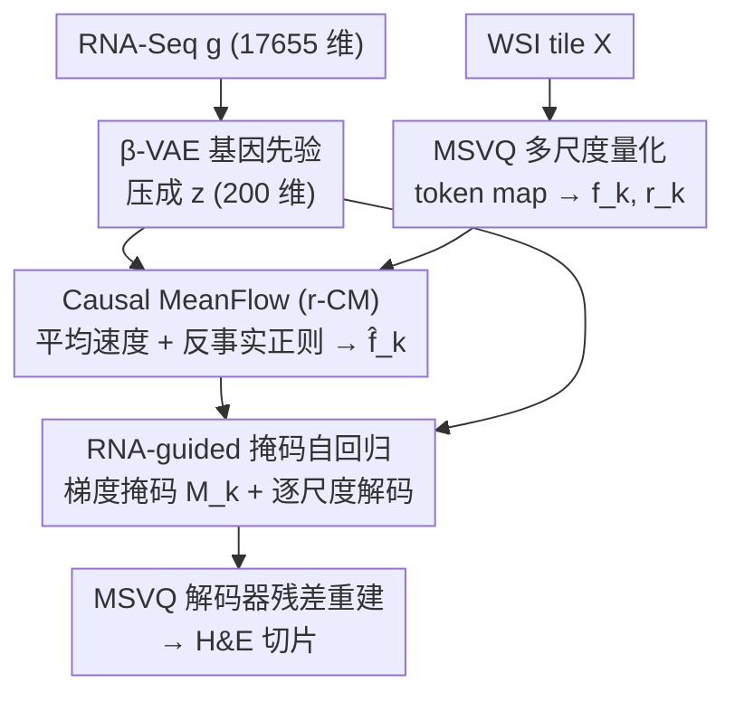

# GeneVAR: Causal MeanFlow for Autoregressive Gene-to-WSI Tile Synthesis

**会议**: CVPR 2026  
**论文**: [CVF Open Access](https://openaccess.thecvf.com/content/CVPR2026/html/Zhao_GeneVAR_Causal_MeanFlow_for_Autoregressive_Gene-to-WSI_Tile_Synthesis_CVPR_2026_paper.html)  
**代码**: https://github.com/JWZhao-uestc/GeneVAR (有)  
**领域**: 医学图像 / 扩散与自回归生成 / 计算病理  
**关键词**: 基因到病理图像合成, 自回归生成, 因果建模, MeanFlow, 反事实正则

## 一句话总结
GeneVAR 把"用 RNA-Seq 表达谱生成 H&E 病理切片"重构成多尺度由粗到细的自回归过程，并在自回归轨迹里嵌入一个 RNA 条件化的 Causal MeanFlow 模块，用平均速度场 + 反事实干预把真正的基因驱动形态从染色/对比等非生物混杂因素里剥离出来，在 5 个 TCGA 队列上 FID 和下游分类全面 SOTA。

## 研究背景与动机
**领域现状**：计算病理里大量工作是"从病理图像预测基因表达"，而反方向——直接从 RNA-Seq 合成组织形态（Gene-to-WSI tile synthesis）——长期欠发展。它的价值在于做"in silico 实验"探究分子扰动如何在形态上显现、生成隐私安全的合成训练数据、缓解下游癌症分类的数据稀缺与不平衡。现有方案要么用 GAN 一次性生成（RNA-GAN），要么用级联扩散（RNA-CDM）。

**现有痛点**：这些方法几乎都把整条转录组压成一个低维全局 embedding，**只在初始化时注入一次**。作者点出三个结构性缺陷：① **信号衰减**——分子引导随生成推进逐渐褪色，图像漂向表层相关性而非基因驱动的形态；② **尺度刚性**——固定分辨率合成破坏跨尺度语义一致，削弱转录组与形态的对齐；③ **纯相关学习**——embedding 是相关性学出来的，模型对染色差异、肿瘤纯度、成像伪影这类混杂因素毫无抵抗力，把真实的基因驱动形态和非生物因素纠缠在一起。

**核心矛盾**：要让转录组信号"全程在线"地驱动形态，既要解决"注入一次就衰减"的时序问题，又要在生成过程中**主动压制非生物混杂因素**——而后者本质是一个因果问题，纯相关式的生成器做不到。

**核心 idea**：把合成重构为**多尺度由粗到细的自回归过程**（转录组在多个尺度反复注入，治信号衰减与尺度刚性），并在自回归轨迹中嵌入 **Causal MeanFlow**——用平均速度场做单步重构、用反事实干预把染色/对比/锐度等退化变体当"负样本"推开，强制速度场只对齐由基因调控的尺度不变形态。作者明确声明这是"伪影不变"，**不主张基因级别的因果发现**。

## 方法详解

### 整体框架
GeneVAR 的输入是一条 RNA-Seq 表达谱 $g \in \mathbb{R}^{17655}$，输出是与之对应的一张 H&E 染色 WSI tile。整条管线分三大块协同：先用 **β-VAE** 把高维表达谱压成紧凑的分子先验 $z \in \mathbb{R}^{200}$；图像侧用 **多尺度向量量化（MSVQ）** 把 tile 离散成 $K$ 个由粗到细的 token map，得到逐尺度聚合特征 $f_k$ 和尺度对齐 embedding $r_k$；然后核心模块 **Causal MeanFlow（r-CM）** 在 $z$ 引导下把 $r_k$ 精炼成"因果增强特征" $\hat f_k$；最后 **RNA-guided 掩码自回归** 根据 $\hat f_k$ 与 $f_k$ 的梯度差异构造掩码 $M_k$ 突出转录组显著区，把 $z$ 与 $\{M_k\hat f_k\}$ 拼起来逐尺度自回归解码成 token map，再由 MSVQ 解码器残差式重建出最终切片。

### 关键设计

**1. 多尺度由粗到细的自回归重构：把"注入一次"换成"全程多尺度注入"**

这是 paradigm shift，直接针对信号衰减和尺度刚性。作者借鉴视觉自回归 VAR，把 WSI tile 量化成层级 token map $S=\{s_k\}_{k=1}^{n}$，并以转录组 $g$（实际用其先验 $z$）作为递归条件逐尺度生成：$s_k = P_\Theta(s_{<k}, g)$。图像侧用 MSVQ 把 tile 离散成 $K$ 个不同分辨率的完整 token map（不是单 token），既大幅降低推理成本又保持跨尺度结构连贯。逐尺度聚合特征与对齐 embedding 定义为

$$f_k=\sum_{i=1}^{k} U(W(s_i),\, h_K\times w_K),\qquad r_{k+1}=U(f_k,\, h_{k+1}\times w_{k+1}),$$

其中 $f_k\in\mathbb{R}^{h_K\times w_K\times d}$ 把前 $k$ 个尺度的信息汇总到最高分辨率，$r_{k+1}$ 提供尺度对齐的 embedding。因为 $z$ 在每个尺度都参与，转录组始终是形态的"活跃驱动者"，避免了全局 embedding 一次注入就褪色——这正是它比 GAN/级联扩散更忠实于基因信号的根本原因。VAR 风格的 10 步采样也让它比扩散动辄上百步快得多。

**2. β-VAE 紧凑基因先验：给高维表达谱一个生物可信的压缩表示**

RNA-Seq 维度极高（17655），直接喂给生成器既贵又噪。沿用 RNA-CDM 的做法，用两层编码器/解码器的 β-VAE 把每条表达谱映成潜码 $z$，训练目标是

$$\mathcal{L}_{\psi,\theta}=-\mathbb{E}_{f_\psi(z|g)}[\log g_\theta(g|z)] + \beta\cdot \mathrm{KL}\big(f_\psi(z|g)\,\|\,p(z)\big),$$

$\beta$ 调节重构保真度与潜空间正则之间的权衡。得到的 $z$ 作为分子先验贯穿下游生成。消融里这一步极其关键：把 $z$ 换成 class-label embedding，FID 暴涨 14.75；换成线性 embedding 也比 β-VAE 差 9.20——说明只有这种带生物结构的压缩才撑得起 gene-to-WSI 的条件强度。

**3. Causal MeanFlow（r-CM）：用平均速度场 + 反事实干预把基因信号从混杂因素里剥出来**

这是全文核心。它要解决两件事：高尺度 token map 急速膨胀导致很多位置"平凡可预测"、注意力冗余拖累形态保真；以及自回归本身没有压制非生物混杂的机制。

机制分两层。**(a) RNA 条件化的平均速度建模**：不同于经典流匹配用瞬时速度 $v$，r-CM 借鉴 MeanFlow 用"平均速度"$u$（两个时间步位移除以间隔），把多步积分压成单步。给定插值潜变量与噪声

$$f_k^t = t f_k + (1-t)\epsilon_k,\quad v(f_k^t,t)=\frac{d f_k^t}{dt}=f_k-\epsilon_k,$$

对 $u$ 与 $v$ 关系求导可得闭式目标 $u_{tgt}=v(f_k^t,t)-(t-r)\big(v(f_k^t,t)\partial_{f_k}u_\phi+\partial_t u_\phi\big)$，由网络 $u_\phi=\Phi(f_k^t,r_k,z,t,r)$ 估计。$\Phi$ 比原始 MeanFlow 多做一件事：用 **biology-enhanced adaLN** 把来自 $r_k$ 的语义特征和来自 $z$ 的转录组信号做逐位置融合（式 7 中 $z+t+r$ 和 $r_k+t+r$ 各出一组 $\alpha,\beta,\gamma$ 调制 attention/cross-attention）。推理时一步采样 $\hat f_k=\epsilon_k-\Phi(\epsilon_k,r_k,z,1,0)$。

**(b) 反事实正则**：为防止生成被肿瘤纯度、染色这类非因果因素"带偏"，作者按 SCM 和"干预必须破坏非因果线索"的原则，对每张 tile 施加三种扰动——颜色异常、对比调整（模拟染色变异）、锐化（模拟肿瘤纯度差异），得到反事实变体 $X_a,X_c,X_s$。对应目标速度 $u^a_{tgt}$ 不走昂贵的偏导，而是把平均速度拆成幅值与方向：方向由两个采样场 $f_k^{a,t},f_k^{a,r}$ 的归一化流向给出，幅值用随机因子 $\lambda$ 缩放 $\|u_{tgt}\|$（式 9）。学习目标是一个对比式：

$$\mathcal{L}_\Phi=\mathbb{E}\big[\|u_\phi-\mathrm{sg}(u_{tgt})\|^2\big]-\frac{\alpha}{N}\sum_{u^n_{tgt}\sim C_u}\mathbb{E}\big[\|u_\phi-\mathrm{sg}(u^n_{tgt})\|^2\big],$$

即把预测速度拉向真锚点 $u_{tgt}$、推离反事实集合 $C_u$（含退化变体 + 来自其它 WSI 的极端反事实，$\mathrm{sg}$ 为停梯度，$\alpha$ 控因果正则强度）。这样 $\Phi$ 被迫只对齐尺度不变的形态语义，堵死"抄非因果捷径"的路。t-SNE 可视化显示原始 MeanFlow 的速度轨迹严重重叠、类别难分，而 Causal MeanFlow 的轨迹清晰分离。

**4. RNA-guided 掩码自回归：用梯度定位转录组显著区，只在关键 token 注入引导**

r-CM 收敛后产出稳定的 $\hat f_k$，作者据此构造掩码来"挑出该被基因引导的位置"。把重构 MSE 对 $r_k$ 求导得梯度，沿通道取 $\ell_2$ 范数并阈值化：

$$G_k=\nabla_{r_k}\big(\mathbb{E}\|f_k-\hat f_k\|^2\big),\qquad M_k=\mathbb{I}\big(\|G_k\|_2>\gamma\big),\ \gamma\sim\mathcal{N}(0,1)^{h_k\times w_k}.$$

梯度大的 token 意味着"这里被扰动会强烈影响重构"，正是 RNA 条件化的显著区，优先保留。然后做掩码自回归解码：$p(s_1,\dots,s_K)=\prod_k p(s_k|s_{<k},s_0=z)$，由带因果掩码的 ViT transformer（类 GPT-2，左到右）实现，$z$ 作为初始条件 token $r_1$，$M_k=0$ 的位置换成可学习 embedding $e$，交叉熵训练 $\mathcal{L}_\Theta=\sum_k \mathrm{CE}(s_k',s_k)$。为省算力，掩码只在 $k\ge K_m$ 的高尺度施加。消融里梯度引导掩码（FID 12.95）明显优于随机（16.26）和欧氏距离（14.97）掩码，说明"被基因因果驱动"和"重构得差"不是一回事，前者才是该注入引导的地方。

### 损失函数 / 训练策略
三套目标分工：β-VAE 用式 (3) 的重构 + KL；Causal MeanFlow 用式 (10) 的对比式因果速度损失（拉锚点、推反事实）；自回归 transformer 用式 (13) 的逐尺度交叉熵。$\alpha$ 控因果正则强度，掩码在 $k\ge K_m$ 才启用以平衡精度与成本。

## 实验关键数据

数据：5 个 TCGA 队列（LUAD/KIRP/COAD/CESC/GBM），20× 下切 256×256 非重叠 tile，每条 RNA-Seq 配其所属 WSI 的 tile 集合。生成质量用 FID（50K 样本），下游用 tile/WSI 级分类的 F1/ACC/AUC。

### 主实验（生成保真度 FID，越低越好）

| 方法 | 类型 | #Step | ALL FID | COAD | LUAD |
|------|------|-------|---------|------|------|
| RNA-CDM | Diffusion | 2000 | 23.36 | 33.60 | 27.98 |
| U-ViT | Diffusion | 100 | 18.55 | 26.75 | 17.86 |
| SiT | Flow Matching | 25 | 18.84 | 29.47 | 19.52 |
| LlamaGen | Token AR | 256 | 17.43 | 27.91 | 17.52 |
| VAR | Scale-wise AR | 10 | 16.83 | 25.84 | 15.40 |
| **GeneVAR (Ours)** | Scale-wise AR | **10** | **12.95** | **19.86** | **13.65** |

ALL 上 GeneVAR 12.95，比次优 VAR（16.83）低 3.88，比 RNA-CDM 低 10.41；COAD 上较 VAR 直降 5.98 FID，且只用 10 步。

### 下游分类（合成数据可用性，Table 3 tile 级）

| 设置 | 指标 | RNA-CDM | VAR | Ours |
|------|------|---------|-----|------|
| 替换 75% 真实 tile (p=0.75) | ACC | 0.492 | 0.521 | **0.592** |
| 预训练全用合成 (q=1.0) | ACC | 0.650 | 0.708 | **0.767** |

用 GeneVAR 合成 tile 替换最多 75% 真实数据，分类精度不降反升（0.579→0.592），而 RNA-CDM/VAR 明显掉点；纯合成预训练 GeneVAR 涨幅最大（+0.188 ACC）。WSI 级 MIL（COAD MSS vs MSI）下，合成预训练让 TransMIL/ACMIL/WiKG/MambaMIL 全部提升，ACMIL 增益最大（ACC +0.096, AUC +0.121）。

### 消融实验

| 配置 | rFID↓ | FID↓ | 说明 |
|------|-------|------|------|
| Vanilla MeanFlow | 6.63 | 16.05 | 原始平均速度 |
| MF + RNA 条件 | 4.41 | 15.23 | 加 RNA-Seq 引导 |
| MF + 反事实干预 | 3.70 | 15.78 | 加因果正则 |
| **完整 r-CM** | **2.03** | **12.95** | 两者齐备 |

| RNA 编码方式 | FID↓ | 掩码策略 | FID↓ |
|--------------|------|----------|------|
| class-label emb | 27.70 | w/o masking | 16.83 |
| linear emb | 22.15 | Random | 16.26 |
| **β-VAE** | **12.95** | E-distance | 14.97 |
| | | **Gradient** | **12.95** |

### 关键发现
- **因果正则主要提升重构保真度（rFID）**：加反事实干预把 rFID 从 4.41 降到 3.70，但单独看 FID 略升（15.23→15.78）；RNA 条件化才是整体生成质量的主力，二者合一才同时拿下最低 rFID 与 FID。三种退化变体（$u^a,u^c,u^s$）全用时最优。
- **基因先验不可替代**：class-label embedding 比 β-VAE 差 14.75 FID，线性 embedding 差 9.20，证明生物结构化压缩是条件强度的根本。
- **r-CM 既准又快**：换成非生成式 ViT 掉 2.94 FID；用流匹配能到 14.02 但需 25× 步数，凸显平均速度单步采样的效率优势。
- **即插即用**：把 r-CM + 梯度掩码接到 VAR/ImageFolder 上分别降 3.88/4.05 FID，说明该模块通用。
- **梯度掩码 ≠ 重构难度掩码**：欧氏距离（挑重构差的 token）只到 14.97，梯度引导（挑因果显著 token）到 12.95，二者差 2.02。

## 亮点与洞察
- **把"反事实"用作生成轨迹的负样本约束**很巧：不是去做因果发现，而是构造染色/对比/锐化退化变体，用对比式损失把速度场推离这些非因果方向——既保住了 honest（明说不主张基因因果），又实打实压住了混杂。
- **平均速度（MeanFlow）+ 自回归**的组合：用单步平均速度代替多步流匹配积分，再嵌进 VAR 的逐尺度框架，拿到了扩散级保真却只要 10 步，这套"AR 骨架 + flow 内核"的拼法可迁移到其它条件生成任务。
- **梯度引导掩码**给出一个有用判据：哪里该注入条件，看的是"扰动 $r_k$ 对重构的梯度大小"，而非"重构得好不好"——这把"显著性"从误差度量换成了敏感度度量，思路可用于其它需要稀疏注入条件的生成器。
- 评估超越视觉保真：用 HoverNet 比对细胞构成分布（neoplastic/dead 等比例贴近真实组织），把"生物可信"落到可测指标，而不止 FID。

## 局限与展望
- **作者明确回避因果发现**：r-CM 只保证"伪影不变 / 生物落地"，并不声称发现基因→形态的因果链，因此结论的生物学解释力有边界。⚠️
- **平均速度闭式推导依赖偏导**（式 5-6 含 $\partial_{f_k}u,\partial_t u$），反事实目标为省算力改用幅值/方向分解近似（式 9），这套近似在多大程度上仍逼近真闭式目标，论文未给定量误差，存疑。⚠️
- 只在 5 个 TCGA 队列、bulk RNA-Seq、256×256 tile 上验证；对空间转录组、单细胞分辨率、跨机构染色域偏移的泛化未知。
- 反事实只覆盖颜色/对比/锐化三类人工退化，真实临床的扫描仪差异、组织处理变异可能更复杂；超参 $\alpha$（因果正则强度）、$\lambda$（幅值随机因子）的敏感性未充分报告。

## 相关工作与启发
- **vs RNA-CDM（级联扩散）**：RNA-CDM 把 RNA-Seq 压成单一全局条件、固定分辨率、2000 步采样，且不管非生物混杂；GeneVAR 改成多尺度自回归全程注入 + Causal MeanFlow 去混杂，ALL FID 从 23.36 降到 12.95、步数从 2000 降到 10。
- **vs VAR（视觉自回归）**：GeneVAR 借了 VAR 的多尺度由粗到细骨架，但把 class embedding 换成 β-VAE 基因先验、并塞入 r-CM；直接把 r-CM 接回 VAR 也能降 3.88 FID，说明增益来自模块本身而非骨架。
- **vs RNA-GAN**：一次性注入、固定分辨率的 GAN 路线在保真和可扩展性上都被多尺度自回归 + 因果建模超越。
- **vs 经典 MeanFlow / 流匹配**：GeneVAR 在平均速度网络里耦合了 $r_k$ 语义与 $z$ 转录组信号（biology-enhanced adaLN），并加反事实正则，使速度轨迹按类别分离——这是把通用生成内核"领域化"到病理的关键改造。

## 评分
- 新颖性: ⭐⭐⭐⭐⭐ 首个把多尺度自回归 + 平均速度场 + 反事实因果正则统一进 gene-to-WSI 的框架
- 实验充分度: ⭐⭐⭐⭐⭐ 5 个 TCGA 队列、FID + 细胞分布 + tile/WSI 双层分类 + 多组消融与即插即用验证
- 写作质量: ⭐⭐⭐⭐ 机制讲得清，但平均速度闭式推导与反事实近似略跳跃，需对照公式细读
- 价值: ⭐⭐⭐⭐⭐ 合成数据能替换 75% 真实 tile 还不掉点，对病理数据稀缺与隐私场景实用价值高

<!-- RELATED:START -->

## 相关论文

- [\[CVPR 2026\] STEPH: Sparse Task Vector Mixup with Hypernetworks for Efficient Knowledge Transfer in WSI Prognosis](sparse_task_vector_mixup_wsi_prognosis.md)
- [\[CVPR 2026\] FBTA: Enabling Single-GPU End-to-End Gigapixel WSI Classification with Feature Bridging and Translation Alignment](fbta_enabling_single-gpu_end-to-end_gigapixel_wsi_classification_with_feature_br.md)
- [\[CVPR 2026\] Diffusion-Based Native Adversarial Synthesis for Enhanced Medical Segmentation Generalization](diffusion-based_native_adversarial_synthesis_for_enhanced_medical_segmentation_g.md)
- [\[ICML 2025\] Implementing Adaptations for Vision AutoRegressive Model](../../ICML2025/medical_imaging/implementing_adaptations_for_vision_autoregressive_model.md)
- [\[CVPR 2026\] Cross-Modal Guided Visual Synthesis for Data-Efficient Multimodal Depression Recognition](cross-modal_guided_visual_synthesis_for_data-efficient_multimodal_depression_rec.md)

<!-- RELATED:END -->
