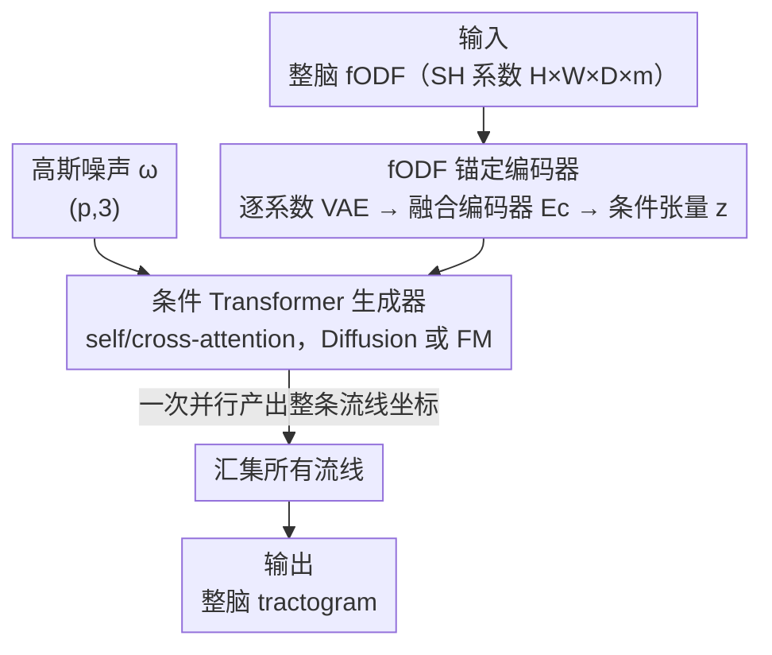

# GenTract: Generative Global Tractography

**会议**: CVPR 2026  
**论文**: [CVF Open Access](https://openaccess.thecvf.com/content/CVPR2026/html/Sargood_GenTract_Generative_Global_Tractography_CVPR_2026_paper.html)  
**代码**: https://github.com/alecsargood/GenTract  
**领域**: 医学图像 / 扩散模型  
**关键词**: 脑白质纤维束追踪, 全局 tractography, 条件生成, 扩散模型, Flow Matching  

## 一句话总结
GenTract 把脑白质纤维束追踪（tractography）从"一步步沿局部方向走"的局部搜索，改写成"以整脑 dMRI 为条件、一次并行采样出整条流线坐标"的全局条件生成任务，用 VAE 编码 fODF + 条件 Transformer（Diffusion / Flow Matching），在高质量数据上精度做到 SOTA，在低分辨率/噪声场景下比次优方法高出最多约 3.5 倍。

## 研究背景与动机
**领域现状**：tractography 要从扩散磁共振（dMRI）里推断脑白质通路的 3D 轨迹（streamline）。主流是**局部追踪（local tracking）**：从种子点出发，逐体素读取局部纤维方向（fODF），一步一步往前走画出流线；近年也有把它做成强化学习（TrackToLearn / TractOracle）或自回归扩散预测下一步（DDTracking）的 ML 变体。另一条路线是**全局 tractography**：把整脑所有流线当成一个优化问题同时求解。

**现有痛点**：局部追踪本质是**逐步外推**，误差会沿流线累积，产生大量假阳性连接，在 crossing/kissing 等复杂纤维构型和低分辨率/低信噪比的临床扫描下尤其严重；它还**依赖 seeding mask**（定义流线起点的掩膜），而掩膜怎么做（手工分割还是阈值化）会引入操作者相关的随意性，破坏可复现性。全局方法虽然对局部扰动更鲁棒、不那么依赖种子掩膜，但靠传统优化求解，**计算极慢、容易陷入次优解、还经常生成不完整的 tractogram**，所以一直没成为主流。

**核心矛盾**：局部方法快但精度差（误差累积 + 种子依赖），全局方法稳但算不动（优化瓶颈 + 失败模式）。两条路各有死穴，没人同时拿到"全局鲁棒"和"实用效率"。

**本文目标**：在保留全局方法"看整脑上下文、不靠种子掩膜"优势的同时，把它那套昂贵的迭代优化换成一次性的生成采样，从而既精确又高效。

**切入角度**：作者观察到现代生成模型（Diffusion / Flow Matching）擅长"从噪声直接采样出复杂结构化对象"。那么如果把一条 streamline 看成一个待生成的对象、把整脑 fODF 看成条件，tractography 就变成"从学到的条件分布里采样流线"——所有坐标**一次并行产出**，天然没有逐步误差传播，也不需要种子掩膜。

**核心 idea**：用"以全局 fODF 为条件的生成采样"替代"逐步局部追踪 / 慢速全局优化"，让模型直接学 dMRI → 完整解剖合理流线的映射。

## 方法详解

### 整体框架
GenTract 由两大组件串成：一个**全局 fODF 编码器**把整脑扩散信息压成条件张量 $z$，一个**条件 Transformer 生成器**在 $z$ 的引导下、从高斯噪声一次性采样出整条流线的所有坐标。训练时，VAE 先把每个 fODF 系数体素体压成隐表示，再经一个共享权重的类别条件融合编码器 $E_c$ 提炼并降维成 $z$；生成器以 Diffusion 或 Flow Matching 目标学习"噪声 → 干净流线"的连续时间过程。推理时对新被试先算出其 $z$，然后反复批量采样，把生成的一条条流线汇集成整张 tractogram。

输入是一个 $H\times W\times D\times m$ 的 4D 张量（每个体素一个 $m$ 维球谐系数向量，$L_{max}=6$ 时 $m=28$），输出是大量 $(p,3)$ 形状的流线（每条 $p$ 个 3D 采样点）。

### 关键设计

**1. 把 tractography 重写成全局条件生成任务：一次并行采样整条流线**

这一步直击两个痛点：局部方法的逐步误差累积、以及对 seeding mask 的依赖。GenTract 不再"走一步预测下一步"，而是把一条 streamline 当作要整体生成的对象——给定整脑 fODF 条件 $z$，模型从一个学到的**条件分布**里采样，**同时**输出流线上全部 $p$ 个点的坐标。因为所有坐标并行产生、不存在自回归链，单点误差就不会沿流线滚雪球式放大；又因为采样是"从噪声 + 全局条件"开始，不需要谁来指定起点，**彻底去掉了种子掩膜**这一可复现性杀手。这正是它在噪声/低分辨率下不像局部方法那样崩盘的根本原因：局部方法在模糊的局部信息上会 drift，而 GenTract 始终拿整脑上下文做判断。

**2. fODF 锚定编码器：逐系数 VAE + 类别条件融合，压出全局条件张量 $z$**

生成器要"看整脑"，但原始 fODF 是高维 4D 数据，直接喂不现实，这个编码器负责把它压成紧凑且信息充分的条件 $z$，分两阶段。第一阶段是**逐系数表示学习**：fODF 在每个体素被投影到球谐基上，
$$f(\theta,\phi)\approx\sum_{l=0}^{L_{max}}\sum_{k=-l}^{l}\vartheta_{lk}\,Y_l^k(\theta,\phi)$$
得到 $m$ 个系数体素体（每个系数对应一个 $H\times W\times D$ 体积）。作者为**每个系数训练一个独立 VAE**（由 MAISI VAE 微调而来），用重构 + 感知 + 对抗 + KL 正则的复合损失，把第 $i$ 个系数体压到隐空间 $z^{(i)}$。第二阶段是**融合与精炼**：一个 3D ResNet 式的**类别条件编码器** $E_c$ 把每个 $z^{(i)}$ 再编码成 $\hat z^{(i)}=E_c(z^{(i)}, i)$——权重在所有 $m$ 个系数间共享，但把系数索引 $i$ 作为条件喂进去以保留各系数特有信息，同时进一步降空间分辨率省算力。关键是 $E_c$ **和下游生成器联合训练**（VAE 则是预训练冻结），所以它能自适应地抽取对追踪任务最有用的信息。最后把所有 $\hat z^{(i)}$ 沿通道拼接，得到全局条件张量 $z$（形状 $(H_c W_c D_c,\ m C_c)$）。

**3. 条件 Transformer 生成器：self/cross-attention + Diffusion / Flow Matching 双范式**

这是真正"画线"的核心。生成器接收三个输入：带噪流线 $x_t$（形状 $(p,3)$）、时间步 $t$、条件 $z$，先线性投影到共享维度 $n$，加正弦位置编码和可学习时间嵌入，再过 $M$ 层 Transformer。其中两种注意力分工明确：**self-attention** 建模流线内部各点之间的几何依赖、保证流线自身连贯；**cross-attention** 把全局解剖条件 $z$ 注入，让整脑白质结构指导这条流线往哪长。作者把生成范式做成**可插拔**的，并首次在全局 tractography 上同时实现并对比 Diffusion 与 Flow Matching：Diffusion 学反噪过程，预测加入的噪声
$$\mathcal{L}_D(\theta)=\mathbb{E}_{t,x_0,\epsilon}\big[\|\epsilon_\theta(x_t,t)-\epsilon\|^2\big]$$
Flow Matching 则直接回归把噪声搬运到数据的向量场（线性插值下目标场 $v=x_1-x_0$）
$$\mathcal{L}_{FM}(\theta)=\mathbb{E}_{t,x_0,x_1}\big[\|v_\theta(x_t,t)-v\|^2\big]$$
两种损失都会反传穿过 Transformer **和**类别条件编码器 $E_c$（让 $E_c$ 被任务信号塑形）。推理时从随机噪声出发、按 $z$ 条件解反向过程，批量重复即可从被试专属的流线分布里采出整张 tractogram。

### 损失函数 / 训练策略
VAE 阶段用复合损失（重构 + 感知 + 对抗 + KL）预训练并冻结；生成器阶段用 $\mathcal{L}_D$ 或 $\mathcal{L}_{FM}$ 训练，梯度同时更新 Transformer 与融合编码器 $E_c$。数据：HCP Young Adult 1042 名被试，监督目标来自 PyAFQ 流水线（约束球面反卷积估 fODF + 概率追踪 + 按 24 个已知 bundle 的图谱过滤），75/10/15 划分，并用确定性旋转（±15°/±30°/±45°）增广。SH 体素降到 1.875 mm³、z-score 归一化，流线坐标 min-max 缩放到 $[-1,1]$。推理用 DDIM。

## 实验关键数据

### 主实验
在 HCP 测试集上与经典局部（iFOD2、SD Stream）、深度局部（TractOracle、DDTracking）、经典全局（tckglobal）对比。评测用与训练无关的两套独立工具：BundleSeg（BS % P 精度 + 恢复 bundle 数 /51）与 TractOracle-Net（TO-Net % P）。

| 方法 | BS % P | BS Bundles (/51) | TO-Net % P |
|------|--------|------------------|------------|
| tckglobal | 0.19 | 42.91 | 17.83 |
| iFOD2 | 1.96 | 48.88 | 6.30 |
| SD Stream | 4.71 | 47.85 | 11.10 |
| DDTracking | 35.20 | 49.69 | 30.70 |
| TractOracle | 28.93 | 48.20 | 39.55 |
| **GenTract** | **61.95** | 36.62 | **56.35** |

GenTract 精度大幅领先：BS % P 上比次优的 DDTracking（35.20）和 TractOracle（28.93）分别高 **1.8× 与 2.1×**；代价是 bundle 数偏低（36.62 vs 基线 48–50），即假阴性更多。作者认为这是因为训练目标被限制在 PyAFQ 的 24-bundle 分布上，模型学到的"合法流线"范围更窄。

### 鲁棒性实验（噪声 / 低分辨率）
加 Rician 噪声、合成降采样到 3 mm³ 后，局部方法和经典全局方法几乎全崩，GenTract 仍保持显著领先。

| 设置 | 指标 | GenTract | 次优基线 | 备注 |
|------|------|----------|----------|------|
| Rician 噪声 | BS % P | **60.32** | 22.06 (TractOracle) | GenTract BS % P 仅降 2.6% |
| 低分辨率+噪声 (HCP) | BS % P | **15.73** | 4.44 (DDTracking) | 比次优高一个数量级；局部法与 tckglobal 降到 0% |
| 低分辨率+噪声 (HCP) | TO-Net % P | **43.43** | 8.42 (DDTracking) | — |
| 外部 TractoInferno (LR+噪声) | BS % P | **24.94** | 9.74 (TractOracle) | 跨数据集仍领先，证明泛化 |

### 消融实验（内部模型选型）
均能找全 24 个 AFQ bundle，差异主要在 AFQ % P 精度上。

| 配置 | AFQ % P | 说明 |
|------|---------|------|
| Diffusion, M=4 | 81.8 | 层数越多越好 |
| Diffusion, M=8 | **85.0** | 最佳深度 |
| Flow Matching, M=8 | 82.45 | 同深度下 FM 逊于 Diffusion |
| Diffusion, M=8, n=128 | 80.6 | 维度太小欠拟合 |
| Diffusion, M=8, n=256 | **85.0** | 最优嵌入维 |
| Diffusion, M=8, n=512 | 79.3 | 维度太大过拟合 |

最终选 Diffusion + $M=8$ + $n=256$。推理步数上：5 步仅 69.7%，10 步跳到 82.9%，25/50 步只微涨到 85%+ 却让时间从 391s 翻到 1976s——因此固定用 **10 个 DDIM 步**。

### 关键发现
- **Diffusion > Flow Matching**：同等层深下 Diffusion 精度稳定更高（85.0 vs 82.45），这是论文在全局 tractography 上对两种范式的首次直接对比结论。
- **精度-召回权衡很明显**：GenTract 把精度推到 SOTA，但 bundle 召回偏低；作者诚实地把原因归到 24-bundle 训练分布上。⚠️ 这意味着横向比 bundle 数时要注意各方法训练监督不同，不可直接判优劣。
- **鲁棒性是最大卖点**：数据越烂，GenTract 的相对优势越大（低分辨率下高出次优一个数量级），印证了"全局并行采样 + 整脑条件"对抗局部 drift 的设计初衷。

## 亮点与洞察
- **把"逐步追踪"换成"整体采样"是个很干净的范式切换**：一旦不走自回归，误差累积和种子掩膜两个老大难同时消失，这种"换问题形式而非打补丁"的思路很值得迁移到别的逐步外推任务（如轨迹/曲线重建）。
- **逐系数 VAE + 共享权重类别条件编码器**：用一套共享权重处理 $m$ 个 SH 系数体、靠系数索引 $i$ 做条件区分，既省参数又保留各系数语义，是处理"多通道同构体积"的实用模板。
- **生成范式做成可插拔**并真刀真枪对比 Diffusion 与 FM，给后续"医学结构生成该选哪种范式"提供了一个干净的实证参照点。

## 局限与展望
- **召回偏低**（bundle 数显著少于基线），受限于 24-bundle 的 PyAFQ 训练分布；扩到更全的 bundle 图谱或更多样的过滤监督可能缓解。
- **强依赖代理"真值"**：tractography 没有生物学绝对 ground truth，精度全靠 BundleSeg / TO-Net 等过滤器当代理，指标天花板和偏置都来自这些工具。⚠️ 不同过滤器口径不同，精度数值跨工具不可直接比。
- **算力门槛**：每个 SH 系数一个 VAE、整套在 H100 上训练，复现成本不低；10 步推理生成整脑 tractogram 仍需数百秒量级。
- 自己的观察：所有"低分辨率/噪声"都是**合成降质**（人工降采样 + 加 Rician 噪声），真实临床低场扫描的退化模式更复杂，泛化结论还需真临床数据验证。

## 相关工作与启发
- **vs DDTracking**：同是扩散，但 DDTracking 是"扩散预测下一步"的自回归局部法，仍逐步外推、对扰动敏感；GenTract 是"一次生成整条流线"的全局法，从机制上消除误差累积，精度高 1.8×。
- **vs TractOracle / TrackToLearn**：它们用 RL + 解剖先验奖励来压假阳性，本质仍是逐步 agent；GenTract 不做逐步决策，靠全局条件采样，噪声下更稳（BS % P 降幅 2.6% vs TractOracle 23.8%）。
- **vs tckglobal（经典全局）**：同样追求全局最优，但 tckglobal 靠传统能量优化、慢且易陷次优，低分辨率下精度直接崩到 0%；GenTract 用生成采样替代优化，既保留全局视野又快又稳。

## 评分
- 新颖性: ⭐⭐⭐⭐⭐ 首个把全局 tractography 形式化为条件生成任务，范式切换干净有力
- 实验充分度: ⭐⭐⭐⭐ 主对比 + 3 套退化/外部鲁棒性 + 范式/层数/步数消融都到位，唯召回劣势分析略浅
- 写作质量: ⭐⭐⭐⭐⭐ 动机推导清晰，对自身召回偏低与代理真值局限都诚实交代
- 价值: ⭐⭐⭐⭐ 低分辨率/噪声下的鲁棒性对临床 dMRI 很有现实意义，但算力门槛与召回问题限制即时落地

<!-- RELATED:START -->

## 相关论文

- [\[CVPR 2026\] SemiGDA: Generative Dual-distribution Alignment for Semi-Supervised Medical Image Segmentation](semigda_generative_dual-distribution_alignment_for_semi-supervised_medical_image.md)
- [\[CVPR 2026\] Solving a Nonlinear Blind Inverse Problem for Tagged MRI with Physics and Deep Generative Priors](solving_a_nonlinear_blind_inverse_problem_for_tagged_mri_with_physics_and_deep_g.md)
- [\[CVPR 2026\] Continual Learning for fMRI-Based Brain Disorder Diagnosis via Functional Connectivity Matrices Generative Replay](forge_continual_learning_for_fmri_based_brain_disorder_diagnosis.md)
- [\[CVPR 2026\] A Supervised Multi-task Framework for Joint cryo-ET Restoration Enabled by Generative Physical Simulation](a_supervised_multi-task_framework_for_joint_cryo-et_restoration_enabled_by_gener.md)
- [\[ICML 2026\] Marrying Generative Model of Healthcare Events with Digital Twin of Social Determinants of Health for Disease Reasoning](../../ICML2026/medical_imaging/marrying_generative_model_of_healthcare_events_with_digital_twin_of_social_deter.md)

<!-- RELATED:END -->
