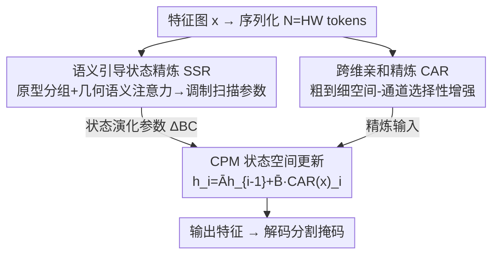

# GeoSemba: Reconstructing State Space Model for Cross Paradigm Representation in Medical Image Segmentation

**会议**: CVPR 2026  
**论文**: [CVF Open Access](https://openaccess.thecvf.com/content/CVPR2026/html/Sun_GeoSemba_Reconstructing_State_Space_Model_for_Cross_Paradigm_Representation_in_CVPR_2026_paper.html)  
**代码**: https://github.com/Mrliujunwen/GeoSemba  
**领域**: 医学图像 / 语义分割 / 状态空间模型(Mamba)  
**关键词**: Mamba, 医学图像分割, 状态空间模型, 几何语义传播, 空间-通道交互

## 一句话总结
针对 Mamba 把 2D 图像拉成 1D 序列后"按扫描顺序而非语义相关性传信息"和"空间-通道解耦"两大毛病，GeoSemba 用语义引导状态精炼器（SSR）做几何条件的跨区域语义传播、用跨维亲和精炼器（CAR）做粗到细的空间-通道选择性增强，在六种医学模态上以更低算力刷新分割精度。

## 研究背景与动机

**领域现状**：医学图像分割里，ViT 能建长程依赖但二次复杂度难落地；Mamba 用线性复杂度状态空间建模 + 可并行成为新宠，催生了大量 Mamba-UNet/SegMamba/Spatial-Mamba 等变体。

**现有痛点**：Mamba 的扫描机制把 2D 图像**序列化成 1D token 流**，会破坏临床有意义结构的连续性。已有改进（强化结构引导、自适应扫描路径）仍主要**按空间邻近**组织信息流，而不是按跨区域语义亲和——结果是序列化后把语义上很不一样、但空间被拉近的响应一起传播（Fig.1a），模糊了判别证据。另一面，序列传播的路径依赖让模型偏向"按扫描顺序"建依赖：一类工作用注意力式增强空间感知，却把**空间交互与通道判别割裂**处理；可医学诊断线索常来自空间和通道的**联合效应**，缺了显式空间-通道耦合，低幅但有判别力的响应会在聚合时被压没，表征被过度同质化。还有一类靠多方向扫描扩大上下文，代价是额外算力且空间-通道耦合仍欠建模。

**核心矛盾**：序列化后真正的问题不是"保不保邻接"，而是"**序列化之后到底该让哪些响应互相作用**"——既要按语义相关性（而非扫描顺序）传播，又要在空间上下文条件下建通道响应，还不能丢掉 Mamba 的线性复杂度。

**本文目标**：让 Mamba 在单次扫描内同时获得 (1) 跨层次的几何感知语义交互、(2) 协调的空间-通道建模。

**切入角度**：把这两条性质直接**重构进状态空间更新本身**——状态转移参数由语义-几何上下文调制（解决该和谁交互），输入则先经空间-通道精炼（解决空间通道联合）。

**核心 idea**：用 SSR 改写"状态怎么演化"、用 CAR 改写"喂给状态的输入"，二者塞进一个 MetaFormer 风格的 Cross-Paradigm Module（CPM），在单扫描里完成几何-语义传播与空间-通道选择性交互。

## 方法详解

### 整体框架
GeoSemba 是 encoder-decoder 结构，核心是堆叠的 **Cross-Paradigm Module（CPM）**。每个 CPM 遵循 MetaFormer 范式，把 token mixer 实例化成一次选择性状态空间更新：**SSR 负责参数化状态演化、CAR 负责提供精炼后的输入**。给定特征图 $x\in\mathbb{R}^{H\times W\times C}$，先序列化成 $N=HW$ 个 token；SSR 抽取原型条件上下文并预测逐 token 扫描参数 $\{\Delta^{\text{SSR}}_i, B^{\text{SSR}}_i, C^{\text{SSR}}_i\}$，离散化为 $\bar A^{\text{SSR}}_i=\exp(\Delta^{\text{SSR}}_i A)$、$\bar B^{\text{SSR}}_i=\Delta^{\text{SSR}}_i B^{\text{SSR}}_i$；CAR 则并行地把 $x$ 做空间-通道精炼得到 $\mathrm{CAR}(x)_i$。CPM 更新为
$$h^{\text{CPM}}_i=\bar A^{\text{SSR}}_i h^{\text{CPM}}_{i-1}+\bar B^{\text{SSR}}_i\,\mathrm{CAR}(x)_i,\qquad y^{\text{CPM}}_i=C^{\text{SSR}}_i h^{\text{CPM}}_i+Dx_i.$$
直观说：SSR 决定"状态按什么样的几何-语义关系往下传"，CAR 决定"每一步喂进去的输入是不是已经做了空间-通道净化"，两路在单次扫描里耦合。

### 关键设计

**1. 语义引导状态精炼器 SSR：让状态按"几何条件的语义相关性"传播，而非扫描顺序**

SSR 解决"序列化后该和谁交互"的问题，分三步。**语义原型分组（SPG）**：引入 $M\ll N$ 个原型锚点，用余弦相似度把每个 token 分到最近原型 $c_i=\arg\max_k \frac{x_i^\top p_k}{\lVert x_i\rVert\lVert p_k\rVert}$，每个原型配可学嵌入 $e_k$ 加回所属 token；锚点训练时用 EMA 更新防漂移。每组算均值特征 $a_k$ 与空间质心 $g_k$，拼接后过 $1\times1$ 卷积成原型节点 $n_k=\phi_{1\times1}(\mathrm{Concat}(a_k,g_k))$——一个同时保语义一致与粗几何布局的紧凑描述子。**几何-语义连结注意力（GSNA）**：在原型集（而非全 token 网格）上建依赖，走两条互补路径——全局上下文路把所有原型 GAP 成全局描述子、过两层 $1\times1$ 卷积得调制向量 $\tilde F_g$ 再逐元素乘回 $\tilde n^{\text{sem}}_k=\tilde F_g\odot n_k$；空间关系路用 2D 曼哈顿距离先验 $M^{\text{dist}}_{k,q}=\gamma^{|x_k-x_q|+|y_k-y_q|}$（$0<\gamma<1$，越近亲和越大），softmax 后聚合 $\tilde n^{\text{geo}}_k=\sum_q \alpha_{kq}\odot n_q$。这个曼哈顿先验保留了**整体 2D 空间关系**，避免轴向分解式设计（把长程依赖拆成可分离方向）带来的方向偏置；且因为只在 $M\ll N$ 的原型集上算成对距离，开销很小。两路相加再 $1\times1$ 卷积融合成 $F^{\text{GSNA}}_k$。**上下文调制扫描（CMS）**：对每个 token $x_i$，把它和所属原型的 $F^{\text{GSNA}}_{c_i}$ 拼起来过 MLP+softmax 得调制信号 $s_i=\mathrm{Softmax}(W_s\,\mathrm{Concat}(x_i,F^{\text{GSNA}}_{c_i}))$，用它调制由 $x_i$ 算出的基扫描参数，产出最终 $\Delta^{\text{SSR}}_i,B^{\text{SSR}}_i,C^{\text{SSR}}_i$。于是状态演化既保留局部自适应，又被原型级几何-语义上下文引导——语义证据按"结构相关性"而非扫描顺序传播。

**2. 跨维亲和精炼器 CAR：粗到细地把空间和通道一起建模，保住低幅但有判别力的响应**

CAR 解决"空间-通道割裂"的问题，走"宏感知 → 微聚焦"的 coarse-to-fine 设计。**宏感知**：输入 $x$ 先经 $3\times3$ 深度卷积 + BN + LeakyReLU 得到全视野粗上下文先验 $x_{\text{global}}$，再过一层 $3\times3$ 深度卷积得 $x_{\text{local}}$（在全局上下文条件下保住局部判别响应）。**微聚焦**：对 $x_{\text{local}}$ 做通道注意力 $a_c=\mathrm{CA}(x_{\text{local}})$，重标定 $G_{\text{reg}}=a_c\odot x_{\text{local}}$，压住局部共激活区域里的伪通道响应、保留区域一致的解剖线索。随后 **Token Aggregation（TA）** 建位置相关交互：从 $G_{\text{reg}}$ 取位置敏感 query $Q=W_q(G_{\text{reg}})$ 和经自适应池化的聚合 key $K=W_k(\mathrm{AP}(G_{\text{reg}}))$，分成 $G$ 个通道组，每组算亲和矩阵 $\Phi_g=Q_g K_g^\top$，再用行级线性投影 $W_d$ 整合不同池化位置的互补相关、softmax 成动态算子 $\Omega_g$。关键是 **Top-K 门控**：只保留每行最强的相关、其余置零得稀疏亲和 $\bar\Phi_g=\mathrm{TK}(\Phi_g)$，强制结构化稀疏、滤掉弱噪声亲和，让模型聚焦最有判别力的空间-通道交互。最后把 $G_{\text{reg}}$ 投到紧凑 $R\times R$ 网格、按组用 $\bar\Omega_g$ 选择性聚合、残差回 $G_{\text{reg}}$ 得 $x_{TA}$，再与全局先验逐元素门控 $x_{\text{CAR}}=x_{\text{global}}\odot x_{TA}$，把全局上下文引导注入亲和精炼后的局部响应。整套就是为了让"空间位置 × 通道选择"联合决定哪些响应被增强，避免低幅但诊断关键的响应在聚合中被同质化抹平。

### 损失函数 / 训练策略
PyTorch 2.1.1，单张 RTX 4090，训练 120 epoch，Adam，初始学习率 $10^{-4}$，batch size 8；输入缩放到 $512\times512$，随机旋转+翻转增强。模块超参：SPG 原型数 $M=7$，TA 通道组 $G=12$、上下文聚合 $S=7$、空间缩减 $R=32$。

## 实验关键数据

六个公开数据集横跨皮肤镜（ISIC2018）、放射（COVID19-1）、超声（BUSI）、显微（DSB2018）、结肠镜（ClinicDB）、眼底（DRIVE）六种模态，指标用 DSC / IoU，对比 13 个 CNN/ViT/Mamba SOTA，并附单尾 t 检验 p 值。

### 主实验（DSC %，节选六模态）

| 方法 | ISIC2018 | COVID19-1 | BUSI | DSB2018 | ClinicDB | DRIVE |
|------|----------|-----------|------|---------|----------|-------|
| TransUNet | 87.3 | 75.6 | 75.5 | 91.8 | 87.4 | 81.5 |
| VM-UNet | 89.7 | 80.0 | 79.2 | 91.5 | 91.9 | 84.0 |
| Spatial-Mamba | 90.1 | 83.3 | 81.2 | 91.9 | 91.8 | 85.8 |
| SCSegamba | 90.7 | 83.3 | 81.5 | 92.5 | 92.3 | 86.6 |
| DefMamba | 90.4 | 82.8 | 81.1 | 91.6 | 91.7 | 85.8 |
| **GeoSemba** | **91.1** | **83.8** | **82.1** | **93.2** | **94.8** | **86.6** |

相对代表性结构感知方法 Spatial-Mamba，平均 DSC/IoU 各 +1.25% / +1.75%；相对多方向扫描的 SCSegamba 各 +0.78% / +1.13%，多数对比 p<0.05 显著。效率上 GeoSemba 推理 0.018 s/图、44.11M 参数，而多方向扫描的 VM-UNet 要 54.86M、0.023 s/图——保住了单扫描状态空间的效率优势。

### 消融实验（ISIC2018 DSC %）

| 配置 | DSC | 说明 |
|------|-----|------|
| GeoSemba(Full) | 91.1 | 完整模型 |
| w/o CAR | 90.5 | 去掉跨维亲和精炼 |
| w/o SSR | 90.7 | 去掉语义引导状态精炼 |
| SSR: w/o SPG | 88.6 | 去原型分组 |
| SSR: w/o GSNA | 88.3 | 去几何-语义注意力（掉最多） |
| CAR: w/o MP | 88.4 | 去宏感知 |
| CAR: w/o CA | 88.6 | 去通道注意力 |
| CAR: w/o Top-K | 89.8 | 去 Top-K 稀疏门控 |

### 关键发现
- **GSNA 是 SSR 里最关键的一环**：去掉 GSNA（91.1→88.3）比去 SPG（→88.6）掉得更多，说明"原型级几何-语义依赖建模"对稳定状态精炼最重要。
- **CAR 里宏感知/通道注意力比 Top-K 更关键**：去 MP/CA 掉到 88.4/88.6，去 Top-K 仅到 89.8——粗到细的空间-通道基底比稀疏门控贡献更大，但 Top-K 仍带来约 +1.3% 的纯增益。
- **原型数 $M=7$ 是甜点**：$M=3$ 表达不足（ISIC 89.2）、$M=12$ 反而退化且更慢（90.1, 19.8ms），$M=7$ 最优（91.1, 17.0ms）。
- **在规则形状数据集上优势收窄**：ClinicDB 上多数息肉形状规则、边界清晰，region-conditioned 精炼需求降低，SSR 收益减小、CAR 偶尔过平滑边界——方法对"边界模糊、空间-通道耦合强"的难样本增益最大。

## 亮点与洞察
- **把"该和谁交互"重构进状态空间参数**：不是事后再加注意力，而是让 SSR 直接调制 $\Delta/B/C$ 扫描参数，按语义相关性而非扫描顺序传信息——这个"改写状态演化本身"的思路比堆叠后处理更本质。
- **曼哈顿距离先验替代轴向分解**：保留整体 2D 空间关系、避开方向偏置，且只在 $M\ll N$ 原型集上算成对距离，几乎不增开销，是"既要全 2D 关系又要省算力"的巧解。
- **Top-K 结构化稀疏亲和**：在空间-通道亲和矩阵上做行级 Top-K 去噪，思路可迁移到任何"亲和矩阵含大量弱噪声"的聚合场景。
- **单扫描即拿下精度+效率**：不靠多方向扫描就超过 VM-UNet 且参数/延迟更低，证明"重构单次扫描"比"叠加扫描方向"更划算。

## 局限与展望
- 作者承认在形状规则、边界清晰的数据集（ClinicDB）上增益有限，CAR 偶尔过平滑边界——方法更吃"难样本红利"。
- 引入原型锚点 EMA、GSNA、TA、Top-K 等多个子模块，超参（$M,G,S,R,\gamma$、Top-K 比例）较多，跨数据集是否需重调论文未充分展开。
- 仅在 2D 切片、六个相对小规模公开集上验证；3D 体数据、大规模或弱标注场景的表现未知。
- 曼哈顿距离先验依赖原型质心坐标，原型分组质量差时几何先验可能失真。

## 相关工作与启发
- **vs 结构保持类（LocalMamba / Spatial-Mamba / DefMamba）**：它们用结构线索保空间连续性，但仍按邻近而非跨区域语义传播；GeoSemba 用 SSR 显式做几何条件的语义传播，平均 DSC 高出 Spatial-Mamba 1.25%。
- **vs 空间增强类（MambaIRv2 / VSSD / FSE-Mamba）**：它们强化空间上下文却没和通道选择性协同；CAR 的粗到细空间-通道联合建模正补这块。
- **vs 多方向扫描类（VM-UNet / SCSegamba / 2DMamba）**：靠多扫描扩上下文、代价是算力；GeoSemba 单扫描即超越且更省参省时。

## 评分
- 新颖性: ⭐⭐⭐⭐ 把几何-语义传播与空间-通道交互一起重构进单次状态空间更新，切入点新
- 实验充分度: ⭐⭐⭐⭐⭐ 六模态、13 个 SOTA、逐模块+超参消融、t 检验、效率对比都齐
- 写作质量: ⭐⭐⭐⭐ 问题刻画（Fig.1）清晰，但子模块（SPG/GSNA/CMS/TA/Top-K）命名密集，需要对照图读
- 价值: ⭐⭐⭐⭐ 在保 Mamba 线性效率前提下实打实涨点，且开源，医学分割可直接用

<!-- RELATED:START -->

## 相关论文

- [\[CVPR 2026\] Multimodal Causality-Driven Representation Learning for Generalizable Medical Image Segmentation](multimodal_causal-driven_representation_learning_for_generalizable_medical_image.md)
- [\[NeurIPS 2025\] DyG-Mamba: Continuous State Space Modeling on Dynamic Graphs](../../NeurIPS2025/medical_imaging/dyg-mamba_continuous_state_space_modeling_on_dynamic_graphs.md)
- [\[CVPR 2026\] From Infusion to Assimilation Distillation for Medical Image Segmentation](from_infusion_to_assimilation_distillation_for_medical_image_segmentation.md)
- [\[CVPR 2026\] SegMoTE: Token-Level Mixture of Experts for Medical Image Segmentation](segmote_token-level_mixture_of_experts_for_medical_image_segmentation.md)
- [\[CVPR 2026\] KAMP: Knowledge-Anchored Multimodal Pretraining Framework for Medical Image Representation](kamp_knowledge-anchored_multimodal_pretraining_framework_for_medical_image_repre.md)

<!-- RELATED:END -->
