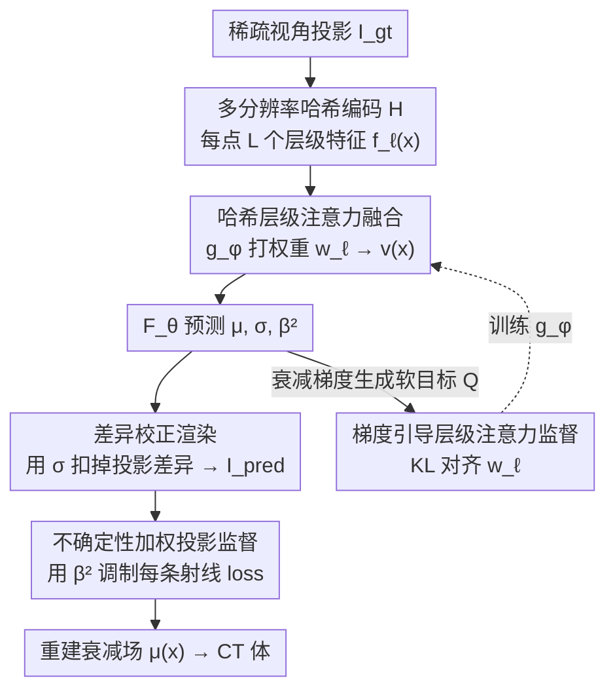

# GH-NAF: Grid-Adaptive Hash-Level-Attended Neural Attenuation Fields for Discrepancy-Aware CBCT

**会议**: CVPR 2026  
**论文**: [CVF Open Access](https://openaccess.thecvf.com/content/CVPR2026/html/Oh_GH-NAF_Grid-Adaptive_Hash-Level-Attended_Neural_Attenuation_Fields_for_Discrepancy-Aware_CBCT_CVPR_2026_paper.html)  
**代码**: https://github.com/seongje-oh/GH-NAF  
**领域**: 医学图像  
**关键词**: 稀疏视角CBCT重建, 神经衰减场, 多分辨率哈希编码, 哈希层级注意力, 投影差异建模  

## 一句话总结
GH-NAF 给基于哈希编码的 NeRF 式 CBCT 重建加上一个"按空间位置自适应挑选哈希分辨率层级"的注意力机制，并配合可微的投影差异校正渲染和不确定性加权监督，让模型在均匀组织里压低高频、在结构边界处保留细节，从而在真实 CBCT 上同时改善材料内对比度和边界清晰度。

## 研究背景与动机

**领域现状**：稀疏视角 CT 重建的目标是用尽量少的 X 光投影（几十个视角而非几百个）恢复高质量 CT 体数据，以降低患者辐射剂量。NeRF 思路把 CT 重建表述为「学一个连续的衰减系数场 $F_\theta:(x,y,z)\mapsto\mu(x)$」，用可微 X 光前向模型把预测的衰减积分成投影、和实测投影对齐做自监督训练（NAF 是这条线的起点）。其中**多分辨率哈希编码**（Instant-NGP 那套）用多个分辨率的体素网格存可学习特征，再三线性插值，既能抓低频全局结构又能抓高频局部细节，是当前的主力表示。

**现有痛点**：真实 CBCT 投影并不满足理想的单能假设——存在散射（scatter）、探测器眩光、束硬化（beam hardening）、噪声等"投影差异"。已有 NeRF/NAF 方法把这些差异当作"可平均掉的噪声"，并且**把所有哈希层级的特征不加区分地均匀融合**。这种均匀融合会把异质的频率成分纠缠在一起：在本该平滑的均匀组织里冒出虚假高频纹理、把结构边界糊掉，还会让投影引入的偏差顺着表示传播开来。

**核心矛盾**：低频建模和高频建模的需求是**空间异质**的——均匀组织希望多用低频（粗层级），结构边界希望多用高频（细层级），但均匀融合用同一套权重处理全空间，无法因地制宜，于是出现"该平滑的地方有噪声纹理、该锐利的地方被模糊"的双输局面。此外真实投影里的低频噪声源自随机散射过程，本质上无法被完全分离或剔除。

**本文目标**：在不依赖差异监督标注（discrepancy supervision）的前提下，让重建在均匀区稳住低频、在边界处保住高频，并隐式地把投影差异从主衰减里扣掉。

**切入角度**：既然不同哈希层级编码不同频率，那就**别再均匀融合**——按每个空间点的局部衰减变化和模型自估的不确定性，动态决定各层级权重。

**核心 idea**：用"网格自适应的哈希层级注意力"代替"均匀层级融合"，并用衰减梯度生成软目标、用不确定性调制监督强度，实现频率感知的表示解耦。

## 方法详解

### 整体框架
GH-NAF 的输入是稀疏视角的 X 光投影 $I_{gt}$，输出是连续的衰减场 $\mu(x)$（重建出 CT 体）。整条 pipeline 把"多尺度哈希特征 → 按位置自适应融合 → 预测衰减+差异+不确定性 → 差异校正渲染成投影 → 和实测投影对齐"串起来，再额外用一条"梯度引导的层级注意力监督"分支去教注意力模块该怎么挑层级。

整个流程的关键在于：哈希编码器 $H$ 在每个点 $x$ 给出 $L$ 个层级特征 $f_\ell(x)$；一个轻量 MLP $g_\phi$ 给这些层级打注意力权重 $w_\ell(x)$ 做加权融合得到 $v(x)$；融合特征喂进 $F_\theta$ 同时吐出衰减系数 $\mu$、差异密度 $\sigma$ 和异方差方差 $\beta^2$（不确定性）；渲染端用 $\sigma$ 把投影差异从主衰减里扣掉得到 $I_{pred}$；监督端用 $\beta^2$ 给每条射线的损失加权；而注意力 $w_\ell$ 本身由"局部衰减梯度→目标层级分布"的软标签经 KL 对齐来训练。

### 关键设计

**1. 哈希层级注意力融合：用按位置的注意力替代均匀融合**

这一设计直接针对"均匀融合纠缠频率成分"的痛点。多分辨率哈希编码器 $H$ 在每个点 $x$ 产出 $L$ 个层级的特征 $f_\ell(x)$（$\ell=1,\dots,L$），粗层级编码低频全局信息、细层级编码高频细节。GH-NAF 不再把它们等权相加，而是引入一个轻量 MLP $g_\phi$ 预测每个点的 $L$ 维注意力向量，经 softmax 归一化得到权重 $w_\ell(x)$，再做加权和：

$$v(x)=\sum_{\ell=1}^{L} w_\ell(x)\, f_\ell(x).$$

融合后的 $v(x)$ 再喂进单独的 MLP $F_\theta$，一次性输出三个量：$\mu(x),\beta^2(x),\sigma(x)=F_\theta(v(x))$，其中 $\mu$ 是线性衰减系数、$\sigma$ 是局部差异密度、$\beta^2>0$ 是异方差方差项（不确定性估计，用于给训练损失加权）。在平滑均匀区，$g_\phi$ 会压低高频层级、偏向粗信息；在边界或细结构附近，则给细层级更大权重保住细节。这就把"用多少频率"变成了**逐点可学的局部决策**，而不是全局一刀切。

**2. 差异校正渲染：把投影差异显式从主衰减里扣掉**

针对"真实 CBCT 投影偏离理想单能假设、散射等差异无法直接剔除"的问题，GH-NAF 在可微体渲染里显式建模差异。沿射线 $r$ 采样后，主衰减是 Beer 定律的线积分 $I_\mu(r)=\sum_i \mu(x_i^{(r)})\delta_i^{(r)}$（$\delta_i$ 是第 $i$ 段路径长度），而差异贡献用差异密度积分 $S(r)=\sum_i \sigma(x_i^{(r)})\delta_i^{(r)}$ 估计。沿用 Park 等人的公式，把两者合成差异校正后的对数投影：

$$I_{pred}(r)=I_\mu(r)-\ln\!\Big(\frac{\sinh(\lambda_\sigma S(r))}{\lambda_\sigma S(r)}\Big),$$

其中 $\lambda_\sigma>0$ 控制差异强度。校正项 $\ln(\sinh x/x)$ 是个平滑、物理上有依据的函数：当 $S(r)\to 0$ 时它趋于 0，使 $I_{pred}(r)\approx I_\mu(r)$，即在几乎无差异的区域不动主衰减；有差异时则从主衰减里减去一个近似的差异贡献。这样模型在直接对齐实测（带差异的）投影时，能把差异这部分"隐式吸收"进 $\sigma$，而不污染 $\mu$。

**3. 不确定性加权投影监督：用自估方差做课程式加权**

普通 MSE 对所有射线一视同仁，会被高差异/高噪声区域带偏。GH-NAF 改用不确定性学习：先算每个采样点的吸收率 $\alpha_i^{(r)}=1-\exp(-\mu(x_i)\delta_i)$ 和透射率 $T_i^{(r)}=\prod_{j<i}(1-\alpha_j)$，得到体渲染权重 $w_i^{(r)}=\alpha_i^{(r)}T_i^{(r)}$；再用权重平方聚合沿射线的局部方差 $\hat\beta^{2,(r)}=\sum_i (w_i^{(r)})^2\beta^2(x_i^{(r)})$。最终的投影损失是高斯观测模型的负对数似然：

$$\mathcal{L}_{proj}=\mathbb{E}_r\Big[\frac{\lVert I_{pred}(r)-I_{gt}(r)\rVert^2}{2\hat\beta^{2,(r)}}+\frac{1}{2}\ln\hat\beta^{2,(r)}\Big].$$

逆方差项 $1/\hat\beta^{2,(r)}$ 充当自适应置信权重：放大低不确定性射线的监督、压低高不确定性射线的影响，于是优化呈"课程式"——先把可靠的低不确定性区域学扎实，随训练推进不确定性下降，重心再移向先前模糊的区域去恢复细结构。$\frac{1}{2}\ln\hat\beta^{2,(r)}$ 是归一化惩罚，防止模型靠把所有方差吹大来作弊，从而得到标定良好的不确定性和稳定梯度。

**4. 梯度引导的层级注意力监督：用衰减梯度自造软标签教注意力挑层级**

注意力模块 $g_\phi$ 没有"哪里该用高频"的标注，本设计用局部衰减梯度自监督地造训练信号。直觉是：衰减变化大的地方（边缘、细结构）该用更高频，均匀区该靠粗特征。对每个内部采样点用中心差分估计沿射线方向的衰减变化 $\Delta\mu_i^{(r)}=\mu(x_{i+1}^{(r)})-\mu(x_{i-1}^{(r)})$，在整个 batch 上归一化到 $[0,1]$ 得无量纲指标 $\widetilde{\Delta\mu}_i^{(r)}$，再线性映射到目标层级 $\bar\ell_i^{(r)}=(L-1)\,\widetilde{\Delta\mu}_i^{(r)}$（梯度越大越偏向细层级）。把目标层级转成以 $\bar\ell_i$ 为中心的高斯软分布 $Q_i^{(r)}(\ell)\propto\exp(-(\ell-\bar\ell_i^{(r)})^2/2\sigma^2)$ 并归一化（$\sigma$ 是带宽，取中等值，强偏中心层级但允许邻近层级有贡献，避免硬指派到单层）。然后让模型预测的注意力分布 $W_i^{(r)}(\ell)=w_\ell(x_i^{(r)})$ 去对齐 $Q$，用 KL 散度并由逆方差调制强度：

$$\mathcal{L}_{attn}=\mathbb{E}_r\,\mathbb{E}_i\Big[\frac{\mathrm{KL}(Q_i^{(r)}\Vert W_i^{(r)})}{2\beta^2(x_i^{(r)})}\Big],$$

求和只跑每条射线的内部采样点（排除两端 $i=1$ 和 $i=N_r$）。$1/(2\beta^2)$ 在高不确定性点放松对齐惩罚——那里梯度线索本身可能不可靠。这样无需任何"哪里要细节"的人工标注，纯靠衰减梯度启发式地驱动注意力分配，是 GH-NAF 标称的核心新点。

### 损失函数 / 训练策略
除上述三项损失外，因稀疏视角下重建高度病态，还加两个正则：**衰减稀疏正则** $\mathcal{L}_{dens}=\mathbb{E}_r\mathbb{E}_i[\log(1+s\,\mu(x_i^{(r)}))]$（凹的 log-sum 惩罚，$s>0$ 控强度，抑制弥散小残差、保住边缘强响应，减少飘点和鬼影）；**遮挡正则** $\mathcal{L}_{occ}=\mathbb{E}_r\mathbb{E}_i[\alpha_i^{(r)}\exp(-z_i^{(r)}/\tau)]$（$z_i$ 是离源深度、$\tau$ 是衰减长度，防止把不透明度堆在射线起点、鼓励深度均衡分布）。总目标为

$$\mathcal{L}_{total}=\mathcal{L}_{proj}+\lambda_{attn}\mathcal{L}_{attn}+\lambda_r\mathcal{L}_{dens}+\lambda_o\mathcal{L}_{occ}.$$

## 实验关键数据

### 主实验

真实数据集：FIPS（3 个 case，低差异参考）和一台移动 CBCT 采的胸部体模（720 投影，差异显著）。因无真值，用 720 视角 FDK 重建作伪真值，再在均匀采样子集上评。FIPS 用 25/50 视角（360°），胸部体模用 100/125/150/200 视角。差异显著的体模用无参考指标 MANIQA，低差异场景用 PSNR/SSIM。

胸部体模（MANIQA，越高越好）：

| 视角数 | NAF | SAX | GH-NAF (本文) |
|--------|-----|-----|---------------|
| 100 | 0.252 | 0.268 | **0.338** |
| 125 | 0.296 | 0.268 | **0.414** |
| 150 | 0.292 | 0.353 | **0.392** |
| 200 | 0.260 | 0.322 | **0.393** |

FIPS（PSNR/SSIM，对 NeRF 类基线一致占优；Gaussian 类某些 case PSNR 更高但 SSIM 更低）：

| 模型 | 视角 | Seashell PSNR/SSIM | Walnut PSNR/SSIM | Pine PSNR/SSIM |
|------|------|--------------------|--------------------|----------------|
| NAF | 25 | 36.29 / 0.950 | 40.34 / 0.960 | 38.93 / 0.963 |
| SAX | 25 | 39.50 / 0.982 | 43.68 / 0.983 | 42.13 / 0.984 |
| GH-NAF | 25 | 39.91 / **0.972** | **46.54 / 0.991** | 43.84 / **0.989** |
| GH-NAF | 50 | 42.66 / 0.988 | 48.95 / **0.994** | 46.30 / **0.991** |

合成数据集（13 个 CT 体，TIGRE 模拟 15/30/50 视角，用无差异变体 GH-NAF w/o discrepancy）：GH-NAF 在多数设置的 PSNR/SSIM 优于多数方法，尤其 SSIM 普遍最高（如 15 视角 SSIM 0.934、50 视角 0.982）；Gaussian 基线（R2-Gaussian/Vol3DGS）PSNR 偶尔更高但 SSIM 一致更低，说明其结构一致性更弱。

### 消融实验
合成数据集上对损失项做消融（验证 $\mathcal{L}$ 设计）：

| 配置 | PSNR | SSIM | 说明 |
|------|------|------|------|
| 用 $\mathcal{L}_{mse}$ 替 $\mathcal{L}_{proj}$ | 34.06 | 0.9470 | 去差异感知监督，大幅掉点 |
| w/o $\mathcal{L}_{attn}$ | 39.59 | 0.9808 | 去层级注意力监督 |
| w/o $\mathcal{L}_{den}$ & $\mathcal{L}_{occ}$ | 39.28 | 0.9771 | 去两个正则 |
| w/o $\mathcal{L}_{occ}$ | 39.75 | 0.9812 | 去遮挡正则 |
| Full | **39.82** | **0.9815** | 完整目标最好 |

### 关键发现
- 把 $\mathcal{L}_{proj}$ 换成普通 MSE 掉点最严重（PSNR 39.82→34.06），证明差异感知监督是性能基石。
- 去掉 $\mathcal{L}_{attn}$ 一致掉点，作者强调它在压制低频偏差、保住锐利边界上起核心作用。
- GH-NAF 的优势集中在 **SSIM / 结构一致性和材料内对比度**：Gaussian 类方法常拿到更高 PSNR，但 SSIM 一致更低，说明它们结构保真更弱；GH-NAF 在强度保真和结构一致之间更平衡。
- 差异越显著（胸部体模），GH-NAF 相对 NAF/SAX 的领先越明显（MANIQA 在 125 视角 0.414 vs 0.296/0.268）。

## 亮点与洞察
- **把"用多少频率"做成逐点注意力**：不同哈希分辨率层级天然对应不同频率，按局部衰减梯度逐点挑层级，等于在表示层面做了频率解耦，比全局均匀融合更贴合 CT 里"均匀组织 vs 边界"的空间异质性。这个思路可迁移到任何用多分辨率哈希编码的神经场任务（如普通 NeRF、SDF 重建）。
- **梯度自造软标签教注意力**：没有"哪里要细节"的标注，就用衰减梯度→目标层级→高斯软分布→KL 对齐，把先验"梯度大处该高频"变成可训练信号——这是一种轻巧的自监督注意力监督范式。
- **不确定性同时干三件事**：$\beta^2$ 既给投影损失加权（课程式优化）、又调制注意力对齐强度（高不确定处放松梯度线索）、还靠 $\frac{1}{2}\ln\hat\beta^2$ 防方差塌缩，一个量串起监督与注意力两条线。
- **差异当成可学密度场 $\sigma$ 扣掉**：用 $\ln(\sinh x/x)$ 这个在 0 处自然归零的物理形式，把散射等差异隐式从主衰减剥离，避免它污染 $\mu$，且无需差异标注。

## 局限与展望
- **伪真值的可靠性**：真实数据用 720 视角 FDK 当真值，但论文自己也指出强差异下 FDK 参考不可靠（所以才改用无参考 MANIQA）——这使真实数据上的定量结论部分依赖无参考感知指标，绝对精度难以验证。⚠️ 评估口径在不同数据集间不一致（有的 PSNR/SSIM、有的 MANIQA），跨数据集横向比要谨慎。
- **对 Gaussian 类的 PSNR 劣势**：在 FIPS/合成上 R2-Gaussian、Vol3DGS 多次拿到更高 PSNR，GH-NAF 主要赢在 SSIM；若任务更看重强度绝对精度，优势不明显。
- **超参与效率未在正文充分展开**：$\lambda_\sigma,\lambda_{attn},\lambda_r,\lambda_o,s,\tau,\sigma$（带宽）等超参较多，敏感性与训练/渲染开销均放在补充材料，正文难判断鲁棒性与速度。
- **改进方向**：把注意力的目标层级从"线性映射梯度"换成可学习映射，或引入多方向梯度（而非仅射线方向中心差分）可能进一步贴合各向异性结构。

## 相关工作与启发
- **vs NAF**：NAF 用多分辨率哈希 + 可微 X 光前向模型做自监督，但均匀融合各层级、把投影差异当可平均噪声；GH-NAF 加层级注意力做频率解耦、并显式建模差异，真实差异场景领先明显。
- **vs SAX**：SAX 同属 NeRF/NAF 改进线（结构先验/多尺度交互），但仍未按空间上下文区分层级；GH-NAF 的逐点注意力 + 梯度引导监督在边界保真和材料内一致性上更强。
- **vs R2-Gaussian / Vol3DGS（Gaussian 类）**：它们渲染快、PSNR 常更高，但在真实 CBCT 差异下有残留伪影和边界模糊、SSIM 一致更低；GH-NAF 牺牲一点 PSNR 换更好的结构一致性和材料内对比。
- **vs Park 等束硬化校正**：Park 等用金属几何 + 多能衰减模型显式建模束硬化，但真实散射噪声本质随机、无法完全分离；GH-NAF 不依赖差异监督、把差异学进密度场 $\sigma$ 隐式扣除，适用面更广。

## 评分
- 新颖性: ⭐⭐⭐⭐ 把多分辨率哈希层级做成逐点注意力 + 梯度自监督软标签，在神经场 CBCT 上是有辨识度的频率解耦思路
- 实验充分度: ⭐⭐⭐⭐ 覆盖真实 FIPS/胸部体模 + 合成共多视角、多基线，但损失消融为主、缺注意力/超参与效率的正文消融
- 写作质量: ⭐⭐⭐⭐ 公式与动机清晰，三条机制（注意力/差异/不确定性）串接讲得明白；评估口径跨数据集不统一略增阅读负担
- 价值: ⭐⭐⭐⭐ 面向真实 CBCT 投影差异的无标注重建，对低剂量临床场景有实际意义

<!-- RELATED:START -->

## 相关论文

- [\[CVPR 2026\] SAT-RRG: LLM-Guided Self-Adaptive Training for Radiology Report Generation with Token-Level Push–Pull Optimization](sat-rrg_llm-guided_self-adaptive_training_for_radiology_report_generation_with_t.md)
- [\[CVPR 2026\] Splat-Based Metal Artifact Reduction in Cone-Beam CT via Compact Attenuation Modeling](splat-based_metal_artifact_reduction_in_cone-beam_ct_via_compact_attenuation_mod.md)
- [\[ECCV 2024\] NePhi: Neural Deformation Fields for Approximately Diffeomorphic Medical Image Registration](../../ECCV2024/medical_imaging/textttnephi_neural_deformation_fields_for_approximately_diff.md)
- [\[CVPR 2026\] CMR-RD: Long-Tailed Adaptive VLM for Explainable CMR Diagnosis](cmr-rd_long-tailed_adaptive_vlm_for_explainable_cmr_diagnosis.md)
- [\[CVPR 2026\] Event-Level Detection of Surgical Instrument Handovers in Videos](event_level_detection_of_surgical_instrument_handovers_in_videos.md)

<!-- RELATED:END -->
