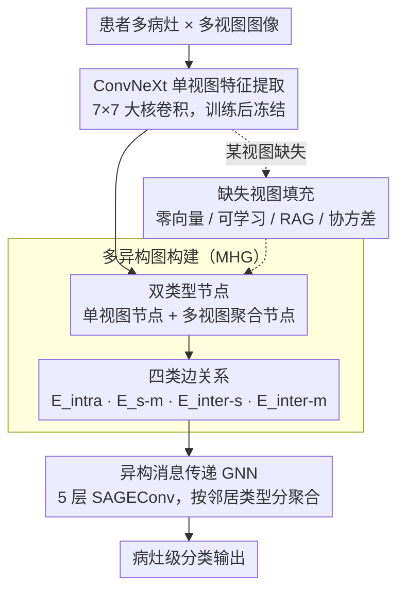

# GIIM: Graph-based Learning of Inter- and Intra-view Dependencies for Multi-view Medical Image Diagnosis

**会议**: CVPR 2026  
**arXiv**: [2603.09446](https://arxiv.org/abs/2603.09446)  
**代码**: 无  
**领域**: 医学图像分析 / 图神经网络 / 计算机辅助诊断  
**关键词**: 多异构图, 多视图诊断, 视图内/视图间依赖, 缺失视图处理, CADx

## 一句话总结

提出 GIIM 框架，基于多异构图（MHG）通过四类边关系同时建模同一病灶跨期相动态变化和不同病灶间空间关联，并设计四种缺失视图填充策略，在肝脏 CT、乳腺 X 光和乳腺 MRI 三种模态上均显著优于现有方法。

## 研究背景与动机

**领域现状**：临床诊断需要综合多个视图中异常之间的复杂依赖关系——同一病灶在多期增强 CT 中的动态变化、不同病灶间的空间共现关系等。CNN/Transformer/GNN 等方法已在单视图或简单多视图融合上取得进展。

**现有痛点**：

1. 现有 CADx 方法通常独立处理各视图或简单拼接特征，忽略了视图内（intra-view）多病灶间关系和视图间（inter-view）时序/空间动态
2. 注意力方法需固定大小输入，无法灵活处理变数量病灶
3. 临床中常因协议限制、技术故障或患者原因出现视图缺失，现有方法缺乏鲁棒应对

**核心矛盾**：需要同时建模四类依赖关系（同病灶跨视图、单视图不同病灶、多视图不同病灶、单-多视图聚合），且在视图缺失时保持鲁棒。

**本文目标** 将多视图医学诊断重构为关系建模问题，用异构图全面捕获四类依赖，同时处理缺失数据。

**切入角度**：GNN 天然适合变数量节点和异构关系建模，用不同类型节点和边编码不同层次的临床关系。

**核心 idea**：将每个患者的多病灶多视图数据构建为多异构图，用类型感知的消息传递同时推理四类依赖。

## 方法详解

### 整体框架

GIIM 想把多视图医学诊断从"各看各的"变成统一的关系推理问题：同一病灶在多期增强 CT 里怎么变、不同病灶之间怎么共现，这些跨视图、跨病灶的依赖才是放射科医生真正用来判断的线索。它采用两阶段训练——先对每个视图独立训练一个 ConvNeXt 特征提取器（用 7×7 大核卷积和深度可分离卷积抓形态和强度细节），再冻结提取器，把一个患者所有病灶、所有视图的特征组装成一张多异构图（MHG），交给异构消息传递 GNN 做关系推理和分类。构图时用双类型节点承载"单期"和"跨期聚合"信息、用四类边关系编码临床依赖；若某视图缺失，先用填充策略补出该视图特征再入图。逐患者构图，因此天然支持任意数量的病灶和视图。

### 关键设计

**1. 双类型节点表示：用两层节点分别承载"单期"和"跨期聚合"信息**

要建模"同一病灶跨期相的动态"，光有单期特征不够，还需要一个能汇总各期的载体。GIIM 为此设两类节点：单视图节点 $N_{single}^v = f_v(l_v)$ 表示某视图下某病灶的特征，多视图节点 $M_{multi} = \|_{v=1}^V N_{single}^v$ 把同一病灶所有视图的特征拼起来作为聚合节点。在乳腺 X 光这种 CC/MLO 视图间病灶对应关系不确定的场景下，单视图节点改为该视图所有病灶特征的均值，避免错误的逐病灶对齐。

**2. 四类边关系：把临床的四种依赖逐一编码成图的边**

现有方法要么独立处理各视图、要么简单拼接，丢掉了视图内多病灶关系和视图间时序/空间动态。GIIM 用四种类型的边把这四类依赖显式建出来：$E_{intra}$ 连同一病灶的不同视图（动脉期→静脉期→延迟期），捕获时序增强变化；$E_{s-m}$ 把单视图节点连到它的多视图聚合节点，整合各期信息；$E_{inter-s}$ 连同一视图内的不同病灶，建模空间共现（如 HCC 常与卫星灶共存）；$E_{inter-m}$ 连不同病灶的聚合节点，表达高层病灶上下文，让小病灶能借附近大病灶的上下文。消融显示四类边缺一不可，其中 $E_{intra}$ 影响最大。

**3. 异构消息传递：按邻居类型分开聚合，避免边类型信息被抹平**

如果把所有邻居一视同仁地聚合，单视图、多视图两类关系就被混成一锅。GIIM 对每个节点分别从单视图邻居和多视图邻居聚合，各用独立权重矩阵 $\mathbf{W}_{single}^k$、$\mathbf{W}_{multi}^k$，再拼上节点自身上一层状态做非线性变换：$h_n^k = \sigma(\mathbf{W}^k \cdot \text{CONCAT}(h_n^{k-1}, h_{N_{single}(n)}^k, h_{M_{multi}(n)}^k))$。整体堆 5 层 SAGEConv（512→256→128→64→类数），最后一层直接输出分类概率。

**4. 缺失视图的四种填充策略：让框架在视图缺失时仍能推理**

临床常因协议、设备或患者原因缺某个视图，模型不能一缺就崩。GIIM 给出四种填补缺失节点的策略：**Constant** 用零向量填充，简单但等于给模型一个"缺失标记"，逼它学会忽略缺失节点；**Learnable** 用可学习参数填充，并通过 Frobenius 范数归一化；**RAG-based** 在数据库里检索可用特征最相似的完整样本，借它的缺失特征；**Covariance-based** 基于视图间特征差的协方差矩阵算样本相似度，选最相似的样本填充。实验发现零向量在缺失测试下最稳，RAG/Covariance 这类生成式填充在完整数据下更优。

### 损失函数 / 训练策略

- 单视图阶段：标准分类交叉熵，ConvNeXt 独立训练后冻结
- 图模型阶段：MHG 端到端训练，逐患者构图（每个 batch 一个患者图）

## 实验关键数据

### 主实验

| 数据集 | 方法 | Accuracy (%) | AUC (%) |
|--------|------|-------------|---------|
| Liver CT | NN-based (多视图) | 75.45 | 89.09 |
| | Attention-based | 73.41 | 88.53 |
| | **GIIM** | **78.20** | **91.05** |
| VinDr-Mammo | NN-based | 67.48 | 82.21 |
| | Attention-based | 68.09 | 81.00 |
| | **GIIM** | **71.17** | **82.54** |
| BreastDM (MRI) | NN-based | 80.85 | 87.35 |
| | Attention-based | 85.10 | 76.37 |
| | **GIIM** | **87.23** | **89.02** |

多视图 vs 单视图：Liver 上提升约 12% Acc，Mammo 上提升约 7.8% Acc。

### 消融实验

**缺失视图策略对比（Liver，100% 缺失率测试）**

| 策略 | 100% miss-view | Full-view |
|------|----------------|-----------|
| NN-based | 70.00 | 75.45 |
| GIIM (Constant) | **72.27** | 78.20 |
| GIIM (Learnable) | 72.05 | 77.05 |
| GIIM (RAG) | 71.59 | **78.41** |
| GIIM (Covariance) | 72.05 | 78.18 |

**边类型消融**：四类边缺任何一种都导致性能下降，$E_{intra}$（同病灶跨期）影响最大。

### 关键发现

- 零向量在缺失测试下最稳定（作为唯一"缺失标记"让模型学会依赖其他视图），RAG/Covariance 在完整数据下更优
- 多视图一致性提升最大的是 Liver（4 期 CT，同一病灶增强模式变化显著）
- BI-RADS 分类中因 CC/MLO 视图间病灶对应不确定，采用均值聚合替代逐病灶建图

## 亮点与洞察

- 四类边的设计完整覆盖了临床放射科医师的关系推理模式，比简单拆 attention 更有可解释性
- 缺失视图策略的 trade-off 发现实用：生成式填充在完整数据下更好，零向量在缺失数据下更好
- 异构消息传递的分类聚合思路（单视图 vs 多视图邻居分别聚合）避免了边类型信息丢失
- GNN 的灵活性使得框架可处理任意数量的病灶和视图，优于需固定输入的 CNN/Transformer

## 局限与展望

- 单视图特征提取器和图模型分阶段训练，端到端联合训练可能进一步提升
- 图结构由数据硬编码（病灶数/视图数决定），未探索动态图构建或注意力加权边
- ConvNeXt 作为 backbone 相对保守，ViT 或 SAM 等更强 backbone 可能进一步提升
- 三个数据集规模相对有限（最大 920 例），大规模验证不足

## 相关工作与启发

- **vs Phase Attention (Wang et al. 2022)**：intra-phase + inter-phase attention，但处理固定大小输入且忽略病灶间关系；GIIM 用 GNN 灵活处理变数量病灶
- **vs SSL-MNGCN (Ibrahim et al. 2022)**：用 GCN 处理乳腺 X 光纹理/空间特征图，但未建模跨视图时序关系
- **vs mmFormer (Zhang et al. 2022)**：多模态 Transformer 处理不完整脑肿瘤分割，但针对体素级任务而非病灶级分类
- 启发：异构图的关系建模范式可推广到其他需要多视图/多模态联合推理的场景

## 评分

- 新颖性: ⭐⭐⭐⭐ 四类异构边 + 缺失视图策略组合设计完整
- 实验充分度: ⭐⭐⭐⭐ 三种模态、缺失视图消融、四种填充策略对比
- 写作质量: ⭐⭐⭐ 内容详实但结构略繁杂
- 价值: ⭐⭐⭐ 医学多视图诊断的通用框架，但数据集规模限制了说服力

<!-- RELATED:START -->

## 相关论文

- [\[CVPR 2026\] RelativeFlow: Taming Medical Image Denoising Learning with Noisy Reference](relativeflow_taming_medical_image_denoising_learning_with_noisy_reference.md)
- [\[CVPR 2026\] MedGRPO: Multi-Task Reinforcement Learning for Heterogeneous Medical Video Understanding](medgrpo_multi-task_reinforcement_learning_for_heterogeneous_medical_video_unders.md)
- [\[CVPR 2026\] Continual Learning for fMRI-Based Brain Disorder Diagnosis via Functional Connectivity Matrices Generative Replay](forge_continual_learning_for_fmri_based_brain_disorder_diagnosis.md)
- [\[CVPR 2026\] Semantic Class Distribution Learning for Debiasing Semi-Supervised Medical Image Segmentation](semantic_class_distribution_learning_for_debiasing.md)
- [\[CVPR 2026\] Learning Generalizable 3D Medical Image Representations from Mask-Guided Self-Supervision](learning_generalizable_3d_medical_image_representations_from_mask-guided_self-su.md)

<!-- RELATED:END -->
