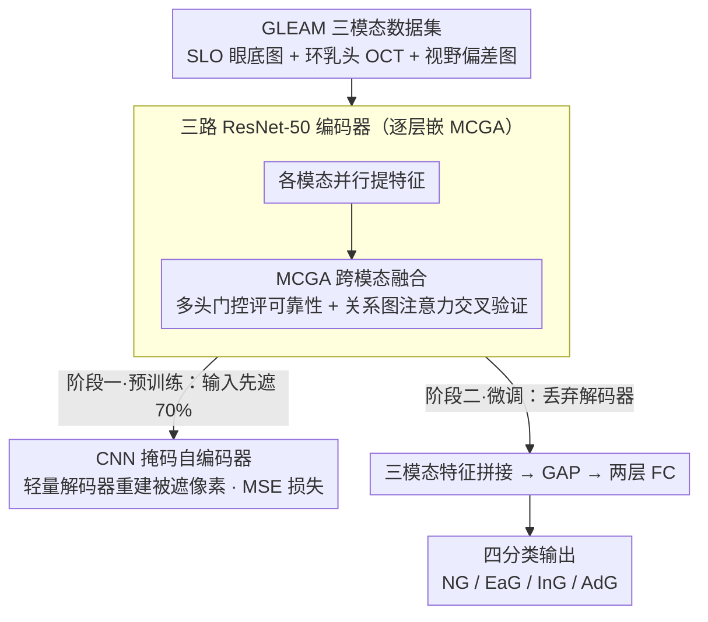

# GLEAM: A Multimodal Imaging Dataset and HAMM for Glaucoma Classification

**会议**: CVPR 2026  
**arXiv**: [2603.12800](https://arxiv.org/abs/2603.12800)  
**代码**: [Kaggle Dataset](https://kaggle.com/datasets/zhangyiyinge/gleam-dataset)  
**领域**: 医学图像 / 多模态学习 / 眼科影像  
**关键词**: 青光眼分类, 多模态融合, 掩码自编码器, 三模态数据集, 图注意力

## 一句话总结

提出首个公开三模态青光眼数据集 GLEAM（SLO 眼底图 + 环乳头 OCT + 视野偏差图，1200例，四阶段标注），以及基于 CNN 的层级注意力掩码建模框架 HAMM，通过临床启发式的多头模态门控和关系图注意力实现跨模态融合，四分类准确率达 81.08%。

## 研究背景与动机

**领域现状**: 青光眼是全球主要不可逆致盲疾病，影响约7000万人。临床诊断依赖多种检查手段的综合判断：眼底图观察视盘形态、OCT 测量视网膜神经纤维层（RNFL）厚度、视野检查评估功能性损伤。计算机辅助诊断（CAD）系统在过去十年取得了稳步进展。

**现有痛点**: 现有公开数据集存在三方面不足——(1) 大多为单模态（眼底图或 OCT），模态多样性不足；(2) 分类粒度粗糙，仅做正常/青光眼二分类，无法支持分期治疗；(3) 样本量有限或不公开。现有多模态数据集如 GAMMA 仅含 200 例双模态数据。在方法层面，简单的后期融合或拼接难以利用形态差异巨大的多种模态（2D 彩色图 / 灰度截面图 / 统计偏差图）之间的互补信息。

**核心矛盾**: 临床医生常规整合三种检查结果做交叉验证和综合判断，但缺乏相匹配的数据集和融合框架来支撑自动化诊断研究。

**本文目标**: (1) 构建首个公开的三模态、四阶段标注的高质量青光眼数据集；(2) 设计有效的自监督多模态融合框架来充分利用模态间互补信息。

**切入角度**: 模拟眼科医生的临床推理——先对各模态的质量和可靠性打分，再交叉验证结构-功能一致性。

**核心 idea**: 用多头门控机制模拟医生对模态可靠性的评估，用关系图注意力模拟跨模态交叉验证，嵌入 CNN 掩码自编码器实现自监督预训练。

## 方法详解

### 整体框架

HAMM 想解决的问题很具体：三种形态差异极大的眼科影像（2D 彩色眼底图、灰度 OCT 截面、统计性的视野偏差图）该怎么融合，而且数据只有 1200 例，监督信号稀缺。它的回答是「自监督预训练 + 临床启发式层级融合」，整条 pipeline 跑在新建的 GLEAM 三模态数据集上、分两阶段走。预训练阶段把三种模态各自随机遮掉 70% 的像素，送进三个并行的 ResNet-50 编码器；编码器的每个下采样层都嵌了一个 MCGA 模块，让三路特征在每一层就互相交换信息，而不是各编各的到最后才拼。一个轻量的深度可分离卷积解码器再从可见像素和跨模态线索里把被遮区域重建出来，用 MSE 监督。微调阶段则丢掉解码器，保留这套已经学会跨模态推断的编码器，把三模态特征拼接后过 GAP 加两层全连接，输出正常/早期/中期/晚期四分类。

### 关键设计

**1. GLEAM 三模态数据集：补上"三模态 + 四分期"这块一直缺的拼图**

整条 pipeline 的起点是数据，而现有公开数据集的尴尬恰恰在这里：要么只有单/双模态，要么只做正常/青光眼二分类，撑不起分期治疗所需的细粒度研究（参照如 GAMMA 仅 200 例双模态）。GLEAM 从沈阳市第四人民医院回顾性收集 1200 例配对数据（841 名患者，年龄 8–90 岁，均值 55.4±16.7），每例都同时包含 SLO 眼底图（Optos 超广角）、环乳头 OCT（Heidelberg Spectralis）和视野 PD 图（Zeiss 视野计）三种模态。分期按临床标准切成四档——正常 NG（600 例）、早期 EaG（200 例）、中期 InG（200 例）、晚期 AdG（200 例），依据 EMR 诊断结合 MD 值分层（早期 MD > -6 dB，中期 -12 dB ≤ MD ≤ -6 dB，晚期 MD < -12 dB）。标注由三位资深眼科医生独立完成再共识审核，标注者间 Cohen's Kappa > 95.5%、标注者内 > 97.4%，质量足以当可靠基准。

**2. 多模态通道图注意力模块（MCGA）：把"医生先判断检查可不可靠、再交叉验证"写进每一层融合**

有了三模态数据，下一步是怎么融——简单的后期拼接处理不了这三种模态：它们的成像物理、噪声特性、可靠性都不一样，直接 concat 等于默认每个模态同等可信。MCGA 的做法是在编码器每个下采样层插入一次三步融合。第一步把各模态的特征图同时做 GAP、GMP、GeM 三种池化再拼接，经全连接压成一个模态嵌入 $v_k$，相当于给每路模态取一个浓缩的"体检报告"。第二步是多头门控 $\hat{v}_k = v_k \odot \frac{1}{H}\sum_{h=1}^{H} g^{(h)}(v_k)$，$H$ 个独立的门各自给出一组可靠性权重再取平均，模拟多位眼科专家分别评估某张图质量好不好、能不能采信。第三步用关系图注意力把各模态当图节点，靠关系类型嵌入 $R_{r_{ij}}^{(h)}$ 区分不同模态对之间的依赖（如结构性的 OCT 与功能性的 VF 之间），建模结构-功能一致性，等价于医生拿不同检查互相印证。之所以放在每一层而不是只在末端做一次，是因为浅层纹理和深层语义都需要跨模态校准——消融显示只加 MCGA（不预训练）就把 Acc 从 77.67% 拉到 79.17%。

**3. CNN 掩码自编码器预训练：用重建遮挡区域逼模型学会跨模态互补**

数据只有 1200 例，从零监督训练很容易过拟合，而眼科影像本身又常因鬼影、模糊、解剖结构遮挡而局部信息缺失。这两点正好可以用掩码建模一并吃掉：对每种模态随机遮掉 70% 像素，编码器被迫从同模态的可见部分和其他模态的信息里推断被遮内容，重建越准说明跨模态表示越鲁棒。解码器走轻量路线（深度可分离卷积 + 双线性上采样），并通过跳跃连接复用编码器各层特征，只为重建服务、不增加多少负担。损失只在被遮像素上算 MSE：

$$\mathcal{L}_{MSE} = \frac{1}{N}\sum_{i=1}^{N}\sum_{k \in K}\sum_{p=1}^{P}(s_i^k(p) - \hat{s}_i^k(p))^2$$

这里特意选 CNN 而非 Transformer 版 MAE：CNN 自带视觉归纳偏置，在小样本上更不容易过拟合——同台对比里 Transformer-based 的 MultiMAE 在 GLEAM 上只有 78.00%。0.7 这个偏高的掩码率也是有意的，遮得越多模型越没法靠单模态自补，只能更多依赖跨模态推断。

### 损失函数 / 训练策略

- **预训练**: MSE 重建损失（仅在被掩码像素上计算），20 epochs，学习率 $1 \times 10^{-5}$，batch size 8
- **微调**: 交叉熵分类损失，学习率 $3 \times 10^{-6}$，batch size 16，early stopping（验证损失 10 epoch 无改善）
- **数据增强**: SLO（随机裁剪/色彩抖动/垂直翻转）、OCT（色彩抖动）、VF（垂直翻转），三模态同步水平翻转保持解剖一致性
- 五次独立训练取均值，保证统计可靠性

## 实验关键数据

### 主实验

| 方法 | 预训练策略 | Acc (%) | F1 (%) | AUROC (%) | Kappa |
|------|-----------|---------|--------|-----------|-------|
| ResNet50 | - | 76.75±1.47 | 66.84±2.60 | 89.95±0.27 | 85.88 |
| ResNet50 | TL | 77.67±0.86 | 70.19±0.93 | 92.14±1.81 | 87.00 |
| ViT-S | TL | 77.75±1.52 | 69.62±3.79 | 91.79±0.48 | 88.03 |
| ConvNeXt-T | TL | 79.00±0.76 | 71.58±1.32 | 91.87±0.77 | 87.83 |
| MHCA | TL | 78.16±0.63 | 69.97±3.20 | 92.28±0.27 | 87.14 |
| DRIFA-Net | TL | 77.83±0.86 | 69.70±1.96 | 92.42±0.10 | 86.75 |
| Corolla | SCL | 78.67±0.74 | 72.87±1.21 | 92.39±0.55 | 88.50 |
| ETSCL | SCL | 79.08±0.80 | 72.52±2.11 | 92.73±0.32 | 87.31 |
| MultiMAE | SSL | 78.00±0.18 | 69.02±2.18 | 90.64±0.26 | 86.98 |
| UrFound | SSL | 78.67±0.35 | 70.67±1.46 | 92.49±0.44 | 87.86 |
| **HAMM (ours)** | **SSL** | **81.08±0.63** | **75.90±0.80** | **93.03±0.26** | **90.07** |

HAMM 较最强基线 ETSCL 提升: Acc +2.00%, F1 +3.38%, AUROC +0.30%, Kappa +2.76。

### 消融实验

| MCGA | 预训练 | Acc (%) | F1 (%) | AUROC (%) | Kappa |
|------|--------|---------|--------|-----------|-------|
| ✗ | ✗ | 77.67 | 70.19 | 92.14 | 87.00 |
| ✓ | ✗ | 79.17 | 71.93 | 92.89 | 89.52 |
| ✗ | ✓ | 79.67 | 73.68 | 92.83 | 89.57 |
| ✓ | ✓ | **81.08** | **75.90** | **93.03** | **90.07** |

模态组合消融：

| 模态 | Acc (%) | F1 (%) | AUROC (%) | Acc-EaG (%) |
|------|---------|--------|-----------|-------------|
| SLO | 60.25 | 37.25 | 74.72 | 3.00 |
| OCT | 61.75 | 42.39 | 76.70 | 8.00 |
| VF | 74.25 | 59.85 | 90.42 | 6.00 |
| SLO+OCT | 64.42 | 46.47 | 67.22 | 11.00 |
| SLO+VF | 77.67 | 68.36 | 91.87 | 26.00 |
| OCT+VF | 77.08 | 67.38 | 92.24 | 22.50 |
| **SLO+OCT+VF** | **81.08** | **75.90** | **93.03** | **51.50** |

外部验证（GAMMA 数据集）：

| 方法 | Ensemble | Kappa |
|------|----------|-------|
| SmartDSP | ✓ | 85.49 |
| COROLLA | ✓ | 85.50 |
| GeCoM-Net | ✓ | 88.10 |
| ETSCL (+ 额外模态) | ✗ | 88.44 |
| **HAMM (ours)** | ✗ | **87.59** |
| **HAMM (ours)** | ✓ | **89.35** |

### 关键发现

- 早期青光眼（EaG）分类是最大难点：单模态几乎无法检出（VF 仅 6.0%），三模态融合提升至 51.50%，证明多模态互补性对早诊至关重要
- VF 是最具区分力的单模态（Acc 74.25%），但对早期拿不住；SLO 和 OCT 单独表现差，加入后对早期和中期分类有显著提升
- 掩码比例 0.7 为最优配置（20 epochs 预训练）；最优掩码率下模型被迫更多地依赖跨模态信息推断
- 模态缺失场景下 HAMM 也优于对比方法（Acc 74.59% vs UrFound 72.48%），展现鲁棒性

## 亮点与洞察

- 数据集贡献本身具有重大意义：首个公开的三模态 + 四阶段标注青光眼数据集，标注质量极高（Kappa > 95.5%）
- MCGA 模块的临床启发设计非常巧妙——多头门控模拟多位医生对模态可靠性的独立评估，图注意力模拟跨模态交叉验证
- CNN-based MAE 首次应用于多模态医学任务，相比 Transformer-based MAE 更适合小样本场景
- 三模态融合完全消除了 NG 和 AdG 之间的交叉误分类（混淆矩阵验证），对临床安全性有重要意义

## 局限与展望

- 数据来自单一中心（沈阳市第四人民医院），泛化性需多中心验证
- 未区分青光眼亚型（原发性开角型、正常眼压型、闭角型等），不同亚型的病理特征和空间损伤模式不同
- 当前为四分类，连续严重度评估（如预测 MD 值）可能更精细实用，可考虑引入序数回归损失
- 早期准确率 51.50% 虽优于基线但仍有提升空间，可能需更大规模数据或专门的类别不平衡处理策略
- 未涉及纵向随访数据分析（疾病进展预测）

## 相关工作与启发

- **vs RETFound / EyeCLIP**: 单模态（眼底图）自监督预训练，未覆盖 OCT 和视野数据；HAMM 显式建模三模态交互
- **vs MultiMAE**: Transformer-based 多模态掩码建模，在小样本医学数据上容易过拟合（GLEAM 上 Acc 78.00%）；HAMM 使用 CNN 架构 + MCGA，更适合受限数据量
- **vs MHCA / DRIFA-Net**: 前者参数量 248M / 931M，HAMM 237M 但 FLOPs 仅 12.68G（DRIFA-Net 88.48G），效率更高且性能更好
- **vs GAMMA 数据集**: GAMMA 仅 200 例双模态，二/三分类；GLEAM 1200 例三模态，四分类，规模和粒度均显著提升

## 评分

- 新颖性: ⭐⭐⭐⭐ 首个三模态青光眼数据集 + 临床启发式的 MCGA 模块设计
- 实验充分度: ⭐⭐⭐⭐ 主实验、模态消融、组件消融、掩码比例分析、外部验证、缺失模态鲁棒性、可靠性分析一应俱全
- 写作质量: ⭐⭐⭐⭐ 方法描述清晰，实验设计系统完整，临床动机阐述充分
- 价值: ⭐⭐⭐⭐ 数据集填补领域空白，对眼科 AI 有直接推动作用

<!-- RELATED:START -->

## 相关论文

- [\[CVPR 2026\] EI: Early Intervention for Multimodal Imaging based Disease Recognition](ei_early_intervention_for_multimodal_imaging_based_disease_recognition.md)
- [\[CVPR 2026\] Multimodal Classification of Radiation-Induced Contrast Enhancements and Tumor Recurrence Using Deep Learning](multimodal_classification_of_radiation-induced_contrast_enhancements_and_tumor_r.md)
- [\[CVPR 2026\] Transformer-Based Multi-Region Segmentation and Radiomic Analysis of HR-pQCT Imaging for Osteoporosis Classification](transformer-based_multi-region_segmentation_and_radiomic_analysis_of_hr-pqct_ima.md)
- [\[AAAI 2026\] EgoEMS: A High-Fidelity Multimodal Egocentric Dataset for Cognitive Assistance in Emergency Medical Services](../../AAAI2026/medical_imaging/egoems_a_high-fidelity_multimodal_egocentric_dataset_for_cognitive_assistance_in.md)
- [\[ICLR 2026\] Inference-Time Dynamic Modality Selection for Incomplete Multimodal Classification](../../ICLR2026/medical_imaging/inference-time_dynamic_modality_selection_for_incomplete_multimodal_classificati.md)

<!-- RELATED:END -->
