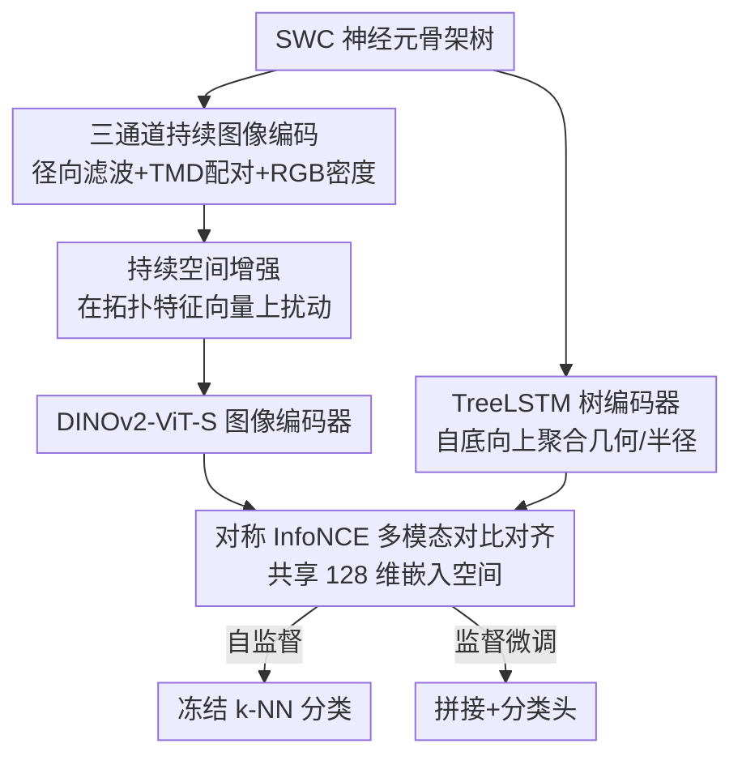

# GraPHFormer: A Multimodal Graph Persistent Homology Transformer for the Analysis of Neuroscience Morphologies

**会议**: CVPR 2026  
**论文**: [CVF Open Access](https://openaccess.thecvf.com/content/CVPR2026/html/Shah_GraPHFormer_A_Multimodal_Graph_Persistent_Homology_Transformer_for_the_Analysis_CVPR_2026_paper.html)  
**代码**: https://github.com/Uzshah/GraPHFormer  
**领域**: 医学图像  
**关键词**: 神经元形态学, 持续同调, 拓扑数据分析, 多模态对比学习, CLIP

## 一句话总结
把神经元骨架树的「图结构」和「拓扑持续同调」两套互补视图，用 CLIP 式对称 InfoNCE 对齐到同一嵌入空间——图编码器（TreeLSTM）抓局部几何、视觉编码器（DINOv2 处理三通道持续图像）抓全局分支拓扑——在 6 个神经元形态学基准中的 5 个上刷到 SOTA，自监督设定最高比上一代高 4.9 个点。

## 研究背景与动机
**领域现状**：神经元/胶质细胞的形态（分支模式、路径长度、半径锥度、空间排布）编码了电路功能、发育和病理的关键信息。NeuroMorpho.Org 这类公开库已经攒了几万个数字重建骨架，催生了两条主流的数据驱动表征路线：一条是图学习（GCN → 图 Transformer），直接在骨架图上做消息传递；另一条是拓扑数据分析（TDA），用持续同调把分支的「生—死」过程压成持续图（persistence diagram），其中专门为神经元设计的 TMD（Topological Morphology Descriptor）能把分支组织向量化成图像再分类。

**现有痛点**：这两条路线**各自为政**。图方法擅长编码局部分支模式和几何细节，却丢掉了全局的、平移/旋转无关的形状不变量；拓扑方法（TMD）抓住了全局空间排布和稳定的形状摘要，却抹掉了细粒度的结构信息（比如具体哪个节点连哪个、局部半径怎么变）。没人把两者放在一起。

**核心矛盾**：拓扑视图（全局、平移旋转无关）和图视图（局部、几何敏感）描述的是同一个神经元的**互补侧面**，但单模态方法只能拿到一半信息。论文后面的互补性分析把这点量化了：两模态嵌入的 Pearson 相关只有 0.04~0.08（接近正交），说明它们编码的信息几乎不重叠。

**本文目标**：构造一个多模态架构，同时吃下「原始骨架树 + 多通道持续图像」，让两个视图互相监督、对齐到共享空间，从而拿到全局拓扑 + 局部几何的完整表征；并且要能在标注稀缺的现实场景（形态学标注昂贵）下做自监督。

**切入角度**：作者注意到 CLIP 的图文对齐范式天然适配「同一对象的两种模态」——把「文本/图像」换成「树图/持续图像」，用对称 InfoNCE 拉近同一神经元的两个视图、推开不同神经元的视图，就能在无标签下学到统一表征。这是（据作者称）CLIP 范式首次用于神经元表征学习。

**核心 idea**：用「树图编码器 ⊗ 持续图像编码器」的双塔，借 CLIP 对比学习把图结构和持续同调拓扑对齐进同一嵌入空间，让两个互补视图互为监督信号。

## 方法详解

### 整体框架
GraPHFormer 是一个双塔（dual-encoder）对比学习框架。输入是一个 SWC 格式的神经元重建（每个节点带 id、类型、xyz 坐标、半径、父节点）；它被同时转成两种表示：(1) 一棵有向树图，喂给 **TreeLSTM** 编码器抓层级分支结构；(2) 一张三通道 RGB **持续图像**，喂给 **DINOv2-ViT-S** 视觉编码器抓拓扑密度。两塔各接一个 MLP 投影头映到共享的 128 维空间，用**对称 InfoNCE** 拉近同一神经元的图—像对、推开不同神经元的对。训练完之后：自监督下游用冻结 k-NN 评估（拼接/相加两塔嵌入）；监督下游则去掉投影头、把两塔输出拼接后接分类头，先线性探针再端到端微调。

整个流程的关键不在「双塔 + CLIP」这个外壳（那是 borrowed），而在于**怎么把一棵神经元树变成一张语义正确、且能被 ViT 利用的持续图像**，以及**怎么在拓扑特征空间里做不破坏语义的数据增强**——这两件事是本文真正动手做的地方。

### 关键设计

**1. 三通道 RGB 持续图像：把拓扑、分支长度、半径三种密度叠进一张图**

单通道 TMD 持续图像只记录「分支在哪出现、在哪消失」的拓扑密度，丢了几何信息。本文把一张持续图像扩成三个通道，让 ViT 一次看到三种互补的形态学侧面。具体流程：先用**径向距离滤波**给每个节点一个标量序——节点 $v_i$ 到胞体的欧氏距离 $d_{raw}(v_i)=\sqrt{(x_i-x_s)^2+(y_i-y_s)^2+(z_i-z_s)^2}$，再做一次广度优先的累积最大约束 $f(v_i)=\max\{f(\text{parent}(v_i)),\,d_{raw}(v_i)\}$，保证滤波函数沿「胞体→末梢」单调不减（持续同调要求祖先的滤波值不大于后代）。然后用 TMD 的 elder-rule 算法做后序遍历，为每个分支抽出一对「生—死」值 $(b_i, d_i)$：$b_i$ 是分支尖端出现的距离、$d_i$ 是它并入更大分支的距离。

接着对每个持续对沿「叶→分叉」路径 $\pi_i$ 富集两个几何量：持续寿命 $\delta_i=b_i-d_i$ 和路径平均半径 $\bar{r}_i=\frac{1}{|\pi_i|}\sum_{v\in\pi_i}r(v)$，把每个分支表示成特征向量 $\rho_i=(b_i,d_i,\delta_i,\bar{r}_i)$。最后在 $(b,\delta)$ 平面上用高斯核做加权密度估计生成三通道（默认 $112\times112$，$\sigma=16$ 像素）：

$$I^{(c)}(x,y)=\sum_{i=1}^{m} w_i^{(c)}\cdot\frac{1}{2\pi\sigma^2}\exp\!\left(-\frac{(x-b_i)^2+(y-\delta_i)^2}{2\sigma^2}\right)$$

三个通道只在权重上不同：$w_i^{(R)}=1$（无权密度，保空间结构）、$w_i^{(G)}=\delta_i$（持续寿命加权，强调拓扑显著的长分支）、$w_i^{(B)}=\bar{r}_i$（半径加权，编码粗细/径向特征）。消融显示三通道全开比最强单通道多 2.6 个点，证明三种密度确实互补而非冗余。

**2. 持续空间数据增强：在拓扑特征向量上扰动，而不是在图像像素上**

标准图像增强（旋转、缩放、颜色抖动）对持续图像是**有害**的——持续图像的像素位置和坐标轴本身承载语义（横轴是 birth、纵轴是 persistence），随便旋转就把「生—持续」轴的含义打乱、破坏拓扑信息；光度抖动则破坏精心标定的密度权重。作者的做法是把增强**前移到特征向量 $\rho_i$ 上、在生成图像之前做**，从而天然保持拓扑语义。

三种操作随机施加：(a) 生—死抖动，给 $b_i,d_i$ 加高斯噪声 $b_i'=b_i+\mathcal{N}(0,\sigma_b^2)$，其中 $\sigma_b,\sigma_d\in[0.01,0.05]\times(b_{max}-b_{min})$；(b) 持续缩放 $\delta_i'=\delta_i\cdot\alpha,\ \alpha\sim U(0.9,1.1)$，模拟分支延展的变化；(c) 半径扰动 $\bar{r}_i'=\bar{r}_i\cdot\beta,\ \beta\sim U(0.85,1.15)$，模拟重建的不确定性。扰动后再渲染成图像。消融里这一步在 ACT-4 上把准确率从 40.97% 抬到 49.31%（+8.34 点），是单项收益最大的设计之一，说明「增强必须尊重拓扑语义」这个观察是对的。

**3. 双塔编码器：TreeLSTM 抓层级几何，DINOv2 抓拓扑密度**

两个模态用各自合适的编码器。树侧：每个节点特征 $x_v\in\mathbb{R}^5$（xyz 坐标、半径、到胞体路径长，z-score 归一化），用 **TreeLSTM** 做层级聚合 $h_v=\text{TreeLSTM}(x_v,\{h_c\}_{c\in C(v)})$，子节点状态求和池化，自底向上从叶到根遍历，拿根嵌入 $h_{root}$ 当整树表示。图像侧：用 **DINOv2-ViT-S/14**（14×14 patch、12 个 Transformer block、6 头、隐维 384），并**微调整个 backbone**把自然图像的预训练表征迁到拓扑域。两塔各接一个 2 层 MLP 投影头（SimCLR 式）：$g_{tree}:\mathbb{R}^{256}\to\mathbb{R}^{256}\to\mathbb{R}^{128}$、$g_{image}:\mathbb{R}^{384}\to\mathbb{R}^{256}\to\mathbb{R}^{128}$，嵌入 $\ell_2$ 归一化后算相似度。这一设计让「图编码局部、ViT 编码全局」各司其职，是后面互补性成立的物理基础。

**4. 对称 InfoNCE 多模态对齐：让两个视图互为监督，免负样本挖掘**

没标签时怎么学？借 CLIP 的对称 InfoNCE 让两模态互相监督。一个 batch 内 $N$ 个神经元，算 $\ell_2$ 归一化嵌入 $z_i^t=g_{tree}(\phi_{tree}(T_i))$、$z_i^v=g_{image}(\phi_{image}(I_i))$，成对相似度 $s_{ij}=\langle z_i^t,z_j^v\rangle/\tau$（$\tau$ 是可学温度）。损失为双向对称形式：

$$L=-\frac{1}{2N}\sum_{i=1}^{N}\left[\log\frac{\exp(s_{ii})}{\sum_{j=1}^{N}\exp(s_{ij})}+\log\frac{\exp(s_{ii})}{\sum_{j=1}^{N}\exp(s_{ji})}\right]$$

它强制同一神经元的树—像对（正样本）高相似、与其他神经元的对（负样本）低相似，且图→像、像→图两个方向都约束。相比需要显式负样本挖掘（$O(N^2)$）或动量记忆队列（$O(K)$ 额外开销）的对比方法，batch 内负样本随 batch size 线性 $O(N)$ 增长，不需要额外内存结构或采样启发式。下游监督时去掉投影头、拼接两塔输出接分类头，分两阶段微调：先线性探针、再端到端。

### 损失函数 / 训练策略
PyTorch 实现，单卡 RTX 4090。每个 Transformer 层后 dropout（p=0.1）；优化器 AdamW（$\beta_1{=}0.9,\beta_2{=}0.999,\lambda{=}0.05$），学习率 $5\times10^{-4}$，20 epoch warmup + 余弦退火共 300 epoch，batch size 128。下游用 TreeMoCo 协议的冻结 k-NN（k=20，JML 用 k=5），5 个随机种子取最佳平均。数据按 TreeMoCo 的 70%–30% 划分，与 GraphDINO、SGTMorph 对齐保证公平。

## 实验关键数据

### 主实验
6 个神经元形态学基准（BIL-6、ACT-4、JML-4、N7、M1-Cell、M1-REG），分监督（SL）/自监督（SS）两种设定，分类准确率（%）。

| 设定 | 数据集 | GraPHFormer | 之前最佳 | 提升 |
|------|--------|-------------|----------|------|
| SS | BIL-6 | **86.2 ± 1** | SGTMorph 81.3 | +4.9 |
| SS | JML-4 | **72.7 ± 3** | SGTMorph 66.6 | +6.1 |
| SS | N7 | **83.8 ± 0.6** | SGTMorph 79.8 | +4.0 |
| SS | ACT-4 | 59.1 ± 4 | MorphRep 66.0 | −6.9（落后）|
| SL | BIL-6 | **93.51** | SGTMorph 88.9 | +4.6 |
| SL | JML-4 | **76.5** | SGTMorph 72.4 | +4.1 |
| SL | N7 | **92.3** | SGTMorph 89.0 | +3.3 |
| SL | ACT-4 | 65.5 | SGTMorph 79.3 | −13.8（落后）|

总体在 5/6 基准上 SOTA。监督设定下还放了一个 **PI（DINOv2-ViT-S，仅持续图像）** 的单模态基线：BIL-6 只有 80.5%、JML-4 只有 69.1%，比完整 GraPHFormer 分别低 13.0 和 7.4 点，直接证明「仅拓扑图像不够，必须融合图结构」。

### 消融实验
多通道编码（Table 4，三数据集平均 AVG）+ 持续空间增强（Table 5，ACT-4）：

| 配置 | 关键指标 | 说明 |
|------|---------|------|
| RGB 三通道（full）| 63.3 AVG | 完整多通道编码 |
| 最强单通道 R | 60.7 AVG | 无权密度，比 full 低 2.6 |
| 最强双通道 RB | 61.7 AVG | 仍低于三通道 |
| B（半径）单通道 | 58.4 AVG | 单通道最弱 |
| 三种增强全开 | 49.31（ACT-4）| 完整持续空间增强 |
| 无增强 baseline | 40.97（ACT-4）| 掉 8.34 点 |
| 仅 Radius Perturbation | 46.53（ACT-4）| 单项增强最强 |

### 关键发现
- **两模态近乎正交、融合靠互补**：互补性分析（Table 3）显示树/像嵌入的 Pearson 相关仅 0.040（N7）/0.083（JML-4）、RSA 0.06~0.08，几乎不重叠；融合带来 +1.7%（N7，81.8→83.5）/+1.8%（JML-4，64.6→66.4）。JML-4 互补度更高（互补分 52.2% vs 38.0%、救援率 21.1% vs 17.3%）。
- **持续空间增强是单项收益最大的设计**：在 ACT-4 上 +8.34 点，远超三通道编码的 +2.6 点，印证「不能用普通图像增强、必须在拓扑特征空间扰动」这个核心观察。
- **跨域迁移成立**：在神经元上训、在 11,925 个胶质细胞样本上测，物种分类 78.87%；反向（胶质训→神经元测）在 N7 拿 82.78%、BIL-4 拿 81.82%，接近域内水平，说明模型抓到了跨细胞类型共享的形态学签名。
- **ACT-4 是系统性短板**：监督下仅 65.5%、落后 SGTMorph 13.8 点。作者诚实归因：皮层分层分类依赖**绝对空间坐标/层位**，而本文的 TMD 和图编码器是**平移不变**的、刻意抽掉了坐标信息——这是设计取舍带来的固有盲区，全监督也补不回来。

## 亮点与洞察
- **「增强要在拓扑特征空间做」是真正可迁移的洞察**：持续图像的像素位置=拓扑语义，所以旋转/缩放/抖动是破坏性的；把增强前移到 $(b,d,\delta,\bar r)$ 向量上再渲染，既保语义又有效（+8.34 点）。任何「图像化的结构表征」（不止神经元）都该警惕：图像增强默认假设是平移/旋转等变，但语义化坐标轴的图像不满足这个假设。
- **三通道把几何塞进拓扑图像**：用 R/G/B 分别承载无权密度、持续加权、半径加权，等于在不改 ViT 架构的前提下，把「分支长度」「粗细」这些纯几何量喂给了一个本来只懂拓扑密度的表示。这种「用通道维度复用现成 backbone 编码多种物理量」的思路很省事。
- **CLIP 用于「同对象双模态」而非「图文」**：这里两个模态都来自同一个骨架（一个看图、一个看树），对比学习退化成「同源双视图自蒸馏」，天然不需要配对标注——给「同一对象有多种异构表示」的领域提供了无标签预训练范式。

## 局限与展望
- **作者承认**：融合策略太简单（拼接），且 k-NN 在高维拼接空间受维度灾难影响、距离不再判别；均匀融合不能按样本可靠性自适应加权——树模态强（65~82%）而图模态弱（50~55%），简单融合反而会被弱模态拖累，导致正确预测被覆盖。计划上交叉模态注意力融合 + 自适应模态加权。
- **坐标无关是双刃剑**：平移不变性带来跨域泛化，但也直接导致 ACT-4（依赖绝对皮层深度/层位）失守。想兼顾就得引入坐标感知编码，但那会牺牲一部分不变性——这个 trade-off 论文没解决。
- ⚠️ 自己发现的局限：融合增益其实只有 +1.7~1.8%（主结果的大幅领先更多来自单模态表征本身强 + 三通道 + 增强，而非「融合」这一步），所以「多模态融合」的卖点和实际融合收益之间有落差，值得读者注意（以原文 Table 3 为准）。
- **展望**：加入 3D 体素和 EM 来源模态、发布开放多模态基准，推进可复现的计算连接组学。

## 相关工作与启发
- **vs TMD / 仅拓扑方法（PI 基线）**：TMD 用胞体中心滤波把分支组织编码成持续图，全局稳定但丢细粒度结构；本文把它扩成三通道并融进图视图，PI 单模态在 BIL-6 比 full 低 13 点，证明仅拓扑不够。
- **vs SGTMorph / 仅图方法**：SGTMorph 保留几何和坐标依赖特征，所以在依赖层位的 ACT-4 上反而更强（79.3 vs 65.5）；本文在其余 5 个基准全面反超，区别在于补上了平移旋转无关的全局拓扑视图。
- **vs TreeMoCo / GraphDINO / MACGNN（图对比学习）**：它们在单一图模态上做对比/自蒸馏；本文把对比目标跨到「图×拓扑图像」两个异构模态，用对称 InfoNCE 免负样本挖掘和记忆队列，是首个把 CLIP 范式落到神经元表征的工作。

## 评分
- 新颖性: ⭐⭐⭐⭐ 首次把 CLIP 双塔对比落到神经元「图 × 持续同调」双模态，三通道持续图像 + 拓扑空间增强是扎实的新组件。
- 实验充分度: ⭐⭐⭐⭐ 6 基准 × 监督/自监督 + 跨数据集/跨域迁移 + 互补性量化 + 两组消融，且诚实暴露 ACT-4 短板。
- 写作质量: ⭐⭐⭐⭐ 公式和算法交代清楚，对局限（融合增益小、坐标盲区）不回避。
- 价值: ⭐⭐⭐⭐ 给计算连接组学提供了可迁移的多模态表征工具，「拓扑空间增强」洞察可外溢到其他语义化图像表征任务。

<!-- RELATED:START -->

## 相关论文

- [\[CVPR 2026\] SPECTRE：面向体积 CT Transformer 的自监督与跨模态预训练](scaling_self-supervised_and_cross-modal_pretraining_for_volumetric_ct_transforme.md)
- [\[CVPR 2026\] OmniBrainBench: A Comprehensive Multimodal Benchmark for Brain Imaging Analysis Across Multi-stage Clinical Tasks](omnibrainbench_a_comprehensive_multimodal_benchmark_for_brain_imaging_analysis_a.md)
- [\[CVPR 2026\] Gastric-X: A Multimodal Multi-Phase Benchmark Dataset for Advancing Vision-Language Models in Gastric Cancer Analysis](gastric-x_a_multimodal_multi-phase_benchmark_dataset_for_advancing_vision-langua.md)
- [\[CVPR 2026\] Diffusion MRI Transformer with a Diffusion Space Rotary Positional Embedding (D-RoPE)](diffusion_mri_transformer_with_a_diffusion_space_rotary_positional_embedding_d-r.md)
- [\[CVPR 2025\] Transformer-Based Multi-Region Segmentation and Radiomic Analysis of HR-pQCT Imaging for Osteoporosis Classification](../../CVPR2025/medical_imaging/transformer-based_multi-region_segmentation_and_radiomic_analysis_of_hr-pqct_ima.md)

<!-- RELATED:END -->
