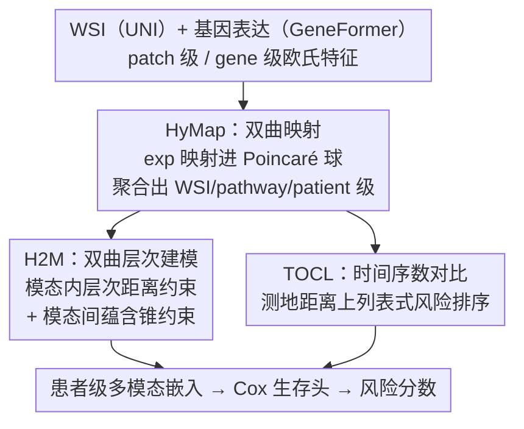

# H2-Surv: Hierarchical Hyperbolic Multimodal Representation Learning for Survival Prediction

**会议**: CVPR 2026  
**论文**: [CVF Open Access](https://openaccess.thecvf.com/content/CVPR2026/html/Yang_H2-Surv_Hierarchical_Hyperbolic_Multimodal_Representation_Learning_for_Survival_Prediction_CVPR_2026_paper.html)  
**代码**: 暂未开源（原文称接收后发布）  
**领域**: 医学图像  
**关键词**: 生存预测、双曲几何、病理-基因组多模态、层次结构、序数对比学习

## 一句话总结
H2-Surv 把病理 WSI 和基因组特征一起嵌入双曲（Poincaré 球）空间，用层次距离约束 + 跨模态蕴含锥建模"基因组比病理更抽象、且各自有 patient→WSI/pathway→patch/gene 的树状层次"，再用时间序数对比损失保住生存时间的连续序关系，在 TCGA/CPTAC 六个数据集上把平均 C-index 从 0.684 抬到 0.716。

## 研究背景与动机
**领域现状**：癌症生存预测要从单个患者估计"距离事件（死亡/复发）的时间"，主流做法是把病理全切片图像（WSI，提供组织/细胞形态）和 bulk RNA-seq 基因表达（提供分子机制）两路互补信号融合起来，做风险分层。MCAT、MOTCAT、PIBD、SurvPath 等都是这条路线上的代表。

**现有痛点**：作者指出现有多模态生存模型有三处硬伤。其一，几乎都在欧氏空间里建模，而病理（patient→WSI→patch）和基因组（patient→pathway→gene）本质都是树状层次结构——欧氏空间体积是多项式增长，塞不下指数膨胀的树，层次关系会被扭曲。其二，现有方法多把两模态当作"对齐/拉近"的对等关系，忽略了一个生物学事实：基因组是上游分子机制、更抽象，**蕴含（encompass）**了下游多种形态学表型；强行对齐等于把不对称关系拍平。其三，很多方法（MOTCAT、PIBD）把连续的生存时间离散成几个粗风险区间，同一区间内的患者被当成等价，丢掉了细粒度的序数关系，破坏了生存结果的连续性。

**核心矛盾**：层次/蕴含这种"几何结构"和欧氏空间的几何假设之间存在根本不匹配；而连续生存时间和离散区间监督之间存在另一处不匹配。两者都让模型学不到准确的风险排序。

**本文目标**：(1) 找一种能天然承载层次/蕴含的几何空间；(2) 在该空间里同时刻画模态内层次和模态间蕴含；(3) 把生存时间的连续序关系直接写进损失，而不是离散化。

**核心 idea**：换几何——把多模态特征嵌入**双曲空间**（负曲率、体积指数膨胀，天生适合嵌树），在其中用层次距离约束 + 蕴含锥表达模态内/模态间结构，再叠一个直接在双曲测地距离上做"列表式序数排序"的对比损失保住时间连续性。

## 方法详解

### 整体框架
H2-Surv 的输入是一对配好的数据：病理 WSI 和基因表达谱；输出是患者级风险分数。流程分三段串起来：先用两个预训练基础模型抽特征——病理用 UNI 抽 patch 级特征 $x_{patch}\in\mathbb{R}^{M_i\times d}$，基因组用 GeneFormer 抽 gene 级特征 $x_{gene}\in\mathbb{R}^{G\times d}$；接着 **HyMap** 把这些欧氏特征映射进共享的 Poincaré 球，并逐级聚合成 WSI 级 $x'_{wsi}$、pathway 级 $x'_{pathway}$（6 条预定义生物通路），最终拼成患者级多模态嵌入 $x'_{pat}\in\mathbb{R}^d$，送进 Cox 偏似然生存头出风险。训练时再叠两组约束：**H2M** 在双曲空间里施加模态内层次约束和模态间蕴含约束，**TOCL** 用序数对比损失把生存时间的连续序关系锚到测地距离上。

### 关键设计

**1. HyMap：把多模态特征搬进双曲空间，让层次结构不被压扁**

针对"欧氏空间装不下树状层次"这个痛点，HyMap 不再用普通线性投影，而是把两模态特征都嵌入 $n$ 维 Poincaré 球 $\mathbb{D}^n_c=\{w\in\mathbb{R}^n: c\|w\|^2<1,\ c>0\}$。曲率 $c$ 不是手调常数，而是用可训练标量经 softplus 参数化 $c=\text{softplus}(\theta)=\log(1+e^\theta)$，既保证 $c>0$（合法双曲几何），又能随模型联合优化。映射用以原点为基点的指数映射（Möbius 加法 $\oplus_c$、共形因子 $\lambda^c_w=\frac{2}{1-c\|w\|^2}$）：

$$\exp^c_w(x_{patch}^i):=w\oplus_c\left(\tanh\!\Big(\sqrt{c}\,\lambda^c_w\frac{\|x_{patch}^i\|}{2}\Big)\frac{x_{patch}^i}{\sqrt{c}\,\|x_{patch}^i\|}\right)$$

实际取 $w=0$，即把欧氏特征当作原点处的切向量映入球内，1024 维原特征经可学习投影降到 $d=256$。同样的映射作用到基因组特征，再按既有通路组织聚合出 6 条 pathway 级嵌入。这样两模态落在**同一个**双曲流形上，指数膨胀的体积给"靠边界放细粒度叶子、靠原点放抽象根"留出了空间，层次关系得以低失真保留——这是后两个模块能成立的几何前提。

**2. H2M：用两组双曲几何约束写死"模态内层次 + 模态间蕴含"**

光有双曲空间还不够，得显式逼模型把层次摆对，这就是 H2M。它包含两个互补约束。**模态内层次约束**要求：低层节点（patch / gene）更具体，应当比中层聚合（WSI / pathway）离 patient 节点更远。用双曲测地距离 $d_H$ 写成 margin 损失：

$$\mathcal{L}_{Hd}=\sum_{i=1}^N\sum_{m\in\{img,gen\}}\max\!\big(0,\ d_H(x'^{(i,m)}_{patch},x'^{(i,m)}_{pat})-d_H(x'^{(i,m)}_{wsi},x'^{(i,m)}_{pat})+\epsilon\big)$$

即强制 $d_H(\text{叶},\text{患者})>d_H(\text{中层},\text{患者})$，在球内复刻"根近边界远"的树序。**模态间蕴含约束**则编码"基因组更抽象、蕴含病理"：在每个 pathway 级嵌入上定义一个蕴含锥，半张角随其到原点的半径减小而增大 $\text{aper}(x'_{pathway})=\sin^{-1}\!\big(\frac{2K}{\sqrt{c}\,\|x'_{pathway,space}\|}\big),\ K=0.1$——越靠原点（越抽象）覆盖面越广。再用 Lorentzian 内积量出配对 WSI 嵌入相对锥轴的外角 $\text{ext}(x'_{pathway},x'_{wsi})$（式较长，⚠️ 具体形式以原文 Eq.3 为准），若 WSI 落在锥内（$\text{ext}\le\text{aper}$）不罚，否则按偏离量惩罚：

$$\mathcal{L}_{Hyent}=\sum_{(x'_{pathway},x'_{wsi})\in D}\max\!\Big(0,\ 1-\frac{\text{ext}(x'_{pathway},x'_{wsi})-\text{aper}(x'_{pathway})}{\pi}\Big)$$

这等于要求"病理被基因组通路在方向上包住"，把对称对齐换成了有向蕴含，符合上游分子→下游形态的生物层级。

**3. TOCL：把生存时间的连续序关系直接锚到双曲测地距离上**

针对"离散区间丢掉序数信息"的痛点，TOCL 不离散化时间，而是做成对/列表式的风险排序。对一个查询患者 $q$，按生存时间远近构造一组逐级靠近的正样本 $\{p_1,p_2,\dots\}$ 和一组生存时间远得多的负样本 $\{n_1,n_2,\dots\}$，用双曲测地距离施加序数约束 $d_H(q,p_1)<d_H(q,p_i)<d_H(q,n)$，把"时间序"对齐到"几何序"。再用渐进式排序对比目标实现：

$$\mathcal{L}_{ordinal}=\sum_{i=1}^r-\log\frac{\sum_{p\in P_i}\exp(-d_H(q,p)/\tau)}{\sum_{p\in\cup_{j\ge i}P_j}\exp(-d_H(q,p)/\tau)+\sum_{n\in N}\exp(-d_H(q,n)/\tau)}$$

其中 $\tau$ 为温度、$r$ 为邻近层数。直觉上时间越近的正样本（$p_1$）排得越靠前，更远的（$p_2,p_i$）次之，负样本被推到外圈；关键是模型学的是 $\{p_1,\dots,p_i\}$ 之间的**列表序**，而非简单的正负二分，从而在生存空间里保住连续性、让风险排序跟时间进程一致。

### 损失函数 / 训练策略
设患者 $i$ 的融合嵌入 $x'^{(i)}_{pat}$ 来自配对数据 $(x^{(i)}_{pathology},x^{(i)}_{gene},t^{(i)},\delta^{(i)})$，$t^{(i)}$ 为生存时间、$\delta^{(i)}\in\{0,1\}$ 为事件指示（1=事件、0=删失）。沿用前作的负对数似然生存损失 $\mathcal{L}_{surv}$，总目标为：

$$\mathcal{L}_{final}=\mathcal{L}_{surv}+\lambda(\mathcal{L}_{Hd}+\mathcal{L}_{Hyent})+\beta\,\mathcal{L}_{ordinal}$$

权重经验设为 $\lambda=0.01$、$\beta=0.1$。WSI 用 OTSU 分割组织区域后在 20× 下切 $256\times256$ 不重叠 patch，UNI 抽 patch 嵌入、GeneFormer 抽基因嵌入；Adam 优化器，学习率 $2\times10^{-4}$、weight decay $1\times10^{-5}$、batch size 1、最多 50 epoch、5 折交叉验证，单卡 V100（32GB）。

## 实验关键数据

### 主实验
六个基准来自 TCGA 与 CPTAC（BRCA/BLCA/UCEC/LUAD 等），评价指标为 C-index（越高越好）。下表节选多模态方法对比，H2-Surv 平均 C-index 达 0.716，比最强基线 PIBD / PANTHER（均 0.684）高 0.032。

| 方法 | 模态 | BRCA | BLCA | UCEC(TCGA) | LUAD(TCGA) | 平均 |
|------|------|------|------|------|------|------|
| MOTCAT | 病理+基因 | 0.673 | 0.683 | 0.675 | 0.670 | 0.667 |
| CMTA | 病理+基因 | 0.668 | 0.691 | 0.697 | 0.686 | 0.669 |
| PIBD | 病理+基因 | 0.736 | 0.667 | 0.714 | 0.688 | 0.684 |
| PANTHER | 病理+基因 | 0.758 | 0.612 | 0.757 | 0.685 | 0.684 |
| **H2-Surv（本文）** | 病理+基因 | **0.763** | **0.701** | **0.760** | **0.700** | **0.716** |

在跨机构的 CPTAC 队列上同样领先：CPTAC-UCEC 比次优高 0.020、CPTAC-LUAD 高 0.045，说明对异构数据源稳健。

### 消融实验
基线 R1 是去掉全部模块、复现 MOTCAT 的版本（平均 0.668）。逐项加回三大模块：

| 行 | HyMap | H2M | TOCL | 平均 C-index | 说明 |
|----|-------|-----|------|------|------|
| R1 | | | | 0.668 | 基线（复现 MOTCAT） |
| R2 | ✓ | | | 0.680 | 仅双曲映射 |
| R3 | ✓ | ✓ | | 0.694 | + 层次/蕴含约束 |
| R4 | ✓ | | ✓ | 0.693 | + 时间序数损失 |
| R5 | | | ✓ | 0.682 | 仅 TOCL |
| R6 | ✓ | ✓ | ✓ | **0.716** | 完整模型 |

### 关键发现
- 单加 HyMap（R2）就把平均 C-index 抬 1.2 个点到 0.680，说明仅换到双曲几何就改善了两模态嵌入；几何先行是大头。
- H2M（R3，0.694）比 TOCL（R4，0.693）单加略强，作者据此认为几何正则比单独的时间监督更有效；但两者协同（R6）才到 0.716，比基线净增 0.050，三者互补。
- CO-SNE 可视化显示：patient 级嵌入聚在原点附近，WSI/pathway 级在中间半径，gene/patch 级靠近 Poincaré 球边界——和层次约束设计的"根近叶远"一致，几何结构确实被学出来了。
- Kaplan-Meier 分层在所有数据集上比 MOTCAT 分离更清晰、log-rank p 值更低（BLCA/BRCA/LUAD 尤为显著）；pathway 注意力图还能把致癌/激酶程序（如 ERBB2）对应到密集浸润灶，给出基因程序与组织形态的可解释关联。

## 亮点与洞察
- **把"哪个模态更抽象"做成不对称的几何蕴含**：用蕴含锥（半张角随半径变化）表达"基因组通路包住病理形态"，比传统对称对齐更贴生物学真相，这套思路可迁到任何"上游抽象-下游具体"的跨模态任务（如文本→图像）。
- **可学习曲率**：曲率 $c=\text{softplus}(\theta)$ 让模型自己决定双曲空间"弯多少"，避免了双曲方法常见的手调曲率问题。
- **序数信息不离散化**：TOCL 用列表式（非二分）对比直接在测地距离上排序，是把生存分析的连续序属性塞进对比学习的一种干净写法，比 interval-based 监督更细粒度。
- 三个模块各自对应三处痛点，且消融显示几乎全程正贡献、彼此协同，方法叙事自洽。

## 局限与展望
- 双曲空间里的指数映射、Lorentzian 内积、蕴含锥外角等运算数值上较敏感（涉及 $\tanh$、$\sin^{-1}$、靠近边界的范数），论文未充分讨论数值稳定性与训练成本，⚠️ 实际复现时这块可能是坑。
- pathway 固定为 6 条预定义功能类别，层次只有两到三级；对更深或数据驱动的层次是否还成立未验证。
- 仅用 UNI + GeneFormer 两个特定基础模型抽特征，更换 backbone 后双曲约束的增益是否稳定未知。
- batch size 为 1、最多 50 epoch、单 V100，规模偏小；在更大队列上的可扩展性和与基线的算力公平性值得进一步看。

## 相关工作与启发
- **vs MOTCAT / PIBD（区间式多模态融合）**：它们在欧氏空间对齐两模态、并把生存时间离散成风险区间；H2-Surv 换到双曲空间显式建模层次与有向蕴含，并用连续序数对比替掉区间监督，平均 C-index 从 0.667/0.684 提到 0.716。
- **vs PANTHER（原型对齐）**：PANTHER 用原型做语义对齐，在 BRCA/UCEC 上很强但 BLCA 偏弱（0.612）；H2-Surv 在六个数据集上更均衡，跨机构 CPTAC 上的稳健性更好。
- **vs HME 等双曲多模态医学方法**：以往双曲工作多面向视觉-语言、独立映射各模态后用 Möbius 加法/双曲注意力融合，未针对病理-基因组的层次与蕴含特性设计；本文专门面向这两类生物模态做层次保持与跨模态蕴含。

## 评分
- 新颖性: ⭐⭐⭐⭐⭐ 首个把双曲层次 + 跨模态蕴含锥 + 序数对比三者合一用于病理-基因组生存预测的框架。
- 实验充分度: ⭐⭐⭐⭐ 六数据集 + 跨机构 + 完整消融 + KM/可解释性，但缺数值稳定性与算力公平性讨论。
- 写作质量: ⭐⭐⭐⭐ 痛点-设计一一对应、几何动机清楚；部分公式（外角）排版偏密。
- 价值: ⭐⭐⭐⭐ 几何不对称建模 + 连续序数监督的思路对跨模态层次任务有迁移价值。

<!-- RELATED:START -->

## 相关论文

- [\[CVPR 2026\] MUST: Modality-Specific Representation-Aware Transformer for Diffusion-Enhanced Survival Prediction with Missing Modality](must_modality-specific_representation-aware_transformer_for_diffusion-enhanced_s.md)
- [\[CVPR 2025\] Distilled Prompt Learning for Incomplete Multimodal Survival Prediction](../../CVPR2025/medical_imaging/distilled_prompt_learning_for_incomplete_multimodal_survival_prediction.md)
- [\[CVPR 2026\] Turning Pre-Trained Vision Transformers into End-to-End Histopathology Whole Slide Image Models for Survival Prediction](turning_pre-trained_vision_transformers_into_end-to-end_histopathology_whole_sli.md)
- [\[CVPR 2026\] MDCS-MoAME: Multi-directional Composite Scanning with Mixture of Attention and Mamba Experts for Cancer Survival Prediction](mdcs-moame_multi-directional_composite_scanning_with_mixture_of_attention_and_ma.md)
- [\[CVPR 2026\] Focus-to-Perceive Representation Learning: A Cognition-Inspired Hierarchical Framework for Endoscopic Video Analysis](focus-to-perceive_representation_learning_a_cognition-inspired_hierarchical_fram.md)

<!-- RELATED:END -->
