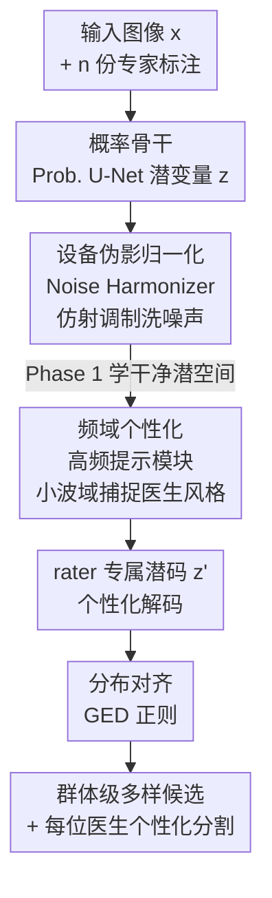

# Harmonized Feature Conditioning and Frequency-Prompt Personalization for Multi-Rater Medical Segmentation

**会议**: CVPR 2026  
**arXiv**: [2605.08210](https://arxiv.org/abs/2605.08210)  
**代码**: GitHub（原文提及，链接未给出）  
**领域**: 医学图像 / 概率分割 / 多标注者建模  
**关键词**: 多标注者分割、设备伪影解耦、频域个性化、GED 正则、不确定性校准

## 一句话总结
针对"多个医生对同一病灶画的轮廓不一样"这件事，本文用一个轻量 Harmonizer 网络先把扫描设备噪声/伪影从特征里"洗掉"，再用高频提示模块在小波频域里捕捉每位医生的风格偏好，并用 GED 正则把模型预测分布对齐到真实标注分布，从而在 LIDC-IDRI 和 NPC-170 上同时拿到更好的群体级多样性与个性化分割（GED 0.105 vs. D-Persona 0.136）。

## 研究背景与动机
**领域现状**：医学图像分割里，同一张片子常常由多位专家各画一遍轮廓（multi-rater）。由于病灶边界本身模糊、专家训练背景与判断差异，这些标注天然不一致。主流做法分三类：① 标签融合（majority voting、STAPLE）把多份标注压成一个共识 ground truth；② 多样性保留（Probabilistic U-Net、PHiSeg、扩散模型）建模 $p(y\mid x)$ 生成一组合理候选；③ 个性化（D-Persona、DiffOSeg）给每位专家学一套专属预测。

**现有痛点**：① 融合法直接丢掉了"专家分歧"这个最有价值的信息，把模型逼向过度自信、校准很差的标签；② 现有概率/个性化方法几乎都在**空间域**操作，扫描设备噪声、采集伪影、标注质量不一会一起钻进潜空间，把"临床有意义的不确定性"和"设备引起的无意义扰动"搅在一起，导致跨设备泛化变差、不确定性失真。

**核心矛盾**：模型面对的"模糊"其实有**两个来源**——数据级噪声（scanner/采集异质性）和标注者级差异（主观诊断风格）。现有方法不区分这两者，于是设备噪声被误当成解剖不确定性来建模。

**本文目标**：在一个统一概率框架里把这两类模糊**显式解耦**：先标准化掉设备伪影，再单独建模标注者风格，最后让预测分布对齐真实标注分布。

**切入角度**：作者观察到，标注者之间的风格差异（边界锐利度、纹理敏感度、病灶范围）主要体现在**高频成分**上；而设备伪影更像是需要被归一化掉的低层扰动。于是"先用仿射调制做去噪归一化、再去高频域做个性化"成为自然的分工。

**核心 idea**：用 Harmonizer（设备伪影归一化）+ 高频提示模块（频域个性化）+ GED 正则（分布对齐）三件套，把"设备噪声"和"医生风格"两类模糊分开处理。

## 方法详解

### 整体框架
方法建在 Probabilistic U-Net 的概率骨干上：输入一张医学图像 $x$ 和它的 $n$ 份专家标注 $\mathcal{A}=\{A^{(1)},\dots,A^{(n)}\}$，目标是学条件分布 $p_\theta(y\mid x)=\int p_\theta(y\mid x,z)\,p_\theta(z\mid x)\,\mathrm{d}z$，其中 $z$ 是低维潜变量、经重参数化 $z=\mu+\sigma\odot\epsilon$ 采样。编码器抽特征 $f$，prior/posterior 网络给出高斯参数，解码器吃 $(f,z)$ 出分割。

在这个骨干上插入两个协作模块：**Noise Harmonizer** 在各尺度对解码特征做数据驱动的仿射调制，把设备伪影"洗掉"、产出对扫描设备不变的稳定潜码；**Personalization Module** 把归一化后的特征送进小波频域，用高频提示编码每位医生的风格、调制出 rater-specific 的潜向量 $z'$。训练分两阶段：Phase 1 只训骨干 + Harmonizer（学干净的潜空间），Phase 2 冻结骨干、只训个性化模块（学医生风格）。全程由 GED 正则把预测分布拉向真实标注分布。

### 关键设计

**1. Noise Harmonizer：用可学伪影 token 做数据驱动的特征归一化，把设备噪声从解剖不确定性里剥出来**

痛点很直接：扫描设备的强度漂移、运动伪影、域偏置会随特征一路传进潜空间，让模型把"设备造成的扰动"误当成"解剖模糊"。Harmonizer $\mathcal{H}_\phi^{(n)}$ 的做法是在每层解码特征 $f_l$ 上预测一组仿射参数 $(\gamma_l,\beta_l)$，再做 $\tilde f_l=\gamma_l\odot f_l+\beta_l$ 的调制。关键在于这组参数怎么来：维护一个可学的"伪影 token 库" $t=\{t_1,\dots,t_M\}$ 代表典型噪声模式，用 token 当 query、特征当 key/value 做注意力 $f'_l=\mathrm{Softmax}(Q_jK_j^\top/\sqrt{D_h})V_j$，再 GAP + 两层 MLP 出 $(\gamma_l,\beta_l)$。这相当于一个**条件化的、随输入自适应的归一化层**：它不需要事先知道噪声分布，就能动态压掉强度漂移和域偏置。各层**权重共享**带来跨尺度正则，保证全网去噪行为一致。效果上，$(\gamma_l,\beta_l)$ 隐式编码了"采集条件"，引导网络产出对设备不变、却仍能表达结构不确定性的潜码 $z$

**2. 高频提示模块：在小波频域用可学提示编码每位医生的边界/纹理风格**

设备噪声洗掉后，剩下的"医生风格"该怎么单独建模？作者假设风格差异（边缘刻画、纹理敏感度、病灶范围）主要藏在**高频**里。模块先把特征线性降维到 $D/4$，再用 Haar 小波 DWT 分解成四个子带 $[X_{LL},X_{LH},X_{HL},X_{HH}]$：$X_{LL}$ 是结构轮廓，其余三个高频子带拼成 $X_H$（含纹理/边缘细节，正是医生们解读分歧最大的地方）。模块里准备 $N$ 个提示分量 $P_c$ 代表潜在标注偏好，由可学权重 $c_i$ 调制；再从 $X_H$ 推出自适应权重向量 $\mathbf{w}=\mathrm{Softmax}(\mathrm{PWC}(X_H))$，把这些分量合成上下文相关的提示 $P=\mathrm{Conv}_{3\times3}(\sum_c \mathbf{w}(c_i(P_c)))$。提示与高频特征通过 Large Kernel Attention 交互 $X'_H=\mathrm{Conv}_{1\times1}(\mathrm{Attention}(X_H,P))$，把图像纹理对齐到推断出的医生偏好。之后从固定 prior 采 $M_z$ 个样本构成"先验记忆库" $\mathbf{Z}^{\text{prior}}_{\text{bank}}$，用局部特征 $X_d$ 当 query、库当 key/value 做 cross-attention，再 IDWT 重建全频谱、融合得到 rater 专属潜码 $z'$。因为这个模块极轻（仅 0.07 M 参数），可以**不重训、不复制骨干**就合成专家专属分割，天然适配半监督/少样本个性化

**3. GED 正则：把"何处该多样、何处该收敛"直接写进损失**

光有个性化还不够——模型自己生成的那组候选必须在统计上"长得像"真实的专家标注集合。作者把分割形式化成两个条件分布的匹配问题：模型分布 $\mathcal{P}(y\mid x)$ 对齐经验标注分布 $\mathcal{A}(y\mid x)$，度量用 Generalized Energy Distance：

$$\mathcal{L}_{\text{GED}}=\frac{2}{KN}\sum_{k=1}^{K}\sum_{i=1}^{N}d(P_k,A_i)-\frac{2}{K(K-1)}\sum_{1\le k<k'\le K}d(P_k,P_{k'})$$

其中 $d=1-\mathrm{IoU}$，$\{P_k\}$ 是模型采的 $K$ 个样本、$\{A_i\}$ 是 $N$ 份专家标注。第一项（保真）把预测分布拉向标注流形，第二项（多样）惩罚样本间过于相似、防止模型退化成单一共识掩膜。这一项的妙处在于它让"专家分歧大的边界处多样、专家一致处收敛"成为损失直接优化的目标，而不是靠后处理

### 损失函数 / 训练策略
总目标 $\mathcal{L}_{\text{total}}$ 由四部分组成：分割重建项（Dice + 交叉熵）、KL 散度正则、Harmonizer 惩罚项 $\lambda_{\text{harm}}\sum_l(\|\gamma_l-1\|_2^2+\|\beta_l\|_2^2)$（把仿射参数往恒等映射拉、防止过度调制）、以及 GED 分布对齐项 $\lambda_{\text{GED}}\mathcal{L}_{\text{GED}}$。训练分两阶段：**Phase 1**（100 epoch，Adam，lr 1e-4，潜维 $D=6$，记忆库 $M=100$）排除个性化头，只训骨干 + Harmonizer，学伪影不变、解剖一致的潜特征；**Phase 2**（150 epoch，lr 降到 5e-5）冻结编码器/解码器/Harmonizer，只训个性化模块，把频域适配对齐到各医生标注风格。全模型 30.31 M 参数（骨干 30.11 M + Harmonizer 0.14 M + 个性化 0.07 M），单卡 RTX 3090，推理约 0.42 s/次。

## 实验关键数据

### 主实验

数据集：LIDC-IDRI（胸部 CT 肺结节，最多 4 位放射科医生标注，1,609 切片/214 患者）与 NPC-170（鼻咽癌多模态 MRI，4 位放疗医生标注 GTVp，100/20/50 划分）。

**分布拟合与采样多样性（Phase 1 / Table 1）**，采样数 $K=50$：

| 数据集 | 方法 | GED↓ | Dice_soft↑ | Dice_max↑ | Dice_match↑ |
|--------|------|------|-----------|-----------|------------|
| LIDC-IDRI | Prob. U-Net (#50) | 0.2168 | 88.80 | 88.87 | 88.81 |
| LIDC-IDRI | D-Persona (#50) | 0.1358 | 90.45 | 91.37 | 91.33 |
| LIDC-IDRI | **Harmonizer (#50)** | **0.1048** | **91.81** | **92.28** | **91.94** |
| NPC-170 | Prob. U-Net (#50) | 0.3528 | 81.19 | 84.19 | 80.13 |
| NPC-170 | D-Persona (#50) | 0.1978 | 84.01 | 82.79 | 81.69 |
| NPC-170 | **Harmonizer (#50)** | **0.1758** | **84.83** | 82.26 | **82.65** |

GED 在 LIDC 上 0.105 vs. D-Persona 0.136、NPC 上 0.176 vs. 0.198，均显著降低；且随采样数 $K$ 从 10→50，GED 单调下降、Dice_soft 单调上升，说明模型在不"过度发散"的前提下系统性扩大了对合理标注的覆盖。

**个性化分割（Phase 2 / Tables 2-3）**：

| 数据集 | 方法 | GED↓ | Dice_max↑ | Dice_match↑ | Dice_mean↑ |
|--------|------|------|-----------|-------------|------------|
| LIDC-IDRI | Pionono | 0.1502 | 90.10 | 88.97 | 88.84 |
| LIDC-IDRI | D-Persona | 0.1444 | 90.38 | 89.17 | 89.17 |
| LIDC-IDRI | **Harmonizer** | **0.1419** | **92.65** | **90.00** | **90.78** |
| NPC-170 | D-Persona | 0.2970 | 81.60 | 80.50 | 80.40 |
| NPC-170 | **Harmonizer** | **0.2685** | **84.46** | **81.63** | **81.63** |

LIDC 上 Dice_mean 比 D-Persona 高约 +1.61 pp；NPC（更难的多模态数据集）上即便面对显著的医生间分歧，仍以 81.63% mean Dice 超过 transformer 类 TAB 与概率类 Pionono。

### 消融实验

原文正文未给完整消融表（声明放在 supplementary material），此处据正文可观察到的对照整理：

| 配置 | 关键观察 | 说明 |
|------|---------|------|
| Full（Harmonizer + 频域提示 + GED） | LIDC GED 0.105 / NPC 0.176 | 完整模型，最佳 |
| 仅 Phase 1（Harmonizer + GED，无个性化） | 已超 D-Persona 的分布拟合 | 去噪 + GED 即贡献主要分布对齐增益 |
| 各 rater 单独训 U-Net | 仅在自己 rater 上峰值、对他人掉点严重 | 缺乏分布覆盖，且要为每位医生训一个网络 |
| Prob. U-Net 基线 | GED 0.217 / 0.353 | 潜先验校准差、易生成冗余假设 |

> ⚠️ 详细模块级消融（单独去掉 Harmonizer / 频域提示 / GED 各掉多少点）在补充材料，正文未列具体数值，以原文为准。

### 关键发现
- **去噪要先于个性化**：与 D-Persona 把专家提示直接条件在仍含残余采集噪声的空间特征上不同，本文先 harmonize 再在频域个性化，使 Dice_max 与 Dice_match 的差距很窄——说明每个个性化预测是"真·为该医生定制"，而非随机采样碰巧拟合。
- **不确定性临床有意义**：模型在专家一致区域置信度上升、在模糊区域下降，把不确定性集中到临床上确实模糊的边界。
- **极轻量**：Harmonizer + 个性化合计仅 0.21 M 参数（占全模型 0.7%），却带来跨设备稳定性，适合半监督/少样本个性化场景。
- **多模态更难但仍领先**：NPC-170（T1/T2/T1c 多模态、分歧更大）上 Dice_max 没全面领先（82.26 略低于部分基线在某些列），但 GED 与 Dice_match/mean 仍最优，说明优势主要来自分布对齐与一致性而非单点峰值。

## 亮点与洞察
- **"两类模糊"显式解耦的视角很值**：把 multi-rater 的不确定性拆成"设备噪声"和"医生风格"两条线分别处理，是这篇最核心的 framing——它解释了为什么纯空间域方法会失真，也直接指导了模块设计。
- **频域 = 风格载体**的假设很巧：用 Haar 小波把高频（纹理/边缘）单独拎出来做个性化，避开了对低频结构轮廓的扰动，使个性化"只改风格、不动解剖"。这个"在哪个频段做什么"的思路可迁移到其他需要"保结构、调风格"的任务（如风格化分割、域适应）。
- **可学伪影 token 库 + 注意力出仿射参数**：把 FiLM 式调制升级成"用一组可学噪声原型当 query"的条件归一化，是一个轻量但有想法的去噪设计，可复用到任何受采集异质性困扰的医学任务。
- **GED 当损失而非仅当指标**：直接把"何处多样、何处收敛"写进训练目标，比靠 latent 先验隐式控制更可控。

## 局限与展望
- 正文把详细消融与鲁棒性（噪声/模糊）实验都放进补充材料，主文无法判断三个组件各自的边际贡献，复现与可信度打折。
- "高频 = 医生风格"是一个强假设；对于风格差异体现在大尺度范围（如整体病灶圈大圈小）而非高频细节的场景，频域个性化是否仍最优存疑。
- 两阶段训练 + 冻结骨干虽稳，但 Phase 2 完全冻结编码器可能限制个性化能修正的范围；端到端联合微调是否更好未探讨。
- 仅在两个数据集（CT 肺结节、MRI 鼻咽癌）验证，且都是 4 位标注者；标注者数量更多、或标注者集合在训练/测试间变化时的泛化未知。
- NPC-170 上 Dice_max 并非全面领先，说明在某些"上界覆盖"指标上方法优势不绝对。

## 相关工作与启发
- **vs D-Persona**：D-Persona 用受约束潜空间 + 专家提示做个性化，但提示条件在**空间特征**上，残余采集噪声会混进去；本文先 Harmonizer 去噪、再在**频域**个性化，把风格线索（锐度、纹理）从结构里分离，GED 与 Dice_mean 都更优。
- **vs DiffOSeg**：DiffOSeg 用两阶段扩散（群体融合 + 自适应提示）做个性化，但仍是特征级调制、未显式解耦噪声与诊断差异；本文用更轻量的仿射归一化 + 频域提示达到类似"无骨干冗余"的个性化，参数代价极小。
- **vs Probabilistic U-Net / PHiSeg**：经典概率法用各向同性高斯或分层潜变量建模多样性，潜先验易稀疏/校准差、生成冗余假设；本文用 Harmonizer 先净化潜空间 + GED 对齐，潜流形更紧凑、覆盖更准。
- **vs STAPLE / majority voting 等融合法**：融合法把分歧压成单一共识、丢掉不确定性；本文反其道而行，显式保留并建模分歧，并把它对齐到经验分布。

## 评分
- 新颖性: ⭐⭐⭐⭐ "两类模糊解耦 + 频域个性化"的 framing 清晰且少见，伪影 token 归一化与 GED-as-loss 都有想法。
- 实验充分度: ⭐⭐⭐ 两个数据集、对比充分，但核心消融与鲁棒性实验全放补充材料，主文模块贡献无法独立验证。
- 写作质量: ⭐⭐⭐⭐ 动机推导清楚、模块分工明确，公式较完整；个别表格列数值在多模态上优势不绝对但有诚实交代。
- 价值: ⭐⭐⭐⭐ 轻量（+0.21 M 参数）即可获得跨设备稳定的个性化多标注者分割，临床可解释性强，易嫁接到现有概率分割骨干。

<!-- RELATED:START -->

## 相关论文

- [\[CVPR 2026\] Virtual Immunohistochemistry Staining with Dual-Aligned Multi-Task Feature Guidance](virtual_immunohistochemistry_staining_with_dual-aligned_multi-task_feature_guida.md)
- [\[ICLR 2026\] COMPASS: Robust Feature Conformal Prediction for Medical Segmentation Metrics](../../ICLR2026/medical_imaging/compass_robust_feature_conformal_prediction_for_medical_segmentation_metrics.md)
- [\[AAAI 2026\] CD-DPE: Dual-Prompt Expert Network Based on Convolutional Dictionary Feature Decoupling for Multi-Contrast MRI Super-Resolution](../../AAAI2026/medical_imaging/cd-dpe_dual-prompt_expert_network_based_on_convolutional_dictionary_feature_deco.md)
- [\[CVPR 2026\] MedFG-VQA: Low-Frequency Memory and Graph Attention for Lightweight Medical VQA](medfg-vqa_low-frequency_memory_and_graph_attention_for_lightweight_medical_vqa.md)
- [\[CVPR 2026\] PMRNet: Physics-informed Multi-scale Refinement Network for Medical Image Segmentation](pmrnet_physics-informed_multi-scale_refinement_network_for_medical_image_segment.md)

<!-- RELATED:END -->
