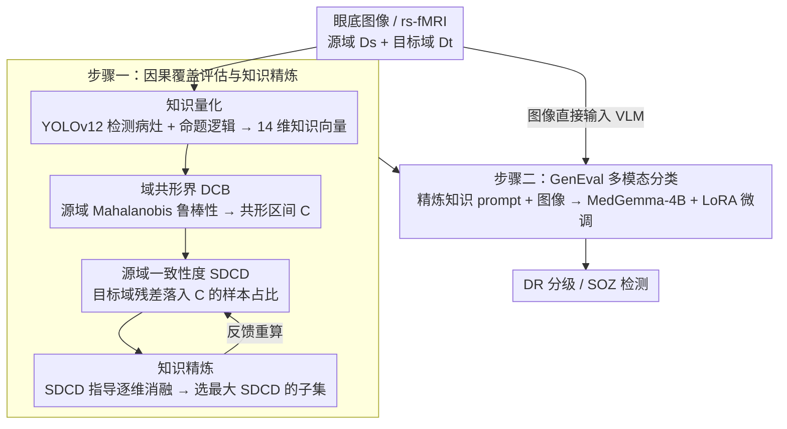

<!-- 由 src/gen_stubs.py 自动生成 -->
# Human Knowledge Integrated Multi-modal Learning for Single Source Domain Generalization

**会议**: CVPR2026  
**arXiv**: [2603.12369](https://arxiv.org/abs/2603.12369)  
**代码**: [IMPACTLabASU/GenEval](https://github.com/IMPACTLabASU/GenEval)  
**领域**: 医学图像  
**关键词**: 单源域泛化, 视觉语言模型, 因果覆盖, 共形推断, 糖尿病视网膜病变, LoRA微调, MedGemma

## 一句话总结

提出 GenEval，通过域共形界（DCB）量化因果覆盖差距，并将人类专家知识量化精炼后与医学 VLM（MedGemma-4B）融合，以 LoRA 微调实现单源域泛化，在 DR 分级和癫痫灶检测上显著超越基线。

## 研究背景与动机

**域泛化难题**：医学图像分类在跨域部署时性能急剧下降，现有 DG 方法在 DR 分级上无法一致性地显著超越 ERM（如 SPSD-ViT 仅比 ERM-ViT 高 1.3%，p=0.09 不显著）。

**单源域更具挑战**：临床场景常常只有单一来源数据可用，SDG 比 MDG 更难，SOTA 技术表现更差。

**因果覆盖缺失**：不同域之间存在因果因子的差距——例如 EyePACS 中有 Messidor 中缺失的新生血管化标志，导致从 Messidor 训练的模型无法准确分类 EyePACS 数据。

**缺乏因果覆盖量化工具**：理论上域泛化需满足因果覆盖和源风险最小化两个必要条件，但此前没有客观的方法来量化因果覆盖程度。

**人类知识有价值但模糊**：领域专家拥有可弥补因果差距的知识，但这些知识是定性的、含歧义的（如微动脉瘤 vs 静脉出血容易混淆），需要量化和精炼。

**通用 VLM 不够鲁棒**：现有医学 VLM（CLIP、CLIP-DR）在未见域上表现脆弱，且缺乏不确定性保证。

## 方法详解

### 整体框架

GenEval 围绕一个核心判断展开：跨域分类失败的根因是源域缺了目标域所需的因果因子（**因果覆盖缺口**），专家知识能补这个缺口、却太模糊。于是方法分两大步骤——**(1) 因果覆盖评估与知识精炼**：先把专家知识量化成可计算的病灶向量，再用 DCB 理论度量源/目标域的因果差距、用 SDCD 把这个差距压成一个可优化的标量，并以 SDCD 为指标逐维消融、筛出最能弥合差距的知识子集；**(2) 多模态 VLM 分类**：把精炼后的知识写成结构化临床 prompt，与眼底图像一起喂给 MedGemma-4B，用 LoRA 微调完成 DR 分级 / SOZ 检测。注意眼底图像同时流向两条路——既进 YOLO 做知识量化，也直接作为 VLM 的图像输入。

### 关键设计

**1. 域共形界（DCB）：把"源域涵盖了哪些因果因子"编码成一个区间**

域泛化理论要求"因果覆盖"——源域得包含分类目标域所需的全部因果因子，但此前没人能在拿不到采集协议/元数据的情况下客观判断两个域差在哪。DCB 把这件事变得可计算：对每个样本 $X_i$，先算它的因果因子向量 $\mathcal{K}(X_i)$ 与源域内其他样本的平均 Mahalanobis 距离，作为鲁棒性度量 $\rho(\mathcal{K}(X_i), D^s)$（公式 4）；再用共形推断（Algorithm 1：把源域对半分成校准/验证子集，取残差的分位点）构造预测区间 $C$，使源域样本的鲁棒性以 $\geq 1-\alpha$ 概率落入 $C$（公式 5）。Theorem 1 进一步保证：目标域样本的鲁棒性残差落入 $C$，当且仅当它不含源域未涵盖的因果因子关系。于是 $C$ 成了一把无需任何分布假设的"部署前安全尺"。

**2. 源域一致性度（SDCD）：把因果差距压成一个可优化的标量**

DCB 给的是逐样本的"在不在区间内"，还不能直接拿来比较"哪个知识配置更好"。SDCD（Algorithm 2）统计目标域中残差落入 DCB 区间的样本百分比，作为整个目标域因果覆盖程度的量化指标。它的价值在于 Lemma 1 的证明——SDCD 是鲁棒性残差的单调函数，且与学习机在目标域上的 SDG 性能正相关（实测 Pearson $r=0.692$, $p<0.02$）。这把"泛化能不能成"从事后才知道的结果，变成了部署前就能算、还能当优化目标的可测量，直接支撑了下游的知识精炼。

**3. 知识量化与精炼：用 YOLOv12 量化专家知识，再用 SDCD 反向筛子集**

专家知识能补因果缺口，但定性、含歧义（微动脉瘤易与静脉出血混淆），不能直接喂模型。量化一步用 YOLOv12 检测出血、硬性渗出物、棉絮斑等病灶，把检测框与专家标注的 IoU 整理成 14 维实值向量，并用命题逻辑把 ICDR 分级标准等专家规则编码进来。精炼一步则以 SDCD 为指标对这 14 维逐维消融——每去掉一维就重算平均 SDCD，保留使 SDCD 最大的子集（最终去掉"新生血管化"维度效果最好，因为该病灶 YOLO 难以可靠检测、反而引入噪声）。消融由可测的 SDCD 客观驱动，绕开了"哪条专家知识更有用"的主观争论，直接对准 Lemma 1 保证的性能指标。

**4. GenEval 多模态分类：把精炼知识写成 prompt，与图像一起喂 MedGemma-4B**

通用/医学 VLM 在未见域上脆弱，单靠图像补不上因果缺口。GenEval 以医学专用 VLM MedGemma-4B 为底座，把精炼后的知识嵌进结构化临床 prompt（模仿眼科医生的诊断流程与 ICDR 标准），与眼底图像组成多模态输入；再用 LoRA（$r=16, \alpha=16$, dropout=0.05）只微调约 95M 参数（占 4B 的 2.4%），冻结主干以保留预训练的临床知识、避免灾难性遗忘。文本形态的因果知识直接补进模型推理，弥合了图像里缺失的因果因子，又因参数高效微调而部署轻量（单图推理约 424ms，含 YOLO 检测端到端约 633ms）。

### 损失函数

采用标准的因果语言建模（Causal LM）损失进行 LoRA 微调，通过交叉熵最小化源域风险。

## 实验

### 主要结果

**SDG — DR 分级（12 对源-目标迁移）**

| 源域 → 目标域 | 最佳基线 | 基线准确率 | GenEval | K+D SDCD |
|:---|:---|:---:|:---:|:---:|
| Messidor → Aptos | SPSD-ViT | 48.3% | **56.0%** | 98.0% |
| Messidor → EyePACS | SPSD-ViT | 57.4% | **80.0%** | 94.9% |
| Messidor2 → Aptos | SPSD-ViT | 52.8% | **69.7%** | 76.3% |
| Messidor2 → EyePACS | SPSD-ViT | 72.5% | **77.8%** | 96.3% |
| EyePACS → Messidor2 | DRGen | 65.4% | **80.5%** | 99.8% |
| EyePACS → Messidor | DRGen | 54.6% | **69.5%** | 100.0% |

**扩展 SDG（固定 EyePACS 训练，6 个目标域）**

| 方法 | APTOS | Messidor | IDRiD | DeepDR | FGADR | RLDL | 平均 |
|:---|:---:|:---:|:---:|:---:|:---:|:---:|:---:|
| GDRNet | 52.8 | 65.7 | 70.0 | 40.0 | 7.5 | 44.3 | 46.7 |
| DECO | 59.7 | 70.1 | 74.8 | 40.3 | 9.9 | 49.3 | 50.7 |
| **GenEval** | **73.2** | 69.5 | 70.6 | **59.2** | **56.9** | **67.6** | **66.2** |

### 消融实验

知识精炼消融（SDCD 指导）：

| 消融操作 | SDCD (%) | 准确率 (%) |
|:---|:---:|:---:|
| 不消融 | 59.0 | 65.0 |
| 去掉微动脉瘤 | 68.0 | 70.0 |
| 去掉出血/渗出物 | 71.7 | 71.1 |
| 去掉静脉串珠 | 82.8 | 73.2 |
| 去掉新生血管化 | **82.8** | **73.2** |

去除新生血管化效果最佳，因为该特征极难被 YOLO 准确检测，引入噪声反而降低 SDCD。

### 关键发现

- **SDCD 与准确率正相关**（$r=0.692$, $p<0.02$），验证了 Lemma 1 的单调性。
- **知识集成大幅提升 SDCD**：K+D SDCD 远高于单纯 D SDCD，多数情况接近 100%。
- **MDG 也有显著提升**：GenEval 在四域 DR 上平均 79.21% vs SPSD-ViT 73.3%（+5.9%）。
- **VLM 对比**：GenEval 的 macro F1 达 75.1%，比 CLIP-DR 高 +28.3%（46.8% → 75.1%）。
- **SOZ 跨中心**：GenEval 平均 F1 90.0% vs CuPKL 88.1%，且跨中心表现更稳定。

## 亮点

- 首次提出 DCB 理论，提供无分布假设的因果覆盖量化方法，能在部署前预测泛化是否可行。
- SDCD 指导的知识精炼机制巧妙地利用可测指标选择最优知识子集，避免了定性知识的歧义。
- 将结构化专家知识作为文本 prompt 融入 VLM，以多模态方式弥补域间因果差距，思路新颖。
- 评估规模大：8 个 DR 数据集 + 2 个 SOZ 数据集，12 对 SDG 迁移方向，极为全面。

## 局限性

- DCB 理论假设数据生成机制连续可微，对数字-物理混合系统中的阈值效应或突变可能不适用。
- YOLO 知识提取是性能瓶颈：新生血管化等复杂病灶无法可靠检测，最终不得不移除。
- 14 维知识向量依赖特定病种的专家规则，迁移到新任务需重新定义特征和逻辑，泛化成本高。
- SDCD 在低信噪比下不稳定（PSNR < 15dB 时相关性丧失），图像质量差的场景可能失效。
- 仅在 DR 和 SOZ 两个医学任务上验证，更广泛的医学影像领域（如病理、CT）未涉及。

## 相关工作

- **医学域泛化**：MMD、CDANN、SD-ViT、SPSD-ViT 等对齐特征分布的方法均无法稳定超越 ERM；DRGen、DECO、GDRNet 为 DR 专用基线。
- **医学 VLM**：BiomedCLIP、LLaVA-Med 实现零样本迁移；CLIP-DR 引入排序感知 prompt；MedGemma-4B 为本文采用的专用医学基础模型。
- **共形推断**：分布无关的不确定性量化框架，此前用于 OOD 检测和医学 AI 部署，本文创新性地用于量化域间因果差距。

## 评分

- 新颖性: ⭐⭐⭐⭐ — DCB 理论和 SDCD 指导的知识精炼是原创性贡献，多模态知识融合思路有启发性
- 实验充分度: ⭐⭐⭐⭐⭐ — 8+2 数据集、12 对 SDG 迁移、多种基线对比、消融/敏感性分析齐全
- 写作质量: ⭐⭐⭐⭐ — 理论推导严谨，但符号密集、行文偏长，部分证明需查看补充材料
- 价值: ⭐⭐⭐⭐ — 在医学影像 SDG 实际部署场景中很有价值，DCB 可作为部署前的安全检查工具

<!-- RELATED:START -->

## 相关论文

- [\[CVPR 2026\] Reclaiming Lost Text Layers for Source-Free Cross-Domain Few-Shot Learning](reclaiming_lost_text_layers_for_source-free_cross-domain_few-shot_learning.md)
- [\[AAAI 2026\] Experience with Single Domain Generalization in Real World Medical Imaging Deployments](../../AAAI2026/medical_imaging/experience_with_single_domain_generalization_in_real_world_medical_imaging_deplo.md)
- [\[CVPR 2026\] Residual SODAP: Residual Self-Organizing Domain-Adaptive Prompting with Structural Knowledge Preservation for Continual Learning](residual_sodap_residual_self-organizing_domain-adaptive_prompting_with_structura.md)
- [\[CVPR 2026\] Tell2Adapt: A Unified Framework for Source Free Unsupervised Domain Adaptation via Vision Foundation Model](tell2adapt_a_unified_framework_for_source_free_unsupervised_domain_adaptation_vi.md)
- [\[CVPR 2026\] Robust Multi-Source Covid-19 Detection in CT Images](robust_multi-source_covid-19_detection_in_ct_images.md)

<!-- RELATED:END -->
