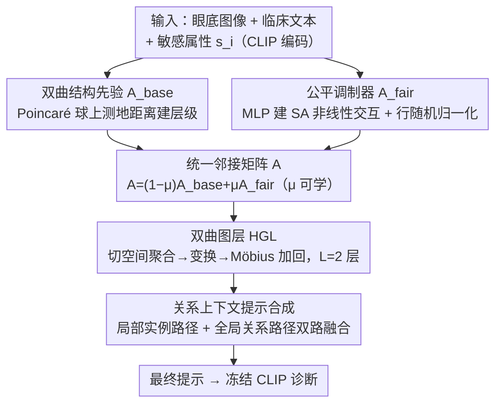

# Hyperbolic Relational Prompts for Intersectional Fairness in Medical VLMs

**会议**: CVPR 2026  
**论文**: [CVF Open Access](https://openaccess.thecvf.com/content/CVPR2026/html/Qian_Hyperbolic_Relational_Prompts_for_Intersectional_Fairness_in_Medical_VLMs_CVPR_2026_paper.html)  
**代码**: 未公开  
**领域**: 医学图像 / 多模态VLM / 公平性  
**关键词**: 医学VLM、交叉公平性、双曲几何、关系图、提示学习

## 一句话总结
FRP 把医学 VLM 的"提示生成"从孤立处理单样本改成**动态关系推理**：用一张样本间关系图捕捉细粒度依赖，再用**双曲图层**显式建模种族×性别等交叉身份的层级结构，从而在缓解"交叉盲区"偏见的同时把诊断 AUC 推到 SOTA（FairVLMed 77.50%、Harvard-GF 85.94%）。

## 研究背景与动机

**领域现状**：医学诊断对公平性要求极高，算法在种族、性别等敏感属性（SA）上的偏见会直接造成医疗不平等。随着领域从纯视觉模型转向能同时读图像+临床文本的 VLM（CLIP、MedCLIP、BiomedCLIP），诊断能力增强了，但 VLM 会从图像和文本**双路继承并放大偏见**。

**现有痛点**：传统公平性方法（如 FairCLIP）靠"宽泛的分布对齐"去偏，只盯单一属性。这带来**交叉盲区（intersectional blindness）**——为某个属性（如种族）去偏，反而会放大另一个属性（如性别）上的偏见，比如修了种族公平却让"女性黑人"子群更吃亏。同时主流提示学习虽然参数高效，但**对公平性无感知**：它采用独立建模范式，样本被孤立处理，完全不考虑公平性所需的样本间上下文。

**核心矛盾**：交叉身份天然带有**层级结构**（如 Gender → Black Female），而现有方法（1）孤立处理样本、丢掉了跨样本的细粒度依赖；（2）把多个敏感属性当独立因子、无法刻画其组合的非线性交互；（3）用欧氏空间嵌入层级关系会产生高失真。三者叠加导致交叉子群的公平性无从谈起。

**本文目标**：（1）让提示从"静态条件"变成"动态、上下文感知的推理机制"；（2）显式建模敏感属性的**关系结构 + 层级（交叉）结构**，而非孤立、独立地处理。

**切入角度**：作者从信息论出发——交叉公平本质是要最小化各人口子群间的性能方差，而这要求模型能感知"细粒度、属性条件化的样本间依赖"。他们用一个定理（Theorem 3.1）证明：带属性感知邻接矩阵的关系模型相比孤立模型，能获得严格更高的**公平条件互信息** $I(X;Y\mid S)$，且增益下界由公平调制邻接矩阵 $A_{fair}$ 决定。这就把"为什么要做关系建模 + 属性调制"从直觉变成了可量化的动机。

**核心 idea**：用"关系图 + 双曲层级建模"驱动**公平感知的关系提示（FRP）**，把公平性直接嵌入提示生成过程，而不是事后 post-hoc 去偏。

## 方法详解

### 整体框架
输入是一批样本（SLO 眼底图像 + 结构化临床文本 + 任务标签 + 敏感属性向量 $s_i$），输出是为每个样本动态合成、且对齐其关系与交叉结构的提示，喂给冻结 CLIP 做青光眼诊断。整体流程：CLIP 编码 → **构建统一邻接矩阵**（双曲结构先验 $A_{base}$ + 公平调制器 $A_{fair}$ 凸组合）→ **双曲图层 HGL 做公平信息传递** → **双路提示合成**（局部实例路径 + 全局关系上下文路径）→ 与静态基础提示相加得最终提示。注意：推理时关系图**仅用视觉特征构建、不需要敏感属性**。

### 关键设计

**1. 双曲结构先验 $A_{base}$：用 Poincaré 球的测地距离建样本间层级**

针对"欧氏空间嵌入交叉身份层级会高失真"的痛点，FRP 把每个 mini-batch 的样本看成关系图节点 $z_i=[z_{Ii};z_{Ti}]$（图像+文本特征拼接），映射到 Poincaré 球后用双曲测地距离 $d_c(\cdot,\cdot)$ 度量相似性，并据此定义基础邻接矩阵：$(A_{base})_{ij}=\frac{\exp(-d_c(z_i^{\mathbb{H}},z_j^{\mathbb{H}}))}{\sum_k \exp(-d_c(z_i^{\mathbb{H}},z_k^{\mathbb{H}}))}$。双曲几何天生擅长低失真嵌入层级结构（树状结构在双曲空间体积指数膨胀），恰好契合"Gender → Black Female"这类交叉身份的层级本质。但这个先验是**属性无关（attribute-agnostic）**的，还没用到敏感属性，留待下一步补足。

**2. 公平调制器 $A_{fair}$：用 MLP 显式建模敏感属性的非线性交互**

为了让邻接矩阵真正"看见"敏感属性、使方差目标 $\mathcal{L}_{fair}$ 可解，FRP 用一个 MLP 对成对属性建权重 $w_{ij}^{fair}=\sigma(\text{MLP}([s_i;s_j]))$，得到对称权重矩阵 $W_{fair}$。再以 Hadamard 积调制结构先验 $A_{raw}=A_{base}\odot W_{fair}$，并做行随机归一化 $A_{fair}=\text{diag}(A_{raw}\mathbb{I})^{-1}A_{raw}$。这一步直接对应 Theorem 3.1 的要求——只有引入属性调制的 $A_{fair}$，才能捕捉"属性条件化依赖"、带来正的信息增益下界。最终把两者凸组合成统一矩阵 $A=(1-\mu)A_{base}+\mu A_{fair}$，$\mu\in[0,1]$ 是可学习参数，让模型自适应权衡"纯层级先验"与"属性调制"。

**3. 双曲图层 HGL：在双曲空间原生做公平信息传递**

标准 GNN 在欧氏空间传递层级数据会引入显著失真，FRP 改用双曲图层 HGL，让信息在 Poincaré 球上原生流动。给定初始节点特征 $Z^{(0)}$，先指数映射到双曲空间 $Z^{\mathbb{H}}=\exp_0^c(Z^{(0)})$，然后每层做四步：对数映射到切空间 $Z_{tan}=\log_0^c(Z^{\mathbb{H}})$ → 用统一邻接 $A$ 聚合 $H_{agg}=A\cdot Z_{tan}$ → 稳定化线性变换 $H_{trans}=\text{Dropout}(\text{LayerNorm}(\text{Linear}(H_{agg})))$ → 映回球面并用 Möbius 加法整合 $Z^{(l+1)}=Z^{(l)}\oplus_c\exp_0^c(H_{trans})$。堆 $L=2$ 层后映回切空间得 $Z_{final}$，再按维度拆回图像 $Z_{img}$ 与文本 $Z_{text}$ 两支。这一步是把交叉公平信息沿关系图"无失真"地扩散开，是 Theorem 3.1 承诺增益的落地操作。

**4. 关系上下文提示合成：局部实例 + 全局关系双路融合成动态提示**

最后把关系信息合成为自适应提示。双路设计：局部路径处理实例特征 $z_{Ii}$ 生成 $P_{img}=\text{Reshape}(W_{img}\cdot\frac{1}{B}\sum_i z_{Ii})$，捕捉个体信息；全局路径先用多头注意力互相融合 HGL 输出的 $Z_{img}/Z_{text}$，残差归一化池化得上下文向量 $f_{fused}$，再投影成 $P_{text}$，捕捉全局关系上下文。两条提示取平均成动态分量，与静态基础提示相加得最终上下文 $C_{final}=C_{base}+(P_{img}+P_{text})/2$，并拼成各类提示 $T_k=[T_{prefix,k};C_{final,k};T_{suffix,k}]$。这保证下游 VLM 的预测同时受"局部实例细节"和"全局关系公平上下文"双重条件约束。

### 损失函数 / 训练策略
总目标 $\min_\theta[\mathcal{L}_{task}+\lambda\mathcal{L}_{fair}]$。任务损失沿用 CLIP 对称对比损失对齐图文嵌入；**公平损失是关键创新**——它跳出"分布对齐"，转而最小化各人口子群（race×gender 组合的 $M$ 个组 $G$）平均任务损失的**方差**：$\mathcal{L}_{fair}=\text{Var}_{G\in\mathcal{G}}(\mathcal{L}_G)$，其中 $\mathcal{L}_G=\mathbb{E}_{i\in G}[\ell_{task}(\cdot)]$。即直接逼模型在各子群上**性能均衡**而非分布相似。训练用 SGD、batch 32、50 epochs、cosine lr（峰值 0.002）、1 epoch warmup，公平系数 $\lambda=0.1$、提示长度 $N_{ctx}=32$。⚠️ 双曲映射与测地距离的具体公式作者放在补充材料，正文未给完整定义，以原文为准。

## 实验关键数据

### 主实验
在 FairVLMed（10k 眼底图+临床文本，青光眼诊断，含 race/gender）与 Harvard-GF（3,300 OCT，纯视觉）上评测。指标：AUC↑、ES-AUC↑（equity-scaled AUC，$\text{ES-AUC}=\frac{\text{AUC}}{1+\sum_a|\text{AUC}-\text{AUC}_a|}$，平衡整体性能与子群差异）、DPD↓（人口均等差，组间正预测率差异）、DEOdds↓（均等几率差，TPR/FPR 差异）。基线含 CoOp/CoCoOp/VPT/MaPLe（提示学习）、BiomedCLIP/MedCLIP/PubMedCLIP（医学 CLIP）、FairCLIP（子群分布对齐）。

FairVLMed（种族属性，%）：

| 模型 | DPD ↓ | DEOdds ↓ | AUC ↑ | ES-AUC ↑ | Black AUC ↑ |
|------|------|------|------|------|------|
| CLIP | 15.35 | 15.11 | 67.84 | 61.67 | 70.78 |
| FairCLIP | 6.07 | 10.50 | 70.24 | 65.50 | 71.39 |
| MaPLe | 8.51 | 10.82 | 75.19 | 68.89 | 70.66 |
| VPT | 7.82 | 15.73 | 74.98 | 72.96 | 73.85 |
| BiomedCLIP | 12.29 | 15.37 | 71.20 | 66.88 | 66.61 |
| **FRP (Ours)** | **4.14** | **6.37** | **77.50** | **74.08** | **78.19** |

Harvard-GF（种族属性，%）：

| 模型 | DPD ↓ | DEOdds ↓ | AUC ↑ | ES-AUC ↑ |
|------|------|------|------|------|
| CLIP | 3.03 | 17.15 | 80.23 | 74.83 |
| MaPLe | 8.67 | 8.74 | 83.03 | 78.19 |
| BiomedCLIP | 2.36 | 9.55 | 83.12 | 79.53 |
| **FRP (Ours)** | 2.50 | **8.67** | **85.94** | **81.32** |

FRP 在两个基准上同时拿到最高 AUC 与最优/接近最优的公平指标，AUC 比 BiomedCLIP 高 2.82 点，Black 子群 AUC 显著提升。

### 消融实验
FairVLMed 上逐组件消融（$G_{hyp}$ 双曲 GNN、$A_{fair}$ 公平调制、$P_{mm}$ 多模态提示、$\mathcal{L}_{fair}$ 公平损失）：

| 配置 | AUC ↑ | DPD(Gender) ↓ | DPD(Race) ↓ | 说明 |
|------|------|------|------|------|
| Baseline（全去） | 67.84 | 4.34 | 15.35 | 纯 CLIP |
| w/o $A_{fair}$ | 74.90 | 6.13 | 8.20 | 去公平调制，公平显著退化 |
| w/o $G_{hyp}$（换欧氏 GAT） | 75.61 | 4.36 | 11.47 | 诊断 AUC 明显掉 |
| w/o $\mathcal{L}_{fair}$ | 78.80 | 10.26 | 9.30 | AUC 略升但公平崩塌 |
| **Full FRP** | 77.50 | **0.38** | **4.14** | 精度—公平最佳权衡 |

### 关键发现
- **每个组件都"理论有据、缺一不可"**：去 $\mathcal{L}_{fair}$ 公平指标直接崩（DPD-Gender 0.38→10.26）；去 $A_{fair}$ 公平退化；把双曲层换成欧氏 GAT 则诊断 AUC 掉——印证双曲几何对保留层级结构的必要性。
- **交叉权衡被实证**：FairCLIP 单属性对齐时，Gender 对齐策略把性别 DPD 压到 0.84，却让黑人患者 AUC 从 71.39% 降到 69.83%——典型"修一个属性、伤另一个"。FRP 则在两个维度同时改善，黑人子群 AUC 比 Gender-Aligned FairCLIP 高 8.36%。
- **超参稳健**：ES-AUC 在较大范围内稳定，但 $\lambda\ge1.0$ 时退化；$N_{ctx}$ 增到 32 后趋于平台，最优为 $(N_{ctx}=32,\lambda=0.1)$。
- **训练稳定**：50 epoch 内整体性能稳步上升、公平差异持续下降。

## 亮点与洞察
- **把公平嵌进提示生成本身**：不同于事后去偏，FRP 让提示成为"动态公平推理机制"，公平性是架构内生的——这是最核心的范式转变。
- **双曲几何 × 交叉身份是绝配**：交叉身份本质是层级树，双曲空间低失真嵌入树结构，把"为什么要用双曲"讲成了几何必然性，而非炫技。
- **公平损失=子群性能方差**：直接逼"各组性能均衡"而非"分布相似"，比传统分布对齐更贴合"交叉公平"的真实诉求，是个可迁移到其他公平任务的目标函数设计。
- **推理不需敏感属性**：训练靠 SA 调制，推理时仅用视觉特征建图，规避了部署时拿不到/不该用敏感属性的隐私顾虑。

## 局限与展望
- **仅两个青光眼数据集**：FairVLMed 与 Harvard-GF 都是眼科，未验证胸片、皮肤病等其他医学模态，泛化性待考。
- **属性维度有限**：交叉只覆盖 race×gender，社会经济地位、年龄等更高阶交叉未纳入；组数 $M$ 增大时方差目标的样本稀疏问题可能恶化。
- **关键几何公式在补充材料**：正文未给双曲映射/测地距离完整定义 ⚠️ 以原文为准，复现需查补充。
- **mini-batch 关系图依赖批内构成**：图在每个 batch 内动态构建，batch 大小与采样策略可能影响关系建模质量，作者未深入分析。

## 相关工作与启发
- **vs FairCLIP**：FairCLIP 做单属性子群分布对齐，会引发交叉权衡（修种族伤性别）；FRP 用关系图+双曲层显式建模交叉层级，在两个属性上同时改善。
- **vs CoOp / CoCoOp / MaPLe（提示学习）**：它们孤立处理样本、对公平无感知；FRP 把样本建成关系图节点、做公平感知的动态提示合成。
- **vs 双曲嵌入 / 图方法**：以往要么只用双曲建层级、要么只用图建样本依赖，FRP 首次把"双曲层级建模 + 参数高效提示学习"合二为一，并给出信息论理论justification，号称首个面向医学 VLM 交叉公平的框架。

## 评分
- 新颖性: ⭐⭐⭐⭐⭐ 双曲层级+关系图+公平提示三者合一，并有信息论定理支撑，视角独特
- 实验充分度: ⭐⭐⭐⭐ 两基准 + 充分消融 + 交叉权衡分析，但医学模态单一（仅眼科）
- 写作质量: ⭐⭐⭐⭐ 动机—理论—方法链条清晰，但核心几何公式藏在补充材料
- 价值: ⭐⭐⭐⭐ 医疗公平刚需，公平损失=子群方差与"推理不需SA"设计可迁移

<!-- RELATED:START -->

## 相关论文

- [\[CVPR 2026\] H2-Surv: Hierarchical Hyperbolic Multimodal Representation Learning for Survival Prediction](h2-surv_hierarchical_hyperbolic_multimodal_representation_learning_for_survival_.md)
- [\[CVPR 2026\] TRCoRSurg: Temporal-Relational Co-Reasoning for Surgical Video Triplet Recognition](trcorsurg_temporal-relational_co-reasoning_for_surgical_video_triplet_recognitio.md)
- [\[ICLR 2026\] HEEGNet: Hyperbolic Embeddings for EEG](../../ICLR2026/medical_imaging/heegnet_hyperbolic_embeddings_for_eeg.md)
- [\[CVPR 2026\] IVAAN: Instance-level Vision-Language Alignment via Attribute-Guided Text Prompts Generation for Nuclei Analysis](ivaan_instance-level_vision-language_alignment_via_attribute-guided_text_prompts.md)
- [\[ICML 2026\] EEG-Based Multimodal Learning via Hyperbolic Mixture-of-Curvature Experts](../../ICML2026/medical_imaging/eeg-based_multimodal_learning_via_hyperbolic_mixture-of-curvature_experts.md)

<!-- RELATED:END -->
