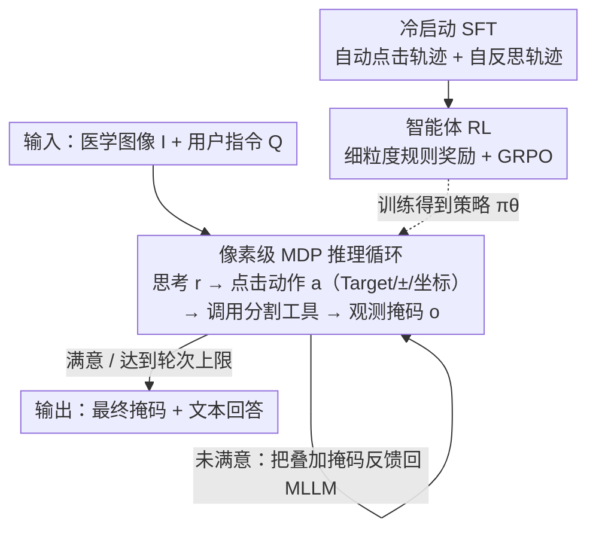

# IBISAgent: Reinforcing Pixel-Level Visual Reasoning in MLLMs for Universal Biomedical Object Referring and Segmentation

**会议**: CVPR 2026  
**论文**: [CVF Open Access](https://openaccess.thecvf.com/content/CVPR2026/html/Jiang_IBISAgent_Reinforcing_Pixel-Level_Visual_Reasoning_in_MLLMs_for_Universal_Biomedical_CVPR_2026_paper.html)  
**代码**: https://github.com/Yankai96/IBISAgent  
**领域**: 医学图像 / 多模态智能体 / 像素级推理分割  
**关键词**: 生物医学分割, 智能体 MLLM, 多步推理, 交互式分割, 强化学习

## 一句话总结
针对现有医学 MLLM 分割依赖隐式 `<SEG>` token + 外接像素解码器联合微调（易灾难性遗忘、跨域差、且只能单次前向）的问题，IBISAgent 把分割重构成"思考→点击动作→调用分割工具→观测掩码"的多步马尔可夫决策过程，用冷启动 SFT + 智能体 RL（细粒度规则奖励）训练 Qwen2.5-VL-7B，无需改架构即可迭代精修掩码，在域内/域外多个生物医学分割基准上大幅超越闭源与开源 SOTA（域内 IoU 85.58 vs 次优 50.74）。

## 研究背景与动机
**领域现状**：医学 MLLM 正从图像级理解走向像素级理解。主流像素级方案沿用 LISA 的"embedding-as-mask"范式：引入特殊 `<SEG>` token，把它的隐藏态投影后送进外接像素解码器生成掩码，需要 MLLM 与解码器联合微调。

**现有痛点**：① 联合微调外接解码器抬高了灾难性遗忘风险，模型域内强、跨域弱；② 引入隐式分割 token 扰乱了 MLLM 原生的文本输出空间，削弱推理能力，也不能真实反映模型的像素级理解；③ 几乎都是单次前向推理，缺乏像人类标注员那样多步交互、迭代精修掩码的机制。

**核心矛盾**：生物医学图像视觉语义微妙复杂（病灶线索微弱、病理模式细微），单次前向往往不够；而人类专家是用交互式分割工具、通过正/负点击多步迭代逼近的。现有 MLLM 把"分割"塞进一次性的 token 预测，既丢了语言推理空间，又丢了迭代纠错能力。

**本文目标**：让 MLLM 像标注员一样"看多次、回看中间决策、对反馈做调整"地自演化分割，且不动架构、不引入隐式 token。

**切入角度**：把分割模型当成可被语言控制的即插即用工具，MLLM 只负责生成文本化的点击命令（坐标 + 正/负），由分割工具落地成掩码并反馈，从而把像素预测与语言推理解耦。

**核心 idea**：把分割重构成多步 MDP，让 MLLM 生成交错的"推理 + 点击动作"，迭代调用分割工具精修掩码，并用两阶段训练（冷启动 SFT + 带细粒度奖励的智能体 RL）把这套像素级推理能力真正激发出来。

## 方法详解

### 整体框架
给定用户问题 $Q$ 与图像 $I$，IBISAgent 走一条多步、交错的推理路径 $P=\{(r_t,a_t,o_t)\}_{t=1}^{T}$：每步包含文本思考 $r_t$、动作 $a_t$（点击操作或输出最终答案）、以及执行动作后由分割工具产生的观测掩码 $o_t$。动作里的点击由三元组刻画——Target（目标类名）、Attribute $\in\{+1,-1\}$（正/负点击）、Coordinate_2d $\in[0,1]^2$（归一化坐标），支持一次对多个目标点击。分割工具（MedSAM2）吃进当前点击 $a_t$、上一步掩码 $M_{t-1}$ 作为空间先验和原图，输出更新掩码 $M_{t+1}$，并把 $M_{t+1}$ 半透明叠回原图生成新观测图像喂回 MLLM，如此"思考-动作-观测"循环直到模型判定掩码满意或触达上下文/轮次上限，再输出 `<answer>`。

这套能力由两阶段训练注入策略 $\pi_\theta$：先冷启动 SFT 打底像素理解与自反思，再用智能体 RL（细粒度规则奖励 + GRPO）让模型自主探索更高效的动作策略。

### 关键设计

**1. 把分割重构成像素级 MDP：思考-动作-观测的多步交互循环**

针对"单次前向 + 隐式 token 丢语言空间"的痛点，IBISAgent 把分割从一次性预测改成多步决策过程。策略在每步生成文本推理与点击动作 $r_{t+1},a_{t+1}\sim\pi_\theta(\cdot\mid I,Q,P_{<t})$，输出用 `<think>`/`<action>`/`<answer>` 三类特殊 token 标记；遇到 `<action>` 就自动解析成分割模型可读的点击 prompt，连同历史动作 $a_{0:t}$、当前掩码 $M_t$、原图一起送进交互式分割模型 $F_{seg}$ 得到 $M_{t+1}$。关键巧思有二：一是把分割工具当即插即用、用语言控制的外部工具，MLLM 只产文本点击命令，从而保留 LLM 原生语言表示、不再被 `It's <SEG>.` 这类刚性模板绑死；二是把更新掩码半透明叠回原图作为观测，让模型在单帧里同时看到 $M_{t+1}$ 和 $I$，自然支持迭代精修与自反思（错了能回退重判），把误差累积问题转成可纠正的逐步逼近。

**2. 冷启动 SFT：自动合成点击轨迹 + 自反思轨迹打底**

纯 prompt 无法让 MLLM 稳健地执行迭代视觉操作，得先 SFT 打底。难点是现有生物医学分割数据只有最终掩码、没有逐步标注过程，重新雇人标注成本太高。作者用基于规则的点击模拟算法 $F_{cs}$ 自动造轨迹：给定当前掩码 $M_t$ 与 GT 掩码 $M_{gt}$，计算二者的假阳/假阴区域，把下一个点击放在误差区域中心，$a_{t+1}=F_{cs}(M_t,M_{gt})$，从而模拟出 $[M_0,a_0,M_1,a_1,\dots]$ 高质量轨迹（数据源是 BiomedParseData，340 万图-掩码-标签、覆盖 82 类生物医学对象 / 9 种成像模态）。再用 Gemini-2.5-Pro 基于图像+GT 掩码+描述生成多样化问答（从明确指定目标到需先推理再定位），用 GPT-5 基于 QA、正确下一步动作、当前掩码的 TP/FP/FN 信息合成每步推理，并经人工后过滤。为增强鲁棒性，还专门合成自反思轨迹，覆盖两类纠错：① 自纠正（检测到错误动作→回退→重新推理）；② 用户不一致纠正（掩码精修场景下指令目标与初始掩码不符时，先丢弃错误掩码再按指令重分割）。最终得到 456K 样本的 $D_{cold}$，用标准 SFT 负对数似然训练，并对执行动作产生的分割输出 token、以及自纠正轨迹里被标记的错误动作 token 加 loss mask，避免模型学去执行错误动作。

**3. 智能体 RL：细粒度规则奖励 + GRPO 自主发现高效策略**

只靠 SFT 是在模仿轨迹，作者用 RL 让模型超越模仿、自主探索更优动作策略。$D_{rl}$ 只给图像、GT 掩码、QA，不给轨迹和推理标注（采样 BiomedParseData 得 564K VQA，再混入通用医学 VQA，共 888K，让模型按需才激活像素级推理）。区别于以往只给结果级稀疏奖励，本文设计了贯穿推理过程的密集规则奖励：① 格式奖励 $S_{format}$（特殊 token 顺序正确、`<action>` 可被解析）；② 终答奖励 $S_{ans}$（闭式 QA 查精确匹配，分割按 IoU 阈值分段给分）；③ **区域化点击放置奖励** $S_{click}$——用分割工具落地当前点击得 $M_t$，算它与 $M_{gt}$ 的 FP/FN 区域，正点击应落在 FN 区、负点击应落在 FP 区，落对加分落错扣分，逼模型把点击放在语义合理处而非乱点；④ **渐进式分割改进奖励** $S_{pseg}$——要求每步 $a_t$ 产生的掩码 IoU 高于上一步，鼓励持续精修而非冗余/震荡操作；⑤ 轨迹长度奖励 $S_{len}$（动作序列短于阈值给奖、过长按长度递增惩罚以促效率）。总奖励 $S=\tfrac{1}{5}(S_{ans}+S_{format}+S_{click}+S_{pseg}+S_{len})$，用 GRPO（去掉 KL 惩罚项）优化策略，每问采 $G$ 条 rollout，组内标准化优势 $A_i=[S_i-\mathrm{mean}(\{S_j\})]/\mathrm{std}(\{S_j\})$ 区分好坏轨迹。

### 损失函数 / 训练策略
冷启动 SFT 用标准负对数似然 + loss mask；RL 阶段目标为 GRPO（无 KL）：

$$L_{RL}=\mathbb{E}_{(I,Q,A)\sim D_{rl}}\Big[-\tfrac{1}{G}\sum_{i=1}^{G}\tfrac{1}{N_i}\sum_{t=1}^{T_i}\min\big(\pi_{\theta_{i,t}}A_i,\ \mathrm{clip}(\pi_{\theta_{i,t}},1-\epsilon,1+\epsilon)A_i\big)\Big]$$

其中 $\pi_{\theta_{i,t}}=\pi_\theta(r_{i,t},a_{i,t}\mid I,Q,P_{i,<t})/\pi_{\theta_{old}}(\cdot)$。实现基于 Qwen2.5-VL-7B + MedSAM2 工具，16 张 A100；SFT 学习率 $1\times10^{-5}$、10 epoch、batch 256；RL 用 VERL 框架，batch 256、每问 4 条 rollout、最多 20 次动作、最大上下文 32K、学习率 $1\times10^{-6}$、12 epoch。

## 实验关键数据

### 主实验
三个分割基准（域内 + 域外 + 院内 held-out），与通用域 / 医学域 MLLM 对比（IoU / DSC / F1，%）：

| 基准 | 指标 | UniBiomed | Citrus-V | MMedAgent | **IBISAgent** |
|------|------|------|------|------|------|
| 域内 $D_{test}$ | IoU | 50.74 | 30.61 | 36.13 | **85.58** |
| 域内 $D_{test}$ | DSC | 58.31 | 37.63 | 42.85 | **92.21** |
| 域外 MeCOVQA-G+ | IoU | 24.88 | 46.54 | 26.54 | **80.63** |
| 院内 held-out | IoU | 35.62 | 32.08 | 27.39 | **72.09** |
| 院内 held-out | DSC | 41.55 | 38.63 | 34.26 | **83.78** |

相较医学专用 MLLM，平均至少高 35.13% IoU、37.58% DSC、29.79% F1；即便把通用域 MLLM 用同样数据进一步微调后，IBISAgent 仍显著领先，说明增益来自方法本身而非数据。

### 消融实验
训练策略逐步叠加（院内 held-out，IoU/DSC/F1）：

| 配置 | SFT | 自反思 | RL | IoU | DSC | F1 |
|------|----|----|----|------|------|------|
| $M_{base}$（纯 prompt） | | | | 11.77 | 16.83 | 23.47 |
| $M_{cold}$ | ✓ | | | 53.42 | 62.01 | 68.61 |
| $M_{cold+reflect}$ | ✓ | ✓ | | 57.16 | 67.73 | 74.52 |
| $M_{rl}$ | | | ✓ | 62.77 | 71.29 | 77.50 |
| $M_{cold+rl}$ | ✓ | | ✓ | 68.92 | 78.08 | 85.44 |
| **IBISAgent** | ✓ | ✓ | ✓ | **72.09** | **83.78** | **91.76** |

### 关键发现
- **RL 贡献最大**：单 RL（$M_{rl}$）就把 base 从 11.77 抬到 62.77 IoU，说明 RL 的探索-利用 + 奖励反馈对学到上下文感知的决策策略至关重要；三阶段全开再叠 +3 IoU。
- **自反思轨迹有效**：$M_{cold}\to M_{cold+reflect}$ 院内 IoU +3.74，验证自纠正/用户不一致纠正能提升复杂场景鲁棒性。
- **细粒度奖励有用**：消融显示加入 $S_{click}$、$S_{pseg}$ 后 IoU/DSC/F1 一致上升、平均轨迹长度 $T_{avg}$ 下降，密集过程奖励既提质又提效。
- **代价是推理更慢**：多轮精修使单样本推理时间 28.70s，明显高于 UniBiomed(5.82s)、MedPLIB(3.14s) 等单次前向方法——以时间换精度，是多轮智能体系统的固有取舍。

## 亮点与洞察
- **"分割工具即语言可控工具"解耦推理与像素预测**：MLLM 只产文本点击命令、不碰 `<SEG>` token，既保住原生语言推理空间，又能统一接驳不同分割工具（即插即用），避免了联合微调外接解码器的灾难性遗忘——这是绕开 LISA 范式痛点的关键一招。
- **用规则点击模拟把"只有最终掩码"的数据自动变成轨迹监督**：$F_{cs}$ 按 FP/FN 区域中心放点击，零额外人工就造出 45 万步骤化轨迹，是低成本获得过程级监督的可复用 trick。
- **过程级密集奖励落地到像素**：区域化点击奖励（正点击进 FN、负点击进 FP）和渐进 IoU 改进奖励把"分割质量"拆成每步可判的信号，比结果级稀疏奖励更稳，思路可迁到任何"工具调用 + 迭代精修"的智能体任务。
- **自反思轨迹合成**显式教模型"回退重判"，把误差累积变成可纠正过程，对病灶微弱、易错的医学图像尤其关键。

## 局限与展望
- **推理开销大**：28.70s/样本是单次前向方法的 5–10 倍，多轮交互在实时/大批量临床场景下是硬约束，作者也承认这是多轮智能体的固有限制。
- **强依赖外部分割工具与教师模型**：性能上限受 MedSAM2 质量牵制，轨迹/QA/推理合成依赖 Gemini-2.5-Pro 与 GPT-5，复现成本与潜在偏置较高。
- **奖励仍是人手设计的规则**：IoU 阈值、长度阈值等超参需调，且密集奖励是否会诱发奖励投机（如为凑 IoU 改进而保守点击）未充分讨论。
- **泛化边界**：虽测了域外与院内 held-out，但 BiomedParseData 与多数基准成像模态高度重叠，对全新模态/罕见病灶的真实泛化仍待考。

## 相关工作与启发
- **vs LISA 系 / embedding-as-mask（LISA、MedPLIB、UniBiomed）**：它们靠 `<SEG>` 隐式 token + 外接解码器联合微调，扰乱文本输出空间、易遗忘、单次前向；IBISAgent 不改架构、不引入隐式 token，用文本点击 + 工具调用 + 多步精修，域内 IoU 85.58 vs UniBiomed 50.74。
- **vs RL 激活定位的单轮工具型方法（VisionReasoner、SAM4MLLM）**：它们用 RL 让 MLLM 出框/点 prompt 喂给 SAM，但只单轮 grounding，复杂场景一步难定位；本文是多步 MDP，能迭代纠错、抑制误差累积。
- **vs 工具增强医学智能体（MMedAgent）**：同样用 MedSAM 类工具，但 IBISAgent 凭更准的 grounding + 基于推理的多轮掩码精修显著领先，证明优势来自迭代推理而非单纯接工具。

## 评分
- 新颖性: ⭐⭐⭐⭐ 把医学分割重构成像素级 MDP + 工具调用，解耦推理与像素预测，路线清晰
- 实验充分度: ⭐⭐⭐⭐⭐ 域内/域外/院内 + VQA 多基准，训练策略与奖励信号消融完整
- 写作质量: ⭐⭐⭐⭐ 动机与流程讲得清楚，图示与定性案例到位
- 价值: ⭐⭐⭐⭐ 无需改架构、跨域强、可接不同分割工具，对医学交互式分割落地有参考价值

<!-- RELATED:START -->

## 相关论文

- [\[CVPR 2026\] From Panel to Pixel: Zoom-In Vision-Language Pretraining from Biomedical Scientific Literature](from_panel_to_pixel_zoom-in_vision-language_pretraining_from_biomedical_scientif.md)
- [\[CVPR 2026\] Dual-Level Confidence based Implicit Self-Refinement for Medical Visual Question Answering](dual-level_confidence_based_implicit_self-refinement_for_medical_visual_question.md)
- [\[CVPR 2026\] CG-Reasoner: Centroid-Guided Positional Reasoning Segmentation for Medical Imaging with a Robust Visual-Text Consistency Metric](cg-reasoner_centroid-guided_positional_reasoning_segmentation_for_medical_imagin.md)
- [\[CVPR 2026\] BackSplit: The Importance of Sub-dividing the Background in Biomedical Lesion Segmentation](backsplit_the_importance_of_sub-dividing_the_background_in_biomedical_lesion_seg.md)
- [\[CVPR 2026\] SegMoTE: Token-Level Mixture of Experts for Medical Image Segmentation](segmote_token-level_mixture_of_experts_for_medical_image_segmentation.md)

<!-- RELATED:END -->
