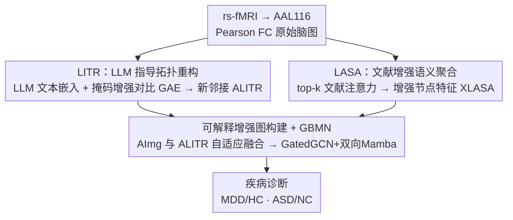

# IEBGL:An Interpretability-Enhanced Brain Graph Learning Framework with LLM-Instructed Topology and Literature-Augmented Semantics

**会议**: CVPR 2026  
**论文**: [CVF Open Access](https://openaccess.thecvf.com/content/CVPR2026/html/Duan_IEBGLAn_Interpretability-Enhanced_Brain_Graph_Learning_Framework_with_LLM-Instructed_Topology_and_CVPR_2026_paper.html)  
**代码**: https://github.com/CxImgLab/IEBGL  
**领域**: 医学图像 / 脑网络 / 图神经网络  
**关键词**: 脑图学习, rs-fMRI, 大语言模型, 文献增强, 可解释性

## 一句话总结
IEBGL 把"大模型推理"和"生物医学文献语义"两路外部知识注入 rs-fMRI 脑图：用 LLM 重构脑区连接拓扑、用文献嵌入增强脑区节点特征，再交给图-双向 Mamba 网络做抑郁症 / 自闭症诊断，在准确率提升的同时还能把异常脑区和相关文献对应起来，给出可解释的诊断依据。

## 研究背景与动机

**领域现状**：静息态功能磁共振（rs-fMRI）把脑区当节点、功能连接当边，构成"脑图"，再用图神经网络（GNN）做脑疾病诊断（抑郁症 MDD、自闭症 ASD），已是主流范式。

**现有痛点**：几乎所有方法只吃影像数据。节点特征通常直接取脑区与其它脑区的功能连接（FC）相关向量，缺少脑区的生物学 / 认知语义；邻接矩阵则靠 ROI 之间的统计相关性搭建，只反映"信号像不像"，不反映脑区之间真实的语义关系。结果是表达能力受限，更要命的是**可解释性差**——模型说某个连接重要，临床医生却无从知道为什么。

**核心矛盾**：脑图建模需要的"先验"——脑区是干什么的、哪些脑区在某种疾病里会一起出问题——这些知识大量沉淀在神经科学文献和专家经验里，却没法从纯相关性数据里学出来。也就是节点语义先验和拓扑语义先验同时缺失。

**本文目标**：在不引入额外标注的前提下，把外部医学知识同时注入脑图的两个层面——拓扑结构（边）和节点特征（点），并让注入过程本身可被解释。

**切入角度**：作者观察到 LLM 已经吸收了海量神经科学知识，可以"回答"某个脑区在某疾病下的异常表现和强关联脑区；同时 PubMed 文献提供了脑区-疾病的语义证据。两者正好补上缺失的两类先验。

**核心 idea**：用 LLM 指导脑区连接拓扑的重构（LITR），用文献语义聚合增强脑区节点表示（LASA），融合成"可解释增强脑图"后送进图双向 Mamba 网络做分类。

## 方法详解

### 整体框架
每个被试表示为脑图 $G=(V, A_{Img}, X_{Img})$：$V$ 是按 AAL116 图谱划分的 116 个脑区，$A_{Img}$ 是 Pearson 相关算出的功能连接矩阵，$X_{Img}$ 是每个脑区的连接向量。IEBGL 在这张原始脑图之上并行接两条外部知识增强支路——LITR 改造边（拓扑）、LASA 改造点（节点特征），再把两者融合成可解释增强图 $G_{Enhanced}$，交给 GBMN（GatedGCN + 双向 Mamba 双分支）输出 MDD/HC 或 ASD/NC 的诊断。

### 关键设计

**1. LITR：用 LLM 把"脑区知识"灌进拓扑结构**

针对邻接矩阵只有统计相关、没有语义先验的痛点，LITR 分两步重构拓扑。第一步是"取知识"：作者依据临床专家建议和 NeuroQuery 术语映射，为每个脑区设计一组结构化认知提示 $Q=\{q_1,\dots,q_m\}$（覆盖解剖、功能、病理三个维度），让 LLM（ChatGPT-4o）生成描述文本 $Resp_i = \text{LLM}(v_i, Q)$，再用预训练文本编码器编成固定维节点特征 $X_{LLM}$，与原 FC 矩阵 $A_{Img}$ 组成 LLM 先验图 $G_{LLM}=(V, A_{Img}, X_{LLM})$。

第二步是"炼拓扑"：用一个带掩码增强对比学习的图自编码器（GAE）来隐式优化连接结构。对原图做两类扰动得到两个增强视图——节点随机掩码（按概率 $p$ 把节点特征维度置为全节点均值 $\mu$：$\tilde{x}_i = Mask_i \odot x_i + (1-Mask_i)\odot\mu$）和边扰动（对上三角施加对称伯努利掩码 $\tilde{A}=A\odot M/(1-\gamma)$）。两视图喂入两层 GCN 编码器得到隐表示 $Z_i$，对被掩码节点做 re-mask（替成可学习 mask token 再从邻居聚合）得到 $\tilde{H}_i$，解码器通过可学习双线性映射 $A_{LITR}=\sigma(\tilde{H}_i W \tilde{H}_i^\top)$ 重构出优化后的加权邻接。这样 $A_{LITR}$ 同时编码了 LLM 语义先验和拓扑结构，而对比 + 重构双目标保证了它对噪声和缺失的鲁棒性。LITR 单独预训练后冻结，不再参与后续更新。

**2. LASA：用生物医学文献语义增强脑区节点表示**

针对节点特征缺少认知语义的痛点，LASA 把疾病相关文献当外部长期记忆，aggregate 进节点。先为目标疾病选取 $M$ 篇高相关论文，每篇用"标题+摘要"拼成语义序列，经预训练文本编码器（BERT，全词掩码预训练）编成文献语义矩阵 $X_{DOC}\in\mathbb{R}^{M\times d_t}$。

聚合靠一个"文献增强节点聚合"机制：先把影像节点特征 $X_{Img}$ 和文献矩阵 $X_{DOC}$ 用可学习线性投影 $F_{align}$ 对齐到同一语义空间（得到 query $Q$、key $K$），用缩放点积注意力算每个脑区对全部文献的相似度、温度由节点特征均值控制；再为每个脑区**只选 top-k 篇最相关文献**得到精简相似矩阵 $\alpha\in\mathbb{R}^{N\times k}$。在此之上引入节点级语义调制矩阵 $W$，把相似度和调制权重结合成最终注意力分布 $\tilde{\alpha}=\text{softmax}(\alpha\odot W)$（约束 $\sum_j W_{ij}=1, W_{ij}\ge0$）。聚合文献特征 $R_T=\tilde{\alpha}\cdot K^{(k)}$ 后与 $Q$ 拼接送入融合 MLP：$X_{LASA}=\text{MLP}_{fusion}([Q;R_T])$。这样每个脑区的表示都被它最相关的几篇文献"加注"，既增强表达力，也天然给出"该脑区依据哪些文献"的可解释线索。

**3. 可解释增强图构建 + GBMN 诊断**

LITR 给出语义拓扑 $A_{LITR}$、LASA 给出语义节点 $X_{LASA}$，二者需要和原始影像信息融合而非替换。邻接用可学习参数自适应融合：$A_{Fused}=\alpha A_{Img}+(1-\alpha)A_{LITR}$，其中 $\alpha=\sigma(\theta)$ 保证在合理数值区间，让模型自己权衡"信号相关"和"LLM 语义"两类拓扑。融合后的可解释增强图 $G_{Enhanced}=(V, A_{Fused}, X_{LASA})$ 送进 GBMN：GatedGCN 分支捕获局部拓扑特征，双向 Mamba 分支用状态空间模型从正反两个方向捕获长程依赖，二者互补给出最终分类。

### 损失函数 / 训练策略
两阶段训练。LITR 先独立预训练成图自编码器，损失为重构损失 + 对比损失：$L_{LITR}=L_{rec}+\beta L_{cl}$（$L_{rec}$ 用 MSE 保拓扑，$L_{cl}$ 用 InfoNCE 在两个增强视图间拉对应节点的一致性，温度 $\tau=0.5$，$\beta=0.2$），训完冻结。主训练阶段，LASA 加 L1 稀疏约束（让每个脑区只关联少量文献）和熵正则（防止只盯几篇）：$L_{LASA}=\lambda_1\sum_i\|W_i\|_1+\lambda_2(-\sum_i\sum_j\tilde{\alpha}_{ij}\log\tilde{\alpha}_{ij})$，$\lambda_1=10^{-3},\lambda_2=0.1$；分类用交叉熵 $L_{cls}$。总损失 $L_{total}=L_{cls}+L_{LASA}$。AAL116 图谱、200 时间点、5 折交叉验证、RTX 4090、Adam（lr=0.001）、batch 16、200 epoch、top-k=5、融合系数初始化 0.5。

## 实验关键数据

### 主实验
两个真实 rs-fMRI 数据集：REST-meta-MDD（2428 被试，1300 MDD + 1128 NC，配 35,133 篇抑郁文献）、ABIDE（1035 被试，530 ASD + 505 NC，配 32,617 篇自闭文献）。对比 11 个方法（GCN/GIN/GraphSAGE/Graphormer 等经典 GNN，以及 BrainGNN、STAGIN、BrainNetTF、Graph-Mamba、MGNN、SK-GNN 等脑图 SOTA；其中只有 SK-GNN 同样用了文献数据）。指标含 ACC/PRE/SEN/SPE/F1/AUC，并对 IEBGL 与每个对比方法做 t 检验（`*` 表示 $p<0.05$ 显著）。

| 数据集 | 指标 | IEBGL | 次优(SOTA) | 提升 |
|--------|------|-------|-----------|------|
| MDD | ACC | 79.93 | 75.42 (BrainNetTF) | +4.51 |
| MDD | AUC | 84.22 | 82.47 (BrainGNN) | +1.75 |
| MDD | F1 | 75.31 | 73.44 (BrainNetTF) | +1.87 |
| ABIDE | ACC | 81.43 | 78.46 (Graph-Mamba) | +2.97 |
| ABIDE | AUC | 83.92 | 81.48 (SK-GNN) | +2.44 |
| ABIDE | F1 | 80.22 | 78.57 (SK-GNN) | +1.65 |

注：以上"提升"按论文口径相对各指标次优方法计算；ACC 提升（MDD +4.51 / ABIDE +2.97）为论文正文重点强调的数字。相比同样用文献的 SK-GNN，IEBGL 在各指标上均有明显领先。

### 消融实验
作者从"知识层"和"模块层"两个角度消融（AUC/ACC）：

| 配置 | MDD ACC | ABIDE ACC | 说明 |
|------|---------|-----------|------|
| w/o Both | 73.66 | 74.27 | 去掉 LITR+LASA，原始脑图直接进 GBMN |
| w/o LASA | 74.33 | 75.32 | 只去文献语义增强 |
| w/o LITR | 76.88 | 76.41 | 只去 LLM 拓扑重构 |
| rpl. LASA | 77.89 | 79.28 | top-k 语义调制换成均值池化 |
| rpl. LITR | 77.44 | 80.32 | 对比学习换成普通 GAE |
| rpl. GBMN | 76.58 | 79.24 | GBMN 换成普通 GIN 分类器 |
| IEBGL (full) | 79.93 | 81.43 | 完整模型 |

### 关键发现
- **两路外部知识都是真贡献**：去掉任一模块（w/o LASA / w/o LITR）都明显掉点，去掉两者（w/o Both）掉得最狠（MDD ACC 73.66 vs 79.93），说明 LLM 拓扑先验和文献语义先验是互补而非冗余。
- **"换法"消融验证设计精度**：把 LASA 的 top-k 语义调制退化成均值池化、把 LITR 的对比学习退化成普通 GAE、把 GBMN 换成 GIN，三种变体都比完整模型差，说明节点级语义调制、掩码对比预训练、双向 Mamba 主干各自有效。
- **可解释性可落地**：基于梯度归因找出 top-10 影响脑区（如 PCUN.R、OLF.R、SMA.L），LASA 自动为每个脑区检索最相关文献并给权重——PCUN.R（默认模式网络）对应 MDD 自我参照受损文献，OLF.R 对应抑郁嗅觉功能障碍文献，生物学上自洽；LITR 还能显示干预前后功能连接变化（如 PHG.L↔CRBL45.R 连接增强，符合情绪-记忆与认知-情感网络协同的神经影像证据）。

## 亮点与洞察
- **把 LLM 当"拓扑先验生成器"而不是分类器**：LITR 不是让 LLM 直接判病，而是用它生成脑区描述文本→编码成节点特征→再经对比 GAE 炼成新邻接，把"语言知识"翻译成"图结构"，这个间接用法比直接 prompt 诊断更稳健也更可控。
- **可解释性是"内生"的而非事后解释**：因为节点特征本身来自文献语义、每个脑区只关联 top-k 篇文献（L1+熵正则保证稀疏且多样），所以"哪篇文献支撑了这个脑区的判断"是模型结构自带的，不需要额外的 post-hoc 解释器。
- **可迁移点**：文献增强节点聚合（top-k 检索 + 语义调制 + 稀疏/熵正则）是一个通用的"把领域文献注入图节点"模板，可迁移到任何"节点有现成领域语料"的图任务（如分子图配药物文献、知识图谱配百科）。

## 局限与展望
- LITR 依赖 LLM（ChatGPT-4o）对脑区知识的回答质量，LLM 幻觉或过时知识会直接污染拓扑先验；论文未系统评估 LLM 选择 / 错误回答对结果的影响。⚠️
- 文献库按疾病关键词检索（如"Depression"+"fMRI"），检索召回的相关性、文献时效与质量直接影响 LASA，但论文未做文献噪声鲁棒性分析。
- 只在 MDD、ASD 两类二分类、AAL116 单一图谱上验证；跨图谱、跨疾病、多分类的泛化性未知。
- LITR 需要独立预训练 + 冻结，整体是两阶段流程，端到端联合优化是否更好、训练成本如何，论文未深入讨论。

## 相关工作与启发
- **vs SK-GNN**：SK-GNN 同样引文献知识，但靠拓扑/知识掩码 + Gumbel-Softmax 端到端选语义片段；IEBGL 把知识拆成"LLM 改拓扑（LITR）+ 文献改节点（LASA）"两条显式支路，并加自适应融合，在 MDD/ABIDE 上全面优于 SK-GNN。
- **vs BrainGNN / BrainNetTF / Graph-Mamba**：这些只用影像数据，靠更复杂的池化、Transformer 或 Mamba 结构提升判别力；IEBGL 主打"注入外部知识 + 可解释"，在纯影像 SOTA 之上再加先验，诊断与解释双赢。
- **vs MGNN / LSAP**：MGNN 引脑模块先验、LSAP 用热核扩散缓解过平滑，都是结构/数值层面的先验；IEBGL 的先验来自 LLM 和文献的语义层面，与它们正交、可叠加。

## 评分
- 新颖性: ⭐⭐⭐⭐⭐ 首个把 LLM 拓扑重构与文献语义聚合双路注入 rs-fMRI 脑图、且解释内生于结构的框架
- 实验充分度: ⭐⭐⭐⭐ 两数据集 + 11 对比 + 知识/模块双层消融 + 显著性检验扎实，但仅二分类、单图谱、缺 LLM/文献噪声鲁棒性分析
- 写作质量: ⭐⭐⭐⭐ 模块职责清晰、公式完整、可解释性案例具体，符号略密
- 价值: ⭐⭐⭐⭐ 给"知识增强 + 可解释脑疾病诊断"提供了可复用范式，临床可解释性是实打实的加分项

<!-- RELATED:START -->

## 相关论文

- [\[CVPR 2026\] Bridging Brain and Semantics: A Hierarchical Framework for Semantically Enhanced fMRI-to-Video Reconstruction](bridging_brain_and_semantics_a_hierarchical_framework_for_semantically_enhanced_.md)
- [\[CVPR 2026\] From Panel to Pixel: Zoom-In Vision-Language Pretraining from Biomedical Scientific Literature](from_panel_to_pixel_zoom-in_vision-language_pretraining_from_biomedical_scientif.md)
- [\[CVPR 2026\] Virtual Nodes Guided Dynamic Graph Neural Network for Brain Tumor Segmentation with Missing Modalities](virtual_nodes_guided_dynamic_graph_neural_network_for_brain_tumor_segmentation_w.md)
- [\[CVPR 2026\] MedTVT-R1: A Multimodal LLM Empowering Medical Reasoning and Diagnosis](medtvt-r1_a_multimodal_llm_empowering_medical_reasoning_and_diagnosis.md)
- [\[CVPR 2026\] GIIM: Graph-based Learning of Inter- and Intra-view Dependencies for Multi-view Medical Image Diagnosis](giim_graphbased_learning_of_inter_and_intraview_de.md)

<!-- RELATED:END -->
