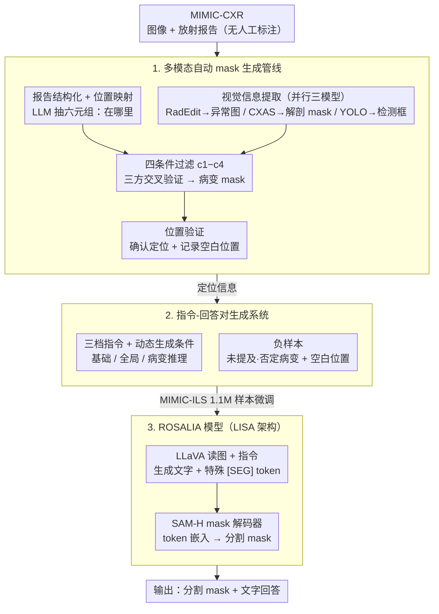

# Instruction-Guided Lesion Segmentation for Chest X-rays with Automatically Generated Large-Scale Dataset

**会议**: CVPR 2026  
**arXiv**: [2511.15186](https://arxiv.org/abs/2511.15186)  
**代码**: [GitHub](https://github.com/checkoneee/ROSALIA)  
**领域**: 医学图像  
**关键词**: 胸部X光, 病变分割, 指令引导, 自动数据集构建, 视觉语言模型

## 一句话总结

提出指令引导的胸部X光病变分割任务（ILS），构建了首个大规模自动生成的指令-回答数据集MIMIC-ILS（1.1M样本、192K图像、91K mask），并训练ROSALIA模型实现gIoU 71.2%和空目标准确率91.8%，远超现有通用和医学分割模型。

## 研究背景与动机

胸部X光（CXR）是最常见的医学影像检查之一，病变定位和边界识别是放射科医生的核心工作，但这一过程劳动密集且需要高度临床专业知识。

现有CXR病变分割面临两大瓶颈：
1. **标注规模有限**：现有数据集（VinDr-CXR 15K图像、SIIM-ACR 13K图像）依赖专家手动标注，规模受限且多数仅提供bounding box或单一病变类型mask
2. **用户输入门槛高**：已有文本引导分割方法要求用户提供专家级的详细描述（如"双侧肺部感染，两个感染区域…"），非专业用户无法使用

核心矛盾：如何在无人工标注的情况下大规模生成高质量的病变mask和指令-回答对，且支持简单易用的用户指令？

本文切入角度：利用MIMIC-CXR中现有的图像-报告配对数据，通过多模态自动化pipeline从影像和报告中提取空间信息和文本信息，生成全自动标注的大规模ILS数据集。

## 方法详解

### 整体框架

这篇论文要解决的是：在没有任何人工标注的前提下，把胸部X光（CXR）的病变分割数据集做到百万量级，并训练出一个听得懂自然语言指令的分割模型。它的关键观察是，MIMIC-CXR 里已经有大量「图像 + 放射报告」的配对——报告里其实写明了"哪里有什么病变"，只是这些文字信息从未被转成像素级 mask。

整条流水线因此分成两段：先用一套全自动管线从「图像 + 报告」里挖出病变 mask（定位阶段），再基于这些定位信息批量合成「指令-回答」训练对（数据阶段），最后用合成数据微调出分割模型 ROSALIA。ROSALIA 本身沿用 LISA 架构，把视觉语言模型（LLaVA）和分割模型（SAM）端到端接在一起，用户给一句话指令，它就吐出 mask 加文字回答。

### 关键设计

**1. 多模态自动 mask 生成管线：在零人工标注下从图像+报告交叉验证出病变 mask**

最大的痛点是数据集规模——专家逐张勾边只能做到一两万张，而报告里的文字「右肺下叶肺炎」并不能直接变成 mask。管线的做法是让文本、视觉异常、检测框三路信息互相印证。第一步先用 LLM 把报告里的每条异常描述结构化成六元组（实体、句子索引、存在性、确定性、位置、病变类型），并把口语化的位置词映射到标准解剖标签，于是「在哪里」有了文本答案。第二步并行跑三个视觉模型补上像素证据：RadEdit 是扩散模型，它生成一张「假装没病变」的正常 CXR，再与原图做差得到异常图 $\mathcal{A}$，回答「哪里看起来不正常」；CXAS 给出解剖分割 mask $\{\mathcal{M}_i\}$，框定每个器官的范围；YOLO 检测病变得到候选框 $\{\mathcal{B}_j\}$，提供粗略「界限」。

$$\mathcal{A} = |\,I_{\text{orig}} - I_{\text{normal}}\,|$$

第三步是质量闸门：每个候选框要同时通过四条件过滤——与报告指定解剖区域的重叠 c1、检测置信度 c2、框内异常信号占比 c3、最小尺寸 c4，只有四项都达标才保留，再提取与该框相交的连通区域并精炼成最终 mask。第四步做位置验证，确认 mask 落点和报告描述一致，顺便把报告里干净、无病变的区域记下来留作负样本。这套「文本说在哪、异常图说不正常在哪、检测框说边界在哪」的三方交叉，加上四条件硬过滤，是它能在无人工标注下把假阳性压下去、做出经专家评估 96.4% 接受率数据的关键。

**2. 指令-回答对生成系统：把定位信息翻译成覆盖不同用户水平的训练样本**

有了 mask 还不够，要训练一个听指令的模型，就得有大量风格各异、又彼此自洽的「指令-回答」对。这里设计了三档指令来覆盖从专业到外行的需求：基础指令同时给病变类型和位置（"分割右肺的肺炎"），只在 mask 成功定位时才生成；全局指令只给病变类型（"分割不透明影"），更宽松，但仅当定位位置与报告位置完全一致时才放行，避免漏掉同类型的其他病灶；病变推理指令则把肺炎/肺不张/水肿统一替换成"opacity"，逼模型自己判断这块 opacity 到底是哪种病变。

关键不是列三种类型，而是每种都带一个「动态生成条件」——定位失败就不生成基础指令、位置不完全吻合就不生成全局指令——这样合成出来的样本天然自洽，不会出现「指令说右肺、mask 在左肺」这类污染。负样本则靠报告里未提及或被明确否定的病变类型，以及那些验证过的空白位置来构造，让模型学会回答「这里没有你说的病变」。

**3. ROSALIA 模型架构：把分割问题改写成 VLM 生成一个特殊 token**

要让模型既理解自由文本指令、又输出像素 mask，ROSALIA 沿用 LISA-7B 的思路：VLM（LLaVA）读入图像和指令，在生成文本回答的同时吐出一个特殊的 `[SEG]` token；这个 token 的隐藏嵌入被送进 SAM-H 的 mask 解码器，转成最终的分割 mask。分割任务因此被「借壳」成语言生成任务，定位与文字描述在同一前向里完成。它真正的杠杆在数据而非结构——同样的架构在通用数据上 gIoU 只有 8.3%，换上 MIMIC-ILS 微调后直接跳到 71.2%，印证了这类任务里特定领域数据比模型规模更值钱。训练时对 VLM 做 LoRA 微调（rank=128, alpha=256）、对 mask 解码器全量微调，跑 15 个 epoch，AdamW，batch size 256，正负样本按 1:1 配比。

### 损失函数 / 训练策略

$$\mathcal{L} = \lambda_{txt}\mathcal{L}_{txt} + \lambda_{bce}\mathcal{L}_{bce} + \lambda_{dice}\mathcal{L}_{dice}$$

- $\mathcal{L}_{txt}$：自回归交叉熵损失（文本生成），$\lambda_{txt}=0.5$
- $\mathcal{L}_{bce}$：二元交叉熵损失（分割），$\lambda_{bce}=5$
- $\mathcal{L}_{dice}$：DICE损失（分割，仅对正样本计算），$\lambda_{dice}=1$

## 实验关键数据

### 主实验

| 模型 | gIoU | cIoU | N-Acc. | 说明 |
|------|------|------|--------|------|
| LISA-7B | 8.3% | 12.8% | 0.7% | 通用域 |
| LISA-13B | 8.9% | 12.2% | 0.0% | 通用域 |
| Text4Seg | 6.1% | 10.3% | 20.6% | 通用域 |
| BiomedParse | 23.8% | 18.5% | 0.6% | 医学域 |
| RecLMIS | 22.4% | 19.5% | 0.0% | 医学域 |
| **ROSALIA (Ours)** | **71.2%** | **75.6%** | **91.8%** | MIMIC-ILS训练 |

### 各病变类型性能

| 病变类型 | gIoU | cIoU | N-Acc. |
|---------|------|------|--------|
| 心脏肥大 | 89.0% | 89.0% | 85.8% |
| 肺炎 | 57.2% | 60.4% | 97.1% |
| 肺不张 | 60.2% | 58.7% | 91.7% |
| 不透明影 | 60.5% | 64.2% | 85.0% |
| 实变 | 61.9% | 65.6% | 91.2% |
| 水肿 | 64.8% | 66.6% | 92.2% |
| 胸腔积液 | 60.3% | 59.6% | 90.4% |

### 消融实验 — 数据集质量评估

| 专家 | 总接受率 | 正样本接受率 | 负样本接受率 |
|------|---------|-------------|-------------|
| 专家A | 96.1% | 95.6% | 96.5% |
| 专家B | 97.2% | 96.0% | 98.3% |
| 专家C | 98.7% | 99.8% | 97.8% |
| 专家D | 97.6% | 96.9% | 98.2% |
| **总体** | **96.4%** | 90.1% | 97.7% |

### 关键发现

- 现有通用/医学域分割模型在ILS任务上系统性失败，gIoU低于24%且几乎无法处理空目标场景（N-Acc接近0）
- 全自动生成的数据集经4位放射肿瘤科专家评估，整体接受率高达96.4%
- 文本回答准确率94.4%，其中基础指令96.8%最高，病变推理指令84.8%有提升空间
- 心脏肥大分割最好（gIoU 89.0%），因为使用心脏mask作为标注；肺炎等局部病变稍低

## 亮点与洞察

- 全自动数据集构建pipeline是核心贡献，通过多模态交叉验证实现了媲美人工标注的质量
- ILS任务定义具有临床实用性：支持简单指令而非专家级描述，且支持空目标检测（"没有发现病变"）
- 数据集规模（1.1M样本）是现有CXR分割数据集的10-100倍
- RadEdit用于生成异常图的方法很巧妙——用扩散模型生成"正常"图像，通过差分定位异常区域

## 局限与展望

- 自动标注质量：正样本接受率90.1%低于负样本的97.7%，正样本标注的精度仍需提升
- 仅覆盖7种主要病变类型，CXR中还有更多细粒度异常
- 病变推理任务（opacity→具体类型）准确率75.1%相对较低
- pipeline依赖RadEdit、CXAS、YOLO三个预训练模型，任一模型失效会影响整体质量
- 仅在MIMIC-CXR上验证，不同机构的CXR风格差异可能影响泛化

## 相关工作与启发

- **vs BiomedParse**: 虽然是医学域模型但仅支持类标签prompt，无法处理指令级输入和空目标检测
- **vs RecLMIS**: 需要用户提供专家级描述（"双侧肺部感染…"），使用门槛高
- **vs LISA**: ROSALIA基于LISA架构但在MIMIC-ILS上微调后性能从8.3%跃升至71.2%，证明了任务特定数据的重要性

## 评分

- 新颖性: ⭐⭐⭐⭐ 全自动数据集构建pipeline和ILS任务定义均有创新
- 实验充分度: ⭐⭐⭐⭐ 多种基线对比、分病变类型评估、专家质量验证，但缺少跨数据集泛化实验
- 写作质量: ⭐⭐⭐⭐ 问题定义清晰，pipeline描述详细，图表丰富
- 价值: ⭐⭐⭐⭐⭐ 数据集规模和公开的代码/数据对社区有很高的实用价值

<!-- RELATED:START -->

## 相关论文

- [\[NeurIPS 2025\] CXReasonBench: A Benchmark for Evaluating Structured Diagnostic Reasoning in Chest X-rays](../../NeurIPS2025/medical_imaging/cxreasonbench_a_benchmark_for_evaluating_structured_diagnostic_reasoning_in_ches.md)
- [\[ICCV 2025\] GEMeX: A Large-Scale, Groundable, and Explainable Medical VQA Benchmark for Chest X-ray Diagnosis](../../ICCV2025/medical_imaging/gemex_a_large-scale_groundable_and_explainable_medical_vqa_benchmark_for_chest_x.md)
- [\[AAAI 2026\] Small but Mighty: Dynamic Wavelet Expert-Guided Fine-Tuning of Large-Scale Models for Optical Remote Sensing Object Segmentation](../../AAAI2026/medical_imaging/small_but_mighty_dynamic_wavelet_expert-guided_fine-tuning_of_large-scale_models.md)
- [\[ECCV 2024\] CheX: Interactive Localization and Region Description in Chest X-rays](../../ECCV2024/medical_imaging/chex_interactive_localization_and_region_description_in_chest_x-rays.md)
- [\[CVPR 2026\] LEMON: A Large Endoscopic MONocular Dataset and Foundation Model for Perception in Surgical Settings](lemon_a_large_endoscopic_monocular_dataset_and_foundation_model_for_perception_in.md)

<!-- RELATED:END -->
