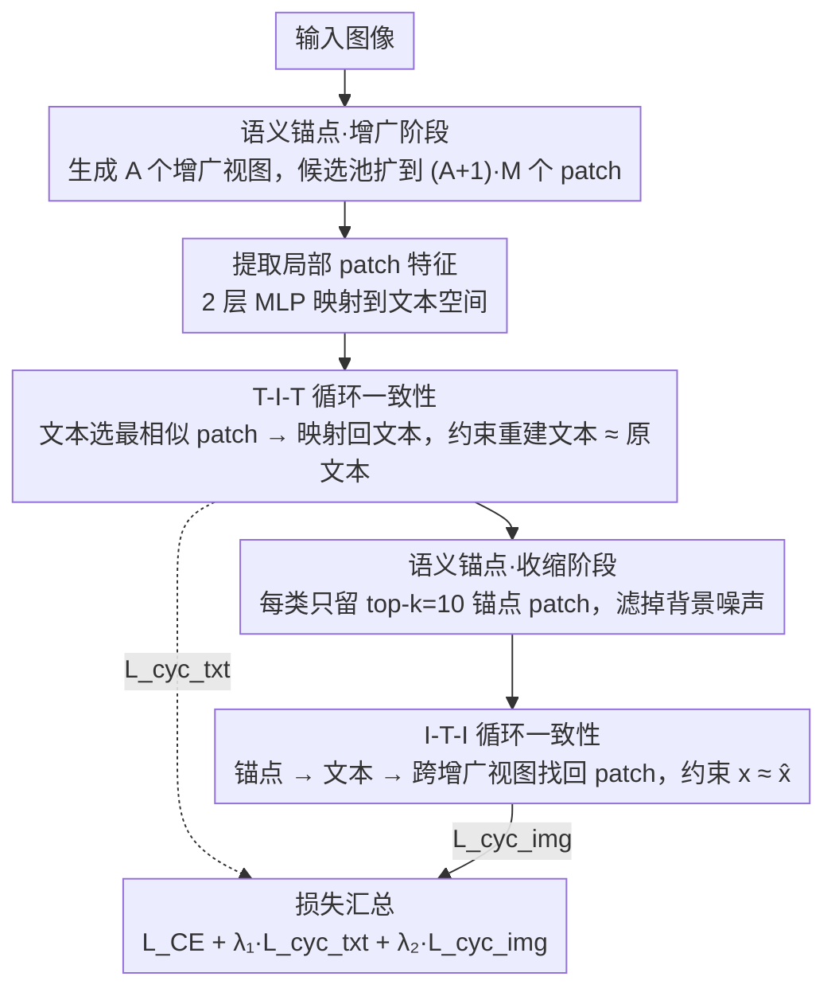

# Interpretable Cross-Domain Few-Shot Learning with Rectified Target-Domain Local Alignment

**会议**: CVPR 2026  
**arXiv**: [2603.17655](https://arxiv.org/abs/2603.17655)  
**代码**: [CC-CDFSL](https://github.com/zyaz/CC-CDFSL)  
**领域**: 医学图像  
**关键词**: 跨域少样本学习, CLIP, 局部特征对齐, 循环一致性, 可解释性

## 一句话总结

发现并解决了 CLIP 在跨域少样本学习（CDFSL）中的局部特征对齐退化问题，提出基于循环一致性的 CC-CDFSL 框架，通过 T-I-T 和 I-T-I 双向循环路径和语义锚点机制改善 patch 级视觉-语言对齐，同时增强模型的可解释性。

## 研究背景与动机

CLIP 等视觉-语言模型为跨域少样本学习提供了强大基础，但存在关键问题：在目标域微调后，模型难以聚焦于细粒度视觉线索（如肺部X光中的磨玻璃影、局部结节等）。作者发现，虽然 CLIP 在源域可以粗略覆盖所有重要区域，但跨域后局部 patch 特征与文本特征的对齐退化远比全局特征严重。

定量验证：测量全局对齐分数 $\text{A}_g$ 和局部对齐分数 $\text{A}_l$，发现跨域任务中 $\text{A}_l$ 的下降显著大于 $\text{A}_g$，证实域差距和稀缺数据对局部特征对齐的伤害更大。

这在医学诊断等需要细粒度识别的下游领域尤为关键——例如肺炎的微妙纹理或密度变化仅出现在少量 patch 中，模型的 heatmap 却只能粗略勾画身体轮廓。

## 方法详解

### 整体框架

这篇论文要解决的是 CLIP 跨域微调后局部对齐退化的问题：模型只盯着身体轮廓，看不到真正决定诊断的细粒度病灶。作者的思路是不引入任何 patch 级标注，而是借两条"绕一圈还能回到自己"的循环路径，把局部视觉特征重新锚到正确的文本语义上。一张图进来后，先由语义锚点（SA）模块的**增广阶段**把 patch 候选池吹大，文本侧循环 T-I-T 在这个大池子上施加第一重双向一致性约束；随后 SA 的**收缩阶段**从池子里筛出每类最相关的锚点 patch，图像侧循环 I-T-I 再在这些干净锚点上施加第二重约束。也就是说 SA 的两个阶段分别夹在两条循环之前，两条循环产生的正则项叠加到标准交叉熵损失上一起训练。

### 关键设计

**1. T-I-T 循环一致性：让文本特征在 patch 空间里绕一圈还能回到自己**

跨域后最受伤的是 patch 级对齐，而少样本场景又拿不到 patch 级标注，没法直接监督"这块区域对应哪个语义"。T-I-T 借翻译里的循环一致性来绕开这个困境：对每个类别文本特征 $\mathbf{T}_j$，先在所有 patch 中挑出相似度最高的那个 $\mathbf{L}_j^* = \mathbf{L}_{\arg\max_i \mathbf{D}_{j,i}^{txt}}$，再把这个 patch 映射回文本空间、找到与它最近的文本 $\mathbf{T}_j^{rec}$，然后要求绕一圈回来的 $\mathbf{T}_j^{rec}$ 仍然接近出发点 $\mathbf{T}_j$：

$$\mathcal{L}_{\text{cyc\_txt}} = 1 - \frac{1}{C}\sum_{j=1}^{C}\text{sim}(\mathbf{T}_j, \mathbf{T}_j^{rec})$$

道理和"一句话译成英文再译回中文应当不变"一样——只有当文本真正命中了语义对应的 patch、且这个 patch 又能唯一地指回原文本时，循环才闭合。这样不花一个标注就给局部对齐加上了自监督信号。

**2. 语义锚点：先把候选 patch 池吹大、再收缩去噪**

视觉模态信息比文本丰富得多，但也夹带大片无关背景——直接拿全部 patch 去做循环，正常皮肤、空白卫星地块这些噪声区域会把对齐带偏。SA 用一增一缩两步整理这个池子：增强阶段对每张图生成 $A$ 个增广视图，把候选 patch 拼成更大的池子 $\mathbf{X}_{aug} \in \mathbb{R}^{((A+1) \cdot M) \times d}$；收缩阶段再为每个类别只保留与该类文本最相似的 top-$k$（$k=10$）个 patch 当作语义锚点 $\mathbf{X}_{anchor}$。举个具体的：一张皮肤镜图切成 $M$ 个 patch，配上增广视图后候选涨到 $(A+1)\cdot M$ 个，SA 按与类文本的相似度排序，只留下命中病灶纹理的那 10 个，把大片正常皮肤背景筛掉。这一增一缩各有分工——增广给 T-I-T 提供足够多样的候选，收缩给 I-T-I 留下干净的核心语义。

**3. I-T-I 循环一致性：从锚点 patch 出发绕文本一圈、再跨视图找回来**

只靠文本侧循环还不够，模型对输入变换（旋转、翻转）的稳健性没有被约束到。I-T-I 把循环方向反过来跑：对每个锚点 $\mathbf{x}_n$ 先找最相似的文本 $t_n$，再用 $t_n$ 到增强视图空间里检索最相似的 patch $\hat{\mathbf{x}}_n$，要求 $\mathbf{x}_n \approx \hat{\mathbf{x}}_n$。关键在于这一步是**跨视图**检索（去别的增广视图里找回来，而不是在原图内找），等于强迫同一语义在不同几何变换下都能被同一段文本牵回来，从而把对齐做得对旋转翻转鲁棒。

### 损失函数 / 训练策略

$$\mathcal{L}_{total} = \mathcal{L}_{CE} + \lambda_1 \mathcal{L}_{\text{cyc\_txt}} + \lambda_2 \mathcal{L}_{\text{cyc\_img}}$$

- $\lambda_1 = 3.0$, $\lambda_2 = 2.0$（ISIC 上 grid search 确定）
- $k=10$（锚点 patch 数量），固定于所有实验
- ViT-Base/16 CLIP backbone，100 epochs 微调，单卡 RTX 4090
- 2 层 MLP 将局部 patch 特征变换到文本特征空间

## 实验关键数据

### 主实验

| 数据集 | 任务 | CLIP-LoRA | CLIP-LoRA + Ours | 提升 |
|--------|------|-----------|-----------------|------|
| ISIC (皮肤) | 5-way 1-shot | 35.23 | 38.13 | +2.90 |
| ChestX (胸片) | 5-way 1-shot | 21.73 | 22.21 | +0.48 |
| EuroSAT (卫星) | 5-way 1-shot | 81.49 | 86.07 | +4.58 |
| CropDisease | 5-way 1-shot | 85.11 | 88.91 | +3.80 |
| ISIC | 5-way 5-shot | 50.68 | **54.72** | **+4.04** |
| EuroSAT | 5-way 5-shot | 92.63 | **94.35** | **+1.72** |

### 消融实验

| 配置 | ISIC | ChestX | EuroSAT | Crop. | 平均 |
|------|------|--------|---------|-------|------|
| Baseline | 50.68 | 24.44 | 92.63 | 96.20 | 65.98 |
| + T-I-T | 51.13 | 25.15 | 93.79 | 96.37 | 66.61 |
| + T-I-T + SA | 54.30 | 25.35 | 94.33 | 96.95 | 67.73 |
| + I-T-I + SA | 53.81 | 25.14 | 93.83 | 97.01 | 67.45 |
| **Full (T-I-T + I-T-I + SA)** | **54.72** | **25.47** | **94.35** | **97.08** | **67.90** |

### 关键发现

- T-I-T 循环比 I-T-I 循环贡献更大（+0.63 vs +1.47 avg），因为 T-I-T 聚焦最语义相关的 patch 减少干扰
- SA 机制对两个循环都有显著提升（avg +1.12 和 +0.84）
- 跨视图检索策略 > 图内检索 > 全图检索，增强视图多样性是关键
- CC-CDFSL 作为即插即用模块，兼容 CoOp、CLIP-Adapter、Maple、CLIP-LoRA 等多种 PEFT 方法
- 在 base-to-new generalization 的 11 个数据集上也有提升，尤其在 EuroSAT (+3.6%)

## 亮点与洞察

- 首次发现并量化 CLIP 在 CDFSL 中局部对齐退化 > 全局对齐退化的现象
- 循环一致性从翻译任务引入 VLM 局部对齐是巧妙的自监督思路，无需额外标注
- SA 的"先增后缩"设计优雅地平衡了候选多样性和噪声过滤
- T-I-T 路径的可解释性：即使重建文本不完全匹配，也能揭示模型关注的病理区域和跨类别语义关系
- 方法作为正则项的设计使其具有出色的即插即用通用性

## 局限与展望

- 在 ChestX 数据集上提升有限（+0.48 / +1.03），可能因胸片语义更复杂
- $\lambda_1$, $\lambda_2$ 需要在目标域上调参，跨数据集的最优超参可能不同
- 增强视图生成的具体数据增强策略未详细说明
- 仅在 ViT 架构上验证，未扩展到其他视觉编码器
- 计算开销分析不足，增加的 patch 相似度计算可能影响训练效率

## 相关工作与启发

- CycleGAN (Liu et al. 2017) 的循环一致性思想被创造性地用于 VLM 局部对齐
- FG-CLIP (Xie et al. 2025) 等研究 CLIP 细粒度能力不足的问题
- CLIP-LoRA (Zanella & Ben Ayed 2024) 是最强基线，本文在此基础上平均提升 +2.94 (1-shot)

## 评分

- 新颖性: ⭐⭐⭐⭐ 问题发现精准，循环一致性用于 VLM 局部对齐的思路新颖
- 实验充分度: ⭐⭐⭐⭐⭐ 4 数据集 + 4 PEFT 方法 + 2 backbone + 详细消融，极为充分
- 写作质量: ⭐⭐⭐⭐ 逻辑严谨，可视化丰富，问题-观察-方案的叙事流畅
- 价值: ⭐⭐⭐⭐ 即插即用的通用框架，对医学影像等需要细粒度识别的少样本场景有重要意义

<!-- RELATED:START -->

## 相关论文

- [\[CVPR 2026\] Reclaiming Lost Text Layers for Source-Free Cross-Domain Few-Shot Learning](reclaiming_lost_text_layers_for_source-free_cross-domain_few-shot_learning.md)
- [\[CVPR 2026\] CoFiDA-M: Concept-Aware Feature Modulation for Cross-Domain Adaptation with Image-Only Inference](cofida-m_concept-aware_feature_modulation_for_cross-domain_adaptation_with_image.md)
- [\[CVPR 2026\] Cross-domain Dual-stream Feature Disentanglement for Brain Disorder Prediction with Sparsely Labeled PET](cross-domain_dual-stream_feature_disentanglement_for_brain_disorder_prediction_w.md)
- [\[AAAI 2026\] MPA: Multimodal Prototype Augmentation for Few-Shot Learning](../../AAAI2026/medical_imaging/mpa_multimodal_prototype_augmentation_for_few-shot_learning.md)
- [\[CVPR 2026\] SD-FSMIS: Adapting Stable Diffusion for Few-Shot Medical Image Segmentation](sd_fsmis_adapting_stable_diffusion_for_few_shot_medical_image_segmentation.md)

<!-- RELATED:END -->
