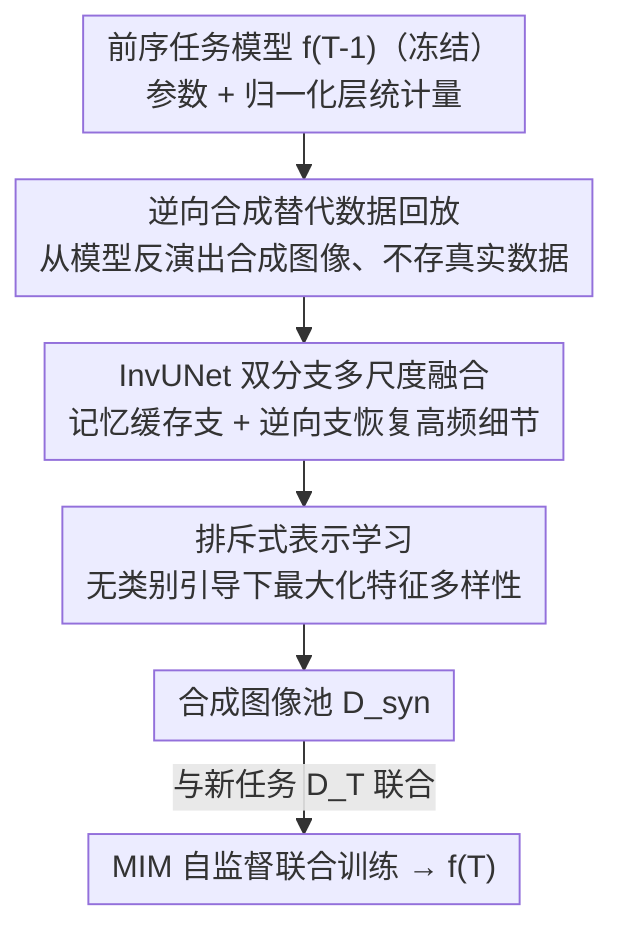

# InvCoSS: Inversion-driven Continual Self-supervised Learning in Medical Multi-modal Image Pre-training

**会议**: CVPR 2026  
**论文**: [CVF Open Access](https://openaccess.thecvf.com/content/CVPR2026/html/Luo_InvCoSS_Inversion-driven_Continual_Self-supervised_Learning_in_Medical_Multi-modal_Image_Pre-training_CVPR_2026_paper.html)  
**代码**: https://zihaoluoh.github.io/InvCoSS （项目页）  
**领域**: 医学图像 / 自监督 / 持续学习  
**关键词**: 持续自监督学习, 模型逆向, 灾难性遗忘, 数据无关, 医学多模态预训练

## 一句话总结
InvCoSS 用「模型逆向」从上一阶段的自监督模型里反演出合成图像，替代隐私敏感的真实数据回放缓冲，在不存任何原始数据的前提下做持续自监督预训练，九个医学下游任务上追平甚至超过数据回放方法，存储开销最多降低 590×。

## 研究背景与动机
**领域现状**：自监督学习（SSL）已成为医学图像分析的主流预训练范式，但当前模型大多局限于单模态（CT / X-ray / MRI 各练各的），跨模态泛化差。把多模态数据凑齐做联合训练成本高、还受隐私伦理约束，于是出现了「持续自监督学习」（CSSL）——让模型作为持续学习者，按 Report→X-ray→CT→MRI→Pathology 的顺序逐模态增量训练，避免一次性收集所有数据。

**现有痛点**：持续学习的老大难是灾难性遗忘——学新模态时会忘掉旧模态学到的知识。目前最有效、也最常用的缓解手段是数据回放（data replay），即把旧任务的真实数据存一部分、新阶段时混进来一起练（MedCoSS 就是这么做的）。但在医学场景，存旧病人的真实影像直接违反隐私与伦理审查，跨机构传输数据往往根本不被允许。

**核心矛盾**：要防遗忘就得「记住」旧数据分布，但出于隐私又「不能存」任何旧真实数据。两者直接冲突。

**本文目标**：在完全不访问旧真实数据（data-free）的前提下，把旧阶段模型里的知识最大限度保留下来，且只靠预训练本身得到的信息，不引入额外的 GAN / Diffusion 生成器或数据集蒸馏。

**切入角度**：作者从监督学习里的「模型逆向」（model inversion）得到启发——逆向技术能仅凭训练好的模型 checkpoint（参数 + 归一化层里存的统计量）重建出近似训练分布的合成图像。既然旧模型本身就编码了旧数据分布，那就让模型「吐出」合成图像来当回放缓冲，原始数据一张都不用存。

**核心 idea**：用「从旧自监督模型逆向合成的图像」替代「存下来的真实回放数据」，把 data-free 模型逆向第一次搬进自监督持续学习。

## 方法详解

### 整体框架
InvCoSS 把 CSSL 的标准回放流程做了一处关键替换：MedCoSS 在训练当前任务 $T$ 时需要一个装着旧真实数据的回放缓冲 $\mathcal{D}_{buff}$，InvCoSS 则在每个旧任务训练完后，冻结那一阶段的模型 $f_{T-1}$，用模型逆向从它的参数和归一化统计量里反演出合成图像池 $\mathcal{D}_{syn}$，再把这个合成池当作缓冲，与新任务真实数据 $\mathcal{D}_T$ 一起做掩码图像建模（MIM）联合训练，得到 $f_T$。整条链路里没有任何旧真实图像，只保留了模型参数和归一化统计量。

逆向合成这一步并非把低维噪声直接投影成图像（那样会丢高频细节），而是用一个专门设计的双分支生成器 InvUNet，并在逆向目标里叠加掩码重建、归一化统计匹配、图像先验与排斥式多样性约束四项联合优化。

### 关键设计

**1. 逆向合成替代数据回放：用模型「吐」出来的合成图像当 data-free 缓冲**

针对「防遗忘要记旧数据、隐私又不让存旧数据」这个核心矛盾，InvCoSS 不存任何真实图像，而是对每个旧任务 $t$ 求解逆向目标 $x_{syn}=\arg\min_{\hat{x}}[\mathcal{L}_{task}(\hat{x};f)+\mathcal{R}(\hat{x};f)]$，仅凭训练好的模型把噪声优化成近似旧训练分布的合成图像，聚成样本池 $\mathcal{B}_T=\bigcup_{t=1}^{T-1}\mathcal{D}_t^{syn}$。其中正则项 $\mathcal{R}$ 关键的一项是归一化统计匹配 $\mathcal{L}_{norm}$：它假设特征在批次上服从高斯分布，强制合成图像在各层归一化层上的批均值 $\mu_l$、批方差 $\sigma_l^2$ 去对齐训练时记录的运行平均 $E[\mu_l]$、$E[\sigma_l^2]$，从而把「旧数据长什么样」从统计量里逼出来。训练 $f_T$ 时直接用 $\mathcal{B}_T$ 顶替 MedCoSS 的真实缓冲，框架其余部分不变。这样既保住旧知识、又彻底规避隐私，且只需保存模型参数和归一化统计量，存储相比存 5% 真实数据最多省 590×。

**2. InvUNet：双分支多尺度融合生成器，专治自监督逆向的高频丢失**

把监督逆向直接搬到自监督会遇到第一个麻烦：低维噪声向量自底向上投影成高维图像时，高频细节严重退化，合成图像模糊失真。InvUNet 借鉴 U-Net 的多尺度融合思路，把噪声潜变量 $z$ 直接注入网络瓶颈处，形成信息瓶颈逼 $z$ 编码核心语义；再用两条互补分支分工：轻量的「记忆缓存支」（Memory Cache Branch）负责生成多尺度结构先验，主「逆向支」（Inversion Branch）专注高保真、语义引导的逆向。两分支间的跳连不只是传特征，更重要的是建立梯度通路——把误差信号回传给记忆缓存支，从而把细粒度高频细节有效恢复出来。这是把监督逆向迁到自监督、又同时支持 2D / 3D 模态的关键。

**3. 排斥式表示学习：无类别引导下防止模式坍缩**

自监督逆向的第二个麻烦是：没有类别标签做引导，合成图像容易混叠、冗余、扎堆（模式坍缩）。作者维护一个持久合成特征池 $P$（大小等于要生成的合成样本数），对一批合成图像用 $f_{T-1}$ 的冻结编码器抽特征 $h_i$，最小化它们与池中所有特征的余弦相似度：

$$\mathcal{L}_{rep}(X^{syn},P;f_{T-1})=\frac{1}{B\cdot|P|}\sum_{i=1}^{B}\sum_{j=1}^{|P|}\left(\frac{h_i\cdot p_j}{\|h_i\|_2\|p_j\|_2}\right)^2.$$

这是一个纯排斥（只推开、没有正样本对）的目标——在标准对比学习里这样通常会训崩，但在 InvCoSS 里被互补的其它目标（MIM 任务、归一化统计匹配）当作语义锚稳住，把合成约束在已学分布内，于是既能把特征摊开占满特征空间、防坍缩，又不至于发散。t-SNE 显示加上 $\mathcal{L}_{rep}$ 后合成特征不再扎堆高密度区，而是均匀覆盖。

### 损失函数 / 训练策略
逆向阶段联合优化随机初始化的 InvUNet 参数 $\theta_G$ 与噪声潜变量 $z$，总目标为四项加权：

$$\mathcal{L}_{Inv}(\theta_G,z)=\mathcal{L}_{task}+\alpha_{norm}\mathcal{L}_{norm}+\alpha_{img}\mathcal{L}_{img}+\alpha_{rep}\mathcal{L}_{rep}.$$

其中 $\mathcal{L}_{task}$ 用 MIM 的掩码重建误差（只在掩码区域算）做任务监督；$\mathcal{L}_{norm}$ 是归一化统计匹配；$\mathcal{L}_{img}$ 是全变差（total variation）图像先验，惩罚相邻像素差以抑制高频伪影、促进空间平滑（3D 体数据再加深度方向差分）；$\mathcal{L}_{rep}$ 是上面的排斥项。损失权重 $\alpha_{norm}=1,\ \alpha_{img}=0.1,\ \alpha_{rep}=0.1$。预训练用 AdamW、batch 512、每模态 300 epoch、学习率 warmup 到 $1.5\times10^{-4}$ 后 cosine 衰减；InvUNet 用 Adam，生成器学习率 $2\times10^{-4}$、潜变量 $z$ 学习率 0.05。模态顺序与 MedCoSS 一致，backbone 为 ViT/B。

## 实验关键数据

### 主实验
在 MedCoSS 同款多模态语料（MIMIC-CXR / DeepLesion / ADNI / TCGA 等五模态）上预训练，评测九个下游基准（覆盖五模态、分类用 ACC/AUC/F1、分割用 DSC/HD）。下表给出跨九任务全指标的平均（AVG↑越高越好、AVG↓越低越好）：

| 类别 | 方法 | AVG↑ | AVG↓ | 是否存真实数据 |
|------|------|------|------|----------------|
| 静态基线 | Joint SSL*（共享解码器） | 87.65 | 29.78 | 需全模态同时访问 |
| 数据回放 | ER | 85.45 | 34.29 | 是（5% 缓冲） |
| 数据回放 | MedCoSS | 89.03 | 25.99 | 是（5% 缓冲） |
| Data-free | EWC | 86.27 | 34.51 | 否 |
| Data-free | PackNet | 84.42 | 43.51 | 否 |
| Data-free | CaSSLe | 86.88 | 31.69 | 否 |
| **Data-free** | **InvCoSS（本文）** | **89.17** | **25.14** | **否** |

InvCoSS 在所有 data-free 基线里大幅领先（比 CaSSLe 高 2.29 AVG↑），更关键的是在完全不存真实数据的前提下追平并略超数据回放的 MedCoSS（89.17 vs 89.03 AVG↑、25.14 vs 25.99 AVG↓），比同为回放的 ER 高 +3.72%。在 CT 任务上尤其突出：RICORD 84.52% ACC、LiTS 72.14% DSC，分别比 MedCoSS 高 +1.19% / +0.49%，说明逆向合成的数据可能比回放里聚类抽取的子集更好地刻画了原始分布。

### 消融实验
六个下游任务上的组件消融（AVG↑/AVG↓）：

| 配置 | AVG↑ | AVG↓ | 说明 |
|------|------|------|------|
| $\mathcal{L}_{task}+\mathcal{L}_{norm}$ | 86.12 | 27.12 | 逆向成像的最小可用组合 |
| $+\,\mathcal{L}_{img}$ | 86.75 | 24.29 | 加全变差先验，抑制高频噪声/色偏 |
| $+\,\mathcal{L}_{rep}$（完整） | **88.03** | **20.11** | 加排斥项，防模式坍缩 |
| 去掉生成器 G（直接优化像素） | OOM | OOM | 3D 体数据参数量过大，显存溢出 |

### 关键发现
- **排斥项贡献最大**：加上 $\mathcal{L}_{rep}$ 后 AVG↑ 从 86.75 提到 88.03，在 CT/MRI 上增益尤其明显；RICORD 准确率从 82.14% 升到 84.52%，t-SNE 证实它确实把合成特征摊开、缓解了模式坍缩。
- **生成器 InvUNet 对 3D 是刚需**：不要生成器、直接优化图像大小的张量，在 3D 模态上因体数据巨大的参数空间直接 OOM，无法跑通。
- **像素级保真不是关键**：合成图像虽缺纹理细节和锐度，但保住了解剖结构形态，下游性能依旧强劲——说明对 SSL 知识保持而言，核心语义/结构信息比像素保真更重要。

## 亮点与洞察
- **把「存数据」换成「存模型 + 统计量」**：data-free 回放的本质是把旧分布编码进模型参数与归一化统计量，需要时再逆向「解码」出来，存储省 590× 又规避隐私——这套思路可迁移到任何受隐私约束的持续学习场景。
- **纯排斥目标被互补损失「稳住」**：单独用排斥（无正样本对）通常会训崩，本文靠 MIM + 归一化统计当语义锚把它约束在已学分布内，是一个值得借鉴的「让不稳定正则变可用」的工程范式。
- **双分支 + 信息瓶颈恢复高频**：把噪声注进瓶颈逼其编码语义、再用记忆缓存支经跳连回传梯度补细节，这种分工式生成器结构对其它逆向/重建任务也有参考价值。

## 局限与展望
- 文本模态用的仍是真实回放缓冲（逆向只针对图像模态），并非严格意义上全模态 data-free。
- 合成图像缺乏细粒度纹理与锐度，对依赖低层细节的下游任务可能不利；作者也承认像素保真不足。
- 逆向阶段要对每个旧任务跑生成器优化，随任务数增长会有额外计算开销；3D 体数据上的逆向成本仍偏高。
- 排斥项的稳定性依赖互补损失当锚，若任务/模态差异极大时这种锚定是否一直成立有待验证。

## 相关工作与启发
- **vs MedCoSS（数据回放 CSSL）**：两者训练范式一致，唯一区别是 InvCoSS 用合成样本顶替真实回放缓冲；本文优势是同等甚至更好性能下完全不存真实数据、隐私安全、存储省 590×。
- **vs EWC / PackNet / CaSSLe（data-free CSSL）**：它们靠参数正则或参数隔离防遗忘，本文靠逆向合成「再现」旧数据，AVG↑ 全面领先（89.17 vs ≤86.88）。
- **vs 监督模型逆向 / DF-KD（如 DeepInversion 系）**：以往逆向局限在有类别监督的分类框架；本文是首个把模型逆向引入自监督学习的工作，针对性解决了无类别引导下的高频退化（InvUNet）和模式坍缩（排斥学习）两大新挑战。

## 评分
- 新颖性: ⭐⭐⭐⭐⭐ 首次把 data-free 模型逆向搬进医学多模态持续自监督，切口清晰且解决了隐私真痛点
- 实验充分度: ⭐⭐⭐⭐ 九下游任务 + 充分消融，但文本模态仍用真实回放、缺与 GAN/Diffusion 合成回放的对比
- 写作质量: ⭐⭐⭐⭐ 动机推导和组件分析清楚，公式与图示完整
- 价值: ⭐⭐⭐⭐⭐ 隐私约束下的持续预训练范式，存储省 590×，实用价值高

<!-- RELATED:START -->

## 相关论文

- [\[CVPR 2026\] Forging a Dynamic Memory: Retrieval-Guided Continual Learning for Generalist Medical Foundation Models](forging_a_dynamic_memory_retrieval-guided_continual_learning_for_generalist_medi.md)
- [\[CVPR 2025\] Multi-modal Vision Pre-training for Medical Image Analysis (BrainMVP)](../../CVPR2025/medical_imaging/multi-modal_vision_pre-training_for_medical_image_analysis.md)
- [\[CVPR 2026\] Multimodal Causality-Driven Representation Learning for Generalizable Medical Image Segmentation](multimodal_causal-driven_representation_learning_for_generalizable_medical_image.md)
- [\[CVPR 2026\] Learning Generalizable 3D Medical Image Representations from Mask-Guided Self-Supervision](learning_generalizable_3d_medical_image_representations_from_mask-guided_self-su.md)
- [\[CVPR 2026\] Ultrasound-CLIP: Semantic-Aware Contrastive Pre-training for Ultrasound Image-Text Understanding](ultrasound-clip_semantic-aware_contrastive_pre-training_for_ultrasound_image-tex.md)

<!-- RELATED:END -->
