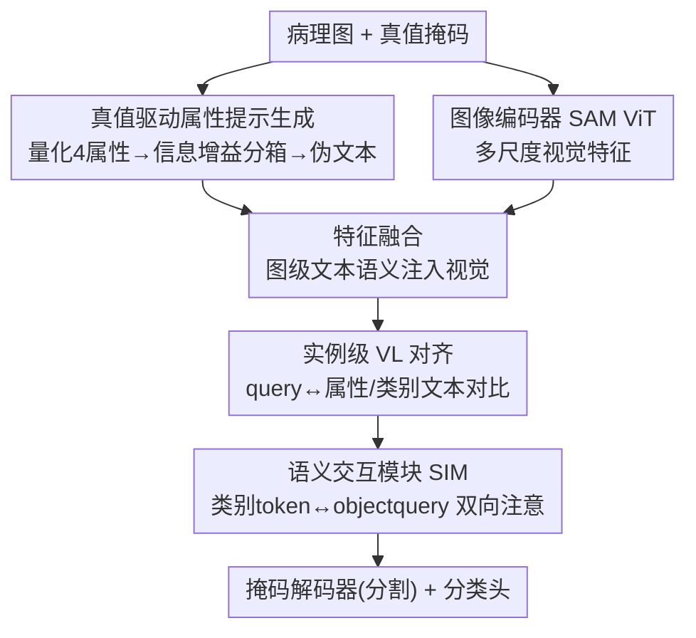

# IVAAN: Instance-level Vision-Language Alignment via Attribute-Guided Text Prompts Generation for Nuclei Analysis

**会议**: CVPR 2026  
**论文**: [CVF Open Access](https://openaccess.thecvf.com/content/CVPR2026/html/Jeong_IVAAN_Instance-level_Vision-Language_Alignment_via_Attribute-Guided_Text_Prompts_Generation_for_CVPR_2026_paper.html)  
**代码**: 待确认  
**领域**: 医学图像  
**关键词**: 细胞核分割、病理图像、实例级视觉语言对齐、属性引导文本、类别原型

## 一句话总结
本文针对病理图像细胞核「实例级分割+分类」中的类别不平衡与器官/染色差异问题，提出从真值掩码自动生成属性引导的伪文本提示，在实例级做视觉-语言对比对齐，再用每类多个可学习「类别 token」+语义交互模块建模类内多模态，无需人工文本标注即可同时提升分割与分类。

## 研究背景与动机
**领域现状**：细胞核实例分割与分类是计算病理学的基础任务，对癌症诊断和预后预测至关重要。HoVer-Net、CellViT、PromptNucSeg 等近期模型在**分割**精度上已很强，但**分类**能力仍弱。

**现有痛点**：细胞核数据集存在严重的类别不平衡和器官特异性偏差——某些表型只出现在少数器官、类别分布在不同图像间差异巨大。只用类别标签监督的模型被迫**隐式**地从背景着色、染色强度、器官特征等**上下文线索**去推断形态，而非学习细胞核的内在特征。结果是：形态相似但来自不同器官/染色协议的同类细胞核经常被错分。

**核心矛盾**：模型既要做到「类别可判别」，又要对器官与染色带来的巨大视觉变异「鲁棒」，但纯视觉、只有类别标签的范式无法同时满足——它学不到形状、颜色、纹理这些由器官/染色差异引起的变化。

**本文目标**：(1) 给每个细胞核引入实例级的语义文本监督；(2) 在保持器官一致的类别语义前提下，建模类内的多种子模式（submode）。

**切入角度**：病理学家诊断时本就依赖一组可量化的形态属性（大小、形状、染色强度、边界规则性）。作者把这些临床指标量化、离散化，转成「tiny/small/large…」这类人类可读的属性词，作为每个核的伪文本标签——绕开了「实例级文本标注极其昂贵」的瓶颈。

**核心 idea**：用真值掩码自动造出**属性引导的实例级文本提示**做对比对齐（让核特征同时绑定其形态外观与语义描述），再用**每类多个原型 token + 语义交互模块**容纳类内子模式、维持跨器官的类别一致性。

## 方法详解

### 整体框架
方法建在基于 Transformer 的 Mask2Former 之上，包含三个部件：**① 真值驱动的属性提示生成**、**② 实例级视觉-语言对齐**、**③ 语义交互模块（SIM）**。流程是：先量化每个核的临床相关属性并按信息增益离散成区间，把属性组合转成伪文本描述提供显式形态线索；图像编码器（SAM ViT）抽多尺度视觉特征，与文本嵌入做特征融合后再与 object query 交互，得到耦合视觉+语言的实例表征；为容纳类内变异，每类学多个「类别 token」作为局部原型，通过 SIM 与 object query 双向交互（把视觉证据聚到原型、再把全局类别上下文回灌到实例）；增强后的 query 送入掩码解码器做分割、分类头做分类，训练时在增强 query 与对应文本嵌入间施加实例级对比对齐。

### 关键设计

**1. 真值驱动的属性提示生成：把临床形态指标自动变成实例级文本监督**

实例级文本标注「极其昂贵且难造」是 VL 方法用不到核级分析的根本障碍。作者的破题点是从真值掩码**自动**反推文本：先对每个核提取 11 个形态与强度特征（等效直径、偏心率、长宽比、solidity、extent 等形状特征；归一化周长比、边界梯度均值刻画膜不规则性；苏木精均值/方差、核心-边缘强度差刻画染色质纹理），对应病理学的多形性、深染、膜不规则、染色质纹理四类临床指标。为挑出「跨类可判别且类内不冗余」的特征，用 Cohen's d 效应量算分离度 $S(m)=\text{median}_{(c_i,c_j)}|d_{ij}|$，再用 Spearman 相关（$\rho>0.7$ 视为冗余）去重，最终选出大小、偏心率、颜色强度、边界不规则 4 个代表属性。然后做**基于熵的有监督分箱**：对阈值 $\theta$ 用信息增益 $\text{Gain}(\theta)=H_{total}-\frac{n_L}{n}H_L-\frac{n_R}{n}H_R$（$H=-\sum_c p(c)\log_2 p(c)$）选最优切点，递归至深度 4 得到至多 5 个区间，并在 5 折上重复、保留出现率 ≥60% 的阈值以求稳定。每个区间映射成 tiny/small/medium/large/huge 等可读词，拼成每个核的属性文本。整套流程让语言监督既数据驱动又可解释，无需任何人工文本标签。

**2. 实例级视觉-语言对比对齐：让每个核同时绑定形态外观与语义描述**

图像级 VLM（PLIP、CONCH）做全局对齐、区域级方法（GLIP、GroundingDINO）一个框易混入多个重叠核，都无法做核级对齐。本文用 Mask2Former 的匈牙利匹配得到 query-实例对，对每个匹配到的增强 query 特征 $f_{enhq}$ 投影并 $\ell_2$ 归一化得视觉嵌入 $v$；文本用 CLIP 文本编码器（末层可训以适配病理域）编码再投影归一化得 $t$。用**两类互补提示**：**固定提示**走「a {class} nucleus in {organ}」模板提供类级语义锚，监督 $L_{fix}=-\frac1N\sum_i\log\frac{\exp(v_i^\top T_{y_i}/\tau)}{\sum_j\exp(v_i^\top T_j/\tau)}$；**属性提示**提供细粒度形态线索，对每个属性 $a$ 取真值属性文本为正例、同属性其余文本为负例，$L^a_{attr}=-\frac1{N_a}\sum_i\log\frac{\exp(v_i^\top t^+_{i,a}/\tau_{attr})}{\sum_m\exp(v_i^\top t^m_{i,a}/\tau_{attr})}$，总 VL 损失 $L_{CL}=\lambda_{fix}L_{fix}+\lambda_{attr}L_{attr}$。这样每个核既被拉向其类别语义、又被拉向其具体形态描述，使表征在跨器官时保持类别一致、缓解了「靠上下文乱猜」的隐式学习偏差。

**3. 类别 token + 语义交互模块（SIM）：用每类多个原型容纳类内子模式**

即便对齐了属性提示，同一生物类别的核因器官/组织不同仍有形状、颜色、纹理差异，会让表征分裂成多个子模式、破坏类嵌入一致性。作者为每类学 $k$ 个 token（共 $(C{+}1)\times k$ 个，含背景类），充当多个**局部原型**而非单一质心，以覆盖类内的多种形态。SIM 让类别 token（CT）与 object query（OQ）做**双向注意**：OQ→CT 方向以 CT 为 query、OQ 为 key/value，得到聚合了该类视觉证据的「动态 CT」，随训练演化成数据集级类别原型；CT→OQ 方向反过来用动态 CT 作 key/value 增强 OQ，让每个实例 query 继承全数据集累积的类级语义。为给原型语义锚定，把每组 $k$ 个 token 的均值 $\bar q_c=\frac1k\sum_i q_{c,i}$ 对齐到对应类文本嵌入：$L_{cent}=-\frac1C\sum_c\log\frac{\exp(\bar q_c^\top T_c/\tau_{CT})}{\sum_j\exp(\bar q_c^\top T_j/\tau_{CT})}$。由于 $L_{cent}$ 只约束每组 token 的**均值**，各 token 仍能在均值附近捕捉合法的类内多样性——既压低类内方差、又适配器官特异的分布差异。

### 损失函数 / 训练策略
总损失 $L=\lambda_{seg}L_{seg}+\lambda_{cls}L_{cls}+\lambda_{CL}L_{CL}+\lambda_{cent}L_{cent}$，其中 $\lambda_{seg}=5,\lambda_{cls}=2,\lambda_{CL}=1,\lambda_{cent}=2$，VL 内部 $\lambda_{fix}=1,\lambda_{attr}=0.3$。骨干用 SAM ViT 编码器接 Mask2Former；AdamW（lr=1e-4，batch=8），训 3000 步，200 个 object query，温度 $\tau=0.07,\tau_{CT}=0.07,\tau_{attr}=0.15$，每类 token 数 $k=5$，NVIDIA A100。另有一路**特征融合**：用列出图中所有核类别的图级文本（如「a photo of a neoplastic nuclei. a photo of a connective nuclei.」）投影后与多尺度视觉特征做 cross-attention，在解码前给视觉表征注入早期类级语义。

## 实验关键数据

### 主实验
PanNuke 数据集三折交叉验证，检测/分类 F1 与全景质量（PQ）：

| 方法 | 检测 F1 | 分类 F1 | bPQ | mPQ |
|------|---------|---------|------|------|
| HoVer-Net | 0.80 | 0.50 | 0.6596 | 0.4629 |
| CellViT-H | 0.83 | 0.58 | 0.6793 | 0.4980 |
| PromptNucSeg-H | 0.84 | 0.61 | 0.6924 | 0.5123 |
| **Ours-H（本文）** | **0.87** | **0.69** | **0.6976** | **0.5459** |

检测 F1 0.87、分类 F1 0.69 均最优；bPQ 比 PromptNucSeg 高 +0.005、mPQ 高 +0.034。类别级 PQ（Table 3）上 inflammatory、connective、dead 三类提升最大——前两类形态相似常被混淆，属性文本注入的形状/强度线索帮其区分；dead 是少数类，提升最显著，说明方法缓解了类别不平衡。

跨数据集（Ours 三种骨干 B/L/H）：

| 方法 | MoNuSeg AJI | MoNuSeg PQ | CPM17 AJI | CPM17 PQ |
|------|-------------|------------|-----------|----------|
| PromptNucSeg-H | 0.622 | 0.627 | 0.740 | 0.733 |
| Ours-B | 0.664 | 0.647 | 0.729 | 0.727 |
| Ours-H | **0.689** | **0.696** | **0.743** | **0.748** |

值得注意：本文即便用 ViT-L 骨干（Ours-L）在 MoNuSeg 上也已超过 PromptNucSeg-H。

### 消融实验

| 配置 | det-F1 | cls-F1 | PQ | AJI | 说明 |
|------|--------|--------|------|------|------|
| (1) baseline | 78.5 | 63.1 | 57.3 | 61.6 | 无任何文本/语义模块 |
| (2) +VL(仅固定提示) | 83.8 | 67.1 | 62.3 | 65.3 | 固定提示即可正则特征空间 |
| (4) +Attr+Entr | 84.5 | 67.7 | 65.4 | 66.1 | 加属性提示+熵分箱 |
| (5) +SIM(类别token) | 86.7 | 69.3 | 66.4 | 67.5 | query↔原型双向交互 |
| (6) +FF(特征融合) | 87.0 | 69.5 | 67.3 | 68.3 | 完整模型，最佳 |

注：Row 3 用等数量分位分箱替代熵优化分箱，PQ 仅 63.8，逊于熵分箱（Row 4 的 65.4），佐证信息增益分箱的价值。

### 关键发现
- **各组件逐级累加、无明显冗余**：从 baseline 到完整模型 det-F1 78.5→87.0、PQ 57.3→67.3，固定提示先正则特征空间，属性提示补细粒度形态判别，SIM 补类内子模式建模，特征融合再添早期语义。
- **属性文本专治「形态相似类混淆」**：inflammatory vs connective 这类难分类别的 PQ 提升最大，特征空间可视化（UMAP/t-SNE）显示本文表征把二者分得比 baseline 更开，文本锚点落在各自类别区域内、远离决策边界。
- **缓解类别不平衡**：dead 等少数类提升最显著，说明语义先验帮模型不再依赖上下文猜测罕见类。

## 亮点与洞察
- **「真值掩码即文本标注」的自动化思路**：把病理学家用的可量化形态指标自动转成可读属性词，零人工文本标注就拿到实例级语义监督——这套「从结构标注反推语言监督」的范式可迁移到其他缺文本标注的密集实例任务。
- **熵分箱让属性词「数据驱动且类别可分」**：不用固定阈值，而用信息增益选切点并跨折稳健化，保证生成的 tiny/large 等词真带类别判别信息（消融已验证优于分位分箱）。
- **多原型 + 双向语义交互优雅解决类内多模态**：每类 $k$ 个 token 只约束均值对齐文本，既维持跨器官类一致、又保留合法子模式，是「既要类可判别又要对器官鲁棒」这对矛盾的巧解。

## 局限与展望
- 作者承认 **dead 等少数类的 token 预算 $k=5$ 偏大**：SIM 会集中到少数 token，欠关注的 token 因 $L_{cent}$ 只约束均值而被噪声梯度推向流形外区域——建议用类自适应 token 预算或剪枝/重初始化机制。
- Connective 与 Inflammatory 特征仍有重叠，而 5 个 Connective token 都挤在文本锚附近，欠表达边界区变异；可加轻度多样化约束鼓励类内 token 分散、做边界导向的子模式专门化。
- 方法依赖真值掩码生成属性文本，**仅适用于有像素级标注的训练集**；属性量化（如苏木精强度）对染色协议差异的敏感性未充分压力测试。
- 评测集中在 PanNuke/MoNuSeg/CPM17 三个较常用基准，更大规模、更多器官/染色域的泛化仍待验证。

## 相关工作与启发
- **vs 纯视觉核分析（HoVer-Net / CellViT / PromptNucSeg）**：它们每核只用单一类别标签监督，隐含「器官无关、单峰」的类别假设，难表示器官特异子模式；本文用属性文本+多原型显式建模类内多样性，分类 F1 与 mPQ 都更高。
- **vs 图像级病理 VLM（PLIP / CONCH / PathAlign）**：它们做全局图-文对齐，抓不到核级细粒度语义；本文把对齐下沉到实例级。
- **vs 区域级 grounding（GLIP / OWL-ViT / GroundingDINO）**：在病理中核密集且重叠，一个框易混入多核导致区域嵌入被污染；本文以匹配到的 query 做核级对齐，规避了框级混叠。

## 评分
- 新颖性: ⭐⭐⭐⭐ 「真值掩码自动生成属性文本 + 实例级 VL 对齐 + 多原型 SIM」组合新颖，切中核级分析缺文本标注的痛点
- 实验充分度: ⭐⭐⭐⭐⭐ 三数据集、多骨干、逐组件消融 + 分箱方式对照 + 特征空间可视化，证据链完整
- 写作质量: ⭐⭐⭐⭐ 动机到方法推导清晰，公式齐全；个别符号（SIM 双向注意细节）需对照图才好懂
- 价值: ⭐⭐⭐⭐ 在分类与少数类上实打实提升，思路对密集实例 VL 监督有借鉴意义，但代码暂未确认开源

<!-- RELATED:START -->

## 相关论文

- [\[CVPR 2026\] Gastric-X: A Multimodal Multi-Phase Benchmark Dataset for Advancing Vision-Language Models in Gastric Cancer Analysis](gastric-x_a_multimodal_multi-phase_benchmark_dataset_for_advancing_vision-langua.md)
- [\[CVPR 2026\] PETAR: Localized Findings Generation with Mask-Aware Vision-Language Modeling for PET Automated Reporting](petar_localized_findings_generation_with_mask-aware_vision-language_modeling_for.md)
- [\[CVPR 2026\] SAT-RRG: LLM-Guided Self-Adaptive Training for Radiology Report Generation with Token-Level Push–Pull Optimization](sat-rrg_llm-guided_self-adaptive_training_for_radiology_report_generation_with_t.md)
- [\[AAAI 2026\] GuideGen: A Text-Guided Framework for Paired Full-Torso Anatomy and CT Volume Generation](../../AAAI2026/medical_imaging/guidegen_a_text-guided_framework_for_paired_full-torso_anatomy_and_ct_volume_gen.md)
- [\[CVPR 2026\] Hyperbolic Relational Prompts for Intersectional Fairness in Medical VLMs](hyperbolic_relational_prompts_for_intersectional_fairness_in_medical_vlms.md)

<!-- RELATED:END -->
