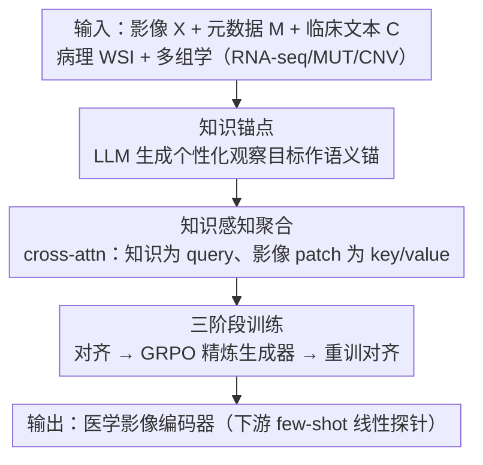

# KAMP: Knowledge-Anchored Multimodal Pretraining Framework for Medical Image Representation

**会议**: CVPR 2026  
**论文**: [CVF Open Access](https://openaccess.thecvf.com/content/CVPR2026/html/Huang_KAMP_Knowledge-Anchored_Multimodal_Pretraining_Framework_for_Medical_Image_Representation_CVPR_2026_paper.html)  
**代码**: 待确认  
**领域**: 医学图像 / 多模态 / 表示学习  
**关键词**: 医学影像预训练, 跨模态对齐, LLM 个性化知识, 语义锚, GRPO, few-shot

## 一句话总结
KAMP 用 LLM 生成的「患者个性化诊断知识」作为语义锚，把医学影像和病理、基因组等多模态生物医学信号对齐，并用三阶段训练（对齐 → GRPO 精炼生成器 → 重训对齐）让知识越练越准，在脑、膀胱、肝癌的 few-shot 分类上大多优于单模态/双模态/三模态基线。

## 研究背景与动机
**领域现状**：病理、基因组、医学影像各自揭示不同的生物信号（组织结构、分子机制、器官级病灶），把它们一起用能给影像表示学习提供更丰富、更稳的语义监督。但病理和基因组往往需要侵入性操作、只对少数病人可得，而医学影像相对易获取——于是「用更丰富的跨模态语义来预训练影像模型」成了刚需。

**现有痛点**：现有医学影像预训练有三类，各有硬伤。① 单模态学习（MiM / VoCo / Swin-UNETR）只用影像自身信号（对比、掩码重建等），监督语义粗、只能反映宏观外观；② 双模态学习（RadCLIP / HLIP）把影像和某一伴随模态（文本/病理/基因组）对齐，但缺乏调和跨模态不一致的机制，配对数据稀缺时对比目标会偏向虚假相关、语义错配；③ 三模态学习（DRIM）把影像、病理、基因组一起对齐，但更多模态带来更多噪声，放大对齐误差、破坏共享语义稳定性。

**核心矛盾**：跨模态生物医学信号能提供更强监督，但「配对数据稀缺 + 模态间统计偏差与噪声」让直接多模态对齐既学不充分、又容易被噪声带偏。

**本文目标**：在配对数据稀缺、且存在模态偏差/噪声的条件下，学到语义丰富又鲁棒的医学影像表示。

**切入角度**：LLM 能把领域先验注入影像预训练来「加密」监督信号，但已有 LLM 增强工作大多只用类别级描述、忽略患者个体上下文，生成的描述塌缩成与影像弱相关的通用模板；即便给了患者临床信息，现成 LLM 也没校准到这种个性化输入分布，生成易不一致、带噪。作者的洞察是：让 LLM 基于患者临床文本和影像元数据生成个性化诊断知识，把这段文本当作连接影像与其它模态的「语义锚」。

**核心 idea**：用 LLM 派生的个性化文本作为语义锚（semantic anchor），锚定影像与多模态生物医学证据的对齐，并用强化学习把这个锚越练越贴合影像与跨模态证据。

## 方法详解

### 整体框架
KAMP 由两大组件构成：基于 LLM 的「知识生成器」和「跨模态对齐器」（cross-modal aligner）。对齐器有两条分支——医学影像分支把影像和个性化知识聚合成「知识感知嵌入」 $h$，同时单独池化得到「纯影像嵌入」 $h_{img}$；多模态生物医学分支把临床文本、病理 WSI、多组学（RNA-seq/MUT/CNV）融合成多模态嵌入 $z$。训练用对称对比损失，把 $h$ 和 $h_{img}$ 都向 $z$ 对齐。

整个框架按三阶段推进：阶段一用现成 LLM 生成知识、训练初始对齐器；阶段二冻结对齐器、把它当奖励模型用 GRPO 优化一个可训练 LLM 生成器；阶段三冻结优化后的生成器、用精炼知识重训对齐器。下游只用预训练好的影像编码器、对 $h_{img}$ 做线性探针评测。

### 关键设计

**1. 知识锚点：用 LLM 文本降低跨模态条件熵，稳住对齐**

针对「直接多模态对齐会被模态偏差/噪声带偏」的痛点，作者从互信息角度论证了引入知识锚 $A$ 的价值。设 $h$ 为知识感知影像表示、$z$ 为多模态生物医学表示、$A$ 为 LLM 派生知识。由互信息链式法则有 $H(h\mid z,A)=H(h\mid z)-I(h;A\mid z)$，于是不确定性的下降量恰为条件互信息：

$$\Delta H \triangleq H(h\mid z)-H(h\mid z,A)=I(h;A\mid z)\geq 0.$$

也就是说，在已观测 $z$ 的条件下，锚 $A$ 还能额外提供关于 $h$ 的信息、把表示推向语义上有意义的影像内容。更关键的是它对噪声的作用：当 $z$ 含有虚假或模态特有的伪信号（如基因组的批次效应、病理的染色差异），只靠影像特征对齐会让表示吸收这些「与 $z$ 相关但语义不可靠」的信号；而 KAMP 把 $A$ 融进 $h$、再用对比目标拉 $h$ 与 $z$ 一致，于是只有同时被锚 $A$ 和证据 $z$ 支持的影像线索才被强化，$z$ 里不被 $A$ 佐证的信号难以主导表示——对齐因此比直接双/三模态更稳。

**2. 知识感知聚合：用 cross-attention 把个性化知识注入影像 token**

光有知识文本不够，得让它精准「指向」影像里相关区域。作者设计知识感知聚合（Knowledge-Aware Aggregation）：影像编码器把 3D 影像编成 $S$ 个 patch token $V_{img}\in\mathbb{R}^{S\times d}$，文本编码器把 $P$ 个观察目标编成 $U\in\mathbb{R}^{P\times d}$。用 cross-attention，让文本目标当 query、影像 patch 当 key/value：$Q=UW_Q,\ K=V_{img}W_K,\ V=V_{img}W_V$，注意力权重 $Y=\mathrm{softmax}(QK^\top/\sqrt{d})\in\mathbb{R}^{P\times S}$。每个目标 $p$ 对应的 $Y_{p,:}$ 就是它在 $S$ 个 patch 上的注意力分布，等于让这条文本「软选择」最相关的影像区域。聚合输出 $H_{cross}=YV$，再对目标维做平均池化得知识感知嵌入 $h=\frac{1}{P}\sum_{p}(H_{cross})_p$；纯影像嵌入 $h_{img}$ 则由 $V_{img}$ 直接平均池化得到。这样 LLM 派生的领域先验把聚合导向临床显著区域，增强影像表示语义。

**3. 三阶段训练：对齐 → GRPO 精炼生成器 → 重训对齐**

针对「现成 LLM 没校准到个性化输入、生成知识带噪不一致」的痛点，KAMP 用三阶段闭环把知识越练越准：

- **阶段一（知识监督的对齐器预训练）**：用现成 GPT-5（⚠️ 以原文为准）基于影像元数据 $M$ 和患者临床文本 $C$ 生成 $P$ 个结构化观察目标（每个含「视觉发现 + 诊断结论」），喂进对齐器，用对称对比损失（对 $(h,z)$ 和 $(h_{img},z)$ 各算一项再相加）训练初始对齐器 $\mathcal{E}_\phi$。
- **阶段二（GRPO 精炼生成器）**：冻结阶段一的对齐器 $\mathcal{E}_\phi$、把它当奖励模型，用 GRPO 优化一个可训练的知识生成器 $G_\theta$（Qwen3-8B，⚠️ 以原文为准）。每轮快照旧策略 $\pi_{\theta_{old}}$，采 $G$ 个候选知识 $\{T^g\}$，奖励是该候选聚合出的嵌入 $h^g$ 与 $z$ 的余弦相似度 $r^g=s(h^g,z)$；组内归一化得相对优势 $A^g=(r^g-\bar{r})/\sigma$，再用带 clip 和 KL 惩罚的 GRPO 目标更新生成器的 LoRA 模块：

$$\mathcal{L}_{GRPO}=-\mathbb{E}\Big[\sum_{g}\min\big(\rho^g A^g,\ \mathrm{clip}(\rho^g,1-\epsilon,1+\epsilon)A^g\big)\Big]+\beta\,\mathbb{E}\big[D_{KL}(\pi_\theta\|\pi_{ref})\big],$$

其中 $\rho^g=\pi_\theta(T^g\mid M,C)/\pi_{\theta_{old}}(T^g\mid M,C)$。这一步逼生成器产出更贴合影像内容、又与病理/基因组证据一致的知识。
- **阶段三（用精炼知识重训对齐器）**：冻结优化后的生成器、生成知识 $T$，用与阶段一相同的对称对比目标重训对齐器，把精炼语义吃进对齐器、收紧对齐、压制模态偏差与噪声。

> ⚠️ 框架图里点名的「知识锚点 / 知识感知聚合 / 三阶段训练」均在关键设计逐一交代；阶段二的 GRPO 与「以对齐器为奖励模型」并入第 3 个设计点讲清，未单列。

## 实验关键数据

### 主实验
在 TCGA 四队列（GBM/LGG 脑、BLCA 膀胱、LIHC 肝）上预训练，用医学影像 + 元数据 + 临床文本 + 病理 WSI + 多组学。下游在 BraTS23-MEN（脑膜瘤三分级）、FedBCa（膀胱癌二分类）、TG-LIVT（肝癌微血管侵犯二分类）上做 few-shot 线性探针，报 macro-AUC。下表取 3-shot 与 20-shot 两个端点对比代表性基线：

| 数据集 | 设置 | 最优基线 | KAMP（本文） |
|--------|------|----------|--------------|
| BraTS23-MEN | 3-shot | DRIM 60.2 | **62.5** |
| BraTS23-MEN | 20-shot | VoCo 62.1 | **70.2** |
| FedBCa | 3-shot | DRIM 75.6 | 74.3 |
| FedBCa | 20-shot | MiM 76.1 | **82.6** |
| TG-LIVT | 3-shot | DRIM 57.2 | **59.4** |
| TG-LIVT | 20-shot | DRIM 67.0 | **74.5** |

KAMP 在三数据集几乎所有 shot 设置上取得最高 macro-AUC（仅 FedBCa 的 3-shot 略低于 DRIM）。20-shot 优势最明显：三数据集分别超第二名 +8.1% / +6.5% / +7.5%，且从 3→20-shot 呈稳定上升的良好扩展趋势，而多个强基线在更多监督下出现早饱和或不稳定。t-SNE 也显示 KAMP 的类簇更紧凑、类间分离更清晰（如脑膜瘤 Grade 1/2、膀胱癌 NMIBC/MIBC 都比 HLIP/MiM 分得更开）。

### 消融实验
在 FedBCa 20-shot（macro-AUC）上比较阶段二的强化学习目标：

| 配置 | macro-AUC | 说明 |
|------|-----------|------|
| GenPers（无 RL，阶段一对齐器） | 79.6 | 仅用 GPT-5 个性化知识，未经 RL 精炼 |
| PPO-Aligner | 提升（介于两者间） | 用 GenPers 分数作奖励 |
| DPO-Aligner | 提升（介于两者间） | 用 GenPers 偏好 |
| **GRPO-Aligner（完整）** | **82.6** | 组内相对优势，增益最大 |

### 关键发现
- **个性化知识是关键，不是「多塞文本」就行**：另一组消融（五种阶段一文本输入，20-shot）显示，直接喂类别标签（RawLbl）或原始临床文本（RawPers）的效果与「无文本」（VisOnly）相当甚至更差；只给类别条件的生成文本（GenLbl）仅小幅提升、在 TG-LIVT 上还掉点；唯有 GPT-5 基于患者临床文本+元数据生成的个性化知识（GenPers）三数据集一致最优——收益来自「个性化语义锚」，而非更多文本。
- **GRPO 精炼贡献明确**：三种 RL 目标都比无 RL 的 GenPers（79.6）好，GRPO-Aligner 最高（82.6），说明组相对奖励信号最能把生成知识校准到「忠于影像、且与病理/基因组一致」。
- **few-shot 扩展性好**：监督越多 KAMP 越受益、不早饱和，适合标注稀缺的医学场景。

## 亮点与洞察
- **「语义锚」而非「又一个模态」**：把 LLM 文本定位成锚而不是新加的对齐模态，用条件互信息 $I(h;A\mid z)$ 解释「为什么锚能降噪稳对齐」——这种把文本当筛选器、只保留被多方佐证信号的思路，可迁移到任何噪声大的多模态对齐。
- **对齐器当奖励模型的闭环**：阶段二用冻结对齐器给候选知识打分当 reward，让生成器和对齐器互相校准，是一个「用下游对齐质量直接驱动文本生成」的可复用范式。
- **个性化 > 通用模板**：实验清楚证明类别级模板化描述几乎无用，患者级个性化知识才有判别价值，对「LLM 增强视觉」类工作是有力的提醒。

## 局限与展望
- 阶段一依赖现成 GPT-5（⚠️ 以原文为准）生成知识，对闭源大模型有依赖，可复现性与成本受限。
- 评测仅在三个癌种数据集、且其一（TG-LIVT）为自有数据集，规模偏小（下游队列百例量级），泛化性有待更大规模验证。
- 病理与基因组在预训练时仍需配对，虽针对稀缺设计，但「多模态生物医学分支」本身仍要这些昂贵模态参与训练。
- 个性化知识质量高度依赖患者临床文本的可得性与质量，临床文本缺失/噪声大时锚的有效性存疑。

## 相关工作与启发
- **vs 单模态预训练（MiM / VoCo / Swin-UNETR）**：它们只用影像自监督、语义粗；KAMP 引入跨模态 + LLM 语义锚，few-shot 全面领先。
- **vs 双模态对齐（RadCLIP / HLIP）**：双模态缺调和不一致的机制、易被虚假相关带偏；KAMP 用锚抑制不被佐证的信号，对齐更稳。
- **vs 三模态对齐（DRIM）**：DRIM 直接堆病理+基因组会放大噪声、对齐不稳；KAMP 把 LLM 文本当锚去筛信号，20-shot 上对 DRIM 大幅领先（如 TG-LIVT +7.5%）。
- **vs LLM 增强医学视觉（BiomedCoOp / MedUnA / UniMed-CLIP）**：它们多用类别级描述、提供通用指导；KAMP 条件于患者临床文本与元数据生成个性化知识，减少文本-影像漂移。

## 评分
- 新颖性: ⭐⭐⭐⭐ 「LLM 个性化知识当语义锚 + GRPO 闭环精炼」组合新颖，信息论动机清晰
- 实验充分度: ⭐⭐⭐⭐ few-shot 主结果 + 两组消融较扎实，但数据集偏小、部分消融只给图无精确数值
- 写作质量: ⭐⭐⭐⭐ 三阶段流程与互信息推导讲得清楚，图示完整
- 价值: ⭐⭐⭐⭐ 面向配对数据稀缺的医学影像预训练，思路可迁移到其它多模态科学域

<!-- RELATED:START -->

## 相关论文

- [\[CVPR 2026\] MedKCO: Medical Vision-Language Pretraining via Knowledge-Driven Cognitive Orchestration](medkco_medical_vision-language_pretraining_via_knowledge-driven_cognitive_orches.md)
- [\[CVPR 2026\] Multimodal Causality-Driven Representation Learning for Generalizable Medical Image Segmentation](multimodal_causal-driven_representation_learning_for_generalizable_medical_image.md)
- [\[CVPR 2026\] H2-Surv: Hierarchical Hyperbolic Multimodal Representation Learning for Survival Prediction](h2-surv_hierarchical_hyperbolic_multimodal_representation_learning_for_survival_.md)
- [\[CVPR 2026\] MorphSeek: Fine-grained Latent Representation-Level Policy Optimization for Deformable Image Registration](morphseek_fine-grained_latent_representation-level_policy_optimization_for_defor.md)
- [\[CVPR 2026\] GeoSemba: Reconstructing State Space Model for Cross Paradigm Representation in Medical Image Segmentation](geosemba_reconstructing_state_space_model_for_cross_paradigm_representation_in_m.md)

<!-- RELATED:END -->
