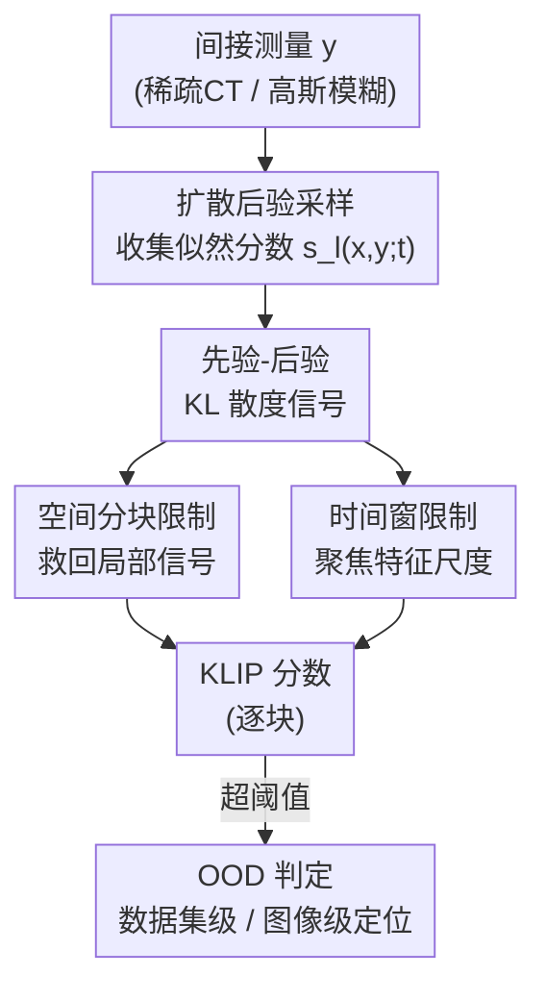

# KLIP: localized distribution shift detection via KL-divergence with diffusion priors in Inverse Problems

**会议**: CVPR 2026  
**arXiv**: [2605.31596](https://arxiv.org/abs/2605.31596)  
**代码**: https://github.com/voilalab/KLIP (有)  
**领域**: 医学图像 / 扩散模型 / 反问题 / OOD 检测  
**关键词**: 分布偏移检测, KL 散度, 扩散先验, 后验采样, 局部异常定位

## 一句话总结
在用扩散先验解反问题（稀疏视角 CT、高斯去模糊）的过程中，用「先验分布 $p(x)$ 与后验分布 $p(x|y)$ 之间的 KL 散度」当作 OOD 信号，并把它限制到空间分块和采样时间窗内，从而无需任何 OOD 标定数据就能检测并**定位**图像里细小、局部、却有诊断意义的分布偏移（如健康肝脏 CT 里的肿瘤）。

## 研究背景与动机
**领域现状**：扩散模型既是解反问题（从间接测量 $y$ 重建图像 $x$）的强力数据驱动先验，也被发现具备一定的 OOD（out-of-distribution）检测能力。在医学影像里，最需要捕捉的恰恰是那些「细小、局部」的偏移——小病灶、肿瘤、撕裂，它们正是图像诊断价值之所在。

**现有痛点**：现有的扩散 OOD 检测方法几乎都有硬伤——统计上最严谨的共形预测（conformal prediction）需要一份 OOD 标定集，而开放世界里罕见异常的长尾根本拿不到这种标定数据；有的方法要训练多个扩散模型；有的只在完整图像上工作，用不了反问题里仅有的间接测量；还有的只能区分「全局」OOD 图像，对一张整体正常、只有一小块异常的图无能为力。

**核心矛盾**：把整张图当成一个标量来打 OOD 分数时，局部的细小偏移会被图像其余正常区域「平均稀释」掉——信号被淹没，ID 和 OOD 在分数上根本分不开（论文 Figure 3(b) 显示整图 KL 散度直方图 ID/OOD 完全重叠）。

**本文目标**：设计一个 OOD 指标，要同时满足三点：(i) 不需要任何 OOD 样本或标定数据；(ii) 能直接作用于反问题推理时拿到的间接测量 $y$；(iii) 能检测细小、局部、但语义上有意义的分布偏移，并定位到具体位置。

**切入角度**：作者的核心观察是——测量 $y$ 把后验从先验「拉走」得越远，$x$ 越可能是 OOD。形式化为先验 $p(x)$ 与后验 $p(x|y)$ 之间的 KL 散度。而这个 KL 散度恰好可以**只用后验采样过程中产生的似然分数**来估计，天然不需要 OOD 数据。再结合「扩散模型在采样的不同阶段生成不同尺度的图像成分」这一已知规律，把 KL 散度进一步限制到空间块和时间窗，就能把局部信号从稀释里救回来。

**核心 idea**：用「时间步 + 空间块受限的先验-后验 KL 散度」当 OOD 指标，标定无关、可直接用于反问题、且能逐块定位局部异常。

## 方法详解

### 整体框架
KLIP 的设定是：有一个**只在 ID 图像上训练**的扩散模型，把它当先验去解反问题 $y=\mathcal{A}(x)+\epsilon$（$\mathcal{A}$ 是 CT 投影或高斯模糊等线性前向算子）。解法是标准的扩散后验采样——在反向 SDE 的每一步同时加上先验分数 $\nabla_x\log p_t(x)$ 和似然分数 $\nabla_x\log p_t(y|x)$，让重建结果与测量 $y$ 一致。KLIP 的关键洞察是：这个**似然分数**本身就编码了「测量把后验从先验拉开了多远」，于是无需额外计算就能拿它来估计先验-后验 KL 散度，作为 OOD 信号。整条流程是：间接测量 → 后验采样（顺便收集每个时间步、每个噪声样本的似然分数）→ 把这些分数按空间块和时间窗聚合成 KL 散度 → 得到逐块的 KLIP 分数 → 超阈值即判 OOD（任一块超阈值则整图 OOD，单块超阈值则该位置 OOD）。

### 关键设计

**1. 先验-后验 KL 散度作为标定无关的 OOD 信号**

针对「现有方法都要 OOD 标定数据」这个痛点，作者把 OOD 信号定义为后验 $p(x|y)$ 与先验 $p(x)$ 之间的 KL 散度 $D_{KL}(p(x|y)\|p(x))$。直觉是：测量 $y$ 把后验拉离先验越远，$x$ 越可能 OOD。一个高斯玩具例子能说清——先验 $p(x)=\mathcal{N}(0,\sigma_1^2)$、前向 $y=x+\epsilon$，可解析算出 $D_{KL}=\frac{\sigma_1^2 y^2}{2(\sigma_1^2+\sigma_2^2)^2}+\text{const}$，随 $|y|$ 二次增长：测量幅度越大的信号在先验下越不可能，KL 散度恰好刻画了 $x^\star$ 相对先验的偏离。

关键在于这个 KL 散度怎么估计。论文借助一个已知结论：在固定 SDE 下，两个分布的 KL 散度可写成它们边际分数之差的加权积分，$D_{KL}(p\|q)=\frac{1}{2}\int_0^T \mathbb{E}_{x\sim p_t}[\|g(t)h(x,t)\|_2^2]\,dt$，其中 $h(x,t)=\nabla_x\log p_t(x)-\nabla_x\log q_t(x)$。把 $p,q$ 分别取后验和先验后，由贝叶斯分解 $\nabla_x\log p_t(x|y)=\nabla_x\log p_t(x)+\nabla_x\log p_t(y|x)$，这个差 $h$ 恰好就是**似然分数** $\nabla_x\log p_t(y|x)$。而后验采样里早已用 $s_l(x_t,y;t)$ 近似了这一项，于是

$$D_{KL}(p(x|y)\|p(x))=\frac{1}{2}\int_0^T \mathbb{E}_{x\sim p_t(x|y)}\big[\|g(t)\,s_l(x,y;t)\|_2^2\big]\,dt.$$

实现上：跑多条后验采样轨迹（不同随机噪声 $z$），沿途收集每步的似然分数 $s_l$，对样本求平均近似期望、对时间步求和近似积分。整个估计**不碰任何 OOD 图像，只需一个 ID 上训练的扩散模型**，这正是它相对共形预测/多模型方法的根本区别

**2. 空间分块限制：把被稀释的局部信号救回来**

针对核心矛盾——整图 KL 散度会把小区域的异常平均掉。作者把每个似然分数 $s_l(x,y;t)\in\mathbb{R}^{D\times D}$ 切成 $N_B$ 个大小为 $D_B\times D_B$ 的块，记 $s_l(x,y;t)|_{B_i}$ 为限制到第 $i$ 块的分数。因为 KL 散度公式用的是空间坐标上的平方 $\ell_2$ 范数，限制到块就得到了「逐块的局部贡献」，局部偏移不再被整图其余部分摊薄。这一思路类比了信息论里「用直方图/数据相关划分做 KL 散度非参数估计、把散度写成各 cell 贡献之和」的经典文献，块大小 $D_B$ 就像直方图的 bin 宽，控制「定位精度 vs. 方差」的权衡——块越小定位越准但方差越大。Figure 3(c) 证明了效果：含星形伪影的块和不含的块，其 KL 散度直方图被明显拉开，而整图 KL（3(b)）则完全重叠

**3. 时间窗限制：不同采样阶段对应不同尺度的异常**

仅有分块还不够。作者利用「扩散模型在采样不同阶段生成不同尺度成分」这一规律（早期大 $t$ 构建低频/整体结构，后期小 $t$ 补高频细节），把 KL 散度的积分进一步限制到时间窗 $[t_0,t_1]$：

$$\text{KLIP}(B_i,[t_0,t_1];y)=\frac{1}{2}\int_{t_0}^{t_1}\mathbb{E}_{x\sim p_t(x|y)}\big[\|g(t)\,s_l(x,y;t)|_{B_i}\|_2^2\big]\,dt.$$

这同时做了空间块和时间窗两层限制，就是最终的 KLIP 指标。为什么有效：Figure 3(d) 显示，OOD 块在 $t\approx 0.3$ 附近（用宽度 0.05 的滑动窗）有一个明显的「鼓包」，而 ID 块没有；但若在整个 $[0,1]$ 上积分，这个判别性的信号会被冲掉。Figure 6 进一步给出可解释的现象：大的局部特征（如 Moody 的眼睛、Icheb 的隆起鼻梁）在较早时间窗就显现，细小特征（如哈利波特的伤疤）要到较晚才出现——这也解释了为什么最优 $[t_0,t_1]$ 依赖 OOD 特征的尺度和形状

### 损失函数 / 训练策略
KLIP **不引入任何额外训练**——扩散模型按常规分数匹配损失在 ID 图像上训练即可，KLIP 是纯推理期的后处理指标。唯一需要调的是两个超参：块大小 $D_B$ 和时间窗 $[t_0,t_1]$。调参方式：构造一个「调参集」（给 ID 的 CT 加合成星形伪影），用预测-校正扩散模型在其上网格搜索使 OOD 检测性能最大；然后把同一组超参**直接迁移**到更真实的任务（肝脏肿瘤 CT、人脸去模糊伪影），不再单独细调。期望近似用的样本数：CT 用 5 个、人脸用 8 个。

## 实验关键数据

### 主实验
评测指标为 AUC，分**数据集级**（整图判 OOD）与**图像级**（逐块定位）两种任务；前向问题为 24 投影角的稀疏视角 CT 与人脸高斯去模糊。扩散骨干含预测-校正模型（whole-image）和 PaDIS（patch-based），人脸用 DDPM。ID 分布为 CHAOS 健康腹部 CT 与 CelebA 人脸，OOD 为合成星形（调参用）、真实感肝脏肿瘤、伤疤、影视角色面部特征。

| 任务（模型） | OOD 类型 | $D_{KL}$（无时间限制） | KLIP | 代表性基线 |
|--------|------|------|------|------|
| 数据集级 CT（预测-校正） | Star | 0.541 | **0.855**† | NLL 0.586 / DiffPath 0.688 |
| 数据集级 CT（预测-校正） | Tumor | 0.602 | **0.776** | NLL 0.535 / DiffPath 0.368 |
| 图像级 CT（预测-校正） | Star | 0.837 | **0.912**† | — |
| 图像级 CT（预测-校正） | Tumor | 0.856 | **0.878** | — |
| 图像级 CT（PaDIS patch） | Tumor | 0.672 | **0.732** | CutPaste 0.441 / SimpleNet 0.592 |
| 图像级去模糊（DDPM） | Scar | 0.675 | **0.867** | — |
| 图像级去模糊（DDPM） | Character | 0.482 | **0.772** | — |

> † 标记的是用调参集（star）调过超参的设置；其余任务沿用同一组超参未再细调。注意 CutPaste/SimpleNet 直接作用于**真实图像**而非间接测量，OOD 任务对它们其实更容易，因此不构成同台对比。

KLIP 在所有扩散基线（$D_{KL}$、NLL、DiffPath）上全面占优，且无标定数据下的肿瘤检测（数据集级 0.776、图像级 0.878）远超只看整图的 $D_{KL}$ 和 NLL（0.535）。

### 消融实验
预测-校正模型上，拆解空间块与时间窗两种限制各自的贡献（AUC）：

| 配置 | 数据集级 Star | 数据集级 Tumor | 图像级 Star | 图像级 Tumor |
|------|------|------|------|------|
| $D_{KL}$（都不限制） | 0.54† | 0.60 | 0.84† | 0.86 |
| + 仅空间块 | 0.85† | 0.65 | 0.88† | 0.91 |
| + 仅时间窗 | 0.57† | 0.78 | 0.86† | 0.81 |
| KLIP（块+时间） | **0.86**† | 0.78 | **0.91**† | 0.88 |

超参敏感性（Table 3）：在 star 上调参时 Tumor 数据集级/图像级为 0.78 / 0.88；改在 tumor 上调参后升到 0.87 / 0.92，但 star 性能相应下滑（数据集级 0.86→0.68）——说明超参在不同 OOD 类型间不完全通用。

### 关键发现
- **两种限制互补、缺一不可**：仅空间块对「数据集级 Star」帮助巨大（0.54→0.85），但对「数据集级 Tumor」反而不如仅时间窗（0.65 vs 0.78）；KLIP 合二为一后整体最稳。这印证了不同尺度/形状的局部异常需要不同的空间-时间联合定位。
- **时间窗的物理意义清晰**：OOD 块在 $t\approx0.3$ 有判别性鼓包，整段积分会把它冲掉；大特征早现、小特征晚现，与「扩散先低频后高频」一致。
- **跨设定强泛化**：同一组超参从 whole-image 模型迁到 patch-based PaDIS、从 CT 迁到人脸去模糊都仍有效，说明指标本身而非调参在起作用。

## 亮点与洞察
- **把「副产物」变成「信号」**：后验采样里本来就要算似然分数，KLIP 几乎零额外成本地把它重解读为先验-后验 KL 散度，从而完全绕开 OOD 标定数据——这是最巧妙的一笔，反问题做得越多这个信号越「免费」。
- **空间块 + 时间窗的双重限制**直击「局部信号被稀释」的痛点：前者防止小区域被整图平均掉，后者把判别性集中在特征真正显现的采样阶段，两者都有信息论/扩散动力学的依据而非纯 trick。
- **可迁移的设计思路**：「把一个全局标量指标拆成空间块 + 时间/层级窗口的局部贡献再聚合」可以搬到任何基于分数/能量的检测任务（如生成模型水印、对抗样本定位），凡是「局部异常被全局统计淹没」的场景都适用。

## 局限与展望
- **对超参敏感**（作者承认）：块大小和时间窗的最优值随真实异常的尺度/形状变化，在 star 上调好的超参迁到 tumor 会掉点；需要更鲁棒的自动调参策略。
- **逆罪（inverse crime）**（作者承认）：评测里模拟测量（CT 投影、模糊）和后验采样重建用的是**同一套前向模型**，虽然提供了公平对比的测试床、也在附录验证了一定的模型失配鲁棒性，但真实数据上能否成立仍待验证。
- **热图有假阳**（自己观察）：Figure 4/5 里部分不含 OOD 的块也会被高亮，定位并非像素级精确；阈值的设定（任一块超阈值即整图 OOD）在杂乱图像上可能误报。
- **依赖可解的反问题**：方法绑定在「有间接测量 + 扩散后验采样」的设定上，对没有显式前向算子、或直接拿到完整图像的场景没有额外优势。

## 相关工作与启发
- **vs 共形预测 / 标定类方法（[4,3,20] 等）**：它们能给统计严谨的置信区间，但必须有 ID+OOD 标定集；KLIP 完全标定无关，专攻「偏移首次出现」和开放世界长尾罕见异常这类拿不到标定数据的场景。
- **vs DiffPath / NLL 等扩散 OOD 方法（[10,33]）**：这些方法作用于完整图像、且主要区分**全局** OOD，对一张整体正常只有局部异常的图失效；KLIP 直接吃间接测量、并能逐块定位局部偏移，主实验里全面超过它们。
- **vs CutPaste / SimpleNet 等工业异常检测（[22,24]）**：它们在高度一致的图像（如制造质检）上做像素级异常检测，且直接看真实图像；KLIP 处理的是更多样的 ID 分布（CT/人脸）和更难的间接测量输入。
- **启发**：「OOD = 先验下低密度区」这一常见假设在生成模型里并不成立（[26] 指出），KLIP 换用「测量把后验拉离先验的程度」绕开了密度估计陷阱，这对所有想用生成先验做异常检测的工作都是一个值得借鉴的视角。

## 评分
- 新颖性: ⭐⭐⭐⭐⭐ 把后验采样的似然分数重解读为先验-后验 KL 散度，再用空间块+时间窗双重限制做标定无关的局部 OOD 定位，视角新颖且自洽。
- 实验充分度: ⭐⭐⭐⭐ 覆盖两种反问题、两类骨干、四种局部异常，消融和敏感性分析到位；但受限于合成数据与「逆罪」，缺真实临床数据验证。
- 写作质量: ⭐⭐⭐⭐⭐ 从玩具高斯例子到一般公式推导层层递进，Figure 3/6 把动机和时间窗机制讲得很直观。
- 价值: ⭐⭐⭐⭐ 医学影像里「无标定、可定位」的局部 OOD 检测有实际刚需，思路也可迁移到其他反问题与检测任务。

<!-- RELATED:START -->

## 相关论文

- [\[CVPR 2026\] Solving a Nonlinear Blind Inverse Problem for Tagged MRI with Physics and Deep Generative Priors](solving_a_nonlinear_blind_inverse_problem_for_tagged_mri_with_physics_and_deep_g.md)
- [\[CVPR 2026\] The Invisible Gorilla Effect in Out-of-distribution Detection](the_invisible_gorilla_effect_in_out-of-distribution_detection.md)
- [\[ICLR 2026\] Distributional Consistency Loss: Beyond Pointwise Data Terms in Inverse Problems](../../ICLR2026/medical_imaging/distributional_consistency_loss_beyond_pointwise_data_terms_in_inverse_problems.md)
- [\[ICLR 2026\] Adaptive Domain Shift in Diffusion Models for Cross-Modality Image Translation](../../ICLR2026/medical_imaging/adaptive_domain_shift_in_diffusion_models_for_cross-modality_image_translation.md)
- [\[CVPR 2026\] PETAR: Localized Findings Generation with Mask-Aware Vision-Language Modeling for PET Automated Reporting](petar_localized_findings_generation_with_mask-aware_vision-language_modeling_for.md)

<!-- RELATED:END -->
