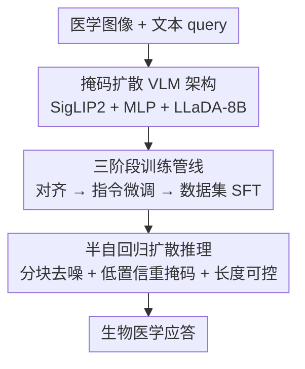

# LLaDA-MedV: Exploring Large Language Diffusion Models for Biomedical Image Understanding

**会议**: CVPR 2026  
**论文**: [CVF Open Access](https://openaccess.thecvf.com/content/CVPR2026/html/Dong_LLaDA-MedV_Exploring_Large_Language_Diffusion_Models_for_Biomedical_Image_Understanding_CVPR_2026_paper.html)  
**代码**: https://github.com/LLM-VLM-GSL/LLaDA-MedV  
**领域**: 医学图像 / 生物医学多模态  
**关键词**: 掩码扩散模型、生物医学 VLM、视觉指令微调、医学 VQA、响应长度可控

## 一句话总结
把通用域的掩码扩散语言模型 LLaDA 通过视觉指令微调首次搬进生物医学影像理解领域，得到第一个扩散式生物医学 VLM——在开放式医学对话上超过 LLaVA-Med，在三个 VQA benchmark 的闭式子集上刷新 SOTA，还能显式控制响应长度生成更详尽的答案。

## 研究背景与动机
**领域现状**：生物医学 VLM 这几年进步明显，但几乎被自回归模型（ARM，如 LLaVA-Med、BiomedGPT）垄断——它们擅长基于视觉理解做文本生成。与此同时，通用域里掩码扩散模型（MDM，尤其是把 MDM 扩到 8B 的 LLaDA）已证明在语言生成上具备与 LLaMA3 级 ARM 竞争的可扩展性。

**现有痛点**：(1) 绝大多数扩散式语言模型只停留在纯文本，多模态、尤其是生物医学多模态几乎没人碰；(2) ARM 在生物医学场景里**控制响应长度很不可靠**——LLaVA-Med 经常因提前预测出 EOS 而草草收尾，答案短、信息少，即便加 system prompt 要求「至少 200 词」也基本无效。

**核心矛盾**：扩散语言模型在通用域已展现优势，但能不能、以及怎么迁移到生物医学影像理解，没人系统回答过；通用域与生物医学域之间存在巨大数据/概念鸿沟。

**本文目标**：回答三个关键问题——通用域扩散语言模型的成功如何迁移到生物医学影像理解？为什么扩散范式对生物医学视觉-语言建模有前景？开发有效的生物医学扩散 VLM 需要哪些设计原则？

**切入角度**：复用 LLaVA 式视觉指令微调的模块化范式（语言骨干 + 视觉编码器 + 投影器），把语言骨干换成掩码扩散模型 LLaDA，看它在医学影像上能否兼顾质量与可控性。

**核心 idea**：用「掩码扩散语言骨干 + 视觉指令微调」造出第一个生物医学扩散 VLM（LLaDA-MedV），并系统剖析训练/推理两端的关键设计因子。

## 方法详解

### 整体框架
LLaDA-MedV 沿用 LLaVA 的模块化架构：视觉编码器 $g(\cdot)$（SigLIP2）抽图像特征，投影器 $h(\cdot)$（两层 MLP + GELU）把它投到语言嵌入空间，与文本 prompt 拼接后送入**掩码扩散语言骨干**（LLaDA-8B-Instruct）。和 ARM 不同，语言骨干不是逐 token 自回归生成，而是从一条全掩码序列出发、用掩码预测器 $p_\theta$ 迭代去噪重建答案。整体是「架构搭建 → 三阶段训练 → 半自回归推理」的串行流程，下面给框架图（节点名与下方关键设计同名同序）。

### 关键设计

**1. 掩码扩散 VLM 架构：把语言骨干从自回归换成掩码扩散，目标改为「按掩码位置重建答案」**

ARM 逐 token 单向生成，本文的语言骨干 LLaDA 走掩码扩散路线：前向过程把 token 以概率 $t$ 替换为吸收态 mask token $\mathbf{M}$（$q_{t|0}(x^i_t|x^i_0)$ 取 $1-t$ 保持原样、$t$ 变 $\mathbf{M}$），反向过程从全掩码序列出发、用 Transformer（双向注意力）并行预测被掩码内容并逐步精炼。训练时把原始 LLaDA 的掩码预测目标扩展为**以用户 prompt 和视觉特征为条件**：$\mathcal{L}^1_\theta=-\mathbb{E}[\tfrac{1}{t}\sum_{j=1}^{L_{r_0}}\mathbf{1}[r^j_t=\mathbf{M}]\log p_\theta(r^j_0|X_v,u_0,r_t)]$，即只对答案里被掩码的位置算损失、让 $p_\theta$ 基于 prompt+图像恢复它们。双向注意力 + 并行去噪正是后面「长度可控」的根。

**2. 三阶段训练管线：对齐 → 端到端指令微调 → 数据集专项 SFT，且初始化要选对**

直接从零训 VLM 代价高，作者按递进目标分三阶段：**Stage 1 生物医学语义对齐**——冻结视觉塔和语言骨干，只训轻量 MLP 投影器（用 600k 对齐图文对），让视觉特征对齐到生物医学概念；**Stage 2 端到端视觉指令微调**——解冻语言骨干 + 投影器（视觉塔仍冻结），用 60k 多轮 inline-mention 对话教会模型医学视觉理解与连贯应答；**Stage 3 数据集专项 SFT**——在 VQA-RAD/SLAKE/PathVQA 三个 benchmark 训练集上单轮对话微调，让模型能对闭式/开放式问题都给自由作答。一个反直觉但重要的发现：**不能照搬 LLaDA-V 的初始化策略**——用其权重初始化反而损害医学图像理解、诱发重复输出，所以作者刻意避开。

**3. 半自回归扩散推理：分块去噪 + 低置信重掩码，附带「显式控制响应长度」这一独门优势**

推理模拟反向扩散动力学：从全掩码答案开始，$p_\theta$ 渐进重建并配合重掩码。两个关键策略：**低置信重掩码**——每步只把置信度（$p_\theta$ 值）最低的 token 重新掩码，保住高置信内容；**半自回归生成**——把长度 $L$ 的响应切成 $L/B$ 个块（块长 $B$），从左到右逐块生成，每块做 $Z\cdot B/L$ 步采样。因为序列从「固定长度的全掩码」起步、逐步填充，模型天然能**显式控制输出长度**——这正是 ARM 做不到的：LLaVA-Med 平均每答仅 ~36 词且加 prompt 也压不动，LLaDA-MedV 能稳定产出更长、信息更全的回答（如不仅说"是 PET-CT"还解释 PET 与 CT 如何结合）。

### 损失函数 / 训练策略
核心目标即条件掩码预测损失 $\mathcal{L}^1_\theta$（见设计 1）；语言骨干 LLaDA-8B-Instruct，视觉塔 SigLIP2，投影器两层 MLP。三阶段数据量：Stage1 600k 对齐图文对、Stage2 60k 多轮对话、Stage3 三个 VQA 训练集。开放式对话评测设 $L=256,B=64,Z=256$；下游 VQA 用 $L=B=Z=64$ 提效。全程 4×A100-80G 训练。

## 实验关键数据

### 主实验

开放式生物医学对话（用 GPT-4.1-mini 当裁判，相对 GPT-4 参考答案打分，越高越好）：

| 模型 | Overall | 说明 |
|------|---------|------|
| LLaMA | 27.824 | 通用 ARM 基线 |
| LLaVA | 34.653 | 通用 VLM |
| LLaVA-Med | 44.750 | 主流医学 ARM VLM |
| MedVLM-R1 | 50.154 | 带推理步医学 VLM |
| LLaDA-V | 50.738 | 通用域扩散 VLM |
| **LLaDA-MedV（本文）** | **52.605** | 相对 LLaVA-Med +7.855%、相对 LLaDA-V +1.867% |

下游 VQA（开放式用 token-recall，闭式用 accuracy）：

| 模型 | VQA-RAD Closed | SLAKE Closed | PathVQA Closed |
|------|------|------|------|
| LLaVA-Med | 84.19 | 85.34 | 91.21 |
| M2I2 | 83.50 | 91.10 | 88.00 |
| **LLaDA-MedV（本文）** | **84.93** | **92.31** | **95.15** |

三个 benchmark 的**闭式子集全部刷新 SOTA**；但开放式子集（如 VQA-RAD Open 45.60、PathVQA Open 31.96）反而不占优。

### 消融实验

响应长度 / 采样步数分析（OE 对话，193 题）：

| 配置 | 词/答(W/Q) | 采样步 Z | Overall |
|------|------|------|------|
| LLaVA-Med | 36.332 | — | 44.750 |
| LLaVA-Med200（prompt 要求≥200词） | 40.922 | — | 44.582 |
| LLaDA-MedV (Z=256) | 166.585 | 256 | **52.605** |
| LLaDA-MedV (Z=128) | 170.399 | 128 | 44.276 |
| LLaDA-MedV (Z=64) | 172.839 | 64 | 28.523 |
| LLaDA-MedV (Z=16) | 192.09 | 16 | 13.525 |

> W/Q = 平均每答词数，T/Q = 每题响应耗时(秒)，T/W = 每词耗时，Z = 推理采样步数。

### 关键发现
- **长度可控是扩散范式的结构性优势**：LLaVA-Med 平均仅 36 词、加 system prompt 也只到 ~40 词；LLaDA-MedV 稳定输出 ~166 词且更详尽，这直接转化成更高的自动评测分。
- **采样步数 Z 是关键超参**：固定 $L=256,B=64$，Z 从 256 降到 16，Overall 从 52.6 一路崩到 13.5——步数太少时去噪不充分、输出质量与多样性急剧恶化，尤其长序列更敏感。
- **闭式强、开放式弱的反差**：LLaDA 缺后训练（无 RL / 偏好对齐），难把开放式问题建模成「在预定义答案集上分类」，所以闭式刷 SOTA 但开放式 recall 偏低——这是 backbone 后训练不足的直接代价。
- **初始化与领域微调都很关键**：照搬 LLaDA-V 初始化会触发重复输出、损害医学理解；正确的初始化 + 领域 SFT 才稳。

## 亮点与洞察
- **范式层面的「第一个」**：首次把掩码扩散语言模型落到生物医学 VLM，证明扩散范式不止能做文本，也能做需要视觉 grounding 的医学生成，给被 ARM 垄断的领域开了新路。
- **「响应长度可控」是扩散结构带来的免费红利**：从固定长度全掩码起步迭代填充，天然支持长度控制——这对要求详尽答案的临床场景（要给出潜在病因、类别、建议）特别有用，可迁移到任何需要可控篇幅的生成任务。
- **诚实暴露 trade-off**：作者明确指出开放式 VQA 弱因 backbone 缺后训练，并指向 RLHF 作为后续方向，而非藏着掖着，这种自洽分析对后人很有参考价值。
- **采样步-质量曲线**给出了部署时的实操参数指引：少步省时但显著掉质，长序列尤甚。

## 局限与展望
- **开放式 VQA 不占优**：backbone（LLaDA）缺 RL/偏好后训练，难做预定义答案集上的分类式作答，open-form recall 落后于 ARM 基线。
- **评测裁判依赖 GPT-4.1-mini**：原 GPT-4-0314 不可用而换裁判模型，虽重测所有基线保证公平，但 AI 裁判本身非完美评估者。
- **采样步数与质量强耦合**：要好结果需较多步（Z=256），推理成本上升；少步则质量骤降，部署时面临速度-质量取舍。
- **作者展望**：用 RLHF 等后训练提升指令遵循与答案格式化能力，改善开放式表现。

## 相关工作与启发
- **vs LLaVA-Med（自回归医学 VLM）**: 同走视觉指令微调路线，但本文骨干是掩码扩散而非 ARM；优势在响应更长更详、长度可控、开放式对话与闭式 VQA 多数更高，劣势在开放式 VQA recall 偏低（后训练不足）。
- **vs LLaDA-V（通用域扩散 VLM）**: 本文把它迁到生物医学并做三阶段领域 SFT，开放式对话 +1.867%；且发现不能直接用其权重初始化（会致重复输出），是迁移时的关键坑。
- **vs MedVLM-R1（带推理步的医学 VLM）**: 本文不靠显式 think/answer 推理标签、仅靠扩散去噪即超过它，说明范式本身的生成能力贡献显著。
- **vs BiomedGPT（从零训 GPT 式 ARM）**: 本文复用预训练骨干 + 指令微调，远比从零训省算力，且引入了 ARM 不具备的长度可控特性。

## 评分
- 新颖性: ⭐⭐⭐⭐⭐ 首个生物医学掩码扩散 VLM，开辟被 ARM 垄断领域的新范式
- 实验充分度: ⭐⭐⭐⭐ 开放式对话 + 三 VQA + 训练/推理分析较系统，但开放式 VQA 弱项未解决、裁判模型有局限
- 写作质量: ⭐⭐⭐⭐ 三问题驱动、分析诚实自洽，公式与流程清晰
- 价值: ⭐⭐⭐⭐ 为扩散式生物医学 VLM 提供首个可复现基线与设计洞察，开源模型与代码

<!-- RELATED:START -->

## 相关论文

- [\[CVPR 2026\] MLLM-HWSI: A Multimodal Large Language Model for Hierarchical Whole Slide Image Understanding](mllm-hwsi_a_multimodal_large_language_model_for_hierarchical_whole_slide_image_u.md)
- [\[CVPR 2026\] MedMO: Grounding and Understanding Multimodal Large Language Model for Medical Images](medmo_grounding_and_understanding_multimodal_large_language_model_for_medical_im.md)
- [\[CVPR 2026\] From Panel to Pixel: Zoom-In Vision-Language Pretraining from Biomedical Scientific Literature](from_panel_to_pixel_zoom-in_vision-language_pretraining_from_biomedical_scientif.md)
- [\[CVPR 2026\] OralGPT-Omni: A Versatile Dental Multimodal Large Language Model](oralgpt-omni_a_versatile_dental_multimodal_large_language_model.md)
- [\[CVPR 2026\] fMRI-LM: Towards a Universal Foundation Model for Language-Aligned fMRI Understanding](fmri-lm_towards_a_universal_foundation_model_for_language-aligned_fmri_understan.md)

<!-- RELATED:END -->
