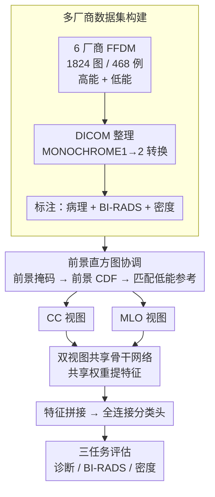

# LUMINA: A Multi-Vendor Mammography Benchmark with Energy Harmonization Protocol

**会议**: CVPR 2026  
**arXiv**: [2603.14644](https://arxiv.org/abs/2603.14644)  
**代码**: [有](https://github.com/NUBagciLab/LUMINA)  
**领域**: 医学图像  
**关键词**: 乳腺X线摄影, 多厂商数据集, 能量协调, 直方图匹配, benchmark

## 一句话总结

提出 LUMINA 多厂商乳腺 FFDM 数据集（468 例患者、1824 张图像），附带前景像素直方图匹配的能量协调预处理方法，在诊断/BI-RADS/密度三任务上系统评估了 CNN 与 Transformer 模型。

## 研究背景与动机

现有公开乳腺 X 线数据集（如 CBIS-DDSM、INbreast）在规模、临床标注和厂商多样性上存在明显不足：CBIS-DDSM 基于老旧的屏幕胶片扫描（SFM），INbreast 仅包含 115 例患者。多厂商采集系统因能量设置（高能/低能）和厂商特有处理流程不同，导致图像外观和强度分布存在显著的域漂移（domain shift），模型在跨厂商场景下泛化能力差。本文的动机是：(1) 构建一个注重厂商多样性和能量元数据的 FFDM 基准数据集；(2) 提出一种模型无关的前景直方图协调方法来消除厂商/能量漂移。

## 方法详解

### 整体框架

LUMINA 既是数据集也是方法论：它要补上现有乳腺 X 线公开数据集"规模小、标注少、厂商单一"的缺口，同时给出一个能抹平厂商/能量域漂移的预处理。整条工作流分三步——先做**多厂商数据集构建**（6 个厂商共 1824 张 FFDM，带病理确认的良恶性标签、BI-RADS 评分和密度标注）；再做**前景直方图协调**（Energy Harmonization），把所有图像对齐到低能参考分布；最后用**双视图共享骨干网络**（CC + MLO 两视图过同一套共享权重）在诊断、BI-RADS 分类、密度预测三个临床任务上做基准评估，对比 CNN（ResNet-50、DenseNet-121、EfficientNet-B0）和 Transformer（Swin-T）。

### 关键设计

**1. 多厂商数据集构建：用厂商和能量元数据填补现有基准的多样性缺口**

CBIS-DDSM 基于老旧屏幕胶片、INbreast 只有 115 例，跨厂商泛化根本无从评测。LUMINA 收集 IMS、Metaltronica、FUJIFILM、Siemens、Carestream、GE 六个厂商的数据，共 468 例患者（250 良性、218 恶性），12-14 bit 深度的 DICOM 格式，标注涵盖病理确认结果、BI-RADS 0-6 级和乳腺密度 A-D 级，并把 FUJIFILM 的 MONOCHROME1 统一转成 MONOCHROME2。厂商多样性加上能量元数据，让它成为研究域漂移的合适底座。

**2. 前景直方图协调：只对乳腺区域做 CDF 匹配，绕开大片黑背景的干扰**

不同厂商和高/低能设置让图像强度分布差异很大，但标准直方图匹配会被 FFDM 里大面积的零值黑背景带偏。LUMINA 的关键改动是只匹配前景：定义前景掩码 $M_s = \{(x,y) \mid \mathbf{I}_s(x,y) > 0\}$，分别算源图和参考图的前景直方图 $H_s(k), H_r(k)$，归一化成 CDF $\bar{C}_s(p), \bar{C}_r(q)$，再用映射 $\mathcal{T}(p) = \arg\min_q |\bar{C}_s(p) - \bar{C}_r(q)|$ 做强度变换；参考直方图取自低能 FFDM 子集，用 12-bit bins 保细节。排除背景这一步看似朴素，却正好解决了乳腺图像背景占比过大、把匹配统计量"稀释"掉的痛点，因此能稳定对齐前景强度。

**3. 双视图共享骨干网络：用共享权重在小数据上抗过拟合**

CC（头尾位）和 MLO（斜位）两视图信息互补，但各配一套权重在小数据集上容易过拟合、参数也翻倍。LUMINA 让两视图过同一套共享权重的骨干提取特征，拼接后经全连接层分类。共享权重比独立权重少 48% 参数（4.34M vs 8.34M），性能却相当甚至更好，在 468 例这种规模下尤其划算。

### 损失函数 / 训练策略

- 标准分类交叉熵损失
- AdamW 优化器：CNN 用 $\text{lr}=1 \times 10^{-3}$，Swin-T 用 $\text{lr}=1 \times 10^{-5}$
- 100 epochs，每 30 epochs 学习率衰减 0.1，weight decay $1 \times 10^{-5}$
- 5 折交叉验证，以最佳验证 AUC 选模型
- 数据增强仅使用水平翻转和尺寸调整，灰度图复制三通道
- PyTorch + CUDA 确定性标志以确保结果可复现
- 训练环境：8 × NVIDIA A6000 GPU

## 实验关键数据

### 主实验

| 数据集/任务 | 指标 | 本文最优 | 之前SOTA参考 | 说明 |
|------------|------|----------|-------------|------|
| 诊断 (Two-view, 512²) | AUC | **93.54%** (EfficientNet-B0) | — | 双视图+高分辨率最优 |
| 诊断 (Single, 512²) | AUC | 92.13% (EfficientNet-B0) | — | 单视图次优 |
| BI-RADS 二分类 (224²) | AUC | **92.80%** (EfficientNet-B0) | — | 低/高风险分类 |
| BI-RADS 三分类 (224²) | AUC | 83.27% (EfficientNet-B0) | — | 低/中/高风险 |
| 密度预测 (224²) | Macro-AUC | **89.43%** (Swin-T) | — | Transformer 更适合密度 |

### 消融实验

| 配置 | 关键指标 (AUC) | 说明 |
|------|---------------|------|
| 共享骨干 EfficientNet-B0 (224²) | 92.99% | 参数 4.34M |
| 独立骨干 EfficientNet-B0 (224²) | 93.54% | 参数 8.34M，多一倍参数但性能持平 |
| 原始图像（无协调） | 基线 | 各任务AUC均低于协调后 |
| 前景直方图协调 | +提升 | ACC/AUC/F1全面提升，Grad-CAM更聚焦 |

### 关键发现

- 双视图模型始终优于单视图，证实 CC+MLO 互补信息的价值
- EfficientNet-B0 在诊断和 BI-RADS 任务中最优（参数仅 4M），Swin-T 在密度预测中最优
- 更高输入分辨率（512²）通常带来性能提升，但 224² 仍有竞争力且计算开销显著降低
- 直方图协调不仅提升指标，还改善 Grad-CAM 注意力聚焦，使模型更关注病灶区域
- 低能图像在协调后获益最大（因高能图像在数据中占主导）

## 亮点与洞察

- **前景掩码的实用价值**: 简单但有效的 idea——排除背景像素后再做直方图匹配。这个看似朴素的设计在乳腺 X 线场景中至关重要，因为 FFDM 图像有大片黑色背景
- **模型无关的预处理**: 该协调方法可作为轻量级预处理步骤应用于任意骨干网络，工程落地友好
- **数据集的系统性**: 完整标注（病理+BI-RADS+密度）+ 厂商/能量元数据的组合在现有数据集中独一无二
- **临床洞察**: EfficientNet-B0 在诊断任务中以最少参数胜出，Swin-T 因全局注意力在密度预测中更适合——揭示了任务类型与模型选择的关系

## 局限与展望

- 数据集规模仍偏小（468 例），与大规模数据集（EMBED 50 万张）相比有差距
- 仅来自土耳其单一机构，患者人群多样性有限
- 协调参考分布选择为低能 FFDM 的代表子集，缺乏自适应参考选择机制
- 未探索更高级的域适应方法（如对抗训练、频域对齐）
- 未与已有的跨厂商方法（如 ComBat、HarmoFL）做直接实验对比
- 四视图模型表现反而不如双视图，可能因参数过多导致小数据集过拟合

## 相关工作与启发

- ComBat 基于经验贝叶斯修正 batch effect，但作用于特征空间而非像素空间
- HarmoFL 在联邦学习中通过频域振幅归一化降低跨站点变异
- 本文与 VinDr-Mammo（5000 患者、越南单厂商）、RSNA（1970 患者）等形成互补——LUMINA 虽规模小但厂商更多样
- 本文的像素空间方法更直观、无需训练，可与特征空间方法互补
- 启发：对于多中心医学影像研究，轻量级的像素空间预处理可能比复杂的域适应方法更实用
- 与 MIL-PF（同为 CVPR 2026）结合使用有潜力——先用 LUMINA 协调预处理，再用冻结编码器+MIL 分类

## 评分

- 新颖性: ⭐⭐⭐ 数据集贡献扎实，但方法（前景直方图匹配）技术上偏简单
- 实验充分度: ⭐⭐⭐⭐ 三任务、多模型、多分辨率、消融+可视化+能量分析均覆盖
- 写作质量: ⭐⭐⭐⭐ 表格和图表丰富，实验设置透明，数据集对比表格有说服力
- 价值: ⭐⭐⭐⭐ 多厂商基准数据集对社区有直接贡献，已在 OSF/Kaggle/GitHub 三平台公开

<!-- RELATED:START -->

## 相关论文

- [\[CVPR 2026\] MIL-PF: Multiple Instance Learning on Precomputed Features for Mammography Classification](milpf_multiple_instance_learning_on_precomputed_fe.md)
- [\[CVPR 2026\] A protocol for evaluating robustness to H&E staining variation in computational pathology models](a_protocol_for_evaluating_robustness_to_he_stainin.md)
- [\[CVPR 2026\] MedGEN-Bench: Contextually Entangled Benchmark for Open-Ended Multimodal Medical Generation](medgen-bench_contextually_entangled_benchmark_for_open-ended_multimodal_medical_.md)
- [\[ECCV 2024\] Energy-induced Explicit Quantification for Multi-modality MRI Fusion](../../ECCV2024/medical_imaging/energy-induced_explicit_quantification_for_multi-modality_mri_fusion.md)
- [\[NeurIPS 2025\] Pancakes: Consistent Multi-Protocol Image Segmentation Across Biomedical Domains](../../NeurIPS2025/medical_imaging/pancakes_consistent_multi-protocol_image_segmentation_across_biomedical_domains.md)

<!-- RELATED:END -->
