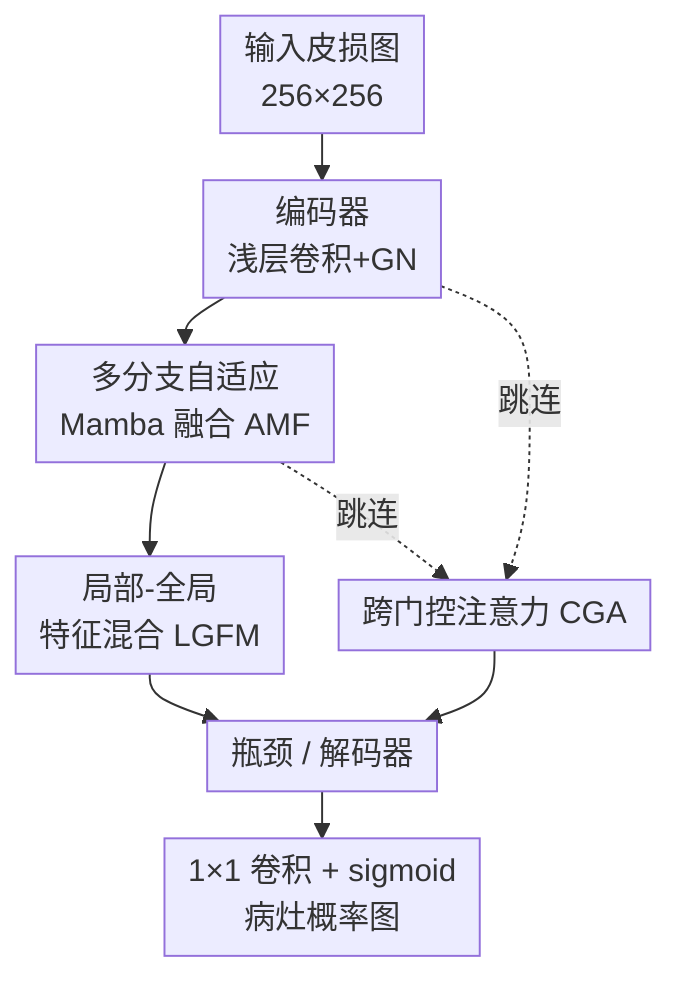

# MambaLiteUNet: Cross-Gated Adaptive Feature Fusion for Robust Skin Lesion Segmentation

**会议**: CVPR 2026  
**arXiv**: [2604.20286](https://arxiv.org/abs/2604.20286)  
**代码**: https://github.com/maklachur/MambaLiteUNet (有)  
**领域**: 医学图像  
**关键词**: 皮肤病灶分割, Vision Mamba, 轻量化 U-Net, 跨门控注意力, 自适应特征融合

## 一句话总结
把 Vision Mamba 状态空间建模塞进一个仅 0.494M 参数的轻量 U-Net，再用三个模块（多分支自适应 Mamba 融合 AMF、局部-全局特征混合 LGFM、跨门控注意力 CGA）分别强化多尺度融合、局部纹理与全局上下文交互、以及跳连精炼，在 ISIC2017/2018、HAM10000、PH2 四个皮肤病灶分割基准上取得平均 87.12% IoU / 93.09% Dice，超过一众 SOTA，且参数比 U-Net 少 93.6%、GFLOPs 少 97.6%。

## 研究背景与动机
**领域现状**：皮肤病灶分割是计算机辅助皮肤癌早筛的基础任务，主流做法长期是 U-Net 这类编码器-解码器卷积网络——擅长捕捉局部纹理、支持密集预测。近年 Transformer 用自注意力补全了全局上下文建模，而状态空间模型（SSM，尤其是 Mamba 系视觉架构）则以线性复杂度建模长程依赖，成了兼顾效率与全局感受野的新选择。

**现有痛点**：当前的轻量分割模型为了压参数、压算力，往往牺牲了对**细小病灶边界和纹理的刻画能力**——而边界的细微不规则恰恰是早期黑色素瘤恶性程度的关键信号。卷积模型建不了长程依赖，对不规则边界、断裂区域、低对比病灶力不从心；Transformer 的二次复杂度又让它难以部署到移动端/床旁这类算力受限场景。更具体地，已有的 Mamba 分割模型大多沿用**静态特征融合 + 常规跳连**，限制了多尺度表示学习，也削弱了困难区域的边界精修。

**核心矛盾**：精度与效率之间的 trade-off——要么轻量但边界糊，要么精度高但跑不动。同时，已有 Mamba 方法的固定融合策略没能把"长程上下文"用在刀刃上。

**本文目标**：拆成三个子问题——(1) 如何在多尺度上动态融合特征而非静态拼接；(2) 如何在同一模块里同时保住局部纹理细节和全局上下文；(3) 如何让编码器-解码器之间的跳连只传"有用的前景信息"、滤掉背景噪声。

**切入角度**：作者认为 Mamba 的线性长程建模能力应该被嵌进 U-Net 的每个关键交互点（深层 stage、跳连），而不是简单堆 Mamba 层；并且融合、混合、跳连这三处都应该用**可学习的门控**来自适应地决定信息流向。

**核心 idea**：用三个以 Mamba block 为内核的轻量门控模块（AMF / LGFM / CGA）改造 U-Net 的特征融合、局部-全局混合与跳连，在不显著增加算力的前提下提升病灶表示与边界刻画。

## 方法详解

### 整体框架
MambaLiteUNet 遵循 U-Net 式五阶段编码器-解码器加一个瓶颈层的结构，通道容量为 $\{16,32,48,64,96,128\}$。浅层 stage 用标准卷积 + Group Normalization 稳住低层纹理，下采样用 max pooling；**深层 stage 才引入 AMF 和 LGFM** 做更强的特征学习；每条跳连在与解码器特征融合前先经 CGA 精炼；最后一层 $1\times1$ 卷积 + sigmoid 输出病灶概率图。三个模块的共同内核是一个从 VMamba 派生的 **Mamba block**：对层归一化后的 token $K\in\mathbb{R}^{B\times N\times C}$（$N=H\times W$），一路算门控图 $G=\mathrm{SiLU}(K W_g)$，另一路过投影、SiLU、$3\times3$ 深度卷积和 SS2D（四方向扫描 + 独立 S6 块聚合全局上下文），最后逐元素相乘 $Y=G\odot H$，在线性时间内获得近似 Transformer 的感受野。

### 关键设计

**1. 自适应多分支 Mamba 特征融合 AMF：用分组并行 + 双阶段门控替换静态拼接**

针对"已有 Mamba 方法静态融合、限制多尺度表示"的痛点，AMF 把输入 $X\in\mathbb{R}^{B\times C\times H\times W}$ 的通道**均分成四组** $\{X_k\}_{k=1}^4$（每组 $C/4$ 通道），每组各过一个独立 Mamba block 捕捉长程依赖，并加一个**可学习标量缩放残差**保住低层信息：$Z_k=\mathrm{Mamba}_k(X_k)+\alpha X_k$，其中 $\alpha$ 初始化为 0，让网络在训练中逐步决定残差贡献的多少（一开始几乎全靠主路、后期再放开残差）。拼回 $Z_{\mathrm{cat}}\in\mathbb{R}^{B\times C\times H\times W}$ 后接**两阶段门控**：空间(S)阶段算 $S=\sigma(\mathrm{PW}(\mathrm{DW}_{3\times3}(Z_{\mathrm{cat}})))$，逐分支门控 $Z_k^S=S_k\odot Z_k$；变换(T)阶段再用一对深度卷积+点卷积带残差精炼得到 $T$，最后 $F_{\mathrm{int}}=T+X$ 送入 LGFM。这种"分组并行 + 双门控"让模型以很轻的代价学到逐通道重要性，比一刀切的静态拼接更能兼顾细结构和全局上下文——消融里四分支是甜点配置（见下）

**2. 局部-全局特征混合 LGFM：在同一模块里双路并行保纹理、抓长程**

病灶边界精修既需要局部纹理也需要长程上下文，但二者通常分属卷积和注意力两套模块、难以协同。LGFM 直接把两条路并起来：一路用 $3\times3$ 深度卷积提局部模式 $F_\ell$，另一路用 8 头多头自注意力（保证各 stage 的 $C$ 能被 8 整除，head_dim $=C/8$）把空间展平成 token $N=H\times W$、投影 Q/K/V 做注意力后 reshape 回 $\mathbb{R}^{B\times C\times H\times W}$ 得 $F_g$；再通道拼接后投影融合：

$$F_{\ell g}=\mathrm{DW}_{3\times3}\big(\mathrm{GELU}(\mathrm{LN}(\mathrm{Conv}_{1\times1}([F_\ell,F_g])))\big)$$

其中 $\mathrm{Conv}_{1\times1}$ 把 $2C$ 通道压回 $C$。这条双路设计同时保住病灶纹理与长程特征，是边界精确刻画的关键。

**3. 跨门控注意力 CGA：让跳连互相做门、只传前景**

常规跳连把编码器特征原样塞给解码器，背景噪声也一并带过去，削弱边界一致性。CGA 把编码器特征 $x$ 和解码器特征 $g$ 各分成四对 $\{x_i,g_i\}$，每对先各过一个 Mamba block 得 $h_i^{(x)}$、$h_i^{(g)}$，再各过 $3\times3$ 深度卷积得 $g'_i$、$x'_i$，然后做**成对交叉门控**——用对方的 sigmoid 响应给自己加权：

$$\mathrm{cross}_i=h_i^{(x)}\odot\sigma(g'_i)+h_i^{(g)}\odot\sigma(x'_i)$$

把各对拼成 $Z_{\mathrm{cat}}$ 后生成注意力掩码 $\psi=\sigma(\mathrm{Conv}_{3\times3}(\mathrm{ReLU}(\mathrm{BN}(Z_{\mathrm{cat}}))))$，再施加到编码器特征上 $x_{\mathrm{att}}=\psi\odot x$ 送入下一级解码器。"用解码器语义去门控编码器细节、反之亦然"的双向机制，让跳连给前景病灶加权、给背景减权，从而在与解码器输出融合前就压掉背景噪声、强化病灶结构

### 损失函数 / 训练策略
训练目标为二元交叉熵 + Dice 的组合 $L_{\mathrm{Total}}=L_{\mathrm{BCE}}+L_{\mathrm{Dice}}$。所有图像归一化、resize 到 $256\times256$ 并做增广；单卡 RTX 3090 Ti，AdamW 优化器，初始学习率 0.001 经余弦退火降到 0.00001，batch size 8，训 300 epoch。评测指标包括 IoU、DSC、Accuracy、Sensitivity、Specificity 和 HD95。

## 实验关键数据

### 主实验
四个基准上的平均性能（Table 3，所有 baseline 用官方实现、相同 split 复现，五次平均）：

| 模型 | 类别 | 平均 IoU | 平均 DSC | 参数(M) | GFLOPs |
|--------|------|---------|---------|---------|--------|
| U-Net | CNN | 79.40 | 88.48 | 7.773 | 13.758 |
| EGE-UNet | CNN | 84.41 | 91.51 | 0.053 | 0.072 |
| VM-UNet2 | Mamba | 84.03 | 91.30 | 22.771 | 4.400 |
| LightM-UNet | Mamba | 83.90 | 91.21 | 0.403 | 0.391 |
| LB-UNet | CNN | 85.02 | 91.87 | 0.038 | 0.098 |
| ULVM-UNet | Mamba | 84.89 | 91.80 | 0.049 | 0.060 |
| **MambaLiteUNet (本文)** | Mamba | **87.12** | **93.09** | 0.494 | 0.326 |

单数据集上：ISIC2017 达 85.55% IoU / 92.21% DSC（较次优 ULVM-UNet +2.50 / +1.47）；ISIC2018 达 83.60% / 91.07%（较 ULVM-UNet +2.96 / +1.78）；HAM10000 达 90.77% / 95.16%（较 LB-UNet +1.44 / +0.80）；PH2 达 88.54% / 93.92%（较 LB-UNet +1.42 / +0.80）。平均较 LB-UNet +2.10 IoU / +1.22 DSC。相对 U-Net，参数减 93.6%、GFLOPs 减 97.6%。

**域泛化（只训 NV、测六类未见病灶，Table 5）**：本文取得 77.61% IoU / 87.23% DSC，六类里四类最优，MEL 上 93.90% DSC、BKL 上 91.13% DSC，在分布漂移下最稳健。

### 消融实验
模块逐一叠加（ISIC2018，Table 7）：

| 配置 | 参数(M) | GFLOPs | ISIC2018 IoU | DSC |
|------|---------|--------|--------------|-----|
| 三模块全无 | 0.425 | 0.938 | 80.59 | 89.25 |
| 仅 AMF | 0.226 | 0.830 | 82.57 | 90.45 |
| 仅 LGFM | 0.180 | 0.794 | 82.25 | 90.26 |
| 仅 CGA | 0.593 | 0.478 | 82.61 | 90.48 |
| AMF + LGFM | 0.326 | 0.238 | 82.90 | 90.65 |
| **AMF + LGFM + CGA (Full)** | 0.494 | 0.326 | **83.60** | **91.07** |

分支数消融（ISIC2018，Table 8）：1/2/4/8/16 分支对应 IoU 81.74 / 82.50 / **83.60** / 82.38 / 81.24——**四分支是甜点**，再多反而掉点且参数翻倍。损失消融（Table 6）：仅 BCE 84.88/91.82、仅 Dice 85.15/91.98、BCE+Dice **85.55/92.21**（ISIC2017），二者结合最优。

### 关键发现
- 单个模块里 CGA 单用即把 ISIC2018 IoU 从 80.59 拉到 82.61，三模块叠满到 83.60，说明跳连精炼对边界质量贡献突出，且模块间互补。
- 分支数不是越多越好：4 分支后再加到 8、16，IoU 反降、参数从 0.494M 涨到 0.949M，多分支带来的冗余得不偿失。
- 在低对比、毛发遮挡、不规则形状区域，本文能抓住其他模型漏掉的细边界（定性图 Figure 4）；域泛化下在临床上最难的 MEL / BKL 类别表现尤其突出。

## 亮点与洞察
- **$\alpha$ 初始化为 0 的可学习残差缩放**：让 AMF 的分支残差在训练初期"先不干扰"主路、后期再逐步放开，是一个稳训练又不丢低层信息的小 trick，可迁移到任何"主路+残差旁路"的融合模块。
- **跳连做双向交叉门控（CGA）**：不再把编码器特征原样传给解码器，而是让编码器细节和解码器语义互相当门——这种"互为 gate"的思路比单向注意力门（如经典 Attention U-Net）更对称，能同时压背景、提前景，值得借鉴到任何编码器-解码器跳连。
- **以同一个 Mamba block 当三模块共享内核**：AMF 和 CGA 都复用同款 Mamba block，既统一了长程建模能力又控住了参数，体现了"轻量化 = 复用而非堆叠"的设计哲学。

## 局限与展望
- 仅在 $256\times256$ 单一分辨率、二分类（病灶 vs 背景）皮损分割上验证，更高分辨率或多类别病灶分割是否同样划算未知。
- 三模块都依赖 Mamba/SS2D 内核，对部署平台的算子支持有要求；论文未给真实移动端/边缘设备的实测延迟，"轻量"主要靠参数和 GFLOPs 论证（⚠️ 低 GFLOPs 不一定等于低实测延迟，Mamba 扫描在某些硬件上未必快）。
- 域泛化测试只覆盖 HAM10000 内六类未见病灶；跨数据集（ISIC2018→PH2）、跨模态（超声 BUS、组织病理 GlaS）结果放在补充材料，正文未展开。
- 改进方向：把多分支数、通道配置做成输入自适应而非固定超参；探索在 3D/视频皮损序列上的扩展。

## 相关工作与启发
- **vs U-Net / EGE-UNet（CNN 轻量分割）**：CNN 系局部性强但建不了长程依赖；本文用 Mamba 补全长程建模，平均 IoU 较 U-Net +7.72、较 EGE-UNet +2.71，代价是参数比 EGE-UNet（0.053M）大一个量级，属于"用 0.5M 量级换更强精度与泛化"。
- **vs VM-UNet / VM-UNet2 / LightM-UNet（Mamba 分割）**：它们多用固定融合 + 标准跳连；本文把静态拼接换成 AMF 的双门控、把常规跳连换成 CGA 交叉门控，在精度全面领先的同时参数比 VM-UNet2（22.7M）小 40 倍。
- **vs ULVM-UNet / LB-UNet（极致轻量 Mamba/CNN）**：它们参数更小（0.04–0.05M）但多尺度表示和边界恢复偏弱；本文以略大的 0.494M 参数换来平均 +2.1 IoU 和更强的域泛化稳健性，定位在"精度优先的轻量段"。

## 评分
- 新颖性: ⭐⭐⭐⭐ 三个门控模块都围绕"自适应替换静态融合/跳连"展开，CGA 的双向交叉门控较新，但整体是模块组合式创新而非范式突破。
- 实验充分度: ⭐⭐⭐⭐⭐ 四基准 + 域泛化 + 模块/分支/通道/损失多组消融，均五次平均、统一复现 baseline，扎实。
- 写作质量: ⭐⭐⭐⭐ 公式与模块描述清晰，pipeline 一图带过，部分跨数据集结果被压进补充材料。
- 价值: ⭐⭐⭐⭐ 0.5M 参数级、精度领先且域泛化强，对算力受限的皮肤科床旁/移动部署有实用价值。

<!-- RELATED:START -->

## 相关论文

- [\[ICLR 2026\] COMPASS: Robust Feature Conformal Prediction for Medical Segmentation Metrics](../../ICLR2026/medical_imaging/compass_robust_feature_conformal_prediction_for_medical_segmentation_metrics.md)
- [\[CVPR 2026\] BackSplit: The Importance of Sub-dividing the Background in Biomedical Lesion Segmentation](backsplit_the_importance_of_sub-dividing_the_background_in_biomedical_lesion_seg.md)
- [\[CVPR 2026\] Building Robust Vision Encoders for Cross-Dataset Evaluation in Immunofluorescent Microscopy](building_robust_vision_encoders_for_cross-dataset_evaluation_in_immunofluorescen.md)
- [\[CVPR 2026\] CRFT: Consistent-Recurrent Feature Flow Transformer for Cross-Modal Image Registration](crft_consistent-recurrent_feature_flow_transformer_for_cross-modal_image_registr.md)
- [\[CVPR 2026\] Instruction-Guided Lesion Segmentation for Chest X-rays with Automatically Generated Large-Scale Dataset](instruction-guided_lesion_segmentation_for_chest_x-rays_with_automatically_gener.md)

<!-- RELATED:END -->
