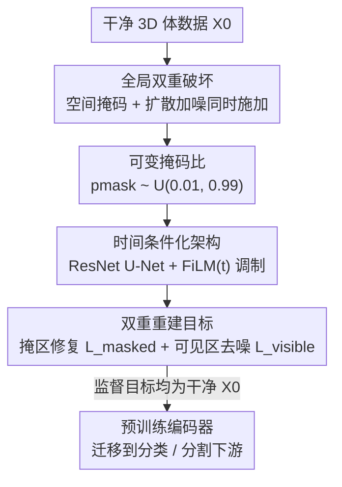

# Masked-Diffusion Autoencoders for 3D Medical Vision Representation Learning

**会议**: CVPR 2026  
**论文**: [CVF Open Access](https://openaccess.thecvf.com/content/CVPR2026/html/Tu_Masked-Diffusion_Autoencoders_for_3D_Medical_Vision_Representation_Learning_CVPR_2026_paper.html)  
**代码**: 项目页 https://jiachentu.github.io/MDAE/ （以原文为准）  
**领域**: 医学图像 / 自监督表示学习  
**关键词**: 3D 医学影像、自监督学习、掩码自编码、扩散去噪、表示学习

## 一句话总结
MDAE 把"空间掩码"和"扩散加噪"两种破坏同时施加到 3D 脑 MRI 体数据上，让一个时间条件化的网络同时学会重建被掩盖区域（抓全局解剖结构）和给可见区域去噪（抓细粒度组织纹理），在 16 个临床基准上把自监督预训练的平均 AUROC 推到域内 73.6%、跨模态 78.6%。

## 研究背景与动机
**领域现状**：3D 医学影像标注昂贵，自监督学习（SSL）成为主流出路。现有 SSL 大致两条路线——基于不变性/对比的方法（SimCLR、VoCo）靠对齐增广视图学表示；掩码图像建模（MAE 及其医学改版）靠高掩码比重建被遮区域。

**现有痛点**：两条路线各有硬伤。对比方法依赖增广，但医学图像里常用增广会破坏诊断信息——颜色抖动会扰乱有诊断意义的强度关系、高斯模糊会抹掉病灶、激进裁剪可能丢掉很小但关键的解剖结构。MAE 为了防止从邻域平凡插值，必须用很高的掩码比（如 75%），这又让模型几乎看不到细粒度纹理。而医学诊断恰恰要求**同时**编码器官级几何结构和体素级纹理。

**核心矛盾**：整体结构（holistic structure）与细粒度纹理（fine texture）之间存在 trade-off——掩码比越高越逼模型做全局推理，但越牺牲对可见纹理的暴露；这个矛盾在以往医学 SSL 里一直没解决。同时，"语义编码器"和"生成模型"长期被认为是两条不相容的路。

**本文目标**：在 3D 医学影像上找到一个判别式 SSL 框架，让它**一次性**既学到全局解剖结构、又学到细粒度纹理。

**切入角度**：2D 自然图像最近的工作（RAE、REPA 等）证明语义目标和生成目标可以互相增益，但这套范式在 3D 医学影像上还是空白。作者由此假设：把掩码（偏结构）和扩散去噪（偏纹理）这两种破坏**叠加**在一起，能逼出互补的学习信号。

**核心 idea**：用"全局双重破坏"（掩码 + 扩散噪声同时施加）代替单一破坏，在一个时间条件化的统一目标里，同时学结构（重建被掩区）和纹理（给可见区去噪）。

## 方法详解

### 整体框架
MDAE 的输入是一个干净的 3D 体数据 $X_0\in\mathbb{R}^{D\times H\times W}$，输出是预测出来的干净体数据 $\hat{X}$；训练目标是让网络从"被双重破坏"的输入里恢复出 $X_0$。整个 pipeline 是：先对体数据同时施加空间掩码和扩散噪声，得到双重破坏输入 $\tilde{X}_t^M$；送进一个用扩散时间步 $t$ 调制的 ResNet U-Net；网络对可见区做去噪、对被掩区做修复，两个目标都以干净体 $X_0$ 为监督，最后线性组合成总损失。预训练完只保留编码器，下游做分类/分割时迁移。

### 关键设计

**1. 全局双重破坏：掩码与扩散噪声同时上，逼出互补信号**

MAE 单靠掩码偏向整体结构、丢纹理；扩散去噪单靠加噪擅长细节、但在医学里多用于合成/重建而非判别式表示学习。MDAE 把两者**叠加**：先用 VE（variance-exploding）方式给整卷加扩散噪声 $\tilde{X}_t = X_0 + \sigma_t Z$（$\sigma_t = t\cdot\sigma_{\max}$，$Z\sim\mathcal{N}(0,I)$），再用块状掩码把部分区域置零，得到双重破坏输入 $\tilde{X}_t^M = M_v\odot\tilde{X}_t$（$M_v$ 是可见掩码）。掩码用的是 $16^3$ 体素的块状（blocky）patch，整块独立以概率 $p_{\text{mask}}$ 被掩，保证被掩区在空间上连续，逼网络做体积级推理而非从紧邻体素插值。这样可见区带噪、被掩区全空，两类区域天然产生"去噪"和"修复"两个互补任务，而且因为可见区也被噪声污染，即使掩码比很低重建也不平凡——这正是它能突破 MAE"必须高掩码比"约束的关键。

**2. 可变掩码比：一个目标里同时覆盖纹理与结构两个尺度**

标准 MAE 必须固定高掩码比（75%），否则模型会从邻块平凡复制。MDAE 因为有扩散噪声托底，可以采用可变掩码比 $p_{\text{mask}}\sim U(p_{\min}, p_{\max})$（论文取 $p_{\min}=0.01$、$p_{\max}=0.99$，⚠️ 以原文为准）。低掩码比时可见上下文多，模型学低层纹理细节；高掩码比时要全局推理，模型学整体解剖结构。两个尺度被统一进同一个预训练目标，消融显示可变掩码优于任何固定比。

**3. 时间条件化架构：让网络按破坏强度自适应切换修复策略**

不同于 MAE 直接处理 $g_\theta(\tilde{X}^M)$，MDAE 把网络写成 $\hat{X} = g_\theta(\tilde{X}_t^M, t)$，把扩散时间步 $t$ 显式喂给网络。$t$ 先经正弦位置编码 + MLP 映射到 256 维嵌入，再在编码器/解码器每个 stage 通过 FiLM 调制注入：$h_{\text{out}} = h_{\text{in}}\odot(\gamma(t_{\text{emb}})+1) + \beta(t_{\text{emb}})$，$\gamma,\beta$ 是学出的缩放/平移。这让网络知道当前噪声有多重，从而在"空间修复"和"强度去噪"之间动态平衡，学到在整个破坏谱上都稳健的表示。

**4. 双重重建目标与极限退化：一个统一损失插值 MAE 与 DSM**

总目标是两个针对不同空间区域的损失的加权和：
$$\mathcal{L}_{\text{MDAE}}(\theta) = \lambda_{\text{masked}}\cdot\mathcal{L}_{\text{masked}}(\theta) + \lambda_{\text{visible}}\cdot\mathcal{L}_{\text{visible}}(\theta)$$
被掩区损失 $\mathcal{L}_{\text{masked}}$ 只在被掩体素 $\Omega_M$ 上算 $\|M\odot(g_\theta(\tilde{X}_t^M,t)-X_0)\|_2^2$（归一化到 $|\Omega_M|$），逼网络从带噪可见上下文推断全局解剖；可见区损失 $\mathcal{L}_{\text{visible}}$ 在可见体素 $\Omega_V$ 上算，带噪声级加权 $w(\sigma_t)$ 使不同噪声级的损失贡献大致恒定、防止高噪样本主导优化，本质等价于按 Tweedie 公式学 score function。两个损失的回归目标都是干净体 $X_0$（不是带噪的 $\tilde{X}_t$），所以网络必须同时学空间修复和强度去噪。这个统一目标还能优雅退化：当 $\sigma_{\max}\to 0$ 时可见损失消失，退化为 MAE；当 $p_{\text{mask}}\to 0$ 时被掩损失消失，退化为 DSM（去噪 score matching）。论文经验取 $\lambda_{\text{masked}}=\lambda_{\text{visible}}=1.0$。

### 损失函数 / 训练策略
预训练数据是 OpenMind 的 114,570 个 3D 脑 MRI 体（来自 34,191 名受试者），全部预处理到 $160^3$ 体素。多通道输入按通道分别施加破坏与重建。下游分类用 mean-pool 编码特征接线性头/微调，分割用 nnUNet 框架、编码器用预训练权重初始化。

## 实验关键数据

### 主实验
评测覆盖 16 个临床基准，分三类场景：域内（预训练见过的 T1/T2）、跨模态泛化（预训练罕见/没见过的 FLAIR、T1-Gd、ASL、SWI）、多模态整合（分类 + 分割）。

| 场景 | 指标 | MDAE | 最强基线 | 提升 |
|--------|------|------|----------|------|
| 域内 6 任务（T1/T2） | 平均 AUROC | 73.6% | MAE 69.5% | +4.1% |
| 域内 6 任务 | 平均 AP | 71.6% | — | — |
| 跨模态 6 任务（OOD） | 平均 AUROC | 78.6% | MAE 70.0% | +8.6% |
| 跨模态 6 任务 | 平均 AUROC | 78.6% | BrainIAC 67.9% | +10.7% |
| BraTS23 肿瘤分型（T1/T2） | AUROC | 96.3%/96.6% | — | — |
| BraTS18 肿瘤分级 | AUROC | 92.1% | — | +2.0% |
| UCSF-PDGM 分割 | Dice/NSD | 85.2%/88.1% | 全部基线 | 领先 |
| BraTS18 分割 | Dice/NSD | 81.4%/75.3% | 全部基线 | 领先 |

在跨模态场景里，连没有医学预训练的通用视觉模型 DinoV2 都拿到 72.1% 平均 AUROC（和领域专用 SSL 相当），而 MDAE 比它再高 6.5%，说明"医学专用双重破坏预训练"确实带来额外价值——这也是提升最显著的地方。

### 消融实验
消融在 OpenMind 10% 子集上预训练 100 epoch、用 BraTS18 LGG-vs-HGG 分类 AUROC 评测，逐一隔离五个设计轴。

| 配置 | 关键指标 | 说明 |
|------|---------|------|
| 双重破坏（掩码 50% + 噪声 75%） | AUROC 0.658 | 协同最优点 |
| 仅高掩码（接近 MAE） | 偏低 | 丢纹理 |
| 仅扩散噪声（接近 DSM） | 偏低 | 缺全局结构 |
| 固定掩码比 | 低于可变 | 无法兼顾两尺度 |
| 可变掩码比 | 最优 | 全量实验也证实 |

### 关键发现
- **掩码与扩散的协同是核心**：参数景观扫描显示，掩码比和最大噪声级 $\sigma_{\max}$ 在中间区域（如掩码 50%、噪声 75%）取得 AUROC 峰值（约 0.658），任一单独破坏都更差，证明两者互补而非冗余。
- **可变掩码 > 固定掩码**：因为有噪声托底，低掩码比也不平凡，模型能在一个目标里同时覆盖纹理（低比）和结构（高比）两个尺度。
- **提升集中在跨模态泛化**：双重破坏学到的结构-纹理表示对预训练没见过的稀有序列更鲁棒，OOD 上 +8.6% 远超域内 +4.1%。

## 亮点与洞察
- **"两种破坏叠加"而非"两个目标拼接"**：很多多目标 SSL 是并联两个独立 loss，MDAE 巧在让噪声破坏改变了掩码任务本身的难度，使低掩码比也能产生有效信号，从机制上解开了 MAE 的高掩码比枷锁。
- **统一目标可证退化为 MAE / DSM**：$\sigma_{\max}\to 0$ 退化 MAE、$p_{\text{mask}}\to 0$ 退化 DSM，说明 MDAE 是这两类经典方法的真正插值，理论上很干净。
- **时间条件化是把扩散思想搬进 SSL 的关键接口**：FiLM 注入 $t$ 让一个网络处理整个破坏谱，这个设计可迁移到其它"多强度破坏"的自监督任务（如可变噪声/可变遮挡的视频或点云预训练）。

## 局限与展望
- 只在脑 MRI 上验证，能否泛化到 CT、病理、其它器官未知；非脑解剖的连续场假设是否成立需进一步检验。
- VE 噪声、掩码块大小 $16^3$、$\lambda$ 取 1.0、$p_{\min}/p_{\max}$ 等超参多为经验设定，跨数据集是否最优存疑（⚠️ 以原文为准）。
- 双重破坏 + 时间条件化增加了预训练计算量；论文也因算力限制未对基础模型在多模态数据上做完整微调对比。
- MGMT 甲基化等部分分子标记任务 AUROC 仍只有 58-60%，绝对值偏低，说明这类弱信号任务远未解决。

## 相关工作与启发
- **vs MAE**: MAE 单一掩码破坏、必须高掩码比、偏结构丢纹理；MDAE 叠加扩散噪声后可用可变（含低）掩码比，同时学结构与纹理，域内 +4.1% AUROC。
- **vs 去噪 score matching（DSM）**: DSM 只去噪、擅细节但缺全局结构推理，且在医学里多用于合成/重建；MDAE 把去噪嵌进掩码自编码框架做判别式表示学习。
- **vs 对比/不变性方法（SimCLR、VoCo）**: 它们依赖增广，而医学增广常破坏诊断强度信息；MDAE 走重建路线、不依赖语义增广。
- **vs 2D 语义-生成互益工作（RAE、REPA、STELLAR）**: 那些工作证明两类目标在 2D 自然图像可互益，MDAE 首次把这套范式落到 3D 医学影像并针对其非物体中心、数据稀缺特性设计。

## 评分
- 新颖性: ⭐⭐⭐⭐⭐ 把掩码与扩散叠加成单一统一目标、可证退化为 MAE/DSM，是干净且原创的 SSL 范式。
- 实验充分度: ⭐⭐⭐⭐⭐ 16 基准、三类场景、五轴消融 + 参数景观扫描，证据扎实。
- 写作质量: ⭐⭐⭐⭐ 公式与极限分析清晰，但部分关键超参与图表细节需查附录。
- 价值: ⭐⭐⭐⭐ 3D 医学 SSL 的实用强基线，跨模态泛化优势明显；但仅脑 MRI 验证、弱信号任务绝对值仍低。

<!-- RELATED:START -->

## 相关论文

- [\[CVPR 2026\] Diffusion MRI Transformer with a Diffusion Space Rotary Positional Embedding (D-RoPE)](diffusion_mri_transformer_with_a_diffusion_space_rotary_positional_embedding_d-r.md)
- [\[CVPR 2026\] Learning Generalizable 3D Medical Image Representations from Mask-Guided Self-Supervision](learning_generalizable_3d_medical_image_representations_from_mask-guided_self-su.md)
- [\[CVPR 2026\] Sketch2CT: Multimodal Diffusion for Structure-Aware 3D Medical Volume Generation](sketch2ct_multimodal_diffusion_for_structure-aware_3d_medical_volume_generation.md)
- [\[ICCV 2025\] An OpenMind for 3D Medical Vision Self-supervised Learning](../../ICCV2025/medical_imaging/an_openmind_for_3d_medical_vision_selfsupervised_learning.md)
- [\[CVPR 2026\] Multimodal Causality-Driven Representation Learning for Generalizable Medical Image Segmentation](multimodal_causal-driven_representation_learning_for_generalizable_medical_image.md)

<!-- RELATED:END -->
