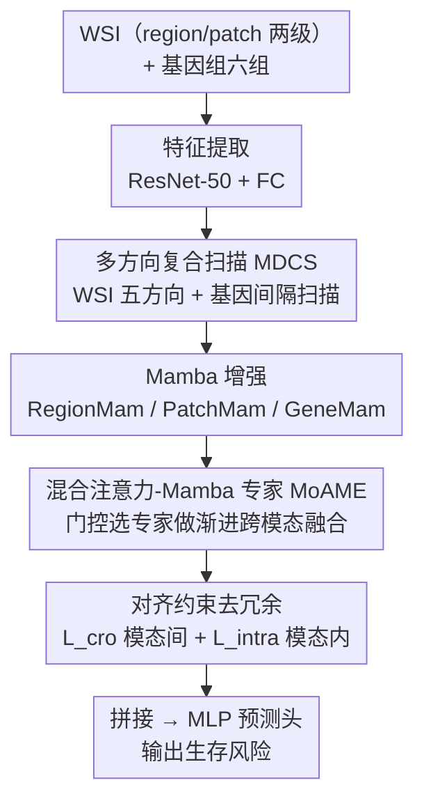

# MDCS-MoAME: Multi-directional Composite Scanning with Mixture of Attention and Mamba Experts for Cancer Survival Prediction

**会议**: CVPR 2026  
**论文**: [CVF Open Access](https://openaccess.thecvf.com/content/CVPR2026/html/Qu_MDCS-MoAME_Multi-directional_Composite_Scanning_with_Mixture_of_Attention_and_Mamba_CVPR_2026_paper.html)  
**代码**: 待确认  
**领域**: 医学图像 / 计算病理 / 多模态生存预测  
**关键词**: 全切片图像、基因组、生存预测、Mamba、混合专家、多方向扫描

## 一句话总结
MDCS-MoAME 针对"千兆像素 WSI + 稀疏基因组"的癌症生存预测，提出对图像做五方向、对基因做间隔扫描的复合扫描策略（用 Mamba 抓长程依赖），再用"注意力与 Mamba 混合专家"按模态对动态选专家做跨模态融合，并加对齐约束去冗余，在 5 个 TCGA 数据集上把平均 c-index 提到 0.7383，全面 SOTA。

## 研究背景与动机
**领域现状**：癌症生存预测靠融合病理 WSI（提供肿瘤形态）和基因组（提供分子机制）两种模态。研究已从单模态转向多模态融合——从 DeepSets 的集合池化，到 MCAT 的基因引导共注意力，再到 MOTCAT/SurvPath 用最优传输/生物通路、PAM/SurvMamba 用 Mamba 抓长程依赖。

**现有痛点**：作者指出四个具体短板。① WSI 固有的层次结构（region 看组织级语境、patch 看细胞级细节）常被欠利用。② 千兆像素分辨率下，现有 Mamba 方法只做**水平**扫描，感受野单一，建模不了垂直/斜向等多方向依赖——上下相邻两行的 patch 在水平序列里被拉得很远。③ 现有方法把基因粗分成六大组，功能重叠严重（如 PI3K-Akt 通路的基因被散落在六组里），抓不住组间细微关系。④ 模态间异质性大，简单/僵化的融合设计会引入冗余，限制特征表达。

**核心矛盾**：WSI 是超高分辨率、强空间结构的密集模态，基因组是稀疏、离散、功能纠缠的模态；两者**异质**，单一注意力或单一选择性扫描都难以同时把"模态内长程依赖"和"模态间复杂关联"建模充分。

**本文目标**：① 设计能充分挖掘 WSI 与基因组**模态内**内在信息的扫描机制；② 设计能灵活建模**模态间**复杂关联的融合模块；③ 抑制模态内/间的特征冗余。

**切入角度**：借力 Mamba（线性复杂度建模长序列）和 MoE（按需选专家），作者认为"换扫描方向就能换感受野"，而"换专家就能换融合方式"。

**核心 idea**：用多方向复合扫描（MDCS）扩大 Mamba 的感受野抓模态内信息，用注意力-Mamba 混合专家（MoAME）按模态对动态选融合方式抓模态间关联，再用对齐约束去冗余。

## 方法详解

### 整体框架
输入是一位患者的 WSI $I$ 和基因组 $G$，输出是生存风险（最终估计生存函数 $f_{\text{sur}}(T\le t)$）。流程分四步：先做特征提取（WSI 按 region/patch 两级切块用 ResNet-50 提特征，基因用全连接分成六组）；再进 MDSFE 模块对两种模态做多方向复合扫描 + Mamba 增强，得到模态内增强表示 $I_r, I_p, G_g$；接着进 EDIMI 模块，用 MoAME 混合专家做渐进式跨模态交互，产出 $I_{r\&g}, I_{p\&g}, G_{g\&r}, G_{g\&p}$；最后做特征对齐去冗余并拼接送 MLP 预测头，输出生存风险。

### 关键设计

**1. 多方向复合扫描 MDCS：让 Mamba 的感受野从单方向扩到全方位**

现有 Mamba 病理方法只做水平扫描，上下相邻 patch 在序列里被拉远，垂直/斜向依赖丢失。MDCS 对 WSI 在 region 和 patch 两级都做**五种**方向扫描：水平（ho）、垂直（ve）、左斜（lo）、右斜（ro）、回环（lb），即 $\hat{I}_r^j = \{x_{r,\phi_{r,j}(i)}\}_{i=1}^M$，$\phi_{r,j}$ 记录相对水平扫描的索引重排。patch 级先在每个 region 内扫、再跨 region 扫，实现粗（region）细（patch）粒度融合。对稀疏基因组，除常规前向（fw）扫描外，引入**间隔（iv）扫描**：按间隔 $\Delta$ 跳着扫并回绕，把功能相关但分散在不同组的基因在序列上拉近，挖掘远距离基因组间的潜在关联（$K$ 不能被 $\Delta$ 整除时零填充到 $\hat K$）。五个方向序列经 Mamba2 编码后，用 $\phi^{-1}_{r,j}$ 重排回水平序，求和聚合，再经 PPEG + 注意力池化蒸馏出模态内表示 $I_r, I_p, G_g\in\mathbb{R}^{1\times E}$（GeneMam 省去 PPEG）。

**2. 注意力-Mamba 混合专家 MoAME：按模态对动态选最合适的融合方式**

模态异质，单一注意力或单一 Mamba 都难充分交互。MoAME 设三个互补专家：CroAttFusion（A，跨注意力，抓全面互补关联）、CroMamFusion（M，跨 Mamba，线性复杂度抓互补关联）、StackedMamFusion（S，堆两层 Cross-Mamba + 随机初始化特征 $\mathcal{B}$ 蒸馏最相关信息）。一个门控网络对每对输入 $(F_1, F_2)$ 算 $\text{logit}=\text{argmax}\big(\text{Softmax}(\text{logits}')/\tau\big)$ 选专家（$\tau$ 控平滑度），按 logit=0/1/2 分别走三个专家。这种"硬选专家"让融合既灵活又不过度，避免 MoME 那种因过度融合/滥用注意力带来的冗余。

**3. EDIMI 渐进式跨模态交互：分步桥接模态鸿沟**

EDIMI 模块用 MoAME 先做 $(I_r, G_g)$ 与 $(I_p, G_g)$ 的交互，得到 $I_{r\&g}, I_{p\&g}$；再用 $(G_g, I_{r\&g})$ 与 $(G_g, I_{p\&g})$ 的交互得到 $G_{g\&r}, G_{g\&p}$。这种渐进式融合（先图引基因、再基因引融合结果）一步步桥接模态鸿沟，比一次性硬融合更深。

**4. 对齐约束去冗余：分别压模态间和模态内的重复信息**

MoAME 多个融合模块仍会引入冗余。作者用 L1 距离做对齐：模态间 $\mathcal{L}_{\text{cro}}=\mathcal{L}_r+\mathcal{L}_p+\mathcal{L}_g$，其中 $\mathcal{L}_r=\|I_{r\&g}-I_r\|_1$ 等，把融合表示拉向对应模态内表示（为防双向优化同时退化共享信息，把 $I_r,I_p,G_g$ 从计算图分离，做单向优化）。模态内则因 region/patch 两级仍有冗余，用**负** L1 放大二者差异：$\mathcal{L}_{\text{intra}}=-\|I_r-I_p\|_1$。最终拼接所有表示送 MLP 得风险 $\hat{Y}$，总损失 $\mathcal{L}_{\text{total}}=\mathcal{L}_{\text{sur}}+\alpha\mathcal{L}_{\text{cro}}+\beta\mathcal{L}_{\text{intra}}$（$\mathcal{L}_{\text{sur}}$ 为负对数似然生存损失）。

### 损失函数 / 训练策略
五折交叉验证，指标为 c-index。WSI 在 10× 倍率切分，region $4096\times4096$、patch $512\times512$（正文 Fig.1 标 $256\times256$，⚠️ 以原文为准），ResNet-50 提特征。Adam，学习率 1e-3，weight decay 1e-5，batch size 1，间隔 $\Delta=5$，每折 30 epoch。$\alpha$ 按五个数据集分别设为 [4e-1, 5e-4, 3e-1, 1e-4, 5e-4]，$\beta=1e\text{-}3$。GPU 为 GTX 4090（原文如此）。

## 实验关键数据

### 主实验
五个 TCGA 数据集：BLCA(373)、BRCA(956)、GBMLGG(569)、LUAD(453)、UCEC(480)，全部方法在统一设置下复现。

| 方法 | 模态 | 平均 c-index |
|--------|------|------|
| SurvPath | P+G | 0.7147 |
| PIBD | P+G | 0.7149 |
| CMTA | P+G | 0.7013 |
| MoME | P+G | 0.6693 |
| SurvMamba | P+G | 0.6985 |
| PAM | P | 0.6442 |
| **MDCS-MoAME** | **P+G** | **0.7383** |

相对各类基线的平均 c-index 提升：vs 基因模态方法 +6.48%~+11.61%；vs 病理模态方法 +11.12%~+16.88%；vs 多模态方法 +3.30%~+10.31%；vs Mamba/层次方法 PAM +14.61%、SurvMamba +5.70%；vs MoE 方法 PAMoE +16.34%、MoME +10.31%。

### 消融实验
主模块消融在 LUAD / UCEC 上：

| 配置 | LUAD c-index | UCEC c-index | 说明 |
|------|---------|---------|------|
| 完整 MDCS-MoAME | 0.7079 | 0.7263 | 全模块 |
| w/o MDSFE（换原始 Mamba） | 0.6695 | 0.6752 | 掉点最多（-5.42% / -7.03%） |
| w/o EDIMI | 0.6894 | 0.6929 | 跨模态交互失效（-2.61% / -4.60%） |
| w/o $\mathcal{L}_{\text{cro}}$ | 0.6864 | 0.7143 | LUAD -3.13% |
| w/o $\mathcal{L}_{\text{intra}}$ | 0.6955 | 0.6981 | UCEC -4.04% |

### 关键发现
- **MDSFE（多方向复合扫描）贡献最大**：换回原始单向 Mamba 后 LUAD/UCEC 分别掉 5.42%/7.03%，说明多方向扫描对充分挖掘模态内依赖至关重要。
- **扫描方向互补**：单用直线（ho+ve）、斜向（lo+ro）或回环（lb）效果有限，直线+斜向组合带来显著提升；基因上间隔扫描优于前向扫描（能建模不连续的基因功能关联），全方向组合最佳。
- **对齐约束确实去冗余**：$\mathcal{L}_{\text{cro}}$ 和 $\mathcal{L}_{\text{intra}}$ 各自带来约 1.7%~4% 的提升，验证了"压模态间 + 放大模态内差异"的去冗余思路。

## 亮点与洞察
- **"换扫描方向 = 换感受野"这个观察很实用**：在 Mamba 的线性复杂度下加多方向扫描几乎零额外渐进开销，却把单向感受野扩成全方位，是个可迁移到任何 Mamba 视觉骨干的廉价 trick。
- **基因间隔扫描把"序列邻接"当成"功能邻接"来用**：通过跳跃重排把分散在不同组、却功能相关的基因在序列上拉近，让 Mamba 的局部性偏置反而服务于捕捉远程基因关联，思路巧妙。
- **MoAME 用硬门控在三种融合强度间选择**：注意力（全面）、Cross-Mamba（高效互补）、堆叠蒸馏（聚焦关键）各司其职，比 MoME 一味堆融合更省冗余——这种"按输入对选融合算子"的设计可迁移到其它异质多模态任务。

## 局限与展望
- 只在 5 个 TCGA 队列、c-index 单一指标上验证，外部队列泛化与临床可用性未知。
- 五方向扫描 + 三专家 + 多重对齐约束让结构相当复杂，超参（$\Delta$、$\alpha$ 逐数据集调、$\tau$ 等）较多且需精调，复现成本高。
- 门控用 argmax 硬选专家，训练中专家利用是否均衡、是否存在专家坍塌未讨论。
- region/patch 切块尺寸在正文与图中标注不一致（$4096/512$ vs $256$），细节需以原文/代码为准。

## 相关工作与启发
- **vs PAM**: PAM 用局部感知扫描 + 双向 Mamba，但仍偏单向；MDCS-MoAME 五方向扫描使平均 c-index 高出 14.61%。
- **vs SurvMamba**: 同走 Mamba 层次交互路线，但 MDCS-MoAME 靠多方向扫描增强感知，平均高 5.70%。
- **vs MoME**: MoME 用多模态专家做最大化/间接/基因主导融合，但过度融合引入冗余；MoAME 用注意力+Mamba 混合专家 + 对齐去冗余，平均高 10.31%。
- **vs SurvPath / PIBD**: 这两个是此前最强多模态基线（0.7147/0.7149），MDCS-MoAME 以 0.7383 全面超过，差距主要来自模态内扫描增强与去冗余设计。

## 评分
- 新颖性: ⭐⭐⭐⭐ 多方向复合扫描 + 间隔基因扫描 + 注意力-Mamba 混合专家的组合在生存预测里是新颖且自洽的设计。
- 实验充分度: ⭐⭐⭐⭐ 5 数据集、与 17+ 方法对比、主模块/扫描方向/损失多维消融，较充分；但仅 TCGA、单指标。
- 写作质量: ⭐⭐⭐⭐ 方法与公式清晰，图文标注偶有不一致（切块尺寸）。
- 价值: ⭐⭐⭐⭐ 在 WSI+基因组生存预测上刷新 SOTA，扫描 trick 可迁移；但结构复杂、调参成本高。

<!-- RELATED:START -->

## 相关论文

- [\[CVPR 2026\] Turning Pre-Trained Vision Transformers into End-to-End Histopathology Whole Slide Image Models for Survival Prediction](turning_pre-trained_vision_transformers_into_end-to-end_histopathology_whole_sli.md)
- [\[CVPR 2026\] H2-Surv: Hierarchical Hyperbolic Multimodal Representation Learning for Survival Prediction](h2-surv_hierarchical_hyperbolic_multimodal_representation_learning_for_survival_.md)
- [\[NeurIPS 2025\] Dual Mixture-of-Experts Framework for Discrete-Time Survival Analysis](../../NeurIPS2025/medical_imaging/dual_mixture-of-experts_framework_for_discrete-time_survival_analysis.md)
- [\[CVPR 2026\] MUST: Modality-Specific Representation-Aware Transformer for Diffusion-Enhanced Survival Prediction with Missing Modality](must_modality-specific_representation-aware_transformer_for_diffusion-enhanced_s.md)
- [\[CVPR 2026\] SegMoTE: Token-Level Mixture of Experts for Medical Image Segmentation](segmote_token-level_mixture_of_experts_for_medical_image_segmentation.md)

<!-- RELATED:END -->
