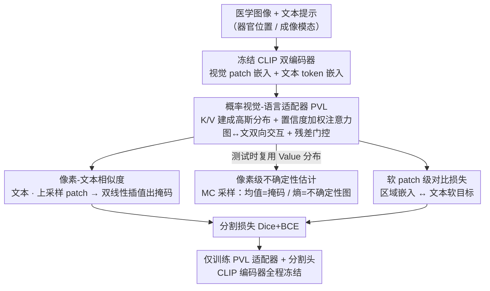

# MedCLIPSeg: Probabilistic Vision-Language Adaptation for Data-Efficient and Generalizable Medical Image Segmentation

**会议**: CVPR2026  
**arXiv**: [2602.20423](https://arxiv.org/abs/2602.20423)  
**代码**: [HealthX-Lab/MedCLIPSeg](https://github.com/HealthX-Lab/MedCLIPSeg)  
**领域**: 医学图像  
**关键词**: 医学图像分割, CLIP适配, 概率注意力, 不确定性建模, 跨模态融合, 数据高效

## 一句话总结

在冻结CLIP编码器的基础上，通过概率交叉模态注意力（PVL）实现图文双向交互与预测不确定性建模，配合软patch级对比损失，在16个医学分割数据集上兼顾数据效率、域泛化能力和可解释性。

## 背景与动机

医学图像分割长期受制于三个核心瓶颈：标注数据稀缺（专家标注成本极高）、解剖结构边界模糊（软组织对比度低）、以及不同设备/机构间的域偏移。CLIP等视觉-语言预训练模型虽然提供了强大的跨模态表征，但现有工作要么只利用图像级CLIP特征做粗粒度对齐，要么缺乏对分割预测不确定性的显式建模。这导致模型在少量标注下性能急剧下降，且在跨域场景中鲁棒性不足。

作者认为关键缺口在于：(1) 现有CLIP适配方案大多做单向的文本→图像引导，缺乏双向交互；(2) 标准的确定性注意力无法表达对不同patch特征的置信度差异；(3) 全局对比损失太粗，无法鼓励patch级别的细粒度语义对齐。MedCLIPSeg正是从这三个角度同时入手来解决上述问题。

## 方法详解

### 整体框架

MedCLIPSeg 想同时解决医学分割的三个老问题——标注稀缺、边界模糊、跨设备域偏移——而它的抓手是把 CLIP 的跨模态先验用得更细。框架建在冻结的 CLIP 双编码器之上（默认 UniMedCLIP 骨干）：输入医学图像经视觉编码器得到 patch 级嵌入，文本描述（含器官位置、成像模态等）经文本编码器得到 token 级嵌入；在 CLIP 的多个中间层插入可学习的**概率视觉-语言（PVL）适配器**做图文双向融合。分割不走常规解码器，而是用 CLIP 原生的图文相似度：把融合后的文本 [EOS] 嵌入与上采样的视觉 patch 做点积、再双线性插值得到掩码；同时复用适配器学到的概率分布在测试时做 Monte Carlo 采样，额外产出一张逐像素不确定性图。训练损失由分割损失和软 patch 级对比损失组成，全程只训练 PVL 适配器和轻量分割头、编码器始终冻结。

### 关键设计

**1. 概率交叉模态注意力（PVL Adapter）：把 Key/Value 建成分布，一并搞定融合与不确定性**

现有 CLIP 适配多是单向的文本→图像引导，且用确定性注意力，没法表达"这个 patch 特征到底可不可信"。PVL 的做法是把每个 token 的 Key 和 Value 不再当成确定向量，而建成高斯分布：通过可学习投影分别预测均值与对数方差（再用 softplus 转成方差），得到 $\text{Key} \sim \mathcal{N}(\mu_K, \sigma_K^2)$、$\text{Value} \sim \mathcal{N}(\mu_V, \sigma_V^2)$，高方差代表语义不确定、低方差代表高置信。注意力分数不只用 Query-Key 的均值相似度 $S_\mu$，还减去一个由 Key 方差算出的置信度惩罚项 $\beta S_\sigma$（即 $A = \text{softmax}(S_\mu - \beta S_\sigma)$，$\beta=2.35$ 对应高斯半高全宽），于是高方差、不可信的 token 在 softmax 前就被压低、自动降权（$\beta=0$ 时退化成标准注意力）。同时 PVL 双向作用——视觉 patch 查询文本 token（text→image）、文本 token 查询视觉 patch（image→text），再用一个初始均衡的可学习残差门控 $g$ 把适配特征和原始 CLIP 特征融合（$Y = g\odot O + (1-g)\odot X$），让训练早期注意力还噪声大时不至于失稳。把不确定性塑进注意力阶段，模型在融合时就能抑制噪声和模糊特征，对医学图像常见的边界模糊和伪影尤其管用。

**2. 像素级不确定性估计：复用 Value 分布，免费产出一张可信度图**

确定性模型只给一个分割结果，临床上却需要知道哪些区域可信。MedCLIPSeg 直接复用 Value 的概率分布：训练时用重参数化技巧只采样一次保持效率，测试时做多次（实验取 30 次）随机前向，取均值作为最终掩码、算预测熵作为逐像素不确定性图。这里方差捕获数据本身的偶然不确定性（aleatoric），MC 采样捕获模型的认知不确定性（epistemic），两者合起来量化总置信度。这张图把分割歧义直观地标出来，且实验显示不确定性热点稳定落在解剖边界和困难区域、域内域外一致，可当作部署时的自动质控信号。

**3. 软 Patch 级对比损失：把图文对齐从图像级细化到 patch 级、从硬标签换成软目标**

全局图文对比损失只在图像级对齐，粒度太粗，鼓励不出细腻的语义差异。MedCLIPSeg 改在 patch 级做对比：先把视觉 patch 嵌入平均池化成稳定的区域表示（保留局部语义又降 token 噪声），再与文本嵌入做双向对比。关键是用软目标替代硬正负样本——由于一个 batch 内的文本提示常常相似（都描述同类解剖），直接拿文本之间的相似度过 softmax（温度 $\tau=0.2$）当作软监督目标 $G$，而非把同 batch 其它样本一律当负例。这让模型学的是"这个区域更像哪几种描述"的连续语义关系，而非简单的匹配/不匹配二值判断，从而在有限标注下泛化更好。

## 实验关键数据

### 数据效率评估（平均DSC/NSD，使用10%/25%/50%/100%训练数据）

| 方法 | 10% DSC | 10% NSD | 50% DSC | 50% NSD | 100% DSC | 100% NSD |
|:---|:---:|:---:|:---:|:---:|:---:|:---:|
| UNet | 60.95 | 64.43 | 71.61 | 75.14 | 78.49 | 82.07 |
| nnU-Net | 73.45 | 77.37 | 78.86 | 82.68 | 81.40 | 85.08 |
| CLIPSeg | 74.66 | 77.75 | 79.63 | 82.58 | 84.87 | 87.74 |
| CAT-Seg | 78.76 | 81.50 | 83.32 | 85.61 | 85.90 | 88.31 |
| VLSM-Adapter | 74.47 | 77.50 | 80.83 | 83.77 | 83.85 | 86.72 |
| MaPLe + Decoder | 74.81 | 77.90 | 82.81 | 85.80 | 84.94 | 87.91 |
| **MedCLIPSeg** | **81.10** | **83.94** | **87.18** | **89.95** | **88.66** | **91.35** |

MedCLIPSeg在所有数据比例下均大幅领先。尤其在仅10%数据时，DSC达到81.10，超越第二名CAT-Seg（78.76）2.34个点；在100%数据时达到88.66 DSC，领先CAT-Seg 2.76个点。

### 消融实验（DSC，ID/OOD/调和均值）

| 消融项 | ID | OOD | HM |
|:---|:---:|:---:|:---:|
| **MedCLIPSeg（完整）** | **89.11** | **79.02** | **83.76** |
| 去掉PVL适配器 | 81.23 (−7.88) | 55.23 (−23.79) | 65.75 (−18.01) |
| 确定性版本（去掉概率建模） | 87.68 (−1.43) | 63.12 (−15.90) | 73.40 (−10.36) |
| 去掉视觉适配 | 81.50 (−7.61) | 64.40 (−14.62) | 71.95 (−11.81) |
| 去掉双向交互 | 88.71 (−0.40) | 77.71 (−1.31) | 82.85 (−0.91) |
| 去掉软对比损失 | 87.24 (−1.87) | 77.08 (−1.94) | 81.84 (−1.92) |
| 使用硬目标对比 | 88.34 (−0.77) | 77.64 (−1.38) | 82.65 (−1.11) |

两个最关键的发现：(1) PVL适配器是核心组件，移除后OOD下降23.79个点；(2) 概率建模对域泛化至关重要，确定性版本虽然ID仅降1.43，但OOD暴跌15.90。

## 关键发现

- **概率建模对域泛化的贡献远超对域内的贡献**：确定性MedCLIPSeg在ID上仅降1.43，但在OOD上降15.90，说明不确定性建模的主要价值在于让模型在面对分布偏移时能自动降低对不可靠特征的依赖。
- **视觉适配比文本适配更关键**：去掉视觉适配降7.61/14.62（ID/OOD），但去掉文本适配仅降0.28/2.62，表明视觉端的跨模态增强是分割任务的瓶颈。
- **文本提示设计敏感性**：矛盾性描述使HM从83.76降到65.79；描述不足降到56.82；而过度描述降到78.48。说明提示质量对性能影响很大。
- **骨干选择**：UniMedCLIP > BiomedCLIP (82.48) > 原始CLIP (81.07) > PubMedCLIP (79.28)，医学领域预训练的CLIP明显优于通用CLIP。
- **层级介入深度**：PVL适配器在约第10层介入效果最佳，过浅则语义不充分，过深则影响高层抽象。

## 亮点与洞察

1. **概率注意力的妙用**：将Key/Value建模为分布而非向量，优雅地统一了跨模态融合和不确定性估计，一箭双雕。这个思路完全可以推广到其他密集预测任务。
2. **冻结编码器+轻量适配器**：CLIP编码器完全冻结，仅训练PVL适配器和解码器，参数高效且保留预训练知识，实际部署友好。
3. **域泛化实验极为充分**：16个数据集、5种成像模态（CT、MRI、超声、内窥镜、皮肤镜）、6种器官，既有域内又有域外，说服力强。
4. **不确定性图的临床价值**：不确定性和分割质量高度相关，可作为自动质控信号提醒临床医生复核哪些区域的分割不可靠。
5. **软对比损失的泛化增益**：从硬目标到软目标的改进虽然不大（HM +1.11），但几乎零成本，体现了细粒度对比学习的价值。

## 局限与展望

- 文本提示需要人工设计，包含器官位置和成像模态等信息，自动化提示生成可能进一步降低使用门槛
- Monte Carlo采样增加推理时间，实际部署需要在采样次数和效率间权衡
- 当前仅处理2D切片，未扩展到3D体数据的原生分割
- 域泛化实验中训练和测试集的模态有一定重叠，完全未见过的模态（如OCT）的泛化能力未验证
- 概率建模引入额外超参数（β、采样次数等），不同数据集上的最优设置可能不同

## 与相关工作的对比

- **CLIPSeg / DenseCLIP / ZegCLIP**：这些方法直接用CLIP特征做分割，但缺乏概率建模和细粒度对比损失。MedCLIPSeg在所有设置下均显著领先，尤其在低数据/跨域场景优势更大。
- **VLSM-Adapter**：同样做CLIP适配，但只有单向（文本→视觉）交互，且为确定性注意力。MedCLIPSeg的双向概率适配显著优于它（HM高约3.5个点）。
- **CAT-Seg**：强力baseline，使用cost aggregation做分割，但同样缺乏不确定性建模，域泛化弱于MedCLIPSeg。
- **CausalCLIPSeg**：引入因果推理来提升泛化，但在OOD场景下表现不稳定（HM 57.54），远不及MedCLIPSeg的80.80。
- **nnU-Net**：纯视觉方法的天花板，但在低数据下（10% DSC 73.45 vs 81.10）差距明显。

## 启发与关联

- 概率注意力的思想可以移植到通用CLIP分割（如CAT-Seg、SAN等），探索其在自然图像开放词汇分割中的效果
- 不确定性图 + 主动学习：自动挑选高不确定性样本请求标注，进一步降低标注成本
- 与SAM类基础模型的结合：MedCLIPSeg的概率融合模块可能作为SAM的prompt编码器替代
- 软对比损失可推广到其他多提示场景，如VQA、referring segmentation等

## 评分

- 新颖性: ⭐⭐⭐⭐ （概率交叉模态注意力是有新意的设计，但整体框架是CLIP适配的自然延伸）
- 实验充分度: ⭐⭐⭐⭐⭐ （16个数据集、5种模态、详尽消融，非常充分）
- 写作质量: ⭐⭐⭐⭐ （清晰有条理，图表丰富）
- 价值: ⭐⭐⭐⭐ （概率建模对域泛化的增益令人印象深刻，有临床部署潜力）

<!-- RELATED:START -->

## 相关论文

- [\[CVPR 2026\] Decoupling Vision and Language: Codebook Anchored Visual Adaptation](decoupling_vision_and_language_codebook_anchored_visual_adaptation.md)
- [\[CVPR 2026\] CHIPS: Efficient CLIP Adaptation via Curvature-aware Hybrid Influence-based Data Selection](chips_efficient_clip_adaptation_via_curvature-aware_hybrid_influence-based_data_.md)
- [\[AAAI 2026\] DeNAS-ViT: Data Efficient NAS-Optimized Vision Transformer for Ultrasound Image Segmentation](../../AAAI2026/medical_imaging/denas-vit_data_efficient_nas-optimized_vision_transformer_for_ultrasound_image_s.md)
- [\[CVPR 2026\] Multimodal Causality-Driven Representation Learning for Generalizable Medical Image Segmentation](multimodal_causal-driven_representation_learning_for_generalizable_medical_image.md)
- [\[CVPR 2026\] SHAPE: Structure-aware Hierarchical Unsupervised Domain Adaptation with Plausibility Evaluation for Medical Image Segmentation](shape_structure-aware_hierarchical_unsupervised_domain_adaptation_with_plausibil.md)

<!-- RELATED:END -->
