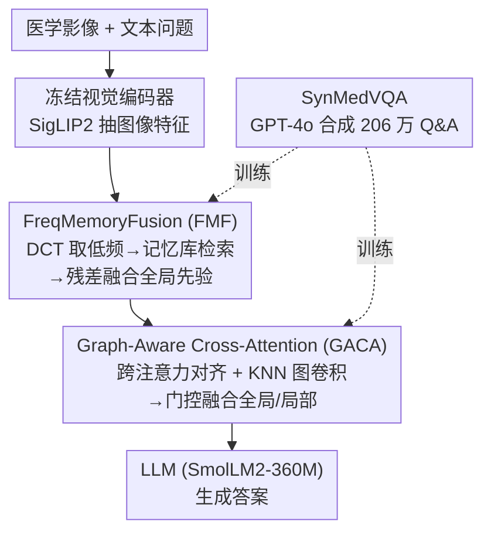

# MedFG-VQA: Low-Frequency Memory and Graph Attention for Lightweight Medical VQA

**会议**: CVPR 2026  
**论文**: [CVF Open Access](https://openaccess.thecvf.com/content/CVPR2026/html/Gu_MedFG-VQA_Low-Frequency_Memory_and_Graph_Attention_for_Lightweight_Medical_VQA_CVPR_2026_paper.html)  
**代码**: https://github.com/NUST-Machine-Intelligence-Laboratory/MedFG  
**领域**: 医学图像 / 多模态VLM  
**关键词**: 医学VQA, 轻量化, 频域记忆库, 图注意力, 合成数据

## 一句话总结
MedFG-VQA 用「DCT 低频记忆库 + 图增强跨模态注意力」两个轻量模块武装一个 795M 的小模型，再配上 GPT-4o 生成的 206 万条合成医学 VQA 数据，在医学视觉问答上用远小于主流 VLM 的体量打出更高准确率。

## 研究背景与动机
**领域现状**：医学视觉问答（Med-VQA）把医学影像和自然语言问题对齐，是临床决策辅助的重要方向。当下主流做法是把大视觉编码器接到大语言模型上（如 LLaVA-Med、Qwen3-VL），靠海量参数和预训练数据撑性能。

**现有痛点**：这条路在医学场景里有两个硬伤。一是**标注数据稀缺**——公开 Med-VQA 数据集规模太小，不足以训练大 VLM；二是**部署约束严苛**——临床环境对模型大小和算力有强限制，而现有大模型在轻量配置下诊断能力会明显塌掉。

**核心矛盾**：医学问答既需要**全局结构信息**（病灶的整体形态、解剖结构走向）又需要**局部细粒度对齐**（具体区域和文本描述的精确匹配），但轻量模型容量有限，单纯堆叠通用模块两头都顾不好；同时缺数据又让小模型雪上加霜（小模型对高质量领域数据更敏感）。

**本文目标**：在小模型（<1B）的预算下，同时强化全局结构建模与局部跨模态对齐，并解决训练数据不足。

**切入角度**：作者观察到图像的**低频分量主要编码全局语义和结构信息**，可以用频域分解（DCT）把它单独拎出来增强；而局部结构关系可以用图卷积在图像 patch 间显式建模。

**核心 idea**：用「可学习的低频记忆库」注入全局结构先验、用「图增强跨注意力」补齐局部拓扑，再用 GPT-4o 批量合成 206 万条 Med-VQA 数据喂饱小模型。

## 方法详解

### 整体框架
MedFG-VQA 的输入是一张医学影像 + 一个文本问题，输出是答案。流程是：冻结的视觉编码器（SigLIP2）抽出图像特征，先过 **FreqMemoryFusion（FMF）** 在频域里检索全局低频先验做增强，再过 **Graph-Aware Cross-Attention（GACA）** 与文本特征做跨模态对齐并补充局部图结构，融合后的多模态特征送入 LLM（SmolLM2-360M）生成答案。两个模块都是随机初始化、轻量可训练，视觉骨干则全程冻结以省算力。训练数据来自作者自建的 **SynMedVQA**（GPT-4o 合成）。

### 关键设计

**1. FreqMemoryFusion（FMF）：用频域记忆库给小模型补全局结构先验**

痛点是轻量视觉骨干容量小，难以稳定捕捉病灶的全局结构。FMF 先对图像特征 $X \in \mathbb{R}^{B\times M\times D}$ 做**离散余弦变换（DCT）**，分解出低频 $F_{low}$ 与高频 $F_{high}$；因为低频主导全局语义与结构，就用它作为查询信号去**可学习记忆库** $M\in\mathbb{R}^{N\times D/2}$ 里按余弦相似度检索 top-k 条目 $M_k$ 及权重 $S_k$，再做残差加权融合：$F_{low}^{fused}=\lambda F_{low}+(1-\lambda)(\mathrm{Softmax}(S_k)\cdot M_k)$（实测固定 $\lambda=0.7$）。融合后的低频与原高频拼接、经 IDCT 变回空间域得到 $X_{rec}$，最后用门控残差 $X_{out}=X+\alpha\cdot f_\theta([X,X_{rec}])$ 自适应注入。记忆向量正交初始化并随训练更新，为防止记忆塌缩成冗余表示，加了**多样性损失** $L_{div}=\frac{1}{N(N-1)}\sum_{i\neq j}(m_i^\top m_j)^2$ 压低非对角相似度。这样小模型不必靠自身容量硬记全局结构，而是从一个共享的全局先验库里"调取"，既提升鲁棒性又保特征细节。

**2. Graph-Aware Cross-Attention（GACA）：跨注意力管全局语义、KNN 图卷积管局部拓扑**

痛点是单纯跨注意力只做全局对齐，会忽略图像 patch 之间的局部空间关系，而医学细粒度判断恰恰依赖这些局部结构。GACA 把图像特征当 query、文本特征当 key/value，多头跨注意力得到语义增强的视觉表示 $I_{attn}$（全局对齐）；同时基于 $I_{attn}$ 动态构建 **KNN 图**，邻接矩阵 $A_{ij}=1$ 当 $j\in\mathrm{KNN}(i,k)$，对称归一化得 $\tilde A$ 后做图卷积 $I_{enh}=\sigma(f_\theta(\tilde A I_{attn}))$ 聚合局部邻域信息。两路用**门控残差**自适应平衡：$I_{fused}=G\odot I_{enh}+(1-G)\odot I_{attn}$，其中 $G=\sigma(f_\theta([I_{attn},I_{enh}]))$。门控让模型按需在"全局语义"和"局部拓扑"之间分配权重，而不是简单相加。

**3. SynMedVQA：用 GPT-4o 把小数据问题从源头解决**

痛点是公开 Med-VQA 数据太小，小模型又格外吃数据质量。作者整合 11 个公开医学影像数据集（覆盖 9 种成像模态、10 个主要器官，共 20.6 万张图、约 14.9 万训练），用 GPT-4o 作语义生成引擎自动产出 Q&A。提示词把模型设定为资深影像专家，并按每个数据集的临床/放射学特性动态定制问题，统一覆盖四类（成像特征/可见解剖结构/病理表现/临床意义）；每张图生成开放式和选择题两类（选择题里 75% 有唯一正解+3 干扰项，25% 故意全是干扰项无正解以增强判别与鲁棒性）。生成后经**三步质控**：规则过滤去重/歧义、Qwen2.5-VL+人工抽检、一致性核对。最终 SynMedVQA 含 **2,059,020** 条 Q&A，开放式与选择题各半。

### 损失函数 / 训练策略
总损失是文本生成交叉熵与记忆多样性损失的线性组合：$L_{total}=L_{text}+\lambda L_{div}$（最优 $\lambda=0.5$）。视觉骨干 SigLIP2 冻结，用模态投影（MP）压缩视觉 token；LLM 用 SmolLM2-360M-Instruct。学习率分组：LLM 5e-5、模态投影 0.003、FMF/GACA 0.0015，AdamW 优化器，在 SynMedVQA 上训 2 个 epoch，8×4090 GPU。

## 实验关键数据

### 主实验
SynMedVQA 基准上对比 5 个代表性 VLM（基线均用公开预训练权重、未在 SynMedVQA 微调）。MedFG-VQA 仅 795M 参数却拿到最高平均准确率 0.6441，比次优的 Qwen3-VL（4B）高约 9.5%。

| 方法 | 参数量 | 平均准确率 | 备注 |
|--------|------|------|----------|
| InternVL3.5 | 1B | 0.4846 | — |
| MiniCPM-V 4.0 | 4B | 0.4964 | — |
| Qwen3-VL | 4B | 0.5492 | 次优 |
| Gemma3 | 4B | 0.4590 | — |
| LLaVA-Med | 7B | 0.4834 | — |
| **MedFG-VQA（本文）** | **795M** | **0.6441** | 体量最小，准确率最高 |

在三个公开基准（SLAKE / VQA-RAD / PathVQA）上，模型在开放式问题上拿到所有方法里最高准确率（如 SLAKE-Open 0.9595、PathVQA-Open 0.8062），闭合式略逊于个别大模型（作者归因于大模型预训练数据远多于仅用 SynMedVQA 的本文）。

### 消融实验
| 配置 | 准确率 | 说明 |
|------|---------|------|
| 完整模型（FMF+GACA） | 0.6441 | — |
| 仅 FMF | 0.6270 | 去 GACA |
| 仅 GACA | 0.6242 | 去 FMF |
| 两者都去 | 0.4170 | 退化显著 |
| 记忆库 size=16 / 64 / 128 | 0.4313 / 0.6441 / 0.2771 | 64 最优，过大引入噪声 |
| 频域变换 无 / FFT / DCT | 0.6058 / 0.5585 / 0.6441 | DCT 最优，FFT 反而掉点 |
| 跨注意力 CA / GACA | 0.6407 / 0.6441 | 图增强带来增益 |

### 关键发现
- 两个模块**协同效应**明显：单独 FMF 或 GACA 都只在 0.62 出头，但同时去掉则塌到 0.417，二者合用才到 0.6441——说明全局结构建模和局部跨模态对齐缺一不可。
- 记忆库大小是**非单调**的：16→64 涨点，但 128 骤降到 0.2771，提示容量过大会引入冗余/噪声检索，64 是甜点。
- 频域选择上 **DCT 明显优于 FFT**（0.6441 vs 0.5585），甚至 FFT 比不做变换还差，说明低频先验的提取方式很关键。
- 损失系数 $\lambda$ 在 0.3–0.9 间波动很小（0.6410–0.6441），模型对它不敏感，但多样性损失本身不可去（维持记忆库表示丰富度）。

## 亮点与洞察
- **频域记忆库**是个可迁移的巧思：把"全局结构先验"外化成一个可学习、可检索的共享记忆，让容量受限的小模型不必靠自身参数硬记，思路可迁移到任何"小模型缺全局上下文"的场景。
- **门控双路融合**贯穿全文（FMF 的 $\alpha$ 门控、GACA 的 $G$ 门控），都是让模型自适应决定"原特征 vs 增强特征"的配比，而非粗暴相加，这种设计在轻量模型里尤其稳。
- 最"啊哈"的是**用合成数据正面硬刚数据稀缺**：206 万条 GPT-4o 生成 + 三步质控，证明高质量合成数据能让 795M 小模型在医学 VQA 上反超 7B 大模型。
- DCT 优于 FFT 的实证提醒：频域增强里"用哪种变换"不是无所谓的，DCT 的能量集中特性更适合低频结构提取。

## 局限与展望
- 闭合式问题上仍逊于个别大模型，作者承认根因是预训练数据量差距——本文只在 SynMedVQA 上训练，泛化知识储备不及大模型海量预训练。
- 训练数据高度依赖 GPT-4o 生成，合成 Q&A 的临床准确性虽经三步质控，但仍可能继承生成模型的偏差或幻觉，真实临床标注的对照验证不足（⚠️ 以原文为准）。
- 记忆库大小敏感（128 骤降）、$\lambda=0.7$ 等关键超参靠"preliminary experiments"定，跨数据集/模态的稳健性有待进一步检验。
- 改进方向：把合成数据与真实临床标注混合训练以补闭合式短板；探索记忆库的动态扩缩容机制规避容量敏感问题。

## 相关工作与启发
- **vs LLaVA-Med**：LLaVA-Med 在 GPT-4 合成数据上微调通用 VLM（7B），本文同样用合成数据但走轻量路线（795M）+ 频域/图结构专用模块，在开放式任务上反超且体量小一个数量级。
- **vs 通用 sVLM（SmolVLM / MobileVLM）**：通用小模型聚焦广域基准，很少针对医学这类领域特化任务；本文指出小模型更依赖高质量领域数据，并用 SynMedVQA + 专用模块补上这块。
- **vs 去视觉编码器的 VLM**：有工作直接把原始 patch 喂 LLM 简化架构，但会丢局部结构；本文反其道用 GACA 显式建模 patch 间图结构来保住细粒度。

## 评分
- 新颖性: ⭐⭐⭐⭐ 频域记忆库 + 图增强跨注意力的组合在 Med-VQA 里较新颖，但各组件（DCT、记忆库、GCN）本身是成熟构件的重组。
- 实验充分度: ⭐⭐⭐⭐ 自建大规模基准 + 3 个公开基准 + 多组消融，较充分；但闭合式短板和真实临床验证略欠。
- 写作质量: ⭐⭐⭐⭐ 结构清晰、公式完整、消融到位，图表略显密集。
- 价值: ⭐⭐⭐⭐ 轻量化 + 合成数据的路线对临床部署有实际意义，记忆库思路可迁移。

<!-- RELATED:START -->

## 相关论文

- [\[CVPR 2025\] DiN: Diffusion Model for Robust Medical VQA with Semantic Noisy Labels](../../CVPR2025/medical_imaging/din_diffusion_model_for_robust_medical_vqa_with_semantic_noisy_labels.md)
- [\[AAAI 2026\] Refine and Align: Confidence Calibration through Multi-Agent Interaction in VQA](../../AAAI2026/medical_imaging/refine_and_align_confidence_calibration_through_multi-agent_interaction_in_vqa.md)
- [\[CVPR 2026\] Forging a Dynamic Memory: Retrieval-Guided Continual Learning for Generalist Medical Foundation Models](forging_a_dynamic_memory_retrieval-guided_continual_learning_for_generalist_medi.md)
- [\[CVPR 2026\] Momentum Memory for Knowledge Distillation in Computational Pathology](momentum_memory_for_knowledge_distillation_in_computational_pathology.md)
- [\[ICCV 2025\] GEMeX: A Large-Scale, Groundable, and Explainable Medical VQA Benchmark for Chest X-ray Diagnosis](../../ICCV2025/medical_imaging/gemex_a_large-scale_groundable_and_explainable_medical_vqa_benchmark_for_chest_x.md)

<!-- RELATED:END -->
