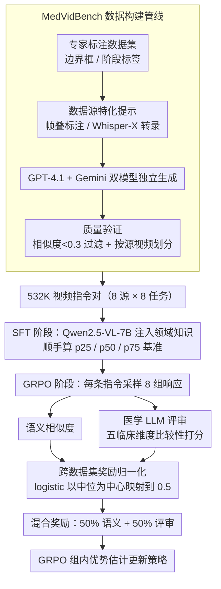

# MedGRPO: Multi-Task Reinforcement Learning for Heterogeneous Medical Video Understanding

**会议**: CVPR 2026  
**arXiv**: [2512.06581](https://arxiv.org/abs/2512.06581)  
**代码**: [https://uii-america.github.io/MedGRPO/](https://uii-america.github.io/MedGRPO/)  
**领域**: 医学图像 / 视频理解  
**关键词**: 医学视频理解、强化学习、跨数据集奖励归一化、VLM微调、多任务学习

## 一句话总结

MedGRPO 提出了两项关键创新解决医学视频多数据集强化学习中的训练崩溃问题：跨数据集奖励归一化（用 logistic 函数将不同难度数据集的中位表现映射到相同奖励值）和医学 LLM 评审（通过五个临床维度的比较性评分），基于 Qwen2.5-VL-7B 在 MedVidBench（532K 视频指令对）上超越 GPT-4.1 和 Gemini-2.5-Flash。

## 研究背景与动机

1. **领域现状**：大型视觉-语言模型在通用视频理解上取得了显著进展，但在医学视频理解上表现大幅退化。医学视频理解需要精细的手术动作解读、领域特定术语（如区分"grasper"和"tool"）、手术安全评估和多阶段时序推理。

2. **现有痛点**：
    - **缺乏指令跟随格式的训练数据**：现有医学视频数据集（CholecT50、EgoSurgery 等）有丰富标注但非 QA 对话格式
    - **标准 RL 在异质数据集上训练崩溃**：不同数据集难度差异极大（如 CoPESD 时空定位中位 mIoU~0.5 vs EgoSurgery~0.12），标准 GRPO 的原始奖励导致模型过拟合简单数据集、放弃困难数据集
    - **通用语义相似度度量无法捕获临床差异**："The tool grasps tissue" vs "The grasper dissects the cystic duct" 余弦相似度 ≈0.82 但临床含义完全不同

3. **核心矛盾**：如何在难度差异极大的异质医学视频数据集上进行平衡的多任务强化学习？

4. **切入角度**：中位公平性（median fairness）——中位表现在所有数据集-任务对上获得相同的归一化奖励，消除梯度更新中的偏差。

5. **核心 idea**：用 logistic 奖励归一化实现跨数据集公平优化，用医学 LLM 评审替代通用语义相似度捕获临床细粒度。

## 方法详解

### 整体框架

MedGRPO 要解决的核心问题是：把一堆难度天差地别的医学视频数据集（从中位 mIoU≈0.5 的简单定位到 ≈0.12 的困难定位）放在一起做强化学习时，标准 GRPO 会过拟合简单数据集、彻底放弃困难数据集，训练直接崩溃。它的整体思路是先用监督学习把领域知识灌进模型，再用一套"对每个数据集公平打分"的强化学习把各任务一起拉起来。

具体分两阶段。SFT 阶段在自建的 MedVidBench 上对 Qwen2.5-VL-7B 做监督微调，一方面注入医学术语和手术流程知识，另一方面顺手算出每个数据集-任务对的百分位统计（$p_{25}, p_{50}, p_{75}$），为后面的奖励归一化提供基准刻度。GRPO 阶段对每条指令采样 8 组响应，每组响应同时算语义相似度和医学 LLM 评审分，两者先各自过一遍跨数据集归一化、再按一半一半混成最终奖励，最后用 GRPO 的组内优势估计更新策略。整条链路的输入是自适应采样（0.1–3 FPS）的医学视频帧加指令，输出覆盖 8 种任务的文本描述或时空定位结果。

### 关键设计

**1. MedVidBench 数据构建与质量保证管线：把零散的专家标注变成能做 RL 的大规模 QA**

现有医学视频数据集（CholecT50、EgoSurgery 等）有丰富的专家标注，但都是边界框、阶段标签这类结构化标注，不是指令跟随的对话格式，没法直接喂给 VLM 做 RL。人工逐条改写成 QA 又需要专家级理解、成本高得离谱。这条管线用三步把转换自动化：先做**数据源特化的提示**——对帧标注数据集（如 CholecT50）直接把边界框和标签叠加到帧上让模型"看图说话"，对网络来源数据集（如 AVOS）则用 Whisper-X 抽取音频转录并拼进视频元数据；再让 GPT-4.1 和 Gemini-2.5-Flash **双模型独立生成**描述，避免单个模型的系统性偏差被原样固化进数据；最后做**质量验证**，计算两个模型输出的句子相似度、过滤掉相似度 <0.3 的低质量对，并按源视频（而非按样本）以 0.85/0.15 划分训练/测试，杜绝同一段视频泄漏到测试集。最终得到 532K 样本，覆盖 8 个数据源 × 8 种任务，粒度从视频级、段级到帧级都有。

**2. 跨数据集奖励归一化：让难易不同的数据集在梯度里说话的分量一样大**

这是全文的命门。不归一化时，简单数据集天然能拿到高幅值的原始奖励，它在梯度更新里就会盖过困难数据集，模型于是越来越只会做简单题——实测训练直接崩盘：CVS 从 0.894 跌到 0.020、STG 从 0.177 跌到 0.010、TAG 从 0.142 跌到 0.004，训练 entropy 也变得高度不稳定。解决办法是给每个数据集-任务对 $(d,t)$ 套一个以它自己中位数为中心的 logistic 变换：

$$r_{norm}^{(d,t)}(x) = \frac{1}{1 + \exp\!\left(-k \cdot \dfrac{x - p_{50}^{(d,t)}}{IQR^{(d,t)}}\right)}$$

其中 $p_{50}$ 是该对的中位数、$IQR = p_{75} - p_{25}$ 是四分位距、斜率 $k=3.0$，百分位都来自 SFT 基线的预测。这个形式有三个恰到好处的性质：当 $x = p_{50}$ 时归一化奖励恒为 0.5，意味着"在本数据集上达到中位水平"在所有数据集上换算成的奖励完全一样（中位公平性），梯度里再没有"简单数据集天生奖励高"的偏置；logistic 处处可导且斜率非零，不像截断那样存在梯度死区；用 $IQR$ 而非 min-max 做缩放，对个别异常样本的奖励更鲁棒。

**3. 医学 LLM 评审（Medical LLM Judge）：用临床维度打分，补上语义相似度看不见的细节**

通用语义相似度在医学上会犯致命错——"The tool grasps tissue"和"The grasper dissects the cystic duct"的余弦相似度高达 ≈0.82，但前者是模糊的外行话、后者才是临床精确的描述，奖励却几乎一样。MedGRPO 因此引入 GPT-4.1 当评审，并刻意用**比较性提问**（"生成描述与参考有多接近"）而不是绝对质量评级，以避免 LLM 打分普遍偏高的分数膨胀。评审沿五个临床维度各打 1–5 分：医学术语精度、器械与解剖识别、具体性 vs 模糊性、手术流程上下文、动作准确性。最终奖励采用一半一半的混合设计——50% 归一化语义相似度 + 50% 归一化 LLM 评审分，前者保证段落级语义对齐、后者把"tool 还是 grasper""grasps 还是 dissects"这种细节级临床正确性补回来。

### 损失函数 / 训练策略

GRPO 目标函数使用非对称裁剪（$\epsilon_{low}=0.2$, $\epsilon_{high}=0.3$），允许更大正更新同时约束负更新。移除标准 GRPO 的 KL 惩罚项。SFT 训练 3 epochs, LR $5 \times 10^{-7}$；GRPO 训练 5000 步, LR $5 \times 10^{-7}$，组大小 $G=8$。定位任务使用乘法复合奖励（格式惩罚）。所有实验在 8×H100 GPU 上运行。

## 实验关键数据

### 主实验

| 模型 | CVS acc | STG mIoU | TAG@0.3 | TAG@0.5 | VS llm | RC llm |
|------|---------|----------|---------|---------|--------|--------|
| GPT-4.1 | 0.018 | 0.014 | 0.096 | 0.005 | 2.490 | 2.080 |
| Gemini-2.5-Flash | 0.101 | 0.047 | 0.045 | 0.021 | 2.352 | 1.912 |
| Qwen2.5VL-7B (off-shelf) | 0.105 | 0.020 | 0.006 | 0.068 | 2.452 | 2.090 |
| Qwen2.5VL-7B SFT | 0.894 | 0.177 | 0.142 | 0.091 | 3.596 | 2.757 |
| **Qwen2.5VL-7B MedGRPO** | **0.896** | **0.202** | **0.216** | **0.156** | **4.184** | **3.442** |

### 消融实验

| 配置 | CVS | STG | TAG@0.3 | VS llm | RC llm |
|------|-----|-----|---------|--------|--------|
| A: 完整 MedGRPO | 0.896 | 0.202 | 0.216 | 4.184 | 3.442 |
| B: 无奖励归一化 | 0.020 | 0.010 | 0.004 | 1.061 | 3.469 |
| C: 仅 TAG+STG | 0.914 | 0.193 | 0.202 | 3.776 | 3.425 |
| D: VS+RC 有 LLM judge | 0.894 | 0.183 | 0.149 | 3.824 | 3.235 |
| E: VS+RC 无 LLM judge | 0.894 | 0.183 | 0.140 | 3.733 | 2.984 |

### 关键发现

- **奖励归一化是生死攸关的**：去掉归一化后所有指标崩溃（Row B），CVS 从 0.896 跌至 0.020，证明这不是锦上添花而是必要条件
- **多任务协同显著**：加入描述任务（VS+RC）的奖励反而提升了定位任务：STG +4.7%、TAG@0.3 +6.9%（Row A vs C）
- **LLM 评审贡献明确**：有 LLM judge 的 VS 比无 LLM judge 高 0.091（3.824 vs 3.733），RC 高 0.251（3.235 vs 2.984）
- **SFT 已远超闭源模型**：Qwen2.5VL-7B SFT 的 CVS 0.894 vs GPT-4.1 的 0.018，差距达 50 倍
- **跨模型泛化**：同样的管线应用到 Qwen3-VL-4B 也获得一致提升（STG +0.043，TAG@0.3 +0.039）
- **2026 模型仍不够**：GPT-5.4 在 STG 上仅 0.004，说明医学视频理解仍需领域适配

## 亮点与洞察

- **logistic 奖励归一化的通用性**：中位公平性原则可以直接应用到任何多数据集/多任务 RL 训练中（不限于医学）。关键设计是用 IQR 而非 min-max 缩放，对异常值更鲁棒。这个技巧对多任务 RLHF 有直接参考价值。
- **比较性评分替代绝对评分**：LLM 评审采用"与参考有多接近"而非"绝对质量多高"的提问方式，避免了分数膨胀问题。这种评估策略值得在其他 LLM-as-judge 场景中推广。
- **数据驱动的领域适配依然是王道**：即使是 GPT-5.4，在医学视频定位上仍然几乎为零。领域特定数据+微调的路线在医学领域依然不可替代。

## 局限与展望

- **LLM 评审成本高**：每个训练样本需要调用 GPT-4.1 评估，限制了训练规模和速度
- **百分位统计的静态性**：归一化所用的 $p_{25}, p_{50}, p_{75}$ 来自 SFT 基线，但 RL 训练过程中分布在变化，可能需要动态更新
- **仅对 4 种任务做 GRPO**：CVS、NAP、SA 等准确率任务未直接纳入 RL 训练
- **GRPO 训练仅 5000 步**：RL 阶段训练量相对 SFT 较少，可能未充分收敛
- **双模型验证的覆盖偏差**：GPT-4.1 和 Gemini-2.5-Flash 的共同盲区可能被遗漏
- **未探索开源 LLM 做 judge**：对 GPT-4.1 的依赖增加了成本和不可控性

## 相关工作与启发

- **vs SurgLLM/SurgLaVi**：这些方法仅在单个手术数据集上训练，缺乏跨手术类型的泛化；MedVidBench 覆盖 8 个数据源实现了跨领域训练
- **vs VideoChat-R1.5**：通用视频 RL 模型在医学任务上完全失败（CVS=0.000），说明医学 RL 需要领域特化的奖励设计
- **vs DAPO**：MedGRPO 借鉴了 DAPO 的非对称裁剪和去KL惩罚，但增加了跨数据集归一化这一关键组件

## 评分

- 新颖性: ⭐⭐⭐⭐ 跨数据集奖励归一化和医学LLM评审的组合设计有实用创新性，但各组件技术门槛不高
- 实验充分度: ⭐⭐⭐⭐⭐ 8个任务、多个基线（含2026最新模型）、跨模型验证、详尽消融
- 写作质量: ⭐⭐⭐⭐ 技术描述清晰，问题动机阐述充分，定性分析直观
- 价值: ⭐⭐⭐⭐⭐ 建立了医学视频理解的基础设施（数据集+训练范式+评估方法），对领域有长远影响

<!-- RELATED:START -->

## 相关论文

- [\[CVPR 2026\] OmniFM: Toward Modality-Robust and Task-Agnostic Federated Learning for Heterogeneous Medical Imaging](omnifm_toward_modality-robust_and_task-agnostic_federated_learning_for_heterogen.md)
- [\[CVPR 2026\] OralGPT-Plus: Learning to Use Visual Tools via Reinforcement Learning for Panoramic X-ray Analysis](oralgpt-plus_learning_to_use_visual_tools_via_reinforcement_learning_for_panoram.md)
- [\[CVPR 2026\] CURE: Curriculum-guided Multi-task Training for Reliable Anatomy Grounded Report Generation](cure_curriculum-guided_multi-task_training_for_reliable_anatomy_grounded_report_.md)
- [\[CVPR 2026\] A Supervised Multi-task Framework for Joint cryo-ET Restoration Enabled by Generative Physical Simulation](a_supervised_multi-task_framework_for_joint_cryo-et_restoration_enabled_by_gener.md)
- [\[ICML 2026\] SynerMedGen: Synergizing Medical Multimodal Understanding with Generation via Task Alignment](../../ICML2026/medical_imaging/synermedgen_synergizing_medical_multimodal_understanding_with_generation_via_tas.md)

<!-- RELATED:END -->
