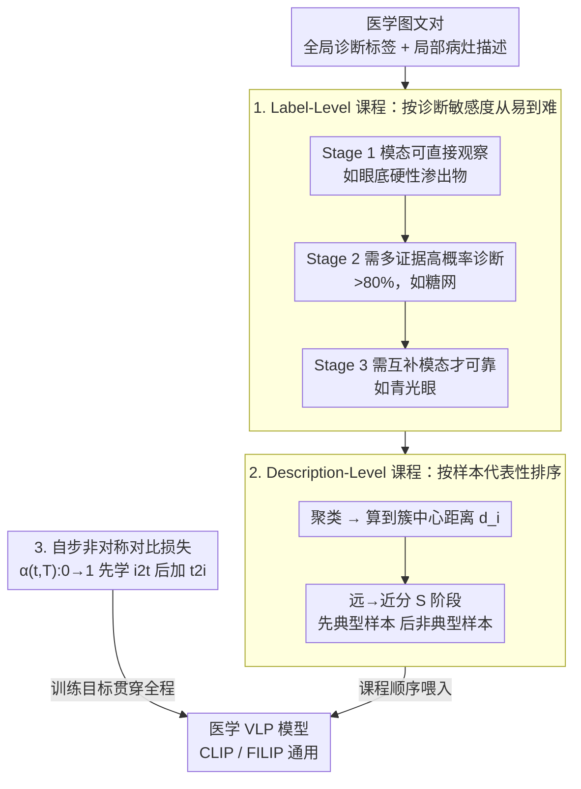

# MedKCO: Medical Vision-Language Pretraining via Knowledge-Driven Cognitive Orchestration

**会议**: CVPR 2026  
**arXiv**: [2603.09101](https://arxiv.org/abs/2603.09101)  
**代码**: [有](https://github.com/Mr-Talon/MedKCO)  
**领域**: 医学图像  
**关键词**: 视觉-语言预训练, 课程学习, 对比学习, 认知编排, 医学影像

## 一句话总结

提出 MedKCO，一种知识驱动的认知编排策略用于医学视觉-语言预训练：通过分层课程（label-level 按诊断敏感度排序 + description-level 按样本代表性排序）和自步非对称对比损失，让模型从简单到复杂渐进学习，在三种医学模态的零样本和下游任务上显著超越基线。

## 研究背景与动机

医学视觉-语言预训练（VLP，如 CLIP 的医学变体 MedCLIP、FLAIR、KeepFIT 等）旨在对齐医学图像和文本描述，但面临独特挑战：(1) 不同疾病的诊断难度差异大——"硬性渗出物"可直接在眼底图上看到，而"青光眼"需要更深的领域知识；(2) 同类疾病中样本代表性差异显著——典型样本特征清晰，非典型样本受个体变异和合并症干扰；(3) 医学图像的类间相似度极高（不同疾病的图像看起来很像），而文本描述却能清晰区分。

现有方法将所有难度的数据随机混合训练，迫使模型在还没建立基础概念时就同时学习简单和复杂概念——这违背了人类认知的渐进学习规律。本文受"最近发展区"认知理论启发，设计从易到难的预训练编排。

## 方法详解

### 整体框架

MedKCO 是一种模型无关的预训练策略，适用于任何医学 VLP 框架（论文在 CLIP 和 FILIP 上验证）。它从两个维度改进预训练：(1) **数据顺序**——设计分层课程控制数据呈现顺序，从简单概念到复杂概念；(2) **损失函数**——设计自步非对称对比损失，渐进调整对比学习的难度。数据顺序这条线又分两级：先用 label-level 课程（全局诊断标签）建立整体诊断能力，再用 description-level 课程（包含局部病灶的详细描述）细化局部表示；自步非对称对比损失则作为训练目标贯穿全程。

### 关键设计

**1. Label-Level 课程：按诊断敏感度把疾病从易到难排队**

不同疾病在同一模态下的可见程度天差地别——硬性渗出物在眼底图上一眼可见，青光眼却要靠领域知识甚至别的模态才能定，把它们随机混着喂模型，等于让它在没建立基础概念时就硬啃最难的。MedKCO 据此把 label-level 数据按特定模态的诊断敏感度分三阶段递增：Stage 1 是模态能直接观察到的结构性特征（如 CFP 中的硬性渗出物），Stage 2 是需要多种支持证据和专家解读的高概率诊断（>80%，如 CFP 中的糖尿病视网膜病变），Stage 3 是当前模态给不出确定性证据、得靠互补模态才能可靠识别的疾病（如 CFP 中的青光眼）。难度分级由多位医生与 LLM 协作完成、再经资深医生审核，保证课程顺序来自领域知识而非模型猜测。

**2. Description-Level 课程：先学典型样本再学非典型样本**

习得全局诊断能力后，模型还要学局部病灶表示，但样本的代表性参差不齐。核心假设是：离类别中心越远的样本受个体变异和合并症的干扰越小、疾病特征越典型。具体地，用预训练模型提取图像特征 $r_i^v$ 和文本特征 $r_i^t$，通过文本-标签相似度聚类 $c = \arg\max(r_i^t \boldsymbol{l}^T)$，再算每个样本到簇中心的归一化距离 $d_i = \|r_i^v - u_c\|_2 / d_{\max}$，按距离从大到小分成 $S$ 个阶段——先喂远离中心、特征清晰的代表性样本，再喂靠近中心、特征模糊的非典型样本。这条「远即典型」的排序在医学里反直觉却合理。

**3. 自步非对称对比损失：早期只学好认的方向，晚期再加难的**

标准对称对比损失 $\mathcal{L}_i = \frac{1}{2}(\mathcal{L}_i^{i2t} + \mathcal{L}_i^{t2i})$ 在医学图像上会翻车——预训练早期视觉编码器把不同疾病映射到相似表示（类间高相似），text-to-image 方向因此噪声极大。MedKCO 把损失改成 $\mathcal{L}_i = \frac{1}{2}(\mathcal{L}_i^{i2t} + \alpha(t,T)\mathcal{L}_i^{t2i})$，其中 $\alpha(t,T)$ 随训练进度从 0 线性增长到 1：早期只学较好认的 image-to-text 对齐（文本嵌入分散、易区分），后期再逐渐加入较难的 text-to-image 对齐。这把「视觉紧凑、文本分散」的不对称性直接编进了训练曲线。

### 损失函数 / 训练策略

- 视觉-语言对比损失，temperature 参数 $\sigma$ 控制
- 自步非对称权重：$\alpha(t,T)$ 默认线性调度（也测试了余弦、指数等）
- 投影头维度：CLIP 512，FILIP 256
- 文本最大 token 长度 256
- Warm-up cosine scheduler（第一个 epoch）
- Description-level 课程阶段数 $S=2$
- 单卡 RTX A6000 训练

## 实验关键数据

### 主实验

| 数据集 | 指标 | MedKCO (CLIP) | CLIP基线 | 提升 |
|--------|------|--------------|---------|------|
| ODIR200×3 (CFP, OOD) | ACC | **0.863** | 0.772 | +9.1% |
| REFUGE (CFP) | ACC | **0.947** | 0.897 | +5.0% |
| FIVES (CFP) | AUC | **0.729** | 0.676 | +5.3% |
| OCTID (OCT) | ACC | **0.778** | 0.709 | +6.9% |
| OCTDL (OCT, OOD) | ACC | **0.388** | 0.306 | +8.2% |
| CheXpert5×200 (CXR) | ACC | **0.526** | 0.384 | +14.2% |
| COVIDx (CXR, OOD) | ACC | **0.564** | 0.463 | +10.1% |
| **9个数据集平均** | — | **0.693** | 0.616 | +7.7% |

| 任务 | 模型框架 | MedKCO | 最佳CL基线 | 提升 |
|------|---------|--------|-----------|------|
| 零样本分类 (CLIP) | AVG | 0.693 | 0.600 (CL-log) | +9.3% |
| 零样本分类 (FILIP) | AVG | 0.640 | 0.552 (CL-log) | +8.8% |
| 报告生成 (CLIP) | AVG | **0.198** | 0.188 (CLIP) | +5.3% |
| 图文检索 (CLIP) | AVG R@10 | **11.9** | 10.2 (CL-log) | +16.7% |

### 消融实验

| 配置 | 关键指标 (AVG ACC) | 说明 |
|------|-------------------|------|
| 完整 MedKCO | 0.693 | 完整框架最优 |
| 无 label-level 课程 | 下降 | 失去诊断敏感度编排 |
| 无 description-level 课程 | 下降 | 样本代表性排序缺失 |
| 对称对比损失 ($\alpha=1$ 固定) | 下降 | 早期t2i噪声干扰 |
| 线性 vs 余弦 vs 指数调度 | 线性最优 | 简单线性即有效 |
| Description阶段数 S=1/2/3/4 | S=2 最优 | 过少或过多均不佳 |

### 关键发现

- MedKCO 在所有 OOD 数据集上均达到最佳结果，证明认知编排显著提升分布偏移下的鲁棒性
- 现有课程学习方法（CL-log、CL-logit）基于模型自身反馈调整难度，在医学VLP中效果不稳；MedKCO 基于领域知识外部定义难度，更可靠
- t-SNE 可视化展示：随课程推进，MedKCO 的特征空间结构性和可分性越来越好
- 报告生成实验表明 MedKCO 不仅提升零样本能力，还为下游迁移提供更好的初始化权重

## 亮点与洞察

- **认知科学 × 医学AI**: "最近发展区"理论的新颖应用——用领域知识而非模型反馈定义学习难度
- **非对称对比损失的洞察力**: 揭示了医学图像"视觉紧凑、文本分散"的不对称性，并用简洁的渐进权重解决
- **模型无关性**: 作为一种预训练策略，可无缝应用于 CLIP、FILIP 等不同框架
- **样本代表性度量**: "远离中心=更典型"的假设在医学领域是反直觉但合理的——典型病例特征突出、位于特征空间外围

## 局限与展望

- 诊断敏感度的三阶段划分需要领域专家参与，难以完全自动化
- Description-level 课程依赖预训练模型的特征质量，初始特征差会影响聚类和距离计算
- 仅在 CFP、OCT、CXR 三种模态上验证，未覆盖 CT、MRI、病理等
- 线性调度虽简单有效，但可能不是所有场景下的最优选择
- 课程学习的阶段数 $S$ 需要根据数据集特性手动调参

## 相关工作与启发

- Srinivasan et al. 按文本粒度（object → instance）组织课程，Chen et al. 按视觉任务难度组织——都是同方向的工作，但未考虑医学特有的难度结构
- 与 KeepFIT、FLAIR 等医学 VLP 的区别：聚焦于"怎么组织训练过程"而非"怎么设计模型结构"
- 启发：预训练数据的呈现顺序本身就是一个可优化的超参数，尤其在数据异质性强的医学领域

## 评分

- 新颖性: ⭐⭐⭐⭐ 认知编排+非对称对比损失的新颖组合，问题切入角度独特
- 实验充分度: ⭐⭐⭐⭐ 3种模态、9个数据集、零样本+检索+生成多任务，对比充分
- 写作质量: ⭐⭐⭐⭐ 动机图示清晰，算法伪代码完整
- 价值: ⭐⭐⭐⭐ 模型无关的预训练策略对医学VLP社区有广泛适用性

<!-- RELATED:START -->

## 相关论文

- [\[CVPR 2026\] From Panel to Pixel: Zoom-In Vision-Language Pretraining from Biomedical Scientific Literature](from_panel_to_pixel_zoom-in_vision-language_pretraining_from_biomedical_scientif.md)
- [\[CVPR 2026\] KAMP: Knowledge-Anchored Multimodal Pretraining Framework for Medical Image Representation](kamp_knowledge-anchored_multimodal_pretraining_framework_for_medical_image_repre.md)
- [\[CVPR 2026\] Modeling the Brain's Grammar: ROI-Guided fMRI Pretraining for Transferable and Interpretable Vision Decoding](modeling_the_brains_grammar_roi-guided_fmri_pretraining_for_transferable_and_int.md)
- [\[ICCV 2025\] Vector Contrastive Learning for Pixel-wise Pretraining in Medical Vision](../../ICCV2025/medical_imaging/vector_contrastive_learning_for_pixel-wise_pretraining_in_medical_vision.md)
- [\[CVPR 2026\] Multimodal Causality-Driven Representation Learning for Generalizable Medical Image Segmentation](multimodal_causal-driven_representation_learning_for_generalizable_medical_image.md)

<!-- RELATED:END -->
