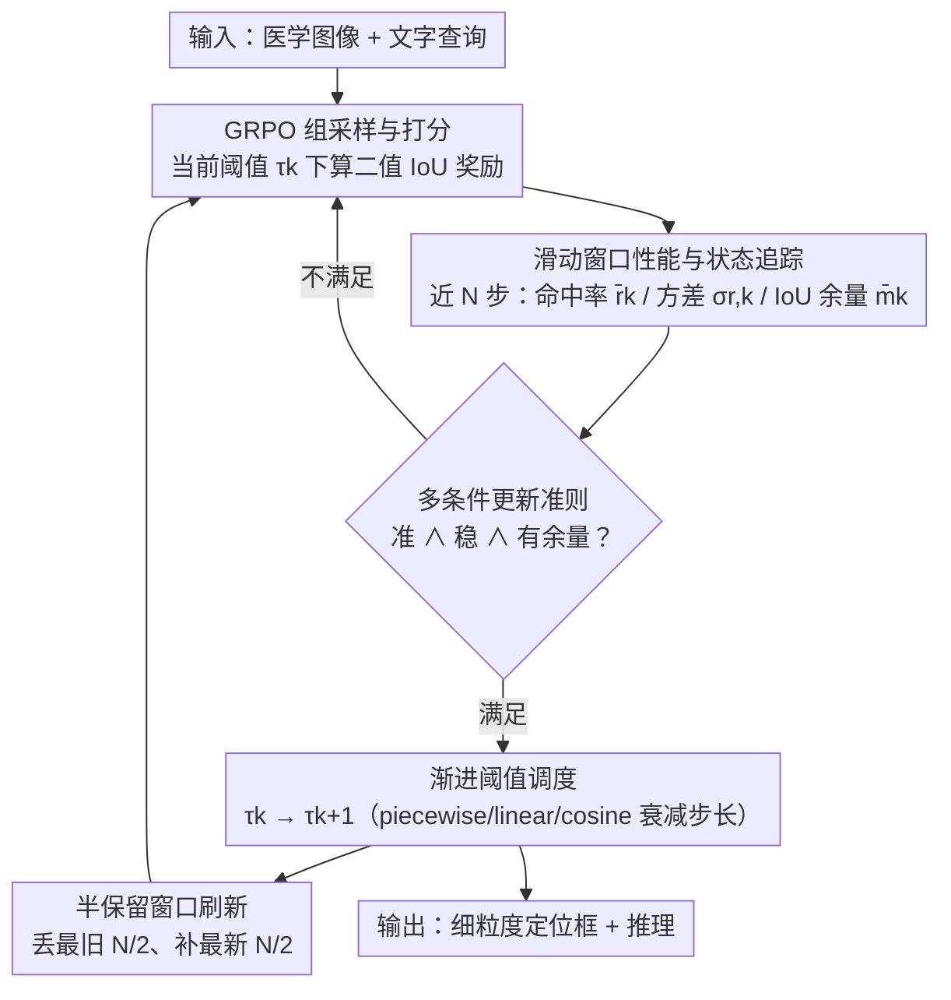

# MedLoc-R1: Performance-Aware Curriculum Reward Scheduling for GRPO-Based Medical Visual Grounding

**会议**: CVPR 2026  
**论文**: [CVF Open Access](https://openaccess.thecvf.com/content/CVPR2026/html/Yang_MedLoc-R1_Performance-Aware_Curriculum_Reward_Scheduling_for_GRPO-Based_Medical_Visual_Grounding_CVPR_2026_paper.html)  
**代码**: https://github.com/MembrAI/MedLoc-R1  
**领域**: 医学图像 / 强化学习 / 视觉定位  
**关键词**: 医学视觉定位、GRPO、奖励稀疏、课程学习、IoU 阈值调度

## 一句话总结
针对 GRPO 直接用于医学视觉定位时「固定 IoU 阈值奖励 → 早期全 0 奖励 → 梯度消失」的稀疏奖励难题，本文提出 MedLoc-R1，用一个滑动窗口性能追踪器 + 多条件更新准则，让 IoU 奖励阈值随模型能力从宽松（密集奖励）逐步收紧到严格（细粒度对齐），不加任何辅助网络就在三个医学定位基准上稳定提升精度与训练稳定性。

## 研究背景与动机
**领域现状**：医学视觉定位（给一段文字描述、在医学影像里框出对应病灶）是细粒度多模态推理和可解释临床决策的基础。近期工作（Visual-RFT、VLM-R1、Med-R1 等）把 GRPO 这类无需价值网络的强化学习后训练搬到视觉定位上，用「预测框与真值框的 IoU 是否超过固定阈值 $\tau$」作为二值奖励来微调大视觉语言模型（LVLM）。

**现有痛点**：医学图像与自然图像差别很大——信噪比低、边界模糊、病灶小、类别极不均衡。在这种条件下，让模型一上来就把框画到 IoU≥0.5 几乎不可能，于是一组采样里**所有候选的奖励都是 0**。GRPO 靠组内奖励的相对差异来估计优势 $A_i$，当组内奖励全为 0 时均值和方差都塌成 0，优势恒为 0，策略梯度随之消失，训练在早期就「卡死」收敛不动。这就是强化学习里典型的稀疏奖励问题。

**核心矛盾**：固定阈值与策略学习的动态性天然错配。早期阈值太严 → 奖励稀疏、梯度消失；后期若一直用宽松阈值 → 又无法逼出细粒度定位。而传统课程学习靠「样本重排 / 渐进暴露数据」来调难度，在 RL 定位里不适用，因为这里任务难度是由**奖励设计**而非输入分布决定的。

**本文目标**：构造一个「渐进式、且感知模型当前表现」的奖励课程，让阈值不是按预设进度表（如 V-Triune 那样只看训练进度百分比）盲目抬高，而是看模型「准备好了没有」再抬。

**切入角度**：把课程学习「由易到难、循序渐进」的思想搬到奖励 shaping 上——奖励阈值就是难度旋钮。只要能可靠地量化「当前难度下模型表现是否已经足够稳、足够好、还有余量」，就能安全地往上拧。

**核心 idea**：用一个滑动窗口持续追踪近期的命中率、奖励方差和 IoU 余量三项统计量，用一条「准、稳、有余量」三条件同时满足的复合准则触发 IoU 阈值上调，实现从「密集奖励—粗定位」到「稀疏奖励—细对齐」的平滑过渡，整个机制不引入任何辅助网络或额外梯度路径。

## 方法详解

### 整体框架
MedLoc-R1 把标准 GRPO 训练循环包了一层「自适应阈值课程」。给定医学图像 $I$ 和文字查询 $q$，模型 $\pi_\theta$ 输出推理过程和一个边界框 $\hat b\in\mathbb{R}^4$；奖励仍是「IoU 是否超过当前阈值 $\tau_k$」的二值信号。关键在于 $\tau_k$ 不再固定：每一步用最近 $N$ 步的统计量评估模型在当前难度下的表现，一旦同时满足「平均奖励够高、奖励够稳、IoU 余量够大」三条件，就把阈值往上抬一档；否则保持当前难度继续练。整个调度只作用于「阈值这一标量」，GRPO 的策略更新路径原封不动，因此零额外参数、几乎零计算开销。

### 关键设计

**1. 滑动窗口性能与状态追踪：用三项可解释统计量刻画「模型现在到底练得怎样」**

光看单步奖励无法判断该不该升难度——单步可能恰好蒙对，也可能恰好抽到难样本。本文在每个训练步 $k$ 维护一个长度为 $N$ 的滑动窗口 $W_k$，收集近 $N$ 步、每步 $G$ 个候选框的 IoU 与奖励，归纳出三个互补指标。第一是**窗口平均奖励** $\bar r_k$，由于奖励是二值的，它直接等于近期的命中率：$\bar r_k=\frac{1}{N}\sum_{t\in W_k}\frac{1}{G}\sum_{i=1}^{G}\mathbb{I}[\mathrm{IoU}(\hat b_i^{(t)},b^{*(t)})\ge\tau_k]$，$\bar r_k$ 高说明当前难度已经不构成挑战。第二是**奖励标准差** $\sigma_{r,k}$，刻画表现的一致性——$\sigma_{r,k}$ 大意味着「时对时错」，这时升难度会被一次偶然的奖励尖峰误导，所以方差大就推迟升级。第三是 **IoU 余量** $\bar m_k=\frac{1}{N}\sum_{t\in W_k}\frac{1}{G}\sum_i \mathrm{IoU}(\hat b_i^{(t)},b^{*(t)})-\tau_k$，即平均 IoU 超出当前阈值多少；它比二值奖励更细，能区分「刚好压线达标」和「已经远超阈值、有能力吃更高难度」，从而避免模型在阈值边缘原地踏步却不实质进步。三者合在一起给出「准（$\bar r_k$）、稳（$\sigma_{r,k}$）、有余量（$\bar m_k$）」的可解释判据。

**2. 多条件课程更新准则与渐进阈值调度：只有「准且稳且有余量」时才把难度往上拧**

有了三项统计量，难点变成「何时、怎么」升难度。本文定义复合更新条件 $\mathcal{C}_k:=(\bar r_k\ge P_{\tau_k})\wedge(\sigma_{r,k}\le S_{\tau_k})\wedge(\bar m_k\ge\Delta)$，即平均奖励不低于下限 $P_{\tau_k}$、方差不超过上限 $S_{\tau_k}$、IoU 余量不低于 $\Delta$，三者同时成立才算「这一阶段已收敛」。这些门限本身也随阶段自适应：阈值越高 $P_{\tau_k}$ 越放宽（让模型在更严设定下还能继续进步）、$S_{\tau_k}$ 逐步放大（容忍更严条件下更高的方差），而 $\Delta$ 固定（如 0.10）保证稳定的余量要求。一旦 $\mathcal{C}_k$ 满足，按 $\tau_{k+1}=\min(\tau_k+\delta(\tau_k),\,\tau_{\text{target}})$ 抬升阈值。步长 $\delta(\tau_k)$ 有三种衰减形态：默认的**分段衰减**（piecewise，前期大步、后期小步，需多个阶段步长与边界超参）；以及只需单个初始步长 $\delta_0$ 的**线性衰减**和**余弦衰减**——线性以近似恒定速度收紧，余弦则早期增量大、接近目标阈值时增量小、轨迹更平滑。三者都做到「早期快速推进、临近目标做细粒度精修」，且实验显示线性/余弦在大幅减少调参的同时仍有竞争力。这套「看表现再升级」从根上区别于 V-Triune 那种「只看训练进度百分比」的固定调度，避免了过早抬高难度导致的训练失稳。

**3. 半保留窗口刷新：阈值一变，统计量也要跟着「换血」但不全丢**

阈值更新后，旧阈值下采到的奖励分布会污染新阶段的判断（旧统计还停留在更宽松的难度上）。本文在每次升级时对窗口做**半保留刷新**：丢掉 $W_k$ 中最旧的一半样本、只留最近 $N/2$ 步，剩下的一半用新阈值下新采的数据补满，组成 $W_{k+1}$。这样既能快速适应新阈值下的奖励分布，又保留了足够历史信息、不至于对瞬时波动过度敏感。作者对比指出，相比「全部替换」或「只换四分之一」，半保留在连续多阶段调度中最稳。值得强调的是，这个刷新只影响统计量的计算，**不触碰策略更新路径**，从而保证训练连续性。

### 损失函数 / 训练策略
底层优化沿用标准 GRPO：组内归一化优势 $A_i=\frac{r_i-\mathrm{mean}(\mathbf{r})}{\mathrm{std}(\mathbf{r})}$，目标为带 KL 正则的裁剪 PPO 形式 $\mathcal{J}_{\mathrm{GRPO}}(\theta)=\frac{1}{G}\sum_i\min[\rho_i A_i,\ \mathrm{clip}(\rho_i,1-\epsilon,1+\epsilon)A_i]-\beta\,\mathrm{KL}[\pi_\theta\|\pi_{\text{ref}}]$。实现基于 Qwen2.5-VL（主模型 3B，另测 7B/32B），组大小 $G=8$、温度 0.9、$\beta=0.4$，AdamW、学习率 1e-6，4 张 H800。分段衰减默认 $\tau_0=0.3\to\tau_{\text{target}}=0.8$，步长 $\delta^{(1)}=0.15,\delta^{(2)}=0.10,\delta^{(3)}=0.05$，阶段边界 $\beta^{(1)}=0.55,\beta^{(2)}=0.75$；线性/余弦用 $\tau_0=0.2,\tau_{\text{target}}=0.8,\delta_0=0.2$。窗口长度 $N=30$，训练至多 5 个 epoch、step 1000 评估。

## 实验关键数据

### 主实验
三个不同模态的医学定位基准：HAM10000（皮肤镜）、HEEL（X 光）、TN3K（超声），由分割掩码/区域标注转出边界框，8:2 划分，3 个随机种子取均值。指标为 A@0.5 / A@0.8（对应 IoU 阈值的准确率）和 pseudo-mAP（0.5–0.95 共 10 档阈值的平均准确率）。

| 数据集 | 指标 | MedLoc-R1-3B | SFT-3B | VLM-R1-3B(固定阈值) | V-Triune-3B | Raw-IoU-3B |
|--------|------|------|------|------|------|------|
| HAM10000 | A@0.5 | **94.46** | 90.31 | 64.65 | 88.92 | 92.86 |
| HAM10000 | A@0.8 | **76.02** | 74.22 | 18.57 | 64.35 | 69.25 |
| HEEL | A@0.8 | **47.35** | 45.18 | 4.17 | 25.05 | 11.49 |
| HEEL | mAP | **59.01** | 56.25 | 21.41 | 38.61 | 35.29 |
| TN3K | A@0.5 | **66.18** | 62.39 | 43.01 | 43.50 | 57.17 |
| TN3K | mAP | **37.96** | 36.11 | 20.78 | 21.85 | 29.28 |

提升在更严的 A@0.8 上尤为明显：相比固定阈值 VLM-R1，HEEL 上 A@0.8 提升 +43.18；相比 V-Triune，TN3K 上 mAP 提升 +16.11（均带显著性检验）。方法可扩展，7B、32B 进一步涨点（如 HEEL A@0.8：3B 47.35 → 7B 57.83 → 32B 57.96）。训练曲线上 MedLoc-R1 收敛更快、增长更稳。

### 消融实验
均在 HAM10000 上，报告 A@0.5。

| 配置 | A@0.5 | 说明 |
|------|-------|------|
| Full（三条件全开） | **94.96** | 完整更新准则 |
| w/o 奖励检查（$\bar r_k\ge P_{\tau_k}$） | 82.33 | 去掉后掉 −12.63，影响最大 |
| w/o IoU 余量检查（$\bar m_k\ge\Delta$） | 90.86 | 去掉掉 ~4 点 |
| w/o 稳定性检查（$\sigma_{r,k}\le S_{\tau_k}$） | 89.72 | 去掉掉 ~5 点 |
| 仅奖励检查 | 88.32 | 单条件均不如双/三条件 |
| 仅余量检查 | 84.92 | 同上 |
| 仅稳定性检查 | 86.87 | 同上 |

调度策略消融（A@0.5）：自适应（动态调 $\delta_k,P_k,S_k$）94.96 ＞ Fixed-Conservative 87.92 ＞ Fixed-Moderate 83.92 ＞ Fixed-Aggressive 71.54——激进固定调度差超过 20 个点。步长消融：动态步长 94.96 远高于任意固定步长（Identical $\delta_k$=0.05/0.15/0.25 分别只有 76.29/79.64/77.13）。

### 关键发现
- **三条件中「奖励检查」最关键**：去掉它在嘈杂信号下会过早升级难度，A@0.5 直接掉 12.63；余量检查与稳定性检查则负责滤掉「不确定 / 波动剧烈」的学习阶段，三者互补缺一不可。
- **「看表现」远胜「看进度」**：任何固定/激进的预设调度都明显落后于自适应调度，印证了把阈值与模型 readiness 对齐才是稳住 GRPO 的核心。
- **简洁衰减够用**：线性/余弦只需单个 $\delta_0$，性能与需要多超参的分段衰减接近，说明方法对步长调参不敏感、易迁移。
- **可解释性副产物**：定性对比显示 MedLoc-R1 的推理会抓住「跟骨特征曲率」「结节回声与位置」等诊断线索来定位，而固定阈值基线常给冗长流程描述却缺乏诊断证据。

## 亮点与洞察
- **把课程学习从「调数据」迁到「调奖励」**：传统课程学习靠样本重排，在 RL 定位里不适用；本文识别出「奖励阈值才是难度旋钮」，这个再定位很干净，也解释了为什么 V-Triune 这类按进度调阈值的做法不够——难度该由表现而非时间驱动。
- **零额外参数、零额外梯度路径**：所有机制都只作用于一个标量阈值和窗口统计，GRPO 主体不动，几乎零开销却能根治稀疏奖励，工程上极易嫁接到现有 GRPO 定位 pipeline。
- **三条件判据可解释可控**：「准 / 稳 / 有余量」对应命中率、方差、IoU 余量，含义直白，便于诊断训练状态，也便于跨任务复用——任何二值阈值奖励的 RL 任务（不止医学定位）都能套用这套渐进收紧思路。

## 局限与展望
- **门限超参仍需设定**：$P_{\tau_k}$、$S_{\tau_k}$、$\Delta$ 以及衰减步长虽可自适应，但其调度形式与初值仍是人工设定，分段衰减尤其依赖多阶段步长与边界（论文也承认这点，故主推线性/余弦作折中）。
- **奖励仍是二值 IoU**：本文优化的是「何时升阈值」，但单个阈值下奖励依旧二值，连续 IoU 信号（Raw-IoU）虽然对比弱、但理论上信息更丰富，二者如何结合（如阈值课程 + 软奖励）值得探索。
- **评估指标受限**：模型只输出框不输出置信度，无法用标准 AP，作者改用 pseudo-mAP；这一指标的可比性需谨慎，跨论文直接比大小要留意定义差异（⚠️ 以原文为准）。
- **窗口刷新比例**：半保留是经验最优，但 $N$、刷新比例与任务噪声水平的关系尚未系统刻画。

## 相关工作与启发
- **vs VLM-R1（固定阈值 GRPO）**：VLM-R1 用静态 $\tau_{\text{fixed}}=0.5$，早期奖励稀疏、梯度消失，后期又封顶。MedLoc-R1 让阈值随表现从低到高滑动，HEEL 上 A@0.8 反超 +43.18，证明动态阈值是医学定位稳定训练的关键。
- **vs V-Triune（按进度的预设调度）**：V-Triune 给早/中/晚三阶段分配三个固定阈值，但只看训练进度、不看模型表现，有过早升难度、训练失稳的风险。本文的复合条件「准且稳且有余量」直接堵住了这个漏洞，TN3K mAP 反超 +16.11。
- **vs Raw-IoU（连续奖励）**：Raw-IoU 用连续 IoU 作奖励、不做离散阈值，但早期预测间分差很小、对比不足，GRPO 更新乏力。MedLoc-R1 用「逐步收紧的离散边界」制造更强对比，整体优于连续信号，说明对比度而非信号连续性才是 GRPO 优势的来源。

## 评分
- 新颖性: ⭐⭐⭐⭐ 把课程学习清晰地重定位到「奖励阈值调度」，复合三条件判据简洁有效，但属于 reward shaping 框架内的精巧改进。
- 实验充分度: ⭐⭐⭐⭐ 三模态基准、3 个种子带显著性检验、3 种规模可扩展、更新准则/调度/步长/窗口多维消融，扎实。
- 写作质量: ⭐⭐⭐⭐ 问题刻画（稀疏奖励的形式化）清楚，方法动机直白；部分公式/指标定义偏密。
- 价值: ⭐⭐⭐⭐ 即插即用、零额外开销，可推广到任何二值阈值奖励的 RL 定位任务，对医学 RL 后训练实用性强。

<!-- RELATED:START -->

## 相关论文

- [\[CVPR 2026\] MedTVT-R1: A Multimodal LLM Empowering Medical Reasoning and Diagnosis](medtvt-r1_a_multimodal_llm_empowering_medical_reasoning_and_diagnosis.md)
- [\[CVPR 2026\] Better than Average: Spatially-Aware Aggregation of Segmentation Uncertainty Improves Downstream Performance](better_than_average_spatially-aware_aggregation_of_segmentation_uncertainty_impr.md)
- [\[CVPR 2026\] MedMO: Grounding and Understanding Multimodal Large Language Model for Medical Images](medmo_grounding_and_understanding_multimodal_large_language_model_for_medical_im.md)
- [\[CVPR 2026\] MR-RAG: Multimodal Relevance-Aware Retrieval-Augmented Generation for Medical Visual Question Answering](mr-rag_multimodal_relevance-aware_retrieval-augmented_generation_for_medical_vis.md)
- [\[CVPR 2026\] CURE: Curriculum-guided Multi-task Training for Reliable Anatomy Grounded Report Generation](cure_curriculum-guided_multi-task_training_for_reliable_anatomy_grounded_report_.md)

<!-- RELATED:END -->
