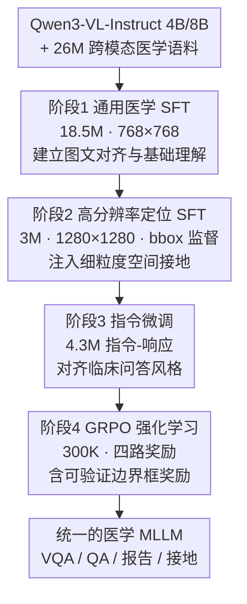

# MedMO: Grounding and Understanding Multimodal Large Language Model for Medical Images

**会议**: CVPR 2026  
**论文**: [CVF Open Access](https://openaccess.thecvf.com/content/CVPR2026/html/Deria_MedMO_Grounding_and_Understanding_Multimodal_Large_Language_Model_for_Medical_CVPR_2026_paper.html)  
**代码**: https://github.com/genmilab/MedMO （有）  
**领域**: 医学图像 / 多模态VLM  
**关键词**: 医学多模态大模型, 视觉定位, 多阶段后训练, 边界框奖励, 可验证奖励强化学习

## 一句话总结
MedMO 以 Qwen3-VL 为底座、用 26M+ 跨模态医学数据走"通用医学 SFT → 高分辨率定位 SFT → 指令微调 → 带边界框奖励的 GRPO 强化学习"四阶段后训练，把医学影像的理解（VQA / QA / 报告生成）和细粒度空间定位（bbox 接地）统一进一个开源 VLM，在多类临床任务上超过现有开源医学 MLLM。

## 研究背景与动机
**领域现状**：通用多模态大模型（MLLM）在图像描述、VQA、多模态推理上接近人类水平，但搬到医学领域就明显力不从心——医学影像需要专业领域解读和对临床文本知识的稳健接地（grounding），通用模型常产生不确定或幻觉输出。已有 LLaVA-Med、HuatuoGPT-Vision、GMAI-VL、Lingshu、Fleming-VL 等沿着"领域数据 + 后训练"路线推进。

**现有痛点**：作者点出三个持续存在的问题——① 多数医学 MLLM 依赖从闭源专有模型蒸馏来的数据，规模大但缺乏准确的领域接地，尤其在细粒度临床推理上；② 蒸馏管线常只用生成式输出、缺乏结构化监督，放大幻觉与不一致；③ 现有模型多聚焦单一任务或窄模态子集（只做放射或只做病理），缺乏跨模态的统一泛化。

**核心矛盾**：医学场景既要"看懂"（理解 / 推理 / 报告），又要"指得准"（把病灶 / 细胞用边界框定位到像素），而现有方法要么牺牲接地、要么牺牲跨模态覆盖，二者难以在一个模型里同时做强。

**本文目标**：造一个**开源、跨模态、既能理解又能空间接地**的医学 MLLM，并配套可复现的数据 + 训练配方。

**切入角度**：与其依赖闭源蒸馏数据，不如自建大规模、多模态、带结构化监督（尤其是 bbox 标注）的语料，用渐进式多阶段后训练逐步注入"对齐 → 定位 → 指令遵循 → 强化"的能力，并在 RL 阶段引入一个**可验证的、空间接地的边界框奖励**直接优化定位。

**核心 idea**：用四阶段渐进后训练把跨模态对齐、细粒度接地、临床指令遵循统一起来，并以 GIoU + L1 构成的可验证 Bbox 奖励把"指得准"显式纳入 RL 目标。

## 方法详解

### 整体框架
MedMO 从 Qwen3-VL-Instruct（4B / 8B）出发，其架构含视觉编码器 $E_v$、用 DeepStack 融合多层 ViT 特征投影到语言空间的视觉-语言适配器 $A$、以及语言解码器 $D$。后训练分四个串行阶段，分辨率与数据规模逐级演进：先用 18.5M 大规模指令数据做**通用医学 SFT**建立基础理解（768×768）；再用 3M 专家标注、含 bbox 的数据做**高分辨率定位 SFT**注入空间接地能力（1280×1280）；接着用 4.3M 指令-响应对做**指令微调**对齐临床问答风格；最后用 300K 样本做**带四路奖励的 GRPO 强化学习**，其中以可验证的边界框奖励强化定位。SFT 阶段统一用下一 token 预测目标 $L_{\text{SFT}}=-\sum_{i=1}^m\log p_\theta(y_i\mid v,x,y_{<i})$。

### 关键设计

**1. 四阶段渐进后训练：把"对齐→定位→指令→强化"分层注入**

针对"现有模型要么缺接地、要么缺跨模态覆盖"的痛点，MedMO 把能力分四阶段逐步堆叠，每阶段有明确目标、数据规模与分辨率。阶段 1 用公开的 MedTrinity（18.5M，含图像描述 $D_{\text{caption}}$、医学 VQA $D_{\text{vqa}}$、通用多模态 $D_{\text{general-mm}}$，合集 $D_{\text{stage1}}=D_{\text{caption}}\cup D_{\text{vqa}}\cup D_{\text{general-mm}}$）建立跨模态全局对齐；阶段 2 转向高质量专家标注、含 bbox 的数据 $D_{\text{hq}}$（胸片、腕部 X 光、细胞显微、CT），把视觉编码器扩展到预测局部特征与框坐标，在保持全局图文对齐的同时引入定位；阶段 3 用 4.3M 指令数据覆盖描述、诊断问答、报告摘要、检索推理，提升任务泛化与事实一致性；阶段 4 才上 RL。这种"由粗到细、由理解到接地再到指令遵循"的分层注入，让单一模型同时具备理解与定位两类能力，而非各管一摊。

**2. GRPO 强化学习 + 四路奖励：把临床偏好与定位拉进策略优化**

阶段 4 用 GRPO 做偏好学习：对每个输入 $(v,x)$ 从旧策略采样 $G$ 条回答，按归一化优势 $\hat{A}_{i,t}=\frac{R_i-\text{mean}(\{R_i\})}{\text{std}(\{R_i\})}$、配合 clip-higher 与 token 级损失（借鉴 DAPO）优化重要性比 $r_{i,t}(\theta)=\frac{\pi_\theta(o_{i,t}|q,o_{i,<t})}{\pi_{\theta_{\text{old}}}(o_{i,t}|q,o_{i,<t})}$，并以 KL 项 $L_{\text{KL}}=\mathbb{E}[D_{\text{KL}}(\pi_\theta\|\pi_{\text{ref}})]$ 约束不偏离参考模型。奖励由四路组合：标签准确性、边界框奖励、标签数量（tag count）、软超长惩罚（soft-overlong punishment）。前者保证答案正确，后两者约束输出格式与长度，而边界框奖励是本文强调的、可验证且空间接地的关键信号。

**3. 可验证边界框奖励：用 GIoU + L1 + 匈牙利匹配把"指得准"变成可优化的标量**

针对"只用生成式输出、缺结构化监督导致定位不准"的痛点，作者设计了一个可验证的 bbox 奖励，直接优化定位质量。给定真值框集 $G=\{g_j\}$ 与预测框集 $P=\{p_i\}$（XYXY 格式），先算分辨率无关的归一化 L1：$L1_{ij}=\frac{|x_1^p-x_1^g|+|y_1^p-y_1^g|+|x_2^p-x_2^g|+|y_2^p-y_2^g|}{2\sqrt{H^2+W^2}}$（用图像对角线归一，使其与分辨率无关），再用匈牙利匹配在代价 $C_{ij}=w_{L1}^m L1_{ij}+w_G^m(1-\text{GIoU}_{ij})$（$w_{L1}^m=5,w_G^m=2$）上求一对一指派 $M$。对每个匹配对定义逐对质量 $s_{ij}=\frac{w_{L1}(1-\text{clip}_{[0,1]}(L1_{ij}))+w_G(\frac{\text{GIoU}_{ij}+1}{2})}{w_{L1}+w_G}$（$w_{L1}=5,w_G=2$），奖励为覆盖归一化求和并扣除漏检 / 误检惩罚：$B=\frac{1}{G}\sum_{(i,j)\in M}s_{ij}$，$\text{Pen}=\frac{\lambda_{\text{FN}}(G-|M|)+\lambda_{\text{FP}}(P-|M|)}{\max(1,G)}$，最终 $R_{\text{bbox}}=\text{clip}_{[0,1]}(B-\text{Pen})^2$。⚠️ 部分系数与公式取自密集 OCR，细节以原文为准。这个奖励既奖励框对得准（GIoU + L1），又惩罚框多框少（FP/FN），把空间定位变成可验证、可微调度的标量信号。

### 损失函数 / 训练策略
SFT 阶段用标准下一 token 预测损失 $L_{\text{SFT}}$；RL 阶段用 GRPO 目标 $J(\theta)$ 加 KL 约束。训练用 64× AMD Instinct MI210（64GB）跑 25 天，四阶段耗时分别约 225h / 155h / 110h / 98h，框架基于 TRL。阶段 1：BS=10、LR=1e-5、cosine、grad accum=2；阶段 2：BS=2、LR=8e-6、cosine、grad accum=8；阶段 3：BS=10、LR=5e-6、grad accum=2。数据为 45 个数据集、26M+ 样本，覆盖放射 / 病理 / 眼科 / 皮肤 / 外科等模态；并自建 Cell 基准（取自 DeepCell、Bacteria 等开源显微图）评估检测能力。

## 实验关键数据

### 主实验
在医学 VQA 与文本 QA 基准上，MedMO-8B 取得开源最佳，逼近专用医学 SOTA Fleming-VL：

| 模型 | VQA 平均 | Text QA 平均 | MMMU-Med | VQA-RAD | MedQA |
|------|----------|--------------|----------|---------|-------|
| Fleming-VL-8B | **61.4** | 45.7 | 63.3 | 56.4 | 53.7 |
| Qwen3VL-8B（底座） | 39.5 | 53.6 | 61.4 | 31.2 | 66.1 |
| MedMO-4B | 45.3 | 55.1 | 54.6 | 35.0 | 78.5 |
| MedMO-8B | 60.8 | **61.3** | **64.6** | **64.7** | **84.3** |

MedMO-8B 的 VQA 平均（60.8）距医学 SOTA Fleming-VL（61.4）仅差 0.6 个点，却在 MMMU-Med、VQA-RAD 上取得最佳；Text QA 平均 61.3 反超 Qwen3VL-8B（53.6）约 7.7 点，在 MMLU-Med、MedQA、MedMCQA 等推理密集基准上提升尤为明显。

### 消融 / 任务分解（报告生成与接地）
不同任务上 MedMO 相对底座与基线的增益（来自 Figure 1 与 Table 2 文字）：

| 任务 / 基准 | 指标 | 增益 | 说明 |
|-------------|------|------|------|
| Bacteria（细胞分割） | IoU | +43.8 | 高分辨率显微 + 细粒度接地监督带来的最大跃升 |
| MIMIC-CXR（报告生成） | CIDEr | 140.0 | 超过 Fleming-VL-8B（132.5） |
| MIMIC-CXR | ROUGE-L | 31.7% | 语义指标强；⚠️ Fleming-VL 的 35.7% 在该项更高 |
| VQA-RAD | Acc | +8.3 | 相对底座 |
| MedQA | Acc | +18.2 | 相对底座，文本推理增益最大 |

### 关键发现
- **接地能力提升最猛**：Bacteria 上 IoU 暴涨 +43.8（相对底座 +40.4、相对 Fleming-VL +37.0），主要源自阶段 2 的高分辨率显微数据 + 阶段 4 的可验证 bbox 奖励，凸显结构化空间监督对定位的决定性作用。
- **理解与接地可在一个模型里兼得**：MedMO-8B 同时在 VQA、QA、报告生成、grounding 四类任务上稳定领先开源对手，验证了四阶段渐进后训练"统一而不偏科"。
- **报告生成喜忧参半**：CIDEr 140.0 超 Fleming-VL，但 ROUGE-L（31.7%）低于 Fleming-VL（35.7%），说明在 n-gram 重叠类语义指标上仍有提升空间。⚠️ 上述数值取自表格 / Figure 密集 OCR，个别项以原文为准。

## 亮点与洞察
- **可验证的边界框奖励**：用 GIoU + L1 + 匈牙利匹配 + FP/FN 惩罚把"框对不对"压成一个 $[0,1]$ 标量奖励，让 RL 直接优化空间定位，这是把"接地"做强的核心 trick，可迁移到任何需要框级监督的医学 / 通用 grounding 任务。
- **分辨率随阶段升级**：从 768×768（对齐）升到 1280×1280（定位），用更高分辨率喂细粒度接地，思路简单但对细胞 / 病灶这类小目标定位收益巨大。
- **大规模可复现配方**：26M+、45 数据集、四阶段时长 / 超参全公开，并自建 Cell 检测基准，为后续医学 MLLM 研究提供透明的训练 recipe 与评测平台。

## 局限与展望
- **训练成本极高**：64× MI210 跑 25 天，普通团队难以复现整套四阶段管线。
- **报告生成指标不全面领先**：ROUGE-L 等 n-gram 语义指标仍逊于 Fleming-VL，临床事实一致性的进一步提升空间存在。
- **依赖数据质量与覆盖**：跨模态泛化建立在 45 个数据集的覆盖之上，对长尾模态 / 罕见病的表现未充分评估。
- **改进方向**：自适应调度各阶段数据配比、把 bbox 奖励扩展到分割 / 关键点等更细粒度监督、以及更轻量的训练管线。

## 相关工作与启发
- **vs LLaVA-Med / HuatuoGPT-Vision 等早期医学 MLLM**：它们靠 PubMed / 高质量数据做对齐，但接地弱、模态覆盖窄；MedMO 用四阶段后训练 + bbox 奖励把空间接地显式做强。
- **vs Fleming-VL / Lingshu（医学 SOTA）**：它们在选定任务上强但能力面窄；MedMO 在 VQA / QA / 报告 / 接地上做到更均衡的统一覆盖，VQA 仅差 SOTA 0.6 点而接地大幅领先。
- **vs Grounding-DINO 这类检测目标方法**：它们是纯检测范式；MedMO 把框接地原生融进 VLM 的生成式输出（JSON 坐标），让"理解 + 定位"在同一对话里完成。

## 评分
- 新颖性: ⭐⭐⭐⭐ 可验证 bbox 奖励 + 四阶段统一接地 / 理解，工程组合新颖，但单个组件多沿用已有范式。
- 实验充分度: ⭐⭐⭐⭐⭐ 45 数据集、跨四类任务、4B/8B 双尺寸、自建 Cell 基准，评测覆盖广。
- 写作质量: ⭐⭐⭐⭐ 阶段—数据—奖励讲得清楚，公式略密；部分表格 OCR 噪声需对照原文。
- 价值: ⭐⭐⭐⭐⭐ 开源、可复现、跨模态统一接地的医学 MLLM，对医学 AI 社区参考价值高。

<!-- RELATED:START -->

## 相关论文

- [\[CVPR 2026\] MLLM-HWSI: A Multimodal Large Language Model for Hierarchical Whole Slide Image Understanding](mllm-hwsi_a_multimodal_large_language_model_for_hierarchical_whole_slide_image_u.md)
- [\[CVPR 2026\] OralGPT-Omni: A Versatile Dental Multimodal Large Language Model](oralgpt-omni_a_versatile_dental_multimodal_large_language_model.md)
- [\[CVPR 2026\] LLaDA-MedV: Exploring Large Language Diffusion Models for Biomedical Image Understanding](llada-medv_exploring_large_language_diffusion_models_for_biomedical_image_unders.md)
- [\[CVPR 2026\] fMRI-LM: Towards a Universal Foundation Model for Language-Aligned fMRI Understanding](fmri-lm_towards_a_universal_foundation_model_for_language-aligned_fmri_understan.md)
- [\[CVPR 2026\] LEMON: A Large Endoscopic MONocular Dataset and Foundation Model for Perception in Surgical Settings](lemon_a_large_endoscopic_monocular_dataset_and_foundation_model_for_perception_in.md)

<!-- RELATED:END -->
