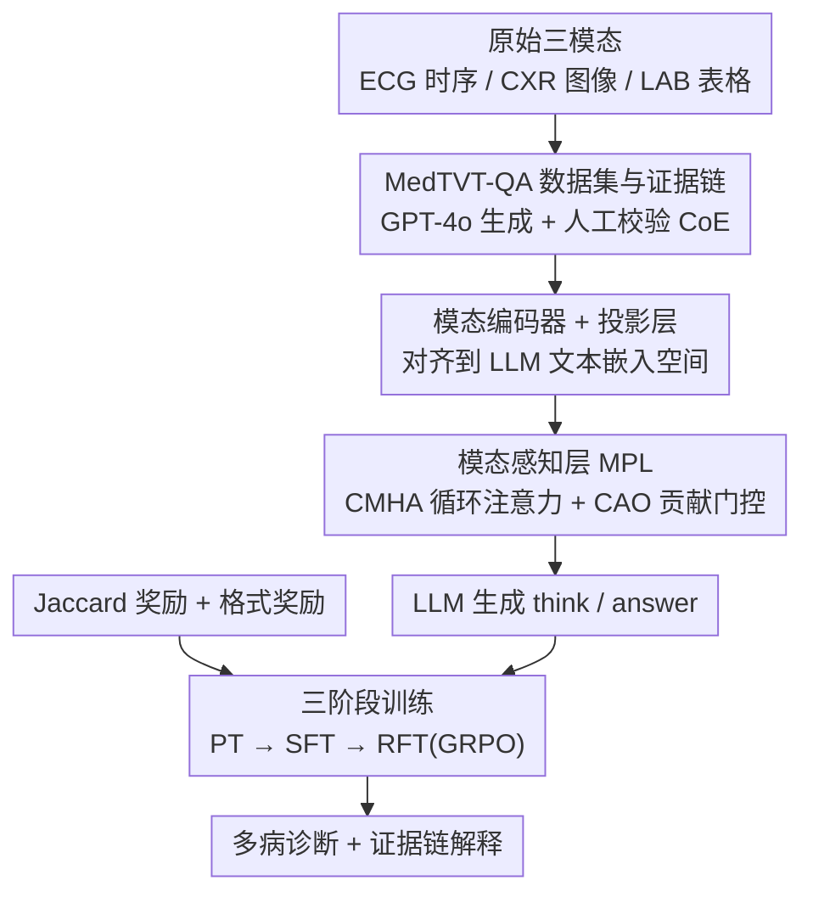

# MedTVT-R1: A Multimodal LLM Empowering Medical Reasoning and Diagnosis

**会议**: CVPR 2026  
**论文**: [CVF Open Access](https://openaccess.thecvf.com/content/CVPR2026/html/Zhang_MedTVT-R1_A_Multimodal_LLM_Empowering_Medical_Reasoning_and_Diagnosis_CVPR_2026_paper.html)  
**代码**: https://github.com/keke-nice/MedTVT-R1 （有）  
**领域**: 医学图像 / 多模态VLM  
**关键词**: 多模态医学诊断、ECG-CXR-LAB 三模态、模态感知层、GRPO、证据链推理

## 一句话总结
MedTVT-R1 把同一病人的心电图（时序）、胸片（图像）和化验单（表格）三种异构数据统一喂进一个 MLLM，靠"模态感知层 + 证据链指令数据 + GRPO 强化微调"实现可解释的多病共诊，在临床效价（F1、AUC）和长文本诊断生成上同时超过通用与医疗专用 MLLM。

## 研究背景与动机
**领域现状**：医学 AI 诊断目前大多依赖单一模态——文本病历分析、放射影像判读、或 ECG 心律分析各自为政。即便有些工作尝试多模态，往往也只做"有/无某病"的二元判定。

**现有痛点**：单模态对生理状态的感知太局限，无法对复杂疾病做整体理解（作者举例：糖尿病会同时反映在 ECG 的心率变异、CXR 的肺部并发症、化验单的血糖血脂上）。而现有多模态方法又只给简单结论，缺乏可解释的长文本诊断推理，难以落地临床。同时，已有的多模态医疗数据集（如 QoQ-Med）是从异构来源拼凑的，没有针对同一次就诊做病人级三模态对齐。

**核心矛盾**：复杂疾病的证据天然分散在多个模态里且互相印证，但缺一个"既能对齐三模态、又能做疾病级推理"的框架与配套数据。

**本文目标**：(1) 造一套病人级对齐的三模态指令数据；(2) 设计一个能自适应加权各模态贡献的 MLLM；(3) 让模型输出带证据的可解释诊断而非黑盒标签。

**切入角度**：作者观察到不同模态对不同疾病的诊断贡献不均（ECG 对冠心病更关键，化验单对糖尿病更关键），于是主张显式建模"跨模态依赖 + 模态贡献权重"，并用可验证奖励的强化学习把多病诊断的集合重叠度直接拉进训练目标。

**核心 idea**：用"三模态对齐数据 + 模态感知层 + Jaccard 奖励的 GRPO"把多病共诊变成一个可解释、可强化优化的推理任务。

## 方法详解

### 整体框架
MedTVT-R1 的输入是同一病人的 ECG 信号 $X_E$、CXR 图像 $X_C$、化验表格 $X_L$ 和一句自然语言提问，输出是带 `<think>` 证据链与 `<answer>` 疾病集合的诊断文本。整条管线由四块串起来：先用 GPT-4o + 人工校验构造 MedTVT-QA 指令数据（含证据链监督），再把三模态原始数据各自过专用编码器与投影层对齐到 LLM 文本空间，中间插入模态感知层（MPL）做跨模态交互与贡献加权，最后由 LLM 生成诊断；训练上用 PT→SFT→RFT 三阶段渐进，RFT 阶段以 Jaccard 奖励驱动 GRPO。

### 关键设计

**1. MedTVT-QA 数据集与证据链（CoE）：补齐病人级三模态对齐的监督**

现有医疗多模态数据要么模态不全、要么不是同一次就诊对齐，导致模型学不到跨模态印证关系。作者从 MIMIC-IV 系列里筛出同一病人在临近就诊期内的 ECG、化验、CXR，经 Symile 对齐后得到 8,706 组三模态样本（训练 8,331 / 测试 375），疾病标签取自 MIMIC-IV-ECG-EXT-ICD，聚焦冠心病、急性肾衰、高血压、房颤、肺炎、糖尿病、脓毒症七类常见病（各含若干 ICD-10 子型）。数据分两层构造：先对每个模态单独生成"生理级"问答（用 Role/Task/Guidance/Format 四要素提示 GPT-4o，化验单的 50 项指标先按生理意义归成 7 类）；再融合三模态生成"疾病级"诊断问答，并强制输出 `<think>` 里的**证据链**（Chain of Evidence）——要求从三模态里找确证证据、利用互补与相互印证来支撑每个诊断。所有生成内容都经专业人员复核，保证可靠性。这套两层数据让模型先懂单模态生理、再学跨模态推理。

**2. 模态感知层 MPL：显式建模跨模态依赖并自适应加权**

三个模态投影到共享维度 $d$ 后直接拼接喂 LLM 会丢失模态间的依赖结构，也无法体现"不同病靠不同模态"。MPL 由两个算子组成。其一是循环多头注意力（CMHA）：让 ECG、CXR、LAB 特征**轮流**充当 Query/Key/Value 算多头注意力，一轮循环后用平均池化融合并加残差，既充分捕获跨模态依赖、又用残差保住各模态自身信息，得到 $M_{E/C/L}=Z_{E/C/L}+\text{AvgPool}(\text{CMHA}(Z_E,Z_C,Z_L))$。其二是贡献感知算子（CAO）：把三模态特征拼接后过可学习变换 $h$ 与 Sigmoid，得到逐模态门控权重再做逐元素相乘 $T_{E},T_C,T_L=\sigma(h[M_E{:}M_C{:}M_L])\otimes(M_E,M_C,M_L)$，从而按诊断上下文自适应放大关键模态。最终的 $T_E/T_C/T_L$ 替换提示里的 `<ecg>/<cxr>/<lab>` 占位符送入 LLM。消融显示 CMHA 和 CAO 各去其一都会掉点（见下文）。

**3. 三阶段渐进训练 PT→SFT→RFT：从生理理解到疾病推理**

直接上强化学习会因模型尚不懂模态生理含义而难收敛。作者把训练拆成三段：**PT** 用生理级问答训练投影层与 LLM 的 LoRA（此阶段无 MPL，因不涉及跨模态交互），目标是最大化目标 token 的似然，让模型先建立各模态的生理感知；**SFT** 引入 MPL，用带证据链的疾病级问答训练 MPL 与 LoRA，学会综合多模态、挖掘互补与印证做多病推理；**RFT** 在 RLVR 框架下用 GRPO 后训练，进一步释放数据潜力、强化推理。三阶段对应"单模态生理 → 跨模态融合 → 推理强化"的能力递进，消融里去掉 PT 或 RFT 都明显掉点。

**4. Jaccard 奖励驱动的 GRPO：把多病集合重叠度直接做成可验证奖励**

多病诊断本质是预测一个疾病集合，传统逐标签准确率难刻画集合层面的重叠。作者在 GRPO 里设计可验证奖励 $R=R_F+R_J$：$R_F$ 是格式奖励，强制输出符合 `<think>/<answer>` 规范；$R_J$ 是新设计的 Jaccard 奖励，用正则从 `<answer>` 抽出预测集合 $L_C$ 与真值集合 $L_G$，按 $R_J=\frac{|L_C\cap L_G|}{|L_C\cup L_G|}$（并集为空时取 0）量化重叠度。GRPO 不需额外 critic，对同一问题采 $G=8$ 个候选、用组内奖励的均值方差归一化得到相对优势，并以 KL 项约束策略偏离参考模型 $-\beta\,\text{KL}[\pi_\theta\|\pi_{\text{ref}}]$。这样把"预测的病集要尽量贴近真实病集"直接写进奖励，比逐标签交叉熵更契合多病共诊。

### 损失函数 / 训练策略
PT/SFT 均为标准的下一个 token 预测负对数似然，区别在于 SFT 的条件里多了 MPL 融合后的三模态 token。RFT 最大化 $\mathbb{E}_{A\sim\pi_\theta}[R(Q,A)]-\beta\,\text{KL}[\pi_\theta(A|Q)\|\pi_{\text{ref}}(A|Q)]$。实现上 LLM 用 LLaMA 3.2-1B + LoRA（rank 8），编码器分别用 ECGFM-KED（ECG）、ViT-B/16（CXR）、Symile（LAB），投影层取 MuMu-LLaMA 的 Dense block，$d=2048$；PT/SFT 各 20 epoch，RFT 500 iteration、GRPO 组大小 $G=8$，8×A800 80G 训练。

## 实验关键数据

### 主实验
评测分两套指标：NLG 衡量诊断文本质量（BLEU/METEOR/ROUGE/BERTScore），CE 衡量多标签临床效价（Precision/Recall/F1/AUC）。下表为疾病级诊断推理主结果（节选，⚠️ 数字以原文 Table 1 为准）。

| 方法 | 类型 | METEOR | ROUGE | F1 | AUC |
|------|------|--------|-------|------|------|
| Qwen2.5-VL-3B-Instruct | 通用 MLLM | 0.2031 | 0.1331 | 0.1995 | 0.5000 |
| LLaVA-Med | 医疗专用 | 0.2358 | 0.1637 | 0.2075 | 0.5318 |
| HuatuoGPT-Vision | 医疗专用 | 0.2017 | 0.1389 | 0.2072 | 0.5038 |
| **MedTVT-R1** | 本文 | **0.3536** | **0.2295** | **0.5190** | **0.6554** |

注意 F1 从 ~0.20 跳到 0.519、AUC 从 ~0.50 跳到 0.655，提升幅度很大——作者解释是对比基线无法原生处理三模态，只能把 ECG 转图、化验转文做"公平比较"，本身吃亏；这也说明三模态原生对齐的价值。生理级理解（ECG-QA/CXR-QA/LAB-QA，长文本 ≥300 词生成）上 MedTVT-R1 同样全面领先，尤其 LAB-QA 的 BLEU 达 0.1807，远高于次优。

### 消融实验
| 配置 | METEOR | ROUGE | Recall | F1 | 说明 |
|------|--------|-------|--------|------|------|
| 完整 MedTVT-R1 | 0.3536 | 0.2295 | 0.5908 | 0.5190 | 全部组件 |
| w/o PT | 0.3280 | 0.2043 | 0.5208 | 0.4672 | 去生理级预训练 |
| w/o RFT | 0.3499 | 0.2261 | 0.5783 | 0.4992 | 去 GRPO 强化微调 |
| MPL: w/o CMHA | 0.3455 | 0.2013 | 0.5733 | 0.4977 | 只留 CAO |
| MPL: w/o CAO | 0.3378 | 0.2145 | 0.5826 | 0.4867 | 只留 CMHA |

模态消融（Table 3，相对三模态满配的掉幅）：满配 Micro-F1 0.519 / Macro-F1 0.457 / Jaccard 0.389；去掉任一模态都掉点，去 CXR 时 Jaccard 掉 17.7%、去 ECG 掉 17.2% 最明显；单模态（仅 ECG/CXR/LAB）最差，Macro-F1 最多掉 23.2%。

### 关键发现
- **三模态融合是收益主来源**：单模态最差、双模态居中、三模态最优，验证了模态互补与相互印证的协同价值。
- **PT 比 RFT 更关键**：去掉 PT 后 F1 从 0.519 掉到 0.467（-0.052），去掉 RFT 掉到 0.499（-0.020），说明先建立生理级表征是后续融合与推理的地基。
- **CMHA 与 CAO 缺一不可**：两者各去其一都掉点，CMHA 对 ROUGE 影响更大、CAO 对 F1 影响更大，印证"跨模态交互 + 自适应加权"是两个互补的作用。
- **ECG 对心源性疾病权重最高**：去 ECG 导致 METEOR/ROUGE 掉幅最大，符合心脏活动与多病的强关联。

## 亮点与洞察
- **把多病诊断重写成集合重叠优化**：Jaccard 奖励直接对齐"预测病集 vs 真实病集"，比逐标签 CE 更贴合共病场景，是可迁移到任何多标签可验证任务的 trick。
- **证据链监督让黑盒诊断变可审计**：强制 `<think>` 里从三模态找确证证据，输出天然带可读的临床推理过程，对医疗落地很关键。
- **循环 QKV 的对称跨模态注意力**：CMHA 让三模态轮流当 Q/K/V，避免人为指定主从模态，是处理"哪个模态更重要因病而异"的优雅写法。
- **冻结大头、只训轻量组件**：1B LLM + LoRA + 轻量投影/MPL，8×A800 即可训，复现门槛相对友好。

## 局限与展望
- **数据规模偏小**：仅 8,706 组三模态样本、375 测试，且全来自 MIMIC-IV 单一数据源，跨机构/跨人群泛化未验证。
- **疾病覆盖有限**：只做七类常见病，罕见病与长尾共病未涉及；公平比较时把对比基线的 ECG 转图、LAB 转文，可能低估了基线真实能力，绝对差距需谨慎解读。
- **依赖 GPT-4o 造数据**：证据链由 GPT-4o 生成再人工校验，可能引入 LLM 的先验偏差或幻觉，"确证证据"的提示词本身也带强约束。
- **可改进**：引入更大规模真实临床多模态、加入时间维度（病程演化）、或把 Jaccard 奖励扩展为带严重度/优先级加权的奖励。

## 相关工作与启发
- **vs QoQ-Med**：QoQ-Med 也融合时序/影像/文本，但来自异构数据集拼凑、无病人级三模态对齐，且偏预训练与通用 QA；MedTVT-R1 强调同一次就诊的三模态对齐 + 证据链监督做疾病级诊断。
- **vs DrVD-Bench**：后者聚焦视觉诊断推理，不含 ECG 与结构化化验、也无三模态设定；本文补齐了三模态诊断这一空白。
- **vs DeepSeek-R1 / GRPO 系**：本文是把 GRPO + 可验证奖励首次用到"需融合文本/图像/时序/表格"的多病诊断上，并贡献了针对集合预测的 Jaccard 奖励。

## 评分
- 新颖性: ⭐⭐⭐⭐ 三模态病人级对齐 + 证据链 + Jaccard-GRPO 的组合在医疗 MLLM 里是新的，但各组件（MPL、GRPO）多为已有思路的迁移。
- 实验充分度: ⭐⭐⭐⭐ 主实验 + 多角度消融（PT/RFT、MPL 组件、模态组合）较完整，但数据源单一、规模偏小。
- 写作质量: ⭐⭐⭐⭐ 动机—数据—模型—训练逻辑清晰，图示完整；部分公式在缓存里被 OCR 打散。
- 价值: ⭐⭐⭐⭐ 提供可解释三模态诊断的完整范式与开源数据/代码，对医疗多模态社区有实用价值。

<!-- RELATED:START -->

## 相关论文

- [\[CVPR 2026\] Clinically-Grounded Counterfactual Reasoning for Medical Video Diagnosis](clinically-grounded_counterfactual_reasoning_for_medical_video_diagnosis.md)
- [\[CVPR 2026\] OctoMed: Data Recipes for State-of-the-Art Multimodal Medical Reasoning](octomed_data_recipes_for_state-of-the-art_multimodal_medical_reasoning.md)
- [\[CVPR 2026\] MedLoc-R1: Performance-Aware Curriculum Reward Scheduling for GRPO-Based Medical Visual Grounding](medloc-r1_performance-aware_curriculum_reward_scheduling_for_grpo-based_medical_.md)
- [\[CVPR 2026\] X-PCR: A Benchmark for Cross-modality Progressive Clinical Reasoning in Ophthalmic Diagnosis](x-pcr_a_benchmark_for_cross-modality_progressive_clinical_reasoning_in_ophthalmi.md)
- [\[CVPR 2026\] EMAD: Evidence-Centric Grounded Multimodal Diagnosis for Alzheimer's Disease](emad_evidence-centric_grounded_multimodal_diagnosis_for_alzheimers_disease.md)

<!-- RELATED:END -->
