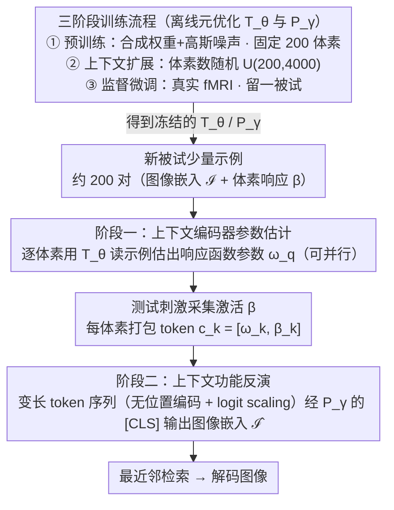

# Meta-learning In-Context Enables Training-Free Cross Subject Brain Decoding

**会议**: CVPR 2026  
**arXiv**: [2604.08537](https://arxiv.org/abs/2604.08537)  
**代码**: [https://github.com/ezacngm/brainCodec](https://github.com/ezacngm/brainCodec)  
**领域**: 3D视觉  
**关键词**: 脑解码, 元学习, 上下文学习, fMRI, 跨被试泛化

## 一句话总结

提出 BrainCoDec 框架，通过两阶段层级式上下文学习（先为每个体素估计编码器参数，再跨体素聚合做功能反演），实现了无需微调即可泛化到新被试的 fMRI 视觉解码，Top-1 检索准确率从 MindEye2 的 3.9% 提升到 22.7%。

## 研究背景与动机

1. **领域现状**：基于 fMRI 的视觉解码已取得显著进展——通过学习脑活动到视觉语义空间的映射，结合条件生成模型可以从脑信号重建观看的图像。MindEye2 等方法在单被试设置下已达到高保真重建。

2. **现有痛点**：当前模型无法跨被试泛化。由于个体间神经信号的巨大差异（解剖结构、功能组织、神经可塑性等），为每个新被试需要重新训练或微调专属模型，这需要大量数据采集和计算资源。

3. **核心矛盾**：跨被试的神经表征差异使得为一个人学到的映射函数对另一个人无效。现有方法要么依赖解剖对齐（flatmaps），要么需要 1D pooling 或表面学习，但都隐式或显式地需要解剖配准。

4. **本文目标** 实现零微调的跨被试视觉解码：仅通过少量示例（如 200 张图-脑配对）即可适配新被试，且不需要解剖对齐或刺激重叠。

5. **切入角度**：将脑解码重新定义为编码模型的功能反演问题——先用上下文学习估计每个体素的前向模型参数（图像→脑活动），再反演这个前向模型来解码图像。

6. **核心 idea**：用元优化的 Transformer 在上下文中学习新被试的体素级编码函数，然后通过跨体素的上下文聚合进行功能反演解码，全程无需梯度更新。

## 方法详解

### 整体框架

BrainCoDec 想解决的核心难题是：脑解码模型为什么换个人就失灵？根源在于每个人的体素（脑活动最小单元）调谐特性都不一样，一个被试学到的"脑活动→图像"映射对另一个被试无效。本文的破题方式是不直接学这个映射，而是把解码重写成"先建编码模型、再反演"两步——阶段一用上下文学习为新被试的每个体素现场估计出它的前向响应函数（图像→该体素激活），阶段二再把所有体素的响应函数连同新刺激下的激活值一起喂进另一个 Transformer，跨体素聚合反推出图像嵌入。整条链路全靠前向推理，没有一次梯度更新，因此适配新被试只需要给它看几百对"图-脑"示例。而支撑这套推理的两个 Transformer（阶段一的 $T_\theta$、阶段二的 $P_\gamma$）则由一套借鉴 LLM 范式的三阶段训练流程离线元优化而成。下图给出从离线训练到新被试两阶段推理的完整数据流：

### 关键设计

**1. 阶段一：上下文编码器参数估计——把"理解一个体素"变成一次前向推理**

跨被试失效的直接原因，是没人能预先知道新被试某个体素到底对什么视觉内容敏感（面孔？场景？还是边缘纹理）。BrainCoDec 沿用 BrainCoRL 的做法，对目标体素 $v_q$ 收集一组上下文配对 $\{(\mathcal{I}_t, \beta_{t,q})\}_{t=1}^n$，其中 $\mathcal{I}_t$ 是图像嵌入（CLIP / DINO / SigLIP），$\beta_{t,q}$ 是该体素对第 $t$ 张图的真实响应，再让一个元优化过的 Transformer $T_\theta$ 把这堆示例直接读成该体素的响应函数参数：

$$\omega_q = T_\theta\big(\{(\mathcal{I}_t, \beta_{t,q})\}_{t=1}^n\big)$$

这一步对所有感兴趣的体素独立重复。它之所以能省掉微调，是因为"这个体素是什么角色"的信息已经全写在上下文示例里——模型不是去拟合参数，而是从示例里**读出**参数，新被试来了换一批示例即可。

**2. 阶段二：上下文功能反演（Contextual Functional Inversion）——从一堆前向模型反推回图像**

有了每个体素的前向函数还不够，真正要的是反过来：给定一次新刺激下的全脑激活，推出被试看到的是什么。传统反演要解一个"体素数远大于嵌入维度"的过定线性系统，既脆弱又无法纠正前一阶段的估计偏差。本文改成学习式反演：把每个体素打包成一个 token $c_k = [\omega_k, \beta_k]$（它的响应函数参数拼上当前激活值），所有体素 token 组成一条变长序列送入 Transformer $P_\gamma$，用 [CLS] token 输出图像嵌入 $\hat{\mathcal{I}}$。这里刻意不加位置编码以保证对体素顺序不变，并用 logit scaling $\alpha_{\text{scaled}} = \frac{\log(l)\cdot q\cdot k}{\sqrt{d}}$ 来稳住变长上下文（$l$ 为序列长度）。学习式反演的好处是天然处理欠定系统，还能在聚合时顺手补偿阶段一留下的估计误差。

**3. 三阶段训练流程——从合成噪声一路过渡到真实 fMRI**

直接在真实 fMRI 上从头训这套层级模型，数据量远远不够。本文借鉴 LLM 的训练范式分三段走：先**预训练**，用合成权重加高斯噪声模拟体素响应、固定 200 个上下文体素，让模型在海量廉价信号上学会"读示例估参数、聚合反演"的基本套路；再做**上下文扩展**，把上下文体素数改成 200–4000 随机采样，逼模型适应任意长度的输入；最后**监督微调**，在真实 fMRI 上用留一被试交叉验证收尾，弥合合成与真实之间的域差距。这条流水线的价值在于：大规模训练信号来自不要钱的合成数据，泛化能力来自变长上下文训练，真实感来自最后一段微调。

### 一个完整示例

以适配一个全新被试、用 CLIP backbone 为例走一遍：先给被试看 200 张图，采集到 200 组"图像嵌入-体素激活"配对作为上下文。阶段一拿这 200 对示例，逐个为目标 4000 个体素各跑一次 $T_\theta$，得到 4000 套响应函数参数 $\omega$（这一步可并行）。换一张未见过的测试刺激，采集这 4000 个体素的激活值 $\beta$，与各自的 $\omega$ 拼成 4000 个 token $c_k=[\omega_k,\beta_k]$，连成一条长度 4000 的序列。阶段二的 $P_\gamma$ 读进整条序列，从 [CLS] 输出一个图像嵌入 $\hat{\mathcal{I}}$，再到候选图库里做最近邻检索就得到解码结果——全程没有任何反向传播。

### 损失函数 / 训练策略

训练用混合余弦-对比损失 $\mathcal{L} = \mathcal{L}_{\cos} + \alpha \mathcal{L}_{\text{infoNCE}}$，前者拉高重建嵌入与真值的方向一致性，后者提供实例级区分性以避免所有输出塌到同一个"平均图"。所有嵌入向量先归一化为单位向量；评估端则统一用最近邻检索（Top-1/Top-5 准确率、Mean Rank、余弦相似度）。

## 实验关键数据

### 主实验

**NSD 数据集跨被试解码（未见被试，CLIP backbone）：**

| 方法 | S1 Top-1 | S2 Top-1 | S5 Top-1 | S7 Top-1 | Mean Top-1 | Mean Top-5 |
|------|----------|----------|----------|----------|------------|------------|
| MindEye2 (w/ 解剖对齐) | 4.11% | 3.82% | 2.87% | 2.51% | 3.90% | 9.81% |
| TGBD | 1.27% | 0.56% | 0.84% | 0.39% | 0.82% | 3.09% |
| **BrainCoDec-200** | **25.5%** | **22.9%** | **23.2%** | **19.2%** | **22.7%** | **54.0%** |

**BOLD5000 跨扫描仪泛化（仅 20 张上下文图像）：**

| Backbone | Top-1 Acc | Top-5 Acc | Mean Rank | Cosine Sim |
|----------|-----------|-----------|-----------|------------|
| CLIP | 31.45±12.80% | 81.67±9.42% | 3.49±0.76 | 0.72±0.02 |

### 消融实验

| 配置 | 余弦相似度 | 说明 |
|------|-----------|------|
| BrainCoDec (留一被试) | ~0.55 | 完整模型 |
| BrainCoDec (无留出) | ~0.56 | 训练含目标被试，仅微小提升 |
| 仅合成预训练 | ~0.25 | 无真实数据差距大 |
| 梯度反演 | ~0.20 | 直接优化效果最差 |

### 关键发现

- **碾压式超越现有方法**：Top-1 从 3.9%（MindEye2）提升到 22.7%，约 6 倍提升，且无需解剖对齐
- **数据效率极高**：仅 200 张上下文图像 + 4000 体素即可接近使用全部 9000 张图的性能
- **跨扫描仪泛化**：在 3T 的 BOLD5000 上直接测试（模型在 7T NSD 上训练），20 张图上下文即达 31.45% Top-1
- **功能区域鲁棒**：掩掉类别选择性区域（如面孔选择性 FFA）对大部分类别影响微小，说明模型学到了分布式表征
- **注意力图可解释**：最后一层注意力权重与已知功能区域高度吻合（面部刺激→FFA/EBA，场景→PPA/OPA/RSC）
- **留一被试 vs 无留出差距极小**：验证了方法的真正跨被试泛化能力

## 亮点与洞察

- **"解码即编码反演"的思路**：将解码问题重构为先估计前向模型再反演，利用了编码模型的结构信息作为强约束。这种思路可迁移到其他逆问题（如图像恢复、信号处理）
- **层级式上下文学习**：两阶段分别在"刺激"和"体素"两个维度上做上下文学习，每阶段有明确的语义——非常优雅的设计。体素级并行+功能反演聚合的架构实现了对变化体素数的自然适应
- **合成预训练管线**：不需要真实 fMRI 数据即可预训练，降低了对昂贵神经数据的依赖。合成数据→变长上下文训练→真实微调的三阶段流程类似 LLM 训练最佳实践

## 局限与展望

- **仅解码图像嵌入**：当前评估限于检索任务，未端到端生成重建图像（虽然论文提到可接 IP-Adapter）
- **上下文大小限制**：200 张图仍需约 20 分钟的 fMRI 扫描时间，对临床应用仍偏多
- **仅限视觉皮层**：当前只使用高级视觉皮层体素，未探索全脑解码的可能性
- **可改进方向**：(a) 结合生成模型实现端到端图像重建；(b) 减少所需上下文数量（如 10-50 张图）；(c) 扩展到 EEG/MEG 等更便捷的神经信号；(d) 探索跨模态解码（视频、语音）

## 相关工作与启发

- **vs MindEye2**: MindEye2 使用 MNI 解剖对齐进行跨被试适配，但 Top-1 仅 3.9%，远低于 BrainCoDec 的 22.7%。关键差异在于 BrainCoDec 通过功能性上下文学习绕过了解剖对齐的需求
- **vs TGBD**: TGBD 尝试模板引导的脑解码但 Top-1 仅 0.82%，说明不利用被试特异性信息的方法效果极差
- **vs BrainCoRL**: BrainCoDec 的阶段一直接采用 BrainCoRL 的编码器参数估计，但创新在于增加了阶段二的功能反演解码器，将编码器的能力转化为解码能力

## 评分

- 新颖性: ⭐⭐⭐⭐⭐ 层级式上下文学习做脑解码的思路极具原创性，"解码=编码反演"的形式化优雅
- 实验充分度: ⭐⭐⭐⭐⭐ NSD 四被试留一交叉验证、BOLD5000 跨扫描仪、ROI dropout、注意力可视化、多 backbone 验证
- 写作质量: ⭐⭐⭐⭐⭐ 动机清晰，方法描述详尽，图表精美且信息量大
- 价值: ⭐⭐⭐⭐⭐ 向通用脑解码基础模型迈出关键一步，实际性能提升巨大，对 BCI 领域意义深远

<!-- RELATED:START -->

## 相关论文

- [\[NeurIPS 2025\] Meta-Learning an In-Context Transformer Model of Human Higher Visual Cortex](../../NeurIPS2025/medical_imaging/meta-learning_an_in-context_transformer_model_of_human_higher_visual_cortex.md)
- [\[AAAI 2026\] CAT-Net: A Cross-Attention Tone Network for Cross-Subject EEG-EMG Fusion Tone Decoding](../../AAAI2026/medical_imaging/cat-net_a_cross-attention_tone_network_for_cross-subject_eeg-emg_fusion_tone_dec.md)
- [\[NeurIPS 2025\] MoRE-Brain: Routed Mixture of Experts for Interpretable and Generalizable Cross-Subject fMRI Visual Decoding](../../NeurIPS2025/medical_imaging/more-brain_routed_mixture_of_experts_for_interpretable_and_generalizable_cross-s.md)
- [\[AAAI 2026\] MindCross: Fast New Subject Adaptation with Limited Data for Cross-subject Video Reconstruction from Brain Signals](../../AAAI2026/medical_imaging/mindcross_fast_new_subject_adaptation_with_limited_data_for_cross-subject_video_.md)
- [\[NeurIPS 2025\] Zebra: Towards Zero-Shot Cross-Subject Generalization for Universal Brain Visual Decoding](../../NeurIPS2025/medical_imaging/zebra_towards_zero-shot_cross-subject_generalization_for_universal_brain_visual_.md)

<!-- RELATED:END -->
