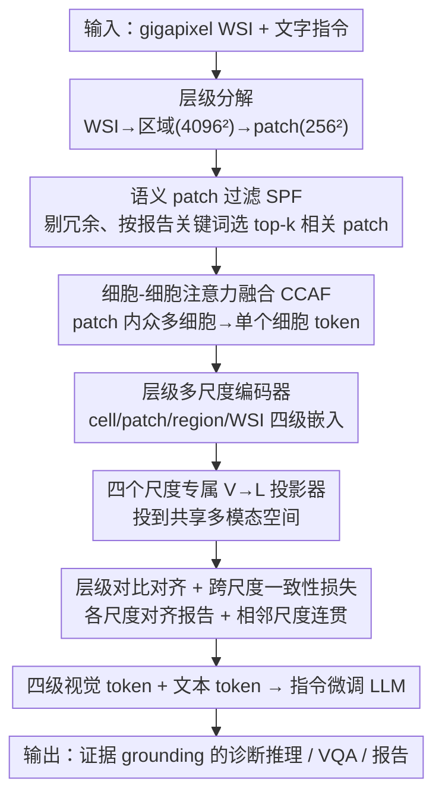

# MLLM-HWSI: A Multimodal Large Language Model for Hierarchical Whole Slide Image Understanding

**会议**: CVPR 2026  
**论文**: [CVF Open Access](https://openaccess.thecvf.com/content/CVPR2026/html/Alawode_MLLM-HWSI_A_Multimodal_Large_Language_Model_for_Hierarchical_Whole_Slide_CVPR_2026_paper.html)  
**代码**: 有（GitHub，论文未给完整链接）  
**领域**: 医学图像 / 计算病理 / 多模态VLM  
**关键词**: 全切片图像、计算病理、层级多尺度对齐、跨尺度一致性、病理 MLLM

## 一句话总结
针对现有计算病理 MLLM 把整张全切片图像（WSI）压成单个向量、丢掉细粒度空间语义的问题，本文提出 MLLM-HWSI，把 WSI 按「细胞=词、patch=短语、区域=句子、WSI=段落」分解成四个尺度的视觉 token，用层级对比对齐损失 + 跨尺度一致性损失把各尺度与病理报告对齐，再喂给指令微调的 LLM，在 6 类病理任务、13 个 WSI 级基准上刷新 SOTA。

## 研究背景与动机
**领域现状**：全切片图像（WSI，常超 10 万×10 万像素）是病理诊断金标准。计算病理（CPath）的 MLLM（如 Quilt-LLaVA、SlideChat、WSI-LLaVA、TITAN、PRISM、HistGen）把视觉编码器接上 LLM，做 VQA、形态学推理、报告生成等任务。当前 SOTA（SlideChat、WSI-LLaVA）的主流做法是：把 patch 级嵌入聚合成**单个 WSI 级表示**，再与整份病理报告对齐。

**现有痛点**：这种「全局单向量」聚合虽然能抓粗粒度上下文，却抹掉了 WSI 内在的层级结构——把整张切片塞进一个向量，模型既无法把报告里的局部描述（如「多形性核」「间质浸润」）grounding 到对应的局部视觉证据，也违背了病理医生的真实诊断流程。

**核心矛盾**：WSI 在生物学和结构上都是**层级**的——细胞形态（核大小、胞质纹理、有丝分裂）构成病理的「词汇」，腺体/导管/实性巢等微结构构成「句法」，多区域整合成全局组织架构构成「篇章」。病理医生的诊断是双向的：先低倍看全局上下文，再到区域、再到细胞，局部发现又反过来修正全局理解。而单向量模型把这套多尺度、双向的推理压成了一次性的全局比对，信息坍缩。

**本文目标**：构造一个显式保留 cell→patch→region→WSI 四级层级的 MLLM，让每个尺度都与病理报告的对应语言层级对齐，从而支持可解释、证据 grounding 的诊断推理。

**切入角度**：把「病理报告」当成一种有层级的语言来解码——单个细胞当词、小 patch 当描述细胞邻域的短语、较大区域当描述组织架构的句子、整张 WSI 当形成连贯疾病叙事的段落。只要让视觉的四级结构与语言的四级结构逐层对齐，模型就能复刻病理医生「细节↔上下文」来回整合的工作流。

**核心 idea**：用尺度专属编码器把每张 WSI 分解成 cell/patch/region/WSI 四级嵌入，用层级对比对齐损失（每个尺度各自与报告文本对齐）+ 跨尺度一致性损失（相邻尺度间语义平滑过渡）联合约束，再把四级视觉 token 与文本 token 融合送进指令微调 LLM，实现多尺度、证据驱动的病理推理。

## 方法详解

### 整体框架
MLLM-HWSI 是一个统一的多尺度视觉-语言对齐框架。输入是一张 gigapixel WSI 和文字指令，输出是可解释、跨尺度证据支撑的诊断回答（VQA / 报告 / 描述）。由于 WSI 直接端到端处理不可行，先做**层级分解**：20× 下切成 4096×4096 的区域 $R_i$，每区域再切成 256×256 的 patch $P_{ij}$（9,642 张 WSI 共抽出 0.356M 区域、91.33M patch）。随后五个组件串起来：① 层级多尺度编码器在 cell/patch/region/WSI 四级抽特征；② 语义 patch 过滤（SPF）剔除冗余 patch、留下与报告相关的异质 patch；③ 细胞-细胞注意力融合（CCAF）把一个 patch 内成千上万个细胞嵌入压成单个细胞 token；④ 四个尺度专属 V→L 投影器把各级特征投到共享多模态空间并与文本对齐；⑤ 投影后的四级视觉 token 与文本 token 拼接喂给 LLM。训练分三阶段，由层级对比对齐损失 + 跨尺度一致性损失驱动。

### 关键设计

**1. 四尺度层级分解与编码：把「细胞=词、patch=短语、区域=句子、WSI=段落」做成四套显式表示**

针对单向量丢掉层级语义的痛点，本文给每个尺度配专属编码器。patch 级用 CONCH 编码器抽纹理与中观结构线索 $f_{ij}=F_{\text{CONCH}}(P_{ij})$；cell 级用 CellViT 做细胞分割并编码核形态，得到每个细胞嵌入 $c_{ijk}$；region 级用 HIPT 层级编码器 $\mathrm{ViT}_r$ 把 patch 表示聚合成区域嵌入 $r_i$（编码腺体组织、间质浸润等微架构依赖）；WSI 级用 $\mathrm{ViT}_{\text{WSI}}$ 把区域嵌入整合成全局表示 $f_{\text{WSI}}$（捕捉肿瘤分布等宏观格局）。最终一张 WSI 的层级表示写成 $F_{\text{WSI}}=\{\{c_{ij},f_{ij}\}_{j=1}^{h_i},r_i\}_{i=1}^{n_r},f_{\text{WSI}}\}$。这套显式四级结构让模型能同时建模细胞形态、区域组织与全局架构，对应病理医生由全局到细节再回到全局的诊断流。

**2. 语义 patch 过滤（SPF）+ 细胞-细胞注意力融合（CCAF）：在 gigapixel 规模下既要省算力又要保住诊断证据**

一张 WSI 有海量 patch（且单张常含超 10 万个细胞），全量处理不可行、还会被同质化背景淹没。SPF 分两步压缩：先在每个区域内算 patch 两两余弦相似度，用阈值 $\tau_i=\mu_i+\sigma_i$ 把「平均相似度过高（即同质冗余）」的 patch 剔掉、保留异质子集 $R_i'$；再把病理报告 $D$ 切成 $M$ 个语义实体、用 CONCH 文本编码器编码，算每个 patch 与关键词的余弦相似度 $s_{ij,m}=\hat f_{ij}^\top\hat t_m$，按整体相关性 $r_{ij}=\frac{1}{M}\sum_m s_{ij,m}$ 选 top-k，最终留下与病理关键词语义对齐的紧凑 patch 子集 $\hat R_i$。这把「该看哪些 patch」交给报告来引导，而非盲目均匀采样。CCAF 解决细胞侧的爆炸：对每个保留 patch，用一个轻量 ViT 在 patch 内细胞嵌入间做交叉注意力，配一个 $[\text{CLS}]_{ij}$ token 汇聚成单个细胞描述子 $c_{ij}=\mathrm{ViT}_{\text{cell-cell}}([\text{CLS}]_{ij},\{c_{ijk}\})$，把成千上万细胞压成一个 token 却保住核多样性与 patch 内形态上下文。两者合起来让 gigapixel WSI 在保留诊断关键证据的前提下变得可计算。

**3. 层级对比对齐 + 跨尺度一致性损失：既要每个尺度对得上报告，又要相邻尺度不「语义漂移」**

只在每个尺度各自和报告对齐还不够——cell、patch、region、WSI 各自对齐很可能彼此脱节（patch 说的和 region 说的对不上），造成跨尺度语义漂移。本文用两类互补损失。**尺度专属对比损失**让每个尺度的投影特征 $z_s$ 与对应报告 token 对齐：$L_s=-\frac{1}{n_s}\sum_i\log\frac{\exp(\mathrm{sim}(z_{s,i},t_i)/\tau)}{\sum_j\exp(\mathrm{sim}(z_{s,i},t_j)/\tau)}$（$s\in\{c,p,r\}$），WSI 级用类似的 batch 内对比 $L_{\text{WSI}}$。**跨尺度一致性损失**则强制由细到粗的表示平滑过渡：$L_c=\frac{1}{2n_r}\sum_{s\in\{c,p\}}\sum_k\|z_{r,k}-\frac{1}{n_s}\sum_i z_{s,k,i}\|_2^2+\frac{1}{n_p}\sum_j\|z_{cj}-z_{pj}\|_2^2$——即让区域表示靠近其内部 cell/patch 表示的均值、让细胞 token 靠近所属 patch token。总损失 $L_{\text{HCA}}=\frac{1}{n_b}\sum_k(L^k_{s\in\{c,p,r\}}+L^k_c)+L_{\text{WSI}}$ 把局部对齐和跨尺度连贯一起优化，保住从细胞到全切片的诊断关系。消融显示一致性损失 $L_c$ 正是防止「尺度各对各、整体散架」的关键。

### 损失函数 / 训练策略
三阶段训练：**Stage 1（层级跨模态对齐）**用 9,642 个 WSI-报告对，更新所有层级编码器（$\mathrm{ViT}_{\text{cell-cell}}$、$F_{\text{CONCH}}$、$\mathrm{ViT}_r$、$\mathrm{ViT}_{\text{WSI}}$）与文本编码器，冻结 V-L 投影器和 LLM，优化 $L_{\text{HCA}}$（50 epoch、lr 1e-3、$n_b$=64、$\tau$=0.02）。**Stage 2（特征空间对齐）**冻结编码器，只在同样 9,642 对上训四个 V-L 投影矩阵（batch 256）。**Stage 3（任务指令微调）**用 175,450 个 WSI 级 VQA 对，联合微调投影矩阵和 LLM（lr 2e-5、batch 128，LoRA rank 128/α 256，DeepSpeed ZeRO-3）。LLM 主干为 Qwen2.5-7B-Instruct，4 张 A100 80GB。

## 实验关键数据

### 主实验
覆盖 6 类 CPath 任务、13 个公开数据集，对比 24 个 SOTA CPath 模型。

| 任务 | 指标 | MLLM-HWSI | 次优（方法） | 提升 |
|------|------|-----------|--------------|------|
| 零样本 WSI 分类（6 数据集均值） | 平衡准确率 BA | **71.86** | 64.56（TITAN） | +7.30 |
| 线性探针分类（6 数据集均值） | BA | **82.48** | 75.68（TITAN） | +6.80 |
| 零样本 WSI 检索（5 数据集均值） | top-1% 准确率 | **85.62** | 80.06（TITAN） | +5.56 |
| WSI-Bench VQA | 准确率 | **97.90** | — | SOTA |
| WSI-VQA | 准确率 | **69.20** | — | SOTA |
| SlideBench-Caption | METEOR | **62.70** | WSI-LLaVA | 显著领先 |

VQA 上四个基准均超此前 SOTA（SlideBench-VQA TCGA 89.60、BCNB 68.70、WSI-Bench 97.90、WSI-VQA 69.20）；caption BLEU-1/2/3/4 = 46.20/32.40/26.70/23.10、ROUGE-L 36.70。报告生成在 WSI-Bench 与 HistGen 上各指标均最优。

### 消融实验
均报告 PANDA/EBRAINS 的 BA 与 WSI-VQA/SlideBench-VQA 的准确率。

| 配置 | PANDA(BA) | EBRAINS(BA) | WSI-VQA(A) | SlideBench(A) | 说明 |
|------|-----------|-------------|------------|---------------|------|
| 仅 WSI 级（HWSI₁） | 0.661 | 0.519 | 0.616 | 0.576 | 已超 WSI-LLaVA/SlideChat |
| +region（HWSI₂） | 0.686 | 0.534 | 0.611 | 0.592 | 加区域 |
| +patch（HWSI₃） | 0.711 | 0.566 | 0.661 | 0.621 | 再加 patch |
| 完整四尺度 | **0.748** | **0.612** | **0.692** | **0.687** | cell+patch+region+WSI |
| w/o $L_c$ 与 $L_s$（仅 $L_{\text{WSI}}$） | 0.661 | 0.519 | 0.616 | 0.576 | PANDA −8.70、EBRAINS −9.30 |
| w/o $L_{\text{WSI}}$（留 $L_s,L_c$） | 0.716 | 0.592 | 0.668 | 0.654 | 各掉 ~3 点 |
| w/o $L_c$（留 $L_s,L_{\text{WSI}}$） | 0.705 | 0.582 | 0.655 | 0.636 | 跨尺度一致性缺失掉点 |

### 关键发现
- **每个尺度都有用、且越多越好**：从仅 WSI 级逐步加 region/patch/cell，所有基准单调提升；反向减尺度（HWSI₄₋₇）均明显掉点，证明四级表示缺一不可，细胞级和 patch 级的细粒度证据对 VQA 尤其重要。
- **跨尺度一致性损失是防散架的关键**：只留 WSI 级损失时，PANDA/EBRAINS 分类掉 8.70/9.30、VQA 掉 7.60/11.10；说明若不强制相邻尺度连贯，各尺度「各对各的报告」会语义漂移。
- **层级对齐的收益跨任务一致**：分类、检索、VQA、报告、描述五类任务上都超 TITAN/WSI-LLaVA 等全局向量模型，印证「显式层级 + 报告语言层级对齐」是稳定且通用的增益来源，而非某个任务的过拟合。

## 亮点与洞察
- **「报告即层级语言」的隐喻落到了损失上**：把 cell/patch/region/WSI 对应词/短语/句/段，不只是叙事比喻，而是直接变成「每尺度对比损失 + 跨尺度一致性损失」的可优化目标，这种把领域直觉编译成损失的做法很干净，也解释了可解释性从何而来。
- **用报告关键词来选 patch（SPF）**：在 gigapixel 规模下，「该看哪里」本身就是难题；让病理报告的语义实体来引导 top-k patch 选择，把无监督的均匀采样换成报告驱动的证据采样，是个可迁移到其他超大图像 MLLM 的思路。
- **CCAF 把「细胞海」压成一个 token**：单张 WSI 超 10 万细胞无法直喂 LLM，用轻量 ViT + CLS 在 patch 内聚合细胞，既保住核多样性又把序列压到可计算，是层级设计能落地的关键工程点。

## 局限与展望
- **多编码器堆叠、训练成本高**：cell（CellViT）、patch（CONCH）、region/WSI（HIPT）多套编码器 + 三阶段训练 + 9,642 对预训练 + 175,450 VQA 微调，pipeline 复杂、复现门槛与算力（4×A100）要求高。
- **依赖现成强编码器**：性能很大程度建立在 CONCH、CellViT、HIPT 等强基座上，方法本身的增益（层级对齐）与基座增益不易完全解耦。
- **细胞分割误差会向上传播**：CellViT 分割若在低质/伪影区域出错，错误会经 CCAF→region→WSI 逐级传播，论文未深入分析这种层级误差累积。
- **数据/指标可比性**：报告生成、VQA 用了多套基准与官方 split，跨论文比较仍需注意各指标定义差异（⚠️ 以原文为准）；部分提升幅度（如 VQA 97.90）需结合具体数据集难度看。

## 相关工作与启发
- **vs SlideChat / WSI-LLaVA（全局单向量）**：二者把 patch 聚合成单个 WSI 向量再对齐整份报告，丢细粒度空间语义。MLLM-HWSI 保留四级结构、逐层对齐报告语言层级，零样本分类均值反超 WSI-LLaVA +10.85、线性探针反超 TITAN +6.80。
- **vs TITAN / PRISM（WSI 级 VLM）**：它们提供强 WSI 级表示但同样偏全局；本文在其之上显式补回 cell/patch/region 的局部证据，检索、VQA、报告均领先，说明「全局上下文 + 局部证据」缺一不可。
- **vs Quilt-LLaVA（patch 级 MLLM）**：Quilt-LLaVA 在 patch 级做对话/描述但不建模 WSI 整体层级；MLLM-HWSI 把 patch 嵌进完整的 cell→WSI 层级里，既有局部又有全局，从而能做 WSI 级开放式推理。

## 评分
- 新颖性: ⭐⭐⭐⭐ 把 WSI 层级结构显式对齐病理报告语言层级、配跨尺度一致性损失，思路清晰且贴合诊断流程；但层级编码与对比对齐均建立在已有组件上。
- 实验充分度: ⭐⭐⭐⭐⭐ 6 任务、13 数据集、对比 24 个 SOTA，尺度消融与损失消融充分，结论一致。
- 写作质量: ⭐⭐⭐⭐ 动机（病理医生工作流）讲得有画面，架构组件交代清楚；符号与多套数据集略密。
- 价值: ⭐⭐⭐⭐ 在多类病理任务上全面刷新 SOTA 且可解释，对计算病理 MLLM 是有实际意义的范式推进。

<!-- RELATED:START -->

## 相关论文

- [\[CVPR 2026\] MedMO: Grounding and Understanding Multimodal Large Language Model for Medical Images](medmo_grounding_and_understanding_multimodal_large_language_model_for_medical_im.md)
- [\[CVPR 2026\] OralGPT-Omni: A Versatile Dental Multimodal Large Language Model](oralgpt-omni_a_versatile_dental_multimodal_large_language_model.md)
- [\[CVPR 2026\] TopoSlide: Topologically-Informed Histopathology Whole Slide Image Representation Learning](toposlide_topologically-informed_histopathology_whole_slide_image_representation.md)
- [\[CVPR 2026\] LLaDA-MedV: Exploring Large Language Diffusion Models for Biomedical Image Understanding](llada-medv_exploring_large_language_diffusion_models_for_biomedical_image_unders.md)
- [\[CVPR 2026\] Turning Pre-Trained Vision Transformers into End-to-End Histopathology Whole Slide Image Models for Survival Prediction](turning_pre-trained_vision_transformers_into_end-to-end_histopathology_whole_sli.md)

<!-- RELATED:END -->
