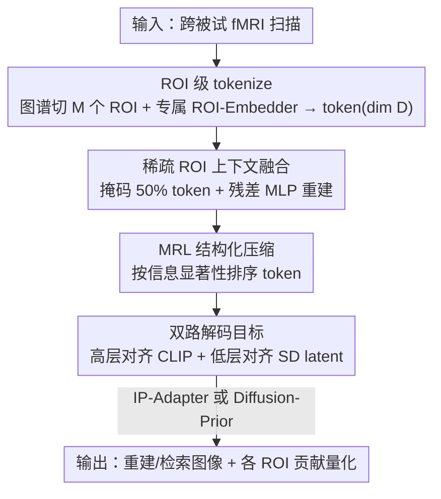

# Modeling the Brain's Grammar: ROI-Guided fMRI Pretraining for Transferable and Interpretable Vision Decoding

**会议**: CVPR 2026  
**论文**: [CVF Open Access](https://openaccess.thecvf.com/content/CVPR2026/html/Liu_Modeling_the_Brains_Grammar_ROI-Guided_fMRI_Pretraining_for_Transferable_and_CVPR_2026_paper.html)  
**代码**: 待确认  
**领域**: 医学图像 / 脑视觉解码  
**关键词**: fMRI 预训练, 脑区 ROI, 视觉解码, Matryoshka 表示, 跨被试迁移

## 一句话总结
ROITok 把 fMRI 跨被试预训练的基本单元从「整脑特征」换成「脑区 ROI token」，用稀疏 ROI 上下文融合学习脑区间的功能协同、再用 Matryoshka 式压缩让 token 按信息量排序，在 NSD / GOD 上拿到更强的低层重建保真度与小样本迁移能力，同时给出每个脑区对解码的可量化贡献，让模型更可解释。

## 研究背景与动机
**领域现状**：从 fMRI 解码人看到的图像，主流是「先在大规模跨被试数据上预训练一个共享解码器，再在新被试上微调」。怎么把不同人的脑信号对齐到一个共享空间，目前有两条路线：一是把 fMRI 体积当成 1D/2D 图像做 ViT 式 patch 切分（如 fMRI-PTE、NeuroPictor）；二是给每个被试配一个专属 adapter，把神经响应投影到共享潜空间，再接一个公共解码器（如 MindEye2、STTM、MindTuner）。

**现有痛点**：patch 路线强行用规则网格切脑，忽略了 BOLD 信号空间分辨率不均、也不尊重大脑的功能拓扑；adapter 路线把整脑活动整体对齐，看不到体素之间的强冗余和脑区内/脑区间的功能相关性，得到的共享特征空间没有显式结构约束，在小样本下表现明显退化。

**核心矛盾**：两条路线都漏掉了一个神经科学常识——大脑是通过一组功能专门化、拓扑有序的脑区（ROI，如 V1/V2 处理边缘朝向、FFA 选择性响应人脸）来处理视觉的。体素级响应在个体间差异大，但 ROI 级表示在解剖和功能上跨被试高度对齐。换句话说，ROI 才是天然、有生物学根据的共享表示基底，而现有方法都没有把它当成建模单位。

**本文目标**：把跨被试预训练「重新围绕 ROI 组织」——以 ROI 为计算单元 tokenize 神经活动，让模型学到跨被试的「表示语法」（representational grammar），既提升迁移性，又能量化每个脑区的贡献。

**切入角度**：把每个 ROI 当成一个上下文 token，封装它分布式的多体素响应模式，让模型架构与大脑模块化组织对齐。

**核心 idea**：用「ROI token + 脑区间稀疏上下文融合 + Matryoshka 压缩」替代「整脑 adapter 对齐」，把无结构的共享空间变成有层次、可解释、抗噪的结构化表示。

## 方法详解

### 整体框架
ROITok 是一个 ROI 引导的 fMRI 预训练框架。输入是某被试的 fMRI 扫描，先用标准脑图谱/功能定位器把它切成 $M$ 个解剖或功能定义的 ROI；每个 ROI 经一个专属线性 ROI-Embedder 投影成统一维度 $D$（实验取 400）的 token。这串 ROI token 进入预训练核心：随机掩码一半 token，用一个 8 层残差 MLP 编码器重建，从而学到脑区间的功能协同（Sparse ROI Context Fusion）；编码器输出再施加 Matryoshka 式压缩，让靠前的 token 优先承载最显著的视觉信息。预训练目标用一个高层模块（对齐 CLIP 视觉 token）和一个低层模块（对齐 Stable Diffusion VAE latent）联合监督。预训练完成后，把条件图像生成模块与表示学习解耦，比较 IP-Adapter 与 diffusion-prior 两种生成路线把 fMRI 特征变成图像。迁移到新被试时只需新训一组 ROI-Embedder，再少量联合微调。

### 关键设计

**1. ROI 级 tokenize：把建模单位从体素/整脑换成脑区**

痛点是体素级响应跨个体差异大、整脑对齐又丢掉了脑区结构。ROITok 给每个被试 $S_i$ 的第 $j$ 个 ROI 训练一个专属线性 ROI-Embedder $E_{i,j}$，把该 ROI 的多体素响应 $R_i^j \in \mathbb{R}^{N \times d_{i,j}}$ 映射成统一维度 $D$ 的 token。由于多数 ROI 只有几百个体素、$D$ 设为 400，多 embedder 不会带来严重计算负担。这一步的意义在于：ROI 级表示在跨被试解剖和功能上天然对齐，把它当 token 等于让模型架构与大脑的模块化组织一一对应，从而能学跨被试的「表示语法」——不同 ROI（V1/V2 的低层边缘 vs FFA 的高层人脸）自然对应视觉层级的不同层，模型据此自动学出大脑的视觉层级结构。

**2. 稀疏 ROI 上下文融合：用掩码重建逼出脑区间功能协同**

ROI token 序列对可解码视觉信息是过完备表示，含大量冗余、且在有噪时彼此互补。为了榨出这些相关性，预训练时随机掩码 50% 的 ROI token、替换成可学习的 `[MASK]` token，再把整串送入 8 层残差 MLP 编码器 $\mathcal{E}$，输出上下文化嵌入 $\mathbf{Z} \in \mathbb{R}^{M' \times D'}$（实验取 $D'=D$）。选残差 MLP 而非注意力骨干，是因为它显存占用低得多、且残差连接让训练更稳。这种「从掩码 ROI 重建」的自监督，强迫模型从其余脑区推断被掩脑区的内容，等于显式建模脑区间的功能依赖，模仿人脑视觉系统的层级组织，充分利用大脑固有冗余，从而显著增强跨被试泛化与抗噪能力。

**3. MRL 结构化压缩：让 token 按信息量从前往后排序**

前作（MindEye2/STTM/MindTuner）对编码器输出空间不加任何结构约束，导致嵌入空间无结构、易过拟合。受 Matryoshka 表示学习启发，ROITok 在训练时对嵌入 $\mathbf{Z}=(\mathbf{Z}_1,\dots,\mathbf{Z}_{M'})$ 施加截断函数

$$F(\mathbf{Z}, m) = (\mathbf{Z}_1, \dots, \mathbf{Z}_m, \mathbf{Z}_{\emptyset}, \dots, \mathbf{Z}_{\emptyset})$$

其中 $m$ 从 $\mathcal{U}\{1,\dots,M'\}$ 均匀采样，$\mathbf{Z}_{\emptyset}$ 是替换被截位置的可学习空 token。这逼迫靠前的 token $\mathbf{Z}_1,\dots,\mathbf{Z}_m$ 优先捕获最具信息量的视觉特征，于是模型在 component token 之间学出一种层次——靠前承载主导模式、靠后逐步补更细但仍有用的细节。这个结构化约束同时改善了像素级重建、抗噪鲁棒性和可解释性（可以问「用前几个 token 能解码出什么」）。

**4. 双路解码目标 + 两种条件生成：分别管语义与像素**

预训练用两个轻量模块联合监督 ROITok。高层模块 $\mathcal{D_H}$（MLP 堆叠）把 fMRI component 对齐到 CLIP 视觉 token $\mathbf{Z}_{clip}$，含一个用 SoftCLIP 损失的检索分支和一个用 MSE 的语义重建分支；低层模块 $\mathcal{D_L}$（CNN 上采样器）用 L1 损失把 component 映射到 Stable Diffusion 的 VAE latent $\mathbf{Z}_{sd}$（分辨率 $4\times64\times64$）。总目标对随机截断后的嵌入同时施加这三项约束（见下方损失）。预训练后把生成模块与表示解耦：diffusion-prior 路线（follow MindEye2）训一个 transformer 扩散模型把 fMRI 特征映到对齐的 CLIP token，再喂给冻结的预训练生成器；IP-Adapter 路线则用轻量线性投影把 component 变成语义 token，经新训交叉注意力注入 SD 的 U-Net。推理用 image-to-image：低层模块预测的模糊重建当初始结构图（提供丰富像素信息），再用扩散模型在 fMRI 引导下精修，image-to-image strength 设 0.75。解耦还大幅省算力——MindEye2 要 8×A100 80G 预训练，ROITok 单张 H800 80G 约 30 小时即可。

### 损失函数 / 训练策略
预训练目标对随机截断 $m \sim \mathcal{U}\{1,\dots,M'\}$ 取期望，叠加高层 MSE、SoftCLIP 检索、低层 L1 三项：

$$\mathcal{L} = \mathbb{E}_{m}\big[\,\|\mathcal{D_H}(F(\mathbf{Z},m)) - \mathbf{Z}_{clip}\|_2^2 + \mathrm{SoftCLIP}(\mathcal{D_H}(F(\mathbf{Z},m)), \mathbf{Z}_{clip}) + \|\mathcal{D_L}(F(\mathbf{Z},m)) - \mathbf{Z}_{sd}\|\,\big]$$

预训练在 7 个被试（留出测试被试）上跑 80,000 步、总 batch 630；之后再训 diffusion prior 80,000 步、IP-Adapter 200k 步。NSD 微调两阶段：先冻结其余模块只训新 ROI-Embedder 5,000 步，再联合微调全参 5,000 步。优化用 AdamW（ROI-Embedder weight decay 0.1、共享参数 0.01），OneCycle 学习率预训练峰值 $1\times10^{-4}$、微调 $5\times10^{-5}$。

## 实验关键数据

### 主实验
在 NSD（每被试约 9,000 训练 / 1,000 测试，4 个完成全部 40 次扫描的被试）上做图像重建与 300-way 检索，并跨数据集迁移到 GOD。下表为 NSD 40 小时全量设置的代表结果（↑越高越好，↓越低越好）：

| 方法 | PixCorr↑ | SSIM↑ | Alex(2)↑ | Incep↑ | CLIP↑ | Image检索↑ |
|------|----------|-------|----------|--------|-------|-----------|
| MindEye2 | .285 | .389 | 96.3% | 95.4% | 93.0% | 91.7% |
| MindTuner | .322 | .421 | 95.8% | 95.6% | 93.8% | 98.9% |
| NeuroSwift | .335 | **.437** | 96.5% | 95.4% | **97.1%** | - |
| **ROITok (IP-Adapter)** | **.475** | .426 | 97.6% | 94.7% | 92.9% | 98.7% |
| **ROITok (Diffusion Prior)** | .470 | .351 | **98.0%** | 95.7% | 95.2% | 98.7% |

ROITok 在两个数据集上都拿到**最高的低层重建保真度**（PixCorr 从 ~.335 跃到 .475），同时高层语义与 SOTA 持平，作者把这归因于稀疏 ROI 上下文融合学到的功能协同。在 1 小时数据的小样本迁移设置下优势更明显：

| 方法（1h 小样本） | PixCorr↑ | Alex(2)↑ | Incep↑ | Image检索↑ |
|------|----------|----------|--------|-----------|
| MindEye2 (1h) | .195 | 84.2% | 81.2% | 79.0% |
| MindTuner (1h) | .224 | 87.8% | 84.8% | 83.1% |
| NeuroSwift (1h) | .253 | 90.7% | 88.6% | - |
| **ROITok (1h, IP-Adapter)** | **.341** | 91.2% | 87.4% | **86.9%** |
| **ROITok (1h, Diffusion Prior)** | .303 | **92.0%** | **88.1%** | 86.9% |

### 消融实验
| 配置 | 影响 | 说明 |
|------|------|------|
| 完整 ROITok | 最优 | 含稀疏 ROI 融合 + MRL 压缩 |
| 改 ROI 掩码比例 | 适中掩码最佳 | Fig.6 显示稀疏 ROI 融合能充分利用脑区间冗余/相关性，掩码过低或过高都不如适中 |
| 去 MRL 结构化压缩 | 像素重建明显变差 | Tab.2 表明结构化表示显著提升像素级重建与抗噪性 |

### 关键发现
- 低层保真度提升最大、最稳：ROITok 的 PixCorr 在全量和 1h 设置下都领先一档，说明 ROI 级建模确实抓到了 fMRI 里细粒度的视觉特征。
- IP-Adapter 与 diffusion-prior 各有所长：IP-Adapter 路线保留低层细节的上界更高，但受限于 fMRI-图像配对数据稀缺，高层语义保真不如 diffusion-prior，二者互补。
- 可解释性是副产物：能量化每个 ROI 对解码的贡献与脑区间功能相关，且多 ROI 互补、组合后解码鲁棒性更好；RSA 分析显示模型自动学出了大脑视觉信息的层级组织。

## 亮点与洞察
- 把「建模单位」从体素/整脑换成 ROI，是用神经科学先验给共享表示空间装上了结构骨架——这比单纯堆数据或加 adapter 更对症，因为 ROI 级表示本身就跨被试对齐。
- 用 Matryoshka 截断逼 token 按信息量排序，巧妙地把「可解释性」和「鲁棒性」做成同一个机制的两面：靠前 token 即主导视觉模式，天然支持「截断到前 k 个还能解码什么」的探针式分析。
- 表示学习与条件生成解耦，不仅省算力（8×A100 → 单 H800），还让同一套 fMRI 特征可以插不同生成器，便于横向比较 IP-Adapter vs diffusion-prior。这个解耦思路可迁移到任何「先学神经表示、再接下游生成」的脑解码流水线。

## 局限与展望
- ROI 切分依赖标准图谱/功能定位器，ROI 定义本身的质量（粒度、个体差异）会直接影响 token 质量；图谱不准时收益可能打折（⚠️ 以原文为准，文中未量化这部分敏感性）。
- 每个被试每个 ROI 都要一个专属线性 embedder，被试数 × ROI 数增长时 embedder 数量线性膨胀，虽然单个轻量，但大规模被试库下的总开销与新被试冷启动仍需关注。
- IP-Adapter 路线的高层语义受配对数据量瓶颈，作者也承认当前实例化难以达到 diffusion-prior 的语义保真——更大规模 fMRI-图像配对或更好的高层对齐可能进一步提升。
- 主要在 NSD/GOD 的视觉相关 ROI 上验证，跨到非视觉任务或更复杂刺激（如编辑 ROI 序列做混合重建，见附录）的泛化仍是开放问题。

## 相关工作与启发
- **vs MindEye2 / STTM / MindTuner（adapter 路线）**：它们用被试专属 adapter 把整脑活动投到共享空间、不加结构约束；ROITok 改在 ROI 级 tokenize 并显式建模脑区间功能协同 + MRL 排序，低层保真和小样本迁移更强，且可解释。
- **vs fMRI-PTE / NeuroPictor（ViT patch 路线）**：它们把 fMRI 映成 2D 网格做 ViT 式 patch，空间切分缺神经科学依据、忽略 BOLD 异质性；ROITok 用功能定义的 ROI 当 token，尊重大脑功能拓扑。
- **vs Matryoshka Representation Learning（MRL）**：借用其「按信息显著性排序嵌入维度」的思想，但迁移到 fMRI component token 序列上，用截断 + 可学习空 token 实现 ROI token 的层次化。

## 评分
- 新颖性: ⭐⭐⭐⭐⭐ 把神经科学的 ROI 先验落成 tokenize + 稀疏融合 + MRL 压缩，视角清晰且自洽
- 实验充分度: ⭐⭐⭐⭐ NSD/GOD 全量与小样本、掩码比例与 MRL 消融都有，但 ROI 图谱敏感性、embedder 扩展性缺量化
- 写作质量: ⭐⭐⭐⭐ 动机到方法逻辑顺，图表清楚；部分公式排版（缓存里）较乱需对照原文
- 价值: ⭐⭐⭐⭐⭐ 低层保真与小样本迁移双赢，又带来可量化的脑区贡献，对脑解码与可解释 BCI 都有参考价值

<!-- RELATED:START -->

## 相关论文

- [\[CVPR 2026\] PGR-Net: Prior-Guided ROI Reasoning Network for Brain Tumor MRI Segmentation](pgr-net_prior-guided_roi_reasoning_network_for_brain_tumor_mri_segmentation.md)
- [\[ICLR 2026\] Towards Interpretable Visual Decoding with Attention to Brain Representations](../../ICLR2026/medical_imaging/towards_interpretable_visual_decoding_with_attention_to_brain_representations.md)
- [\[NeurIPS 2025\] MoRE-Brain: Routed Mixture of Experts for Interpretable and Generalizable Cross-Subject fMRI Visual Decoding](../../NeurIPS2025/medical_imaging/more-brain_routed_mixture_of_experts_for_interpretable_and_generalizable_cross-s.md)
- [\[CVPR 2026\] From Panel to Pixel: Zoom-In Vision-Language Pretraining from Biomedical Scientific Literature](from_panel_to_pixel_zoom-in_vision-language_pretraining_from_biomedical_scientif.md)
- [\[CVPR 2026\] MedKCO: Medical Vision-Language Pretraining via Knowledge-Driven Cognitive Orchestration](medkco_medical_vision-language_pretraining_via_knowledge-driven_cognitive_orches.md)

<!-- RELATED:END -->
