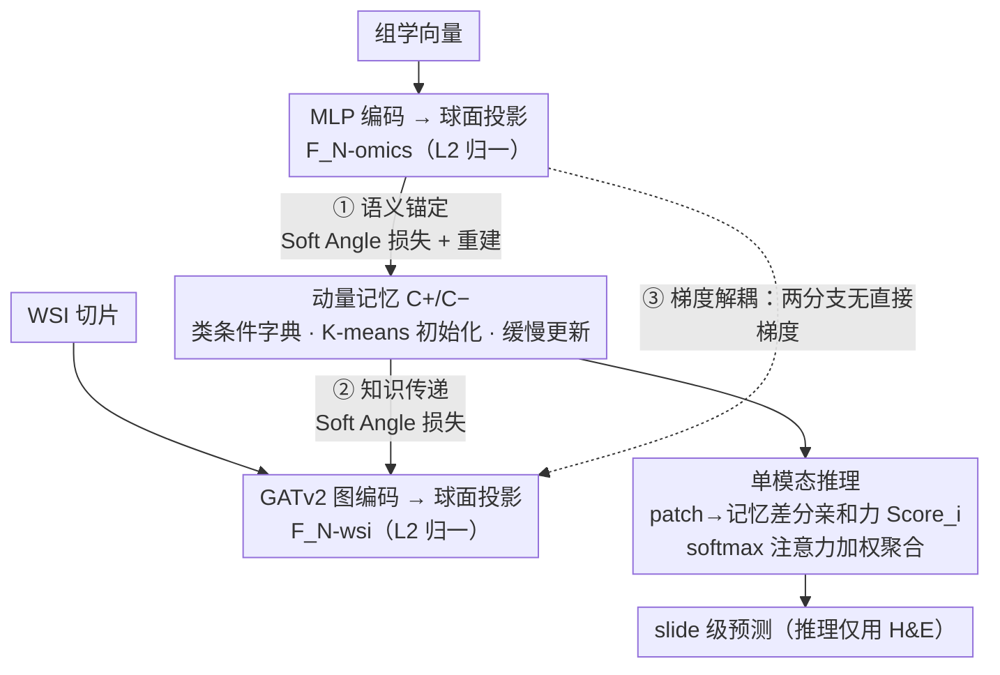

# Momentum Memory for Knowledge Distillation in Computational Pathology

**会议**: CVPR 2026  
**arXiv**: [2602.21395](https://arxiv.org/abs/2602.21395)  
**代码**: [有](https://github.com/CAIR-LAB-WFUSM/MoMKD)  
**领域**: 医学图像  
**关键词**: 知识蒸馏, 计算病理学, 动量记忆, 跨模态对齐, 多实例学习

## 一句话总结

提出 MoMKD，用动量更新的类条件记忆库替代传统 batch-local 特征对齐，实现基因组→病理切片的跨模态知识蒸馏，仅用 H&E 切片推理即可获得基因组级预测能力。

## 研究背景与动机

### 1. 领域现状
多模态学习（基因组学+病理学）在癌症诊断中表现出色，但临床中配对的组学-病理数据稀缺。知识蒸馏（KD）提供了实用方案：训练时利用基因组监督，推理时仅需病理切片。

### 2. 痛点
现有病理 KD 方法采用 **batch-local 对齐**——在当前 mini-batch 内做特征匹配或回归蒸馏。这种方式有三个问题：(1) 监督信号短暂不稳定，仅由当前 batch 定义；(2) 负样本多样性有限；(3) 在 gigapixel WSI 的 MIL 场景下，大量背景噪声 patch 淹没蒸馏信号，泛化能力差。

### 3. 核心矛盾
基因组数据是强预测因子（信号密集），WSI 特征高维稀疏（信号分散）。直接联合训练会导致基因组梯度压倒 WSI 分支；batch-local 对齐在异质模态间不稳定。

### 4. 切入角度
借鉴自监督学习中动态字典的思路（MoCo），引入 momentum memory 作为蒸馏中介，替代 batch-level 直接匹配。

## 方法详解

### 整体框架

MoMKD 要解决的是：临床上很难拿到成对的基因组-病理数据，于是希望训练时借基因组当老师、推理时只看 H&E 切片也能预测出基因组级的信号。它没有让两个模态直接对话，而是在中间架了一座缓慢进化的类条件动量记忆库（正类 $C^+$、负类 $C^-$）。一张 WSI 经 GATv2 图编码器、一段组学向量经 MLP 编码器，各自把特征投到同一个球面空间后，都只跟这座记忆库对齐——组学先把基因组语义"刻"进记忆（① 语义锚定），WSI 再去逼近这座被校准过的记忆（② 知识传递），而两条分支之间没有直接梯度（③ 梯度解耦）。对齐统一用一套软角度损失（Soft Angle 损失）来打分。等记忆积累了跨 batch 的全局语义，推理时丢掉组学分支，仅凭 WSI 特征与记忆的差分亲和力就能加权聚合出 slide 级预测。

### 关键设计

**1. 双分支编码与球面投影：让跨模态相似度只看角度、不看范数**

WSI 先按 $k=8$ 近邻构建空间图，用两层 GATv2 编码出 patch 特征 $F_{\mathrm{wsi}} \in \mathbb{R}^{I \times D}$（$D=256$），再投影并 $L_2$ 归一化到球面空间 $\mathbf{F}_{\mathrm{N\text{-}wsi}} \in \mathbb{R}^{D_N}$（$D_N=128$）；组学向量过 MLP 后同样落到这个球面。之所以要归一化到球面，是因为基因组信号密集、WSI 特征高维稀疏，两者范数量级天差地别——若直接用内积对齐，范数大的模态会主导一切。归一化后内积就等于余弦相似度，对齐只比较角度，跨模态才有可比性。

**2. 动量记忆作为蒸馏中介：用一个稳定的全局字典替掉抖动的 batch 内分布**

传统病理 KD 在当前 mini-batch 内做特征匹配，监督信号短暂、负样本少，又被 gigapixel WSI 里成片的背景 patch 淹没。MoMKD 借了 MoCo "大而稳的字典才能稳定学习"的思路，把记忆库 $\mathcal{C}$（正负类各 $n$ 个组件）当成蒸馏中介：初始随机采 10000 个 patch 做 K-means 得到种子，训练中只靠对齐损失和正则损失缓慢更新。它不是简单的实例缓存，而是被高度压缩的全局语义表示——模型对齐的是这个稳定、缓慢演化的锚点，而不是去追逐每个 batch 里噪声分布，泛化因此更稳。

**3. 间接蒸馏的三步对齐：让记忆先被组学校准，再把校准结果传给 WSI**

蒸馏不是 WSI 直接看组学，而是拆成三步绕着记忆走。第一步语义锚定（Omics Alignment）：组学特征与记忆对齐，并加一项自监督重建约束，把视觉初始化的记忆"灌"进真正的基因组语义。第二步知识传递（WSI Alignment）：WSI 特征再去对齐这座已被组学校准过的记忆，从而被迫学到组学所定义的模态相关性。第三步记忆演化（Gradient Decoupling）：组学分支与 WSI 分支之间没有直接梯度流，只通过记忆间接交互，且分类 head 的梯度不回传到记忆。这层三重隔离是关键——既避免基因组梯度压倒 WSI 分支，又防止分类目标把记忆带偏坍塌。

**4. 软角度对齐损失（Soft Angle 损失）：用 LogSumExp 让梯度流向所有记忆组件、不只是最近的那个**

对齐损失先用 LogSumExp 把特征与某一类全部记忆组件的相似度聚成一个软最大值：

$$\phi(F, C) = \frac{1}{\tau_{\text{agg}}} \ln \sum_{j=1}^{n} \exp(\tau_{\text{agg}} F^T c_j)$$

再取正负类的差分 $\Delta(F; C^+, C^-) = \phi(F, C^+) - \phi(F, C^-)$，用 softplus 把正样本往 $C^+$ 拉、离 $C^-$ 推：

$$L_{\text{align}}(F, y=1) = \text{softplus}(\beta(\text{margin} - \Delta(F; C^+, C^-)))$$

之所以用 LogSumExp 而非硬取 max，是为了让梯度平滑地分摊到该类所有记忆组件，避免只更新最近邻那一个；margin（=0.3）则留出一段安全距离，不要求特征与记忆完美贴合，从而抑制过拟合。

**5. 记忆引导的单模态推理：把记忆当全局基因组锚点来选 patch**

推理阶段不再需要组学分支。每个 patch 特征算它对 $C^+$、$C^-$ 的差分亲和力 $\text{Score}_i$，过一个温度 $\tau=0.2$ 的 softmax 得到注意力权重，再加权聚合成 slide 级表示。由于记忆此时已被组学语义校准，这套打分本质上是在问"哪些 patch 长得像组学定义的阳性模式"，注意力因此会自动聚焦到与基因组信号一致的区域，等价于把训练时学到的组学知识在推理时复现出来。

### 一个完整示例：一张 WSI 走一遍训练与推理

以一例 HER2 阳性切片为例。训练时它被切成 $I$ 个 patch、建成 $k=8$ 近邻图，GATv2 编码后投到球面得到 $\mathbf{F}_{\mathrm{N\text{-}wsi}}$；同一病例的组学向量过 MLP 也落到球面。先走组学侧：组学特征对齐记忆并重建自身，把"HER2 阳性该长什么样"的语义写进 $C^+$、把阴性写进 $C^-$。再走 WSI 侧：WSI 特征去对齐这座已被校准的记忆，softplus 损失把它推向 $C^+$、拉离 $C^-$，而这一步的梯度只更新 WSI 编码器和记忆、不流回组学分支。一个 batch 结束后记忆只挪动一小步，跨成百上千个 batch 才慢慢沉淀出稳定的类语义。推理时换一张只有 H&E 的新切片：组学分支缺席，模型对每个 patch 算 $\text{Score}_i$，肿瘤富集和基质交互区因更贴近 $C^+$ 拿到高权重、脂肪和正常导管区贴近 $C^-$ 被压低，加权聚合后输出 HER2 预测——全程没碰过这例的基因组数据。

### 损失函数 / 训练策略

总损失：$L_{\text{total}} = \lambda_{\text{ce}} L_{\text{ce}} + \lambda_{\text{mse}} L_{\text{mse}} + \alpha_{\text{wsi}} L_{\text{align}}^{\text{wsi}} + \alpha_{\text{omics}} L_{\text{align}}^{\text{omics}} + \lambda_{\text{mem}} L_{\text{mem}}$

- $L_{\text{ce}}$：分类交叉熵（$\lambda_{\text{ce}}=0.5$），仅作用于 WSI 分支
- $L_{\text{mse}}$：组学自监督重建（$\lambda_{\text{mse}}=0.01$），保持组学编码的生物学保真性
- $L_{\text{align}}$：跨模态对齐损失（$\alpha_{\text{wsi}}=0.2$, $\alpha_{\text{omics}}=0.05$）
- $L_{\text{mem}}$：记忆正则化（$\lambda_{\text{mem}}=0.1$），包含 VQ 损失（patch→最近记忆的 MSE）+ 记忆组件间正交约束

特征骨干：UNI v2（冻结），五折交叉验证，TCGA-BRCA 数据集。

## 实验关键数据

### 主实验

**表1：TCGA-BRCA 内部比较（AUC%）**

| 方法 | HER2 AUC | PR AUC | ODX AUC | 类型 |
|------|----------|--------|---------|------|
| ABMIL | 72.9±3.1 | 84.5±2.3 | 79.3±2.5 | WSI-only |
| WIKG | 75.5±5.0 | 84.9±3.0 | 78.3±3.7 | WSI-only |
| TDC | 76.2±2.1 | 84.7±5.3 | 81.0±2.2 | 多模态KD |
| MKD | 77.1±2.3 | 85.1±1.2 | 80.1±1.5 | 多模态KD |
| G-HANet | 76.1±5.6 | 85.0±2.3 | 80.5±1.3 | 多模态KD |
| **MoMKD** | **79.6±0.7** | **87.9±0.9** | **82.3±2.3** | 多模态KD |

MoMKD 在三个任务上全面领先，相对最佳 WSI-only（WIKG）分别提升 +4.1%、+3.0%、+4.0%。

**表2：外部验证（In-house ODX）**

| 方法 | AUC | ACC | F1 |
|------|-----|-----|-----|
| DTFDMIL | 76.2±2.2 | 86.5±1.5 | 63.5±3.9 |
| TDC | 76.5±2.1 | 86.2±3.0 | 63.5±3.2 |
| **MoMKD** | **79.4±0.8** | **87.1±1.7** | **68.0±3.0** |

跨域泛化能力强，AUC +2.9%，F1 +4.5%。

### 消融实验

| 配置 | HER2 AUC(%) | 说明 |
|------|-------------|------|
| WSI baseline | 73.9±3.1 | 无蒸馏 |
| WSI + WSI Alignment only | 75.2±2.4 | 记忆仅由 WSI 塑造 |
| WSI + Omics Alignment only | 75.7±2.5 | 记忆仅由组学校准 |
| 无 Omics Recon | 78.0±3.6 | 组学编码不稳定 |
| **MoMKD (完整)** | **79.6±0.7** | 所有组件协同 |

**固定 vs 动量记忆**：动量记忆在 HER2 上 +4.4%，in-house 上 +5.9%。固定记忆在跨域时性能坍塌（81.9→73.5%），动量记忆保持稳健（82.3→79.4%）。

### 关键发现

1. **动量更新是关键**：固定记忆在源域表现尚可但跨域严重退化，证明动量更新对抵抗分布漂移不可或缺
2. **双模态对齐互补**：组学对齐注入语义，WSI 对齐传递知识，缺一不可
3. **记忆自适应容量**：HER2（困难任务）保持更多活跃记忆组件，PR/ODX 收敛到更少——记忆自动适配任务复杂度
4. **可视化验证**：正类记忆激活肿瘤富集和基质交互区，负类记忆激活脂肪组织和正常导管，证明记忆捕获生物学意义

## 亮点与洞察

1. **将 MoCo 字典思想迁移到跨模态 KD**：优雅地解决了 batch-local 对齐的不稳定问题，记忆作为信息瓶颈同时起到压缩和中介作用
2. **梯度解耦设计精巧**：组学和 WSI 分支仅通过记忆间接交互，分类 head 梯度不影响记忆——三重隔离确保记忆缓慢、稳定演化
3. **方差大幅降低**：MoMKD 的标准差（0.7-2.3%）远低于其他方法（2-5%），说明动量机制带来训练稳定性
4. **可解释性强**：记忆组件→patch 映射可在 WSI 上可视化，便于病理专家审查

## 局限与展望

1. **仅验证二分类**：HER2/PR/ODX 均为二分类，多分类场景（如分子亚型细分）未探索
2. **记忆大小手动设定**：$n$ 的选择缺乏自适应机制
3. **仅用 H&E 染色**：IHC 染色的 WSI 可能提供更多信息（特别是 HER2）
4. **数据量偏小**：TCGA-BRCA 各任务仅 800-1000 例，缺少大规模外部验证
5. **单骨干**：仅用 UNI v2 特征，未探索不同 patch 编码器的影响

## 相关工作与启发

- **MoCo → MoMKD 的迁移**：自监督领域"大而稳定的字典是稳定学习的关键"这一洞见成功迁移到跨模态 KD
- **病理 KD 演进**：TDC（梯度蒸馏）→ MKD（在线多教师）→ G-HANet（重建蒸馏）→ MoMKD（记忆对齐），从 batch-local 走向全局
- **VQ 机制的启发**：记忆正则化中的 VQ 损失（patch→最近记忆）与 VQ-VAE 思想一致，可考虑引入 EMA 替代 stop-gradient

## 评分

⭐⭐⭐⭐ (4/5)

将 MoCo 字典思想创新性地引入跨模态 KD，梯度解耦和间接蒸馏设计精巧。三个任务+外部验证+消融+可视化实验充分，但数据规模偏小。为计算病理学中的跨模态蒸馏提供了新范式。

<!-- RELATED:START -->

## 相关论文

- [\[CVPR 2026\] From Infusion to Assimilation Distillation for Medical Image Segmentation](from_infusion_to_assimilation_distillation_for_medical_image_segmentation.md)
- [\[NeurIPS 2025\] Revisiting End-to-End Learning with Slide-level Supervision in Computational Pathology](../../NeurIPS2025/medical_imaging/revisiting_end-to-end_learning_with_slide-level_supervision_in_computational_pat.md)
- [\[CVPR 2026\] Forging a Dynamic Memory: Retrieval-Guided Continual Learning for Generalist Medical Foundation Models](forging_a_dynamic_memory_retrieval-guided_continual_learning_for_generalist_medi.md)
- [\[CVPR 2026\] KAMP: Knowledge-Anchored Multimodal Pretraining Framework for Medical Image Representation](kamp_knowledge-anchored_multimodal_pretraining_framework_for_medical_image_repre.md)
- [\[CVPR 2026\] PDD: Manifold-Prior Diverse Distillation for Medical Anomaly Detection](pdd_manifold-prior_diverse_distillation_for_medical_anomaly_detection.md)

<!-- RELATED:END -->
