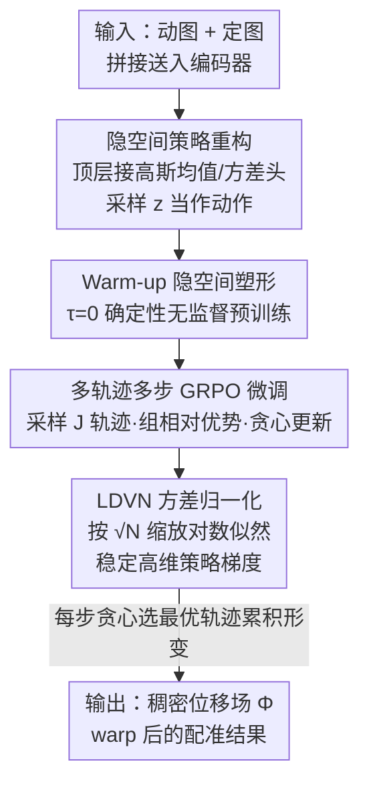

# MorphSeek: Fine-grained Latent Representation-Level Policy Optimization for Deformable Image Registration

**会议**: CVPR 2026  
**论文**: [CVF Open Access](https://openaccess.thecvf.com/content/CVPR2026/html/Zhang_MorphSeek_Fine-grained_Latent_Representation-Level_Policy_Optimization_for_Deformable_Image_Registration_CVPR_2026_paper.html)  
**领域**: 医学图像配准 / 强化学习  
**关键词**: 可变形配准, GRPO, 隐空间策略优化, 弱监督, 标签效率

## 一句话总结
MorphSeek 把可变形医学图像配准重新定义为「在编码器隐空间里做策略优化」——在 U-Net 编码器顶层接一个高斯策略头把隐特征当作可采样的动作，先无监督 warm-up 稳定隐空间，再用 GRPO 做多轨迹多步弱监督微调，配合 LDVN 让上万维隐空间里的策略梯度稳定下来，在三个 3D 配准基准上用极少标签把 Dice 提了 2–4%、把折叠率（NJD）降了 30–60%。

## 研究背景与动机
**领域现状**：可变形图像配准（DIR）要为两张 3D 医学图像建立体素级对应关系，输出一个稠密位移场 $\Phi \in \mathbb{R}^{3\times H\times W\times D}$。深度学习时代主流是 VoxelMorph 这类 U-Net 编码器-解码器，一次前向直接把图像对映射成位移场，又快又准。

**现有痛点**：两个老大难。其一是**标签极度稀缺**——稠密体素级监督在医学场景几乎拿不到，多数模型只能退回到基于图像相似度的无监督损失，但相似度对局部边界、细微结构的约束很弱，复杂大形变根本对不齐。其二是**单次前向的天花板**——一次推理只能拟合全局结构差异，遇到胸腹这类大尺度非刚性形变，局部边界和几何细节恢复不出来。

**核心矛盾**：要解决大形变得做「由粗到细」的多步优化，强化学习（RL）的马尔可夫决策过程天然契合这种逐步细化。但**把整个稠密形变场当作动作空间是灾难性的**：百万维动作让显存和采样成本爆炸，所以已有 RL 配准要么被困在低维刚性变换，要么像 SPAC 把图像对压成 64 维计划——压得太狠又丢掉了空间细节。问题的根本在于：怎么既保留细粒度空间信息，又把探索从稠密场转移到一个训练友好的低维（其实是结构化）空间。

**本文目标**：在有限标签下稳定求解高难度大形变配准，同时让 RL 真正能在 3D 稠密预测上跑起来。

**切入角度**：作者的关键观察是——不必在百万维形变场里做 RL，可以**退一步到编码器顶层的隐特征**。隐特征已经被网络压成了 $C_L\times H_L\times W_L\times D_L$ 的紧凑表示，又保留了空间结构，把它做成可采样的随机分布、当作策略动作，既细粒度又可训练。

**核心 idea**：用「编码器隐空间上的高斯策略 + warm-up 稳定 + 多轨迹多步 GRPO + LDVN 方差归一化」代替「直接在稠密形变场上做 RL」，实现可扩展、骨干无关的逐步配准优化。

## 方法详解

### 整体框架
MorphSeek 是一个可以套到任意编码器-解码器配准模型上的**训练范式**（论文以 U-Net 为例），把可变形配准统一表述成隐空间策略优化。它分三个阶段串行：(A) **RL 友好重构**——在编码器顶层装两个高斯卷积头，把确定性的顶层特征 $f_L$ 改造成一个可采样的隐分布，并把编码器和解码器解耦（保留 skip 连接）；(B) **无监督 warm-up**——把温度 $\tau$ 设为 0 退化成确定性变量，用无监督损失预训练，把解剖信息先压进均值码、塑造一个稳定的隐空间结构；(C) **GRPO 弱监督微调**——把编码器的随机输出分布当作策略 $\pi(z\mid\mu,\sigma)$，每步采样一组轨迹、用分割标签算奖励、做组相对优势的策略更新，由粗到细地反复复用稀缺标签，配合 LDVN 把高维隐空间里的对数似然方差压住。

### 关键设计

**1. 隐空间高斯策略：把上万维形变场的探索退到编码器顶层**

直接把稠密形变场当 RL 动作会让显存和采样成本爆炸，这是 RL 配准只能停在低维刚性变换的根因。MorphSeek 的做法是在 U-Net 编码器顶层特征 $f_L\in\mathbb{R}^{C_L\times H_L\times W_L\times D_L}$ 上接两个 $1\times1$ 卷积头——均值头 $W_\mu$ 和对数标准差头 $W_{\log\sigma}$——把这个确定性张量参数化成一个多元高斯 $\mathcal{N}(\mu,\sigma^2)$。为稳住训练，对输出做约束与裁剪：$\mu=\tanh(W_\mu(f_L))\cdot\lambda_{\text{scale}}$，$\log\sigma=\mathrm{clip}(W_{\log\sigma}(f_L),\sigma_{\min},\sigma_{\max})$，并引入温度 $\tau>0$ 调控探索强度，用重参数化采样隐变量：

$$z=\mu+\tau\cdot\sigma\odot\epsilon,\quad \epsilon\sim\mathcal{N}(0,I)$$

然后把解码器输入从原来的 $f_L$ 换成采样得到的 $z$：$\Phi=D(\{f_1,\dots,f_{L-1},z\})$。这一步只加了两个 $1\times1$ 卷积头（全模型 <3% 参数），却让「采样一个隐向量」等价于「在形变空间里走一步」——既保留了 $f_L$ 的细粒度空间结构，又把探索从百万维降到了几万维的隐空间，且与骨干无关。

**2. 确定性 warm-up：先把解剖信息压进均值码，防止策略采样时塌缩**

如果一上来就在随机隐空间里做 GRPO，策略梯度会剧烈震荡、对超参极度敏感、容易产生非物理形变。MorphSeek 先在无标签数据上预训练编码器和解码器，且**把温度设为 $\tau=0$**（即 $z=\mu$）做确定性 warm-up，逼着网络把解剖信息先写进均值码，经验上能显著降低后验塌缩风险、保住 GRPO 探索阶段需要的随机输出方差。warm-up 的目标是无监督损失加一个对高斯头的 KL 惩罚：

$$L_{\text{warm}}(\theta)=L_{\text{sim}}(I_f,I_m\circ\Phi)+\lambda_{\text{reg}}L_{\text{reg}}(\Phi)+\beta_{\text{KL}}L_{\text{KL}}\big(q_{\theta_E}(z\mid f_L)\,\|\,\mathcal{N}(0,I)\big)$$

作者明确把 warm-up 定位成「先验塑形与降本」阶段：它不一定抬高最终天花板，但把达到同等精度所需的时间、算力和不稳定风险大幅压下来。实测（TransMorph 骨干、20 次独立训练）warm-up 把稳定收敛成功率从 33% 抬到 79%、平均收敛 epoch 从约 120 降到 75。在 GRPO 阶段，$L_{\text{warm}}$ 还作为正则项保留下来，充当「保解剖」的先验，把优化拉在 warm-up 流形附近，抑制 reward hacking 和数值上讨巧但物理上离谱的形变。

**3. 多轨迹多步 GRPO：让每个标签对被反复复用 $T\times J$ 次**

这是把弱监督和逐步配准紧耦合的核心机制。微调阶段，状态 $s_t$ 是当前配准对 $\{I^{t-1}_m, I_f\}$，动作 $a_t$ 是采样的隐 $z$，$t$ 是一次前向内的细化步，累积形变初始化为 $\Phi_0=\mathrm{Id}$。每步对每个样本采一组 $J$ 条轨迹（靠编码器随机性产生差异），每条轨迹解码出单步形变 $\phi^{(j)}_t$，并算一个标量奖励——Dice 增量加负雅可比行列式惩罚：

$$R^{(j)}=w_{\text{Dice}}\cdot[\mathrm{Dice}(S_f,S_m\circ\Phi^{(j)}_t)-\mathrm{Dice}(S_f,S_m\circ\Phi_{t-1})]+w_{\text{NJD}}\cdot\mathrm{NJD}(\Phi^{(j)}_t)$$

接着对组内奖励做归一化得到优势 $A^{(j)}=\frac{R^{(j)}-\bar R}{\sigma_R+\epsilon}$。这个**逐样本归一化顺带做了隐式难例重加权**：不归一化的话，增益绝对值大的简单样本会主导梯度，标准化后困难解剖对的学习信号才保得住。策略损失 $L_{\text{policy}}(\theta_E)=-\frac{1}{J}\sum_j A^{(j)}\cdot\log\tilde\pi^{(j)}$ 提高高奖励轨迹的采样概率，同时并行算一个可微 soft-Dice 损失 $L_{\text{Dice}}$（用三线性插值的软标签）；注意奖励用硬标签且不回传梯度以忠实反映任务指标，soft-Dice 才提供确定性的可微监督。每步结束**贪心选奖励最高的轨迹** $j^*=\arg\max_j R^{(j)}$ 来更新形变场 $\Phi_t\leftarrow\Phi_{t-1}\circ\phi^{(j^*)}$ 和动图。这样一个标签对在 $T$ 步、每步 $J$ 条轨迹里就产生了 $T\times J$ 次相对监督事件——这正是它标签效率高的来源。与 PPO/TRPO 约束相邻策略比不同，这里用「固定先验信任域」：直接惩罚 $\mathrm{KL}(\pi_{\theta_E}\|\mathcal{N}(0,I))$ 并配目标 KL 调度，因为 warm-up 已经把初始策略放到了 $\mathcal{N}(0,I)$ 附近，所以保持这个 KL 小就能在高维隐空间里既无 critic 又无 ratio 地约束漂移。

**4. LDVN 隐维方差归一化：让上万维隐空间的对数似然不再数值爆炸**

常规骨干的隐维数 $N=C_L\times H_L\times W_L\times D_L$ 动辄上万，远超典型 GRPO 应用。若直接把所有隐维的对数似然相加，组内相对对数似然会数值不稳，削弱探索区分度、把训练带崩。LDVN 给对数似然加一个尺度因子 $s$ 来重缩放：

$$\log\pi(z\mid\mu,\sigma)=-\frac{1}{2s}\sum_{i=1}^{N}\left[\left(\frac{z_i-\mu_i}{\tau\sigma_i}\right)^2+\log(2\pi\tau^2\sigma_i^2)\right]$$

关键在于设 $s\propto\sqrt{N}$（默认 $s=\sqrt{N}$），这样不同隐维数下 GRPO 更新都保持数值稳定，同时**保住组内排序和策略梯度方向**。LDVN 只动策略损失的统计量，不改采样分布 $\pi(z\mid\mu,\sigma)$ 也不动温度 $\tau$——也就是说它纯粹是个让高维稠密预测下 GRPO 能稳的归一化技巧，作者给出了方差分析的理论与实证支撑（细节在附录）。这是把 GRPO 从「几个动作维」迁到「上万隐维」的关键使能件。

### 损失函数 / 训练策略
GRPO 微调的总损失把策略损失、warm-up 正则、soft-Dice 三项合在一起：

$$L_{\text{grpo}}(\theta)=L_{\text{policy}}(\theta_E)+\lambda_{\text{warm}}L_{\text{warm}}(\theta)+\lambda_{\text{Dice}}L_{\text{Dice}}(\theta)$$

训练用 Adam（学习率 1e-4）、batch size 1；warm-up 阶段 $\tau=0$ 走无监督损失，微调阶段 $\tau>0$ 开启采样。跨模态任务（Abdomen MR←CT）把相似度项 MSE 换成 MIND 描述子。

## 实验关键数据

### 主实验
三个 3D 配准任务（OASIS 脑 MRI、LiTS 肝 CT、Abdomen MR←CT），把 MorphSeek 套到 VoxelMorph-L / TransMorph / NICE-Trans 三个骨干上，Trajs/Steps 设为 6/3。

| 骨干 + 设置 | OASIS Dice↑ | OASIS NJD↓ | LiTS Dice↑ | Abdomen Dice↑ | Abdomen NJD↓ |
|------|------|------|------|------|------|
| VoxelMorph-L | 84.77 | 0.15 | 84.97 | 77.96 | 1.05 |
| + MorphSeek | **87.16** | **0.10** | **88.99** | **82.44** | **0.57** |
| TransMorph | 85.89 | 0.16 | 88.31 | 82.37 | 0.84 |
| + MorphSeek | **88.89** | **0.06** | **90.11** | **86.49** | **0.35** |
| NICE-Trans | 86.79 | 0.02 | 88.42 | 83.19 | 0.36 |
| + MorphSeek | **89.02** | 0.02 | **90.47** | **86.51** | **0.32** |
| CorrMLP（对比） | 88.35 | 0.08 | 89.22 | 86.82 | 0.49 |
| SPAC（64维RL） | 78.92 | N/A | 75.38 | 69.29 | N/A |

OASIS 上 Dice 普涨 2–3%、NJD 降约三分之一；更难的跨模态 Abdomen MR←CT 上 TransMorph 涨 4%+、NJD 近乎减半。大部分提升在 Wilcoxon 符号秩检验下显著（p<0.05）。对比把图像对压成 64 维的 SPAC，MorphSeek 高出十几个点，印证了「保留隐空间细粒度」的价值。

### 消融实验
组件消融（OASIS，逐项累加）：

| # | 配置 | 采样 $f_L$ | 弱监督 | Step/Traj | TransMorph Dice↑ | NJD↓ |
|---|------|------|------|------|------|------|
| 1 | Baseline | ✗ | ✗ | 1/– | 76.84 | 0.12 |
| 2 | + 高斯头 | ✓ | ✗ | 1/– | 76.79 | 0.12 |
| 3 | + Dice 损失 | ✓ | ✓ | 1/– | 86.08 | 0.29 |
| 4 | + 多步 | ✓ | ✓ | 3/– | 86.37 | 0.35 |
| 5 | + GRPO（完整） | ✓ | ✓ | 3/6 | **88.89** | **0.06** |

轨迹数 × 细化步消融（OASIS，TransMorph，Dice↑/NJD↓）：

| Trajs\Steps | 1 | 2 | 3 | 4 |
|---|---|---|---|---|
| 2 | 86.71/0.08 | 87.13/0.08 | 87.78/0.08 | 87.94/0.08 |
| 4 | 86.89/0.07 | 87.96/0.06 | 88.26/0.06 | 88.14/0.08 |
| 6 | 87.67/0.06 | 88.72/0.05 | **88.89/0.06** | 88.51/0.07 |
| 8 | OOM | – | – | – |

### 关键发现
- **GRPO 是真正的发力点**：只加高斯头（配置 2）几乎不动性能，证明 RL 友好重构很轻量；只有把多轨迹多步 GRPO 和 LDVN 合上（配置 5），Dice 和 NJD 才同时大幅改善——单纯的 Dice 监督（配置 3）能涨 Dice 却压不住 NJD，说明监督信号没被充分榨干。
- **细化步在第 3 步饱和**：步数从 1→3 稳定涨点，超过 3 步收益饱和且形变场开始出现伪影、NJD 退化——这与「首步建立粗对齐、后续步在同标签下反复加局部约束」的由粗到细设计一致；轨迹数超过 8 直接 OOM。
- **标签效率突出**：TransMorph + MorphSeek 仅约 16 个标注对就有明显增益，约 60 对就逼近满标签性能——用 60% 数据达到满标签 98.5% 的水平，而 baseline 要 80% 标签才到同等水平。
- **warm-up 是稳定器而非天花板**：它把稳定训练成功率 33%→79%、收敛 epoch ~120→75，并防止后验塌缩（塌缩后同输入采样十次 Dice 方差近零）；去掉 $L_{\text{warm}}$ 的相似度项会得到「代理指标好看、解剖糊掉」的失败案例。

## 亮点与洞察
- **「退一步到隐空间」是把 RL 用进稠密预测的关键转译**：不在百万维形变场里硬做 RL，而是把编码器顶层特征做成可采样动作——既保细粒度又可训练，这个降维思路可迁移到分割、光流等其他 3D 稠密预测任务。
- **LDVN 是把 GRPO 从「几维动作」搬到「上万维」的通用使能件**：用 $s\propto\sqrt N$ 缩放对数似然、只动统计量不动采样分布，这套方差控制对任何想在高维隐空间跑策略梯度的工作都有参考价值。
- **$T\times J$ 次相对监督事件**这个视角很巧妙地解释了标签效率：同一个标签对在多步多轨迹里被反复用作「排序裁判」，把稀缺标签的信息量榨到最大。
- **骨干无关、优化器无关**：作为训练范式而非具体架构，套到三种不同骨干都稳定涨点，工程上很有吸引力。

## 局限与展望
- **多步推理时延随步数近线性增长**：虽然单步时延接近原模型、参数 <3%，但要拿到大形变收益就得多步，部署时要在精度和延迟间权衡。
- **轨迹数被显存硬卡在 8 以下**：>8 轨迹直接 OOM，高维隐空间的采样成本仍是天花板，限制了更激进的探索。
- **依赖分割标签做奖励**：虽号称弱监督、标签效率高，但奖励本质是 Dice 增量，完全无标签场景用不了；奖励设计（Dice + NJD 两项加权）也较朴素，复杂解剖下未必最优。
- **大量关键细节在附录**：LDVN 的方差推导、warm-up 各损失的具体形式、超参与硬件都被推到 supplement，正文可复现性打折。

## 相关工作与启发
- **vs SPAC**：SPAC 把图像对压成 64 维计划并靠额外 critic（SAC）稳定，64 维瓶颈丢掉了空间细节，部署也复杂；MorphSeek 用上万维结构化隐空间保住细节，且 GRPO critic-free、ratio-free，实测高出十几个 Dice 点。
- **vs Krebs et al. 的 agent 配准**：他们把动作空间从稠密 DVF 降到 B 样条 PCA 统计形变模型，但需要稠密 DVF 监督（当代不现实）；MorphSeek 只需稀缺分割标签做弱监督奖励。
- **vs LapIRN / RIIR 等级联由粗到细**：这些用固定确定性的级联调度，缺乏可学习的多步决策策略；MorphSeek 用 GRPO 学出自适应的多步探索，且在同样 100 对标签下强于 LapIRN-stage3。
- **vs PPO/TRPO 信任域**：不约束相邻策略比，而是用「固定先验」KL 把策略拉在 warm-up 流形附近，在高维隐空间里更省心也更稳。

## 评分
- 新颖性: ⭐⭐⭐⭐⭐ 「把可变形配准重构成编码器隐空间策略优化 + LDVN 稳住高维 GRPO」是把 RL 真正落到 3D 稠密预测的原创路径。
- 实验充分度: ⭐⭐⭐⭐ 三任务三骨干、组件/轨迹步/标签效率/warm-up 多维消融且带显著性检验，扣分在大量细节推到附录。
- 写作质量: ⭐⭐⭐⭐ 动机链清晰、公式完整、把 warm-up 定位讲得很诚实；正文略依赖 supplement。
- 价值: ⭐⭐⭐⭐⭐ 骨干/优化器无关的训练范式，标签效率和折叠率改善对临床配准很实用，思路可外推到其他稠密预测任务。

<!-- RELATED:START -->

## 相关论文

- [\[CVPR 2026\] Dynamic Stream Network for Combinatorial Explosion Problem in Deformable Medical Image Registration](dynamic_stream_network_for_combinatorial_explosion_problem_in_deformable_medical.md)
- [\[CVPR 2026\] Unleashing Video Language Models for Fine-grained HRCT Report Generation](unleashing_video_language_models_for_fine-grained_hrct_report_generation.md)
- [\[CVPR 2026\] SAT-RRG: LLM-Guided Self-Adaptive Training for Radiology Report Generation with Token-Level Push–Pull Optimization](sat-rrg_llm-guided_self-adaptive_training_for_radiology_report_generation_with_t.md)
- [\[CVPR 2026\] KAMP: Knowledge-Anchored Multimodal Pretraining Framework for Medical Image Representation](kamp_knowledge-anchored_multimodal_pretraining_framework_for_medical_image_repre.md)
- [\[NeurIPS 2025\] PolyPose: Deformable 2D/3D Registration via Polyrigid Transformations](../../NeurIPS2025/medical_imaging/polypose_deformable_2d3d_registration_via_polyrigid_transformations.md)

<!-- RELATED:END -->
